# 2024北京智源大会-生成模型 - P3：Visual Autoregressive Modeling Scalable Image Generation via Next-Scale Predicti - 智源社区 - BV1DS411w7hz

嗯非常感谢李老师邀请我来做这次分享，对呃非常荣幸对本次分享的话，给大家带带来我们最新发表的工作微距，Autograss modeling，Scalub，Image generation。

Will next scale prediction，这工作呢是我们今年4月份发表的，一个新的工作，是一个全新的啊，基于一个语言模型的一个图像生成的框架，对本次的分享的话，分分为五个section。

第一个section的话是我们介绍啊深度生成模型，包括debution model，包括呃language model，对第二个的话是呃，我们借鉴来自于language model的这些成功。

然后吸啊吸取一些啊language model1些成功经验啊，来帮助我们做视觉生成做得更好，包括一些经典的一些方法，Toganization。

next token prediction和scanning row，对第三个section的话，我会介绍就是经典的image organization，包括就是VQV和VAE，包括VAE。

我们来探讨离离散和连续的这个token，之间的一个关系，对对第四个section，我们会正式介绍我们VR的工作，Wage order gressive model。

Next scale prediction，最后的话是会呃，沿着我们这个呃VR或这个框架来探讨，t two i和t to v和unified multimodity，model之间的关系。

对首先我会开展第一个section的介绍，首先的话就是现在的话主流的一些生存模型，包括啊视觉生成模型，还包括早些年2020年之前的干，包括现在大家都非常非常关注VAE或者VQ，V a e。

就是刚刚罗老师介绍的一些，就是啊时空patch或者一些时空的special，Temporal token，对，第三个的话是呃是是以flow base model，最后的话是呃从2021年开始。

open AI提出来的一个diffusion bs，gun开始大火的defusion model，包括呃呃jasson home的一个呃DTPM，或者宋元老师的score based model。

就是这个diffusion model对，然后呃diffusion呃，Diffusion based mo，呃，model的话就是嗯我们可以看到这个呃landscape。

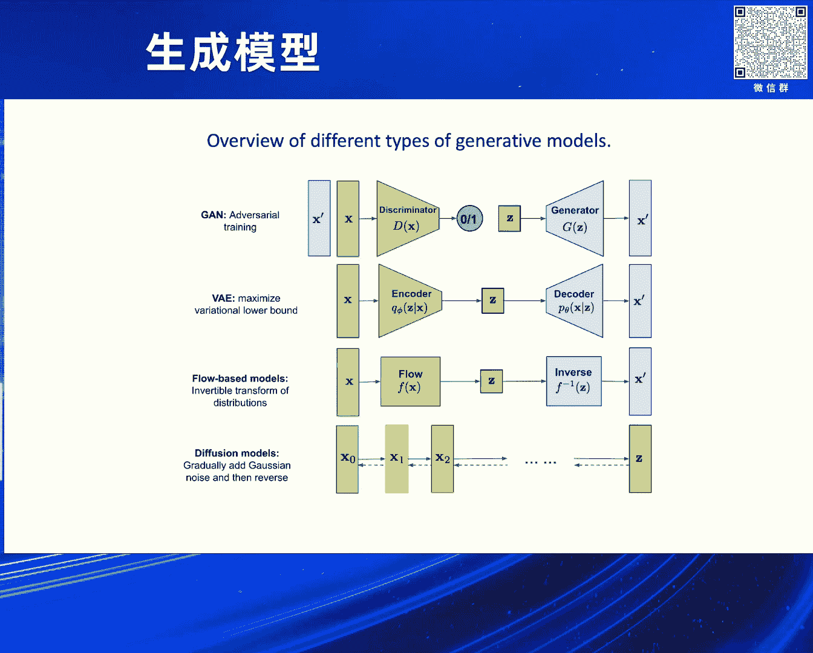

就是包括前些年大火的gun，现在的话大家更多的关注到fusion model，然后啊包括后面我们能看到一些auto grass models，包括energy base models，包括VAE对。

然后diffusion model的话大家都应该比较清楚了，我这块就不会再去赘述了，包括就是这里面的一些有名的工作，包括啊DPPM，包括宋扬老师的a score based model。

包括那个佳明的佳明老师的那个呃，DTIM的一些加速方法对，然后我们重点会围绕着a AR model或者是language model，来介绍我们都做的一系列的一些呃工，就是我们我们探讨的一系列些方法。

和一些借从language model借鉴的一些insight。

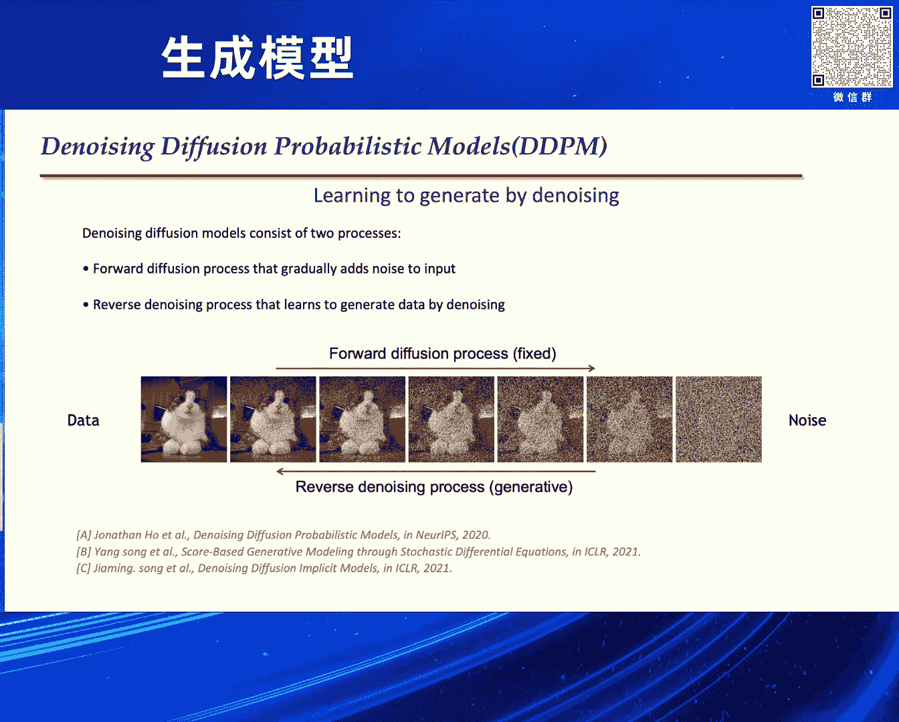

首先我们来说一下呃，像GBT或者a m model是怎么训的，第一个的话就是我们一般来说，AM的话是需要一个organization，包括BPE或者是类似word piece。

第二的话就是我们基于这个organization做next token，Prediction，第三个的话就是我们会去啊，基于这种pretrain model去做一些嗯。

就是instruction tony，最后的话会有些q human feedback来做一个RUHF对，然后呃，首先的话就是我们我们我们会从刚刚的一些language，mode1些经验的话。

我们可以看到就TOGANIZATION啊，next token prediction和scaling law，有了SCLAW之后，我们我们结合这个呃这个字。

next token prediction之间，多数方法可以去把model scaling up，包括scaling up，Model size，包括scaling up computation对。

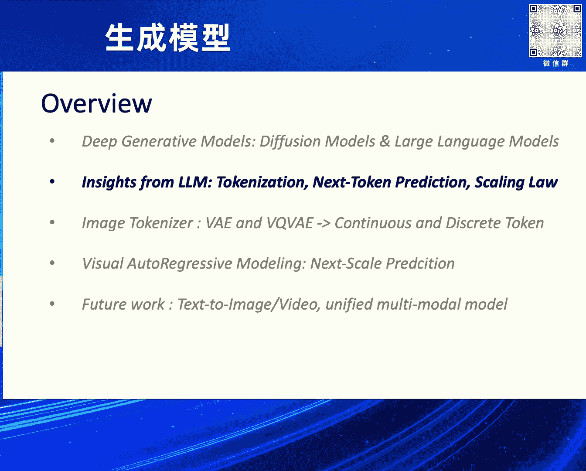

然后我们可以看到就是说language mode，最重要的一部分就TOGANIZATION，包括BPE，包括word peace，它主要的目的呢，就是说我们把与人类的一些语言离散。

因为人类的语言是一些离散化的一些信息，它我包括我们写的字，我们说的话都是离散的，我们可以把这些离散的这语言分子之后，把它映射到一些token i d，有了token i d之后，我可以就可以通过一个呃。

就是总之监督的next token prediction，然后基于这crossing topy和和最大自然优化，去优化这整个model，然后我再把这个整个models getting up起来。

包括我们用更多的一些算力，对最后一点就是我刚刚说的就是BPE的，都可能ZATION或者word peace，这种其实都是语义空间上的，那跟视觉教算视觉不一样，计算机视觉的一些VQVAE或者VAE。

它更多的是一些视算机，居然计算机视觉在底层的一些嗯嗯一些信息，low level的一些信息，但是NLP里面的这些DOGANIZATION，更多是包含些语义信息，对所以包括我们所有的视频生成或图像生成。

包括未来的一些多模态，其实我们都更多的希望是视觉和语义，更多的是做一些衔接，所以这也是计算机视觉目前没有出现，出没有出涌现出这种具有涌现能力的。

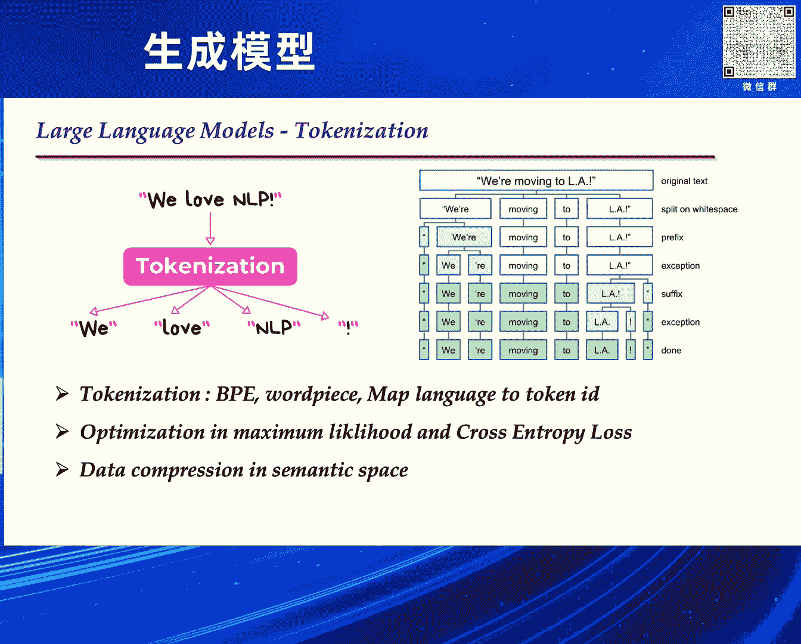

这样的大模型的一个组一个因素对，然后我们我们回到language model这一块，然后他PRETRAINING的话是更多的是通过next token，Prediction，是从大规模的这种呃呃文与呃。

文本的数据里面去学习知识，这是培训阶段，从而的话他培训阶段之后，他可以学到大量的这种语义知识，因为我们已经把这些文本，token映射到token i d了，对，然后呃并且做跟ID之间是有一些呃。

呃分布之间的关系，对第二点就是通过不同PRETRAINING，它可以做到in contest learning啊，有了in contest learning之后呢。

我们就可以transform到一些open task上，比如做一些FUSHORT，或者是做一些嗯相关的一些nonoa task呃，Generalization，这也是跟视觉非常不同的一个一个一个地方。

因为所有的我们是我们的自然语言，处理语言里面的一些任务，全部可以通过语言来描述，通过语言来表述，但计算机视觉这不是不是这样对，因为计算机视觉有些离散的任务，有些连续的任务。

离散的任务包括一些呃detection，包括一些嗯就是checking，或者是一些持续的一些离散的任务，对那连续任务就包括一些segmentation，或者是一些呃就是一些呃flow相关的一些任务。

对那有了这一点差异呢，那就来自来源于就呃就有了另外一个区，极大的区别，就是呃语言这边可以通过一些unified的呃，呃方方式，因为它语言都可以呃，可以生成，就可以用来做生成，也可以用来做理解。

有了这个语言的桥梁之后，就可以unify的生成和理解，但就像视觉做不到对，然后基于这几几点优势，那就有了这个LM的一些scaling up和scale road。

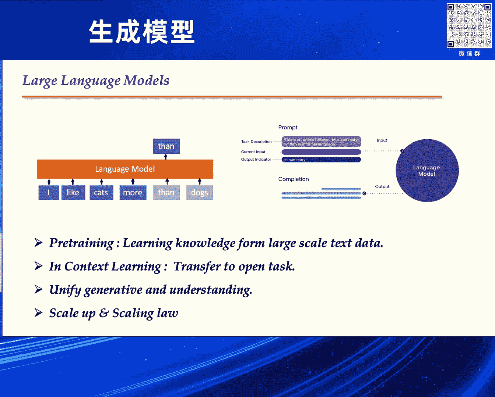

这一些嗯这些现象对或对，然后总结一下的话，就是说，为什么计算机视觉没有出现相关的一些工作，那是主要第刚刚总结下刚刚原因，第一个就是语言是一些人类一些已经孕育了几，通过几千年的一些规律孕育呃。

就总结出来的一些规律，然后它具有高度的一些语义和一些信息，密度比较高，但计算机视觉的话是则没有，这样就计算机视觉里面它具有更多的一些context，语言的话是一维的前后关系的context。

那计算机视觉上包括一些二维的，包括spatial temporal，还有三维的或者四维的，然后另外专业数据有更多的一些模态信息，包括啊我们自已知的视频图像的pixel，包括点云或者包括红外。

然后呃NOP里面就是语言这边的话，可以更多的通过一个呃这种cos的PRETRAINING方式，学习到语义，但计算机视觉的话目前还没有啊，被探讨的是这呃极致，因为计算机视觉的很多啊语义啊。

很多信息可能在底层而言没有语义，因此基于这些呃极大的不同，然后所以language model能够通过这样的一个范式，能够做到一个呃，就是skating up到一个非常不错的效果对。

但是计算机数学这边生成这边更多的是啊，比如说我们这已知的梯度，I t to v，或者是一些你unified的一些深理解的任务，都没有统一做到一个呃。

在token nether space上做到统一生成和理解对，有了这些之后，我们就不禁在想，就是如何能够去借助计算机视觉的一些，特有因素或特有的一些本质去学习。

ALM这边language model这边的一些特呃先进经验，包括AUTOGANIZATION，或者是做一些semantic semantic压缩，包括我们去做一个呃。

基于这种COSTAL的来做一个PRETRA呃，就scanning up的PRETRAINING啊，包括就是嗯呃基于token nether space的一个呃，有呃深层和理解的统一对。

然后首先第一TOKIZATION是最重要的，那我也会介绍，就是图像里面的token anization应该怎么做，首先图像领域啊，就是离散和连续的这个呃，就TOGANIZATION到底是哪个效果好。

呃目前来看的话是呃通过DEFUSION条路线来看，更多的是连续的效果会更好一些，但是这个离散的最近又出现了非常多的新工作。

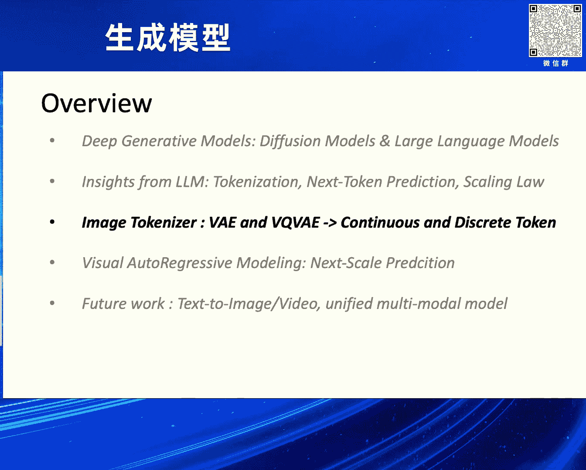

对但这些都绕不开一个工作，就是VAE，VAE的话是2014年提出来的，i clear的一个在艾克利上呃发表的一个工作啊，值得一提的是，他也是拿了今年的嗯。

i clear的test of time的一个最佳奖项啊，就是奖项就是对，然后VAE的思想就很简单，其实就在引空间上加入了kl散度约束呃，kl散度约束，然后使得他能够学习。

就使得他的从AE对一个没有随机性的，这样的东西变成了VAE可以去采样，有具有随机性的这样的呃，这样的一个嗯生成模型对，然后呃有了这个VIE之后呢。

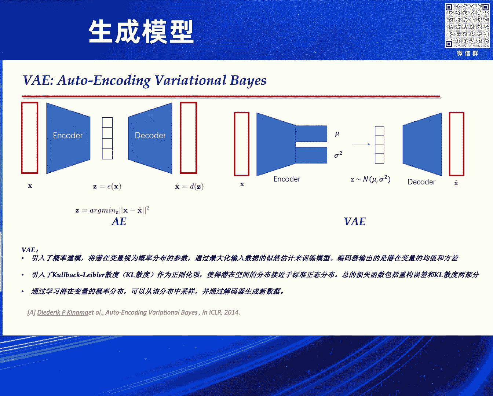

就有衍生出来了啊，另外一个比较有名的工作，他就说是stable呃，就是stable diffusion的前身就是呃latent呃，Diffusion model，Latent。

diffusion model呢，就是在呃VAE的一个这样的一个呃，latin space上进行diffusion，然后它其实是借助了强大的这样的一个VA呃，连续的VA的表示，然后做的非常好。

对那U嗯可以看到就是diffusion的话，目前所有的工作包括latent diffusion，就呃就包括DITDEVISION，Transformer，全部是用到了这种啊，V a e。

就尤其是离散到连续的VIE上面。

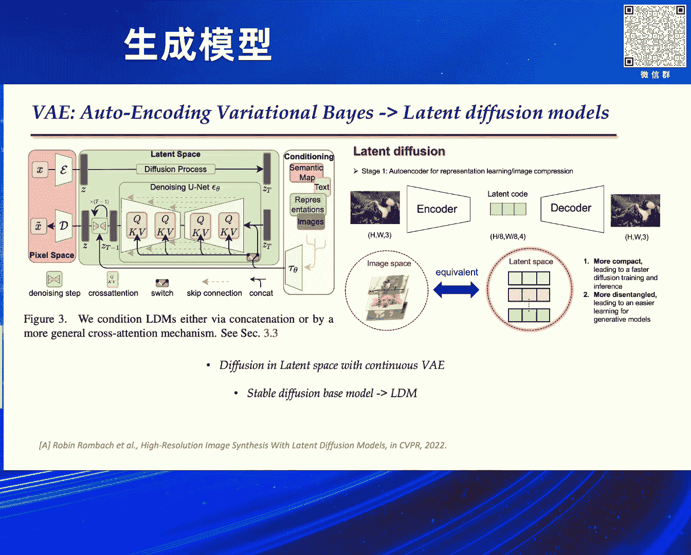

进行一些啊diffusion的一些呃一些模型的训练，对，那我回到了我们刚刚开始说到的，就是呃我们希望是通过language model来做，那language model。

典型的就是现在的一个AAR的language model，就是auto grass language model。

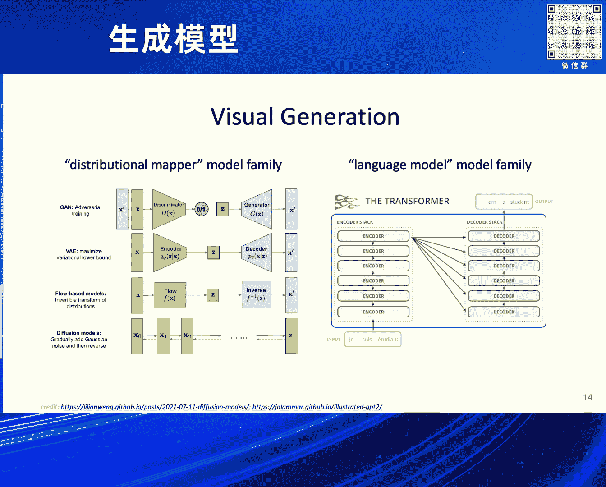

然后呃这一块的话就是比就是open AI，2020年有个工作叫做叫做image g b t，或者叫IGBT，它是在一个像素空间上做那个嗯，做AAR的回归的训练对，然后他的做法就直接是在像素空间上。

基于啊进行一个像素的聚类，然后然后直接是基于g p t style，进行自回归的训练，然后以及或者是呃呃或者是基于呃bert style的进，进行mask language modeling。

那它不仅做了生成，也做了一些下游任务的一些linear evaluation，对他当时更多是做成了这样的一个，PRETRAINING的范式，并没有考虑更多的生成效果，对这是第一点。

第二点的话就是他当时嗯因为在2020年，其实当时的显卡的算力的呃限制，还有就是info open i infa和ta的限制，所以它并没有在大规模的数据集上进行PRETRAIN。

而更多是在一些image net，或者是一些呃比较小的数据集上，比如说C法上面进行验证，所以它的计算量嗯，所以他的话当时因为计算量的问题，所以它只能生成一些相对低清的一些图片。

比如说64×64的这样的一个图片，第三点的话就是呃，在当时还没有先驱者进行一个模型scanning up，包括在视觉上进行scale up的这样的一个验证。

也就没有验证scanning law能够验证呃，就是推动这个后续的发展，对虽然那个OpenAI是呃推出了GPT系列工作，但在IGPT上面它并没有follow up这个工作，也导致这个工作出来之后。

其实嗯嗯在领域内虽然有一定的影响力，但是并没有相关的一些呃，更好的一些工作或者改进对，然后回到我们刚刚说的TOGANIZATION，那它的TOGANIZATION，其实就在像素空间上进行聚类。

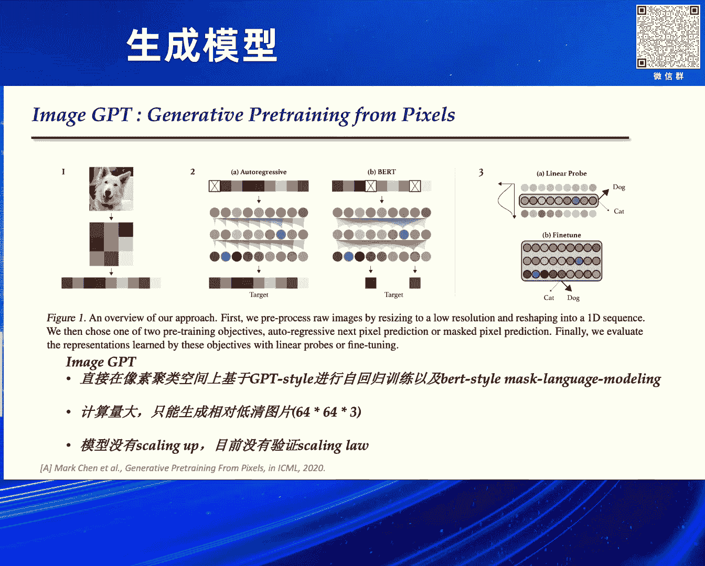

其实并没有太多的语义对，然后有了这样的一个嗯想法之后，其实TOGANIZATION最主要的一点，其实就是要把这个尤其是language model tokanization。

其实就是要把那个呃连续空间的一些特征，就啊映射到一个token i d space上，那很自然的想法就是VQVIE，那VQVAE呢，就是将输入数据应收到一个离散的code book。

那这些code book呢就是可以是可以去更新的哦，等等于啊对哦，这样的话就是VQVAE呢，我在那个呃latin space做了contact之后呢，可以得到一个具体啊具体的code book i d。

有了这样的一个code book i d之后呢，我相当于我一个图像就可以编码成，不同的一个啊一个一系列的code book，就像那那这个过程呢就和language model这块呃。

这块的BPE或者word piece基本是等价了，但是有呃近乎等价，我为什么说近乎呢，因为它可能语义上可能还差点意思对，有了这样的一个呃organization之后。

那我们就有了language model的一个啊优化的一个可能性，因为我们可以把图像从呃连续的空间上去去，映射到一个离散的一个code book上。

那我们就可以通过一个cross centrobloss，以及去大市场去优化它对。

所以我们这块就回到刚刚的landscape，我们可以看到，其实在呃前前面的一些呃，比较受关注的一些diffusion或者干前面啊，大家说的比较关注，但是在后面一个远处地方。

其实有auto regression models也渐渐受到大家关注，对，那这块就要介绍一下一个嗯一个比较有名的工，一个比较有名的工作对，然后这个工作呢就是VQ干。

VQ干呢是2021年的CVPR的oral，对这工作极大的影响力嗯，首先它是第一个基于image organization加auto regressive，transformer来生成图像的一个工作。

当然他没有做t two i是做class condition生成，然后它基于这个框架呢，它就能够生成一个非常高清的，比如720×1080，或者是呃1080×1920这样的一个图像，并且它可以做，就是啊。

这个这个模型可以做下游任务的一系列的，ZUH呃，就是呃implanting out painting，或者是一些呃就是嗯就是super鲁，是入选相关的一些呃呃一些一些下游任务验证。

那具体做法其实比较简单，就是说呃他其实做了一些功呃，我们可能认为表工程上的一些优化，首先第一点就是之前的就是嗯VQVAE，更多就是它它是在这个呃，卷ROR这部分用的是一个PSCN啊。

这部分的话就是VQ干呢。

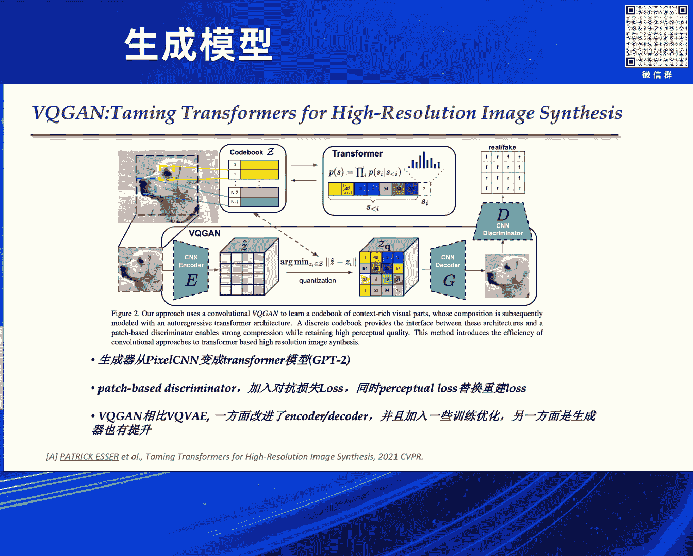

就把它换成了一个选form嘛，g p t two的架构对，那第二呃，第二点呢，就是说他的discriminator加入了一个干LOS，然后同时啊就是perception loss。

替换成了一个重建落实对，那首先那这样的话，其实第一它改善了一个嗯，就是WEQ干这个化改善了一个呃，就是VQEVIE生成画质，因为VQVAE生成画质部分，有部分的明显的糊的现象对。

所以改呃加入了这个呃甘落实之后呢，它其实呃它的生存画质会有明显提升，第二点呢，就是它的又从pixel c n换成了这种AR，transformer这种架构。

从而的话就基于这些优化改进了encoder decoder，同时改进了这个generative的这个transformer，使得它生成有非非常大的一个提啊提升，但值得一提的是，它其实呃。

vo can并不是一个long range的这个a r model，它更多是一个slide window的这样的一个呃，基于slid window attention去生成，基于当时算力的一些因素。

所以他更没有去做这种long range的，AR的序列生成，就是现语言模型这块其实大家都应该提呃，可以关注一些开源的语言模型，都可以做到非常长的context length，但是其实受限于当时的环境。

wq gun它只能做到一个slide window里面生成，那这就有个约束，使得它生成图像其实不能够很好的CONSISTEN，对哦，并且它能很难去呃，就是比如说左上角能够去和右下角去进行一个。

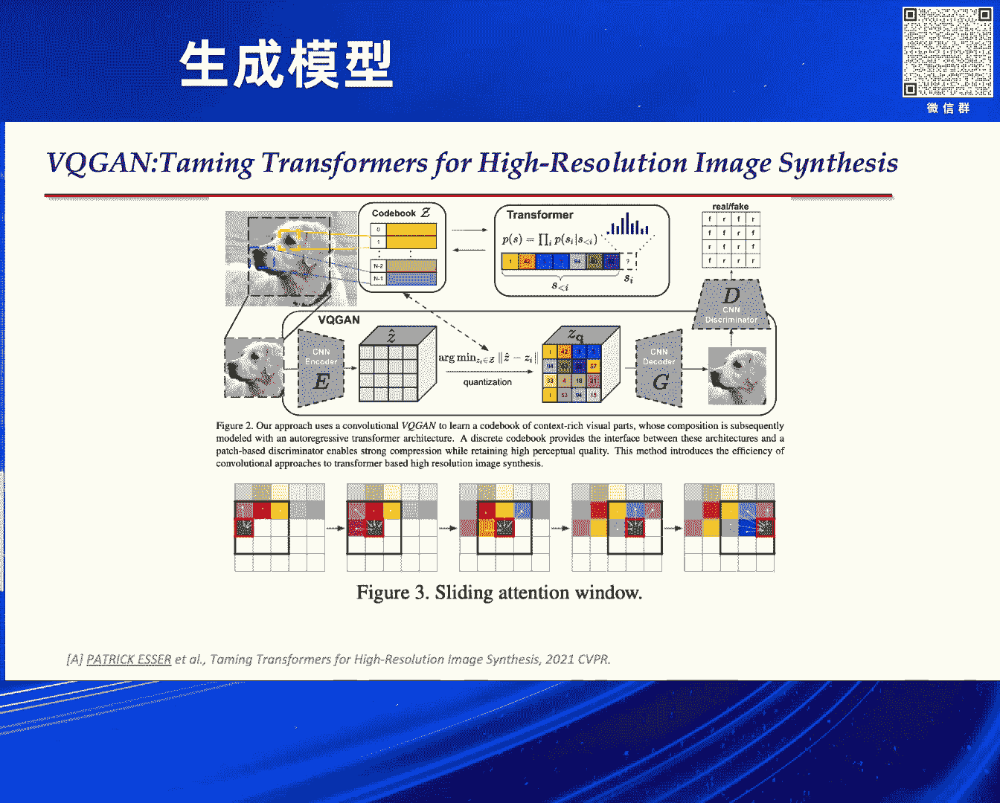

一系列的一些优化，不行哦，对，然后当时的话是在一些学术，benchmark上做了一些验证，包括class condition的这种啊。

image net benchmark可以看到就是呃EMNET上的FD的话，它其实达呃得到了一个明显的一个提升，几乎接近于一个啊，比较早期的一个diffusion的best model，对啊。

包括如果他加了一些呃reject sampling之后，他在FID可以达到一个6。59，这样的一个效果，对，已经快超越了一些呃瓦尼拉的devision model，那另外一个工作呢就是一个呃呃估呃。

蒂夫麦的一个工作，对这是来自DIF麦的，当时研究员就是余家辉老师的一个工作，那这个工作呢其实就是说哦，我我看到了语言模型的一个scanning up的效果，那我是不是可以直接scale v q gun。

这个这种框架，那显很显然是可以的，对它框架也比较简单，就是说呃就是基于一个呃image统IZATION，vi it的维修gun，加上一个auto regressive transformer。

这个工作呢，其实呃就是很就是典型的有点像open AI的风格，就不停的堆算力，堆模型，Size，堆数据，然后我我模型架构很简单，就是这个呃TOGANIZATION加AR这个路线。

那这跟language model几乎一模一样了，对在这工作是在2022年的呃，上半年提出来的，在这个呃ch呃ChatGPT呃，受大家关注之前。

在当时那个年代有人去scaling这个t to ADD model，或者数学生成model是非常难得的，所以这工作，我认为是一个非常具有里程碑式的工作，对他他也是第一个把t to i上。

scaling到20B的这样的一个model，并且是把t to i做了非常work的一个工作，当时呢他就是也是呃超前的思想，他用了一个MOE的model，去做到这个20B的这样的一个呃。

VIT或者是一个a r transformer的架构，然后他用的也是MOE的这样model，对那随着他文文章中做了一些APPLATION，随着model size变大，那它效果会越来越好。

并且可以做到一些text rendering的效果，所以我我认为这个工作，可是在当时的是思想非常超前，对它具备了，现在我们能看到一些lanlanguage model，一些非常多的一些优势，包括MOE。

包括一些scaling up，在2022年的上半年的当时对。

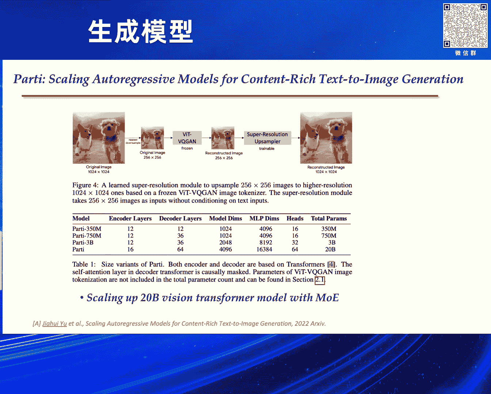

然后有了我有了我们刚刚说的就是啊，TOGANIZATION呃，包括视觉的VQVAE，包括一些language model，Scaling up，包括一些相关的工作之后，我们就在想那这个事情对视呃。

视觉这块一定要follow这个AR这条路线吗，啊其实AR这条这个东呃，这个东西对视觉来说适用吗，其实我们也在内部不停的去探讨或者思考，这样的一个想法，就有了我们这样的一个工作。

微距auto prograss，Model，Next scale prediction，对语言模型像那个g p t la或palm，他是BPE之后经过next token predic个选对。

然后像party这种，它简简单的就是一个呃，就是呃v q v i e to nezation之后利用光啊，也是跟原模型一样，自上而下，自左到右的这样光栅顺序。

但language model是用自回归的方法来预测next token，那是因为语言有先后顺序时候区分，因为语言是一个一维的context，但视觉其实并不是这样，因为视觉我们看东西它是一个整体的。

或者是局呃，整体到局部的这样一个过程，所以我们就在想呃，传统的图像自回归使用一种不符合人类直觉，但是呃呃符合一些计算机处理的顺序，自上而下逐行扫描这光栅顺序来预测图像，token这个真的合理吗。

就是这个地方可能要打个问号对，那我们就在想呃，呃就像party这种，就是我们刚刚说的一个language model的AR全AR，auto regressive这样的一个生成的框架。

那其实我们人看东西一般都是我们从远看东西，会看到一个呃整体的东西，然后慢慢走近，我们会看到整体的这个物体，或者是一个图像的，整体的一个整体到一个局部的这样细节，逐类似逐步放大的过程。

这是比较符合人类直觉的这样一个过程。

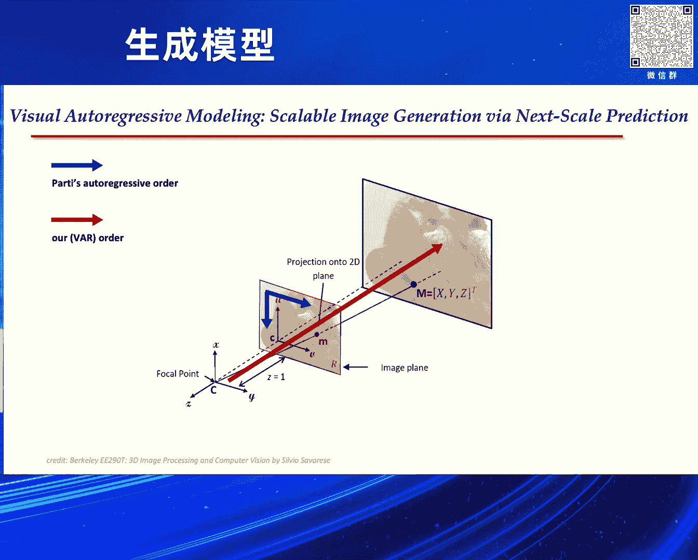

同样的人类在感知图像或者绘画时，往往往往都是先概览全局，再深入细节，这种由粗到细，由整体把握，整体到局部金条的思路啊，思路想的话是非常自然的，有了这样的一个想法之后，那我们就在想，能不能我们在呃。

就是我能不能我们同时借鉴language mode优势，for ganization加AR的方式，去融入计算机视觉的一些诶优一些特特质，包括我们刚刚说的从整体到局部的这个思路，那我们逐步放大这种思想。

那就有了我们这个V9，auto grave model里这样的一个想法的初步，他就是说呃我们可以去逐步的去看这个图图啊，图从慢慢的把图像看整体逐步放大这样子呃。

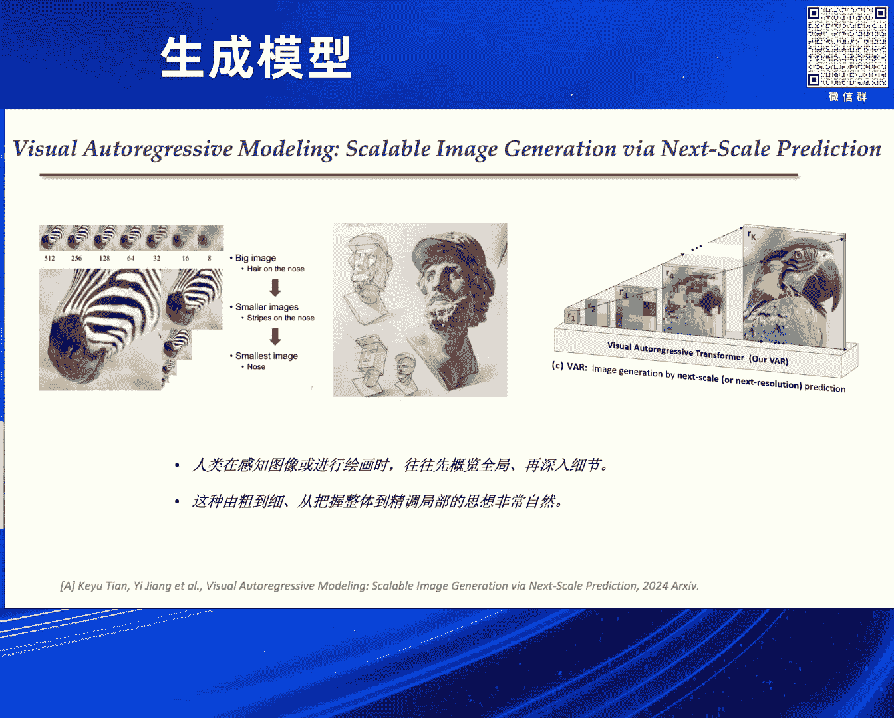

放大这样的一个过程对，然后我我接下来会介绍，具体来说我们是怎么做的，对，首先的话就是呃我我刚刚说了，其实呃我我框架的话，其实我我像这个AI的框架，其实主要是两个组成，一个是DOGANIZATION。

第二个的话是呃，第二个是它的一个ARHANSFORMER，那自然的我们也是一样的，那stage one的话，就是我们需要有一个matter scale的一个image，Organization。

为什么要MARGISCALE呢，因为我们是从一个整体到局部的，所以这个图和NAZATION，必然是它把握一个单尺度到多尺度上的，一个整体的一个呃，有一个一个描述对。

然后第二个stage呢就是说我们会有一个呃，就是g b t style的，像auto grave啊，这样做model来生机啊。

就是来生成这样的一个mari scale image organization，或者mari scale的这样的v q tokens，然后我们去逐步生成这样高清的这种token。

然后最后通过一个organization decoder去还原出来，对那那具体来说的话就是说我们现在有两个station，那第一个station呢就是说我们会有一个呃，我们需要对图像进行一个多尺度的。

这样的一个图呃，呃to ganization，那就是说我们对图像我们先把它一个啊，就是需要转化成一个多尺度的这样的一个，离散的token map，那比比如说它是一个啊多个。

比如说呃就是呃从大概7~8个尺度上，举个例子对，然后他有7~8个尺度上分别做出GANIZATION，那这样的话它有个多次do的token map，然后这是第一步，那第一步离散编码。

第二步的话就是我通过一些呃，就是code book转化成连续的这样一个feature map，然后统一插值到嗯，就最大分辨率上去求和，然后求和后求和后的fish map呢。

通过一些呃就是organization的一些decoder，去重建图片，并且通过重建呃感知和对抗这三个loss，就我刚刚说的一个reconstruction loss。

perception loss和那个gloss来混合训练，训练，这样的一个mari scale的一个一个VQVA啊，V q v i e，那有了第一步之后，那我们就是在想，如何在视觉空间上去自回归的生成。

那很简单，我们一般第一步呢是通过一个起始token，去测出第11的token map，如左上呃，呃就是啊这部分一样，就是我们首先得到一个11的token map，随后每一步呢。

VR呢都会基于历史的所有token map，去预测下一个更大尺度的token map，这种cost to refine的思想，对，那有了to conanization之后呢。

训练阶段就可以使用标标准的一些，交叉熵的损失呃，呃损失loss来监督这些token map的概率预测而产，对啊，这样的话我们就可以看到逐步流程，就是我先生成一个呃，第一个token11生成一个呃。

22的这样的一或者44的token map，然后再生成99的这样的一个token map，注意的是它是一个每个scale上，是一个并行生成的。

但是在scale上是它是一个COSTAL的attention，对那测试阶段的时候，我就可以通过采样得到token map结，结合一些VQVAE的decoder，进行连续化的这种呃连续化这种差值求和。

再通过decode最后生成完整的一个图像，当然里面有很多细节，包括我们借鉴了一个呃就呃rescue呃，Transformer，就呃就是嗯r q transformer，或者RQVAE的思路，对。

包括我们呃借鉴了那个呃就是一啊，借鉴了一些就是嗯DIT的一些架构的，一上的一些一些经验，对，我们可以看我们在标准的benchmark上的一个结果。

首先我们可以看到就是标准的class condition，image net benchmark上，我们测试了不同的model size，结果随着不同的model size。

结果SK呃scaling之后，我们的FID是逐步稳步的下降的，并且我们的这个FID是达到了历呃，达到了SA比比之前的所有的diffusion base model呃。

mask prediction based model呃，AR的呃全呃就是呃AR的选form为based model，都是达到了更好的FID，并且我们呃就是几乎快接近VDATION的FID，这是第一。

第二的话，我们在标准的英internet，512×512的这样的一个呃卡，class condition generation上达到了也不错的一个效果，对。

也会也比之前的master git或者啊DIT的这种呃，affect达到更优，值得一提的是，我们的VIR的框架嗯，就是呃会比传统的这个晚就晚依赖的这种呃，这AR框架在FID上几乎提升了啊，一个数量级。

对这第一点就是我们达到了SOA的performance，在immnet benchmark上对，第二点我们比啊solar的呃，solar的base model会更好，对，第三的话就是呃我们会呃。

我们是一个非常非常快速，因为我们step比较少，所以我们实测的话在1024×1024上，我们我们如果优化的够好的话，可以到呃，一到两秒生成10241024这样的model对。

然后我们也和solar或者stable diffusion的呃，这个贝斯mod d i t做了对比，可以看右上角，在我们的一个奔驰Mark上的一个FID，包括我们呃左上角的话和一个呃。

就是它的一个呃不同的model之间的一个呃，就是FID和，FID和速度，速度的一个对比的一个一个一个表，我们可以看到经过scanning up之后，VR可以达到一个FID。

当然最新的结果我们会更呃更好一些，对他毕竟理论上的一个FID的下限，要要1。78，显著优于DIT当时的效果啊就是2。1对，第二就是我们的速度更快，VR的话只需要不到0。3秒。

就可以生成一个256×256的图像，速度的话是当时的一个呃呃，瓦INA的DIT的45倍，在512上，更是DIT的一个呃一个数量级的一个速度，第三的话是我们有更好的scanning的一个能力啊。

如左如左图所示，DIT在大模型增长到3B7B之后，出现饱和现象，我无法靠近FID下线啊，对所以呃然后我们做了一个VR上，做了一个嗯scanning up的实验，包括它scanning到一个20亿的参数。

性能不断的提升，对哦另外一点就是我们有更高效的数据利用，包括我刚提的VR的话，需要350个epoch就能超进，就能超过DIT1400个epoch效果对。

然后我们也验证了AM上的一些scanning law，对我们验证我们在验证集上的错误率呃，就是验证了token的错误率和crossing topy啊，ROSS随着啊啊。

就是我们scarf模型的一个size，和这个计算量之后，可以得到可预测的下降，这可预测是指我们呈现密率关系或者log，收放后的线性关系，线性关系的话就是把线性相关系数达到啊，就非常高，对咳啊，同样的。

我们去做了一个是刚刚是一个定量量的分析，我们也做了一些定性的分析，我们可以看到啊，左上角或右呃，右边这个图可以看到，随着我们不停的scaling up呃，呃比如说从左到右是scaling up。

Training computer，从上往下是scaling up，这个呃model size我们可以看到就是我们的呃不呃，从横轴呃往右竖着往下的话，我们的model s我们的生存能力会得到逐步的提升。

当然右下角是最好的典型case，就可以看到这个脑电波图对我们不停的去呃，训更久的model啊，包括skating up model size，这个效果会达到呃肉眼可见的提升，对啊。

最后我们这边也做了一些呃zero shot generalization，当然这是一个初步的实验，我们可以在呃一些class condition的啊，上训好的一个VR的全ANSFORM嘛。

在不通过任何的微调的基础上，去泛化到一些生存的任务上，包括一些implanting or painting，和一些class condition editing，这是一些初步的一些实验对。

然后我我总结一下，就是说我们使用了一个多尺度自回归的范式，和基于这个next scale prediction的这样呃，构建了一个全新的生成框架，为视觉的自回归算法提供了一种新的思路。

对第二的话就是VR模型的skin law和zero shot，zero shot转ALIZATION实验验，证，来，来，就是来学习大语言模型所具有的一些优秀特质，对第三点的话。

是我们视觉自回归模型的一个性能突破啊，使用这种典型的GBT风格的次回归的呃，呃就是方法在图像呃生成中，首次超过了这种强大的这种debution model，包括DIT，最后就是因为呃就我们开源了。

就是啊啊就是这个VR的所有的代码，包括v q to ganization和这个呃，呃就是auto aggressive model的这种训练，就来推动这个事啊，就是离呃，离散空间上表示的这种。

视觉智慧规或智慧规范式的这种学习的进步，因为我们知道，就现在VAE或者VQVAE的这种社区啊，其实做的不是很好对，所以我们希望推动这个离散的空间，这个表示的这样的一个呃社区的优化。

可以看到我下面给了个示意图，我们一张图从cost to refine的时候，申请的时候逐步变得高清哦，这是一个在离散空间上去做微觉，就呃visual to gressive。

也就视觉智回归的这样的一个demo对，然后从一开始一个token，到后面的一个1616的token对，然后我们也对比了，就是一个VR和AR和diffusion，以及master get方法的一些比较。

可以看到就是说AR本质上是这种next token，Predict，prediction的话，学习数据内部的某种分布或秩序，那文本它天生是从从左到右的这种因果顺序，从而达到了数据和算法上的一致性。

催生了AIM的这样的一个极大的成功，但是图像或者图片并不难，并并不这样，图像自上而下逐行扫描的顺序，其实并非图像的这种最自呃最自然的顺序，所所以我们感知啊，图就是我们看图像或者看绘画呃。

我们绘画的时候是按照这种由粗到细，由低频到高频的逻辑顺序，这是比较合理的，因此VR观测到了更好的一个呃，一个性能和更合理的生育速度，更完备的这个scanning law对，然后我们也OAR发。

克服了一些AR图像生成一些泛化问题，比如说根据图像的下半部分，来补全的一个上半部分，因为他在训练的时候没有根据嗯，没有没有没有这样的setting对，然后我们也和diffusion model做了对比。

可以看到VR的noisy的方方式更加直观，可解释，因为它是一个模糊到清晰，低频，低频到高频的这样一个过程，第二就是diffusion呃，你diffusion的话就是可以做更多的一些粉呃。

就是呃就是呃distribution的一个呃拟合对，那VR的话它的学习会比diffusion会更加高效，因为它只需要大概17的epoch对，然后和LM类似啊，VR的话是一次向前同时训练所有的事件铺。

但是diffusion的话是每次训练一个time time time step对，所以的话就是说呃VR的话，同和呃和DEVISION都是这种呃多部REFINN的机制，然后修复过往时间不的错误。

但是AR的话生成之后他没有办法ref对，在这样的一个框架下，可以看到就是呃，VR和AR和diffusion和must get it，然后我们来看一下master get的区别。

而VR的这种从cost to refine这种呃方式，have的schedule更加直观和解释，通过小尺度的大尺度，然后得但是must get it是使用贪心的算法思想。

然后VR和diffusion的话都允许这种MARI呃，呃就是mari staff的refine，来修复过往时间步的错误，但must get it是不难对，然后VR和musket都啊有些类似的啊。

就是像就是它的一个速度是是很相近的，但是VR的话更加接近language model，会啊对未来的一个LANGU呃，就是language model的系统一会走走向了更近的一步。

同样的就是我们把我们的一个demo呃呃也开源了，包括model和呃呃checkpoint也开源，到目前为止，大概现在已经有3700个呃，github star对，可以看到就在我们开源之后之后。

以呃呃一个月其实就已经啊涨了啊，就是就是呃GITHUB上涨的非常多，对这块是一个二维码，大家可以关注扫描就是对，然后另外就是我呃VR开源之后，得到了非常就是呃，就是领域内的很多专家的一些关注。

他们会给我们发邮件，或者是啊通过呃各种方式联系到我们，希望去关注我们的嗯，去VR的下一步对，那后面的话我也会介绍，就是我们VR的话，就是说现在也在也在follow。

这个最新的这个t to i的model，并且我们希望把model size sc进到更大。

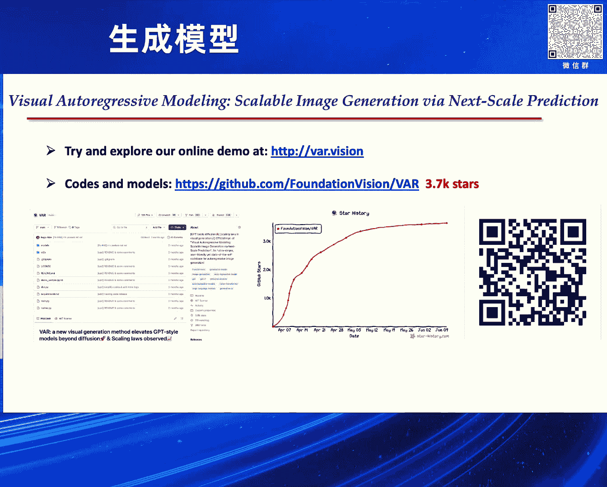

对，然后最后一个section的话，我介绍一个我们未来可能会做的一些呃，一些工作，包括text to image，包括text to，可能text video包括一些啊，就是我们要走向。

因为基于图NOZATION走向了未呃，未来统一的这样的mari modity model，对，然后我我们我们从现在的一个呃，呃就是视觉生成到一个多模态的，这样的一个智能来看的话。

就是呃语言模型目前已经能够去做深层和理解，但是视觉这块其实看可以看到，其实它已经分分的比较远了，包括就是嗯就是啊WI距understanding和VIDEGENERATION。

现在都是不同的model来做，对，现在微卷understanding的话，更多的是一些基于language model的语言模型啊，多模态语言模型。

我VIDEGENERATIONAL更多是通过diffusion model。

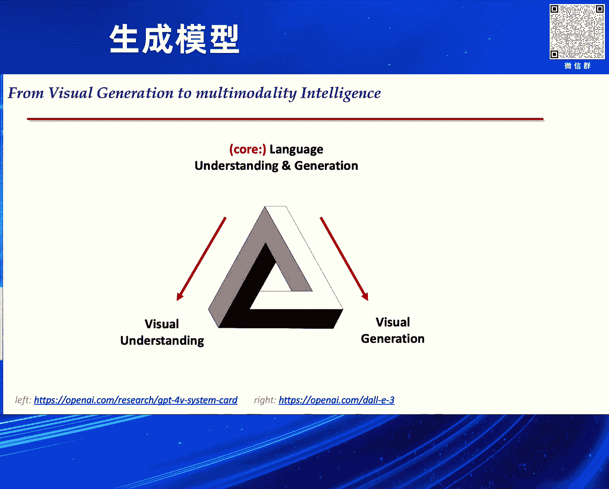

这里也列了一些代表性的一些工作，包括就是啊像上面是典型的一些语言模型，lama呀，或者GBT系列或者全区的呃，比较早期的卷曲的序列对，然后呃可以看到就是但是视嗯嗯视觉这块呢。

其实现在有一些出现了一些统一的工作呃，相走向统一的工作，像email或者是next e p t，它它是把diffusion model和language model呃，连接在一起来做的对。

然后包括呃就是呃左边的话就是一些啊，多模态的一些理解类的一些工作，包括g p four v或者larva对，比较早期的话是flamingo对，然后我们在想。

就是说有了这样的一个统一的TOGANIZATION之后，那我们其其实走向统一是一个必然的趋势，我们在理呃，呃在一个离散的空间上可以做去COCHIN对。

包括这个next token prep prediction，或者是呃嗯next scale prediction，可以通过通过ANIZATION的方式呃，就是呃就是就走向统一对。

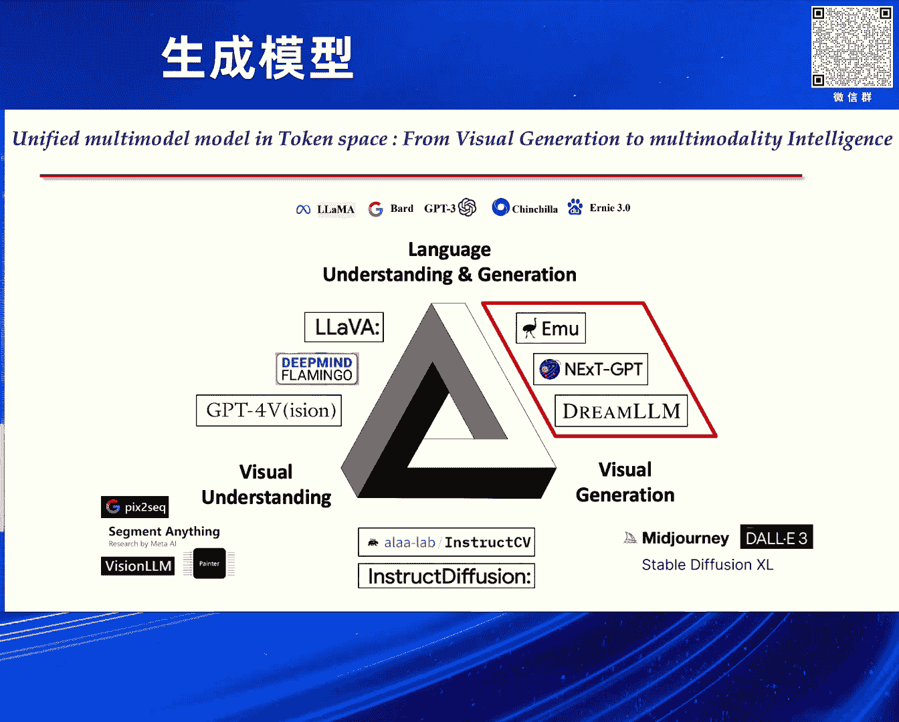

然后我们可以看到就是最新的GPFO，它是可以做到类一模代的模态的模呃，就是类的呃MODITY的这种输入和另1MODITY的输出，可以看到它生成图像已经非常丝滑了，大家推测它可能是第一个或者是任意模态的。

Tonization，可能是离散空间上的一些表示，从而的话他能够做到一个啊统一的这样的，一个统ALIZATION上呃，一个多模态的生成对，这是我们能看到的一个呃。

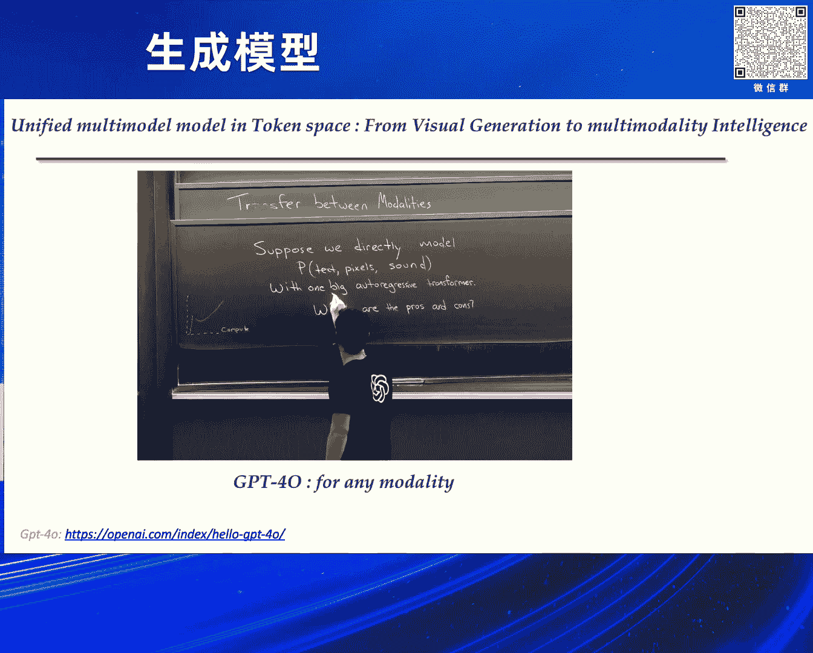

一个疑似的这样的一个证据对，那另外一个呃，就是说最近的那个meta发布的一个TRAMON，对哦，他就是第一呃，应该是我们能看到的第一个在一个PRETRAIN阶段。

它不再是在language mode做next token prediction，而是对视觉和language mode分别做了token，来谁选之后，分别做这个next token position。

这个next token的话，包括图像token或者文本token去COCH，那它训出来的这种语言模型啊，就或者动态模型不仅具有语言模型能力，还具有生成模型的能力，方法非常简单。

就是比较就有点就是呃就重剑无锋的这种感觉，对可以看到右右边这个demo，它其实能在对话中生成图像，也能理解图像，从也能做到自呃自然呃语言的生成和理解对，基于这些，我们就在想。

就是说既然我们哦有了就是刚开始说的，就是有了TOIZATION之后，这个TOKIZATION可呃如果是离散的，那么它就能够language model cochin，然后join the train。

然后去达到一个更高的天花板，当然前提是呃我们算力是非常非常足够的，因为CHAMBON这个实验它其实呃第一个实验的话，大概3B还是7B的model，大概需要用呃，大概需要用1000块呃。

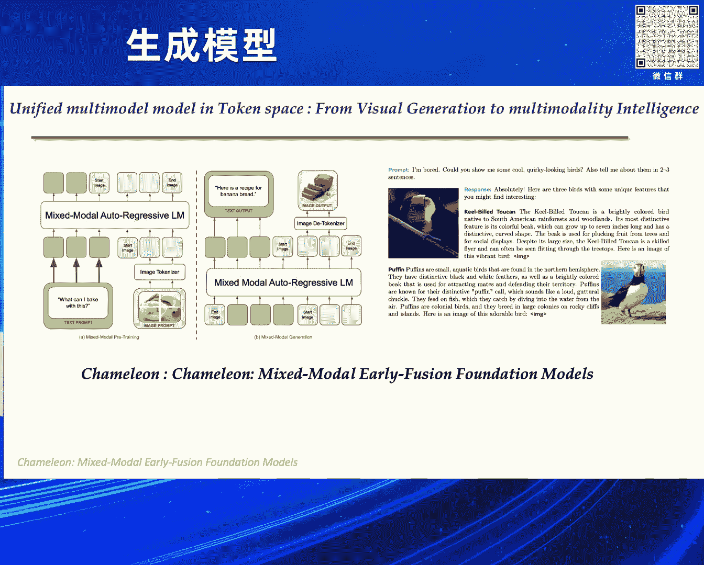

呃HH100对，然后最大的model的话用了4000块H100对啊，具体时长时长是没有啊，没有透露对，然后所以我们可以看到未来多多模态模型嗯，或者这种统一的模型走向这种离散的，TONIZATION的呃。

这种呃这种PRETRAINING是一种，我感觉是一种必然的一种啊一种趋势，它在未来也许能达到一个像纯生成上，理解上能达到最最优的，同时能在深层上能够比肩，diffusion这种离散的啊。

diffusion这种连续的这种表示对，这是我个人的一些看法对，然后呃我的分享就到这了，对谢谢大家，然后对好啊，我们感谢这个呃姜毅老师非常非常精彩的报告，我们还是留一点点QA的啊，好的。

好谢谢谢您的分享，就是我有一个稍微偏技术细节一点的问题，就是您刚刚说那个呃那个VR是呃，每个scale都是每一个skill是那个并行去预测的，但是transformer里面呃。

像gt这种一般都是预测下一个token，就是我不太清楚这个并行去输出啊，多个token这个是怎么做到的啊，其实这个就是类似class token，你去直接去预测它，并不是说next token。

Prnext token，PREDIC个选去做的，就是像BERT这种就是呃多个token并行的事物，它们之间可以相互看到，并没有存在着上下文的这种前后关系，对。

也是说在输出的时候是加了类似于query token，或者mask token这种对你可以这么理解对，但在时间上它是一个cos的，对哦行行好，谢谢好，那我们还有一个问题的时间，嗯老师你好。

我之前我有个问题，就是说VAR，那它相比于LDM它一个显著的区别，就是他把那个图像建模成了一系列那个嗯，不同尺寸的这个token之间的联合分布，而LDM是在空间图上的，它那个token之间的联合分布。

那就是在这样嗯不同尺度情况下，就是说传，比如说control net的那种谷歌图的引导控制生成，我们在这种不同尺度下的嗯，引导的话就有有这方面的探讨吗，呃嘶呃其实是有在VR出来之后。

有个有有有一个follow up的工作，呃是是是有的，我我我是我发现了那个有一些基于这个VR，做一些control net，或者是做一些editing相关的一些工作，呃相呃会后的话我可以发你看一下对。

但不是我们所做的，好的呃，我我们会有中场休息吗，没有是吧啊哈没有，我们要不就就继续吧啊我们就继续吧，好我们再次感谢呃姜毅老师精彩的报告，呃，我我们现在时间嗯，那好最后一个问题。

最后一个问题真的最后一个问题，老师我想问一下，就是因为您刚才我看刚刚听您讲那个VR，我感觉非常非常的那个呃，就是特别特别的感觉有价值，因为他这是在那个次回归式建模上呃，感觉是大概是击败的fusion。

感觉特别是像DIT这种模型，感觉还是特别特别有前景，然后老师我想问一下，就是你后面有没有考虑在这个视频生成方面，去进一步的去探索你这个VR的这个架构，对呃是这样，就是我觉得呃就是我觉得你说的非就是是呃。

是我们正在呃下一步可能要做的一个方向对，因为长视频生成是大家目前比较关注一个问题，就是呃呃就是目前长视频的话，那可能token序列会很长，也没有办法再塞到一个。

就是即使你可能用sequence Pdd的方式，用几千块卡去去做，但是可能有些有些场景下，你可能需要需要生成，有几个小时或者更更长视频，这种情况下，你就可以通过一些AR或者是呃这种方式来做。

会更加或者VR这种方式来做，或language model方式来做，会更加make sense，对嗯嗯嗯嗯嗯好。

