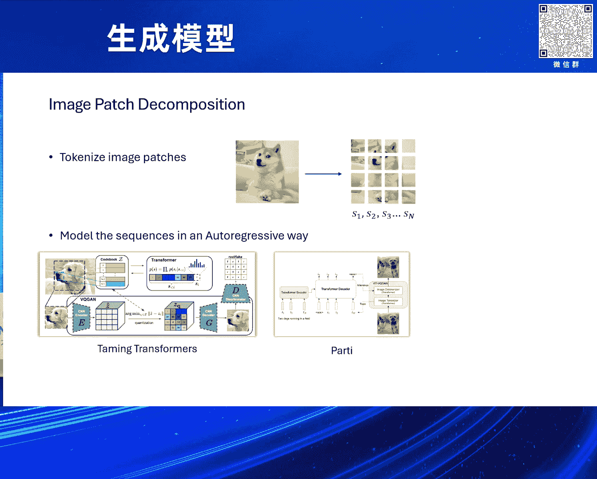
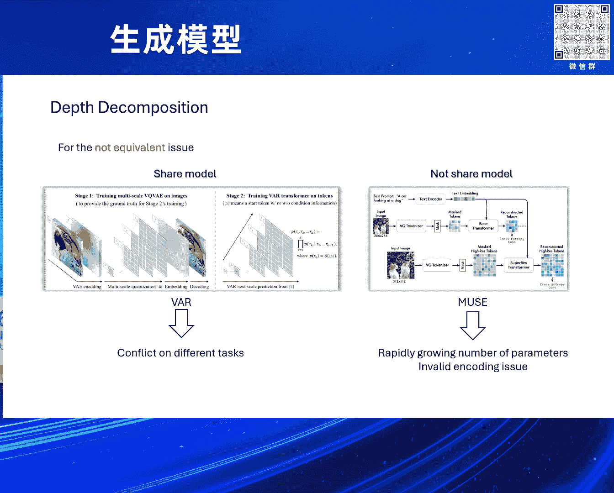
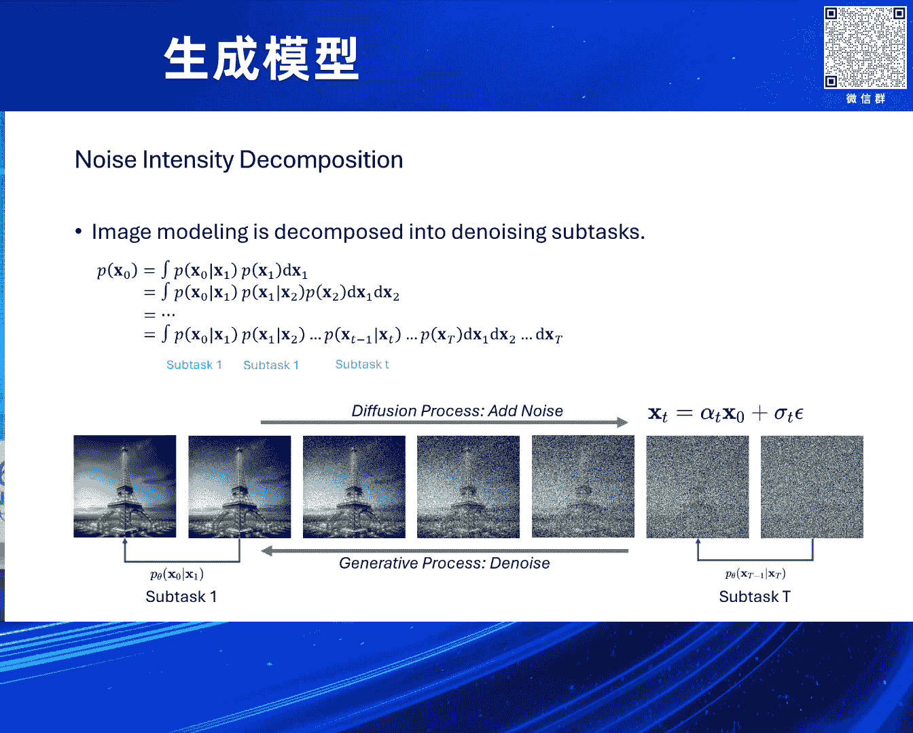
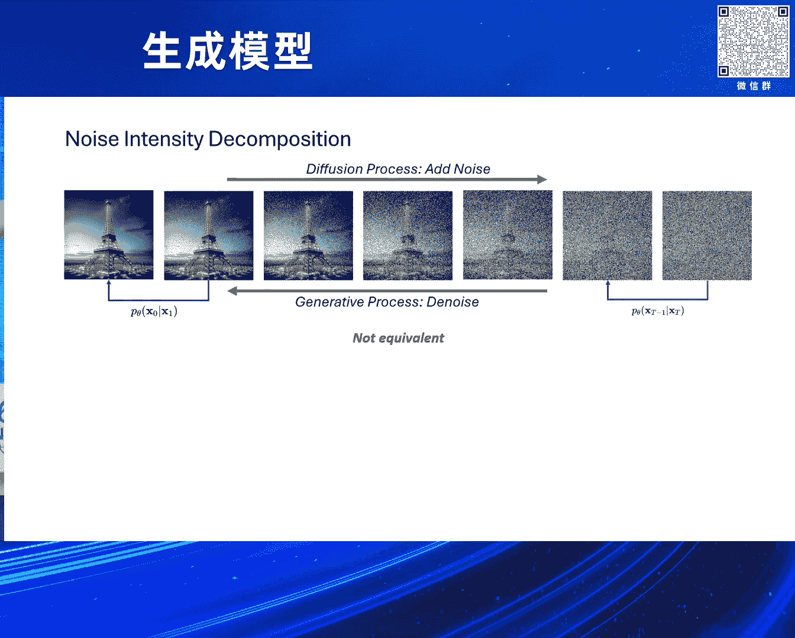
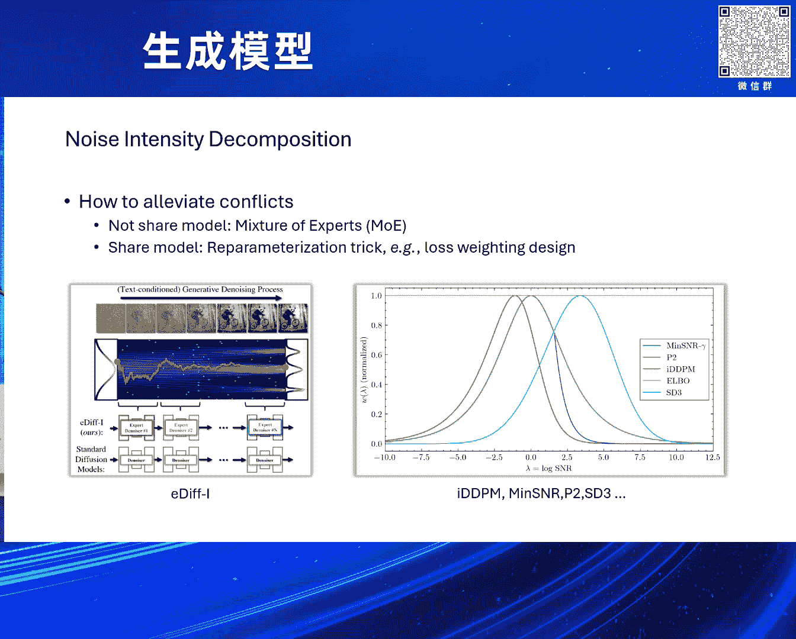
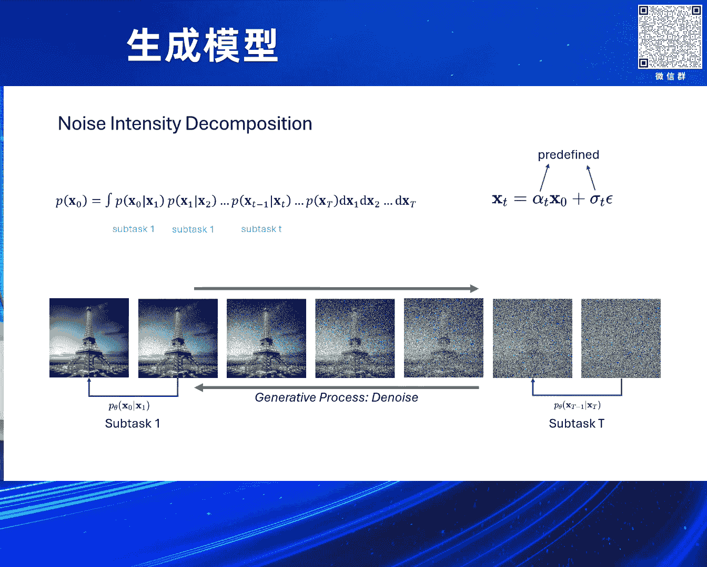
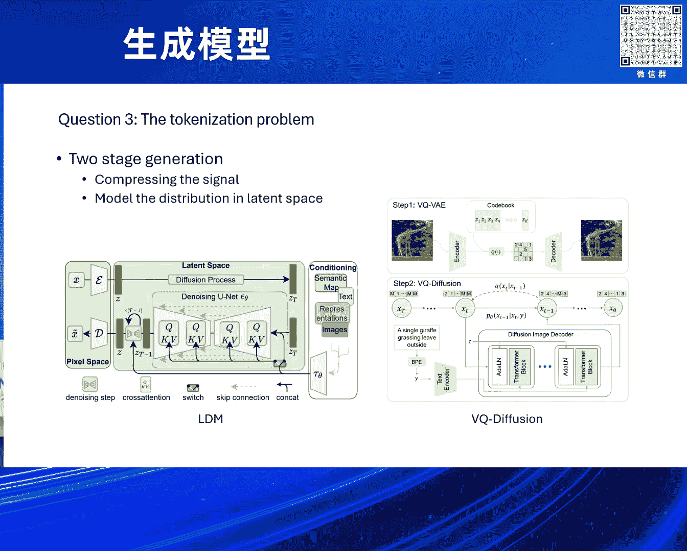
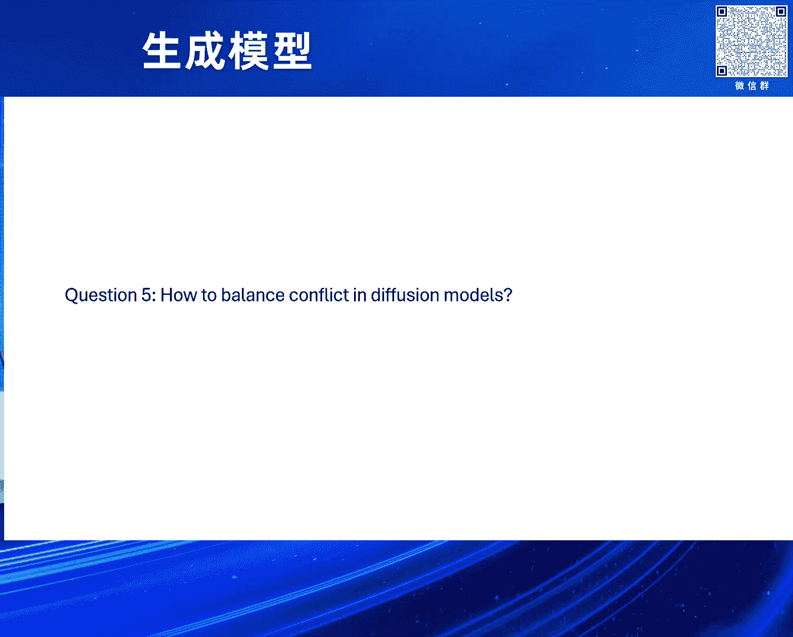

# 2024北京智源大会-生成模型 - P4：视觉生成中的若干问题；古纾旸 - 智源社区 - BV1DS411w7hz

这个怎么控，好可以好，行那就这样吧，嗯好，大家好，我是谷舜阳，今天这个标题的title写的有点大，我一直在想我要不要起这个title，最后还是起了这个title，主要有两个原因，第一个原因是。

其实最近跟很多朋友，包括在读博的学生，包括一些研究员，年轻的研究员，甚至还包括一些很资深的研究员在聊，大家都觉得，现在这些大模型出来，我们做research的没什么好做的了，我自己其实不是太同意。

所以来阐明一下自己的观点，然后第二个事情是，其实这个title很大，正常应该是那些大佬说的，不应该有我这样的小卡拉咪来，在这边说这些事，说这个事主要是，也是阐述一下自己的观点，希望抛砖引玉。

希望大家能多argue我，我们在讨论中，获得一些新的认识，所以我会尽量讲快一点，多留一些时间我们来QA一下，好，title叫。

Several questions for visual generation，但我做完这个slides我发现，其实，其实它好像动不了，ok，可以动，其实只有一个问题，对。

就所有的问题都是围着一个问题的，这个问题叫做visual signal decomposition，视觉信号拆解，我个人认为这个是，目前这个视觉生成率，几乎最重要的问题了，我后面来看一下这个问题。

它的这个原因，以及我们现在做的事情，和它到底有什么关系，好我们来第一个问题，第一个问题是引述它的，是我们做这个生成模型，生成模型的目标是什么，生成模型的，我自己理解，生成模型的目标就是这个。

我们把这个计算机所得，这个用户在想什么，我们就把它生成出来，that's ok，所以其实第一步做的事情，其实是一个人机交互的事情，就是我们怎么把用户想的这些事情，变成这个计算机可以理解的。

这些语言或者instruction，或者一些什么样的东西，第二部分呢，就是好计算机知道了，我们要生成什么，那我们就把这个事情也生成出来，我们也知道这个生成模型，其实是一个sampling模型。

所以其实我们要生成的是，我们从manifold learning的角度来说，我们要生成的是p-target，这个distribution里面的一个样本，但p-target的distribution。

我们是拿不到的，所以我们希望我们能生成一个，可采样的数据分布，叫做p-generated，然后它和p-target，两个distribution是一致的，这样我们从可采样的p-generated。

里面做sample，其实就相当于是，我们在这个p-target里面做sample，这个东西其实就是我们的生成过程，但是问题来了，这个p-target的数据分布，其实有可能非常复杂，我们实在拟合不了。

我们想用p-generated，拟合这个p-target，但p-target太复杂了，我们找不到一个p-generated，可以拟合它，我们其实除了第一部分，在做这个和人机交互相关的。

剩下我觉得这个生成模型，这边所有的问题，其实都是这个问题，因此这么多年来，我们做生成模型，不管是人机视觉，还是language，还是什么其他的，Digital signal processing。

这边做generation，其实一直在追求，我们怎么能提升，这个模型的modeling capacity，让模型能力增强，所以这个生成模型的发展过程，其实就是一个，模型能力增强的过程。

从energy based model，到GAN VAE，到Diffusion model，都做的是一样的事，然后在这个问题之后，下一个问题就是，我们怎么样做得更efficient。

怎么样做得更explainable，涉及到security等一系列问题，这个问题也很重要，但我今天不太会涉及这个方面，我今天主要提的就是第二个问题，就是distribution modeling里面。

这个数据分布太复杂了，怎么办呢，针对这个问题，其实大部分人的想法都一样，你的一个数据分布太复杂了，那我们就把这个复杂问题拆分，拆分成多个简单的问题，That's ok，所以回到我们，所以回到我们的。

视觉生成领域，问题就是我们怎么样，把我们的视觉信号做拆分，这样我们把一个复杂的任务，拆成多个简单的任务，然后我们再对，这个简单的任务，逐一做modeling，就好了，我们现在来看看。

这个language领域，是怎么做这个事情，language领域非常细腻，因为language非常，在这个问题上，language领域是非常简单，首先language的distribution。

也非常复杂，是吧，大规模的语料库，这个数据量非常大，但其实他们的数据拆分非常直观，比如说举个例子，我喜欢吃苹果，它一个字是一个字，一个token是一个token，那我们简单的就把它。

按照这个token来进行拆分就好了，是吧，所以我们把一个复杂的数据，Px，这边有激光笔吗，没关系，对，就是我们把一个复杂的数据分布，Px的问题，直接拆分成了，next token prediction。

每次根据前面的这些token，来预测后面的token，所以我拆分成了n个task，其中第2个task，就是我在预测si这个token，其中是依赖于i前面的这些token，来进行预测的。

我们来举一个再具体一点的例子，假设我们的语调库里面有两个句子，一个叫I love swimming，一个叫You love playing basketball，I love swimming。

所以我们在做next token prediction的时候，我们如果拿第1个句子，那它拆成了第2个task，是我根据I love来predict，这个swimming，然后根据这个第2个句子。

如果我这个，也一样的方式做拆分，那它的第7个task是，根据You love playing basketball，I love来predict这个swimming的事情。

事实上当这个Corpus非常大的时候，这个不同的任务之间，他们在这个第2个任务，第7个任务第5个任务，其实他们之间是没有冲突的，就是，意思就是当我学习第2个任务，它并不会影响我学习第7个任务。

当我这个学习，You love playing basketball，I love来predict swimming这个任务的时候，它对于我做这个。

有了I love来predict swimming这个任务来说，其实它是有帮助的，或者至少来说它是没有冲突的，他们甚至可以看成是一种，互相是一种augmentation，当我数据量足够大的情况下。

所以我们把这个东西，叫这个equivalent，我自己起的名字，我们把它叫做这个等价性，不同任务之间它没有冲突，他们是这个互相等价的互相帮助的，这个东西对于language来说特别重要。

我们来看看在这个vision里面是什么样，对，就就是因为前面前面的这个的成功，所以呢我们能把这个language，这个很复杂的任务，拆分成各个简单的任务，拆分成简单的任务。

然后我们这个就能很自然的scale up，并且这个直接少了很多这个不必要的麻烦，所以呢这个visionguides，看到了这个languageguides，做的这么成功。

就想我们是不是可以这个照葫芦画瓢，把这个事情也抄一遍，那这个抄的方式也很简单，这个就是我们先把这个图像，他们做的tokenization，分成了一个一个离散token，是不是离散这个事情其实不重要。

但至少分成了一个个token，那我们这边也干一样的事情，我们先把它这个切成块，切成这个16块，这个32块或者更多的块，然后呢我们再来一个这个auto-regressive model。

来这个progressive的来做生成，是吧这里面有很多这个代表性工作，比如这个Igpt，比如Darling，比如这个Party，比如这个Tarmin Transformer，就是VQ干了。

对做的都挺好的挺好的，但是呢他们之间其实，这个其实都都有这个。

unequivalent的这个问题，是吧我们来举个例子，这个是他们的这个信号拆解方式，我们把其中的一些task拿出来，就比如说这个上面是这个sk-1，sk这个这个token，下面是sk-1，sk。

 sk+1，所以这个Decade task做的事情，其实是根据这个，K前面的这些token来预测Decade token，这个J是J前面的预测J，但但其实这个我们我们这边只是为了说明简单。

我们稍微做个简化，他其实把K之前呢我们就当成是，这个他前面一个，因为他这个相关性最高，其实这个不对，我只是为了把这个声音给，讲的稍微更clear一些，对所以我们把它近似当成是。

我们从K-1在predict K，从J-1在predict J，下面一个task就是从这个J来predict，这个J+1这么个task，然后我们发现我们把这些这个condition，画在了这个后面。

根据哪个图像块来预测哪个图像块，哎我们发现这个其实，对于某些他是continuous的，这个对于另一些他不是continuous的，是吧所以你你当你用一个需要。

parameter的一个model来做这个事情的时候，他其实是在学习两个conflict的事情，他到底要不要学习这个前后token之间的，这个连续性能，当然其实我用连续性只是举个例子。

连续性其实不是最重要的事情，其实这个conflict的事情出现在，出现在所有的所有的事情里面都有，对continuous只是一个相对最容易理解的，再打个比方，比如说我们做这个，做一些和human相关的。

是吧其实大部分我们connect的数据集，都有都是有很多bios的，比如我的人脸在中间，对那那对于像这种情况，这个你其实在不同task你学习的，其实也是不一样的，比如我有的task。

fixed resolution的这些task，有的task这个我学习的，我可能尽可能的学习眼睛学习一些别的，是吧那对于其他那些其实你学的，根本不是这样的东西。

这就会导致另一个这个not equivalent的，这个事情，对所以这个因为就patch之外，这个是不是还有其他的一些拆分方式，能让我们更equivalent一些呢。

一个典型的做法是用这个depth来做拆分，是吧depth这个很好理解，我们对于同一个space位置，我们可以这个拆成多个channel，拆成多个什么样最简单的就是这个RGB，但RGB也可以再拆分吗。

因为这个这个这个一个一个R通道，也是8个bit，我们也可以把这个RGB进一步拆分成24个，这个这个bit来怎么样，对吧理论上来说这样我们也是把一个复杂的，24个channel的这个。

不说channel吧，就三个channel的这个复杂的分布，我们也拆成了三个简单的分布，我们是不是可以利用他们之间的一些关系啊，来做一些事，当然RGB这个只是for example。

这个其实大家还会做得更优雅一些，比如说用这个VQ-VAE-2我们做这个层级化，再比如说我们用这个RQ-VAE，我们每次quantize一次，再这个做一些resizer，再quantize一次。

然后这个它也是一个，这个这个在depth维度上做了一个信号拆分，但actually我想说的是，这个depth上的这些decomposition，他们也做不到这个equivalent的这一点。

对下面下面我以这个，当sample up sample，算是另一种这个depth的decomposition，也举了个例子吧，就是你在不同depth来做的情况下，你也不能保证你做的事情一样了。

比如前面第一个task啊，他做了一点这个虚模窝，再做一些这个低频信号，后面再做一些高频信号，你们之间其实也是有conflict的，所以这边我其实有更好的一些例子，后面等一下来讲的更清楚一些。

对所以所以对于这些not equivalent的问题，我们怎么来解决这个问题呢，其实其实无非两类做法，就第一我们现有model来做，第二我们不现有model来做，刚刚江老师也说了，这个现有model。

其实这个VAR就是一个典型的现有model的，就是我知道我在不同reolution上，我我我从这个2×2，你和4×4和这个8×8，你和16×16，其实不一样，没关系，这个这个我我有钱，这个我模型够大。

我不在意性价比，那我就那我就做就好了，是吧那那那他这个导致的问题，就是我在不同task上面，可能是有conflict，对这个影响的是什么，影响的是当我们的数据分布，真正非常复杂。

比如我们做一些真正inner wide的，或者超越inner wide的一些，这个distribution的时候，这个你不在意性价比不行了，这个这个地主家也没有余粮了，我就这么多这个参数嘛是吧。

就这么多参数就这么多flow数，你的这个任务拆解不合理的话，这个再复杂数据分布我也做不了，这是一种，第二种是这个not shell model，对我我提一下，就是这个这个每个都是有很多很多工作。

这个我我我只是for example，对肯定会miss很多，对那not shell model这边，我举的一个例子是这个muse的例子，muse就是典型的利用这个VKBE做的拆分。

然后先把这个low resolution，这个distribution我先modeling好，然后根据这个low resolution distribution。

我来modeling这个high resolution distribution，是吧，然后这种这种问题是第一，第一，它的这个parameter数，当你的这个拆分数真的足够多的时候。

你这个parameter数，你是一个O(n)这个数量级的，你其实很难做，你比如说这个这个一个是一个两B，那你这个拆分成10个就是20B了，20B不是不能做，但你真正做拆分的时候。

这个这个参数量和这个flow数，你完全不shell，其实是很痛苦的一个事情，而第二个事情是叫这个invalid encoding issue，就是我们实际在做的过程中，这个大部分人不会跟你们说。

这个但实际做的过程中，你们会发现这个这个你很难真正的把它拆的又长，每个每个token每个depth上面，或者叫depth上面每个位置，它都是一个有效的信息，这个东西我放在后面。

我会这个专门来说这个问题，所以除了这个depth的decomposition以外，现在最火的这个这个这个拆分方式，其实是diffusion。

diffusion叫做noise intensity decomposition，其实问题是一样的，我们要拟合这个PX0，PX0太复杂了，那我们就用这个，这应该是全概率公式。

我们用全概率公式对它进行拆分，拆分成了啪啪啪啪task，一个task从X1到X0，第二个从X2到X1，然后这样依次往后做拆分，在这样子的情况下，我们的每一个xt是我们predefined的。

通过这个后面的这个加招公式，xt=αt x0+c8t，我们来拿到xt的这个数据分布，这样我们就define好了，每个sub task，它到底是在做一个什么样分布。

到什么样分布的一个distribution mapping，然后下面画一个这个diffusion的这么一个，简单的一个示意图。

是吧，在这个情况下，我们再来想一想，这种信号拆分方式，它是equivalent的吗，其实它其实也不是equivalent的，它有非常多的问题，它在不同time step。

或者叫不同的noisy testing。

他们这个学习到的信息，其实totally不一样，是吧，我们也举几个例子，第一个这个edify，这个TerraCurrents，他们做的这个工作，他们在这个inference过程中。

前后选了不同的这个prompt，然后发现这个有的prompt，在前面后面起的作用也不一样，这个在diffusion的这个早期阶段，他可能更学一些这个low level的structure。

这个后面的阶段，可能更学一些high frequency的一些，这个detail啊或者其他的一些信息，然后第二个是我们自己做的一个工作，mini snr，这个所有事情就更直白了，是吧。

我们这个diffusion大部分，比如拆成1000个time step，我们就对着中间某一个time step，给我猛tune，看我tune这个time step，你其他time step。

对我来说到底是不是有好处的，但讲到底其实就是我对着这个，这个造成强度某个训练，我看我对其他造成强度来说，到底是有帮助的还是有坏处的，结果是有坏处的，结果是有坏处的，坏处的其实就告诉我们。

这个这个它不同task之间，其实是有冲突的，我把这个task做好了，其他task做差了，是吧，按了葫芦起来调，对，因此这个diffusion model，它其实也是，也是这个。

这个不equivalent的，所以针对这个问题，我们怎么来解呢，这也是两类嘛，这个这个，其实问题都是两类，这个现象model和不现象model，这个不现象model的典型，其实就是EDFI。

他们自己做的，这个，这个这个我们，我们把这个expert，我们用这个多个expert来做，每个expert专门做一个，这个造成强度，然后不同的这个造成强度，我直接这个，拆分成不同的这个模型来做就好了。

所以这边的问题，其实是我的这个模型太多了，我该怎么办，所以这个EDFI的做法也很简单，我们做了一些这个凹差数，来做一些规定，来让它这个数量别这么多，然后另一类呢，就是现象model，现象model这边。

其实我想提一个，提一个事情，其实大家可能没有意识到，特别重要的事情，叫做reparameterization，从参数化，其实对于diffusion的成功来说，从参数化非常重要。

因为diffusion原则上，它做的每个sum of time，做的diffusion mapping，是从xt到xt-1，所以我比如说分成100个，那我一个做的是100到99，一个是98到97。

一个是79到78，这些其实非常diverse，reparameterization做的事情是，OK我不care你input是什么，你input是100就199，就99，98就98，我把你的output。

这个unify成一个diffusion，所以这个reparameterization，这个会把output有的predict，这个noise的data，有的predict。

有的predict clean data，有的predict noise，有的predict v，predict x1-x0，predict everything，that's ok 是吧，因为我总之。

我的input distribution不一样，但我output distribution不一样，output distribution一样，这样我让我的多个task的冲突减弱了。

其实这是一个非常重要的事情，这其实当这个事情，现在已经well known，大家都在用这样的事情，那第二件事情，其实就是我们可以做一些，loss weighting design。

我们这个有些这个像我们min-snr，这个sable division 3，其实都做了一些这样的一些事情，我们这个大家出发点不太一样，我们做min-snr的出发点，其实是这个，这个大家既然有冲突。

好那我们就找一个这个，大家不冲突的方向，这个求同存异，我们一起来这个，一起来进步，是吧，所以这个min-snr，其实做的是找了一个，派对托最优的方向，来做这样的事情，但是这个这些事情，说实话支标不支本。

就是他本，因为他本身上，他还是有这些冲突的，我们只是这个这个这个，这个尽量的去减少这些冲突，因为我的这些冲突，其实其实他客观是存在的。

因此我们来想一想，他的这个冲突为啥存在，这个这边是他拆分的，这个sub task，然后呢这个每个sub task，是由上面的这个xt来给定的，然后xt里面的这个又有两个参数。

alpha t跟sigma t，alpha t跟sigma t，probably不一样，但是无所谓，这个事情在，在我们一般提到，这个definition model里面，他们都是predefined的。

所以当我predefined好了，alpha t和sigma t，我的中间每一个数据分布，其实已经给定了，所以给定了这个数据分布以后，他到底有没有冲突。

有多大冲突，这个事情也已经给定了，因此我们想，这个这个问题都出在你这，都出在你这个alpha t，sigma t给定了，然后这些这个没deliver，是吧，我们是不是可以找一种更好的。

这个方式来让你这个减少冲突，所以一个一个一个做法，是用nullable的方式来做，我让alpha t跟sigma t变得可以学习，这样我们是不是可以学一种，让他这个冲突更小的，这么一种方式吗。

这里面的一个典型工作，是variational definition model，这个Keyma他们的工作，对，然后这边的想法就是好，就非常简单，就是这个，就我们说是alpha t sigma t。

但其实alpha t跟sigma t合在一起是snr，平方一下是snr，对snr我们也可以这个，做一些这个log呀什么的，所以他们其实是用一个网络，我们在这个predict这个log snr。

然后predict这个log snr以后，我们就可以拿到这个alpha t和sigma t，然后我们让这个，相当于是家造过程里面的，这两个参数是可学的，我们是不是能学一种更好的，对。

这是one solution，所以所以这个solution，我们把它叫做nullable noise schedule，我们在学习这个家造里面的，这些参数，然后第二个事情，做的就更极端了。

我只学这两个参数不太够，是吧我们是不是可以这个，我们让整个家造过程也是可学的，然后我这边举个例子，这个F alpha n，表示的是一个neural network，所以我们家造的每一个状态。

拿到的这个数据分布，是由我们一个neural network决定的，这边的典型工作是这个，薛定谔桥相关的一些工作，包括这个diffusion shedding bridge。

simplify diffusion shedding bridge，diffusion shedding bridge matching，其实都是这边的一些代表性工作，这里面的核心在于。

我们让整个家造过程和驱造过程，都是可以学习的，家造过程来告诉我们这个，这个每一步来define，我们的这个sub task是什么，驱造过程来对它进行一个measure，我们这个不同的task。

到底是不是这个equivalent，或者怎么怎么样的，对，然后这个，其实neural network，其实也不一定一定是我写的这个形式。

我只是以这个simplify diffusion shedding bridge，因为这个我们自己的工作相对熟悉一些，以这个来举个例子，对，对，然后这种叫做learn a network。

to add noise，我们学了这个，用网络来学习家造过程，对，然后所以总结一下，这个learnable decomposition，这边其实又分为两种，一种是我们学习这个家造里面的参数。

一种是我们学习这个，用一个网络来学习家造，但从我们视角来看，他们其实做的事情都是啊，我们怎么能找一种这个更好的这个信号拆分方式，来让我们的这个视觉信号啊。

当我们这边其实特指的都是invice signal，来让我们的这个这个图像信号，它这个拆分的更合理，大家的conflict更小一些，对，然后这边其实大家看上去很美好，但其实大家做过程中。

其实又有一堆问题，比如这个前面这个VDM的问题啊，这个我们放在后面的时候，后面会专门说，对，比如说这个Bridge这边的问题，其实在于当我们有了前面的那个，难易的加高公式，XT等于αT。

这个等于这个X0和noise，这个αT SigmaT的这个加权的情况，它有个这么simplified的情况，这样我们就能用我前面说的特别重要的，这个reparameterization。

当你没有这个式子的情况下，你每一步都是通过这个neural network来学的时候，你其实很难拿到一个这个很难易的，这个这个这个这个，可以可以直接传递的过程。

这样你就损失了利用这个Diffusion model里面，最重要的这个reparameterization的这个check，所以它进一步又会导致其他的这个冲突，对，所以在实际过程中，这个这边怎么做。

其实还是有一些这个值得研究的空间的，好，然后下面这个来说这个，第三个问题，Tokenization的问题，对，说Tokenization的问题，我们先这个稍微站远一点，说我们现在这个生成模型，生成模型。

我们现在做这些数据生成的时候，其实大部分都分两步来做，第一第一部分呢，我们先做这个signal的这个embedding，来把这个信号做压缩，第二步我们在这个压缩的信号上。

第二步我们在在这个压缩好的这个信号上，再来做这个modeling的过程，对，比如一些这个典型的一些工作，其实其实都是这么做，大家有没有想过为什么要做这个compressing，其实其实事情是一样。

就是这个px太复杂了，是吧，我们要有些办法，能把这个px纬度降低，数据分布变得简单，那我们这个就就就做它就好了，那我们后面这个压力就降低了。

对，然后我们来想想这个compressing是怎么做的，language里面很简单，是吧，假如我有一个这个language，一个一个一个sentence。

叫做I like playing basketball，那我们把它做这个做这个这个编码啊，我这个编码成这个里三头三一七四，然后我们再对它做这个decoder，哎，它直接就出来。

I like playing basketball，这个是因为它无损的，很漂亮，是吧，然后压缩成了这个漂亮漂亮的，每个是自己的一个token，英语机里面不是，英语机里面这个这个我们常常用的这些。

不管IEVAE，其实或多或少你都是一个这个有损的一个过程，但有损无损真的重要吗，其实也不是我们这个这个这个越无损越好，这个事情对于这个视觉信号来说肯定是不对的。

我我这边是以这个lookup free quantization，举的个例子，他发现这个压缩的越多，然后这个重建重重建的越好，但后面做modeling的这个越难，这个事情很make sense。

我我我觉得很make sense，不知道大家是不是觉得也make sense，其实是这样，就是当你当你这个重建的越好的时候，你的这个数据分布有可能是越复杂的，就比如说这个大家有想过我们。

比如说做stable diffusion，为什么里面用的是一个VAE而不是用AE吗，因为AE你出来的这个数据分布可能很长很复杂，其实大家根本做不了modeling。

但你如果加一个regularization，不管是KL是quantization的一些regularization，那我的数据分布相对可控一些，这样我后面做modeling的时候就会容易很多。

对其实就是这个原因，对我这边反正是这个local free quantization，来举个例子，所以这个这个事情重建，这个事情就是越无损越好，这个事情不对的，这个命题其实这是一个general的命题。

这个在speech啊在image里面，这个这个其实是well known的一个事情，对然后这个大家的解决方法也很很统一，就是我们把那些没用的这些token也丢了就好了，这个在speech里面很多的这些。

这个不知道大家知不知道，speech的这个信号处理，我也这个略知一二，这个大概就是这个我们有一段这个音频，然后把音频做这个离散幅列变换，然后可能变成16个，可能变成32个，但这个里面有很多这种鱼的。

所以大家做的事情就是，没关系我不care，我只用我前面的这个8个来做拟合就好了，他们重建的也挺好的，因为这里面是一样的，因为这里面我就举一个这个，这个最最拿义务的这个例子。

其实最喜欢干这个事情的人也是Keyma，Keyma他们之前做这个glow，或者他们后面做这个，Volitional Diffusion Model的这些后续工作的时候，他们都是。

然后他们说这个我我拟合这个灰度图，灰度图是8个bit，8个bit太复杂了，这个后面也是没用了，我们就拟合5个bit，诶5个bit出来的结果，这个这个其实比8个bit来拟合，其实还更好一些。

对这个其实是一些well known的一些事情，所以所以general来说，他的solution就是我们把一些这个后面的一些，没用的token也直接给丢了就好了，所以这边我们在想。

我们既然做tokenization，你做了以后我还要丢了，那我是不是这个这个这些就可以不要做，或者我可以做一些这个实验来适应这些的，所以一个直接的想法就是我们可以。

是不是可以做一个这个变长的这个embedding，是吧，RQAE就是一个典型的变长embedding，这个很直观，听名字也很直观，因为他这个RQAE，我做一点留了一点这个渣子，然后再做一次再做一次。

所以这个自然就是这样，但是RQAE其实也有一堆问题，对我们自己其实做了一些实验，发现这个RQAE这个他很容易做了就做了，做到后面，结果又变差了，这个前面这个大家这个重建的越来越好，或者RFID越来越好。

然后做到后面又变差了，尤其随着你这个，尤其是随着你这个debs的增加，他这个出现这些这个这个往上翘，或者这个不往不变好的这些情况，其实比例其实是越来越高的，对我们先把这个东西先把它命名。

叫做embedded embedding的这个问题，这个问题其实是兼而存在的，当我们做这个debs是4的时候，他有30%的可能性，做8的时候他有40%可能性，这个debs做16的时候。

他有50%多的可能性遇到这样的情况，大家如果不相信，可以自己去做一下这个实验，强烈推荐大家做一下，不管你用什么codebase都会浮现这个结果，然后我们把这个我们就以8为例，把这个图打出来看一下。

打出来看一下，发现他在中间某一个stage，他会dominate，到后面他也不怎么会变好了，当然这个还不是naive的RKVAE，因为naiveRKVAE从第一个开始就已经差不多了。

就我们这个这个做了一些，这个information bottleneck，来让这个东西相对可视化的更明显一些，我放这个图，我先这个先先是正好想提一下，另一个问题，大家看我们这个图，我们先把这个图打出来。

然后我们把这个图打出来，然后我们先想提一下，另一个问题，大家看我们在做这个不同task，我们在做这个modeling的时候，你第二个task到第三个task，你显然补了一些这个比较比较有效的一些信息。

当你在这个dominate stage以后，你再去做这个，做这个modeling的时候，其实你，Visually我自己肉眼，其实都看不出有什么变化，对所以其实这个也很直观的。

可以看到你有一个这个不等价的这个问题，是吧，这个也尽致了我们前面说的这个，在depth上说拆分，你要你要注意一下，你到底是不是有这个问题，然后呢，这个图其实还能说明，另一个就是我们前面也是。

来一次说的问题，就是invalid embedding的问题，是吧，你既然四个五个这个token，你已经invalid的结果，跟这个最后都差不多了，你后面那些要他干啥呢，这个也也没也没啥用。

直接丢了就好了，是吧，那我们为什么要干这个事情，所以这个事情其实挺讨厌的，你做一个AQAE，这个这个做到最后，你你给我出了一大堆这个没用的东西，这个为什么会这样呢，哦对前面忘了说了。

这个这个这个talk里面很多东西，都是我自己这个拍脑袋随便想的，可能有80%90%的东西都错的，大家这个听一听就好了，这个欢迎来喷我，对真的欢迎来喷我，对这边也是这个这个就就自己的一些想法。

对这个可能的一个原因是这样，就是我们还以8为例啊，以8为例，所以我们在做这个重建的时候，其实第一个是对这个X0过一个decoder，然后跟ground choose来拿。

然后第二个就是这个X0和X1加在一起，这个过decoder和ground choose来拿，然后巴拉巴拉巴拉，反正8个是这样，所以所以我们这个在train这个AQAE的时候。

其实我们是把这些loss给combine在一起，我当然知道这个这个AQAE的那个中间还有一些loss，但跟这个问题没关系，我们先暂时我们先不讨论它，对然后在这种情况下，我们再做一个这个假设。

我我我我也知道，我我真的知道这个decoder，其实是一个很强的一个非线影音设，但但其实这个如果我们先做分析，把它做个简化，假设它是个linear mapping的话，那你其实把这些loss。

我们也对对这个其实无所谓，就是你到底是不是有一个loss weight的加权，我们先suppose这个loss weight是equal。

所以所以其实你在优化这8个loss的combination的时候，actually你在做的事情是这个，对后面这个loss的优化，当然condition我已经写在这了，所以当你优化这个事情的时候。

你发现你找到的argmin，其实是下面这个十字，下面这个十字问题又来了，那我既然argmin x是后面这个十字的时候，那我凭啥能保证最后一个是最低的呢，大家明白我说的意思了吧。

是吧就是既然我找到了argmin是这个十字，那我并不能保证我的这个x0加到x7，8个token合在一起，哪怕是一个最低的，哎这个就导致了embedded，embedding的问题。

尤其我们可以再做一个分析，假设是吧，你你用这个CL codebook了，x0到x7你这个codebook用的一样的，然后又假设他们这个是绝对同分布的，那你能得到一个更有意思的事情，你看这个这个。

那其实这个你左边的这个argmin x，你可能是跟第五个左右可能是最接近的，你取一个expectation对吧，这就这就是你后面三个就没用了，甚至还可能往上翘，他很痛苦，这边是有些研究空间了。

大家可以这个这个想想这里面的一些问题啊，对当我我说这些只是为了这个去说这个这里面有这些问题啊，我们来讨论下一个问题，对那个时间有点紧，我尽量说快一点，那个下个问题是。

Is diffusion model a maximum likelihood model，这个扩散模型，它是最大自然模型吗，这个问题是怎么来的，这问题其实其实他有你很多地方都可以来，我自己只选了一个。

我们这个dpm里面这个他最开始推的时候，他从这个最大自然来进行一些推导，然后推导出来，理论上哎他应该是这么一个形式，但实际中我们也不care，他前面这些loss weight。

我们把这个loss weight给这个丢了，然后这个再一般的呢，这个他其实training loss，其实是下面这个式子，我直接摘了这个vdm++里面的这个这个这个式子，对，然后vdm++他告诉我们。

哎当我的这个wNamla是一个单调函数的情况下，那么呢我的这个整个的这个training loss，他可以看成是这个一个最大自然学习啊，当然加了一些alimentation。

但不幸的是我们这个我们其实在做的过程中，我们其实也不是这个wNamla的选择，也不是单调的，所以所以其实他跟这个最大自然是有gap的，当然这个是从training的角度来说，是吧。

我们之所以讨论这个问题是因为这个，因为其他的这些success model，很多都是一个最大自然模型，比如VAE，比如autoregressive model，是吧。

我们definition model到底是不是这样，至少从training的角度来看有一个gap，对，从influence的角度来看，问题更大了。

那个因为我们前面modeling的是这个从xt到xt-1的disability mapping，但我们做influence的时候，我们一般也不拿xt到xt-1。

我们做的事情是用了一个叫classifier free guidance的东西，是吧，classifier free guidance其实干的事情，这边也有些推导我们就不说了。

其实他干的事情是把你的这个自然函数，跟你的这个后延 posterior，做了一个combination，combination还有个系数，是吧，这个就明晃晃的在告诉你，你最大自然不好。

我要给你加上一个后延，你才能拿到一个更好的结果，所以这个一直在动摇我，这个definition model到底是不是最大自然模型，看上去又不是，在evaluation的时候，这个问题更明显了，是吧。

这个大家一直在聊这个scaling law，这个language model scaling law是因为这个越压缩越好，什么叫压缩，压缩就是negative。

这个negative log likelihood，是吧，但是我们在这边你直接拿这个，negative log likelihood，也不能衡量你的这个结果。

你的这个negative log likelihood，结果越低，你的这个结果也不一定越好，我的这个图是也是直接从那个DDPM里面来扣的，其实你这个，这个这个你自己去做一些，Visualization。

你随便做点什么，你都能发现这个，这个NLL loss其实没啥用，所以这个training inference，evaluation，它都有问题，它到底这个有用吗，所以其实这个问题变成了这个。

为什么maximum likelihood of diffusion model，它并不能拿到一个最好的结果呢，这边也是我personal的一些理解，这个非常有可能是错的，对。

那个从training的角度来说，training角度其实就是这个，我在这个talk刚开始，一直在强调的这个问题，这个信号拆解的不对，Diffusion model的信号拆解它不具有等价性，所以呢。

它在这个不同的noise intensity上，它的这个importance和difficulty是不一样的，稍微注意一下，这个importance和difficulty这两个事情，这两个词。

它们代表的意思也不一样，就我们今天可能没时间了，后面以后有时间我们再说，对，然后这个，所以这个，所以这个最大的这个difficulty，其实往往是在这个中间的，这个信号比属于中间的这个状态。

这个是SD3，这个它的这个发现，其实在它之前，我们很多人都有这样的发现，对，所以这个中间的这个likelihood，往往学的不是太好，因此呢，我们这个没有按照这个ELBO的方式来进行学习。

然后第二个在inference的时候，inference的时候我的理解是这样，这个classified free guidance，可以看成是对这个最大自然学习的一个纠正。

这个其实说的是difficulty的事情，就是它在不同的这个noise intensity的情况下，它这个学习的这个难度啊压力不一样，学习的好坏程度也不一样，尤其是在中间，那个最难的部分学的最差。

这个是下面引的这篇文章，TerraCurse他们前两个月做的，他们发现这个classified free guidance，我好像放的太靠下了，这个看不到，下次下次这个学习进步一点。

TerraCurse他们发现这个classified free guidance，这个在noise intensity在中间的时候是最重要的，前后的时候没什么重要，没那么重要。

这个事情其实反过来可以验证我们的这个想法啊，因为它中间的时候难，学的差，所以我们需要classified free guidance，来对我们的这个自然模型做一个纠正，然后第三个evaluation。

evaluation其实这个更直观了，这个其实对应的上面是importance的事情，你把他们这个equalize进行加权，这个事情压根就不合理，他们这个重要性其实不是一样的。

重要性不一样的原因还是来自于我们前面反复在说的，这个视觉信号拆分它的不等加性啊，所以你的这个重要性也是不等加的，所以呢你equalize加权不合理，所以呢你的这个NRLoss不行。

然后这边其实可以引申到一些其他非常有意思的一些话题，比如说这个视觉信号的这个evaluation model的这个scaling loss，真正的scaling loss，对吧，这个今天也就先不说了。

对然后，最后一个问题要不说了吧，我们那个留留些时间我们来这个进行一些QA吧，对大家有没有什么问题，好，你前面提到那个decomposition。

如果是一个三维空间的话，那么怎么做呢，比如像我们这个会场里面三维空间怎么做那个分解，我要比如说我要关注某个人比如说我要关注陈建飞，我怎么就是假设我是一个那个AI对不对，我怎么关注陈建飞，怎么怎么做分解。

对这是一个非常好的问题，我也不知道答案，今天我提的大部分问题我自己都不知道答案，我只觉得这个信号拆解的问题应该这个再深入的进行研究，对这个至于你是二维信号三维信号，三维信号微信号还是什么信号。

这个probably是不一样的，我我自己其实确实没有明确的答案，就是在小模型的时候是有一个分解定理的，就叫三维空间的博弈的，就是说Helmholtz-Holtz增加分解定理。

那么这个增加分解定理如何的跟你这个刚才讲的那个，整个的那个分解那种思想能够结合起来，我觉得这说不定是将来是一个重大突破的一个一个契机吧，对这是一个很好的问题，其实分解包括两种方式。

一种分解方式是我分解成这个互相相关的，比如这个language就是典型的分解成相互相关的，前后它有同样的依赖关系，这样我把我的这个依赖关系这个进行这个这个这个equivalent的建模，这是一种好方式。

对还有第二种很好的方式，就我我我不是这个领域的专家，我不知道理解的对不对，就是我们把这个px分解成independent的这个simple distribution。

我们对每个independent的simple distribution进行建模，probably你不是完全independent的，我们之间有些这个弱的这个correlation，我们就独立建模。

然后在你和我们这个这个joint distribution，对可能可能可能在3D里面我们有些这个独特的一些cellar啊什么，我们可以利用上这些东西来做到更好的这个，对我我觉得probably很有可能。

好谢谢，那后面还有，我说这个，请您往前走一点，谢谢非常感谢你今天讲了非常有意思的话题，然后我对那个tokenization比较感兴趣，然后因为这个我是这周吧周三看了一篇paper，其实是自己他们发的。

就是他们说之前我们比如说做VAE和VQAE，我们是把这个图片用CN给压缩到一个2D的一个结构上面，然后去做KL或者是VQ之类操作，然后那篇paper他就说，因为我们考虑到其实可能会有一些冗余。

他就说能不能把直接加到1D上面，然后在1D上面比如说用一些transformer技术往下去做生成，我刚才那篇文章其实做了一个比较好的探索了，因为比如说我们256的输入，假设我们压缩比是8。

其实它最后还是一个32×32，大概是1024的一个token length，但如果我们用那个1D的方式，他们最终是可以压缩到一个32的token length，所以我感觉压缩的这个比例是非常高的。

而且他们最终的效果其实也差别没有那么大，所以说我其实就比较好奇，就我们去做生成我们的图像去做压缩，然后去做生成的时候一定要保持这个2D结构吗，或者说这个1D的这个去做的话。

是不是更符合用语言模型或者transformer的结构，对我们对这个比较感兴趣，好这个谢谢你给我分享了一篇这个，我还没看过title的这篇paper，我的看法是这样，我前面其实也提到了。

我们在做这个embedding的时候，其实在K有两个事情，第一个事情是你重建的到底有多好，第二个事情是你压缩的到底有，其实也不叫你压缩到底有多狠，很多人这么说，但其实这个观点其实不对。

其实关键在于我压缩的这个分布到底有多好去拟合，这两个事情稍微有点gap，所以至于你是2D的还是这个one dimension的这个data，其实无所谓，这个我觉得是没有明确的这个答案的。

不是说一定要怎么样好，或者不要怎么样好，因为这个现在的这些tokenization，不一定能做到真正的这个global tokenization。

因为你做1D的你基本上是global tokenization，这个我自己其实在这边也做过一些工作，其实这个global tokenization，其实中间有些独特的挑战，我这边没有去说这个事情。

这是第一个事情，第二个事情是我觉得，我觉得我们不应该去，也个人观念，我觉得我们不应该去将就这个Large-scale model，他们是1D的data，所以我们的这些signal都要压缩成1D的。

我自己觉得这个观点是不对的，我们从research的角度，从工业的角度都没必要做这样的事情，对这是我的看法，还有一个其实就是，因为他们那种想法，其实之前我们可能做detection。

或者是做那个believe-to里面，我们会有一个Q-formal，或者是那种1D的query vector，所以他们想之前那些1D的query vector，是用来做理解。

或者是一些Bounding box的生成任务，所以他们想能不能把这个拿去做，这个图片的生成和重建，对我觉得就是这种想法，因为从他那个实验结果来看，或者是我们自己去算。

其实这种token length能降低，对于我们生成的速度，以及我们模型的尺度大小，其实会有一个比较明显的一个降降，可能会对学术界来说，这种春年的cost，是相对来说比较可以接受的，对对对。

我觉得你说的这个点很对，这个首先它是一个balance，然后第二个事情我想还稍微提一下，就是那个1D的和global的还是不一样的，我也可以变成一个2D的，然后我直接做reshape。

你里面其实precision binding，其实你还蕴含了很多其他的一些东西，所以这边其实要深入去思考一下，对其实就是global的这种，能不能去把global的特征，给比较好的提供出来，对是的。

谢谢你，謝謝妳 謝謝。