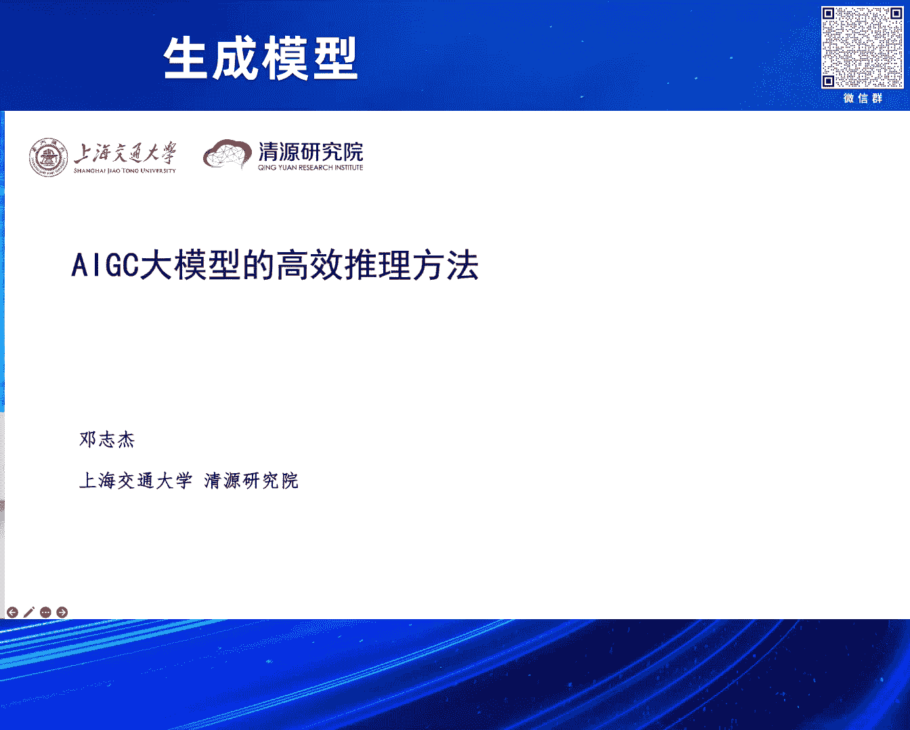
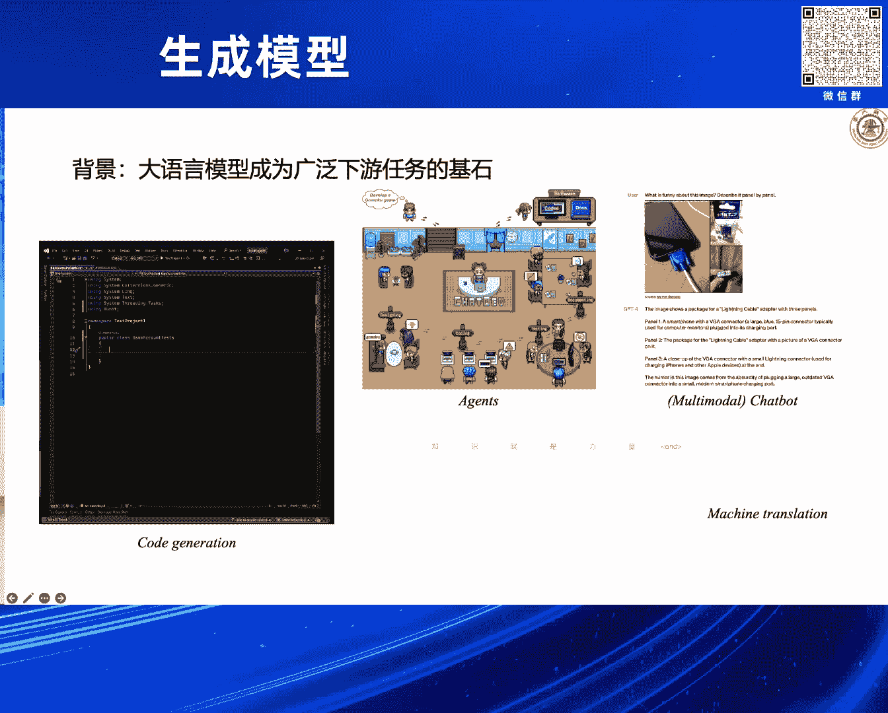
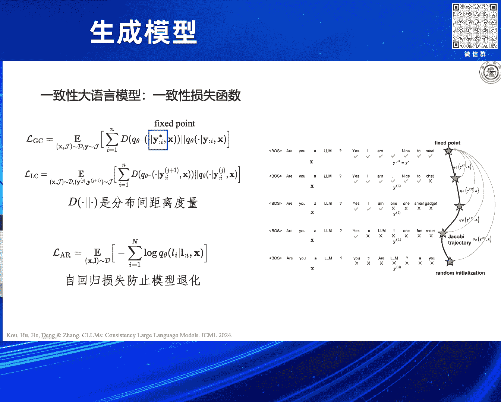
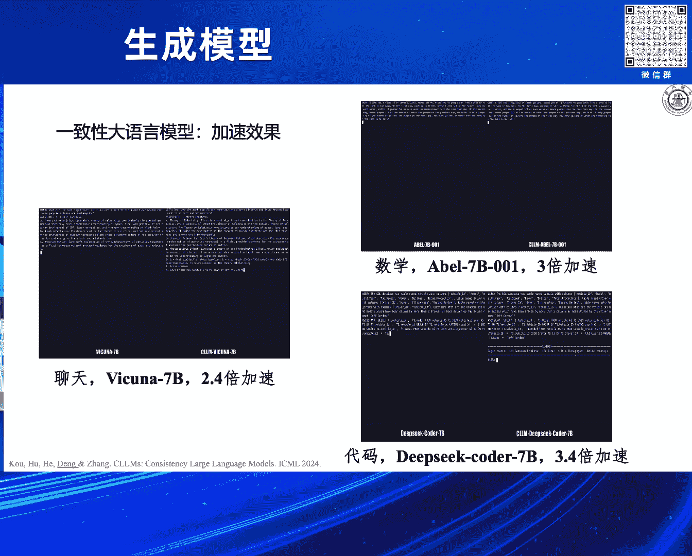
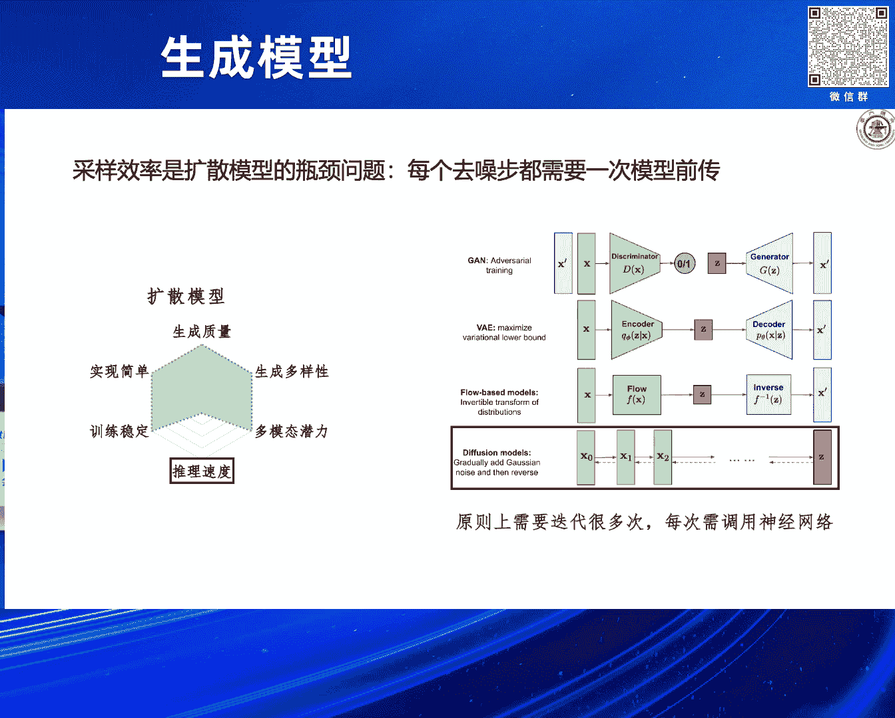
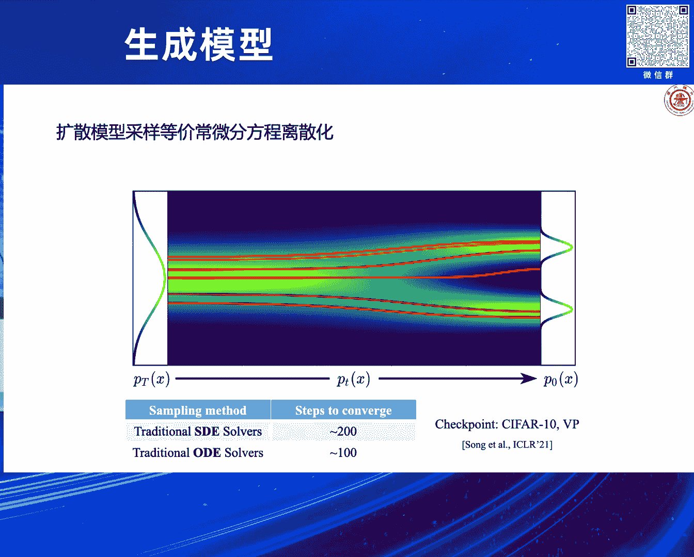
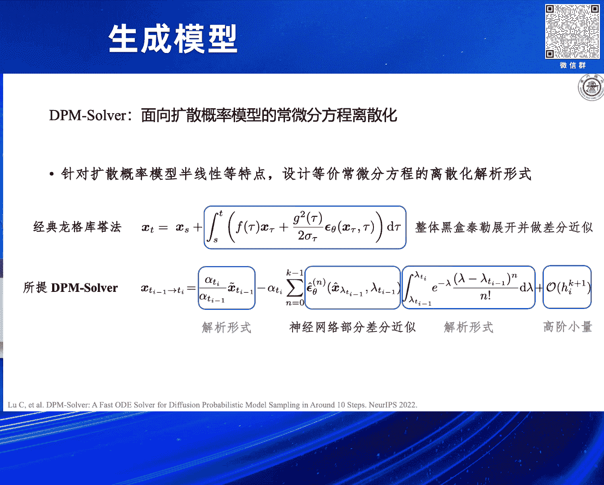
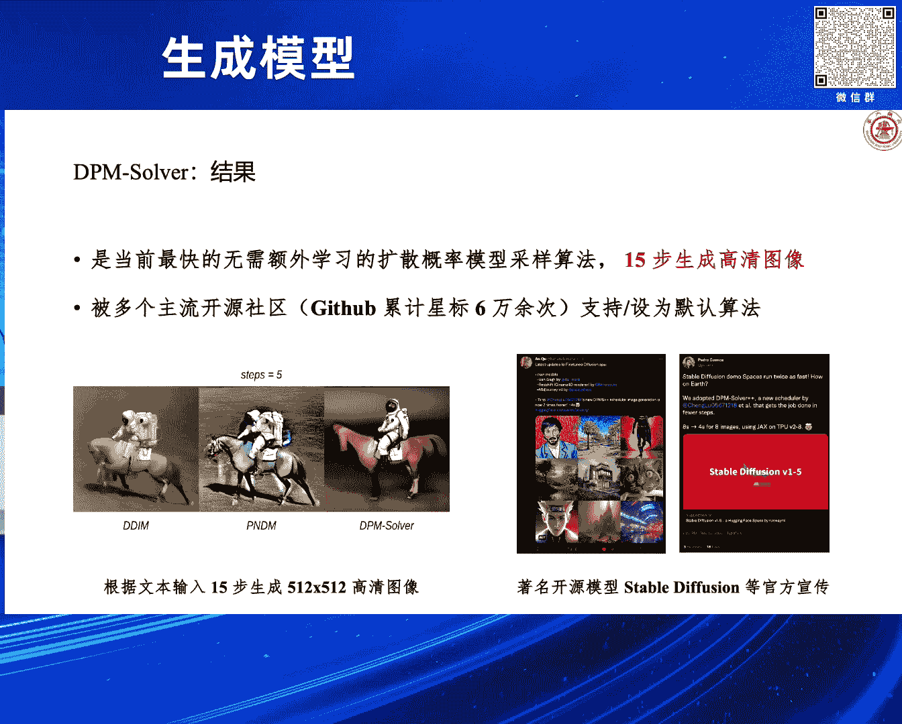
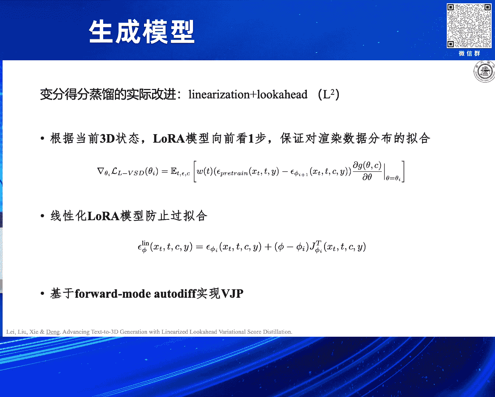
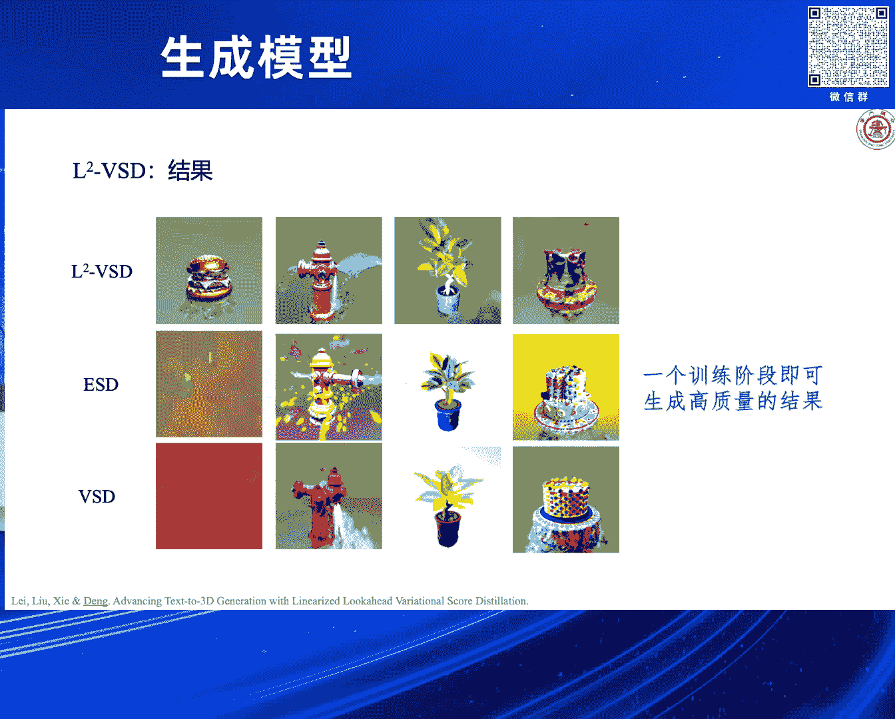

# 2024北京智源大会-生成模型 - P5：大模型的高效并行推理方法：邓志杰 - 智源社区 - BV1DS411w7hz

好嗯感谢主持人啊，感谢智园组委会的邀请，让我有这样一个机会来给大家啊，分享我们在啊大模型的高效推理方面，的一些初步的工作啊，以及一些比较粗浅的想法啊，我是邓志杰啊。

来自上海交通大学清源研究院，那么我们本次报告的背景呢，其实就是啊，这两年我们所遇到的这个时代的背景啊，大语言模型啊，已经成为了广泛的现有任务的基石，然后也激激发了这个广大的啊。

我们的这个研究的兴趣以及工业界的兴趣。

那另一方面呢就是以大的扩散模型为代表的啊，这这类模型在图像尤其是视频生成上啊，所产生的带来的巨大的影响力和价值，那典型的工作就包括我们这个耳熟能详的，open AI做出来的这个SORA。

还有我们这个啊清华的和声树公司，联合做的这个维度啊，这样的一类模型，那么我个人呢是觉得这样，这两类模型其实可以统一在啊AIGC大模型，这样的一个架构下面，并且呢啊对于这两类模型。

或者说对于AIGC大模型，我们也渐渐的发现了啊，他们之间的一些趋势啊，发展的一些趋势，那么第一个就是呃架构啊趋于统一了啊，这transformer啊，在大模型的这个是架构使用上。

具有绝对的这个优势的地位，那么尽管有一些后来的挑战者啊，近期也会有些新的工作，像曼巴two啊等等啊，但是啊目前来说，transformer的地位还是啊无法撼动的，那么在学习方式上呢。

刚才各位老师也讨论的，我们存在多个主流的方向，那么一类，这就是以啊在语言上，以next token prediction为代表的啊，这种自回归的模型，那另一类呢就是在图像上，我们对图像做扩散啊。

扩散建模啊，扩散这样的模型学习方式上啊，目前来说还没有统一，但可能也会有一个统一的趋势，那么呃第三点呢，就是啊我们使我们相当于大一部分的人呢，还是比较相信scaling NO的啊。

然后呢scaling node也就是说啊，我们持续的给我们的模型增加算力啊，增加数据啊，增加啊它的参数量啊，那可以带来更好的这个推理呃，生生成的效果，那么我们作为普通的研究人员啊，或者是很多是学生同学。

那我们面对这样的这个时代，我们可可能也也会想玩一玩这些大模型，我们可以把模型下到我们本地来啊，我们不说训一训的，我们可以把它跑一跑推理一下，但是我们会发现我们会碰到非常多的挑战啊，比如一开始啊。

我我自己弄了一个3090的显卡，我又下了一个模型，发现加载都加载不进来，直接OOM了，爆了啊，这后面我们就加了很多trick给它，把它这个搞好，搞好之后呢，我们就拿模型来生成生存之后。

发现他的这个token一个一个一个的往外蹦啊，生成一段长的回复，他可能会需要一分钟的时间，那么这是比较早在去年的时候，那么这样的一种啊低效的推理啊，是会导致啊非常差的用户体验的啊，所以说从那时候开始呢。

我们就在考虑啊，如何的啊，把大模型的推理低效这个问题给解决了，那这个问题呢实际上来源于两个方面啊，第一个方面就是现在的模型，它本身也是越来越大啊，因为随着skin node的这个不断的扩展。

模型越做越大，那么另一方面呢，我觉得更重要的就是我们从算法的角度分析，我们发现啊，像大圆模型或者扩散模型，它都会依赖一个顺序推理的过程，很像语言模型里面，我们生成的词儿是一个一个自回归的往外蹦。

那么在扩散模型里面呢，我们也是从纯噪声呢啊出发啊，不断的把这个噪声里面的这个呃，把这个图像上的这个噪声给去除掉，生成出一张图像，比如说我们需要一个顺序的啊，漫长的推理过程啊，才能实现啊一次推理，那么由。

那么这个过程呢，会进一步放大我们模型自身大所带来的，这个开销啊，导致整个啊高部署的成本，还以及比较差的用户体验，所以说呢围绕着这个问题啊，我们呃也做了相关的一些工作啊，那么这里呢也会讨论一些啊。

这个领域里面的一些新的进展，那么我会主要分三个方面啊，第一个方面呢是围绕着大语言模型啊，我们会考虑把大圆模型的这个顺序推理啊，改成并行的推理啊，当然不是纯粹的并行，只是呢我们在算法上做一些调整。

用一些新的机制啊，那么另一方面呢就是会讨论，对于大的扩散模型啊，我们如何对它进行低步式的推理啊，那么这里面会涉及两部分，也是啊，一方面是对于扩散模型采样器的设计，另一方面呢我们就从蒸馏的角度出发啊。

把多步数的模型整流到低步数啊，最后呢也会花简短的花一点时间来介绍一下，我们在模型结构以及缓存优化等方面的，一些啊进展，呃那么呃可能大家都对大圆模型的这个，推理过程有一定的了解啊，可能比较熟悉。

但是呢我在这呢给大家简单回顾一下，那么比如说啊我有这样的一句prompt3个词，那我想输到某语言模型里面去，让它往后生成，往后帮我填充，那么首先呢我就把它放到模型里面去，它会生成出后一个词。

那么这一个阶段呢我们一般一个比较啊，大家认可的术语叫做prefer啊，就是我把prompt，PREFILL到我们的这个模型里面去啊，这样一个阶段，那后面呢其实就是一个不断重复的。

把刚才生成的词儿啊接到我们的输入后面去，哎，往后生成下一个词这样的一个过程，那么这个过程呢，我们比较通用的把它叫做这个啊decode face啊，这个decode face呢啊是自回归式的啊。

一个一个的来，那么prefile face呢是一蹴而就的，是并行的，就这三个词呃，Artificial intelligence is，这三个词是同时处理的啊，是同时处理的，那什么时候这个过程停止了啊。

基本基本上有两个准则，一个准则就是它生成出结束符US啊，另一个准则就是它到达了这个模型的生成上限，比方说2048啊，他截止了，那我们分析一下这个呃这个这个推理，或者说这个生成过程里面。

它的这个计算开销啊，时间花在哪里，那么我们说这个prefer这个face呢，它是并行的，是一蹴而就的，所以说啊他的时间我们先啊可以认为是比较小，那如果说我们要生成出来的这个呃，生成出来的话。

也就是decode face是很长的，那么整个的这个推理过程就会很慢，所以很多时候我们的计算开要花在decode face上，那么另一方面呢就是这个decode face我们会注意到。

比方说我们要生成feature啊这个词，那他会看什么呢，他会看前面的这四个词都会看啊，这can用的是这个transformer里面的，这个自注意力机制，对吧啊，这个是要生成的，这个词呢会看前面的词啊。

所以呃它这个地方就要看四个，那么我再看下一个词，它要生成of呢，它就会看前面那五个词，就是说它不断的往后生成我们自注意力机制，它的复杂度是不断的提高的，也就是说到后面它的开销是越来越大的啊。

那么这一点呢啊，是可能会导致我们的语言模型生成，越越往后越慢啊，带来比较大的开销是比较显著的一个地方，那么解决这个问题，一个典型的技术就叫k k v catch，或者说现在已经是一个啊标准的技术了。

也就是说呢我用呃这个空间换时间，因为什么呢，呃我在后面生成，不管是分生成future呃，future还是成off，我其实都是用到前面的这个artificial intelligence is，这个词。

这三个词我都要复用的，就是我要相当相当来说我要把它算很多遍，那没必要，我就可以算一遍之后呢，把它把它那个对应的啊，自助义里面的一些状态存下来，存下来之后呢，我在后面需要啊用到这个地方的时候。

需要看他们的时候呢，我就用他的状态，我就不重新算了，那么这样的一种方式呢就可以啊，相当于以空间换时间，节省了我们的这个flops，节省了计算量，那么对于刚才新生冲出来这个词呢，我把这个there。

我把他的这个呃，这个这个K和V的状态，也可以再丢到kv catch里，不断的把我这个kv catch变大啊，填填填充的更大，那再往后生成，那么这样的一种有k v catch的啊。

大圆模型的推理呢有两个主要特点，那第一个特点就是它的prefer face，其实是计算密集的啊，计算密集的，因为如果说我的prom很长的话啊，其实呃我就可以很充分的把我这个GPU打满。

把它的并行能力给激发出来，但是呢呃大语言模型，它的decode face是memory I/O bd的啊，比如说受限于我们GPU内部的这个memory I/O啊，其实它是flops是跑不满的啊。

主要是把它带宽memory I/O的带宽给跑满了，那这个带宽其实是在我们的这个GPU的储存，和它的一个这个啊高速计算的这个这个存储，可以就叫做HBM，储存和HBM之间的这个通讯啊，这个是比较慢的。

这是比较慢的，相对来说比较慢的，所以呢实际上真正局是限制，我们的这个大圆模型推理的其实是这个带宽啊，储存和HBM之间的带宽，那么我们还有一个这个特点，或者说是一个观察吧。

就说我PREFILL几个token啊，我我我prefer几个token所花的时间啊，可以认为是跟啊我decode一个token的时间，差不多的啊，差不多的，这就是因为我们的这个GPU呢。

它这个flops是够的啊，它并因计算能力够，那么基于这样两个观察呢，我们就在想啊，我们能不能通过某种方式啊，把我们的这个decode face里面的这个memory I/O啊。

这个这个这个需要的量给降下来，比方说我现在生成十个词，需要十次memory I/O，那我能不能比方说给它降成三次两次啊，如果降下来的话，这就可以显著的提高我们这个啊，生成过程的这个速度啊。

解码过程的速度，那么一个典型的这个做法叫做这个投机解码啊，他就是为了实现这个目标，那他的一个想法呢啊是这样，就是说啊比方说我要生成出后面那一段，我喜欢做什么样的，我我有什么爱好，这样的一段这个话。

一段token，他有个假设，他说我要生成的所有token，不是每个token都很难的，不是每个token都有很强的语意的，肯定是有些废话，token对吧，或者是就相当于占位符一样的token。

那么我是不是可以把啊这样的一些token，我放到我的一个小模型上去生成啊，小模型我把它叫做草稿模型啊，Drift model，那这个草稿模型呢，比方说我就先让我这个草稿模型啊，去对我这个问题做回答啊。

生成出六个五个词，生成五个词儿之后呢，我这大模型用来干嘛呢，我大模型用来去这个评判啊，我我去判断我是不是要接收啊，小模型生成出来的这个提议，他这个proposal，那如果说不接收呢。

我这个大模型还可以给他提供一个啊，对于他犯的第一个错的改正哎，也就是他这儿的一个playing，那这里面用的一套这个准则呢，是基于这个啊拒绝性采样的啊，有有严格的理论证明，可以说啊。

我们这个啊通过啊聚云采样啊，得出来的，这个呃采样出来的，这个token的分布是符合原来的啊，自遵循自回归的啊，这个token分布的，然后呢，我们这个大模型去对小模型的proposal。

做验证的这个过程其实是啊并行验证的，这就等价于是做一次啊prefer face啊，去做一次prefer，所以说呢嗯从这个角度来理解，我们将生成三个词啊，它所对应的decode face的时间呢。

转变成啊做疑似PREFU的这个时间，is prefu和三次，这个呃和一个一次PREFILL和三次，这个啊decode它们对应的memory I/O那个交换，我就要少三倍。

所以说因为因为我这个生成过程是被memory I/O，BD的啊，所以说我这个速度呢就可以成倍的提高啊，当然这是理理想情况下，实际呢我们也会呃碰到一些这个啊，不理想的问题，包括什么呢。

包括我们在这会谈论到的，我们投机解码要工作需要哪几个必要的条件嗯，那么一个关键条件呢，就是我们这个drift model小模型够不够小，它得够小啊，才能够快对吧。

另一方面呢就是我我一次这个proposal多长，我一次proposal几个词，我propose一个词呢基本上就没什么意义，把我propose太长了，那我可能前面他接收的也没有，到不了那么长对吧。

这也是我们一个可以调的，可以选择的地方，那么还有一个呢比较关键的，就是我这个小模型propose出来的啊，这个token被大模型接受的概率高不高啊，也就是说我这个小模型。

能不能很好的猜中我们大模型的这个心理啊，猜中它的分布，那这三个因素是比较关键的啊，这是我们自己画的一些，这个它所带来的期望加速比的图啊，对于这三个影响因子来说。

所以呢呃其实对于呃propose的这个长度K啊，我们是可以做调参调的，然后模型的大小呢也是可以我们来设定的，那你这里面其实比较关键的，就是我们要提高我们的小模型，猜中大模型的这个啊这个分布的准确率。

也就是这个token acceptance rate啊，我们要来提高这个东西，那我们就观察了一下，现在的这个投机解码的一些这个部署的系统，我们会发现两个机会啊。

就是来提高token acceptance re的两个机会，那么一个机会呢，就是我们发现我们的这个呃，这个投机解码过程里面啊，我们的这个小模型给出来了一个proposal之后。

其实我们大模型会检测出它的第一个错误，然后呢白送他一个啊，这个应该怎么生成这件事，告诉他白送他一个正确token，那这个token实际上嗯在这个投机解码里，就是被用来了，我们往后接着所生成的。

但我们是我转过来想，这个信号实际上可以拿很好的拿过来啊，帮助我们来做小模型的校正，那么我就教小模型，你下次不能再犯这个错了对吧，那那我这个小模型相当于就在不断的啊，这个过程里面提升自己。

也就我这也也就我这里所说的，这个我们大模型可以免费的提供信息啊，告诉小模型怎么改进它的token acceptance rate，那另一方面呢，就是啊，我们刚才一直强调的这个投机解码的系统里。

有很多这个空的FLOS啊，很多count flops，那我这个有flops，我可以来train模型吗，所以呢我们就啊做了这样一件事情啊，叫做这个在线的投机解码啊，OSD嗯。

那么我们就是把两部分做一个结合，我们在投机解码的这里面呢，做了一个draft model的在线的蒸馏啊，从这个比较直观的角度来说，我们就做了这样一件事情，那去去做法上也非常简单啊，我们可以就是在这个啊。

online serving的这个过程里面呢，我就不断的记录小模型是哪个地方犯了错，大模型给它的一个校正是什么，我用一个buffer来存啊，然后每过一段时间，或者说我的buffer满了之后呢。

我就跑一次啊，蒸馏的一个一个过程啊，蒸馏一个过程，这个蒸馏其实跟我们的这个做做语言模型的，这个teacher forcing的training是差不多的啊，north north是差不多的。

好吹一下啊就可以了，那么它有一个很显著的好处，一会我们在这个这个实验结果里会发现，就是呃我们假设是一个open domin的情况，然后呢。

我们会有一个嗯比较稳定的一个query distribution，就是说啊，我这个我作为一个用户，来用这个大模型的时候呢，实际上我往往倾向于问一个，特定范围内的问题啊，有有可能今天下午我在改论文。

我就可能问的就是怎么叫他帮我改语法错误啊，或者是叫我帮他翻，帮我翻译啊，把有的有的有的人他从事的是金融啊，或者数学相关的这个工作的话，有可能会一直问的是数学的这种问题，那也就是说我们的这个用户。

其实会有一个query distribution啊，这个query discretion是比较窄的，不会像原模型学习的那个distribution那么大，所以说在这种情况下。

我们这个OSD呢就可以快速的适配到啊，用户的这个queries distribution，更好的猜中用户的心理啊，有这样一种感觉啊，那么我们首先就是模拟了一些，在线部署的场景啊，比方说我们的会假设啊。

我们的这个系统会呃会用到这个spider啊，或者GSN8K啊这样的一些benchmark上去，那么随着我们对这个这个这个呃，投机解码系统的不断的query啊，不断的跟他交互啊，我们的模型呢。

这个蓝色的线表示我们的这个模型的，这个猜中的概率，它就会不断的提高啊，这就是很符合我们预期的一个啊，一个是因为我们做了在线蒸馏，那如果base line呢就是用offline种模型，就是不做蒸馏啊。

不做在线，那它就是一个比较静态稳定的一个准确率，不会有提高，那么这个工作里面，我们还做了一个比较有意思的一个呃一个探索，就是我们发现呢我们这个drift model也没有必要，一定是一个啊。

我可以是多个，尤其是在一些复杂的这个呃，query g g g ution的场景下，比方说我这个模型，可能将来面临被多种语言的人来访问，那我就可以其实给每一种语言的人呢。

我部署一个drift model啊，如果说大家会问多个主题的问题，我可以为不同的主题啊，不属于一个这个drift mod，不属于一个小模型啊，然后呢我们再也模拟了这样的一些场景啊。

我们会发现呢在这种混合的场景下，不同的小模型，不同的drift model，他的这个准确率呢也会啊持续的提升啊，这也会持续的提升，那么最终我想可能我们可以拓展为一种，基于用户的这个路由。

我我为每一个用户呢，我可以部署一个draft model，那最终可以实现就是嗯嗯在这个这个用户，他的手机上部署的这份漏洞，更能猜中这个用户的心，啊当然我们也跟一些啊。

比较这个大家公认的BASSLINE做了一些比较啊，包括这个美杜莎啊，然后我们也其实也可以跟美杜莎做结合，然后我们做了一些这个观察，就发现呢这个小模型啊对哪些词能猜对，能猜对嗯，这个提升比较大。

猜对的概率提升比较大呢，我们发现跟这个任务其实是特别相关的，比方说spider，它是一个文本到SQL语句的这样的一个任务，那你就会发现他能猜对的词，好多就变成了select呀啊。

或者是就是跟这个任务特别相关的，然后包括GSN8K呢，它就会很容易猜对一些符号，所以说这个小模型确实是在猜对一些这个啊，就是可能是一些啊，相对来说信息密度比较低的这种token啊。

这样的话我就可以释放这个大模型的，生成的压力啊，帮他做的快一点，那么在刚才这样的一个工作里面呢，我们仍然考虑模型呃，模原模型自身仍然是顺序解码器，然后尽管我们用了一个小模型。

然后用大模型去做啊一个并行的验证，但是小模型呢和大模型在这个里面，它仍然是顺序的，那么我们会呃这是受限于这类模型啊，原模型它是从自回归的这种方式里面去学的，那么我们可能就有一个比较跳脱的想法，就是啊。

我们的语言模型能不能一次预测出多个token，我跳出刚才这种范式，当然这个里面就有一些啊初步的探索，那个这个探索叫做jakobe decoding，这里面其实有苏阳博士的这个身影，这这个些工作。

那他是说什么呢，我们如果想同时啊，从一个大圆模型里面解码出N个token啊，多个token n大于一，那实际上等价于我同时求解呃，一个呃有N个方程的方程组啊，尽管说这个方程组就长这样啊。

这样说这个方程组它的呃第一个方程的解呢啊，第二个方程的解呢依赖于第一个的解啊，第二第三个呢又依赖于第一个和第二个，但是呢我们仍然可以用啊并行推呃，并行的这个求解器啊，并行的不动点迭代求解器来求解。

然后呢可以从理论上证明啊，我们的步数可以不超过N，也就是说我要解我要生成出N个token，我可以求解的步数是小于N，我就可以把它求解出来，小于等于N，并且呢我求解出来的这个token呢。

严格会服从于啊我们想要的这个分布，比方说这个这个如果取的是arg max，我们就是跟GRADY，跟这个语言模型，GRADY生成的这个分布是一致的，那这个可能从公式上比较难理解，比较晦涩。

我们可以看这个直观的图，就是对于我们有一个prompt，有一个prefix输到模型里面来呢，我们呢先随机的猜N个token，随机的把后面N个token给猜出来，猜出来之后呢。

我们就把它们一起丢到语言模型里面去，做一次迭代，得到一个输出，然后呢输出里面跟输入的这个token如果是一样，我就给它固定下来啊，然后呢我就把后面的token呢，我再再再输到前面去啊。

再输到语言模型里面去再做一次迭代啊，最后呢就会得到一个不动点啊，这就是其实做起来就很简单啊，做起很简单，然后呢他用的时间呢其实是呃，那类似于我们之前说的这个prefer一次的时间啊，相对来说它对它。

它跟这个decode一次的时间呢也差不了多少，所以说总共呢他的时间也不会啊，也不会引起太大的开销，但是呢呃2013年的一个工作啊，这个做出来之后说在上面可以用这个方法啊，可以相对于AR有零点呃，有1。

05倍的这个速度提升不是很理想，不是很理想，那么他的原因主要就是因为模型呢，其实在训练的时候，他没有学过怎么预测预测多个token，比方说它前面的词儿啊，前面有两个词没预测对，它后面的词它不可能预测对。

就是概率非常小啊，非常小，那模型没有这个能力，我们就想我们得把模型这个能力给他给他，给他习，得给他学会啊，我们可能就要需要调这个模型，那么我们就想设计怎么样的一种学习目标，来调这个模型呢。

我们还是从这个角cobe decoding，这个不动点迭代的这个角度出发，我们如果看这个图上，右边是jo be decoding的一个轨迹啊，它是不动点迭代的一个轨迹，其实很类似于我们的这个呃。

这个diffusion model里面这个ODE采样的轨迹啊，很像啊，确定性的，我们就想，那我们的终极目标，其实就是让模型直接从随机的初始化映射到它，最后那个不动点，就学这个映射，就学这个映射。

但这个映射呢，就如果直接以这个作为north function去训练，训不出来，就是我们也做了一点尝试，因为这个问题太难了，你一次往后猜十个词，十个词，这还得了，就是这个很难猜不对。

那么我们就想有没有一些折中的方案啊，我们就从这个consistent model啊，也是孙杨博士做的这个啊，对于defer model加速的工作里面啊，得到了一些灵感，我们就想嗯。

我能不能把这个轨迹上的任意一个点啊，都映射到他的这个fix point上去啊，我们这样的话我就可以定义一组啊损失函数，一组学习目标，那么这一组学习目标呢，它就有一个很好的这个性质，就是说嗯。

我我我从最后我就要往fix point的这个预测的话，这是很简单的，其实我就往后预测一个词，两个词就够不了，这是很简单，但是越往前越难，它就有一个从易到难的这样的一个变化，那我觉得可能这这个变化呢。

对于啊模原模型来说，或者说对于大模型的训练来说呢，其实是可以给它起到111点的，这个引导作用的，可能会有一些啊课程学习这样的一种感觉，所以最后呢我们就用了这样的一个呃学习目标，来来来学习啊。

我们就定义了啊，我们有两种选择来定义这个一致性损失函数啊，Consistent north consistency laws，那一个呢就是我刚刚说的，直接就从中间的任意一个状态啊。

不动点迭代状态去预测不动点，那另一个呢就是很类似于consistent model里面的，这个loss，就说我找两个相邻的不动点啊，然后呢我的目标就是把它俩预测到一起啊，让他俩的预测一致啊。

这是我们的两种north function，但我们发现呢其实还有一个比较关键的点，就是这里面呢我要把自回归的损失我要加上，我如果不加上自回归的损失吧，模型很有可能会这个崩塌啊。

他这个就就就全生成出同样的一个一个，一个token，或者说就什么可能找到一些捷径在这里面，所以说我要用自回归的损失呢来矫正它。

这是最后我们能够达到的效果啊，在几个我们这是选了几个case，当然我们还有做了其他的一些case，基本上来说我们对于现有的模型，比方说VIKA呀，或者是deep deep sick coder啊。

拿过来我调一下好调一下，不需要调很久，后面我们有时间啊，简单调一下就可以达到，用我们的那个loss function来调，调完之后就可以达到，基本上223倍的这个加速。

然后呢同时他的这个生成质量是啊不会下降，不会明显下降的，哎就是这个10%到5%以内的下降啊。

这个表里就有我们的这个啊，加速时间和这个啊性能啊，这一个系统性的这个比较啊，至多来说是有3。6倍的加速，我们知道今现在这个市面上，可能在大圆模型加速上，比较这个啊权威的一个方法就是美杜莎啊。

美杜莎呃他的第二个版本啊，那美杜莎他的名字就是呃，那这这个名字我们就能猜出来，他这模型是有多个头的，多个输出的头，那他就需要对模型架构上做改变，然后呢这个头其实很重，然后他也要训要训很久。

那我们来说的话，我们就不需要改模型，我们需要改一下模型的这个训练的objective，就可以了，在生成质量上，我们也可以达到基本上不怎么下降，比方说原始的我们的这个呃希尔GBT呃，这个MT奔驰上是6。

5，我们修完之后也就6。4啊，也就一点点啊，这是我们训练的开销，我们训练的开销，我们是啊已预训练这个模型，预训练它用的token数啊作为基准，我们我们我们做的微调相对于预训练啊。

我我这个token说我吃他的那个比例是多少啊，基本上都是小于百分之0。10。2的，最后我们也分析了一下，就是呃这个一致性，我们做的这个一致性大圆模型呢，它所带来加速的根源是什么啊。

我们就做找了很多case来看，我们发现其实主要有两个根源，一根源呢我们叫做这个啊，Fast forwarding，也就是说我一次可以预测出预测对多个词啊，预测对多个token啊。

这这在这右这个这个图的右边，大家可以看到，我可以一次至多可以预测出三个三个token对吧，那另一个呢就是呃叫做stationary token，也就是说呢在前面还有预测不对的情况下。

我可以提前把后面的某个词预测对，但这个情况下这个情况是比较少的，相对于fast forwarding是比较少的啊，因为这个任务这这样的一件事情确实是很难，就是很难，OK那我们第二部分呢。

我们就会介绍我们在这个大语言模型啊，啊以及这个我我们的这相关进展啊，包括我们做的一些工作，哎，在大扩散模型的这个地步地，部署重流方面做一些工作，那扩散模型呢呃这个他的这个推理慢。

每一个去造部都需要一次模型前传。

我想我也不需要给大家重复了啊，之前呢大家啊会比较关注的一个点呢，就是从呃这个呃设计扩散模型的采样器，这个角度出发来加速扩散模型的推理，当然我这边用的其实是啊，李钟元老师的这个一个PPT啊。

因为因为呃有有有一个视角，就是我们的这个扩散模型呢，它有一个啊长它的这个反向的SD过程，有等价的一个啊常微分方程，有个常微分方程，那叫做这个概率啊，概率流产原方程啊，这也是孙杨博士。

在他这个12021年的文章里面，这个给出来的，我们发现呢这个长元方程和啊，它对应的这个啊随机分为随机分微分方程，它们的这个边缘分布是一样的啊，但是呢这个常用方程它是更加平滑的啊，它平滑，那就给我们做啊。

在它上面的一个快速采样提供了机会，我们可以用非常这个快的呃，或者说一个比较大的跳跃步啊，在这个这个啊超越方式上去走，所以呢现在呃也有很多这个啊基于呃长呃，长扩散模型的采样。

从这个长元方程离散化角度来做的一些工作啊，那么在21年的时候，就是大家发现我们就即便是用传统的o d server啊，其实就可以啊，相对于sd server啊，有有一个很很大的这个啊速度上的提升啊。

可以减少这个推理步数啊，减少两倍。

那甚至说我那后面呢我们就可以呃，为专专门为这个default model设计，适合于它的这个o d e server，那么这里面代表性的工作就是啊，清华大学做出来的这个DP m server这个工作。

那它就是面向啊扩散概率模型的常微方程，离散化啊，它利用了这个啊扩散概率模型它半线性的特点，然后呢基于呃，基于泰勒展开等一些这个技术来设计它等价的，长元方程的啊离散化的解析形式。

然后最后呢啊再可以用一些差分，来近似里面的一些计算项啊。

最后得到d pn server，d pn server它的效果特别好，然后主要是也被我们的这个社区广泛的采用，像这些啊主流的这个SLIABLEDEFUSION啊，啊或者是搭理啊。

可能都会用到这样的一个呃，d pm server这样的一个高效的采样算法。

那我就以DP m sorry为代表啊，介绍了这个呃这个从这个采样器设计的角度啊，来加速扩散模型的方案，那我们更多会讨论的就是从模型蒸馏的角度啊，我们怎么啊实现啊低步低步数的这个推理啊。

实现扩散模型采样的加速，那么我们最早这个出现相关的工作呢，叫做这个渐进蒸馏啊，Progressive distillation，那他呢也很直观，比较好理解，就说我原来比方说我需要做四步采样。

才能从噪声啊恢复出X的话，那我现在呢我就可以把它中间的每两步，蒸馏到另一个模型里面去啊，直接让另一个模型基于EPSAL来预测出两步之后，他的状态哎，或者说啊从那个状态到EPP。

epp one之间那个差值啊，就是他要走的这个啊走多少，然后呢，我我做了这样的一次这个蒸馏过程之后呢，我就可以把四部的一个啊模型啊，四部的一个采样过程，蒸馏为一个两步采样过程啊，如果说我再重复一次的话。

就可以把两步蒸馏成一步，这样的话我就可以渐进的啊，减少扩散模型的这个蒸馏的这个呃，呃渐进的采呃，减少它的这个采样的时间啊，呃之后呢CVPR2013上的这个工作呢，就啊进一步的改改进了啊。

这样的一个啊禁忌蒸馏的方式，为他引入了CFG，然后做到了更大的模型，做到了这个文生图的场景里啊，做到了隐空间的这个扩散模型上啊等等，把这些必要的这个技巧都引入进来了。

但是呢这类方法它还是有很大的一个问题，就是它需要证流多个模型，就是啊对于不同的这个采样部署，比方说四部或者八部啊，它一般都是训练，专门的一个八部模型和一个四部模型，就是它有多个模型，然后呢它的这个蒸馏。

这整个成本啊还是比较高的啊，可能需要上千张显卡来做这个蒸馏，那么有一个这个比较好的解决方案啊，就是从这个呃，就从这个共享这这这这几这几个啊，不同步数的模型的角度来说。

有个比较好的解决方案叫做一一致性蒸馏啊，那么一致性蒸馏呢它是从这个角度来理解的，他是想我们如果考虑从defer model里的采样，那实际上我们是在对我们的这个概率流，ODE啊做离散化对吧。

然后这个概率流ODE呢，它实际上定义了一个，从噪声到我们的这个观测数据的一个一一映射，一个一映射，我们之前呢是需要用一个流程，来把这个映射给跑完的，用一个sampler来把这个跑完。

那我现在就想我能不能直接用一个模型来建模，这个映射，我知道这个模型的输入是啊，这个呃这个ODE轨迹上的一个状态，让它的输出直接是一张干净的图像啊，在这个ODE轨迹末端的这个干净图像。

如果说我能构造出这样一个模型，那我就可以实现啊，一步采样的这样的一个目标啊，就是把采样步数尽可能的降到了最低的，那它从形式上来说呢，我们就会发现我们需要定义这样的一个模型啊，FC它，然后它的输入呢是啊。

我们的这一个一个呃OD轨迹上的一个状态，那么理想情况下，我们只需要把最终那个状态给给给给输进去，那实际上呢为了我们的这个模型啊，可以训练，然后呢可以是服务于多步材呀，我们也可以考虑把OD轨迹上。

中间的一个XT给输进去，反正呢我们就是让这个轨迹上的所有点，都能映射到X0，映射到一张干净图像上去，然后这个呃FC它这样的一个函数呢啊，它的参数化呃有有一个比较有意思的技巧，因为我们会发现。

如果说这个f theta它的输入这个T是零的话，那其实我们就可以直接把它同时输进来的，这个XT给return出去啊，因为就表示呃，我已经就是在这个OD轨迹的末端了啊，就是最后那个时刻了。

所以呢为了实现这一点啊，就是呃一阵与蒸馏呢正从模型构建的角度啊，就做到了这样一个事情啊，他就是做了我们的这个数据输入数据X啊，和我们额外的一个建模模型，FC的大FC塔之间的一个差值。

那么它们之间的这个差值的VT呢，就可以保证在时间不是零的时候情况下，我就把X输出出来，那这个模型的训练呢是呃，可能初看它的形式有点复杂，但实际上也啊比较好理解，就是我们先呢把一张干净的图像，X0啊。

降噪啊，加到XT撇这个时刻上去，然后我我我现在不就是考虑XT撇，在哪个ODE轨轨迹上吗，那为了确定这个ODE，我就要拿一个预训练好的defer model来走啊。

因为这个预训练好的dev model就确定了一个OD，那就让它呢往前走一步啊，走到XT这个位置上去，然后呢我的学习目标就简单了，我就只需要让我们的这个XT撇和XT，放到我们的模型里面去。

都能预测到同一个初始状态啊，那就说明他们是在同一个ODE轨迹上了，所以呢这就定义了一致性蒸馏的这个损失，一定蒸流损失，那么这个结果其实是去年来说，是啊一步生成的SOTA的结果啊。

在saver ten和这个image led上，EB站64上，然后呢它也有很多的这个应用场景，那么今年呢就哎也是清华大学做了一个工作，就把它给拓展到了隐形空间啊，在影空间上做了一个一致性的蒸馏。

我们把它叫做这个这个latent latent consent model呃，然后它最后能实现的目标呢，就是它四部就已经生成的很好了，然后呢在一部和二部的情况下呢，仍然可以生成，仍然可以生成。

但那效果我们也测了一下啊，这个一一部和二部的情况下没有那么理想啊，所以呢我们也做了个工作，也是延续隐空隐空间的一部一一致性蒸馏，我们就把它拓展成了多部，我们就想其实我们直接呃让我们的模型学习。

从噪声到数图像的一致性映射呢，这个问题本身也挺难的，那我可以考虑呢，我首先将我们要建模的这个OD轨迹呢，我给它切段啊，比方说我一开始给它切成十段，16段，那么在每一段里面，我让他学习一个一致性的映射。

然后呢我不断的通过减少段数，比方说我一次让这个16段变成八段，然后训一会儿之后我再让它变成四段，这样的话呢，我就可以有一个嗯，相当于热启动的这样一种感觉啊，可以我们发现这样的一种方式。

可以提升模型的这个收敛啊，改进改进模型的收敛，然后呢，我们还还这个啊使用了一种这个training data free啊，就是我不需要training data来做蒸馏的一种方案啊。

就是其实说白了也简单，就是我们从啊教师模型的采样啊，从他出发来做蒸馏，最后呢我们引引入了一些偏好学习，因为现在大家会比较强调符合美学，符合这个啊一些这个伦理道德啊，这样的一些呃要求。

所以我们引入了偏好学习的一些损失，兼顾了这个加速和对齐两个方面呃，这是我们最后得到的效果啊，然后呢我们是啊，不需要训练图片统一的一个多步生成模型啊，然后在两部的情况下就可以实现高质量的啊。

1024分辨率的图片的生成啊，比SD叉L和hyper sd要好很多，然后也赋能到了一些产业界里面去呃，在这个这个模型的拓展方面呢，也和control做了一些这个结合，发现效果也不错啊。

然后还我们还可以做到中文的这个生成，包括对于中文的一些语境的理解，就是我给他一些这个中文的诗句啊什么的，像蓝水箱啊这种感觉，那这种可能就不不单单是汉字层面的，就是我对这个语境啊有一些理解，那说到蒸馏呢。

其实我们也啊绕不开一个话题，叫做这个得分得分蒸馏啊，他也是就是啊我们从这个模型加速的角度也好，从2D到3D这种理的角度也好，就是绕不开的一个算法，然后呢以及它的一个改进算法叫做变分，这个得分正流啊。

它是以通过引入变分推断的方式，缓解了原始的得分正流的一个巨大的问题，然后呢我们会发现这个变分得分蒸馏里面呢，它有两个模块，一个就是原始的我已有的一个扩散模型分布。

另一个呢就是我需要额外引入一个用LAURA啊，加持的啊，一个拟和渲染图像分布的呃这样的一个模型，这两个模型呢呃呃就是这个NORA模型呢，和我们的这个3D的这个状态交替优化。

我们发现呃这样的一个优化过程呢，在在实际里面，我跑代码发现它就是存在一个比较empirical，就比较现实的问题就是收敛比较慢，然后呢也需要多个阶段的训练，我们就在想，能不能把这个多阶段。

我给它归归归约到一个阶段啊，让他一个阶段就能做的很好呢，那么我们发明了一种就是啊向前看一步啊，这样的一个呃，我把我发现把这个简单的这个思想给引入进去，我就先把我们的这个呃nora model呢。

在我们当前的3D state上我都多训一步，我发现确实可以改善啊，这个呃变分得分蒸馏的一个这个这个收敛，但是呢它会存在一个过拟合的风险，所以呢我们又提出把这个nora model呢，我做一个线性化啊。

给它线性化一下，它变成一个线性模型。

就不容易过拟合，最后呢我们有一些trick来实现高速，高高效地实现这种线性化，那最后我们得到的结果就是，我们基本上一个嗯系统决断就可以啊，比较明显的就是也优于已有的方法啊，包括VSD。

还有EESD这些方法。

最后呢我们在呃讨论一下，在模型结构以及啊学习状态等等，这些其他方面的优一些优化方法啊，这里面呢很多就是啊比较啊，出名或者经典的一些工作啊，也不也就是给大家这个简单的分享一下，那模型结结构上呢。

其实我们一直都在想提高模型的这个表达能力，但是呢现在你你你你单纯的把模型加深，加大之后呢，它很慢，所以呢有比较出名的一比较近，这个这个大家通用的一个机制叫做专家混合啊，专家混合，那它里面就是关键。

就是我比较稀疏的激活这些专家，我在保证模型的这个能力的同时，我可以降低它的计算开销，这里面的代表就是IMMIXTURE，然后千问啊，然后deep sick啊，他们为代表的一些MOE的模型。

那么深度混合呢是对于MOE的一个改进啊，他是认为呢MOE他这样，因为他这样可能会导致不同专家的node啊，不同专家的负载不均衡不均衡，我们怎么呃，这个就就可能会拖慢整个系统的速度啊。

所以说我我我这个MOD呢，就从从专家的视角来出发来做这个柔体，来做那个token的这个呃，只拿到token的这个选选择，选定它保证负载均衡，但是呢它有一个问题就是比较难做。

cole model0就是来做我们通常所说的language model ning啊，从前到后，从左到右这样的一个因果顺序比较难建模，那我们做了一个很初步的工作，我们发现什么呢。

我我在MOE里面我就加一组空专家啊，加一组空转夹，然后呢我就把MOE选top k这个key我加大一点，我就可以保证对于不同的token，我可以自适应的选择专家术，如果他全选了公众专家。

那这个那相当于这个token呢，我就需要零个专家来处理，零个真实专家来处理，如果他是全选的真实专家呢，那就需要嗯比方说四个真实专家来处理，那从这个角度来说呢，我们就可以极大地增加模型的灵活灵活度。

然后呢呃我我们再通过一些负载均衡的损失，来保证控专家的使用率啊，最终可以就是这个在呃，保证我们优于这个呃MOE啊，在这个这个这个负载利用率上是优于MOE，然后呢我们的建活力模呃。

建模灵活性是由于MOD的，因为它不能做啊，cos l的这种建模，对那个mixture87B，我们简单的微调了一下啊，就可以在性能不降低的情况下降低呃，这个20%的FLOS，influence的FLOS。

那么在token序列上的优化呢是呃，这也是一些像呃已有的工作啊，一个典型的工作叫做to me啊，它就是呃把啊基于相似度，对我们的这个token序列做合并，来降低我们transformer里面。

这个token序列的长度，从而提高它的推理效率，那么近期吧有一个比较这个呃出圈的工作，就是这个virotoken withdraw啊，他是说我在VOM啊视觉语言模型里面。

在后面我其实可以把那些视觉token全扔掉，尤其是16层之后全扔掉之后不影响性能啊，这也是比较有意思的一些现象，那在k v catch上的优化呢，我们也呃，就是从这就这都是比较这个出名的工作。

包括我们可以对啊这个query呢做分组啊，降低KV开始需要存储的这个内容的量啊，存储的状态的量，那么还有就是啊，deep sick他们做的这个啊多头的啊，latent attention啊。

它就是通过啊低质映射，把k v catch投影到低维的向量上去，存这些低维向量啊，从而是有效的降低缓存，那么其他的一些方法还包括啊，streaming l o m和H2O啊。

这也是啊今年做出来的比较好的一些工作，那么以上呢基本上就是我啊，想分享的一些内容啊，对于未来的一些研究方向呢，我觉得在AIGC大模型的高效推理方面啊，我们还可以做很多基础上的这个呃这个研究。

尤其是从模型架构啊，模型的学习或者训练方法啊，以及采样算法上啊，其实还有很多工作可以做，那么我个人认为可能比较重要的两个场景，就一个就是回到多模态这样的一个场景里面，那另一个就是啊视频生成啊。

世界是学习世界模型这样的一个目标。

好以上就是我的分享，然后谢谢各位专家啊。