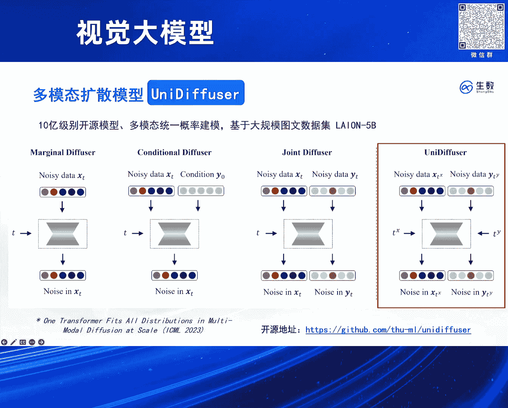
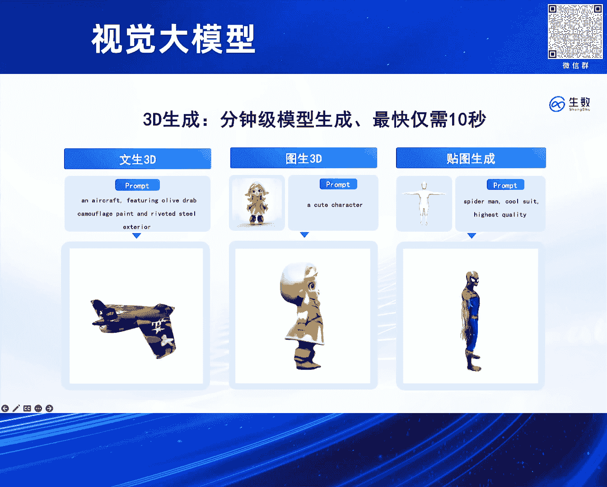
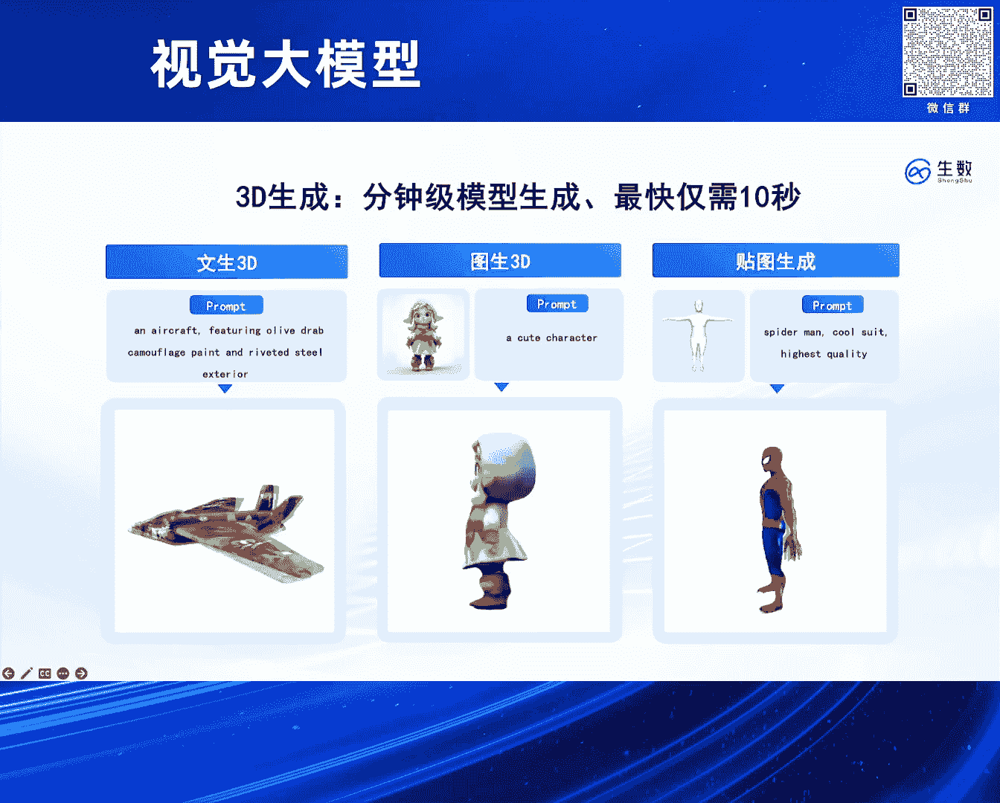

# 2024北京智源大会-视觉大模型 - P3：高保真 4D 重构模型 Vidu4D：鲍 凡 - 智源社区 - BV13x4y1t7sb

啊喂大家好，今天和大家分享一下，这个咱们生成式AI的一些实践，就是特别是啊我们视频大模型飞度呃，在这种私立上面的一个生成的潜力哦，对然后介绍一下我自己，我是申树科技的鲍凡呃，还是先从这个维度的一个。

整体的技术路线开始讲吧，呃就从他的一个比较底层一个架构开始呃，当时我们是在两年前左右吧，可能两年前呃，4月份开始做这个UVIT的架构呃，他应该是比这个OpenAI solo。

后面DIT还要更早发表一些呃，大概是比他早发表三个月左右吧，然后他其实也是一个扩散模型和transformer，融合的一个架构，呃对他类似，就是把呃也是那种一致的思路，就把这个图像打成patch。

然后patch加造，然后再用transformer去对这些patch做一个去造，对然后我们的架构其实是一个非常简洁的架构，因为你可以看到呃，他是把所有的输入都给统一化成一个token。

就是无论是扩散模型里面的这个条件condition，还是说扩散模型面它这个独有的时间TT，哎我们都把它呃不做区分对待，就统一处统一处理了，这呃陈哲token，然后把他们就一起拼起来。

送到这个transformer里面去，对，这其实对transformer的架构，几乎不需要任何改变，就是如果大家翻DIT论文，可以看到，他对transformer里面还是做了不少的呃。

针对扩散模型的一些特殊的设计的，比方说那种呃在呃把各个参数变得跟时间相关，就是一个叫做adaptive ler normalization的设计，但在我们架构里面，这些通通都没有。

所以基本上你随便拿一个transformer，就可以在很快的时间把它转换成一个diffusion，transformer呃，然后然后并且我们实验表明，就这种非常简洁的设计，它的效果其实也是非常好的。

呃然后值得一提的是，就是我们也加入了一些这种独特的呃设计，比方说这种长连接，就他把这种底层的broke和这种高层broke，做一个这种跨层的连接，然后使得它呃训练上能有更快收敛。

这在我们大量的实验里面都是被验证有效的，呃对然后呃在做v do之前的话，其实我们已经有了一些大规模的尝试了，在去年1月份左右，我们呃呃发表这个un defer这个工作，然后他是一个11参数上的模型。

然后当时是想啊把这个由VIT架构啊，然后去做成这么一个多模态的，一个统一的一个生成式建模呃，他大概能做呃，就他用一个模型，用一个扩散模型，然后可以处理同时处理呃若干个不同任务。

比方说你有这个文本和图像的模态，然后在他们上进行一个训练之后，然后这个模型就能完成，这两个模态之间的任意变化，以及说这样个模态的独立的生成，或者说是联合的生成呃，值得一提的是呃，这个架构呢。

我们只对扩散模型本身的这种FORMERATION，做一些最小的改动，呃，其实就是从一个单模态的输入，变成双模态的输入，然后从单模态的时间T，把它拓展成这种双模态的时间T。

然后并且呃同时预测这样个模态上面的噪声，然后也刚刚好，就是UVIT非常适合处理这种任务，因为它其实已经把这种所有的输入。

都统一成了序列，对，然后呃当时这个架构的话，基本上是能够对标stable diffusion，然后无论是这个数据量，还是说这个模型的参数量上，然后并且也验证了这种应该说是首次验证吧。

这种纯transformer的一个diffusion，能够有非常好的图像生成的效果，呃这笔就是sorrow，或者说最近开源的那个pixel art，pixel art呃，都会都要更早一些对。

然后我们也可以看一下，就是把这un defer架构去呃，进一步在更高质量的数据上去学习的一些效果，就它也可以支持多分辨率的生成，无论是竖屏还是横屏，然后这种呃美学多元的风格，他都能非常非常好的。

这么一个掌握嗯，所以他其实也是在工业界和在实践中被充分论，证有效的这么一个架构，对，然后并且这种架构其实也可以有，非常好的语义理解能力，就他能够把这个所有prompt里面的每一个细节，都刻画到。

嗯对然后基于这种架构的话，就是他可以在上面去搭一些3D的东西，比方说这种纹身3D图，神3D和这种呃贴图生成，然后他们来说是呃，相对于是一个paper里面的两个环节吧，呃比方说在这种呃扩散模型基础上。

用一些那种呃VSD那种蒸馏技术。

然后可以从这个模型里面去蒸馏出一些呃，这种3D的表示。

对然后在后面的话，其实呃除了这种图像的模态，我们也做了挺多一些3D和4D的工作呃，比方说热的话，就是你给任意的一段呃真实的视频，你可以把里面这种物体的一个4D的表示，提出来。

然后你可以在这个4D表示的基础上，对它做任意的编辑，其实就呃等效的呃，我们就对这段输入视频做了一些非常精确，可控的一些编辑，比方说把视频里面的主体呃，换成一些别的小动物之类的。

得把这个把这个猫也可以做这种任意的编辑，然后把它变成这个戴红色帽子的，一个小狗或北极熊之类的，然后并且呢也可以，因为它是一个4D的表示，所以你可以从任意的角度对它做这么一个渲染。

呃除了这种4D的这种物体编辑，然后我们对这种场景的编辑也是可以支持的，非常好对，就是他是把这个3D的场景表示，用这个高悬spreading这个表示呃，对来进行一个表示，然后它有非常好的这种可编辑性。

然后你可以在这场景里面给它添加任意的物体，然后或者说删除任意的物体，这些都是可以做到，比方这case里面，我们就可以在桌子上给它添加一个花瓶，然后其实它背后都是这个高悬PREADING的。

这种3D的表示，也就是可以看到我们在这个生成式建模上，还是呃有比较充足的耕耘的啊，无论是从这个底层的呃基础理论上啊，比方说我们一些关于基础理论的工作呃，入选过这种杰出论文奖。

或者说被open AI的一些项目，以及说呃stable diffusion这种项目呃被采用呃，然后后面的一些这种关于网络架构的一些工作，然后再到后面这种大规模工程落地实践。

我们都有一些呃比较深厚的基础对，然后这些之前基础也就是支撑，我们可以做呃后面这个维度这个工作，然后他是呃关于这种底层的理论，以及说呃网络架构，以说这种工程实践和数据的一个呃，共同的这么一个长处吧。

对然后对大家可以看一下，就是我们V度在最近也是能够支持到，32秒的视频，然后他也是呃完全从头的这么单次的生成，对他就是基于一个diffusion transformer，然后一次性的把这个32秒视频。

给它生成出来呃，对，然后其实我们可以在这个生成的视频的，基础上呃，再给它加上这种audio模态，就比方说你通过video然后去做一个video to audio，或者说从test to audio。

然后你可以给这个视频，就是做一个比较自然的配音，当然我们现在这管线还是多带来的，就我们后面也会探索，就是那种一次性的视频和呃，音频的这种联合的生成，这种时候可能他就生出来的音效，会比现在还要更加自然。

更加符合这个场景一些，呃包括这种在画室里面的什么，然后这个例子大家应该也都挺熟悉的，就是OPENAI，他也展示过这个开车的例子呃，然后我们可以进一步的在这个粒子基础上，把这个背景音。

然后和这个汽车的轰鸣声音呃，都通过呃，这个video to audio或者说test audio方式给它补充上，还有这也是open i展示的，那个在馆里的一堆电视机的例子，然后我们再最后再提一下这个呃。

比方说我们有这么一个video的高质量的视频模型，之后，我们后面能进一步做一些什么事情呃，对就视频生成模型，它其实有这种大量的真实的想象力，然后其实它可以进一步的去去增强这种三呃。

3D4D重建的一致性啊，有着这么一种作为世界模拟器的潜力，对这个地方我们想解决一个什么问题呢，就是我们给定了一个生成视频之后，我们想把这整段视频里面的这么一个，3D的表示给它提出来啊。

那实际上这种呃带有序信息的3D表示，它其实就是呃可以被称为一个4D，因为就3D的表示，再加上一个时序的维度，它就被叫做4D，然后类似于这种NF的重构吧，我们是希望把给定一段视频之后。

把里面这种带有时序的3D给他，也给它提取出来呃，对然后在这个工作里面的话，就是呃他有这么一个核心的技术吧，叫做动态高斯曲面DJS呃，怎么理解这个事情呢，就首先嗯我们要去对这种4D的表示。

做一个良好的呃建模就是一种比较粗糙方法，就是你每一帧你都可以给他一个3D的表示，那这样子显然是一个比较低效的做法，这意味着你每一帧的3D表示都是独立的呃，那所以的话。

其实对于这种连续视频背后的这种3D呃，表示我们可以通过呃，对于首帧的这么一个3D表示，及说再加后面每一帧的这个，3D的一个变化量啊，去代表这么一个CD表示，那这个变化量的话啊。

在这个场景下面就叫做working呃，可以这么直观理解吧，就是你对这个3D的表示做一些扭曲啊，比方说你呃右下角那只猫，然后它在时时间中他做了一些呃方向的转换，那其实我们是可以把这些转化这种变化量。

用这么一种空间扭曲去做一个表示，然后这种空间的扭曲，在这里就叫就被称作是working这个事情对，然后呃这个呃4D的这个重构技术，它其实跟3D也比较类似，它分为呃它有一个最基本的这种呃重构的rose。

这个rose其实就是可以类比为这种NERF里面，对于这种基于这种像素的一个重构，然后它这个里面其实就是对于视频里面，每个点像素的这么一个重构，就说你先从这个4D的表示，然后通过体渲染去渲染出呃。

这么一个预测的视频吧，然后再把这个预测视频和ground tru的视频啊，去做一个这种呃回归的lose，然后这是一个rose，然后另外一个rose的话，你是呃要去做这种一些关于这个表示的。

正则化rose，就你希望这个表示能够呃4D的表示，能够有一些华的性质啊，有一些这种比方说它在时间上呃，有这种连续，也说在空间上有这种啊被分布在表面上，这种平滑性质。

然后所以他需要一个额外的正则化rose，那这正正则化的loss的话，它是通过那种呃你可以这么理解，它就希望这个loss的效果，就促进它能够达到这种呃，把这种呃3D的这个高选的这个点。

然后被比较均匀光滑的，分布在某一个物体的表面，对，这就是这个这个工作里面所提出的，两个比较重要的rose，然后呃基于这两个rose，我们可以呃对这种3D的视频啊，做这么一个重构。

比方说这个左上角的它是呃，它其实就是一个4D的表示的，就它里它有一个输入是一个3D的视频呃，它有个输入是一个维度生成的视频，然后这个维度生成的视视频呢，我们可以把它提取出这种呃4D的表示。

就是左下角里面这个呃，可以看到这个几何的这么一个变化的几何，它其实就是那次节表示，然后通过这4D表示，我们可以把它渲染成上面的左上角这个猫，然后其实是进一步的呢，我们可以对这4D去做任意的一些编辑。

就这编辑这编辑的，你可以放到这种游戏引擎里面，去做一些手动的操作，比方说把它一只耳朵给它弄大一些，比方这眼睛弄大一些，然后他其实都可以呃，后面可以进一步的去做渲染，然后渲染出一些你所需要的一些新的形态。

对这是一些更多的例子，对，所以就是我们从这个维度4D这工作里面看到，就是这种视频大模型有非常深刻的，这种作为一个世界模型的这么一个潜力，我们呃真的可能把这个世界上的各种物理规律，都给模拟出来。

然后可能后续再结合上一些呃，3D或者4D的技术，然后把这些具体物理规律给它，提取出相关的一些表示，嗯对，然后就是也介绍一些关于公司的一些东西吧，就是我们对我们在这个多模态大模型上，有比较深厚的基础。

就是应该说是对现在所有主流模态都有，都有这种全面的底层的呃，乘上自研的技术，无论是图像还是视频还是3D，然后从这个基本理论到这个网络架构，到后面的这种工程优化到数据上啊。

都有一些这个自己的这个独门经验在里面对，然后也欢迎大家来关注我们对，这是我们的一个呃图像的一个平台吧，然后，以及说后面我们也有这么一个3D的平台，就大家可以在上面去呃，感受一些我们的这个技术能力。

对然后最后欢迎大家关注我们，就我们是神树科技啊，谢谢大家，好的谢谢那个包环呃，我们给呃，我看时间啊，我们可以给那个一个问题这么多这么多问题啊，好那这边才开始吧，对老师您好，我想请教一下，在长期看来。

4D重建和4D生成有多大意义，或者说您刚才提到的那个模拟世界的一个建立，就是这个事情有多么的重要，我想问一下这个点呃，我觉得世界模型还是一个很重要的事情，然后目前看起来它有两条路。

第一条你是通过大院模型，先去把这个抽象知识给它构建好，然后再把它拓展成一个世界模型，然后第二条可能就是，我们把这种物理规律给它构建好，然后再把它拓展成这种世界模型。

然后我觉得这两条道路目前都是在探索状态呃，但是我觉得他们各自都有可能，成为这个最终世界模型的这么一个，呃收敛的方向吧，跟那个您呃video4D，那个4D生成这个部分的关联是在哪里啊，你觉得呃。

我感觉这样子就是呃飞度4D，相当于是把这视频背后的4D表示，都给提取了出来，对就比方说我们给这么一个场景，然后我们可以把场景里面所有人物的背后的，这个呃这种3D的表示带有时序，3D表示都提取出来。

然后并且呢它也是呃有这种时序的信息，然后基于这4D表示，比方说诶我们有这些4D场景之后呃，我们可以比方说把它放入到这种一些，工业的管线里面，就工业管线里面，可能它已经在背后给你用代码。

制定好了一些物理的规则，然后它其实就是一个非常好的那种，强化学习的场景，我们可以在这场景里面，就它其实可以提供大量这种reword1些反馈吧，然后在这反馈里面，我们可以去训练我们的智能体。

对他这种呃呃v two CD，它实际上提供了这么一个模比，非常好的一个模拟的环境，就他可以从大量的视频里面呃，把这种模拟的环境给它提取出来，然后为后续这个呃在这环境里面。

智能体的训练提供有意义的这种反馈信息，好的谢谢我插一个插一个问题，就是说我看你现在的话那个ford那块的话，主要还是重点是在那个objects啊，对于环境的这个这个forty重建这一块的话。

有什么计划吗，呃对我们是有呃计划在里面的，因为对于环境的4D重建它呃，我觉得它在短期的意义更大，比方说这种多机位的拍摄，那你可能以后只需要拍一个机位就可以了，对那别的机位都可以给你重建出来。

对然后我们确实是有探索在里面啊，其实也是会基于呃刚刚那种那个维度4D技术，进一步把它拓展到这种场景级别的，4D重建里面去，K好那我们可以再来再来一个问题，好吧嗯啊好吧好吧，可以再来两个再来呃。

这个再来一个吧对呃我虽然是一个外行，但是我很受鼓舞，看来这个东西因为我是研究骨骼的，嗯目前呢骨骼呢除非拍片子，但是再做调整以后，再让它重新排编的，对人体伤害很大，刚才我看到你这个东西。

就是它既然能生成给你一个图片，或者是给你个什么素材，你能生成4D好，我现在反过来讲，当你拍了这个人体的后背的情况，或者做一个简单的扭曲，你捕捉到这个信号以后，你倒过来，你能给我。

它现在的骨骼调理前后的这样一个模拟东西吗，如果能需要多久啊，这个实际上在这篇论文里面已经做到的事情了，就是他在把4D表示提出来，同时它也可以自动的把这谷歌给绑定上对，所以这位是已经呃已经做到一个事情。

对这个会不会比较难呢，因为你要真正骨骼的话，是在肉体里面，对不对，你拍照片只能拍那个外表，估计可能这个还是有一定的gap，是对对是的，就是他这个骨骼可能是一个呃，不像我们真正的那种实际人体的骨骼啊。

哈哈哈哈哎，谢谢老师，谢谢老师，好好好，那这个这个这啊，谁您您吗啊，可以没问题，这样啊，因为我也是在那个做医疗大模型这个领域的哈，就是您刚才提到的这个嗯，好像是从中医入手去做这个事。

我觉得取决于说呃现在用X光照的那个，比如说胫骨也好，或者是脊柱也好，它的那个数据数量，如果数量在足够多的情况下，呃，我我我理解是通过他现在的这个呃，4D的这个模型，它是可以去做一个相应的一个预测的。

也就是说当下一次我给单个图像之后，它最后它是不是可以有一个360度全息的，这个这个我觉得是可以的，但前提是有足够的数据数量，能够支撑到那个我们这边从技术角度上给它，去去进行这个模型的学习啊。

这个其其实可能是个挑战，所以所以他的意思是说还是有一张是吧，然后的话要重建出这个谷歌的三维的，那个那个结，那个结构出来，对我觉得这应该是可是可是可能的是吧，嗯嗯好的，那我们最后一个问题对。

两位跟刚才两位提的有点相似，我个人感觉因为我的年龄嘛，我对你4D这个定义呢有点问题，因为你的没有一个你现在还是视频，视频看的还是图像，就是两维的，只是加了一个是三维，是时间，你所说的是4D呢。

那个3D呢并没有距离的感觉，你比如说我是搞自动驾驶的激光雷达，是给你4D告诉你距离你这里没有距离的信息，这就跟他刚才说的，我测量骨头，这有个距离的信息，我这地上长个包，它多出来了，不是喜不是样子。

是怎么样，3D包括空间的信息，你这里边呢，我建议你尽好尽量把这个4D呢用一个别的词，否则会跟传统的3D和4D定义呢有冲突啊，谢谢老师的建议，对，可以再来一个问题，哎我请问一下。

其实跟前几个问题都有一些关联度，其实我就想问一下，目前您这边看到的一个最大的应用场景是什么，因为你比如说谷歌，谷歌也好，还是3D也还是自动驾驶，但是您这边看到的最佳的应用场景是什么，然后再补充一下啊。

为什么问这个问题，因为你从技术来讲的话，我们和美国肯定还是有一定区别，但我们的优势是应用落地，所以还是看您这个设计的当初到底干什么用的，所以包华你这个得回答，你毕竟是公司对，如果是如果是那个陈老师的话。

可以不回答这个问题，对K我觉得我也可以回答一下吧，其实呃在短期内，一个最直接的应用就是这种相机多视角拍摄，就你看我们这里有这么多相机，它其实都是在拍摄同一个场景，比方说我们能够做到这种4D的重构呃。

那他已经把这内在表示完全给它建模出来了，那后续我们从任意一个角度去拍摄，其实都是可行的，就我们其实不需要这种多相机的，所以说VR和XR类似，这种应用，对是就大家可能在看电视剧的时候都会看到。

比方说诶有一个场景是两个人在对话，然后后面呢这个镜头呢又转成了，比方说针对某一个人特写，其实他们背后呢都是对应着同一个场景，那如果我们把这个场景的4D表示，能够建模出来。

那其实我们只需要诶有这个视力表示，那对于任意的相机角度，这种拍摄我们都能够自动的生成出来，对，然后智慧是对这种影视行业创作，带来这种极大便利，好诶呃因为嗯你这个接触比较快，我觉得可以再回答一个。

再来一个问题，就说你现在的话做这个私立，这个的话是是说是把视频重建出来了以后的话，我再在重建的时候去考虑，就是说每一帧的那个three d的，那个coin spring这样的这种constrain。

然后有没有可能就是直接就从输入呃，就从文本的这个输入，condition的输入直接就能生成，就是直接是直接生成这个three d的，就是这种就也是一直说把three egon writing。

作later valuable，是不是有可能性嗯，对现在实际上是有一些工作，但是用的表示还不是高升spreading，就是有一些那种NERF或者mesh，或者一些表示他们确实也做一些非常类似。

stable diffusion的工作，就直接把那种原声的三列表，那比如说直接VOXEL以后的话，雷种value对我，我们在我其实我们在昆仑湾尾那边的话，也是这么做的，对质量还非常不错，是的是的对。

行好的，那我们再次感谢鲍怀好吧，谢谢嗯。