# 2024北京智源大会-视觉大模型 - P4：视觉和语言：多模态模型的发展：李俊男 - 智源社区 - BV13x4y1t7sb

好谢谢啊，很高兴，今天有这个机会跟大家分享一下，我们的之前的一些工作呃。

我这里列了一个大概的呃，大概从2021年，整个多模态大模型的一些重要的工作，历史的脉络，然后呃这个里面有我们呃在sales forts，做的一些工作呃，包括最早的我们做的这个l BF。

是相当于第一个基于transformer的，一个多模态的呃encoder呃，然后之后我们做了这个blip series呃，就是把这encoder呢转成了既可以做理解，也可以做这个图像到语言的生成呃。

然后之后我们blip two呢，相当于在GBE思维出来之前，我们是第一个可以做这种zero shot的一个呃，基于大语言模型的这样一个多模态的大模型呃，然后其中我们还有一个拉维斯这样一个。

开源的library呃，然后再之后呢，我们把blip two又扩展成了instruct blip，包括我们在图像生成领域，我们也基于blip的思路去做了一个工作，叫blip diffusion，呃。

所以我今天会基于我们这个脉络去讲一下，我们中间的一些工作，然后会穿插一些相关的其他呃，呃的工作的一些背景好。

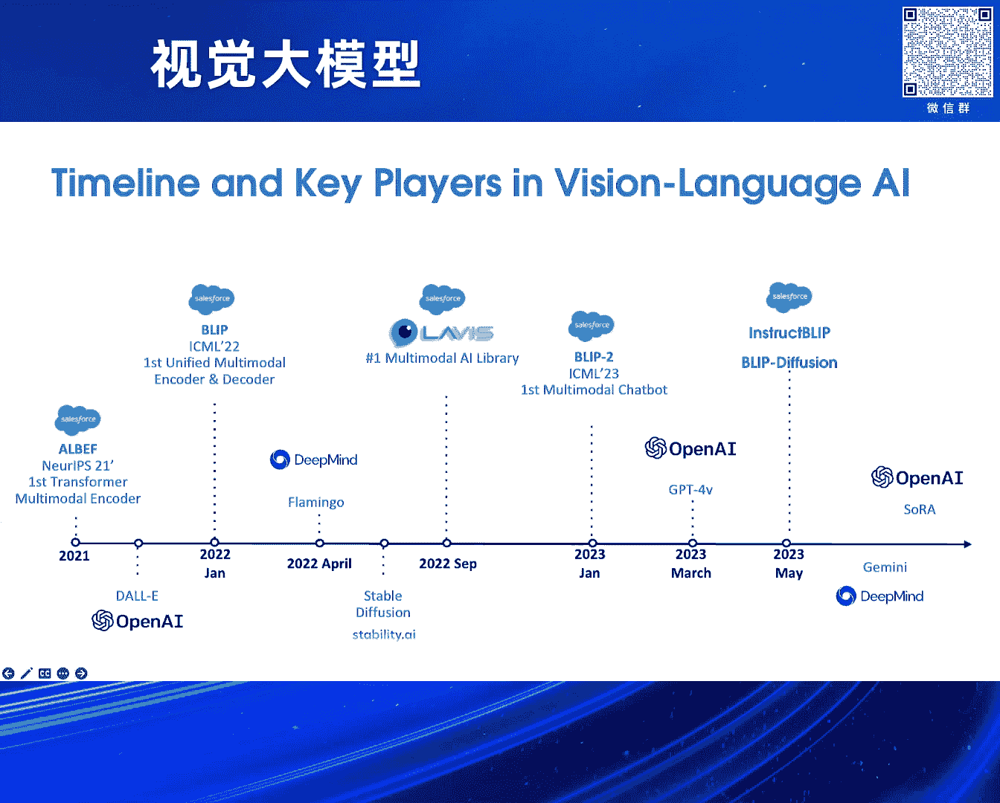

那我们先看一下呃，抱歉，我这个可能大部分是用英文的，我我我会用中文来讲呃，我们先看一下我们所谓这个大的，多模态的foundation model啊，它有一些什么挑战呢。

呃那首先我们要做这种PRETRAINING的foundation model，的目的就是说我们希望这样的视觉语言的模型，它可以用非常低成本，甚至zero shot的办法。

去泛化到一些其他的下游任务上面啊，那我这里主要列了三个挑战，第一个挑战就是这个语言和视觉的对齐，因为说这两个模态是完全不同的，两种信息的信号，所以我们怎么把他们呃，这两种不一样的数据对齐。

在一个模型里面是非常有挑战性的，第二个挑战是从数据层面来讲呃，我们经常会有这种呃很大量的有噪声的呃，是图片和呃语言的数据，那怎么从这种数据里去有效的学习，是第二个挑战，第三个是从计算资源来讲啊。

这种scale up的PRETRAINING是非常耗费计算资源的，那我们也有一些方案去解决这个问题呃。

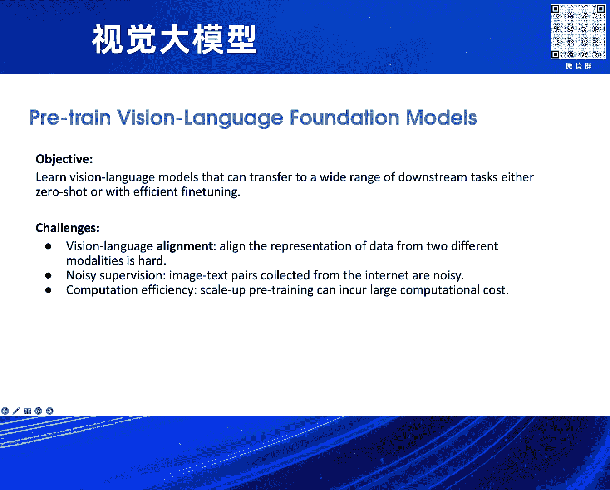

先介绍一下背景呃，最开始的这个vision transformer，也就是VIT的出现呃，相当于把呃transformer这个architecture，领入到视觉领域呃。

然后他通过scaling now实现了很好的效果啊，它的基本的框架就是我们把一个图片，分成这一个一个patch。

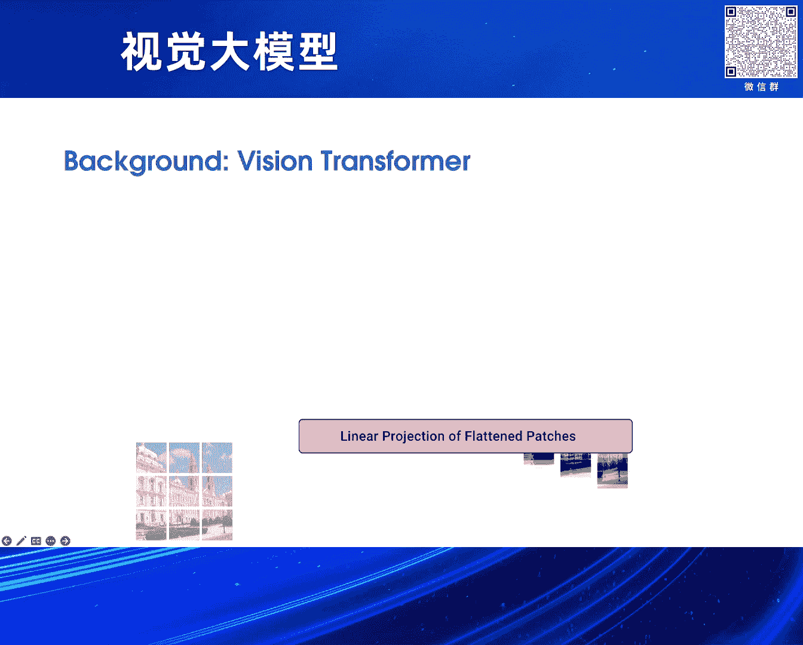

然后呃通用transformer去处理它呃，然后之后open i又做出了这个clip，这个工作相当于是一个呃，一直到现在还非常被广泛使用的，一个transformer的啊。

vision encoder的框架，他的做法就是用一个叫contrast si learning，这样一个loss呃，它会有这种pair的图片和文本的数据，然后他通过让相似的呃。

图片和文本之间有更大的这种相似度，来预训练它的这个模型。

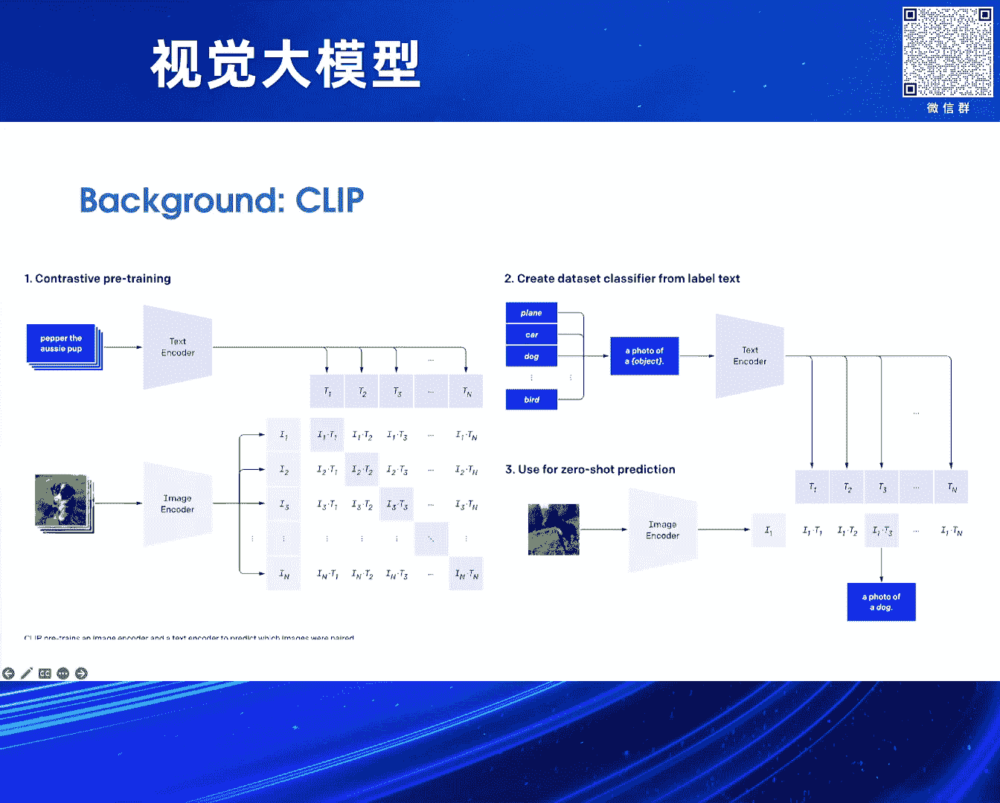

呃然后这里我们提出了这个align before fuse呃，也叫ABETH呃，这样一个工作呃，他是第一个能够把图片跟文本一起，encode在同一个空间里面的，这样一个transformer啊。

相比于clip，Clip，它是一个单独的VIT，还有一个单独的text transformer，我们是一个更融合的这样一个结构啊，那我们这里提出的一个概念。

就是我们先希望把图片和文本做一个alignment，然后我们再另外有一个encoder，去把它们做一个joint的这样一个fusion呃，我们这里提出了三个PRETRAINING的objective啊。

第一个就是跟clip相似的这样一个，contrastive learning啊，他的目的就是把单独模态的图片跟呃，文本去做一个alignment，然后呢。

接下来我们会把这个feature再过过一个额外的，我们叫multi model encoder里面啊，他会用cross attention去把图片的信息啊，把它融合到文本里面啊。

这里我们提出了额外两个loss去训练这个啊，Multi mode encoder，第一个我们叫image text matching，它是一个二分类的任务，也就是说呃。

当你给定一个图片和文本的这样一个pair之呃，的时候，他会去判断这个pair是一个呃positive，就是他俩是不是对应的还是一个negative。

然后这里我们额外有一个hard negative mining的办法，就是说我们会去选非常难的这种negative呃，就是它看起来很像，但实际上他俩并不是呃，来自同样的一个信息源呃。

然后第三个loss我们是基于这个bird呃，改成了一个多模态的这样一种maslanguage modeling，也就是说我们会掩盖掉一些词，然后让模型去基于图片和文本，共同预测这个词啊。

我们在这个论文里面呃，也理论上证明了这三个objective可以共同去呃，最大化这个文本跟图像之间的一个互信息啊，从而使得这个我们最后得到一个非常好的，多模态的融合的效果。

呃那接下来我们这个blip的工作呢，是把l BF的思路继续延伸下去啊，把这个encoder呃，把它改成了一个可以做呃，文本生成的这样一个decoder啊，所以我们这里叫一个unified的模型。

它既可以做encoding，也可以做decoding啊，然后呃我们还是用同样的三个loss啊，只不过最后一个这个mask这个掩码的呃，Language model，我们把它改成了一个outer。

aggressive的这样这样一个办法啊，这样他就从一个encoder，变成了可以去不断的生成，下一个词的这样一个decoder。

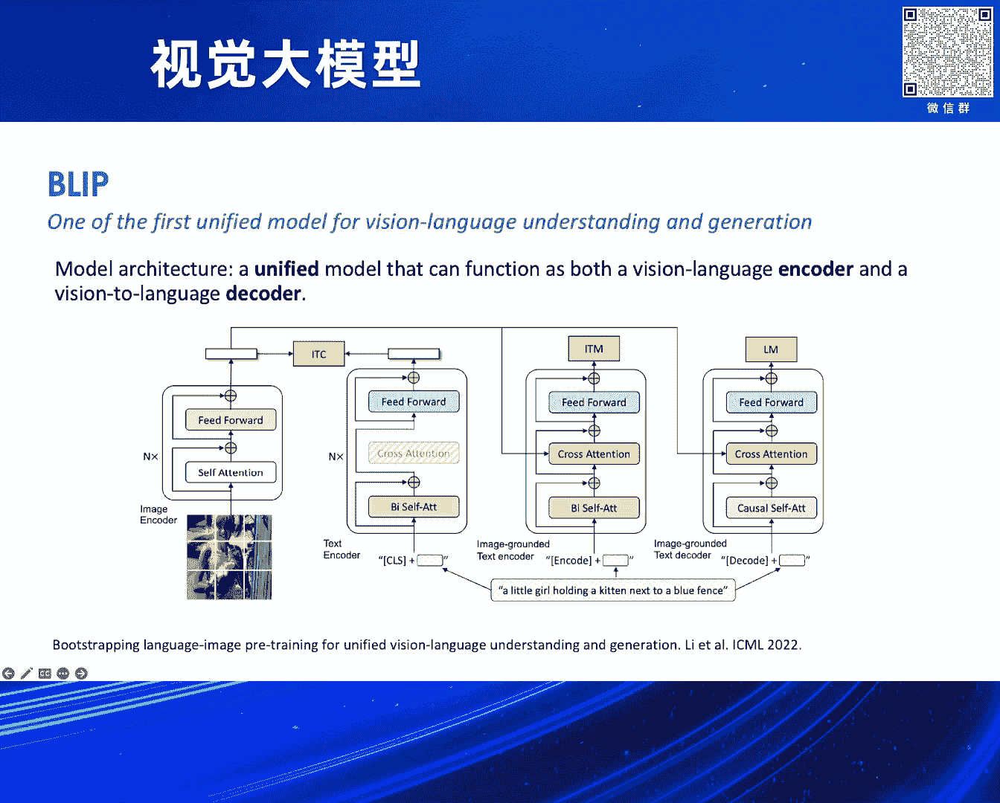

呃，然后在blip里面呢，我们还提出了这样一个对数据处理的办法啊，这个我们叫caption and filtering啊，它具体来讲就是由两个比较简单的模块组成啊，第一个就是我们会去根据图片去呃。

人工的生成很多的这样一这样一些image caption呃，然后另外呢我们还会有一个呃filter的的模型，去从呃你生成的呃caption，包括从网上原始得到的caption里面。

去筛选出来质量比较高的这些啊，然后这两个模型其实都是可以，通过我们这个blip的loss训练得到的，所以我们可以通过这样迭代的方式去，不断的迭代我们的模型和数据呃，实现一个不断的增强的效果。

呃然后我们这里还有一个比较关键的发现，就是我们当我们生成这种啊，人工的caption数据的时候啊，我们需要有一些trick去保证它的啊，多样性是足够的啊，因为就算它质量很高，但如果它多样性不够的话。

我们发现它对于这个模型的训练啊，也是起一个起不到一个很强的正面的效果的。

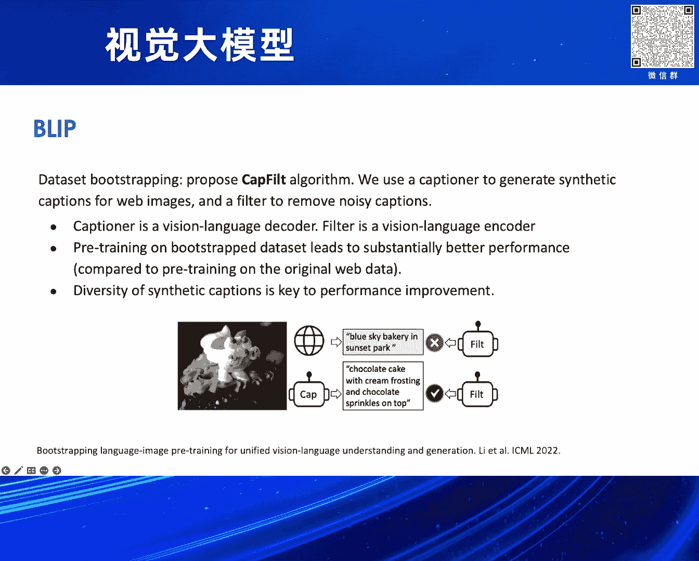

呃然后接下来呢在我们blip这个工作之后呢，呃large large model就迎来了一波比较呃，关键的发展嘛，然后这个里面呃，其中呃GP3就是最关键的一个模型嘛，它是第一个展现出来。

当你用大规模的数据去训练的时候，你的这个模型是有一定的这个，zero shot的泛化能力的，你只要用合适的这种prompting的提示词去prompt，你的模型的话啊，他就可以去解决很多。

你呃没有去fine t过的这种下游的任务。

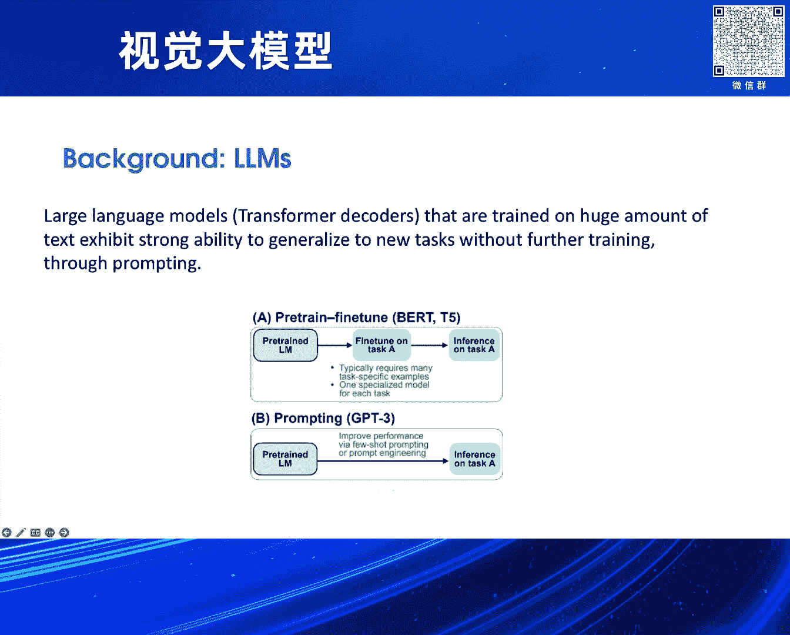

所以我们接下来的一个思路就是，我们怎么利用这种大语言模型，去增强我们多模态模型的能力，呃，然后我们第一篇工作呢，其实是用了一个比较简单的办法，我们并没有去呃训练这个大语言模型啊，我们做的是，我们想看。

能不能直接把图像的信号转化成语言的信号，然后直接让语言模型去理解，所以我们这里做一个工作叫plug and play v q a，这个字的思路，就是说我们想把一个图片转成一些caption。

然后让这些caption给到一个大圆模型，然后让他直接去做一些任务，这里我们提出一个比较关键的技术，就是呃我们会根据你用户提出的问题，去生成一些跟问题最相关的caption啊。

我们会用到我们blip模型里面，这个matching的这个模块，我们会去找到跟你这个问题最相关性最高的，一些图片的这个区域，然后去采样这些区域去生成一些caption啊，这里面能看到。

当你问题是问到一个特殊的物体的时候，我们这caption也会基于这个特殊的物体去描述，然后当我们把这样一些caption，给到一个大语言模型啊，比如说GP3。

或者我们这里用的一些t five的模型的时候，它就可以根据纯文本的信息去回答呃你的问题，所以这个算是我们首次验证了大语言模型在呃，多模态理解里面的一些呃它的这种力量。

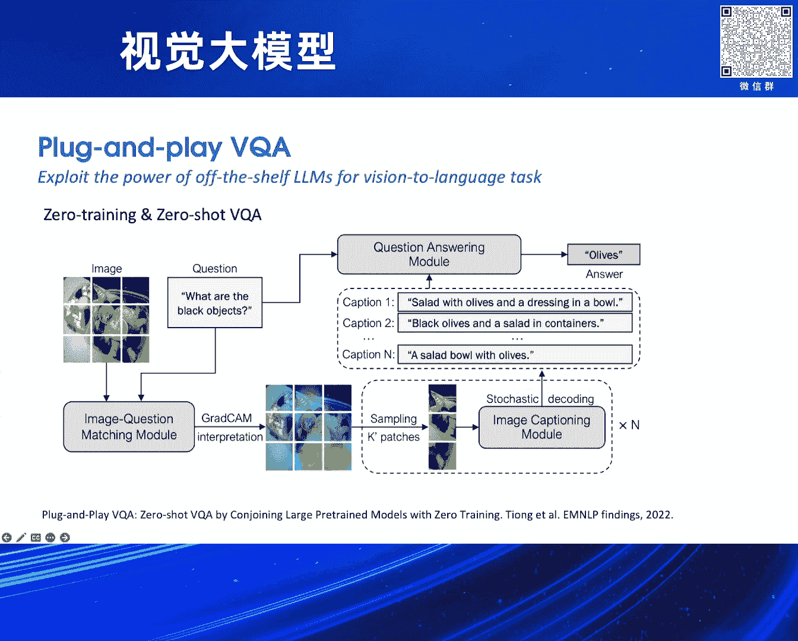

那接下来我们这个blip two的工作呢，就是我们能不能做一个end to end的模型，我们把直接把视觉的模块跟大语言模型的模块，连在一起，呃然后这里blip two解决了四点啊，关键的挑战啊。

第一个就是我们可以让任何这种呃被冻住的，就是我们不需要打开去训练这个大语言模型，但是我们可以让他去理解呃视觉信息，然后同时呢，我们还可以很高效地利用到任何已经被PRETRAIN，好的开源的这些啊。

Vision transformer，比如说clip，比如说呃智源的一些呃VIT，我们都可以利用啊，第三点呢是我们提出了一个算法，去，使得我们可以在不打开这个VIT和语言，模型的情况下呢。

使得它们之间的这个模态的这个差异，能够被弥补啊，然后通过这些呢，我们能够实现的就是一个zero shot的一个图片，到文字的这样一个生成呃，然后他也可以利用到大语言模型的能力去啊。

follow1些这种自然语言的指令呃，然后最后呢我们这个算法是非常高效的啊，我们可能只需要16张呃，A100的卡就可以呃，利用到很多这些billion scale的呃。

大质量位置model，那这个里面我们提出的一个关键的技术点，就是说呃我们有这样一个q former的模块啊，它是在一个呃vision的encoder，就是一个VIT，和在一个LM之间的这样一个模块啊。

它是参数量不大，只有不到200个million啊，但是它可以实现的就是把视觉的信息呃，很有效地转化成语言模型能够理解的信息，然后呃，并且呢能够在语言模型给定不同prom的情况下。

利用到这些视觉信息去给一些输出呃，我们这里会有两个的训练阶段啊，第一个训练阶段呢，我们只拿这个VIT和就image encoder和q former啊，一起去训练他们两个呃。

然后我们在冻住这个VIT的情况下，我们希望让q former能够提取出来，这个最和语言相关的啊，这这部分的视觉信息，这是第一个阶段，然后第二个阶段呢，我们会让这个q former跟语言模型也连接起来啊。

然后我们让这个我们去entto and train这个模型啊，但是这个过程中，我们语言模型是会不不会打开训练的呃，然后第二个阶段，我们相当于让q farmer通过很高效的办法。

就能把他第一个阶段学到的这些信息啊，让语言模型能够啊理解到。

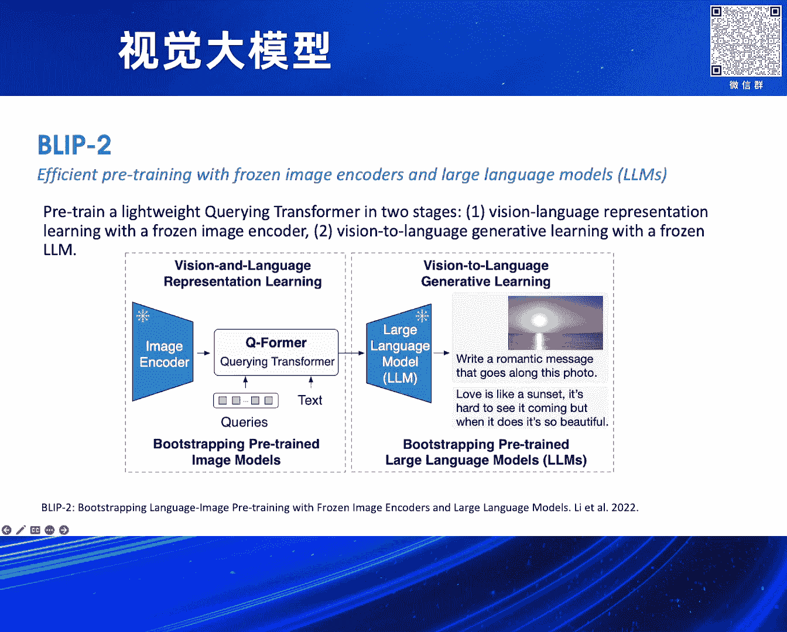

那这个我们第一阶段的训练的这个objective呢，其实是跟我们之前LBETH或者blip，是呃一脉相承的，呃，就是我们有三个这样比较有效的训练的loss啊，就是contrast you loss啊。

Matching loss，还有通过呃image去生成text，这样一个image captioning的loss呃，然后这里可能我就不会讲它特别具体的，这个框架呃。

但是我们通过一种attention mask的设计方法呢。

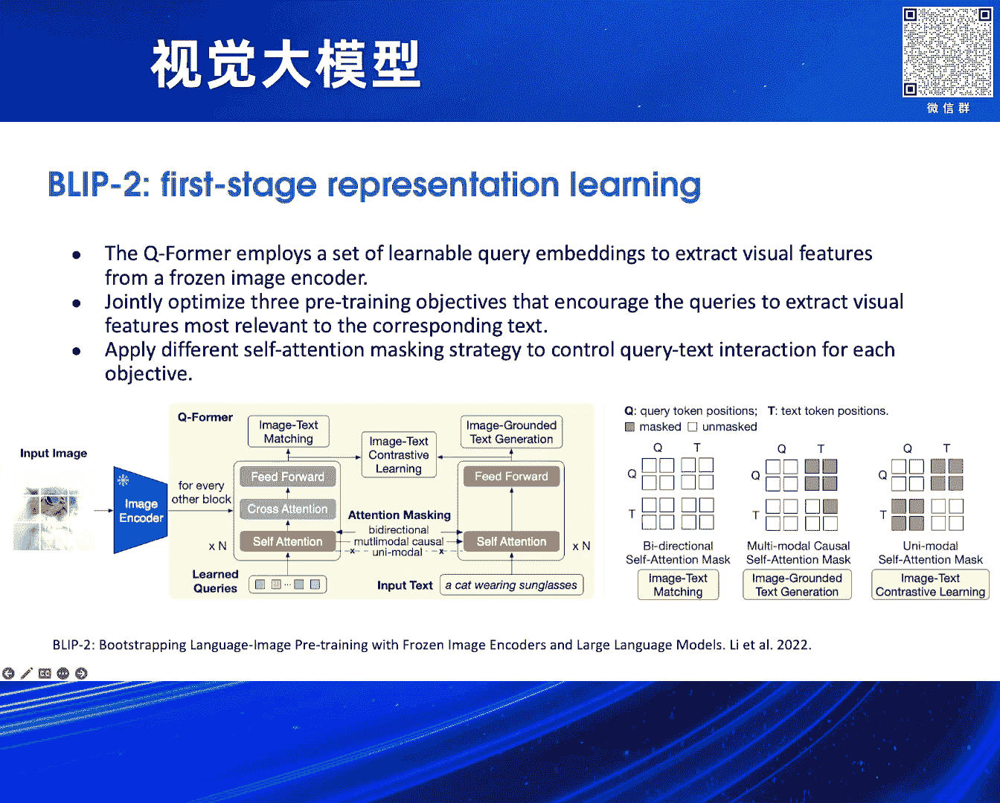

使得我们可以同时优化呃这这三种loss，然后我们也在实验中发现呢，其实每一种loss对于它q former学习这个文呃，图片信息都是比较有帮助的，呃然后经过第一阶段呢，我们实现的一个目标。

就是这个q former已经能很好的把图片的信息，转化成语言空间的这样一种表征啊，那么经过第二第一阶段的训练呢，我们在第二阶段就可以纳入任何的这种呃，大语言模型啊，比如说这个里面当时可能还没有说。

现在这些拉玛这些模型我们用了一个是呃，当时FACEBOOK的一个OPT模型，包括google的一个flt five的模型呃，他们两个一个是decoder only的。

一个是这个encoder decoder的模型呃，但是我们都可以用同样的方法去处理，就是我们会把q former呃的输出啊，它这在这个里面，比如说它是32个QY的话。

那么每一个QY都会有对应的一个一个输出啊，那你可以把这个它的输出，理解成某种视觉的token，那这个token呢和可以和语言的text token，合并在一起啊，然后直接喂给这个语言模型。

然后我们通过一个比较快速的第二阶段训练，就可以让这个Q方面，很快速的适应到不同的语言模型上面，使得它的输出能够被这个语言模型理解，然后我们这个里面training的这个loss。

就是比较简单的给一个图片，我们会生成它的这个描述。

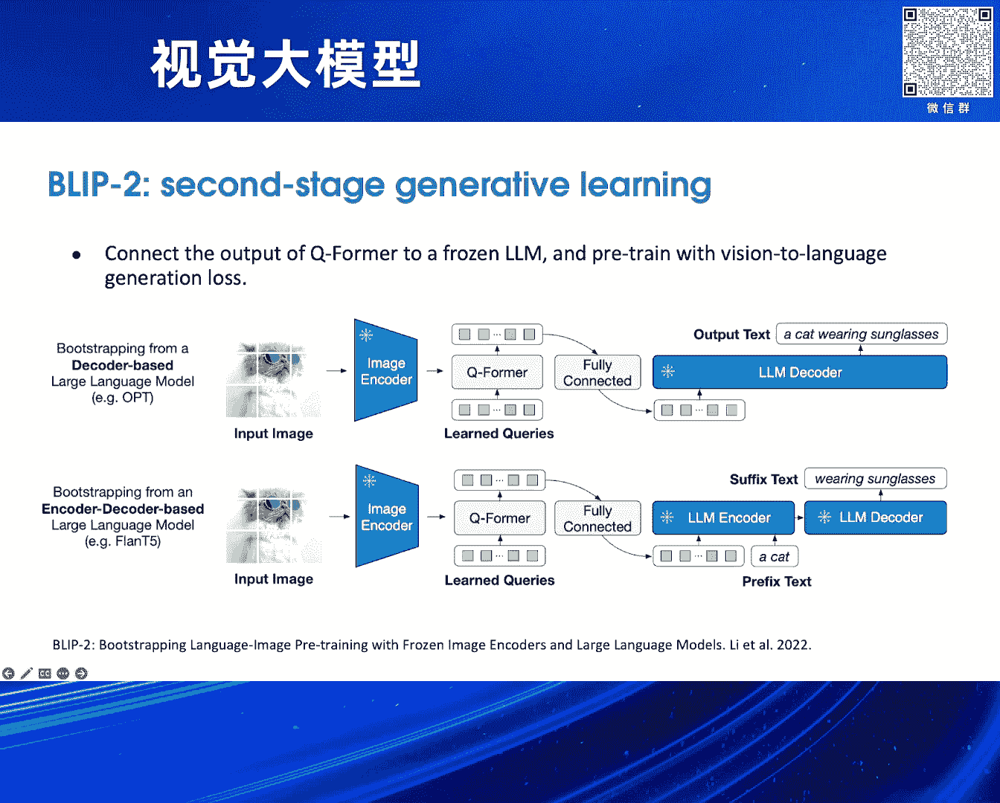

呃那呃这个就是我们当时实现的一些demo。

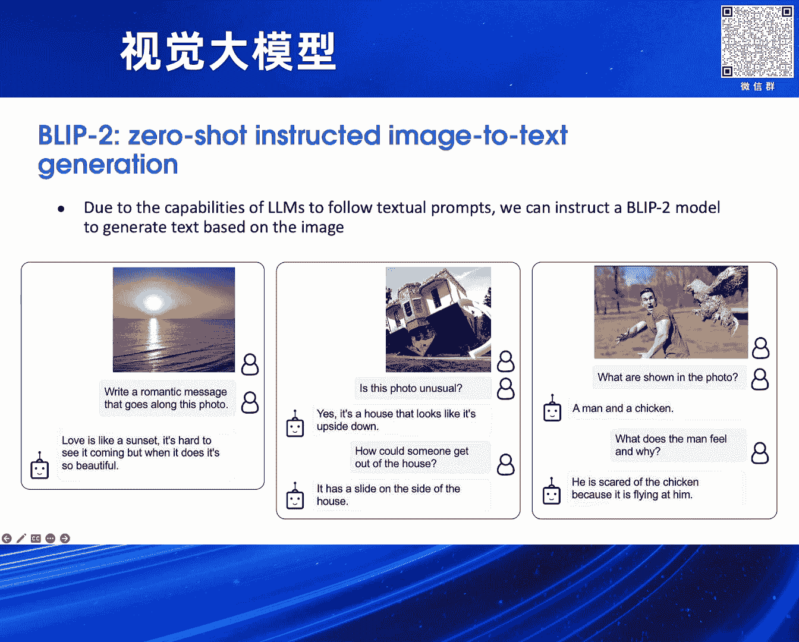

这个当然可能现在看起来啊，不是不是特别impressive，但是在当时在思维出现之前，我们是第一个能够实现这样能力的，就是给定一个图片，我们在呃不同的prompt下面。

能够啊follow这个指令去输出一些问题，包括我们也可以做这种多轮的呃，针对图片的这种问答，呃然后这个是我们当时科技界其他模型，包括可能比较出名的，就是DeepMind的这个flamingo呃。

它同样也是一个这种多模态的大模型啊，的一些比较嗯，你可以看到非常明显的一个比较，就是我们所需要的训练的参数量是非常少的，只有100多个million呃，但是我们能够很有效的利用到，这个总模型的参数量啊。

虽然我们不需要训练它啊，但是我们通过这种呃我们比较高效的办法，能够实现在相对少的计算资源的情况下呃，在这种不同的downstream的呃，benchmark的性能上面都会超过flamingo。

包括一些当时其他的一些模型呃，然后blip two呢也嗯我们发也也是开源出去了，然后有呃一些其他工作也呃，也在follow我们这个去进去进做进一步的提升。

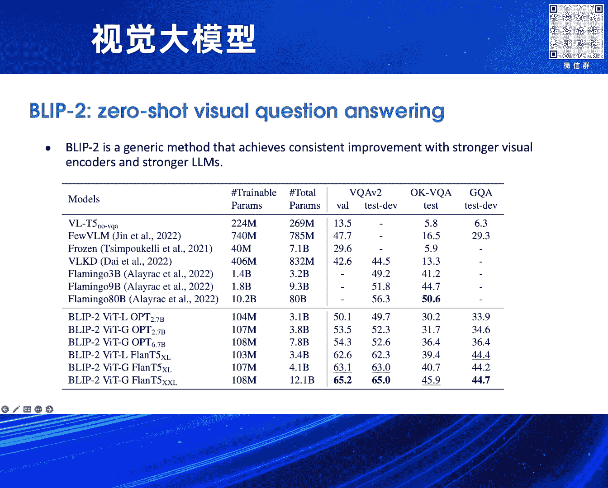

呃那接下来呢在语言模型这个空间里面，又发生了一件事情，就是这个instruction tuning，可能现在大家会叫他SFT或者post training呃，他这个最开始被提出的概念就是。

当我们有一个预训练好的语言模型的时候，呃，我们可以通过提示词的办法，但是我们也可以通过构建一些不同的，这种任务呃，然后当我们把这些任务集合在一起的时候，它就形成了这样一个呃有输入。

有输出的这样一个instruction tuning的数据呃，然后当我们用这样的数据去进一步，训练模型的时候，我们会发现它对指令遵循的能力，会得到非常大的提升啊。

这里面代表性的工作有就是instruct g p t，还有google的这个flank five啊，他们有提出一些不同的这种instruction tuning，的数数据库。

那我们多模态这边我们就有同样一个思路。

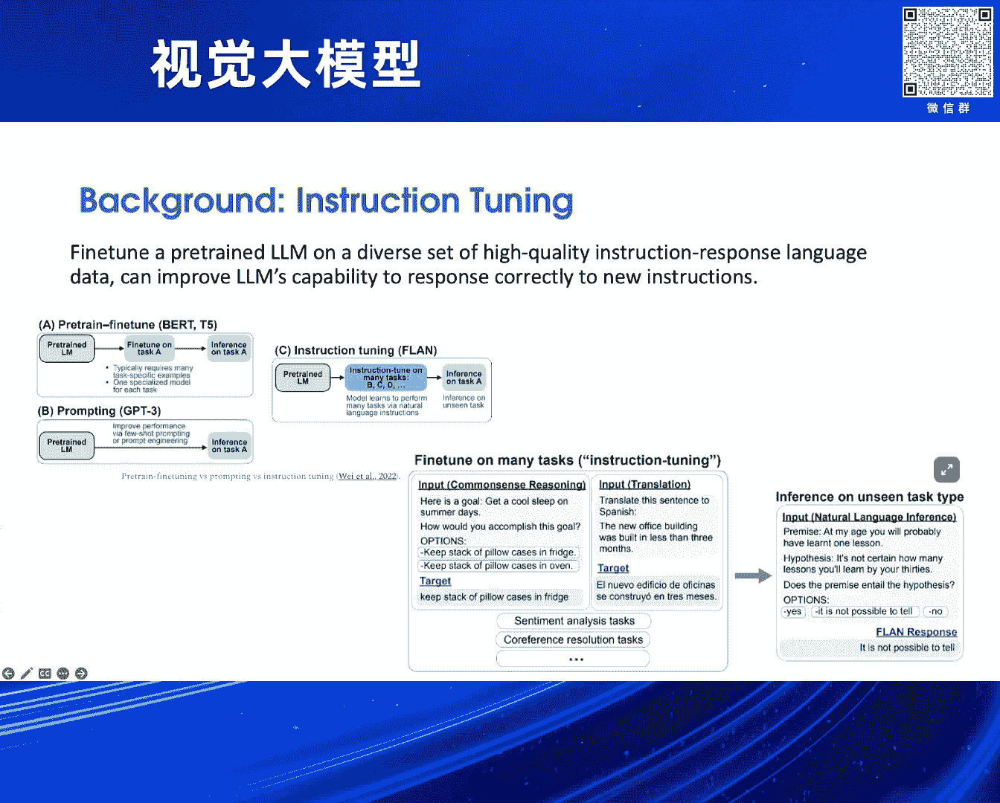

那我们能不能也用这种instruction tunning的办法，去增强我们这个blip to模型，它的呃指令遵循的能力，包括在不同场景上的泛化能力。

所以这里我们就啊做了一个这种vision language，的instruction tuning啊，具体的做法就比较简单，我们就是构建了这样一些图片，问题和答案的数据啊。

我们构建的办法就是从开源的数据里面去整理，去收集去筛选啊。

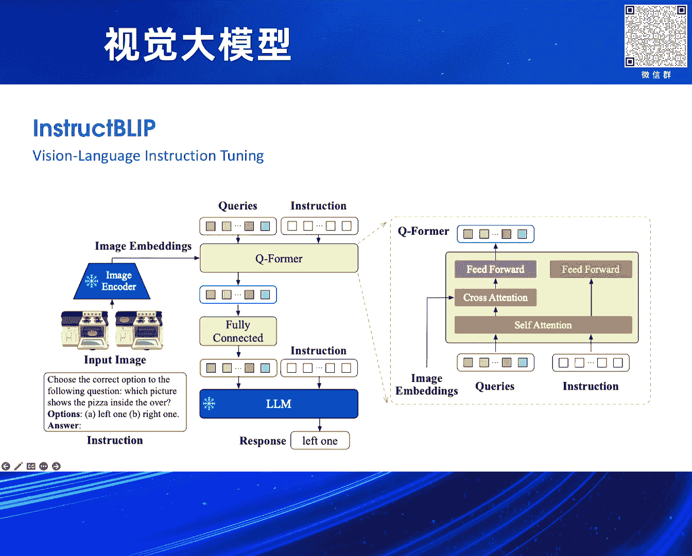

形成了这样最终一个数据库呃，这个是我们当时呃构构建的一个数数据的办法，然后我们用这样的数据去继续指令微调，我们的模型的话，我们会发现，确实它在很多任务上面都会得到一个，性能的提升啊。

这个里面我们可以在同等呃语言模型的情况下，跟blip two包，包括跟flamingo做一个对比啊，这个当时V呃已经出了这个拉玛一代，然后基于拉玛一代有一个VIKA的模型，所以我们也把这个VIKA呃。

作为decoder语言模型的代表加入了进来，我们能看到在不同的这种呃，zero shot的这种呃泛化场景上，我们的这个instruct BP，是会取得进一步的一个提升的。

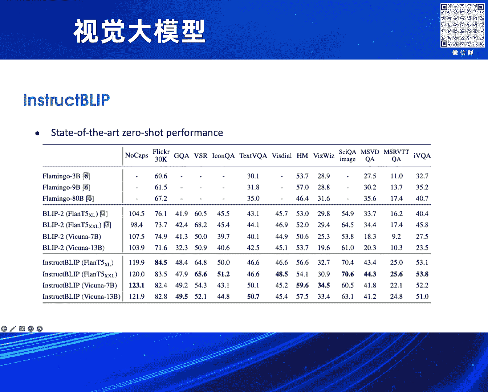

呃，然后包括呢，我们这个模型不光是可以做这种zero shot的生成，我们也可以在一些呃比较小的下游任务上面。

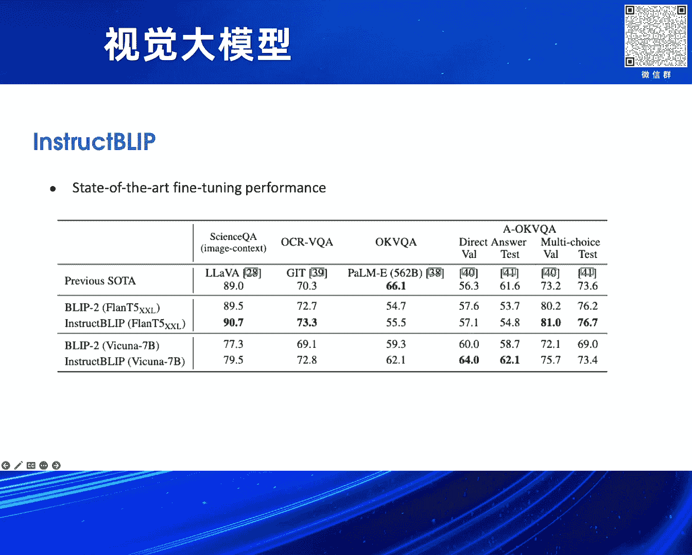

通过比较快速的微调取得一个搜它的效果，然后这个里面是当时我们做了一个可能，instruct clip和其他的这些包括GPT4呃，和一些其他开源模型的一些效果的对比，呃，我们在一些呃这种呃例子上面。

是能够达到接近于GB4V的一个一个效果，好那接下来我可能会再讲一下，我们在从呃语言到视觉生成的这样一些工作啊。

那这里呃稍微提一下这个背景，就是diffusion model的出现啊，就是极极大地增强了这种这个领域，研究的一个一个热度和模型的能力，这个diffusion model。

他做的事情其实就是一个去噪音的事情啊，他会学到一个呃，从噪声到一个图片的这样一个过程呃。

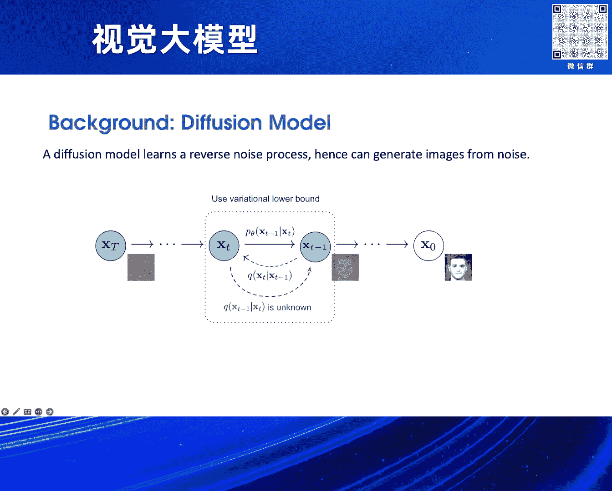

然后最开始引领这个领域的一个论文，就是这个latent diffusion model啊，它是通过把图片转成到呃这种影视的空间，然后在影视的空间去做diffusion啊，这样能极大的提升这个图片呃。

diffusion这个过程的一个效率和最终的结果。

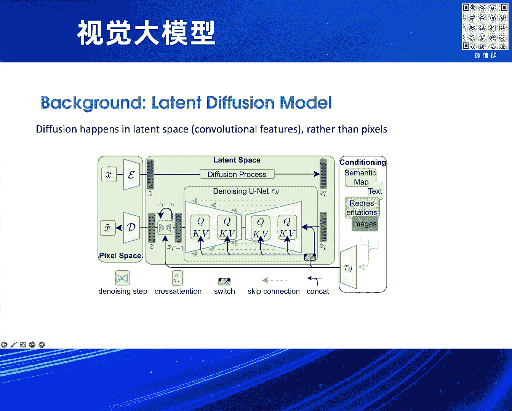

然后基于此呢就出现了separty fusion这个工作啊，这个开源的模型它通过大量的数据，把latent diffusion model啊，scale up起来，取得了非常好的效果啊。

那在这个里面我们发现siberty fusion有一个弱点，就是说它只能通过文本的提示词去生成图片呃，但是我们想能不能有办法，让多模态的提示提示啊，比如说我们用文本和图片一起去控制。

我们要生成的这个图片啊，所以我们这里blip diffusion这篇工作呢，就是想把这个图片，图像的控制信号引入到生成里面啊，然后可以去控制这个生成图片的主体，长成什么样子呃，那这个里面我们采用了一个。

也是一个两个阶段的训练方法啊，第一个阶段呢我们沿用了blip two啊，我们希望学到一个这种multi model的encoder，它能够把图片跟文本做一个共同的表征，表征到同样一个空间里面。

所以我们沿用了BELIETO里面，我们学到的这个q former啊，它既可以输入文本，也可以输入图片，然后可以得到一个这种多模态的表征，然后第二个阶段呢，我们就会把这个多模态的表征给到一个啊。

diffusion的模型里面啊，然后把它跟呃本身的这个文本的prompt，结合在一起，呃，然后我们的训练办法呢，就是说我们会把一张图啊，它原本的图，比如说是长长成右边那个火车的样子。

我们会把里面的主体把它拿出来，然后替换掉另外一个背景，那这样的话我们学到的一个就是这个啊，Defusion model，会根据你啊输入图像的主体，去生成一张新的图像，然后我们发现通过这种训练方式呢。

它能够学会很好的这种泛化性啊，有很大的原因呢，也是因为我们在第一阶段有一个非常好的，这种泛化性很强的这种多模态的encoder，去表征这个图片和文本共同的这样一个空间。

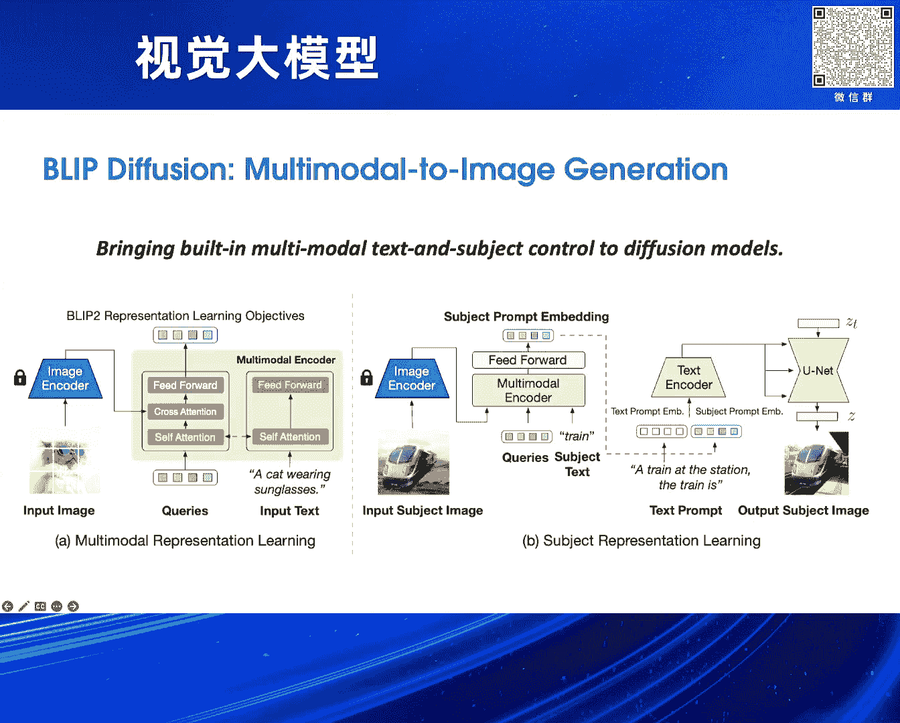

那这里我们有一些功能呃，可以被我们的模模型给开发出来，那第一个就是一个呃，zero shot的一个一个个个性化的生成啊，比如说我们给一张这个猫的图啊，我们就可以给不同的文本的提示词啊。

它就可以通过这张图去生成，这个猫在不同情况下的一些其他的呃一些图片，这个完全是没有经过训练的，全都是zero shot的一个效果啊，然后包括车或者玩具也都可以，那我们还可以把它跟一些其他的技术。

比如说control net结合在一起啊，这里我们输入的图，比如说是这个茶壶，我们额外有一个control net的这个输入，是这个沙发，那这个沙发我们提取出来它的这个深度图。

我们可以去控制这个输输出的一个深度呃，和这个结构，但是整个的这个输出的这种呃，style是通过我们这个茶壶来控制的，呃包括我们这个输入也可以，那这个control net输入不不不局限于深度。

我们可以用不同的，比如说边，或者是一些其他办法去控制这个呃，输出的结构啊，但是整个它输出的这个风格和这个主体，是可以通过我们的呃，是另外一张图片去实现控制的，嗯然后这个里面呃可能有一些其他的例子。

就是说做style呃，这种风格迁移啊，我们左边比如说有不同的这种结构化的控制，我们上面有不同的这种风格的控制，我们其实可以把它用各种方式去组合在一起，呃然后我们还可以跟另外一个技术叫做pigs。

to pigs去结合起来，去做一些这种呃，通过主体去控制的一种编辑功能啊，比如说我们现在有两张图，一张是这个左下角的这个机器狗的图，然后我还有一张我是我自己的狗的图，我想把我自己的狗换到这个机器狗上面。

我们就可以用我们的技术去，实现这样一个功能啊，同时右边比如说我们可以把这个蛋糕啊，换换到这个呃汉堡这个上面，就是通过这种办法，我们可以实现一种可控的去编辑图像的功能，呃然后最后呢。

我们还可以实现一些主体之间的这种，interpolation啊，就是呃一些融合啊，这里我们比如说我们有四个不一样的小动物啊，我们通过一个线性差值的办法就可以啊，取得它们之间任意两种动物的融合啊。

这个也可以把这个动物换成人的话，我们也可以实现人脸的这种这种融合功能，好那这个就是今天我要讲的全部内容了。

谢谢大家，好的谢谢君兰，那呃我们有足够的时间呃，也不是足够多，大概能两个问题吧，有没有问那个，呃就后后面讲那个那个技术哈，它还和我们那个CVTFO里面那个control net。

它又有什么原因上的不同呢，嗯对非常好的问题啊，呃control net它控制的，你可以看到它是结构化的一控一种控制，比如说用深度图或者用边去控制，我们这个控制是更偏这种风格或者主体，就是你一个图像。

你要生成的东西是什么的这样一个控制，这种控制是可以跟control net进行一个互补的，呃你可以想象，比如说我用CTRLNE去控制它，没法特别精细的把我这个颜色，包括我的这个纹理控制出来。

而用我们这个办法，是不是可以实现这样的功能的呃，也就说是以前我们用那个control t，要做组合才能实现的功能，你可能这样，你一个技术就可以实现，是这样嗯，对是这样的。

就是我们可以通过一个技术是呃覆盖control net，但同时呢control net有一些一些它实现不了的，也可以通过我们这个去实现嗯，挺好的啊，谢谢好，我们再一个问题，后面那个小伙子吧对呃。

我想向您请教一下，就是这个框架下的图像的理解与生成的统一，有没有未来的可能性，呃，谢谢对呃，我觉得这个是一个现在非常热门的一个话题，就是我们能不能做出一个统一的这种，多模态模型，既能做生成，也能做理解。

呃，其实有一些工作也基于我们这个blip里面，这个q former去做过一些类似的探索啊，我觉得这个里面可能比较关键的一个点，就是我们怎么把图片的信息呃，用一种离散化的方方法token ize出来呃。

然后我们这样我们的模型就可以继续理解它，也能够生成呃，我觉得这个还需要很多探索吧，因为现有的一些工作可能表明呃，理解和生成是一个会有一些互斥的一些任务呃，在某种程度上面。

所以它可能需要更多的资源和数据啊，去做样的，去做这样的一些探索啊，对呃我其实我这边还有一个问题啊，就是呃其实我一直呃q formal的话，我一直觉得就是说是就是意思，就是说这个图像的话。

去提取出它的那个token的话，到那个language model里面再插进去的话，其实是应该给跟那个prompt是相关的，恰好你的instruct，instruction那个那个q former的话。

就相当于说大概是做这件事情，就这块你有没有一个visualization，会不会就是说对于同一张图片不同的问题，它回溯到原始图片的那个位置的话，是不是有一些就是自适应的一个过程，是的是的。

其实我们instruct clip里面，就是提取这个图像特征时候，是会把instruction加进去，然后这个是首先是为提升性能的，然后我们有试过做一些这种attention的呃。

Visualization，我们发现在某些场景下确实能看到不同的问题，它会对应激活图片里面不同的区域的，但是因为本身VIT的这个attention map比较复杂，所以不是所有情况下。

我们都能找到这样一个一个一个pattern出来，KK然后再一个问题，诶那个呃这位这位先生第一排的对对诶，话筒我想问我想问一下，就是说这个你你这个one shot。

就是直接就把图像按照patch变成token了是吗，嗯对是的，这个昨天我听那个就是sorry那个组织者，他就是讲到了一个，就是说呃这个token的这个作用和怎么生成token。

他用了一个很关键的一个词叫做压缩，那么我觉得呢呃当时就是借助于语言大模型，直接把图像变成256个词，或者又又又有小块，然后就按照语言来做呢，是一个只是检测的的能力，但是对于图像压缩这个方面呢。

并没有任何这个的贡献，所以我想我问想问句话，你为什么走回，就是说骚扰出来以后，为什么往回走这么一步，我觉得这个是特别有深度的一个问题，我觉得这个里面的压缩，可能跟我们传统的这种图像的像素的压缩。

有一点区别，就取决于我们压缩之后，我们希望得到什么样的一种信号，呃因为我我们在这个里面，我们更多是想得到一种跟语言最相关的信号，换句话说我们的任务是给定一些问题，用语言表述的一些问题。

我们能不能通过图像去回答这个问题，所以这里我们最在乎的我们要压缩出来的信号，就是图像里面比较抽象的这些这些概念，这些物体这这些东西的信号呃，然后SORA呢从另外一个程度上讲，他需要这些。

但是他可能额外还需要一些比较呃，low level的这样一些信号，比如说这个东西的一些非常具体的呃，纹理呀之类的，呃我觉得从这这个这种程度是不一样的，压缩可能跟本身图像这种像素的压缩，也是会有区别。

对不起啊，可能是我刚才呃呃没有讲清楚，我想说这个呢我就拿中国中文的汉字，我可以说呢语言大模型适合西文，就是26个字母，然后呃十个字符对不对，然后你就可以去去去提任何这个语言，就是像英文什么的。

但是中文是象形文字，中文的字呢就是一个图像，他这个图像呢它抽出来一个呢，然后中文是以这个整个这个图像来组词组文的，是不是，那么我个人认为呢，就是我们现在搞这个视觉模型呢，应该针对图像本身。

那么他现在sorry做那个路子呢，就是把它看成一个现代象形文字，这个我不知道，就是说因为前几年北大搞了一个叫CDVA，现在已经被呃国际上作为标准的，叫VCM就是一个新的。

就是说过去的文字用20×20的像素，黑白两个颜色就可以表示了，这信息量也很大，但只有6000多个汉字，但是可有各种不同的体，你可以草书，你可以这个这个行书，你也可以印刷体，各个不不一样的。

但它都能识别出来，图像将来就是下一代的象形文字，所以说他现在把它变成一个symbol呢，就是为了把图像，根据图像变成新一代的机器视觉的文字，所以我感觉就是说呢用patch这套方法呢。

实际上只是利用了语言，就是这个时序的模型，但是它没有真正考虑到图像本身的特征，好吧嗯谢谢谢你的建议，我确实没有太多思考这个方向，我我我会那个再想一想好啊，我你再回答一个问题好吧。

嗯就是说其实就是说对于这个东模态的话，就是说其实我们可能期待的事情是说，图文结合的时候，一方面是对这个图像相关的任务的话，他的能力可能会提升，但另外一个维度，其实我们应该还是期望。

就是说对language mol化这块的话也是有增强的，但是现在其实大部分的这个啊vision language model的话，其实一般的情况下的话，它的那个language的部分。

如果你做翻to或者说做做一个lama上去的话，可能都会有一些这个性能的损失，你觉得就是说如何让这个vision language model的话，在这个重新确认了之后的话。

能够让language对vision啊，不sorry，vision对language的话能有帮助，这种可能性有没有嗯，我觉得这个是特别值得研研究的一个问题，呃。

然后我觉得这个也是现在很多组在比较active，去去做的一个事情，而这里可能有几个点，就是我觉得最关键的还是数据的问题，就是我们这种多模态的数据呃，它到底有多少有效的信息，是能够提升模型的智能的呃。

我觉得这个目前来讲，大部分的这种网上的这种图片和文字，是不太能够做到这一点，所以我们能不能找到去更好的数据，比如说视频数据去data的问题，对对我，我我个人是是这样理解。

OK嗯因为其实人也学习也是一样嘛，其实我们language的这种提升，其实也是通过reading的形式，慢慢把这个能力逐步提升上来，对不对是吧，好的。

