# 1：问题定义与符号

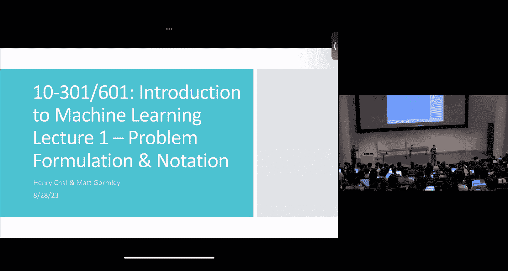


在本节课中，我们将学习如何定义机器学习问题，并介绍相关的核心概念和术语。我们将从一个简单的例子开始，逐步理解机器学习的基本框架。

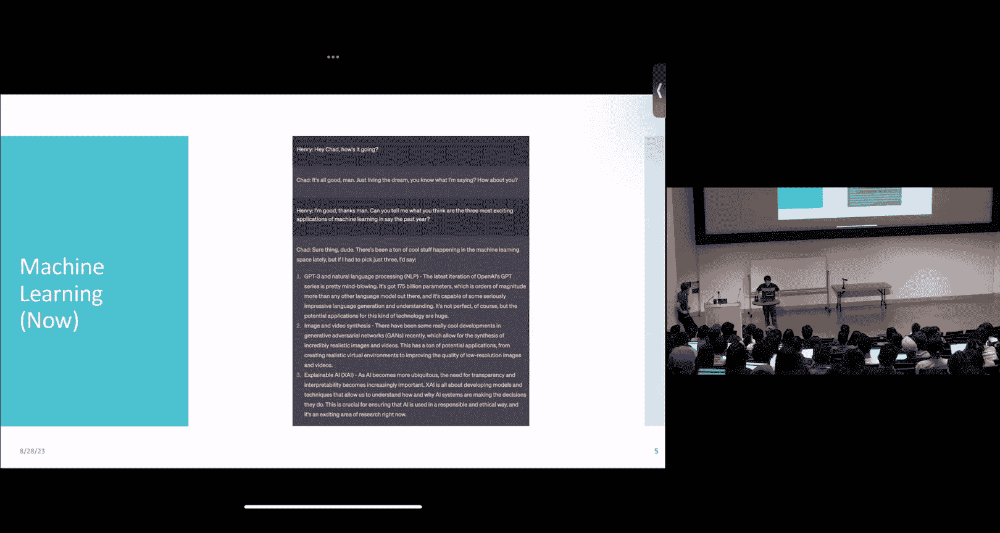

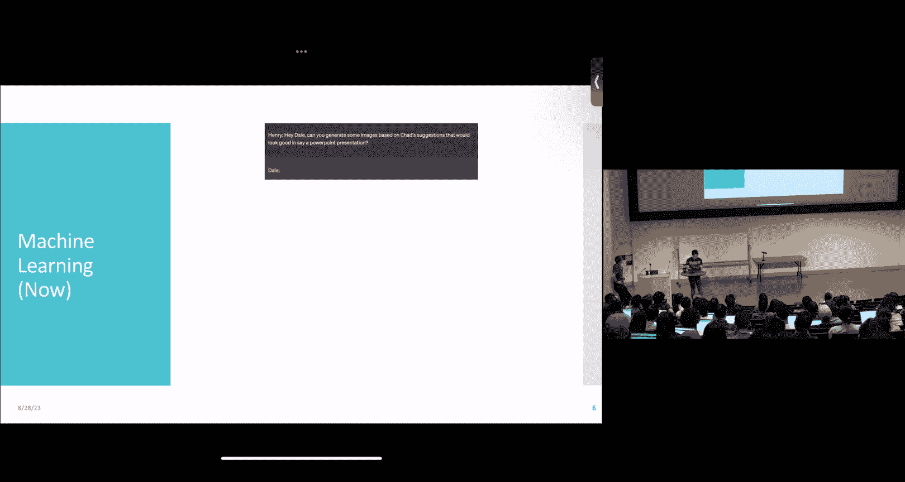


---

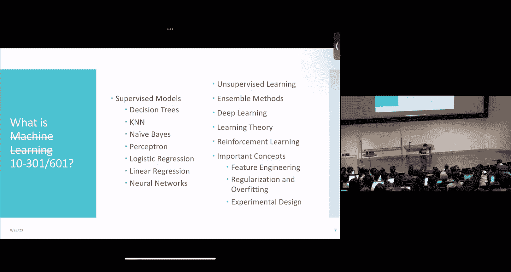


## 概述

机器学习的目标是让计算机程序通过经验（数据）来改进其在特定任务上的表现。为了清晰地定义一个问题，我们需要明确三个核心要素：**任务**、**性能度量**和**经验**。本节课将详细解释这些要素，并通过实例展示如何将它们应用于具体问题。

---

## 什么是机器学习？

根据汤姆·米切尔的定义，一个计算机程序被称为在**学习**，是指它对于某项**任务 T** 的性能**度量 P**，随着**经验 E** 的增加而提高。

*   **任务 T**： 我们希望程序完成的具体工作，例如下棋、识别语音或诊断疾病。
*   **性能度量 P**： 用于量化程序在任务 T 上表现好坏的指标，例如胜率、准确率或误差率。
*   **经验 E**： 程序在学习过程中所接触的数据或信息。

这个定义为我们提供了一个清晰的框架来思考和构建机器学习问题。

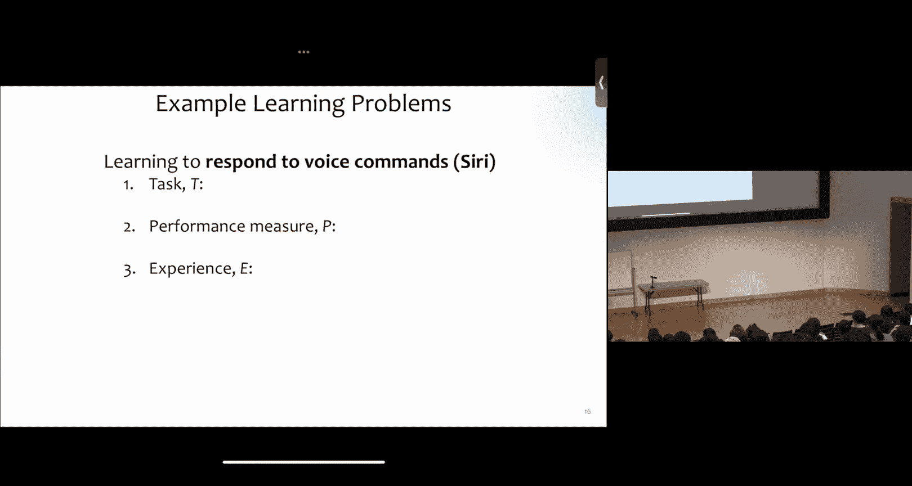

---

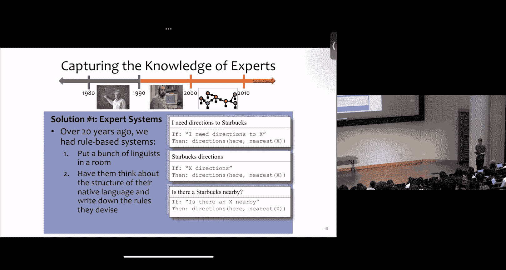

## 问题定义的多样性

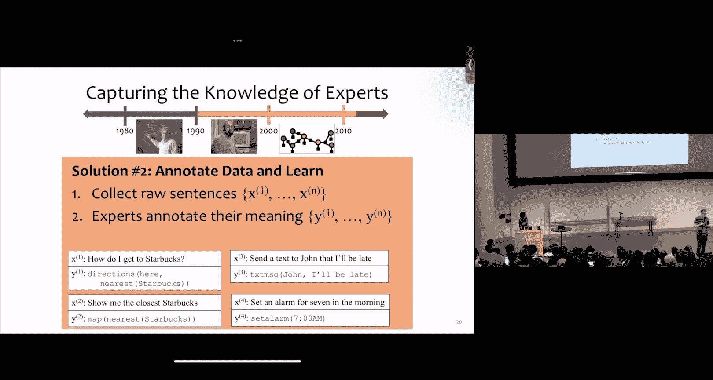

同一个任务可以通过多种不同的方式来定义，从而形成不同类型的学习问题。以银行贷款审批为例：

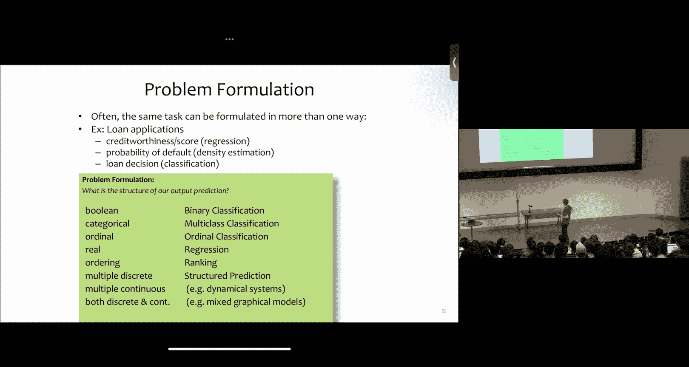

*   **回归问题**： 预测一个连续的信用评分（例如 0 到 800 分）。
*   **密度估计问题**： 预测借款人违约的概率（一个 0 到 1 之间的值）。
*   **分类问题**： 直接做出“批准”或“拒绝”贷款的二元决策。

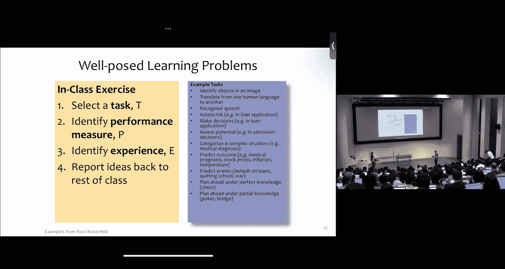

选择哪种问题定义，取决于我们最终希望模型输出什么形式的结果。

---

## 实践：定义你自己的问题

为了更好地理解如何应用这个框架，请尝试与同伴合作，为你们感兴趣的一个任务进行定义。

以下是需要完成的步骤：
1.  选择一个具体的**任务 T**。
2.  为该任务设计一个**性能度量 P**。
3.  确定可以用来学习的**经验 E**。

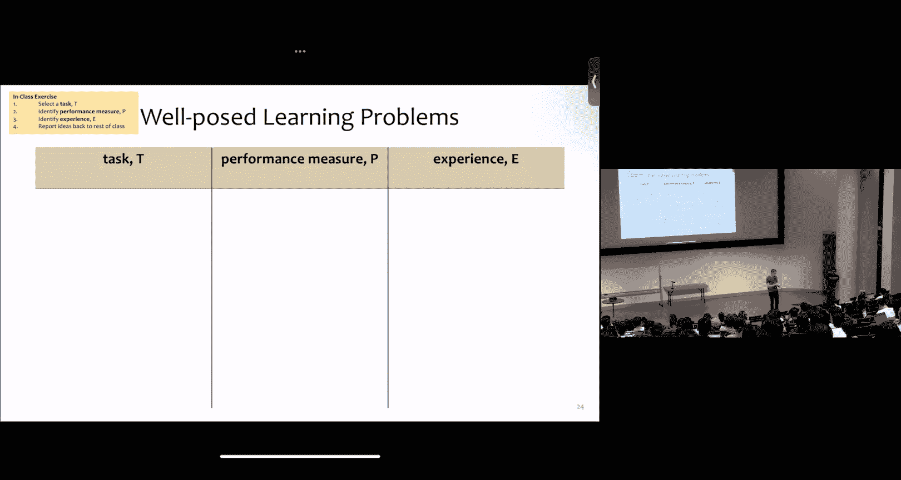

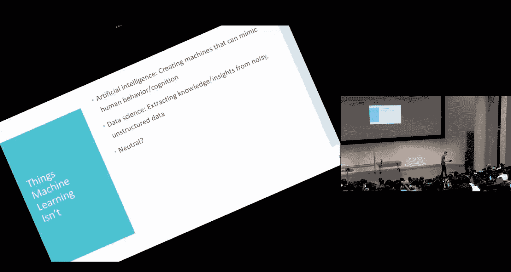

例如，任务可以是“识别一段旋律对应的歌曲”，性能度量可以是“正确歌曲在推荐列表中的平均排名”，经验可以是“包含歌曲音频片段及其名称的数据库”。

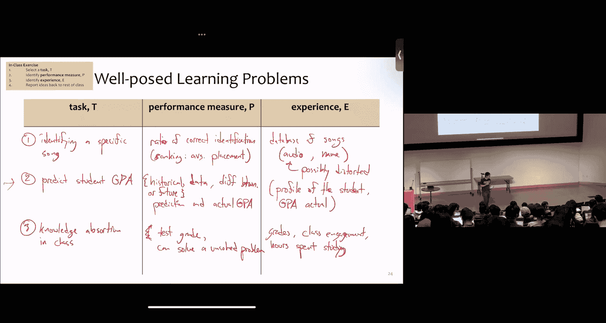

---

## 机器学习术语与第一个分类器

在开始构建模型之前，我们需要统一一些基本术语。在一个典型的数据集中：

*   **数据点**： 数据集中的一行，代表一个单独的样本或实例。
*   **特征**： 用于进行预测的输入变量（也称为属性或自变量）。在表格数据中，它们对应列（除了标签列）。
*   **标签**： 我们希望预测的输出值（也称为目标或因变量）。

考虑一个“诊断心脏病”的**监督式二元分类任务**。我们有一个包含5位病人数据的小数据集：

| 家族病史 | 血压 | 胆固醇 | 患有心脏病？（标签） |
| :--- | :--- | :--- | :--- |
| 是 | 低 | 正常 | 否 |
| 否 | 高 | 异常 | 是 |
| 否 | 正常 | 正常 | 否 |
| 是 | 高 | 异常 | 是 |
| 是 | 高 | 正常 | 是 |

*   **监督式**： 因为数据中提供了标签（“是”或“否”）。
*   **二元分类**： 因为标签只有两种可能的类别。

### 多数投票分类器

我们的第一个分类器非常简单：它总是预测数据集中出现次数最多的标签。

在这个数据集中，“是”出现了3次，“否”出现了2次。因此，多数投票分类器的规则是：
```python
预测结果 = “是”
```
这个分类器完全忽略了特征，其预测与输入无关。

### 记忆者分类器

我们的第二个分类器尝试利用特征。它的规则是：
1.  如果新病人的特征组合在训练数据中**精确出现过**，则直接输出当时对应的标签。
2.  否则，回退到多数投票（预测“是”）。

例如，一个新病人的特征是`(是， 低， 正常)`，这与第一个数据点完全匹配，因此分类器会预测“否”。

**记忆者分类器在训练数据上的错误率为0**，因为它“记住”了所有见过的例子。然而，它的核心问题在于**泛化能力**。对于任何未曾见过的特征组合，它都无法做出有根据的预测，只能盲目猜测最常见的标签。机器学习的核心目标，正是要构建能够从训练数据中学习一般性规律，从而对**新数据**做出准确预测的模型。

---

## 重要考量：数据与偏见

在定义问题和收集经验（数据）时，我们必须保持警惕。机器学习领域有一句名言：“垃圾进，垃圾出”。如果训练数据反映了现实世界中存在的偏见（例如历史录取数据中的性别或种族偏见），那么学习到的模型也很可能延续甚至放大这些偏见。在构建任何机器学习系统时，考虑其公平性和潜在的社会影响至关重要。

---

## 总结

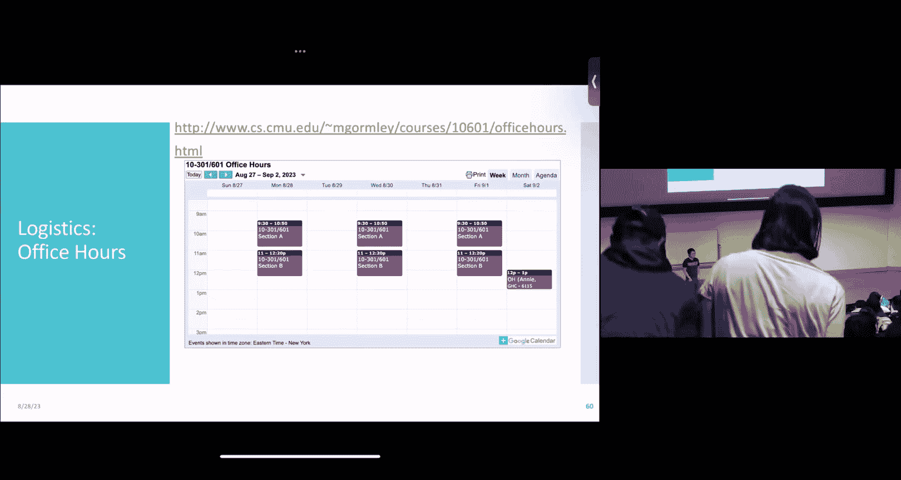

本节课我们一起学习了机器学习问题的基本定义框架，包括任务、性能度量和经验三个核心要素。我们探讨了问题定义的多样性，并介绍了监督学习、分类等基本术语。通过构建“多数投票”和“记忆者”两个简单的分类器，我们理解了利用特征进行预测的重要性，以及模型**泛化能力**的关键意义。最后，我们指出了在数据收集和问题定义阶段考虑公平性与偏见的重要性。在接下来的课程中，我们将开始构建真正能够从数据中学习并做出智能预测的模型。