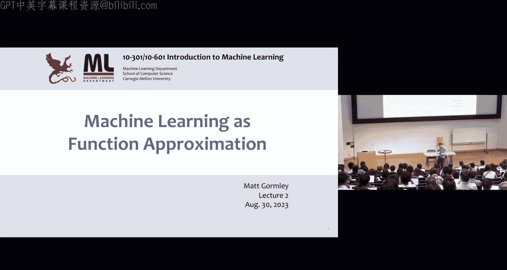
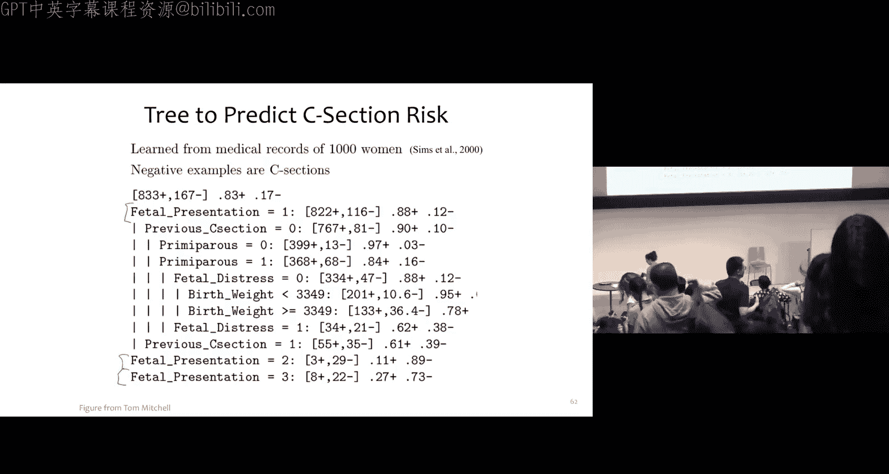

# 2：作为函数逼近的机器学习 🧠



在本节课中，我们将学习如何将机器学习问题形式化为函数逼近问题。我们将通过具体的例子，理解监督学习的基本框架、核心概念以及如何评估学习到的模型。


---

## 概述 📋

机器学习可以被视为一个函数逼近问题。我们有一个未知的目标函数，我们无法直接访问它，但我们可以通过一些数据点（输入-输出对）来了解它。我们的目标是利用这些数据，学习一个假设函数，使其能够很好地逼近这个未知的目标函数。

上一节我们介绍了机器学习的基本概念，本节中我们将深入探讨如何形式化地定义这个问题。

---

## 问题形式化 🧮

为了形式化机器学习问题，我们需要定义几个核心概念。

### 输入与输出空间

*   **输入空间 (𝒳)**：所有可能输入（特征向量）的集合。
*   **输出空间 (𝒴)**：所有可能输出（标签）的集合。

### 目标函数与假设

*   **目标函数 (c\*)**：我们想要逼近的未知函数。它将输入映射到输出：`c*: 𝒳 → 𝒴`。
*   **假设 (h)**：我们的学习算法从候选假设集合 **ℋ** 中选择出来的一个函数，用于近似目标函数 `c*`。它同样将输入映射到输出：`h: 𝒳 → 𝒴`。

### 数据与学习过程

*   **训练数据 (D_train)**：学习者可以访问的数据，由 N 个输入-输出对组成：`D_train = {(x¹, y¹), (x², y²), ..., (xᴺ, yᴺ)}`。其中，对于每个 i，都有 `yⁱ = c*(xⁱ)`。
*   **学习过程**：学习者利用训练数据 D_train，从假设集合 ℋ 中选择一个假设 h，使其能“最好地”逼近目标函数 c*。

---

## 示例：医疗诊断 🩺

让我们通过一个医疗诊断的例子来具体化上述概念。医生需要根据病人的症状（特征）判断其是否对猫过敏（标签）。

*   **𝒳**：所有可能的病人特征组合（例如：是否打喷嚏、是否发痒、是否红眼、是否养猫）。
*   **𝒴**：诊断结果，例如 {过敏(+), 不过敏(-)}。
*   **c***：医生的大脑，即根据病人特征做出真实诊断的未知过程。
*   **D_train**：历史上就诊病人的病历记录（特征和对应的诊断）。
*   **ℋ**：所有可能的决策树（我们将在下一讲学习）。
*   **h**：学习算法根据病历数据训练出的一个具体诊断规则（例如：如果打喷嚏，则预测过敏；否则预测不过敏）。

---

## 模型评估：损失函数与误差 📉

我们如何判断学习到的假设 h 是否“好”呢？这需要通过评估来实现。

### 损失函数

损失函数 `L(y, ŷ)` 用于衡量预测值 `ŷ`（即 `h(x)`）与真实值 `y`（即 `c*(x)`）之间的差异或“糟糕程度”。它输出一个实数值，值越大表示预测越差。

以下是几种常见的损失函数：

*   **平方损失 (用于回归)**：`L(y, ŷ) = (y - ŷ)²`
    *   当预测值与真实值差距增大时，惩罚会急剧增加。
*   **绝对损失 (用于回归)**：`L(y, ŷ) = |y - ŷ|`
    *   直接衡量预测值与真实值之间的绝对距离。
*   **0-1损失 (用于分类)**：`L(y, ŷ) = 1 if y ≠ ŷ else 0`
    *   预测错误记为1，正确记为0。这引出了错误率的概念。

### 训练误差、测试误差与真实误差

我们通常在不同的数据集上计算平均损失（即误差）来评估模型。

*   **训练误差**：假设 h 在训练数据 D_train 上的平均损失。它衡量模型对已知数据的拟合程度。
*   **测试误差**：假设 h 在一个独立的、未见过的测试数据集 D_test 上的平均损失。它用于估计模型的泛化能力。
*   **真实误差**：假设 h 在所有可能数据（整个输入空间 𝒳）上的期望损失。这是我们真正关心的终极目标，但通常是未知的。

**关键点**：由于我们无法计算真实误差，我们使用测试误差作为其代理，来评估模型在未知数据上的表现。

---

## 简单学习算法示例 🤖

以下是两个基础的学习算法，帮助我们理解学习过程。

### 1. 多数投票分类器

该算法完全忽略输入特征，总是预测训练数据中出现最频繁的标签。

以下是该算法的伪代码描述：

```python
def train(D):
    # 找到数据集中最常见的标签
    v = most_common_label(D)
    return v

def h(x):
    # 对于任何输入，都返回之前找到的最常见标签
    return v

def predict(D_test):
    predictions = []
    for (x_i, y_i) in D_test:
        y_hat_i = h(x_i) # 使用学到的h进行预测
        predictions.append(y_hat_i)
    return predictions
```

### 2. 记忆器（最近邻的极端情况）

该算法记住所有训练数据。当遇到一个曾在训练集中出现过的输入时，它输出对应的标签；否则，随机猜测一个标签。

```python
def train(D):
    # 简单地存储整个训练集
    store D
    return D

def h(x):
    if there exists (x_i, y_i) in D such that x equals x_i:
        return y_i # 如果见过，返回记忆的标签
    else:
        return random_label(Y) # 如果没见过，随机猜一个
```

**记忆器的问题**：为了在测试集上实现零误差，它需要见过所有可能的输入组合。如果每个特征有2种取值，拥有100个特征时，可能输入的总数是 2¹⁰⁰，这是一个天文数字，因此记忆器无法泛化到新数据。

---

## 更好的算法：决策树桩 🌱

决策树桩是一种简单的规则学习算法，它根据**单个特征**的值来做决策，比记忆器更具泛化能力。

**算法描述**：选择一个特征 `X_d`。对于该特征值为0的所有训练样本，计算其标签的多数投票，记作 `v0`；对于该特征值为1的所有样本，计算其标签的多数投票，记作 `v1`。预测时，根据新样本的特征 `X_d` 是0还是1，分别返回 `v0` 或 `v1`。

**伪代码**：
```python
def train(D):
    choose an attribute index m # 如何选择m是下一个讲座的关键
    D0 = all examples in D where X_m == 0
    D1 = all examples in D where X_m == 1
    v0 = most_common_label(D0)
    v1 = most_common_label(D1)
    return (m, v0, v1)

def h(x):
    (m, v0, v1) = stored_model
    if x[m] == 0:
        return v0
    else:
        return v1
```

决策树桩通过考察一个特征与标签的关联来进行预测，比多数投票分类器更精细，也比记忆器更实用。然而，它仍然比较简单。在下一讲中，我们将学习**决策树**，它可以被视为多个决策树桩的层次化组合，能够学习更复杂、更像人类（甚至像幼儿）的决策规则。

---

## 总结 🎯

本节课中我们一起学习了：
1.  将机器学习形式化为**函数逼近**问题，定义了输入空间 𝒳、输出空间 𝒴、目标函数 c* 和假设 h。
2.  通过**医疗诊断**的案例具体说明了这些概念。
3.  引入了**损失函数**（如平方损失、0-1损失）来量化预测的好坏。
4.  区分了**训练误差**、**测试误差**和**真实误差**，并理解测试误差是评估模型泛化能力的关键。
5.  分析了三个基础学习算法：**多数投票分类器**、**记忆器**和**决策树桩**，理解了它们各自的优缺点以及泛化的重要性。



下一节，我们将深入探讨**决策树**，学习如何从数据中自动构建复杂的规则系统，这是迈向强大机器学习模型的重要一步。