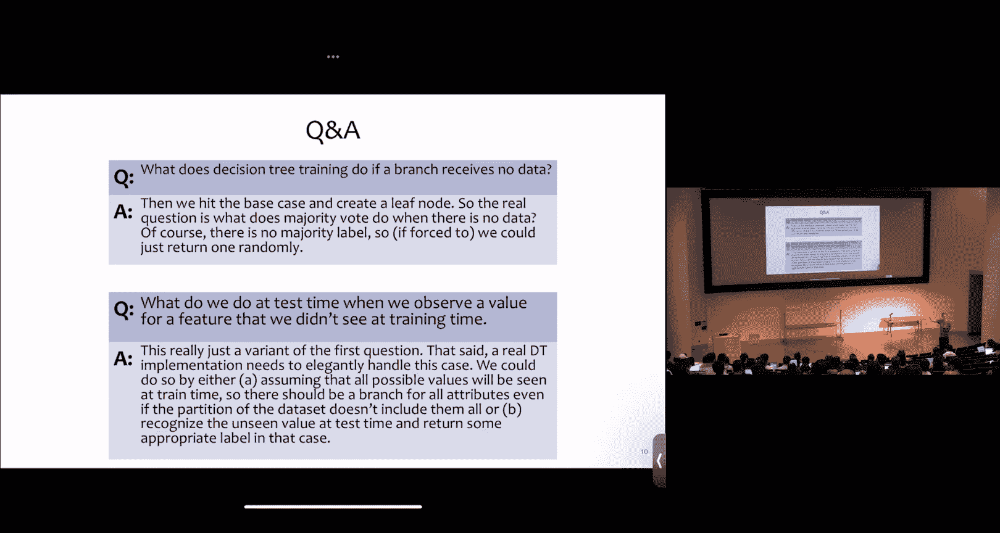
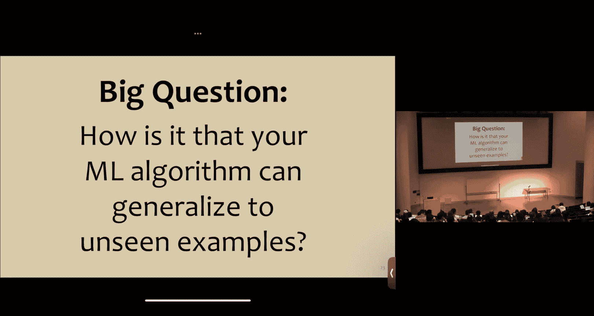
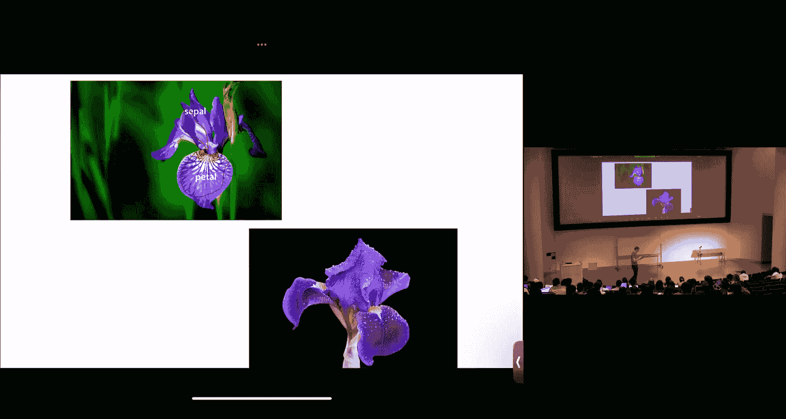
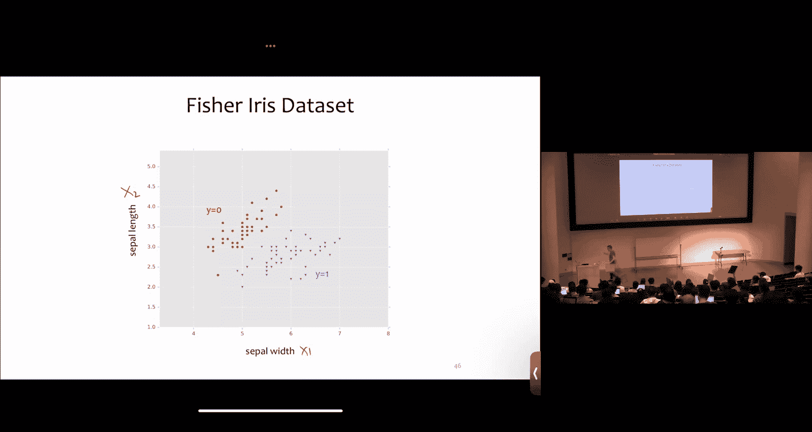
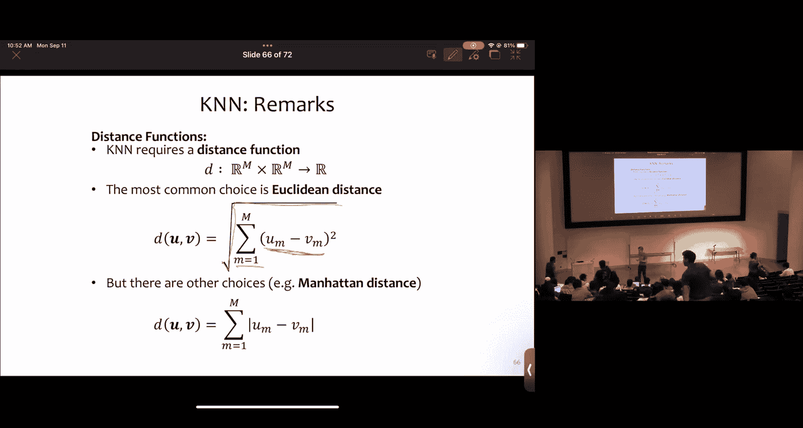

# 4：过拟合与k近邻算法

## 概述
在本节课中，我们将要学习机器学习中的两个核心概念：**过拟合**与**k近邻算法**。我们将从决策树算法的局限性出发，探讨模型如何泛化到未见过的数据，并介绍一种简单而强大的分类方法——k近邻算法。

## 课程的核心组成部分
本课程的核心学习部分并非仅仅在于课堂讲座。你将在与课程助教以及周围同学的互动中，获得真正的学习体验。课堂外的讨论、共同完成作业时的交流，往往是产生顿悟、融会贯通的时刻。本学期我们有一支优秀的团队与你一同工作。

他们将在很大程度上塑造你在这门课程中的体验。因此，我强烈建议你充分利用他们为这门课程投入的时间，因为他们中的许多人曾像你一样学习过这门课程。

## 关于决策树的问答
首先，有几个关于决策树的问题需要解答。你可能在计算熵时发现结果与幻灯片不符，请务必记住使用以2为底的对数（log₂），这一点非常重要。

另一个问题是：我们何时以及如何决定停止决策树的生长？特别是当某个属性可能取值的集合非常大甚至是无限（如实数）时，我们该如何处理？今天我们将讨论离散属性的情况。但如果一个属性或特征是实数值，实际上有一个巧妙的技巧，它只需要考虑 O(L) 次分割，其中 L 是该属性在训练集中取值的数量。我鼓励你思考如何实现这一点，稍后我们会揭晓答案。

还有一个问题是：如果决策树训练时某个分支没有接收到任何数据会怎样？这实际上会触发一个基本情况并创建一个叶节点。那么真正的问题是：当对空数据进行多数投票时，多数投票会怎么做？答案可能是选择一个任意的标签或随机标签。

在测试时，如果我们观察到一个在训练时未见过的特征值，该怎么办？这实际上是在你的树中创建了一个新的分支。如何处理这种情况可能有很多不同的选项，但无论如何，仔细思考你应该怎么做是有益的。

## 作业提醒与实证比较
通常的提醒：作业二将于9月15日（周五）截止。

现在，让我们开始对不同分裂准则进行实证比较。上次你看到了几种分裂准则，即错误率作为分裂准则和互信息。这里引用的是Bluntine和Niiblet于1992年发表的经典论文，他们比较了四种不同的准则，其中两种你已经熟悉：随机分裂和互信息。

随机分裂准则实际上就是：在每个节点随机选择一个特征，你根本不看任何数据，只是随机选择。

我想在这里重点强调的新准则是**基尼不纯度**。我们不会在课堂上详细讨论它，但它是一种概率信息论的形式，类似于互信息，但具有一些不同的性质。在这篇论文中，他们研究了四个医疗诊断数据集，试图通过这些数据集进行医疗诊断。他们将每个数据集划分为训练集和测试集，有些训练集大、测试集小，有些则相反。

他们得到的结果显示，在这四个医疗诊断数据集上，基尼增益（或基尼不纯度）与信息增益（他们当时对互信息的另一种称呼）在统计上几乎没有区别。从性能（错误率）上看，两者非常接近。他们进行了统计显著性检验，发现观察到的差异并不显著（p值远大于0.05）。

这里的要点是：有时你对一个算法如何工作有疑问，但直到你开始通过实证方法去剖析它，才能真正深入理解答案。这正是他们所做的，因为在那之前，人们为这些不同的分裂准则争论不休，但没有人真正在许多不同的数据集上深入分析哪一个效果更好。

## 决策树的归纳偏置
关于决策树，一个有用的思考角度是它的**归纳偏置**，即算法泛化到未见示例所依据的原则。为了热身思考决策树，让我们进行第一个课堂投票。

问题一的数据集如下，输出标签是 y（取值为 + 或 -）。每一行数据是一个示例，属性是 A、B 和 C。每个属性都是二值的，因此总是会分裂成两个分支。问题是：使用错误率作为分裂准则，决策树学习算法会学习到以下哪棵树？假设平局时按字母顺序打破。

投票结果显示，57%的人选择了选项三。有人想简要说明为什么选项三合理吗？通过将所有示例输入树中，可以很容易地看到这个选项实现了零训练误差，这很可能是一件好事。另一个有趣的点是，我们实际上遇到了一些平局。在顶部，A和C打平；在下一次需要分裂时，B和C打平。我们必须按字母顺序打破这些平局。这种方式有效是因为我们精心构建了数据集。

## 贪婪搜索与全局搜索
有多少人知道什么是贪婪搜索？贪婪搜索的目标是：你有一个由节点和边组成的搜索空间，目标是找到从左侧根节点到右侧叶节点的总权重最低的路径。在每一步，贪婪搜索选择具有最低即时权重的边。这是一种启发式搜索方法，不一定能找到最佳路径。

如果我们看看它是如何工作的：它会查看第一个节点的直接邻居，发现权重最低的选项是权重为1的那条边。然后查看该节点的邻居（权重为7、3、3、5），它会任意打破3之间的平局，选择另一个相邻节点。然后发现其邻居权重为4、1、2、2，它选择权重1的边，并以此方式继续直到找到终止状态。

这里出了什么问题？事实证明，在这里它选择了分支选项三，但如果它选择了看似更差的选项四，反而会得到总权重更低的路径。不仅如此，如果我们回溯得更远，不选择初始的权重1的边，我们本可以找到一条总权重低得多的路径（2+1+2+1）。

为什么人们喜欢这种方法？因为我们喜欢它的计算时间与路径长度成线性关系。

还有另一种算法叫做**全局搜索**。全局搜索是这样工作的：你计算到每个叶节点的路径权重。这非常繁琐，而且没有人喜欢这个算法，因为它耗时极长——实际上，它的时间复杂度是最长路径长度的指数级。但它有一个优势：它能返回搜索空间中确切的最低权重路径。

## 决策树学习的搜索视角
我们可以通过搜索的视角来概念化决策树是如何进行学习的。我的意思是：如果你将搜索空间视为所有可能的决策树，那么一个节点就像一棵决策树。在这个搜索空间中，边连接着一棵完整的树到另一棵树。我们从空根节点开始，它只有空树，你可以将其视为多数投票分类器，它没有节点。然后我们选择一个根节点。注意，这里的边权重是它们分裂准则的负值（例如负的互信息）。在决策树学习中，我们希望选择互信息最高的属性，但按照这里的惯例，我们选择权重最低的路径，所以取负值。

这里有四个不同的选项（打喷嚏、荨麻疹、年龄、性别）可以分裂，每个都有对应的负互信息。我们选择最低的一个（这里是年龄，-0.5）。然后我们扩展它的邻居。在这种情况下，树节点的邻居将是扩展左子节点的所有可能性（可以是性别、荨麻疹、打喷嚏，但不会是年龄）。我们再次计算每个选项的负互信息，选择最负的一个（性别），然后再次分裂，以此类推。

你可以将决策树学习算法本质上视为在这个巨大的、包含所有可能树的空间中进行贪婪搜索。如果我们展开所有这些节点，最终会看到每一棵可能的树。

## 泛化与归纳偏置
如果决策树学习是贪婪搜索，在每一步最大化我们的分裂准则，那么我们可以提出一个根本性问题：你的机器学习算法如何能够泛化到未见过的示例？这是本课程的核心问题。如果我们能回答这个问题，我们就能揭开机器学习的秘密，这也是我们试图理解这些算法的根本所在。

我们可以思考决策树，并问：决策树学习器的归纳偏置是什么？归纳偏置是算法泛化到未见示例所依据的原则。有人想尝试回答吗？决策树学习用来泛化到未见示例的原则是什么？

一个观点是：未见示例的行为应该类似于你实际看到的样本。同样，它们将具有与你看到的示例相似的互信息行为。因此，如果你将具有高互信息的特征放在树的顶部，那么这对未见过的示例应该是有益的。另一个更微妙的方面是：它在进行贪婪搜索，但一旦匹配了训练数据就会停止。我们不会仅仅因为可以就不断地扩展树。实际上，我们选择的是匹配训练数据的最小树，并将高互信息属性放在顶部。这就是贪婪搜索所做的。

我们可以将奥卡姆剃刀原理重新表述为机器学习版本：我们**偏好能够解释数据的最简单假设**。这是根本思想。

## 全局搜索与最小树
现在，让我们用之前见过的相同数据集再做一次示例。假设你有一个算法，它实际上能找到具有最低训练误差且尽可能小的树。这意味着它不是通过贪婪搜索学习，而是扩展了每一棵可能的树并进行穷举的全局搜索。那么该算法会返回哪棵树？同样，我们有一个“有毒”选项（不要选），并假设平局时选择最小的树。

投票结果显示，78%的人选择了选项五。如果你查看所有这些不同的树，选项五和选项三都具有零训练误差，但我们选择最小的那棵，选项五符合要求。这种情况的发生揭示了决策树学习的一个重要特性：如果你使用作业二中的决策树学习算法，你可能实际上找不到最小的树，因为它进行的是贪婪搜索，容易犯这类错误。如果你有能力进行穷举的全局搜索，你实际上可能找到一棵更好的树，比如这里的选项五。这个数据集据我所知是发生这种情况的最小的三属性数据集，所以这并非偶然，而是为了揭示这个问题。

## 泛化能力比较
下一个投票问题也有一个“有毒”选项。以下哪种情况能最好地泛化到未见示例？A) 训练精度低的小树；B) 训练精度高的小树；C) 训练精度高的大树。

81%的人选择了选项C。我同意这个观点：具有高训练精度的小树将有助于我们泛化到未见示例。原因是它不会关注数据集中的虚假噪声。例如，如果你的医疗诊断数据集有一个属性是“患者今天穿橙色衬衫吗？”当那个穿橙色衬衫的人（实际上很少人穿）走进诊所时，他可能被诊断患有一种非常罕见的疾病。数据现在看起来好像他们患这种罕见疾病的原因是他们也有穿橙色衬衫这个罕见属性，但我们都知道这只是巧合。然而，你的决策树不知道，它会捕捉到数据集中的这种噪声。如果你允许树长得非常大，它可能会捕捉到这些虚假的行为。

## 欠拟合与过拟合
这里我们想思考两个概念：**欠拟合**和**过拟合**。在欠拟合中，模型被认为过于简单，无法捕捉数据中的趋势，表现出过多的归纳偏置。例如，多数投票分类器就是一个例子。另一方面，过拟合是当模型过于复杂，它拟合的是噪声而不是我们真正关心的东西。因此，我们的记忆算法（对不相关属性做出响应）将是倾向于过拟合的模型的一个好例子。

我们可以用错误率来表达过拟合。我们之前看过的三种错误率是：训练误差、测试误差和真实误差。如果真实误差远大于训练误差，我们就说假设 H 对训练数据过拟合。过拟合的量是真实误差减去训练误差。你自然会想到：等等，我们无法测量真实误差。因此，在实践中，我们经常查看测试误差和训练误差之间的差异来判断是否存在过拟合。

## 决策树中的过拟合示例
这是一个决策树学习中过拟合的例子。纵轴是准确率，横轴是树的大小。我有两个数据集：一个训练数据集和一个验证数据集（这不是测试集，只是一些留出的数据，用于评估树的表现，但不用于实际训练树）。我们开始训练过程，从零节点开始，然后添加一堆节点，达到10个节点。在每一步，我都在评估训练误差和验证误差。到20个节点时，训练误差和验证误差似乎已经趋于稳定。但也许我们可以继续，也许验证误差（即留出数据的误差）可以降得更低。当我们达到30个节点时，训练误差降低了（注意：准确率是我们希望高的，误差是1减去准确率）。也许添加更多节点，它会回升。验证误差似乎趋于平稳，也许它仍然会... 不，现在我们达到了大约50个节点，验证误差变得越来越差。我们看到这里有一个“甜点”：如果我们在大约15个节点处停止，验证误差处于最高水平。随着我们不断添加节点，我们开始过度拟合训练数据中的噪声，因此在这个留出的验证数据上的表现越来越差。

## 应对过拟合的方法
我们对此能做些什么？有很多选择。一种方法是，正如你将在作业二中做的，不要将树生长超过某个最大深度。另一种选择是：如果分裂准则低于某个阈值，则不进行分裂（即如果所有分裂带来的互信息改进都很低，那么你应该停止）。你可以在分裂不具有统计显著性时停止生长。我们可以讨论的另一个选择是：你可以生长整棵树（完整的，比如100个节点的树），然后剪掉其中的一部分。

让我们更仔细地看看这种方法。有一种方法叫做**减少错误剪枝**。其思想是：将数据分成训练集和验证集。然后使用训练数据集生长完整的树（确保一直生长到完美匹配训练数据）。然后按如下方式重复剪枝：使用验证数据集评估每个分裂，比较有该分裂和没有该分裂时的验证错误率。如果你有一棵由节点组成的树，你可以选择每个节点并问：如果我们去掉这个节点，我的验证误差会变高还是变低？记录你得到了多少改进。然后你可以问：如果我去掉这个节点及其所有子节点，会带来更多还是更少的改进？检查完所有节点后，选择能给你最大改进的那个节点进行剪枝，然后重复这个过程。如果没有移除任何节点能带来改进，则停止。

我们可以像之前一样演示这个过程。训练后，剪枝过程将检查你在验证数据上的准确率。它可能从100个节点开始，但剪掉一些后，下降到85个节点，验证误差略高（树更小了）。再剪掉一些，下降到75个节点，误差又回升了。继续剪枝，直到最终在大约21或22个节点处停止。这是我们在验证数据上获得的最佳性能，甚至比训练过程中得到的还要好一点。

这里有一个重要的注意事项：Henry下次课会详细讨论，但你应该注意，我们非常小心地使用了这个验证集。在测试集上进行这种剪枝是错误的做法。测试集是留作最终评估用的。从某种意义上说，这种剪枝策略是另一种学习。我们实际上是在这个验证集上学习如何剪枝。因此，你仍然应该在测试集上评估最终得到的树。

## 决策树的优势与学习目标
决策树因其优点成为现实世界中最流行的分类方法之一。它们易于向非机器学习人员解释，计算和内存效率高，可应用于各种问题（目前我们只看到分类，但它们也可用于回归和密度估计）。应用领域包括医学、分子生物学、文本分类、制造业、天文学、农业等。它们还有各种有趣的扩展，我们将在课程后期讨论集成方法（决策森林是其中一个例子）。

关于决策树这一广泛部分的学习目标，不仅仅是理解决策树（尽管这当然是其中一部分），我们还希望你能够：实现决策树的训练和预测；使用有效的分裂准则（如互信息）；解释泛化与记忆之间的区别；描述我们今天讨论的决策树的归纳偏置；使用数学工具以严谨的方式形式化学习问题；解释真实误差与训练误差之间的区别；判断决策树是欠拟合还是过拟合；并实现剪枝或某种其他早期停止方法来对抗过拟合。

## 实值属性与鸢尾花数据集
在剩下的时间里，我想谈谈实值属性。为此，我希望你思考一下鸢尾花。如果你没在菲普斯温室见过鸢尾花，它就在你附近。鸢尾花有不同的部分：两侧有花瓣，中间有所谓的萼片。事实证明，你可以从鸢尾花这些不同部分的大小中学到一些东西。

回到1936年，有一位名叫安德森的植物学家。他带着笔记本和铅笔（因为那时没有电脑）来到田野，仔细地行走，每找到一朵鸢尾花，就蹲下来用卷尺测量花瓣长度和萼片长度，并记录物种（例如，0代表山鸢尾，1代表变色鸢尾，2代表维吉尼亚鸢尾）。他这样做了150次，收集了所有这些对花朵的仔细测量数据。

现在，我想用这个数据集来研究处理这类实值属性的意义。你可以想象尝试仅通过查看这些属性来预测花朵的实际物种。在此之前，关于这个数据集有一个重要的启示：这个数据集被称为费希尔鸢尾花数据集，因为一位名叫费希尔的统计学家用它做了有趣的统计工作。然而，大家没有以实际收集数据的安德森命名，反而以统计学家命名。所以，教训也许是：不要做植物学家。无论如何，我们称之为安德森鸢尾花数据集，并且我们将删除四个特征中的两个，只关注萼片长度和萼片宽度。

这样，我们的特征 x1 和 x2 可以被视为二维空间中的点。这就是实值特征的力量：我们可以将它们概念化为高维空间中的点，并带有标签 y（可以视为颜色或形状）。如果我们在二维空间中绘制，这里是萼片宽度（x1特征），这里是萼片长度（x2特征）。你可以看到这些是实际的鸢尾花，它们很好地分成了两组（y=0 和 y=1）。我实际上省略了第三个物种，因为包含它会有点混乱，但至少对于这两个物种，分离得很好。如果你只有一个特征，分离就不会那么清晰，你需要两者。

为了更好地理解这一点，如果我们能有自己的真实世界数据集就好了。我没有鸢尾花，但你们可以代替鸢尾花。如果你拿着红色或蓝色的文件夹，请把它举到空中。你可以想象，对于这样的数据集，你可能想做的一件事是将其概念化：你实际坐的列号就像是 x1 特征，你坐的行号就像是 x2 特征。

现在，我们可以思考如果一个新的未标记点出现会发生什么。假设它出现在这里，你如何分类这个点？大多数人说是蓝色。如果我们把新点放在房间的另一边呢？现在你改变了主意。所以位置显然很重要。如果我们把这个点移到这里呢？现在似乎有点不确定了。为什么现在不确定了？因为它靠近一些蓝点，也靠近一些红点。之前它靠近一堆蓝点，所以我们都说是蓝色；在另一边它主要靠近红点，所以我们都说是红色；我们只是把它移过来一点，但现在附近潜伏着所有这些蓝点，所以我们不确定了：应该是蓝色、红色，还是紫色？

## k近邻算法的直觉
事实证明，我认为你们实际上都有一个共同的归纳偏置。你们的归纳偏置是关于高维空间中的点应该如何表现的。让我看看这个算法是否捕捉到了你们的直觉。这个算法叫做**最近邻算法**。其思想是：我们存储我们的训练数据集 D。这就是整个训练算法。非常简单，你现在应该在想：哦，天哪，我们又回到那个记忆算法了吗？不，不，因为我们将要做的预测实际上更有趣。假设 h(x) 接收一个新点 x'（白文件夹），数据集 D 由这些红蓝文件夹组成。我们要做的是：让 x_i 成为 D 中离 x' 最近的点，然后返回 y_i。这个算法的行为似乎很像你们刚才所做的。

为了更深入地理解它，我希望我们思考一下分类和二元分类的一些数学知识。在这种具有实值特征的新严谨设置中，分类可以被视为由 (x_i, y_i) 对组成。这是我们将在本课程中使用的一种简写，它表示一组对。对于所有 i，我们的 x 是长度为 M 的实值向量，y_i 是离散值标签（例如从1到