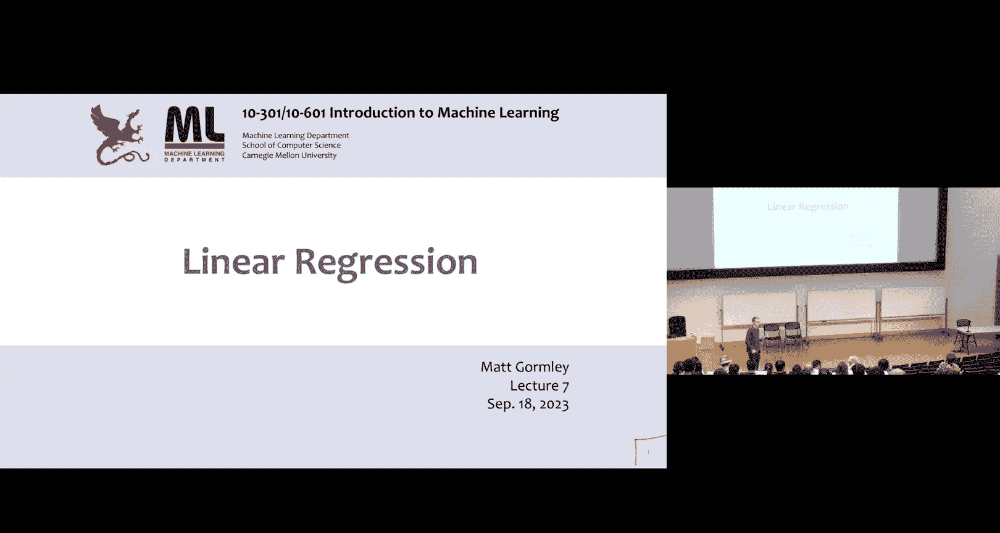
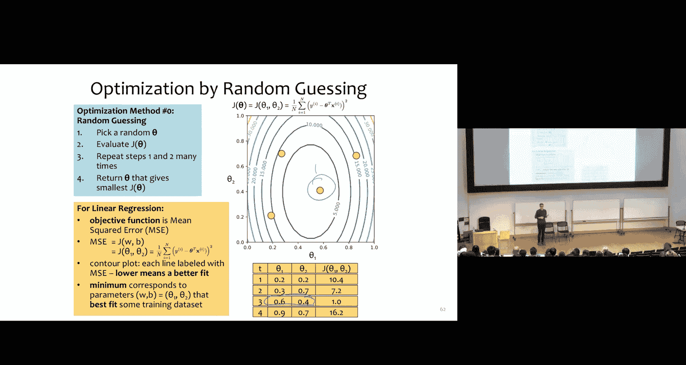
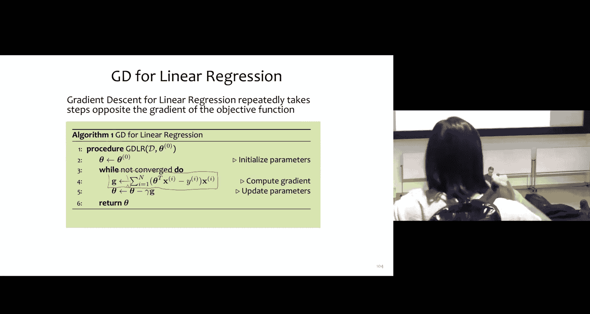

# 7：线性回归 🎯

在本节课中，我们将要学习回归问题，特别是线性回归。我们将从分类问题转向回归问题，并理解如何将学习过程构建为一个优化问题。这个“学习即优化”的理念是现代机器学习的基础。

## 从分类到回归 🔄

上一节我们介绍了分类问题，本节中我们来看看回归问题。回归与分类的关键区别在于输出变量的类型。

给定一个由 `(x, y)` 对组成的训练数据集 `D`，其中 `x` 是一个向量，`y` 是一个标量。我们的目标是学习一个函数（在高维空间中是一条曲线或直线），使其能最好地拟合训练数据。

在分类中，`y` 是离散的（例如，`+1` 或 `-1`）。在回归中，`y` 是一个实际的标量值。例如：
*   预测第二天的股票价格。
*   流行病预测。
*   语音合成（从文本字符串到音频信号）。
*   图像生成。

## 使用现有算法进行回归 🤔

在深入线性回归之前，我们先思考如何用已学的算法（如K近邻和决策树）来解决回归问题。

### K近邻回归

以下是两种K近邻回归算法：

**算法1：K=1最近邻回归**
1.  存储所有 `(x, y)` 对。
2.  预测时，选取训练数据中最近的 `x`，并返回其对应的 `y` 值。

**算法2：K=2最近邻距离加权回归**
1.  存储所有 `(x, y)` 对。
2.  预测时，选取训练数据中最近的两个实例，并返回它们 `y` 值的加权平均值（权重与距离成反比）。

### 决策树回归

决策树也可以用于回归。与分类树不同，回归树的叶节点包含的是标量预测值，而不是类别标签。

构建过程如下：
1.  选择能最小化适当分裂准则的属性进行分裂（例如，使用均方误差或平均绝对误差）。
2.  目标是让分裂后子集中的数据点具有相似的标量值。
3.  到达叶节点时，返回该节点内数据点 `y` 值的平均值（或唯一值）。

决策树回归在实践中被使用，因为它具有可解释性。

## 线性回归与残差 📈

现在，我们正式介绍线性回归。我们的目标是学习一个线性函数。

对于一个 `d` 维输入，线性函数的形式是：
`y = w_1*x_1 + w_2*x_2 + ... + w_d*x_d + b`
可以更紧凑地写为：
`y = θ^T * x`
其中 `θ` 是包含了权重 `w` 和偏置项 `b` 的参数向量。

这与感知机的线性决策边界 `sign(θ^T * x)` 不同，我们直接使用 `θ^T * x` 的输出值作为预测。

为了评估一个线性函数对数据点的拟合好坏，我们引入**残差**的概念。

**残差** `e_i` 是观测值 `y_i` 与预测值 `ŷ_i` 之间的垂直距离。
`e_i = y_i - ŷ_i = y_i - (θ^T * x_i)`

线性回归的核心思想是：找到那个能使所有数据点**残差平方和**最小的线性函数。这被称为**均方误差**。

## 作为优化问题的学习 🎯

上一节我们定义了残差和均方误差，本节中我们来看看如何将其转化为一个优化问题。

均方误差 `J(θ)` 是我们的目标函数（需要最小化的函数）：
`J(θ) = (1/n) * Σ_{i=1}^{n} (y_i - θ^T * x_i)^2`

线性回归的目标就是找到参数 `θ*`，使得：
`θ* = argmin_θ J(θ)`

这被称为**无约束优化问题**：我们在没有任何限制的情况下，寻找能使目标函数值最小的输入参数。

## 优化算法初探：随机猜测 🎲

在介绍强大的优化算法之前，我们先看一个简单但低效的方法：随机猜测。

算法步骤如下：
1.  随机选择一组参数 `θ`。
2.  计算该 `θ` 对应的均方误差 `J(θ)`。
3.  重复步骤1和2多次。
4.  返回所有尝试中 `J(θ)` 最小的那组 `θ`。

这种方法直观但效率低下，特别是在参数空间很大时。我们需要更系统的方法。

## 梯度下降法 ⛰️

梯度下降法是机器学习中最重要的优化算法之一。其核心思想是：通过迭代地沿着目标函数**最陡下降**的方向更新参数，从而找到最小值。

**梯度** `∇J(θ)` 是一个向量，其每个分量是目标函数 `J(θ)` 对相应参数的偏导数。它指向函数值增长最快的方向。

因此，**负梯度** `-∇J(θ)` 就指向了函数值下降最快的方向。

梯度下降算法步骤如下：
1.  **初始化**：选择初始参数 `θ_0`（例如，随机初始化或全零）。
2.  **迭代更新**：对于 `t = 0, 1, 2, ...`，重复以下步骤直到满足停止条件：
    a. **计算梯度**：`g_t = ∇J(θ_t)`
    b. **选择步长（学习率）**：选择一个标量 `γ_t`。
    c. **更新参数**：`θ_{t+1} = θ_t - γ_t * g_t`
3.  **返回**：满足停止条件时的参数 `θ`。

**关键细节**：
*   **初始点**：可以随机选择或设为全零向量。
*   **步长（学习率）**：可以是固定值，但更常用的是随时间衰减的调度（例如，`γ_t = γ_0 / (1 + (t-1)*γ_0)`）。
*   **停止条件**：例如，当梯度向量的范数 `||∇J(θ)||` 小于一个很小的阈值 `ε`（如 `10^{-8}`）时，说明已接近极值点，可以停止。

## 应用于线性回归：计算梯度 📝

要将梯度下降法应用于线性回归，我们需要计算均方误差 `J(θ)` 的梯度。

首先，考虑单个数据点 `(x_i, y_i)` 的损失 `J_i(θ)`：
`J_i(θ) = (1/2) * (y_i - θ^T * x_i)^2` （引入 `1/2` 是为了后续求导方便，不影响最优解）。

其对第 `j` 个参数 `θ_j` 的偏导数为：
`∂J_i/∂θ_j = -(y_i - θ^T * x_i) * x_{i,j}`

因此，单个数据点的梯度向量为：
`∇J_i(θ) = -(y_i - θ^T * x_i) * x_i`

由于总目标函数 `J(θ) = (1/n) Σ J_i(θ)`，且梯度算子是线性的，所以 `J(θ)` 的梯度就是所有单个数据点梯度的平均：
`∇J(θ) = (1/n) Σ_{i=1}^{n} [ -(y_i - θ^T * x_i) * x_i ]`

**梯度下降用于线性回归的最终算法**：
1.  初始化参数 `θ`。
2.  重复直到收敛：
    a. 计算梯度：`g = (1/n) Σ_{i=1}^{n} [ -(y_i - θ^T * x_i) * x_i ]`
    b. 更新参数：`θ = θ - γ * g`
3.  返回 `θ`。

在每次参数更新中，我们实际上是在调整线性函数的斜率和截距，使直线逐渐“滑动”到最佳拟合位置。同时，均方误差 `J(θ)` 随着迭代次数的增加而逐渐减小。

## 总结 ✨

本节课中我们一起学习了：
1.  **回归问题**：其目标是预测连续的标量输出，与分类问题不同。
2.  **现有算法的扩展**：如何用K近邻和决策树解决回归问题。
3.  **线性回归**：学习一个形式为 `y = θ^T * x` 的线性函数来拟合数据。
4.  **残差与均方误差**：通过最小化残差平方和（均方误差 `J(θ)`）来定义“最佳拟合”。
5.  **优化视角**：将学习过程形式化为一个无约束优化问题 `argmin_θ J(θ)`。
6.  **梯度下降法**：一种通过迭代地沿负梯度方向更新参数来寻找函数最小值的强大优化算法。
7.  **具体应用**：推导了线性回归中均方误差的梯度公式，并给出了完整的梯度下降求解流程。

线性回归是理解“学习即优化”这一核心现代机器学习范式的关键转折点。在接下来的课程中，我们将继续深入探讨其他优化算法和模型。