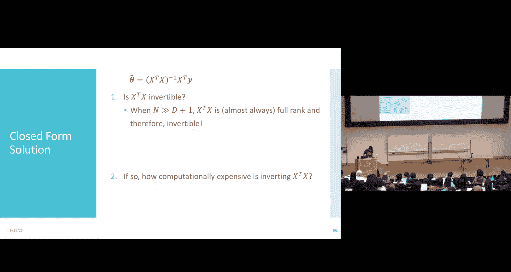
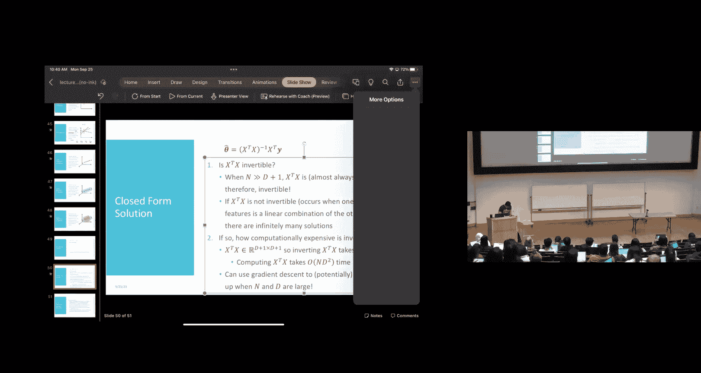
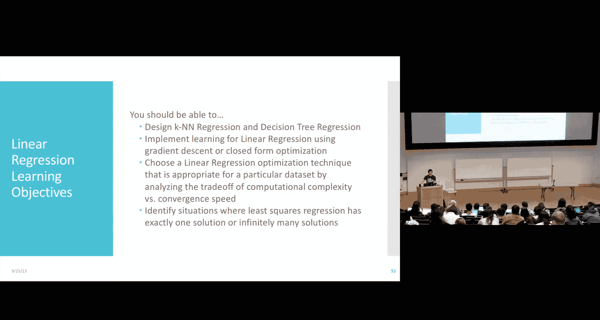

# 8：机器学习优化

在本节课中，我们将学习如何将机器学习问题视为优化问题，并深入探讨优化线性回归目标函数的多种方法。我们将从凸函数的概念入手，理解梯度下降法为何有效，并学习线性回归的闭式解（即解析解）。最后，我们将对比梯度下降法与闭式解的优缺点。

## 凸函数与优化

上一节我们介绍了线性回归及其梯度下降解法。本节中，我们来看看为什么梯度下降法适用于线性回归。这需要引入一个关键的数学概念：凸性。

一个函数 **F** 是**凸函数**，如果对于其定义域内的任意两点 **x₁** 和 **x₂**，以及任意标量 **c ∈ [0, 1]**，都满足以下不等式：
`F(c * x₁ + (1 - c) * x₂) ≤ c * F(x₁) + (1 - c) * F(x₂)`
直观上，这意味着连接函数图像上任意两点的线段，总是位于函数图像的上方或与之重合。

如果上述不等式中的“≤”可以严格替换为“<”（除了端点可能相等的情况），则该函数是**严格凸函数**。严格凸函数的图像像一个“碗”，没有平坦的部分。

凸性在优化中至关重要，因为它保证了以下性质：
*   对于凸函数，**每一个局部最小值都是全局最小值**。
*   对于严格凸函数，**存在唯一的一个全局最小值**。

梯度下降法是一种局部优化算法，它只根据当前位置的梯度信息决定移动方向。如果目标函数是凸的，那么无论从何处开始，梯度下降最终都能收敛到一个全局最小值。对于线性回归，其目标函数（均方误差）是凸的（但不总是严格凸），因此梯度下降法是一个可靠的选择。

## 线性回归的闭式解

虽然梯度下降法有效，但我们可能会想：有没有更直接的方法找到最优解？答案是肯定的，我们可以通过求导并令导数为零来找到解析解，这种方法称为**闭式解**或**临界点优化**。

首先，我们需要建立矩阵表示法。给定包含 N 个样本的训练集，每个样本有 D 个特征和一个实值标签 yᵢ。

*   我们将所有特征向量（添加了常数项1以包含截距）堆叠成一个 **设计矩阵 X**，其维度为 `N × (D+1)`。
*   将所有标签堆叠成一个列向量 **y**，其维度为 `N × 1`。

线性回归的均方误差目标函数可以简洁地写为：
`J(θ) = (1 / (2N)) * ||Xθ - y||²`
其中，`θ` 是待学习的权重向量，`||·||` 表示向量的 L2 范数。

为了找到最小化 `J(θ)` 的 `θ`，我们计算其梯度并设为零：
`∇J(θ) = (1/N) * Xᵀ(Xθ - y) = 0`
解这个方程，我们得到著名的**普通最小二乘解**：
`θ̂ = (XᵀX)⁻¹ Xᵀy`
这个公式直接给出了最优权重向量 `θ̂`，无需迭代。

## 闭式解的考量

闭式解非常优雅，但它并非没有代价。使用闭式解时，我们必须考虑两个关键问题：

1.  **矩阵 `XᵀX` 是否可逆？**
    *   在实践中，只要数据点数量 `N` 远大于特征数量 `D+1`，并且特征之间不存在严格的线性依赖关系，`XᵀX` 几乎总是可逆的。
    *   如果 `XᵀX` 不可逆（例如，特征线性相关或数据点太少），则存在**无穷多个**能最小化均方误差的解。这与目标函数是凸而非严格凸的性质相符。

2.  **计算逆矩阵的代价有多大？**
    *   计算 `(XᵀX)⁻¹` 的时间复杂度约为 `O(D³)`，其中 D 是特征数量。此外，构造 `XᵀX` 本身也需要 `O(ND²)` 的时间。
    *   当特征数量 `D` 非常大时（例如成千上万），这个计算会变得非常昂贵。

因此，虽然闭式解给出了精确答案，但在高维场景下，计算成本可能过高。相比之下，梯度下降法虽然是一种迭代近似方法，但在处理大规模数据时通常更具可扩展性。两种方法各有适用场景。

## 总结

本节课中我们一起学习了机器学习中的优化基础。
*   我们首先介绍了**凸函数**的概念，理解了为什么梯度下降法能有效地优化线性回归的凸目标函数。
*   接着，我们推导了线性回归的**闭式解** `θ̂ = (XᵀX)⁻¹ Xᵀy`，这是一种通过解析方式直接找到最优解的方法。
*   最后，我们对比了两种方法：梯度下降法是一种通用的迭代方法，适用于各种规模的问题；而闭式解虽然精确，但在特征维度很高时计算成本巨大。在实际应用中，需要根据问题的具体规模和数据特点来选择合适的方法。