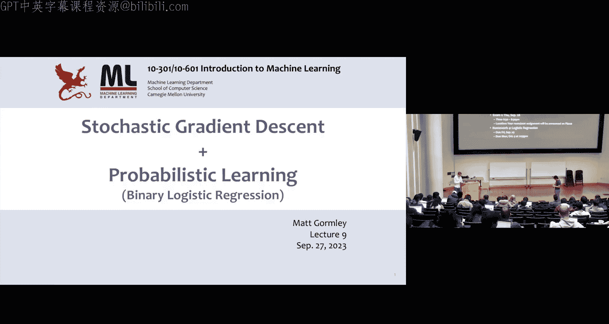
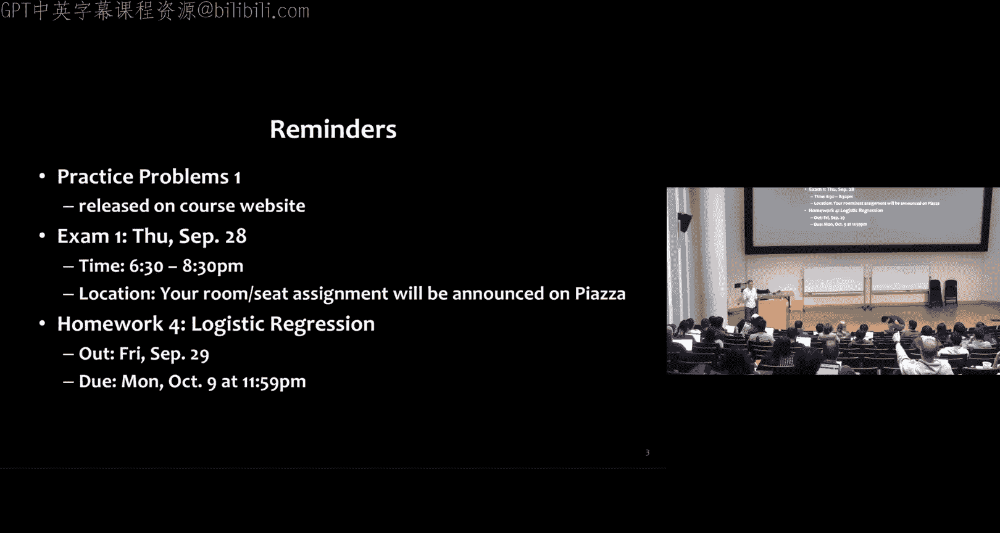
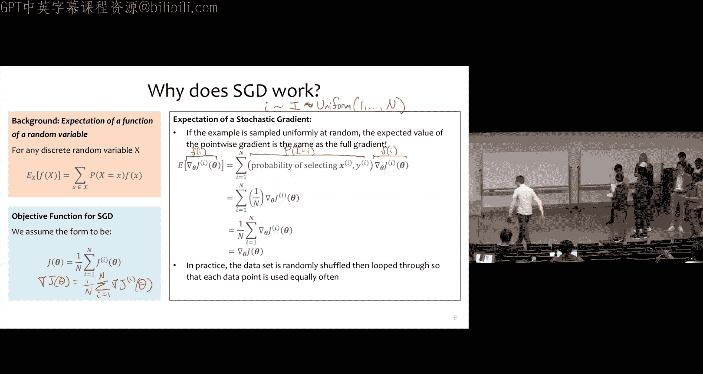
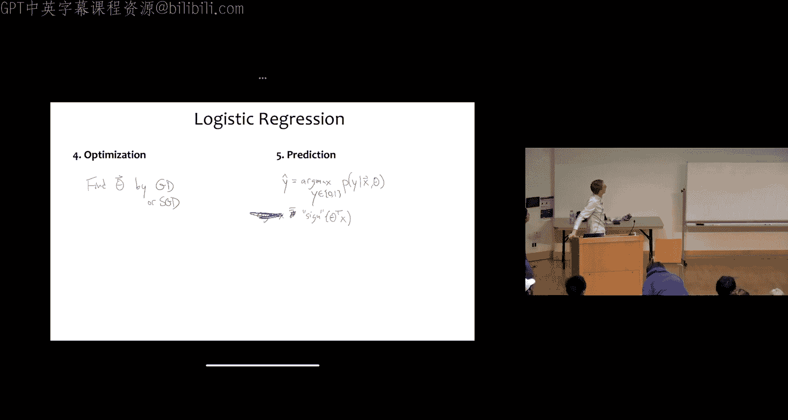

# 9：随机梯度下降与逻辑回归 🎯

在本节课中，我们将学习一种新的优化算法——随机梯度下降，并在此基础上介绍一个名为逻辑回归的新模型。

## 课程提醒 📢

练习题目已发布，考试将在周四进行。请务必查看 Piazza 以确认你的考场和座位号，这可能与你邻座同学的不同。
作业 4 将于 9 月 29 日（周五）发布，并于 10 月 9 日（周一）截止。在作业 4 中，你将实际实现用于逻辑回归的随机梯度下降算法，并完成其他一些任务。

## 从梯度下降到随机梯度下降 🔄

到目前为止，我们已经学习了几种不同的优化技术，例如随机猜测、梯度下降和闭式优化。现在，我们将介绍随机梯度下降。你可以将其视为梯度下降的一种变体。

梯度下降的算法是：将参数 θ 初始化为某个初始值 θ⁰。在未收敛时，沿着目标函数全梯度的反方向更新参数，步长由参数 γ 控制。

随机梯度下降的算法与此相似，但有一个关键区别。在梯度下降中，我们使用整个目标函数的梯度进行单次参数更新。而在随机梯度下降中，我们首先从 1 到 n（n 为训练样本数）中随机选取一个整数 i，然后沿着**单个**训练样本 i 的目标函数 Jⁱ 的梯度反方向更新参数。

我们假设随机梯度下降的目标函数可以分解为 n 个小目标函数 J¹, J², ..., Jⁿ 的和。通常，我们还会在前面加上一个 1/n 项，使其成为这些 Jⁱ 函数的平均值。

## 算法实现细节 ⚙️

在上述算法版本中，我们总是从均匀分布中随机选择下一个样本。但在实践中，这可能导致一个问题：你可能会偶然地（尽管概率很低）连续多次选中同一个样本（例如样本 7），而其他样本（例如样本 1）则可能很长时间未被选中。

为了解决这个问题，实践中我们采用以下版本：在未收敛时，我们首先将整数 1 到 n 随机打乱（即生成一个随机排列），然后遍历这个随机排列。这种方式本质上是**无放回抽样**。这就像从一个装有 n 个数字的袋子中抽取：抽出一个数字（例如 7）后，将其丢弃，再抽下一个时就不会再抽到 7，直到袋子清空。然后我们将所有数字放回袋子，重新打乱，再次开始，直到收敛。

## 直观理解：大步与小步 🚶‍♂️🚶‍♀️

随机梯度下降的有趣之处在于其工作方式。假设你有 100 万个训练样本，目标最小值在某个位置。
*   **梯度下降**会从起点开始，为**每一个**训练样本计算梯度，并将这 100 万个梯度相加，得到目标函数 J(θ) 的梯度，然后朝着这个方向迈出**一大步**。接着，它需要重新为所有 100 万个样本计算梯度，才能迈出下一步。
*   **随机梯度下降**则不同：它随机选取一个样本，快速计算其梯度，然后立即迈出**一小步**。接着再选另一个样本，再迈一小步。它不断迈出许多微小步伐，有时可能更接近最小值，有时可能远离，但**平均而言**它会朝着正确的方向前进。在实践中，由于你无需等待计算完所有样本的梯度就能取得进展，因此它通常能更快地到达目标。

## 为什么随机梯度下降有效？📊

我们可以通过分析所使用梯度的**期望**来理解其工作原理。

首先是一些背景知识：对于任何离散随机变量 X，函数 f(X) 的期望 Eₓ[f(X)] 定义为随机变量 X 所有可能取值的概率乘以该取值对应的 f(x) 值之和。

随机梯度下降的目标函数被假定为 J(θ) = (1/n) Σᵢ Jⁱ(θ) 的形式。我们可以问：随机梯度步长的期望值是多少？

如果我们从训练样本中**均匀随机**抽样，那么随机梯度（即单个样本的梯度）的期望值将与全梯度（即所有样本梯度的平均）相同。推导如下：

令随机变量 I 服从 1 到 n 上的均匀分布。我们从中采样得到一个小写的 i。那么，随机梯度 ∇Jⁱ(θ) 的期望为：
`E[∇Jⁱ(θ)] = Σᵢ P(I=i) * ∇Jⁱ(θ) = Σᵢ (1/n) * ∇Jⁱ(θ) = (1/n) Σᵢ ∇Jⁱ(θ) = ∇J(θ)`
这正是我们想要遵循的真实梯度。

因此，从期望上看，随机选取一个训练样本并计算其梯度，等价于遵循真实的全梯度方向。

关于实践中使用的“无放回抽样”（随机打乱后遍历）版本，其理论依据在近五年才得到完善，但上述“有放回均匀抽样”版本更易于直观解释其期望性质。

## 应用于线性回归 📉

掌握了这个新算法后，我们可以重新审视作为函数逼近的线性回归问题。现在，我们将使用随机梯度下降来最小化均方误差目标函数。

我们可以重用几讲前所做的微积分计算，因为随机梯度下降需要的正是单个样本目标函数 Jⁱ(θ) 的梯度。当时我们为了数学上的便利计算了 Jⁱ(θ) 的梯度，这正好为随机梯度下降所用。而梯度下降则使用全目标函数 J(θ) 的梯度。

随机梯度下降用于线性回归的算法，有时也称为最小均方算法，步骤如下：
1.  当未收敛时：
2.  生成整数 1 到 n 的一个随机排列。
3.  对于排列中的每个 i：
4.  计算单个样本的梯度：`g = -2 * (yⁱ - θᵀxⁱ) * xⁱ`
5.  更新参数：`θ = θ - η * g` （其中 η 是步长）

与梯度下降对比，关键区别在于：梯度下降需要在第 4 步完成对所有 i 的求和后，才能在第 5 步进行一次更新；而随机梯度下降在计算完每一个样本的梯度后（第 6 步）立即进行参数更新。

## 收敛速度比较 ⏱️

我们可以从理论收敛速率上比较梯度下降和随机梯度下降。

定义收敛条件为：当前参数对应的目标函数值 J(θ) 与最优值 J(θ*) 之差小于某个阈值 ε。
*   随机梯度下降需要 `O(1/ε)` 步才能收敛。
*   梯度下降只需要 `O(log(1/ε))` 步，其渐近收敛速率更快。

这似乎与“随机梯度下降在实践中更快”的观察矛盾。关键在于**每步的计算成本**。
假设 n 是样本数，m 是特征数。
*   梯度下降**每步**需要 `O(n*m)` 的计算量（例如线性回归中需计算所有样本的梯度并求和）。
*   随机梯度下降**每步**仅需 `O(m)` 的计算量（只需计算单个样本的梯度）。

因此，尽管随机梯度下降理论收敛速率较慢，但由于其每步计算成本极低，能够进行大量更新，所以在实践中通常更快。

对于非凸函数（如神经网络的目标函数），随机梯度下降还有一个优势：它更不容易陷入局部极小值，因为其随机性可能使其跳过较差的局部极小点，从而找到更好的解。

## 迈向概率学习：改变范式 🧠

接下来，我们将转向**概率学习**，这需要我们对数据的来源有一个根本性的范式转变。

此前，我们假设数据由某个未知的确定性目标函数 c* 生成：x 来自未知分布 P*，y = c*(x)。我们的目标是学习一个假设 h(x) 来最佳逼近 c*。

现在，我们采用一种完全不同的视角：我们仍然假设 x 来自某个分布，但 y 则来自一个以 x 为条件的未知**概率分布** P*(y|x)。我们的目标也随之改变：不再是直接学习一个假设，而是学习一个概率分布 P(y|x)，以最佳逼近那个未知的 P*(y|x)。

## 最大似然估计原则 🎲

为了实现概率学习，我们需要一个来自**最大似然估计**原则的新目标函数。

首先考虑统计学视角：假设我们得到 n 个独立同分布样本 D = {x¹, x², ..., xⁿ}，它们来自一个具有概率质量函数 P(x|θ) 的离散随机变量 X。**似然函数** L(θ) 定义为这些样本概率的乘积（因样本独立同分布）。为方便计算，我们常使用**对数似然函数** l(θ)，即似然函数的对数，它将乘积转化为求和。

**最大似然估计原则**就是选择能使数据似然度最大的参数 θ：`θ_MLE = argmax_θ L(θ)`。

对于我们更关心的分类问题，数据是成对出现的：D = {(x¹, y¹), ..., (xⁿ, yⁿ)}，其中 y 是离散的。我们假设这些样本来自随机变量 X 和 Y，其条件概率质量函数为 P(y|x, θ)。此时，我们使用**条件似然函数**，即所有样本条件概率的乘积。同样，我们取其对数得到条件对数似然。

为了与我们熟悉的**最小化**目标函数的优化算法（如梯度下降）保持一致，我们通常定义目标函数为**负条件对数似然**：`J(θ) = -(1/n) Σᵢ log P(yⁱ | xⁱ, θ)`。最小化 J(θ) 等价于最大化条件似然。

直观上，最大似然估计试图将有限的概率质量尽可能多地分配给我们已经观测到的事件，而牺牲未观测到的事件。

## 逻辑回归模型介绍 🧮

逻辑回归是概率学习的一个核心模型，也是更复杂神经网络的基础构建模块。尽管名字中有“回归”，但它实际上是一个用于**分类**的线性概率模型。

我们假设输入 x 是长度为 m 的连续向量，输出 y 是离散的二元标签（0 或 1）。逻辑回归的关键思想是直接学习一个超平面（线性模型），其决策函数形式为 `θᵀx`（已包含截距项）。

逻辑回归的流程是：定义一个线性分类器，构建一个基于似然的目标函数，用梯度下降优化参数，最后在测试时输出模型下概率最高的类别。

## 从感知机到逻辑回归 🔀

作为热身，让我们思考线性分类器的优化。我们已经熟悉了线性回归的均方误差。那么，对于感知机这个线性模型，能否使用均方误差呢？

感知机的预测是 `sign(θᵀx)`。如果我们定义目标函数 `J(θ) = (1/n) Σᵢ (yⁱ - sign(θᵀxⁱ))²`，问题在于 `sign` 函数是**不可微**的，因此我们无法计算其梯度，也就无法使用基于梯度的优化方法。

解决方案是：用一个精心选择的、**可微的**函数 σ 来代替 `sign` 函数。这样我们就能计算新目标函数的梯度，并成功地使用梯度下降进行优化。这个函数 σ 就是**逻辑函数（或称Sigmoid函数）**。

## 逻辑函数与模型定义 📈

逻辑函数定义为：`σ(u) = 1 / (1 + exp(-u))`。其形状类似于一个“软化的”符号函数：当 u 为很大的正数时，σ(u) 接近 1；当 u 为很大的负数时，σ(u) 接近 0。

在逻辑回归中，我们使用这个函数来**直接建模概率**。我们定义：在给定输入 x 和参数 θ 的条件下，`y=1` 的概率为 `P(y=1 | x, θ) = σ(θᵀx)`。相应地，`P(y=0 | x, θ) = 1 - σ(θᵀx)`。这等价于假设 y 服从一个参数为 φ = σ(θᵀx) 的伯努利分布。

## 逻辑回归的目标函数与优化 🎯

逻辑回归不使用均方误差，而是使用**负条件对数似然**作为目标函数。

首先，整个数据集的条件似然是每个样本条件概率的乘积。取其对数得到条件对数似然 l(θ)。我们的目标函数 J(θ) 定义为负的条件对数似然的平均值：
`J(θ) = -(1/n) Σᵢ log P(yⁱ | xⁱ, θ)`
其中，`P(yⁱ | xⁱ, θ)` 根据 yⁱ 是 1 还是 0，分别等于 `σ(θᵀxⁱ)` 或 `1 - σ(θᵀxⁱ)`。

为了使用（随机）梯度下降优化 J(θ)，我们需要计算其梯度。经过一系列微积分运算（具体推导可在习题课或作业中完成），我们可以得到对于单个样本 i，其梯度为：
`∇Jⁱ(θ) = -(yⁱ - σ(θᵀxⁱ)) * xⁱ`
而整个目标函数的梯度则是所有样本梯度的平均：`∇J(θ) = (1/n) Σᵢ ∇Jⁱ(θ)`。

这个结果与线性回归的梯度形式 `-(yⁱ - θᵀxⁱ) * xⁱ` 非常相似，只是在逻辑回归中，预测值 `θᵀxⁱ` 被套上了 Sigmoid 函数 `σ(θᵀxⁱ)`。

## 预测与总结 ✨

优化逻辑回归模型只需使用梯度下降或随机梯度下降找到最小化 J(θ) 的参数 θ。

当我们需要对新样本 x 进行预测时，我们输出在模型下概率最高的类别 y：
`ŷ = argmax_y P(y | x, θ)`
可以证明，对于二元分类，这等价于简单地计算 `ŷ = sign(θᵀx)`。因此，学习到的本质上仍然是一个线性决策边界，但它是通过最大化数据似然度（概率拟合）的方式得到的。

---

本节课中，我们一起学习了随机梯度下降这一高效优化算法的工作原理、优势及其在线性回归中的应用。随后，我们转向概率学习的范式，引入了最大似然估计原则，并详细介绍了逻辑回归模型——一个用于分类的概率线性模型，包括其目标函数（负对数似然）的构建以及通过梯度下降进行优化的方法。逻辑回归是许多现代机器学习模型（如神经网络）的重要基础。