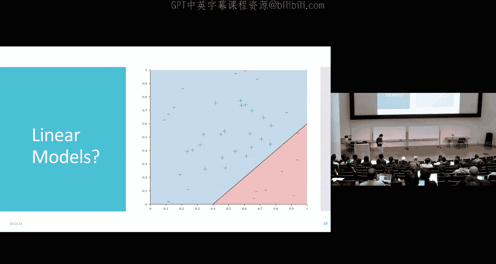
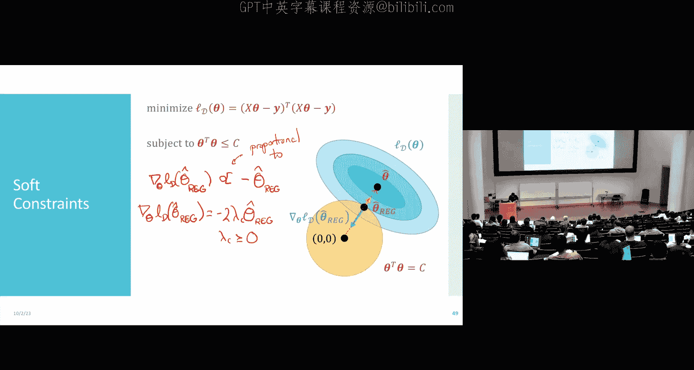
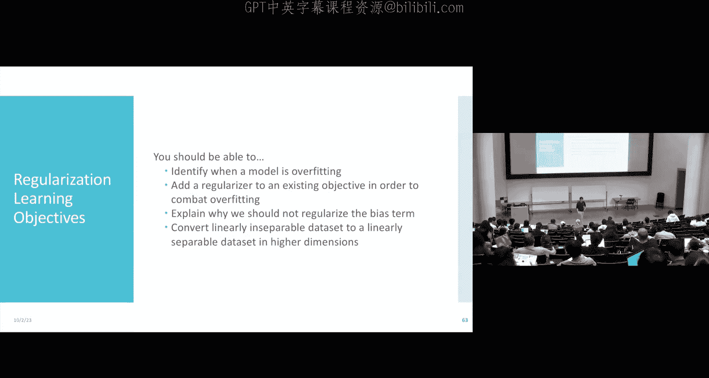

# 10：正则化

在本节课中，我们将完成逻辑回归的收尾工作，并深入探讨一个在机器学习中极其通用且强大的工具——正则化。我们将在线性回归和逻辑回归的背景下介绍它，但请记住，这个概念在后续学习神经网络等复杂模型时也会反复出现。

## 逻辑回归回顾与贝叶斯最优分类器

上一节我们介绍了逻辑回归模型及其训练方法。本节中，我们来看看逻辑回归的最终决策边界及其与贝叶斯最优分类器的关系。

逻辑回归使用S型函数（Sigmoid）作为预测模型，通过梯度下降法进行训练。最终的预测函数是一个关于特征的线性组合的S型函数。与感知机模型类似，逻辑回归也为我们提供了一个**线性决策边界**。

一个合理的问题是：这是我们能做到的最好结果吗？如果我们知道数据标签的真实生成分布 \( P^*(y|x) \)，能否做得更好？答案是肯定的，这引出了**贝叶斯最优分类器**的概念。

假设我们的标签来自一个二元分布 \( P^* \)，并且我们希望最小化0-1损失（即分类错误率）。那么，可以证明最优的分类器是：
\[
h^*(x) = \arg\max_{y \in \{0,1\}} P^*(y|x)
\]
换句话说，对于每个输入 \( x \)，我们预测概率更大的那个类别。这就是在理论上，1-近邻算法性能保证中提到的“最佳可能分类器”。

这里涉及两种误差概念：
*   **可减少误差**：如果你的分类器不知道 \( P^* \)，它可能会犯一些本可以避免的错误。
*   **不可减少误差**：即使知道了真实的 \( P^* \)，由于数据本身存在的不确定性（例如，在某个 \( x \) 处两个类别的概率接近0.5），任何分类器都不可避免地会犯一些错误。贝叶斯最优分类器最小化了这个不可减少误差。

需要注意的是，贝叶斯最优分类器是针对特定的损失函数（如0-1损失）定义的。如果改变损失函数（例如，假阳性的惩罚远大于假阴性），最优分类器的形式也会改变。

## 逻辑回归的训练：梯度下降变体

我们讨论了如何使用梯度下降法训练逻辑回归模型。以下是几种常见的梯度下降变体：

*   **（批量）梯度下降**：初始化所有权重参数，然后计算**整个训练集**的损失梯度，并沿负梯度方向更新参数。这种方法每一步都朝向正确的方向，但计算成本高。
*   **随机梯度下降**：每次迭代**随机选取一个数据点**，计算该点的梯度并更新参数。这种方法更新很快，但每一步的方向噪声很大，整体路径曲折。
*   **小批量梯度下降**：这是上述两种方法的折中。每次迭代**随机选取一小批数据**（例如10个或50个样本），计算这批数据的平均梯度并进行更新。它引入了**批量大小**这个超参数，是实践中非常常用的优化方法，尤其适用于非凸函数优化。

逻辑回归的梯度有一个直观的解释。对于单个数据点 \( (x_i, y_i) \)，梯度项包含 \( (\sigma(\theta^T x_i) - y_i) \)。这衡量了模型当前预测概率与真实标签之间的差异。差异越大，更新步长也越大。

## 从线性模型到特征变换

线性模型简单、高效且不易过拟合，适用于许多数据集。然而，并非所有数据都适合用线性模型拟合。

例如，考虑一个二维数据集，其决策边界明显是圆形的。如果我们坚持使用原始特征 \( x_1, x_2 \) 的线性模型，效果会很差。解决方法是进行**特征变换**。

我们可以手动构造新特征，例如 \( z_1 = (x_1 - 0.5)^2 \), \( z_2 = (x_2 - 0.5)^2 \)。在 \( (z_1, z_2) \) 构成的新特征空间中，数据变得线性可分。将新空间中的线性决策边界映射回原始空间，就得到了一个圆形决策边界。

但手动设计特征依赖于对数据的先验观察，容易导致过拟合。更系统的方法是使用**多项式特征变换**。例如，对于二维输入 \( [x_1, x_2] \)，二阶多项式变换会生成特征：\( x_1, x_2, x_1^2, x_1x_2, x_2^2 \)。这允许模型学习更复杂的决策边界（如椭圆、抛物线）。

然而，高阶多项式变换存在两个主要问题：
1.  **计算成本**：特征数量随原始特征维数 \( d \) 和多项式阶数 \( p \) 快速增长，组合爆炸。
2.  **过拟合风险**：使用过高阶数的多项式可以完美拟合训练数据（包括噪声），但会学到非常扭曲、震荡的决策边界，导致在未见数据上泛化性能极差。

## 正则化：约束模型复杂度

我们通过一个回归例子来具体看过拟合现象。假设真实目标函数是一个10阶多项式加噪声，但我们只有20个数据点。
*   如果用2阶多项式模型拟合，会得到一个平滑的抛物线，虽然不能完美拟合所有点，但抓住了主要趋势。
*   如果用10阶多项式模型拟合，它可以几乎完美穿过所有训练点，但在训练数据范围之外的区域，预测值会疯狂震荡，真实误差（相对于真实目标函数）非常大。

解决过拟合有两种基本思路：
1.  **获取更多数据**：更多高质量数据允许我们使用更复杂的模型而不易过拟合。这是首选但并非总是可行的方法。
2.  **正则化**：当数据有限时，我们在优化目标中添加**约束**，限制模型复杂度。

正则化的核心思想是：在最小化训练误差的同时，对模型参数（权重）的大小施加惩罚。一个极端的例子是，强制要求10阶多项式模型中3阶及以上的所有系数必须为0，这实际上就退化成了2阶模型。

更通用的方法是使用“软”约束。例如，**L2正则化**（又称岭回归）要求权重向量的L2范数平方小于某个阈值 \( C \)：
\[
\min_{\theta} \frac{1}{n} \sum_{i=1}^n (y_i - \theta^T x_i)^2 \quad \text{subject to} \quad \sum_{j=0}^d \theta_j^2 \leq C
\]
这直观地要求所有权重都较小，防止个别权重变得极大从而主导预测并导致震荡。

## 拉格朗日乘子法与岭回归解

我们可以使用**拉格朗日乘子法**将上述带约束的优化问题转化为无约束问题。最终等价于最小化以下**增广损失函数**：
\[
L_{aug}(\theta) = \sum_{i=1}^n (y_i - \theta^T x_i)^2 + \lambda_C \sum_{j=0}^d \theta_j^2
\]
其中 \( \lambda_C \geq 0 \) 是一个超参数，称为正则化强度。\( \lambda_C \) 越大，对权重大小的惩罚越重，模型就越倾向于选择更小的权重。

通过求解这个无约束优化问题（令梯度为零），我们可以得到**岭回归**的闭合解：
\[
\hat{\theta}_{ridge} = (X^T X + \lambda_C I)^{-1} X^T y
\]
与普通最小二乘解 \( (X^T X)^{-1} X^T y \) 相比，岭回归解在矩阵 \( X^T X \) 的对角线上加了 \( \lambda_C \)。这确保了矩阵总是可逆的（数值更稳定），并且直接产生了权重收缩的效果。

## 正则化的实践细节

在应用正则化时，有两点需要注意：

1.  **是否正则化偏置项？** 通常**不**对偏置项 \( \theta_0 \) 进行正则化。偏置项代表模型的整体偏移，不影响模型的“复杂度”或“弯曲程度”。正则化它可能会妨碍模型适应数据在y轴方向上的整体位置。

2.  **特征尺度的影响**：正则化对权重大小进行惩罚，因此**特征尺度至关重要**。如果一个特征的取值范围（例如收入，数值在数万）远大于另一个特征（例如年龄，数值在0-100），那么为了对预测产生同等影响，收入特征对应的权重自然需要更小。如果不对特征进行标准化，正则化会不公平地惩罚那些对应大尺度特征的权重。因此，一个常见的预处理步骤是**标准化**特征：对每个特征，减去其均值，然后除以其标准差。

## 正则化强度选择与其他正则化类型

正则化强度 \( \lambda_C \) 是一个关键超参数。如何设置它？
*   **λ 太小**：正则化效果弱，模型可能过拟合。
*   **λ 太大**：模型过于关注保持权重小，可能欠拟合（无法从数据中学到有效模式）。
*   **正确方法**：通过**验证集**来调整 \( \lambda \)。尝试一系列 \( \lambda \) 值，选择在验证集上性能最好的那个。

L2正则化（岭回归）只是其中一种选择。其他常见的正则化类型包括：
*   **L1正则化（Lasso）**：惩罚项是权重的绝对值之和 \( \sum |\theta_j| \)。L1正则化倾向于产生**稀疏解**，即它将一些权重**精确地设为0**，这可以用于特征选择。
*   **L0正则化**：惩罚项是非零权重的个数。这直接控制模型复杂度，但优化是NP难问题。

L1和L0正则化在几何上的约束区域是“菱形”或“尖角形”，最优解常出现在坐标轴上，对应某些权重为零。然而，由于绝对值函数不可微，求解L1或L0正则化问题通常需要使用次梯度方法等更复杂的优化技术。

## 总结

本节课中我们一起学习了：
1.  逻辑回归的决策边界是线性的，并回顾了理论上限——贝叶斯最优分类器。
2.  逻辑回归的训练可以使用批量梯度下降、随机梯度下降以及更常用的小批量梯度下降。
3.  为了拟合非线性数据，我们可以进行特征变换（如多项式变换），但这容易导致过拟合。
4.  **正则化**是防止过拟合的核心技术，它通过在损失函数中添加对权重的惩罚项来约束模型复杂度。
5.  我们重点介绍了**L2正则化（岭回归）**，推导了其闭合解，并讨论了拉格朗日乘子法的几何直观。
6.  实践中需要注意不对偏置项正则化，并且务必对特征进行标准化。
7.  正则化强度 \( \lambda \) 需要通过验证集进行调优，此外还有L1等其他类型的正则化可供选择，它们能产生稀疏模型。

正则化是一个基础而强大的概念，它将贯穿我们整个机器学习的学习过程。