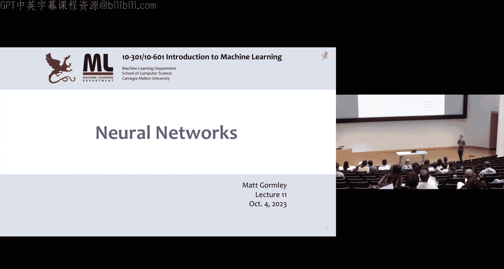
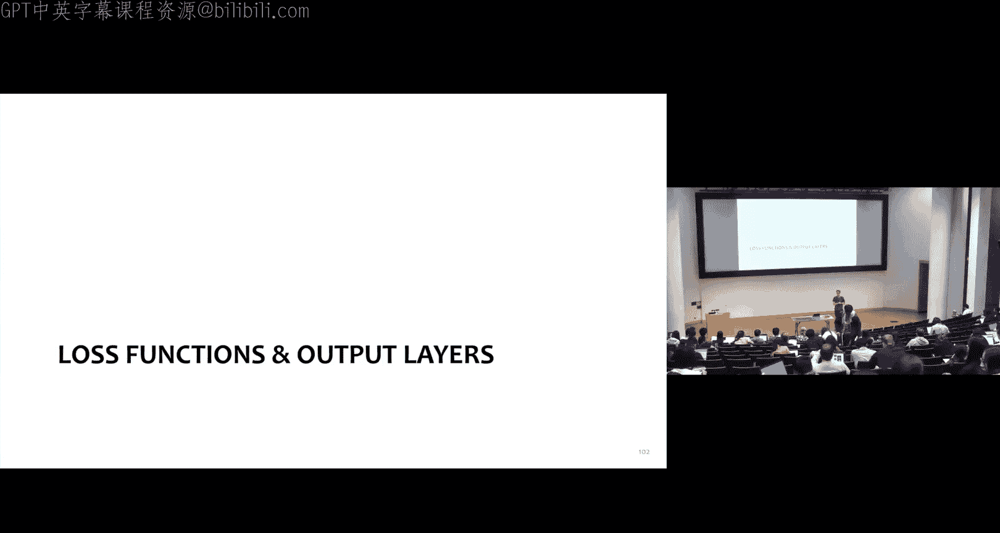

# 11：神经网络 🧠

在本节课中，我们将要学习一种新的决策边界和决策规则，它基于一种特殊的参数化函数——神经网络。我们将从线性回归和逻辑回归的经典框架出发，逐步构建并理解神经网络的结构、工作原理及其强大的表达能力。

## 从经典模型到神经网络

上一节我们介绍了机器学习的基本流程：给定训练数据对 `(X_i, Y_i)`，选择一个决策函数 `F_θ` 和一个损失函数 `L`，通过最小化经验风险并使用随机梯度下降等方法进行训练。本节中，我们来看看如何将线性回归和逻辑回归的框架扩展为神经网络。

首先，我们可以将线性回归模型绘制成一个简单的计算图。

*   **输入层**：特征 `x1, x2, ..., x_m`。
*   **计算过程**：每个特征乘以对应的权重 `θ_i`，然后求和。
*   **激活函数**：使用恒等函数 `σ(a) = a`。
*   **输出**：得到预测值 `y`。

如果我们把激活函数 `σ` 换成 `sigmoid` 函数，这个模型就变成了逻辑回归模型。其决策函数为 `y = sigmoid(θ^T x)`，输出 `y` 可以解释为正类（`y=1`）的概率。

## 神经网络的结构与计算

现在，让我们正式引入神经网络。下图展示了一个简单的神经网络。

假设我们已经训练好了网络（即权重已知），现在要对一个新的特征向量 `[13, 2, 7]` 进行预测。这个过程称为**前向传播**。

以下是计算步骤：
1.  计算第一个隐藏单元 `z1`：`z1 = sigmoid(13*0.1 + 2*0.3 + 7*(-0.2)) = sigmoid(0.5) ≈ 0.62`
2.  计算第二个隐藏单元 `z2`：`z2 = sigmoid(13*(-0.4) + 2*0.5 + 7*0.8) = sigmoid(1.4) ≈ 0.80`
3.  计算输出 `y`：`y = sigmoid(0.62*(-0.7) + 0.80*0.9) = sigmoid(0.29) ≈ 0.57`

可以看到，每个隐藏单元的计算都类似于一个独立的逻辑回归模型。与逻辑回归的关键区别在于，在训练时，我们只能观察到最终的输出 `y`，而隐藏单元 `z1, z2` 的值是网络内部学习得到的。

## 单隐藏层神经网络的数学描述

为了更精确地描述，我们定义一个具有两个输入特征 `x1, x2` 和一个隐藏层（两个单元）的神经网络。

*   **网络结构**：输入层 -> 隐藏层 -> 输出层。
*   **参数**：连接输入和隐藏层的权重 `α`，连接隐藏层和输出的权重 `β`，以及各层的偏置项。
*   **激活函数**：`σ`，通常为 `sigmoid` 函数：`σ(a) = 1 / (1 + exp(-a))`。

以下是具体的计算公式：

1.  **计算隐藏层**：
    *   `z1 = σ(α10 + α11*x1 + α12*x2)`
    *   `z2 = σ(α20 + α21*x1 + α22*x2)`
2.  **计算输出层**：
    *   `y = σ(β0 + β1*z1 + β2*z2)`

最终的分类预测 `ŷ` 可以通过对输出概率 `y` 设置阈值（例如 0.5）得到：`ŷ = 1 if y >= 0.5 else 0`。

## 神经网络的表达能力：从一维到二维

神经网络的核心优势在于其能够学习复杂的非线性决策边界。让我们通过一个简化的“人脸识别”例子来理解这一点。

首先考虑一维情况（单个像素亮度 `x1`）。数据分布是：中间区域是正类（人脸），两侧是负类（非人脸）。单个逻辑回归模型只能产生一个S形曲线，无法很好地拟合这种“中间是正类”的模式。

解决方案是组合多个逻辑回归单元：
1.  训练第一个逻辑回归模型 `HA(x)`，使其对左侧负类和中心正类敏感。
2.  训练第二个逻辑回归模型 `HB(x)`，使其对右侧负类和中心正类敏感。
3.  将这两个模型的输出进行线性组合，并再次通过 `sigmoid` 函数：`HC(x) = σ(2*HA(x) + 2*HB(x) - 3)`。

通过精心选择权重，`HC(x)` 可以在中心区域输出高概率（接近1），在两侧输出低概率（接近0），从而成功刻画出一个“区间”形式的非线性决策边界。这本质上就是一个单隐藏层神经网络。

将这个思想扩展到二维特征空间（两个像素），我们可以用四个逻辑回归单元（对应四个方向）的组合来构造一个更复杂的函数，例如形成一个圆形的决策边界，将中心的点与周围的点分开。

## 网络架构的设计选择

构建神经网络时，我们需要做出一系列设计决策：

*   **宽度（隐藏单元数 D）**：相对于输入特征数 M。
    *   `D = M`：网络可以学习直接复制特征，或进行非线性组合。
    *   `D < M`：网络可能学习最具信息量的特征或进行降维。
    *   `D > M`：网络可以进行更复杂的特征工程，创造新的特征组合。
*   **深度（隐藏层数）**：
    *   **理论**：单隐藏层神经网络是**通用函数逼近器**，只要隐藏单元足够多，它可以以任意精度逼近任何连续函数。
    *   **实践**：深度网络（多个隐藏层）通常更容易训练且在复杂任务上表现更好，因为它能自动学习从低级到高级的层次化特征抽象。
*   **激活函数**：`σ` 的选择至关重要。
    *   `Sigmoid`：早期常用，但训练时梯度容易消失，导致学习缓慢。
    *   `Tanh`：输出范围 (-1, 1)，通常比 `sigmoid` 表现更好。
    *   `ReLU`：`max(0, x)`，当前最流行的选择，能有效缓解梯度消失问题。
    *   `ELU`：`ReLU` 的平滑变体，在某些情况下表现更优。

实验表明，使用 `Tanh` 或 `ReLU/ELU` 的深度网络，其训练误差下降速度和最终性能通常远优于使用 `Sigmoid` 的网络。

## 神经网络的特性与挑战

最后，我们通过一个思考题来理解神经网络的一个重要特性。

**问题**：对于一个使用 `sigmoid` 激活函数的单隐藏层神经网络，是否存在**唯一**的一组参数可以最大化给定数据集的似然？

**答案**：**错误**。神经网络通常存在对称性。例如，在一个两隐藏单元的网络中，交换第一个和第二个隐藏单元对应的所有权重（`α1` <-> `α2`, `β1` <-> `β2`），得到的模型输出完全相同，因此似然值也相同。这意味着损失函数是**非凸**的，存在多个（甚至无数个）不同的参数组能达到相同的（可能是最优的）性能，同时也意味着优化过程中可能会陷入不同的局部最优解。

---

本节课中我们一起学习了神经网络的基本概念。我们从线性模型出发，引入了隐藏层和非线性激活函数，构建了神经网络。我们通过直观的例子展示了神经网络如何通过组合简单的函数（如逻辑回归单元）来形成复杂的非线性决策边界。我们还探讨了网络宽度、深度以及激活函数等关键设计选择，并指出了神经网络损失函数的非凸性。下一节课，我们将学习如何训练神经网络，即如何通过反向传播算法来计算梯度并优化这些复杂的参数。