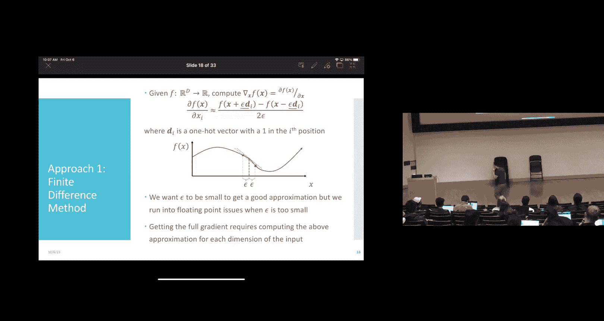
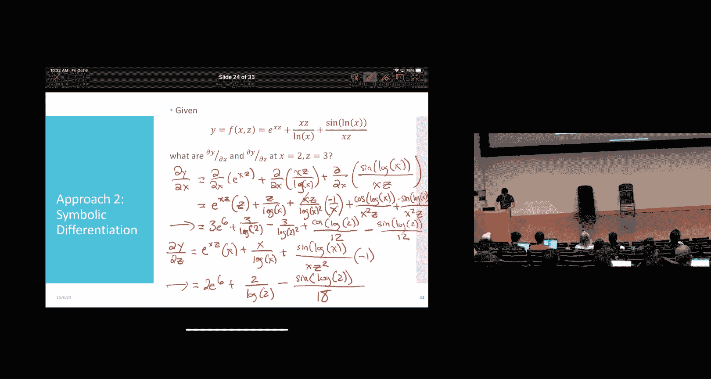

# 12：反向传播 I

在本节课中，我们将学习如何训练神经网络。我们将从回顾前向传播开始，然后探讨如何为不同任务（如回归和分类）选择合适的损失函数。最后，我们将深入探讨计算神经网络梯度的核心方法——反向传播，并介绍自动微分的概念。

## 回顾：前向传播

上一节我们介绍了神经网络模型。本节中，我们来看看如何使用训练好的模型进行预测，这个过程称为前向传播。

为了简化表示，我们将偏置项 `b` 合并到权重矩阵 `α` 中，方法是在输入向量前添加一个值为1的元素。这样，模型可以写为：
```
z^(l) = σ(α^(l) * z^(l-1))
```
其中 `σ` 是激活函数（如Sigmoid），`z^(0)` 是输入特征向量 `x'`。

前向传播算法步骤如下：
1.  初始化第0层的输出为输入特征向量：`z^(0) = x'`。
2.  对于每一层 `l` 从1到 `L`（`L` 是隐藏层数）：
    *   计算线性组合：`a^(l) = α^(l) * z^(l-1)`。
    *   应用激活函数：`z^(l) = σ(a^(l))`。
3.  计算最终输出：`ŷ = β * z^(L)`。

这里的 `β` 是连接最后一个隐藏层到输出层的权重矩阵。这个过程就是“前向”传播，因为我们从输入层开始，逐层向前计算，直到得到输出。

## 训练神经网络：随机梯度下降

我们已经知道如何用训练好的网络做预测。但如何训练它呢？答案是我们将使用随机梯度下降法。

训练过程的高级框架如下：
1.  初始化所有权重（`α` 和 `β`）。
2.  循环直到满足终止条件（如达到最大迭代次数）：
    *   打乱训练数据集。
    *   对于数据集中的每个样本 `(x_i, y_i)`：
        *   计算损失函数关于所有权重（`α` 和 `β`）的梯度。
        *   沿梯度反方向更新权重：`权重 = 权重 - γ * 梯度`，其中 `γ` 是学习率。

这个框架引出了两个关键问题：**使用什么损失函数？** 以及 **如何计算这些复杂的梯度？** 本节课我们将重点回答第一个问题，并在下一节深入探讨第二个问题。

## 神经网络的损失函数

选择损失函数取决于任务类型。为了简化表示，我们用 `Θ` 表示神经网络的所有参数（即所有的 `α` 和 `β`）。

### 回归任务

对于回归任务，我们可以使用熟悉的平方误差损失。对于单个数据点 `(x_i, y_i)`，损失为：
```
L(Θ; x_i, y_i) = (ŷ_Θ(x_i) - y_i)^2
```
其中 `ŷ_Θ(x_i)` 是神经网络对输入 `x_i` 的预测值。

### 二分类任务

对于二分类任务（标签为0或1），我们使用交叉熵损失，它本质上就是逻辑回归中使用的负对数似然。

我们假设神经网络的输出通过Sigmoid函数，表示样本为正类（`y=1`）的概率 `ŷ_Θ(x_i)`。那么，样本 `(x_i, y_i)` 的损失函数为：
```
L(Θ; x_i, y_i) = -[ y_i * log(ŷ_Θ(x_i)) + (1 - y_i) * log(1 - ŷ_Θ(x_i)) ]
```
这个公式很巧妙：当 `y_i = 1` 时，第二项为0，我们最大化 `log(ŷ)`；当 `y_i = 0` 时，第一项为0，我们最大化 `log(1 - ŷ)`。这确保了我们在最大化真实标签对应的预测概率。

### 多分类任务

神经网络可以很自然地扩展到多分类（`C` 个类别）。我们使用独热编码表示标签 `y_i`（一个长度为 `C` 的向量，真实类别位置为1，其余为0）。同时，我们希望网络输出一个长度为 `C` 的向量，每个元素代表对应类别的预测概率。




为了实现这一点，我们通常在输出层使用 **Softmax** 函数。对于最后一个隐藏层的输出 `z^(L)`，最终输出为：
```
ŷ_Θ(x_i) = softmax(β * z^(L))
```
其中Softmax函数的第 `c` 个元素为：
```
softmax(a)_c = exp(a_c) / (∑_{j=1}^{C} exp(a_j))
```
这保证了所有输出值都是正数且和为1，符合概率分布的要求。

对应的损失函数是负对数似然，形式与二分类类似：
```
L(Θ; x_i, y_i) = -∑_{c=1}^{C} y_{i,c} * log(ŷ_{Θ,c}(x_i))
```
由于 `y_i` 是独热编码，实际上只有真实类别 `c` 对应的那一项 `log(ŷ_{Θ,c}(x_i))` 会被保留下来，我们的目标就是最大化这个值。

## 计算梯度：挑战与方法


确定了损失函数后，下一个核心挑战是计算损失函数关于所有权重矩阵 `Θ` 的梯度 `∇L(Θ)`。这对于执行梯度下降至关重要。

我们需要一个处理矩阵导数的约定（分母布局）：标量对向量的导数是同维向量；标量对矩阵的导数是同维矩阵。

计算梯度主要有三种方法：

### 1. 有限差分法

这是最直观的方法，利用导数的定义进行近似。对于参数 `θ_j`，其梯度近似为：
```
∂L/∂θ_j ≈ (L(θ + ε * e_j) - L(θ - ε * e_j)) / (2ε)
```
其中 `e_j` 是第 `j` 个基向量，`ε` 是一个很小的数（如 `1e-10`）。

**优点**：实现极其简单，无需知道导数公式，只需能计算函数值 `L`。
**缺点**：
*   计算代价高，每个参数都需要两次前向传播。
*   是近似值，且选择太小的 `ε` 会导致数值计算问题。
*   主要用于梯度检查，验证更复杂方法的正确性。

### 2. 符号微分

这就是我们手动求导的过程：应用链式法则和已知的导数公式，得到一个导数的解析表达式。




**缺点**：
*   过程繁琐，容易出错。
*   计算效率低，可能导致大量重复计算相同的中间结果（例如 `e^6` 或 `log(2)` 在表达式中多次出现）。

### 3. 自动微分（反向模式）

这是训练神经网络的实际使用的方法，它结合了数值计算和符号微分的优点。核心思想是利用**计算图**。

计算图将函数计算分解为一系列基本的原子操作（如加法、乘法、`exp`、`log` 等）。每个中间结果是一个节点。

自动微分包含两个步骤：
1.  **前向传播**：沿着计算图计算函数值，并存储所有中间结果（如 `a = x*z`, `b = log(x)` 等）。
2.  **反向传播**：从输出节点开始，逆向遍历计算图，利用链式法则计算损失函数对所有中间变量乃至输入参数的梯度。

关键优势在于**复用**：
*   在反向传播时，计算上游节点梯度 `∂L/∂a` 时，需要用到下游节点已计算好的梯度 `∂L/∂b` 以及前向传播中存储的中间值 `a`, `b` 等。
*   每个节点只需计算一次局部导数，整个梯度计算复杂度与前向传播一次的成本成正比，非常高效。

由于神经网络通常是高维输入、低维输出（如一个预测值），我们主要使用**反向模式自动微分**。它非常适合计算标量损失对大量输入参数的梯度。

还有一种**前向模式自动微分**，它适合计算高维输出对少量输入参数的梯度，但在神经网络训练中不常用。

## 总结

本节课中我们一起学习了：
1.  **前向传播**：如何使用训练好的神经网络进行预测。
2.  **损失函数**：如何为回归（平方误差）、二分类（交叉熵/负对数似然）和多分类（带Softmax的交叉熵）任务选择合适的损失函数。
3.  **梯度计算挑战**：认识到直接计算神经网络梯度是复杂的。
4.  **梯度计算方法**：介绍了有限差分法（简单但低效，用于检查）、符号微分（手动推导，繁琐）和自动微分（实际使用的方法）。
5.  **自动微分核心**：重点介绍了反向模式自动微分，它通过构建计算图，先执行前向传播存储中间值，再执行反向传播应用链式法则，高效且精确地计算所有梯度。


下一节课，我们将把自动微分的原理具体应用到神经网络中，推导出著名的**反向传播算法**，并讨论训练中的其他实际问题，如权重初始化和停止准则。