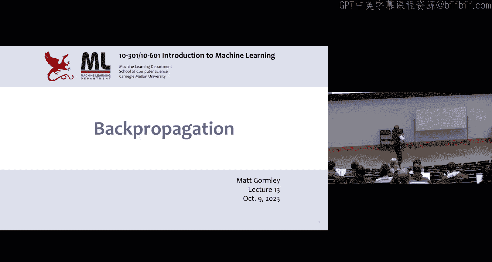
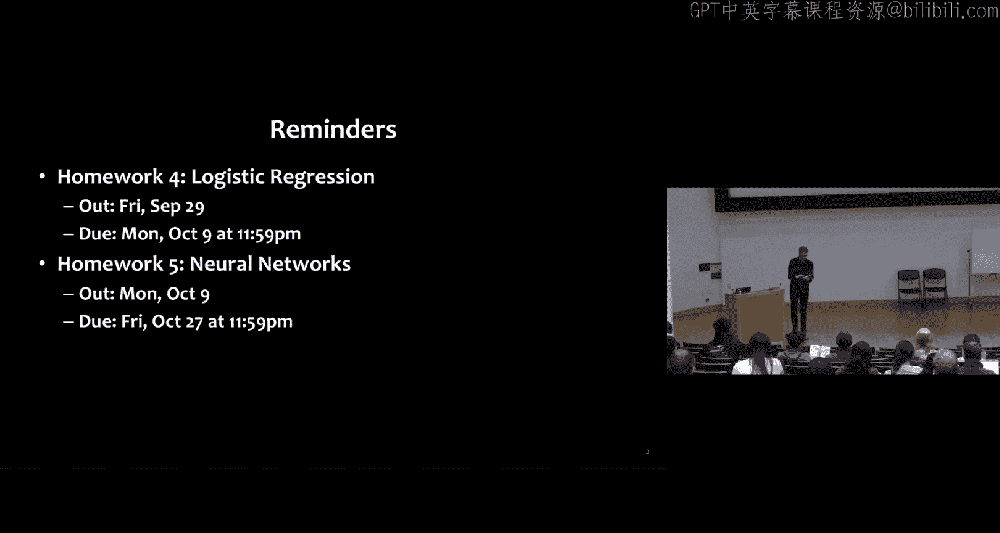
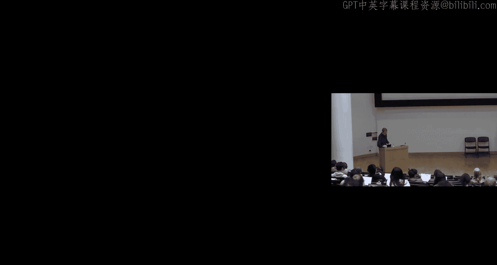
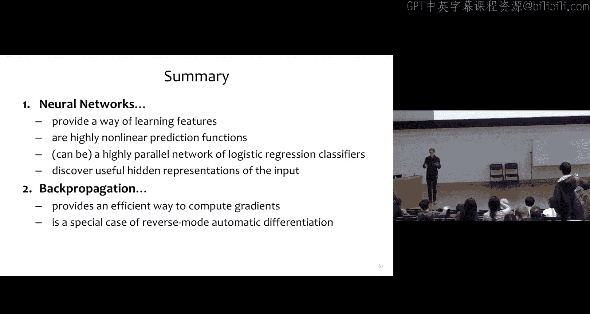

# 13：反向传播 II

在本节课中，我们将深入学习反向传播算法，通过具体的计算图示例，理解如何高效计算可微函数的梯度。我们将从简单的逻辑回归模型开始，逐步过渡到单隐藏层和双隐藏层神经网络，并探讨算法背后的核心思想与实现细节。

## 概述

上一节我们介绍了反向传播的基本概念。本节中，我们将通过更多实例，深入理解该算法如何通过重用前向传播的计算结果和存储中间梯度，将梯度计算的时间复杂度从指数级降低到多项式级。我们还将探讨矩阵微积分在简化神经网络梯度计算中的应用。

## 反向传播回顾

首先，我们回顾反向传播的核心机制。对于一个我们想要求导的变量 `X` 和输出变量 `Y`，我们想计算 `dY/dX` 并存储在 `gX` 中。根据链式法则，我们可以对所有的中间变量 `U1, U2, ..., UK` 求和：`dY/dX = Σ (dY/dUk * dUk/dX)`。

反向传播的技巧在于，我们不会每次都重新计算 `dY/dUk`，而是将其值存储在变量 `gUk` 中。当我们需要时，可以直接使用这个已存储的值。这种重用是算法高效的关键。

这种重用不仅发生在反向传播中，也发生在前向传播中。例如，一个变量 `A` 可能被用于计算多个后续变量。通过存储 `A` 的值，我们避免了重复计算，这是在空间复杂度（存储变量）和时间复杂度（避免重复计算）之间的权衡。由此带来的优势是将计算复杂度从指数时间降低到了多项式时间。

## 二元逻辑回归的反向传播

现在，我们来看一个熟悉的模型：二元逻辑回归。我们可以将其典型计算分解为几个中间变量。

以下是计算步骤：
1.  计算 `a = θ^T * x`（点积）。
2.  计算 `y = σ(a)`，其中 `σ` 是 sigmoid 函数。
3.  计算交叉熵损失 `J = -[y* log(y_hat) + (1-y*) log(1-y_hat)]`，其中 `y*` 是真实标签。

引入这些中间变量决定了反向传播算法的具体结构。现在，我们可以反向计算梯度。

反向传播步骤如下：
1.  首先计算 `gJ = dJ/dJ = 1`。
2.  接着计算 `gY = dJ/dY`，即交叉熵损失对 `Y` 的导数。
3.  然后计算 `gA = gY * dY/dA`。其中 `dY/dA` 是 sigmoid 函数的导数。
4.  最后，对于参数 `θ_j` 和输入 `x_j`，分别计算：
    *   `gθ_j = gA * x_j`
    *   `gx_j = gA * θ_j`

通过存储前向传播中计算的 `A`，我们可以在反向传播中重复使用它。

## 单隐藏层神经网络

接下来，我们考虑一个单隐藏层神经网络。其结构可以分解为相同的层，例如线性层和 sigmoid 激活函数层，这允许我们在实现中重用代码。

随机梯度下降算法步骤如下：
1.  初始化参数 `α` 和 `β`。
2.  对于每个训练周期（epoch）：
    *   遍历训练数据（通常是打乱顺序的）。
    *   通过前向传播计算给定输入和参数下的所有层，直到损失函数。返回所有中间值 `X, A, B, Z, Y, J`。
    *   通过反向传播，传入前向传播计算的所有变量，计算梯度 `gα` 和 `gβ`。
    *   更新参数：`α = α - γ * gα`，`β = β - γ * gβ`。
    *   在周期末，评估训练集和验证集上的平均交叉熵损失。

对于单隐藏层神经网络的反向传播，其最后一层与二元逻辑回归非常相似，都涉及 sigmoid 函数和交叉熵损失。梯度计算中同样存在变量的重用，例如 `dJ/dB` 被多次使用，存储它避免了重复计算。

关于 sigmoid 函数导数的一个实用简化是：`dσ/db = σ(b) * (1 - σ(b))`。这比原始形式 `(e^{-b})/(e^{-b}+1)^2` 计算起来更简洁。这也解释了为什么深度 sigmoid 网络会遇到梯度消失问题：因为 `σ(b)` 是一个介于 0 和 1 之间的小数，多层连乘会导致梯度变得极其微小。

## 双隐藏层神经网络的训练

现在，我们探讨如何训练一个双隐藏层神经网络。其参数 `θ` 是一个列表，包含矩阵 `α1`、`α2` 和向量 `β`。

训练采用随机梯度下降，大框架如下：
1.  从训练集 `D` 中均匀采样一个样本索引 `i`。
2.  通过反向传播计算梯度 `gα1`、`gα2`、`gβ`。这些分别是损失函数 `J_i(θ)` 对 `α1`、`α2`、`β` 的梯度。注意，梯度 `gα1` 的形状与矩阵 `α1` 相同。
3.  更新参数：
    *   `α1 = α1 - γ * gα1`
    *   `α2 = α2 - γ * gα2`
    *   `β = β - γ * gβ`

对于双隐藏层网络，其前向计算可以概括为：
1.  将输入 `x` 重命名为 `z0`。
2.  对于 `i = 1, 2, 3`（对应两个隐藏层和一个输出层）：
    *   计算 `u_i = α_i^T * z_{i-1}`
    *   计算 `z_i = σ(u_i)` （逐元素应用 sigmoid）
3.  将 `z3` 重命名为预测值 `y_hat`。
4.  使用 `y_hat` 和真实值 `y*` 计算损失 `J`。

对应的计算图从底部的输入 `x` 和参数开始，向上依次计算 `u1`、`z1`、`u2`、`z2`、`u3`、`z3 (y_hat)`，最后计算损失 `J`。

反向传播则从顶部开始向下进行：
1.  计算 `gJ = 1`。
2.  计算 `gY_hat = dJ/dY_hat`。
3.  以逆序循环 `i = 3, 2, 1`：
    *   计算 `gU_i`
    *   计算 `gZ_{i-1}`
    *   计算 `gα_i`
4.  最终得到 `gX`（即 `gZ0`）。

具体的计算步骤涉及矩阵微积分，这是实现高效反向传播的关键。

## 反向传播算法：两种视角

我们已经看到了反向传播的一种表述（版本A）。这里介绍另一种优雅且在实践中更常用的表述（版本B）。

在版本B中：
1.  将所有节点的梯度 `g` 初始化为 0，除了输出 `Y` 的梯度 `gY` 初始化为 1。
2.  按逆拓扑顺序访问每个节点 `U_i`。
3.  当访问到 `U_i` 时，我们已经知道 `dY/dU_i`（即 `gU_i`）。
4.  然后，我们遍历 `U_i` 的所有子节点 `V_j`，并将 `gV_j` 增加 `gU_i * dU_i/dV_j`。

这样，当算法访问到某个子节点 `V_j` 时，来自其所有父节点的梯度贡献已经累加完毕，`gV_j` 中存储的就是正确的梯度 `dY/dV_j`。这种方法在实现深度学习库时非常高效。

## 矩阵微积分简介

为了更简洁地进行神经网络（尤其是涉及矩阵运算时）的梯度计算，学习一些矩阵微积分知识非常有益。以下是一些有用的恒等式（采用分母布局）：
*   `d(b^T x)/dx = b`， `d(x^T b)/dx = b`
*   `d(x^T B)/dx = B` （`B` 是矩阵）
*   `d(x^T x)/dx = 2x`
*   `d(x^T Q x)/dx = 2Qx` （`Q` 是对称矩阵）

向量链式法则为：若 `y = g(u)`， `u = h(x)`，则 `dy/dx = (du/dx)^T * (dy/du)`。掌握这些规则可以大大简化梯度推导。

## 计算图与神经网络图的区别

最后，明确计算图与神经网络图的绘制约定对理解问题和应对考试非常重要：

**神经网络图**：
*   节点是圆圈，每个隐藏单元一个节点。
*   节点用对应的隐藏变量标注。
*   边是有向的，并用权重标注。
*   通常不显示截距项和参数。
*   很少绘制损失函数。

**计算图**：
*   节点是矩形，每个中间变量一个节点。
*   节点用其计算的函数标注。
*   边没有标签。
*   截距项、每个参数以及常数通常都显式显示为节点。
*   经常包含损失函数节点。

## 总结

本节课中，我们一起深入学习了反向传播算法。我们通过二元逻辑回归、单隐藏层和双隐藏层神经网络的例子，详细剖析了如何通过前向传播存储中间结果，并在反向传播中重用梯度，从而实现多项式时间复杂度的梯度计算。我们还探讨了算法的两种实现视角，并简要介绍了矩阵微积分在简化计算中的重要作用。理解计算图与神经网络图的区别，有助于我们更清晰地表达和实现复杂的机器学习模型。