# 14：PAC学习理论 🧠

在本节课中，我们将学习一个重要的理论框架——PAC学习理论。这个框架旨在解释为什么我们训练的机器学习模型能够在未见过的数据上表现良好。我们将从理解“偏差”一词的多重含义开始，然后通过一个具体的例子引出核心问题：如何根据训练误差来推断真实误差？最后，我们将深入探讨PAC学习的基本定义、核心定理及其证明。

---

## 偏差的含义 🤔

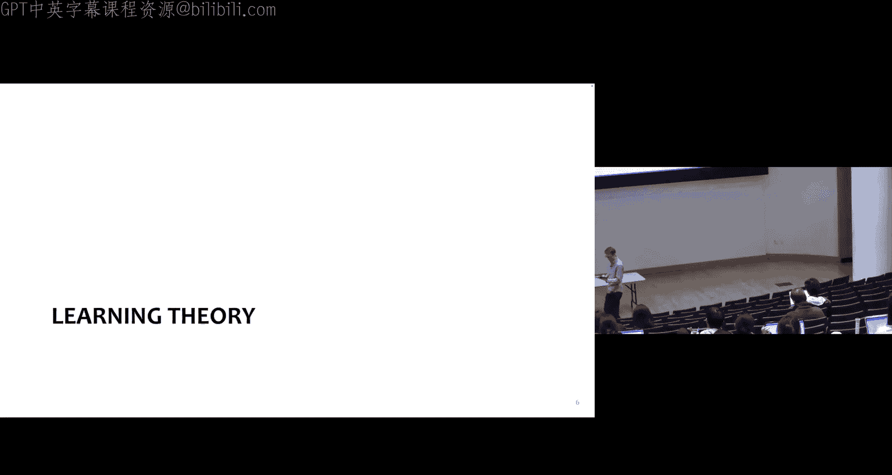

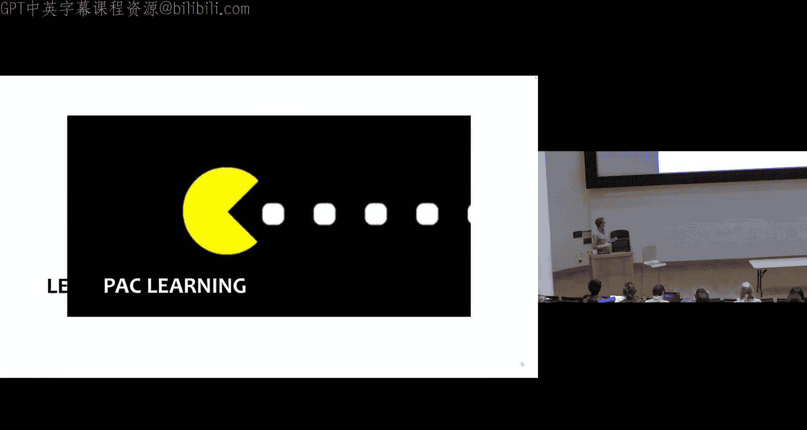

在机器学习中，“偏差”一词有多种含义，容易造成混淆。以下是四种常见的定义：

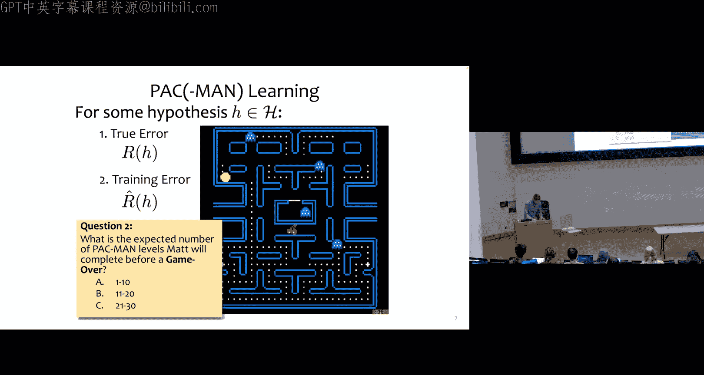

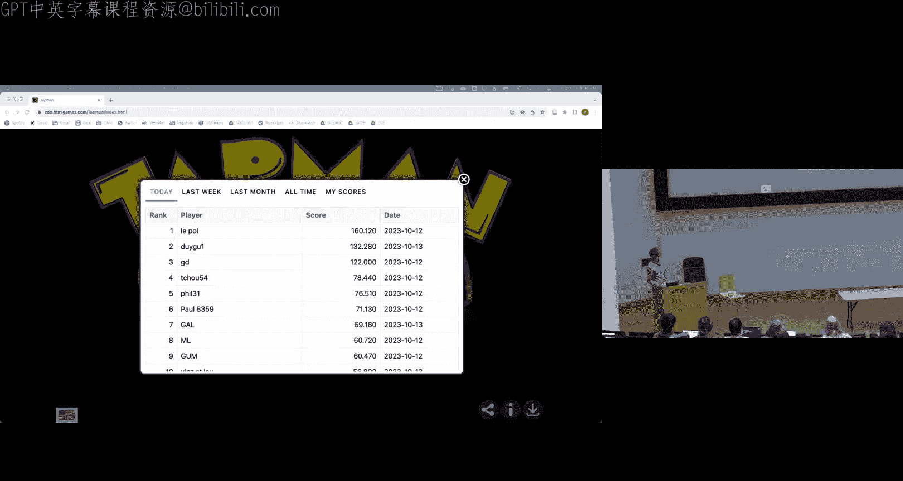

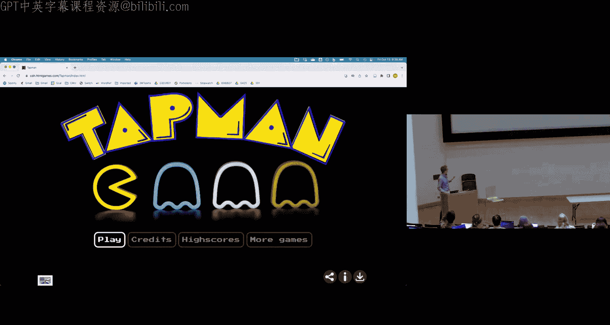

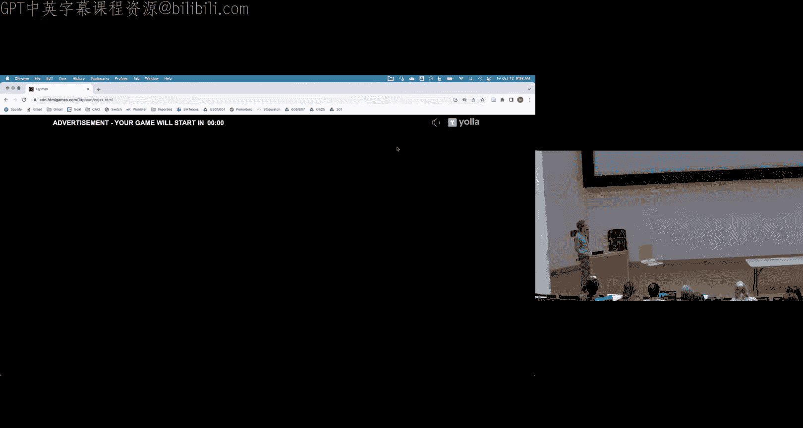

1.  **线性模型中的加性项**：在线性模型 `y = w^T x + b` 中，`b` 常被称为“偏差项”或“截距项”。
2.  **归纳偏差**：这是一个技术术语，指学习算法从训练数据推广到未见示例时所依据的原则。
3.  **模型的社会性偏差**：指模型预测中可能存在的种族、社会经济或性别偏见。
4.  **偏差-方差权衡中的偏差**：在统计学中，指模型预测的期望值与真实值之间的差异。

因此，当听到“偏差”时，需要明确其具体语境。

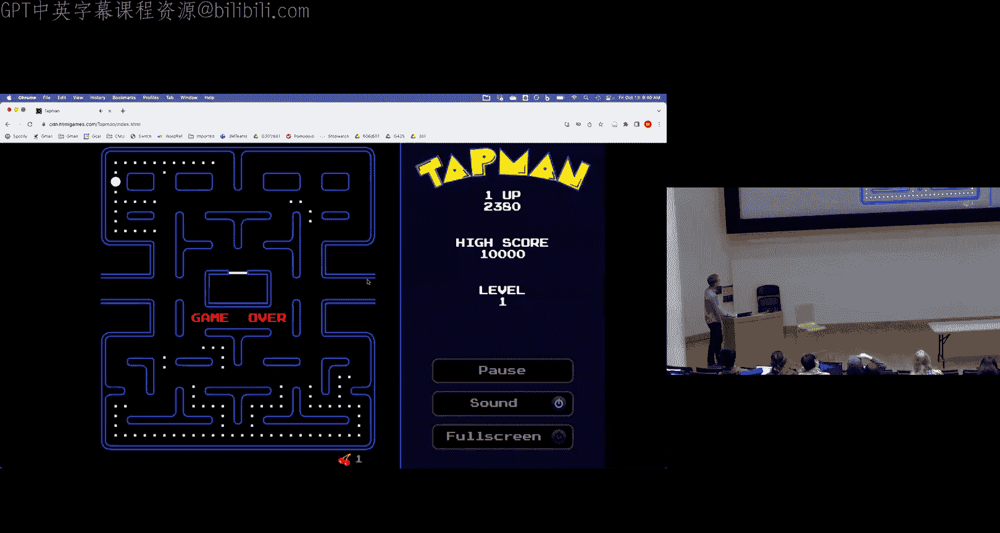

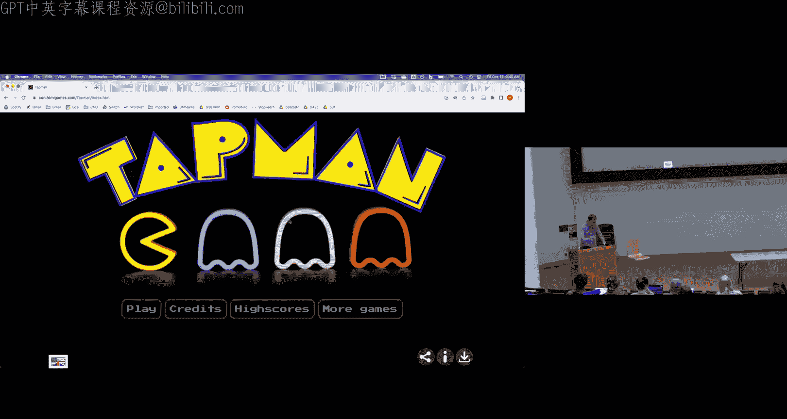

---

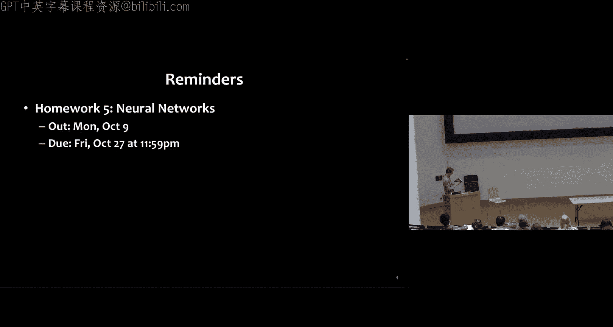

## 从例子出发：PAC-Man游戏 🎮

为了理解理论，我们从一个例子开始。假设你想评估我在PAC-Man游戏中的水平，具体问题是：**在游戏结束前，我平均能通过多少关？**

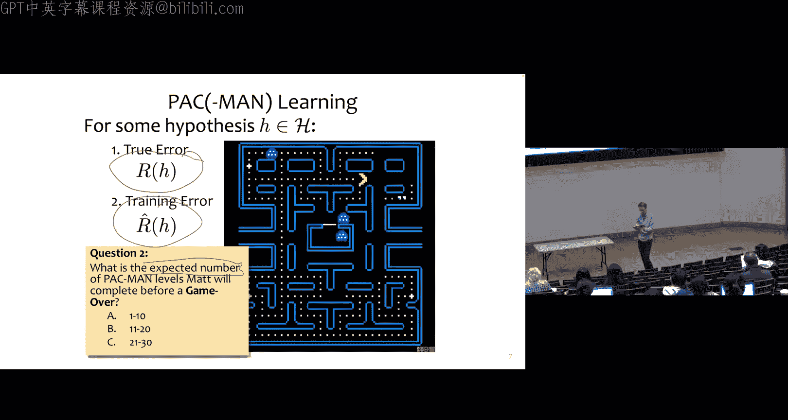

你没有任何数据。现在，我给你看一段我玩游戏的实况（训练数据），我玩了几次，但很快就结束了。基于这段有限的、表现不佳的训练数据，你可能会低估我的真实水平。

这个例子揭示了机器学习的核心问题：我们观察到的**训练误差**（在有限样本上的表现）与关心的**真实误差**（在全体数据分布上的期望表现）之间存在差距。我们能否用前者来推断后者？

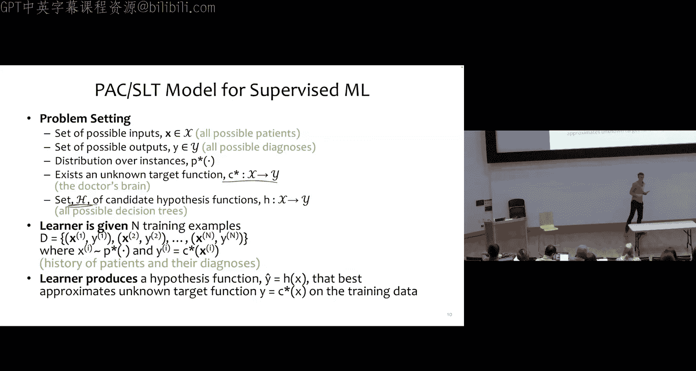

---

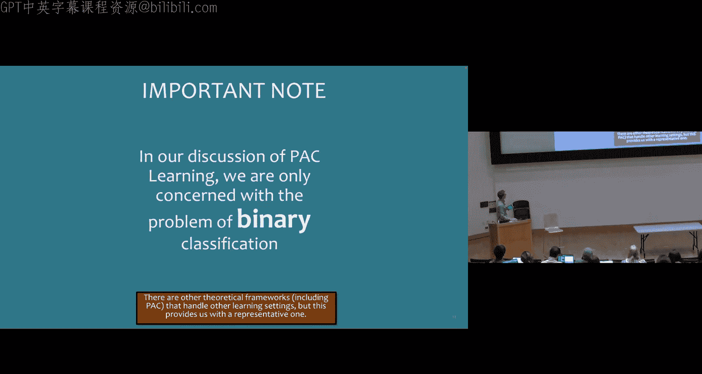

## PAC学习模型 🏗️

PAC学习提供了一个理论模型来回答上述问题。该模型基于以下监督学习设定：

*   存在一个未知的分布 `P*` 用于生成特征 `x`。
*   存在一个未知的目标函数 `C*` 为 `x` 生成标签 `y`。
*   学习算法接收从 `(P*, C*)` 中独立同分布采样得到的训练样例 `(x, y)`。
*   算法从假设空间 `H` 中选择一个假设函数 `h`，目标是使 `h` 尽可能近似 `C*`。

在本课程中，我们主要关注二分类问题。

---

## 两种误差的定义 📊

我们需要明确区分两种误差：

1.  **训练误差**：假设 `h` 在训练集 `S` 上的错误率。可以形式化地定义为从训练集均匀采样时犯错的概率：
    `R_hat(h) = Pr_(x ~ Uniform(S)) [C*(x) != h(x)]`
    我们可以计算训练误差。

2.  **真实误差**：假设 `h` 在整个数据分布 `P*` 上的期望错误率：
    `R(h) = Pr_(x ~ P*) [C*(x) != h(x)]`
    真实误差始终是未知的。

PAC学习的目标，就是找到**真实误差**的边界，并用**训练误差**和样本数量等已知量来描述它。

---

## PAC准则与样本复杂度 🎯

PAC代表“可能近似正确”。其核心思想是：我们希望学习算法以高概率返回一个近似正确的假设。

更形式化地说，PAC准则关注以下概率：
`Pr[ ∀h ∈ H, |R(h) - R_hat(h)| ≤ ε ] ≥ 1 - δ`
其中：
*   `ε` 是近似参数（误差界限）。
*   `δ` 是概率参数（失败概率）。

这里的随机性来源于训练集 `S` 的随机采样。`R_hat(h)` 因此是一个随机变量。

基于此，我们定义**样本复杂度**：为满足特定的 `(ε, δ)` PAC准则，所需的最少训练样本数 `N`。

---

## 核心定理：有限假设空间的情形 📚

我们首先考虑假设空间 `H` 大小有限的情况。这又分为两种子情况：

*   **可实现的**：假设真实目标函数 `C* ∈ H`。
*   **不可知的**：不假设 `C* ∈ H`（即 `C*` 可能不在 `H` 中）。

我们先看**可实现情况**下的一个关键定理（定理1）。

### 定理1：可实现情况的误差界

如果训练样本数 `N` 满足：
`N ≥ (1/ε) * [ ln(|H|) + ln(1/δ) ]`
那么，以至少 `1-δ` 的概率，对于假设空间 `H` 中所有**训练误差为零**的假设 `h`，其真实误差满足 `R(h) ≤ ε`。

**定理解读**：这个定理告诉我们，如果我们想确保一个在训练集上表现完美（零误差）的分类器，其真实误差大于 `ε` 的概率小于 `δ`，那么我们需要多少训练样本。所需样本数 `N` 与 `ln(|H|)` 成正比，与 `ε` 成反比。

**示例应用**：假设假设空间 `H` 是长度为10的二进制特征向量的合取式集合。计算可知 `|H| = 3^10`。取 `ε=0.1`, `δ=0.01`，代入定理公式，计算得到 `N ≥ 156`。这意味着，如果有156个标注样本，并且学习到了一个零训练误差的合取式，那么我们有99%的把握说它的真实误差不超过10%。值得注意的是，尽管假设空间大小 `|H|` 是特征数 `M` 的指数级（`3^M`），但所需样本数 `N` 只是 `M` 的线性级，这体现了该定理的实用价值。

---

### 定理1的证明思路 🔍

证明使用了概率论中的**联合界**和**反证法**（逆否命题）思想。

1.  **定义“坏”假设**：首先，假设存在 `K` 个“坏”假设，其真实误差 `R(h) > ε`。
2.  **计算“坏”假设迷惑人的概率**：对于一个固定的坏假设 `h`，它在单个随机样本上不犯错的概率 `≤ (1-ε)`。因此，在 `N` 个独立样本上全部不犯错（即训练误差为零）的概率 `≤ (1-ε)^N`。
3.  **应用联合界**：至少存在一个坏假设取得零训练误差的概率，不超过所有坏假设取得零训练误差的概率之和，即 `≤ K * (1-ε)^N`。由于 `K ≤ |H|`，该概率也 `≤ |H| * (1-ε)^N`。
4.  **建立不等式**：我们希望这个“被坏假设迷惑”的概率小于 `δ`。因此，我们要求 `|H| * (1-ε)^N ≤ δ`。
5.  **求解样本数 `N`**：利用不等式 `(1-ε) ≤ e^(-ε)`，可得 `|H| * e^(-εN) ≤ δ`。解这个关于 `N` 的不等式，最终得到 `N ≥ (1/ε)[ln(|H|) + ln(1/δ)]`。
6.  **解释结果**：如果 `N` 满足上述条件，那么“存在坏假设且其训练误差为零”这一事件的概率 `≤ δ`。其逆否命题是：以 `≥ 1-δ` 的概率，**所有**训练误差为零的假设，其真实误差 `≤ ε`。这正是定理1的结论。

---

### 定理2：不可知情况的误差界

对于更一般的**不可知情况**，我们有另一个定理（定理2，此处不展开证明）：

如果训练样本数 `N` 满足：
`N ≥ (1/(2ε^2)) * [ ln(|H|) + ln(2/δ) ]`
那么，以至少 `1-δ` 的概率，对于假设空间 `H` 中的**所有**假设 `h`（无论训练误差如何），其真实误差与训练误差的差距满足 `|R(h) - R_hat(h)| ≤ ε`。

**定理对比**：定理2的边界对 `ε` 的依赖更差（从 `1/ε` 变为 `1/ε^2`），但它覆盖了更一般的情况（不要求 `C* ∈ H`），并且结论适用于所有假设，而不仅仅是零训练误差的假设。

---

## 从有限到无限：VC维度的引入 ➡️

上述定理都依赖于假设空间大小 `|H|`。但当 `H` 无限时（例如，所有线性分类器、神经网络），`ln(|H|)` 无定义，定理失效。

为了解决无限假设空间的问题，我们需要一个新的、更通用的复杂度度量工具——**VC维度**。VC维度能够刻画无限假设空间的“表达能力”或“复杂度”，从而允许我们推导出类似的泛化误差界。

---

## 总结 📝

本节课我们一起学习了PAC学习理论的基础。我们首先明确了机器学习中“偏差”的不同含义。然后，通过一个生动的例子，引出了从训练误差推断真实误差这一核心问题。接着，我们正式介绍了PAC学习模型，定义了训练误差与真实误差。我们重点探讨了在**有限假设空间**下，**可实现情况**的泛化误差界（定理1），并详细梳理了其证明思路，其中联合界和逆否命题是关键工具。最后，我们简要介绍了**不可知情况**的误差界（定理2），并指出了处理**无限假设空间**时需要引入VC维度。

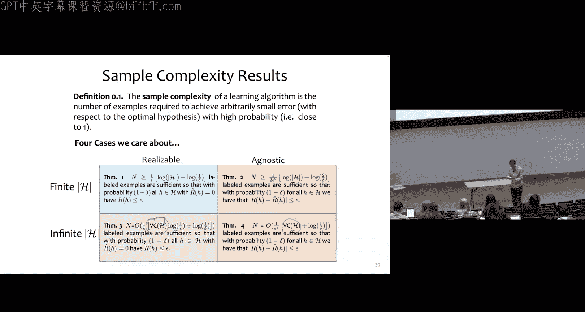

下节课，我们将深入探讨VC维度，并继续完善我们的理论工具箱，以理解更广泛的机器学习模型为何能够有效工作。