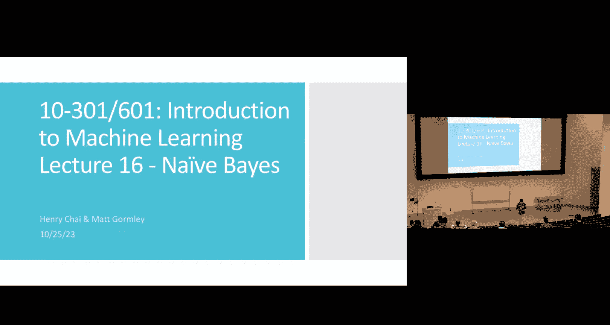
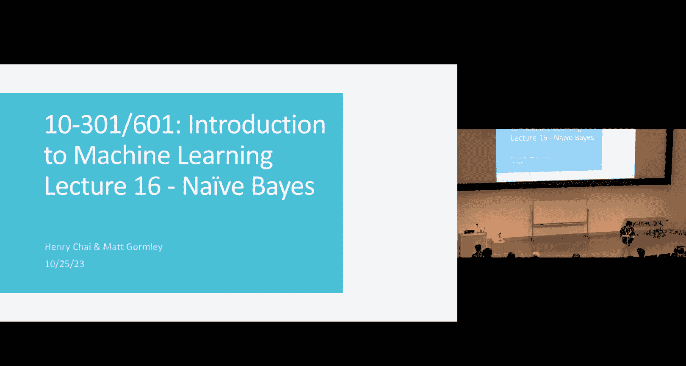
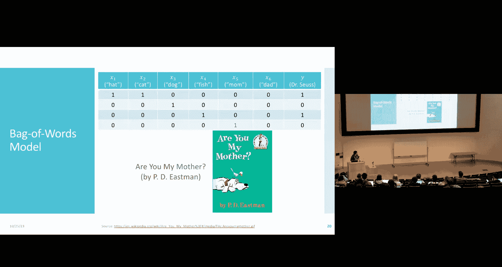
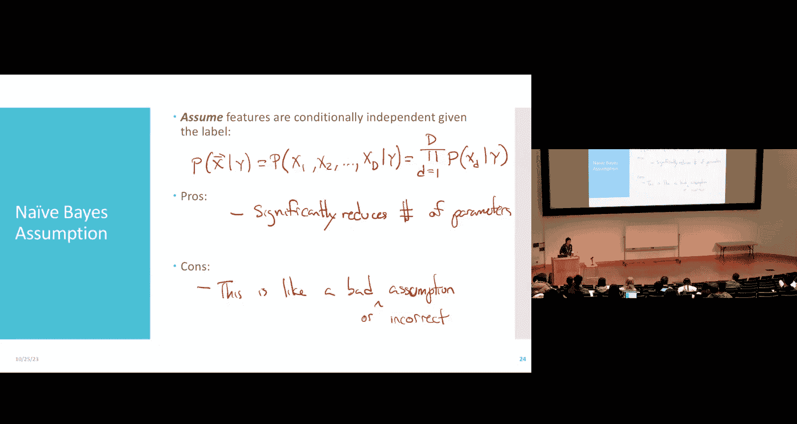
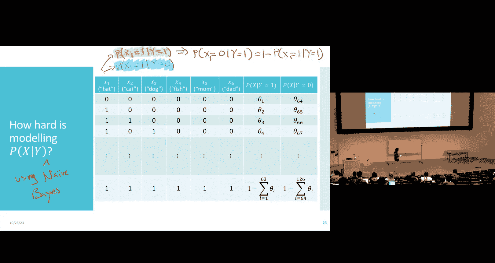
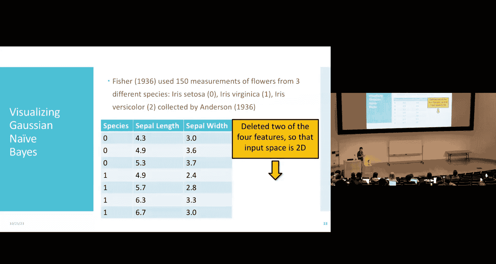
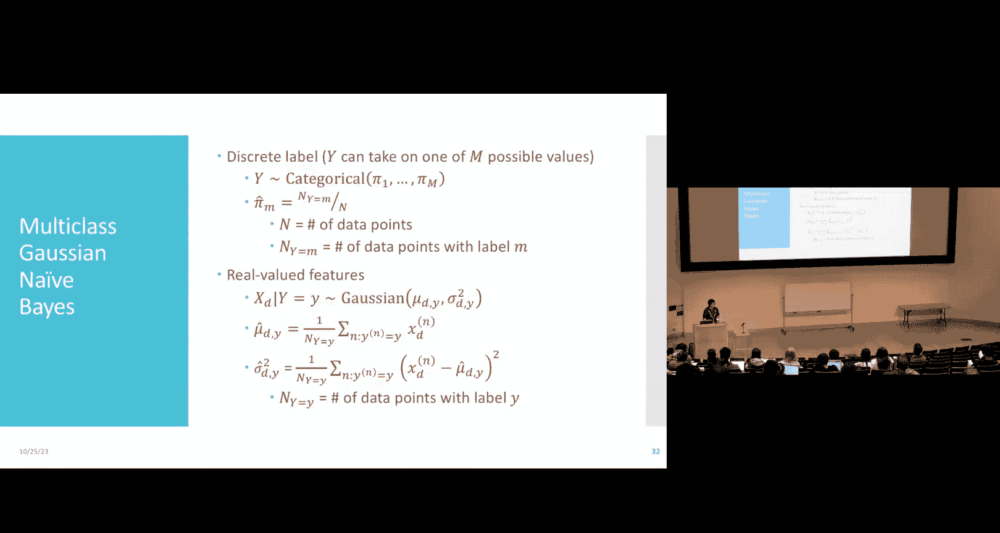
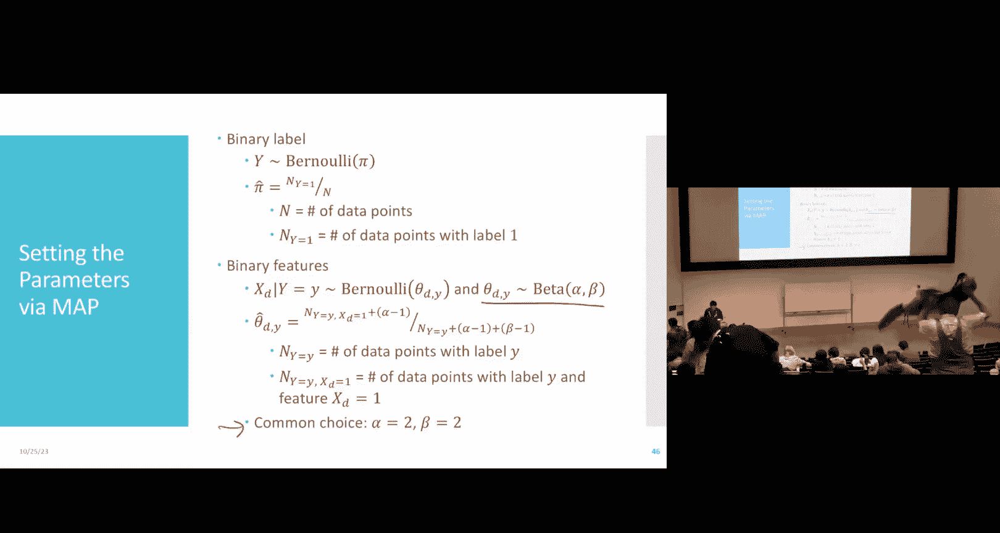

# 16：朴素贝叶斯分类器 🧠

在本节课中，我们将继续讨论参数估计方法，并学习如何将它们应用于一个重要的概率分类器——朴素贝叶斯。我们将从最大似然估计和最大后验估计的对比开始，然后深入探讨朴素贝叶斯模型的工作原理、优缺点及其应用。

## 回顾：MLE 与 MAP 估计

上一节我们介绍了最大似然估计，它通过最大化数据的似然性来学习模型参数。然而，当数据量较少时，MLE可能会产生不合理的极端估计。本节中，我们来看看如何通过引入先验分布来改进估计，即最大后验估计。

MAP估计不仅考虑数据的似然性，还结合了我们关于参数的先验知识。其目标是最大化参数的后验概率：
`θ_MAP = argmax_θ P(θ|D) = argmax_θ P(D|θ) * P(θ)`
其中，`P(θ)` 是先验分布，`P(D|θ)` 是似然函数，`P(θ|D)` 是后验分布。

### 先验分布的选择

一个关键问题是如何选择合适的先验分布。理想情况下，先验应反映我们对世界的真实信念。但在实践中，我们常选择“共轭先验”，因为它能使数学计算变得非常简便。

以抛硬币为例，我们使用伯努利分布对每次抛掷建模。其共轭先验是Beta分布：
`P(φ) = Beta(φ; α, β) = (φ^(α-1) * (1-φ)^(β-1)) / B(α, β)`
其中，`φ` 是硬币正面朝上的概率，`α` 和 `β` 是控制分布形状的超参数。通过调整 `α` 和 `β`，我们可以编码各种不同的先验信念。

### MAP估计的推导与解释

通过将Beta先验与伯努利似然结合，我们可以推导出MAP估计的封闭解。最终，正面概率的MAP估计为：
`φ_MAP = (α - 1 + N1) / (α - 1 + N1 + β - 1 + N0)`
其中，`N1` 是观测到的正面次数，`N0` 是反面次数。

这个结果非常直观：MAP估计相当于在观测计数上增加了“伪计数” `(α-1)` 和 `(β-1)`。这些伪计数代表了我们先验的“虚拟经验”。先验参数 `α` 和 `β` 的绝对值大小反映了我们信念的强度。值越大，我们需要更多的实际数据才能改变先验信念。

## 文本数据与词袋模型

现在，我们将应用概率建模方法来处理文本分类问题。我们将以区分苏斯博士的童书和其他作者的童书为例。

首先，我们需要将文本标题转换为机器学习模型可以处理的特征。以下是词袋模型的一个简单实现步骤：

1.  定义一个有限的词汇表（例如：hat, cat, dog, fish, mom, dad）。
2.  对于每个标题，检查词汇表中的每个词是否出现。
3.  如果词出现，对应特征值为1；否则为0。

例如，标题 “The Cat in the Hat” 会被编码为特征向量 `[1, 1, 0, 0, 0, 0]`，标签为1（是苏斯博士的书）。

### 词袋模型的优缺点

以下是词袋模型的一些主要特点：

*   **优点**：模型简单、计算高效、特征易于解释。
*   **缺点**：完全忽略了词序信息；丢失了词频信息（除非使用计数）；特征可能非常稀疏；需要手动选择词汇表并进行词干提取等预处理。

尽管有这些限制，词袋模型仍然是一个合理的起点，特别适合我们接下来要介绍的模型。

## 朴素贝叶斯分类器

我们的目标是构建一个概率分类器，即建模后验分布 `P(y|x)`。逻辑回归直接对这个分布进行参数化建模。而朴素贝叶斯采用了另一种思路：利用贝叶斯定理。
`P(y|x) ∝ P(x|y) * P(y)`
因此，我们需要建模两个分布：似然 `P(x|y)` 和先验 `P(y)`。

### “朴素”独立性假设

直接建模 `P(x|y)` 非常困难，因为对于 `D` 个二元特征，我们需要估计 `2^D - 1` 个参数，这需要海量数据。

为了使学习变得可行，朴素贝叶斯做出了一个关键且强大的假设：**在给定类别标签的条件下，所有特征相互独立**。这意味着：
`P(x|y) = Π_{d=1}^{D} P(x_d|y)`
这个假设将我们需要学习的参数数量从指数级 `O(2^D)` 减少到了线性级 `O(2D)`。

### 参数学习与MLE

在二元特征和二元标签的设定下，我们需要学习的参数包括：
*   类别先验 `π = P(y=1)`
*   每个特征在给定类别下的条件概率 `θ_{d1} = P(x_d=1|y=1)` 和 `θ_{d0} = P(x_d=1|y=0)`

利用数据的独立同分布假设和条件独立性假设，我们可以推导出对数似然函数。一个美妙的结果是，所有参数在似然函数中是解耦的。因此，每个参数的最大似然估计都可以独立地通过计数轻松得到：
*   `π_MLE = (N1) / N`，其中 `N1` 是正例数量，`N` 是总样本数。
*   `θ_{d1_MLE} = (Count(x_d=1 and y=1)) / N1`
*   `θ_{d0_MLE} = (Count(x_d=1 and y=0)) / N0`

学习这些参数非常高效，只需遍历数据集并进行计数即可。

### 进行预测

对于一个新样本 `x'`，我们通过比较两个后验概率来进行预测：
`ŷ = argmax_{y ∈ {0,1}} P(y) * Π_{d=1}^{D} P(x‘_d|y)`
我们计算 `y=1` 和 `y=0` 对应的未归一化后验概率，并选择值更大的那个作为预测类别。

## 处理零概率问题与拉普拉斯平滑

朴素贝叶斯模型的一个常见问题是“零概率事件”。如果在训练集中，某个特征-标签组合从未出现（例如，从未在苏斯博士的书里看到“dog”这个词），那么对应的条件概率 `θ` 的MLE估计为0。这将导致在预测时，只要新样本中出现这个词，整个后验概率就会变为0，无论其他特征多么支持这个类别。

为了解决这个极端估计问题，我们可以为参数 `θ` 引入先验分布，即使用MAP估计而非MLE。对于伯努利分布的参数，我们自然可以再次使用Beta先验。这相当于在计数中添加平滑项，最常见的做法是拉普拉斯平滑（加一平滑），它相当于使用 `α=2, β=2` 的Beta先验。这样，即使某个组合在训练集中未出现，其估计概率也不会是0，从而避免了预测失效。

## 总结

本节课中我们一起学习了：
1.  **最大后验估计**：通过引入先验分布来改进MLE，特别是在数据稀缺时，可以防止产生不合理的极端参数估计。Beta分布是伯努利似然的共轭先验，使计算变得简便。
2.  **朴素贝叶斯分类器**：一种基于贝叶斯定理和特征条件独立性假设的概率分类器。该假设虽然通常不成立，但能极大简化模型，减少参数数量，有效防止过拟合。
3.  **模型应用**：我们看到了如何将朴素贝叶斯应用于文本分类（使用伯努利/多项式分布）和连续值分类（使用高斯分布），并了解了不同选择对决策边界（线性或二次）的影响。
4.  **实践技巧**：使用拉普拉斯平滑（本质上是MAP估计）来处理训练数据中未出现的特征组合，这是构建鲁棒朴素贝叶斯模型的关键步骤。

朴素贝叶斯因其简单、高效且易于理解的特点，在实践中仍有广泛的应用，是入门机器学习概率图模型思想的优秀范例。