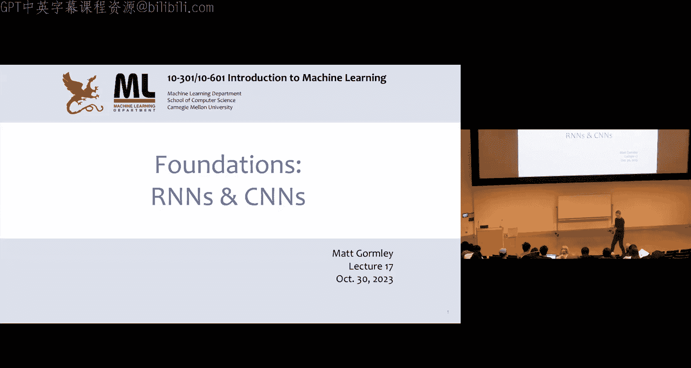
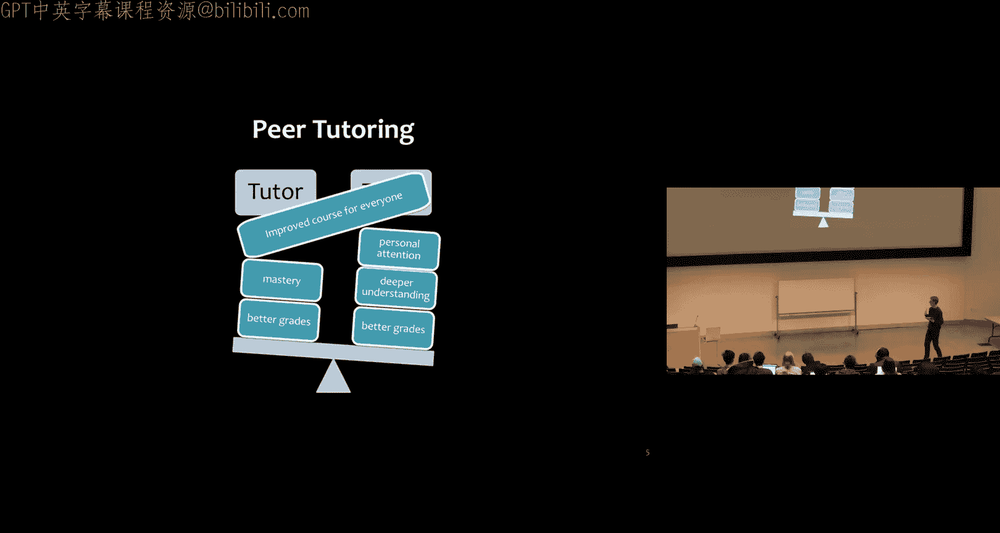
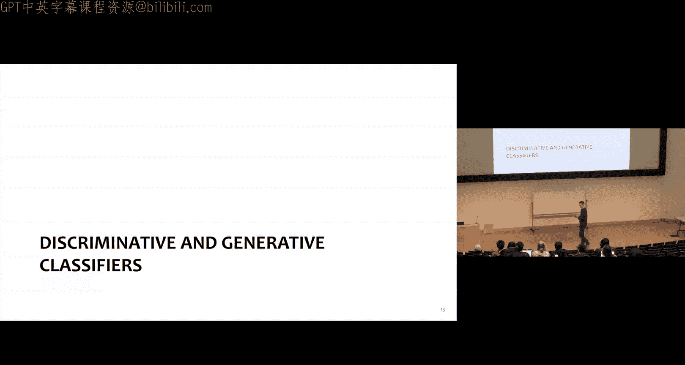
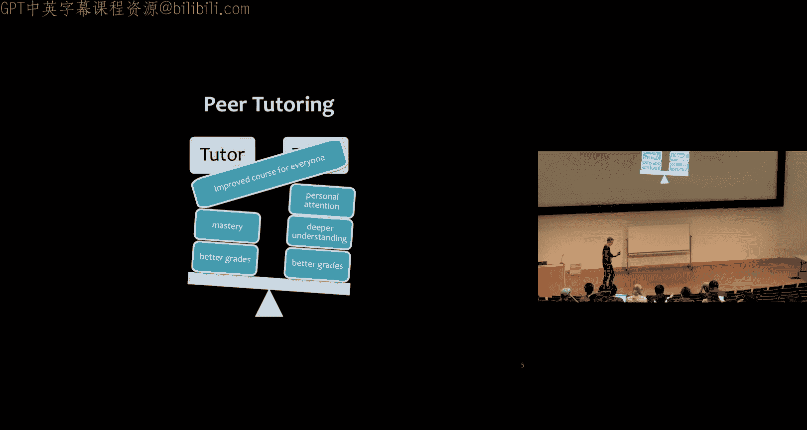
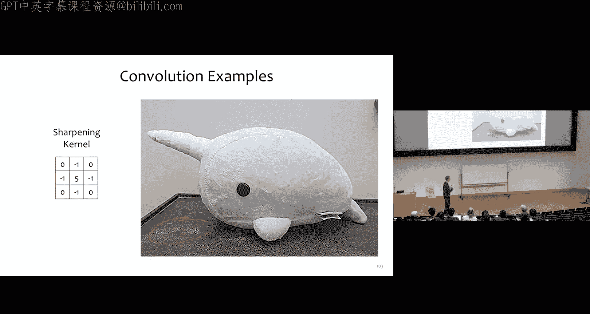
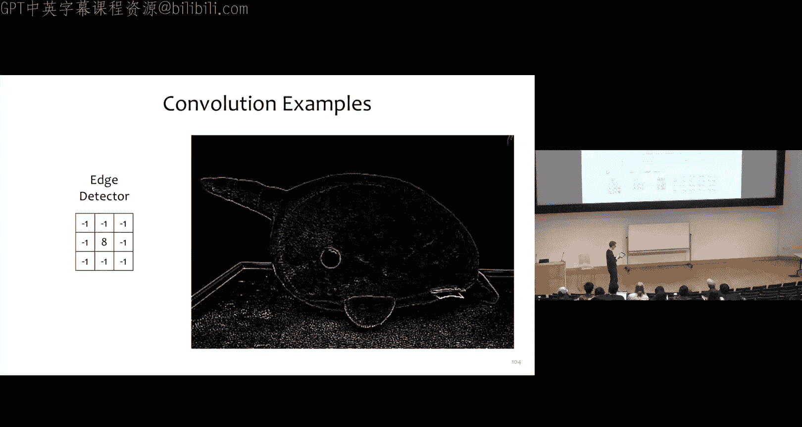
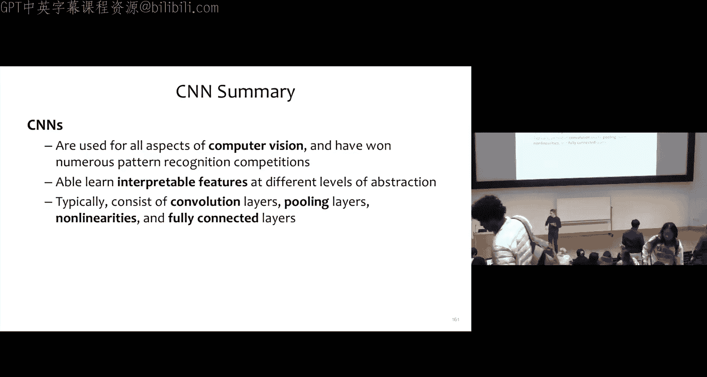

# 17：循环神经网络与卷积神经网络基础

在本节课中，我们将首先快速回顾生成式模型与判别式模型的核心区别，然后开启课程的全新模块——深度学习。我们将重点探讨循环神经网络和卷积神经网络，这两种模型在自然语言处理和计算机视觉领域曾长期是深度学习的核心支柱。

## 生成式模型与判别式模型

上一节我们介绍了多种学习范式，本节中我们来看看生成式模型与判别式模型的具体区别。

*   **生成式模型**：这类模型对输入 `x` 和标签 `y` 的**联合分布** `P(x, y)` 进行建模。其典型例子是朴素贝叶斯分类器。生成式模型通常通过最大化训练数据 `(x, y)` 对的**联合似然**来学习。
*   **判别式模型**：这类模型直接对**条件分布** `P(y | x)` 进行建模。它通常通过最大化**条件似然**来学习。

关键区别在于，生成式模型为所有数据的来源提供了一个完整的“故事”，而判别式模型只能接收输入 `x` 并区分哪个标签 `y` 更合适。

需要理解的是，生成式与判别式的区别，不同于最大似然估计与最大后验估计的区别。MLE 是关于最大化似然（无论是条件似然还是联合似然），而 MAP 的不同之处在于它引入了参数的先验分布 `P(θ)`。

### 与正则化的联系

MAP 估计与正则化有紧密联系。对于一个分类器（例如逻辑回归），MAP 估计是最大化：
`log P(数据 | 参数) + log P(先验)`
如果我们取负值，就变成了最小化负似然和负先验。这可以看作一个目标函数 `J` 加上一个正则化项 `R`。例如，**L2 正则化等价于高斯先验**。

### 高斯朴素贝叶斯 vs. 逻辑回归

这两种模型都能处理连续值特征，构成了一对生成式-判别式模型。

*   **有限样本分析**：在训练数据量有限的情况下，随着数据量增加，高斯朴素贝叶斯和逻辑回归会收敛到相同的决策边界（需满足一定条件）。
*   **模型效率**：高斯朴素贝叶斯是更高效的学习器，需要更少的样本就能达到良好性能。
*   **模型假设**：高斯朴素贝叶斯假设特征在给定标签下**条件独立**，而逻辑回归对特征形式**没有假设**，允许特征之间存在依赖和相关性。
*   **无限样本分析**：当模型假设**不正确**时（特征通常并不条件独立），在无限训练数据的假设下，逻辑回归的**渐近误差更低**，性能优于高斯朴素贝叶斯。

在实践中，随着训练集规模增长，逻辑回归的性能通常会超越高斯朴素贝叶斯。实验图表显示，在训练初期（样本少时），朴素贝叶斯表现更好；但当样本足够多后，逻辑回归开始领先。只有在特征确实接近条件独立的少数数据集上，朴素贝叶斯可能始终保持优势。

### 模型选择思考题

假设你需要构建一个二元分类器，检测生产线上的硬币图像是否有缺陷。在选择使用朴素贝叶斯分类器还是逻辑回归分类器时，你需要向经理提出哪些后续问题？

以下是需要考虑的关键问题：
*   我们有多少带标签的训练硬币图像？（数据量少可能倾向朴素贝叶斯，数据量大可能倾向逻辑回归）。
*   我们使用什么特征来检测缺陷？（特征工程）。
*   这些特征是否条件独立？（这更多是需要你通过分析回答的问题）。
*   缺陷的先验概率是多少？（朴素贝叶斯在标签分布极度不平衡时可能表现不佳）。
*   模型训练需要多快？（朴素贝叶斯训练极快，逻辑回归相对较慢）。

## 机器学习通用框架回顾

在深入新模型之前，我们回顾一下机器学习的通用框架。

我们的典型流程是：给定数据，选择一个决策函数和一个目标函数，通过优化目标函数进行学习，然后使用学习到的参数进行预测。

*   **决策函数**：可以是感知机、线性回归、逻辑回归（判别式）、神经网络或朴素贝叶斯（生成式）等。
*   **目标函数**：可以是条件似然、联合似然，也可以加上 L2/L1 正则化项（等价于带先验的 MAP 估计）。
*   **优化方法**：梯度下降、随机梯度下降、小批量 SGD，对于某些模型可能有闭式解。

**核心要点**：这个通用框架在机器学习中反复出现。接下来我们将学习新的、更复杂的决策函数（卷积神经网络和循环神经网络），但训练这些模型的**流程将完全保持不变**，唯一改变的是我们如何定义决策函数 `h_θ(x)`。我们将把之前神经网络的工作扩展到新的深度神经网络。

我们将依赖的关键算法技术是**反向传播算法**，它可以计算任意计算图的梯度。

## 循环神经网络

首先，我们来看看循环神经网络。RNN 是深度学习处理自然语言任务的常见骨干网络（尽管目前 Transformer 正迅速在许多任务上取代其成为主流）。理解 RNN 的工作原理有助于我们更好地理解 Transformer。

### 从 N-gram 语言模型出发

N-gram 语言模型的目标是生成看起来逼真的人类语言句子。其核心思想是：根据前 `n-1` 个词来预测（或采样）第 `n` 个词。

**概率定义**：对于一个长度为 `T` 的词序列 `w1, w2, ..., wT`，其联合概率为：
`P(w1, w2, ..., wT) = P(w1) * P(w2|w1) * P(w3|w2, w1) * ... * P(wT|wT-1, ..., w1)`
在 N-gram 模型中，我们只条件依赖于前 `n-1` 个词，例如三元模型 `(n=3)` 中，`P(w3|w2, w1)`。

**学习过程**：通过在大规模文本语料（如维基百科）上统计 N-gram 的频率来估计这些条件概率。

**局限性**：生成的文本通常不连贯或缺乏意义，因为它只依赖于有限的上下文，且无法捕捉长距离依赖。

### RNN 语言模型

RNN 语言模型通过循环神经网络来克服 N-gram 的局限性。

**核心思想**：使用一个固定长度的向量 `h_t`（隐藏状态）来**概括之前所有词的信息**，然后基于 `h_t` 来预测下一个词的概率分布。

**计算图**：
*   **输入**：每个时间步 `t` 的输入向量 `x_t`（对应词 `w_t` 的嵌入）。
*   **隐藏状态更新**：`h_t = H(W_xh * x_t + W_hh * h_{t-1} + b_h)`，其中 `H` 是非线性激活函数（如 tanh 或 ReLU），`W_xh`, `W_hh`, `b_h` 是共享参数。
*   **输出**：`y_t = softmax(W_hy * h_t + b_y)`，得到下一个词在词汇表上的概率分布。

**关键优势**：RNN 可以处理**任意长度**的输入序列，并通过隐藏状态传递历史信息，理论上可以捕捉无限长的依赖关系。

**生成概率**：序列的概率通过链式法则计算，每个条件概率由 RNN 的输出给出：
`P(w1, w2, ..., wT) = P(w1) * P(w2|h1) * P(w3|h2) * ... * P(wT|h_{T-1})`

**生成文本**：可以从模型中采样，过程类似于 N-gram：从起始标记开始，根据 RNN 输出的分布采样下一个词，将其作为下一时间步的输入，重复直至生成结束标记。

实验表明，RNN 语言模型生成的文本质量远高于 N-gram 模型，虽然仍不及人类写作，但已能生成语法基本正确、具有一定连贯性的句子。

### 序列到序列模型

RNN 的强大之处在于可以构建**编码器-解码器**架构，用于解决翻译、摘要、语音识别等序列到序列的任务。

**工作原理**：
1.  **编码器**：一个 RNN 读取输入序列（如源语言句子），并将其最终隐藏状态 `e_T` 作为输入序列的“语义向量”表示。
2.  **解码器**：另一个 RNN（语言模型）以 `e_T` 作为其初始隐藏状态，开始生成输出序列（如目标语言句子）。解码器在每一步都条件依赖于编码器的汇总信息。

**训练**：通过最大化给定输入序列 `X` 时，目标输出序列 `Y` 的**条件似然**来训练。

## 卷积神经网络

现在，我们将目光转向计算机视觉和卷积神经网络。

### 背景：ImageNet 竞赛

ImageNet 大规模视觉识别挑战赛是计算机视觉领域的标志性赛事。在 2012 年之前，主流方法是**特征工程**（如 SIFT、HOG 特征）结合浅层分类器（如逻辑回归）。

**2012 年转折点**：AlexNet——一个深度卷积神经网络，以显著优势赢得比赛。此后，CNN 成为主流，网络深度不断增加（VGG, GoogLeNet），直至 ResNet 达到 152 层，错误率媲美人类水平。

### 卷积操作基础

卷积是 CNN 的核心操作。

**基本过程**：选择一个小的权重矩阵（**卷积核**或**滤波器**），在输入图像上滑动。在每个位置，计算卷积核与对应图像区域的**逐元素乘积之和**，将结果输出到特征图的对应位置。

**示例**：对于一个 3x3 的输入图像 `X` 和一个 2x2 的卷积核 `α`，输出 `Y` 是一个 2x2 的特征图。
`y11 = α11*x11 + α12*x12 + α21*x21 + α22*x22`
`y12 = α11*x12 + α12*x13 + α21*x22 + α22*x23`
... 以此类推。

**作用**：不同的卷积核可以检测不同的特征。
*   **边缘检测核**：突出图像中颜色变化的边界。
*   **模糊（平滑）核**：使图像变得平滑。
*   **锐化核**：增强图像细节。

**步长与填充**：
*   **步长**：卷积核每次移动的像素数。步长为 2 会下采样，缩小输出尺寸。
*   **填充**：在图像边缘添加零值像素，可以控制输出尺寸（如保持与输入相同）。

**池化操作**：另一种下采样方式，通常**无参数**。
*   **最大池化**：在滑动窗口内取最大值。
*   **平均池化**：在滑动窗口内取平均值。
池化能提供一定的平移不变性，并减少计算量。

### 从手工特征到学习特征

传统计算机视觉中，卷积核是**手工设计**的（如特定的边缘检测器）。CNN 的革命性思想在于：**将卷积核中的每个权重视为可学习的模型参数**。给定大量带标签的图像，通过反向传播和梯度下降，让模型自己学习出有用的特征检测器（可能对应边缘、纹理、部件等）。

### CNN 的训练：反向传播与 SGD

训练 CNN 的流程与训练标准神经网络完全相同。

**前向传播**：输入图像 `X`，经过一系列层（卷积、激活、池化、全连接等），最终得到预测 `y`（如 softmax 后的类别概率）。
**计算损失**：使用交叉熵损失函数比较预测 `y` 和真实标签 `y*`。
**反向传播**：计算损失相对于所有参数（各卷积核的权重、全连接层权重等）的梯度。
**参数更新**：使用随机梯度下降更新参数。

**各层的可微性**：
*   **卷积层**：本质是线性运算（带特定索引），完全可微。
*   **激活层（如 ReLU）**：逐元素操作，子可微。
*   **Softmax 层**：可微，导数公式已知。
*   **最大池化层**：子可微，梯度只流向池化窗口内最大值的位置。
*   **全连接层**：标准线性层，可微。

### 多通道卷积

为了处理彩色图像（RGB 三通道）或更深的特征图，卷积运算需要扩展。

*   **输入通道**：例如，RGB 图像有 3 个输入通道。
*   **输出通道**：每个卷积核会生成一个输出通道。我们可以有多个卷积核来生成多个输出通道，每个核都能学习检测不同的特征。
*   **卷积核维度**：对于一个有 `C_in` 个输入通道、`C_out` 个输出通道的卷积层，其卷积核是一个 `C_out x C_in x K_h x K_w` 的四维张量（`K_h, K_w` 是核的高和宽）。每个输出通道的卷积核会与所有输入通道进行卷积并对结果求和。

### 经典架构示例：LeNet-5 到 ResNet

*   **LeNet-5 (1998)**：早期成功的 CNN，用于手写数字识别。结构为：卷积 -> 池化 -> 卷积 -> 池化 -> 全连接 -> 全连接 -> 输出。
*   **AlexNet (2012)**：更深更宽的 LeNet，使用 ReLU 激活函数和 Dropout 等技术，赢得 ImageNet。
*   **VGGNet (2014)**：通过堆叠多个 3x3 小卷积核来替代大卷积核，结构规整，深度增加。
*   **ResNet (2015)**：引入“残差连接”，允许梯度直接流过，成功训练了极深的网络（如 152 层），性能达到新高。

**为什么使用小卷积核（如 3x3）？**
1.  减少参数数量，降低计算成本和过拟合风险。
2.  通过堆叠多个小卷积核，可以获得与大卷积核相同的感受野，但非线性更强（因为中间有更多的激活函数）。
3.  **平移不变性**：对于图像分类等任务，我们通常关心“是什么”而不是“在哪里”。卷积核在整个图像上共享权重，使得特征检测器无论物体在图像中什么位置都能被激活。

## 总结

本节课中我们一起学习了：
1.  **生成式模型与判别式模型**的根本区别，以及高斯朴素贝叶斯和逻辑回归这对生成-判别模型对的特性比较。
2.  **循环神经网络**的基本原理，它如何通过隐藏状态编码变长序列的历史信息，并用于构建语言模型和序列到序列模型。
3.  **卷积神经网络**的基本原理，卷积操作如何从图像中提取局部特征，以及如何通过反向传播学习这些特征检测器。我们还回顾了 CNN 从 LeNet 到 ResNet 的关键发展脉络。

这些模型虽然结构比之前学到的线性模型复杂，但它们仍然遵循着相同的机器学习范式：定义模型（决策函数）、定义目标、优化参数。下一节课，我们将开始探讨目前占据主导地位的 Transformer 模型。