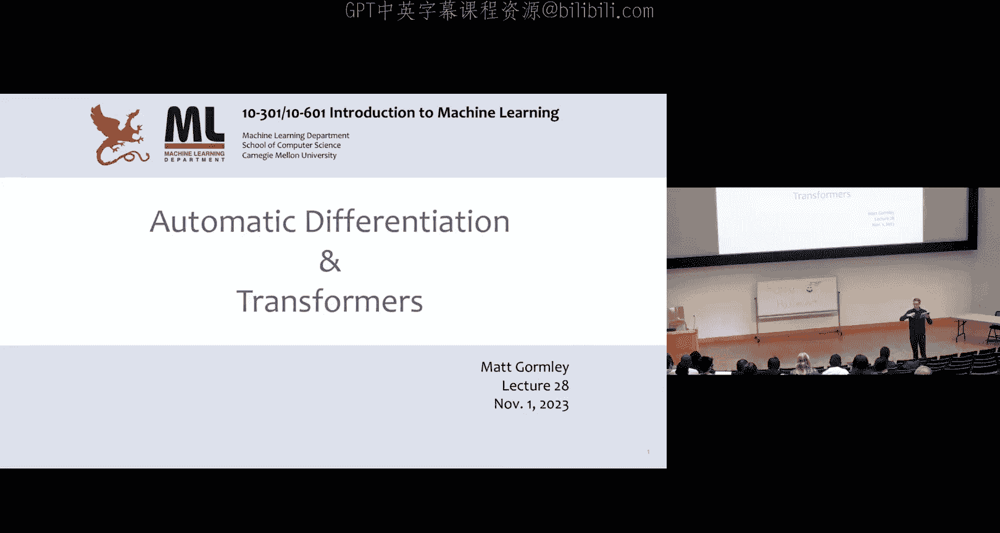
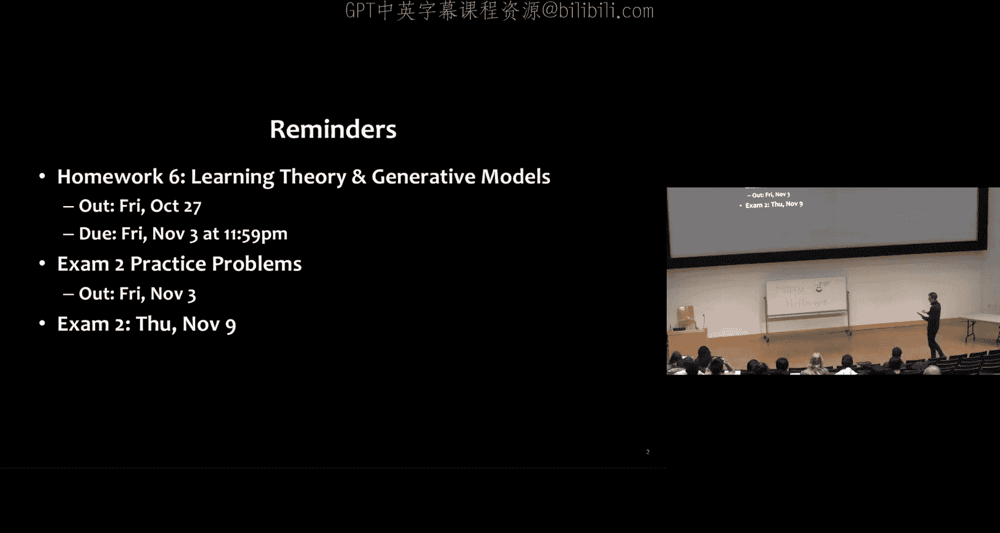
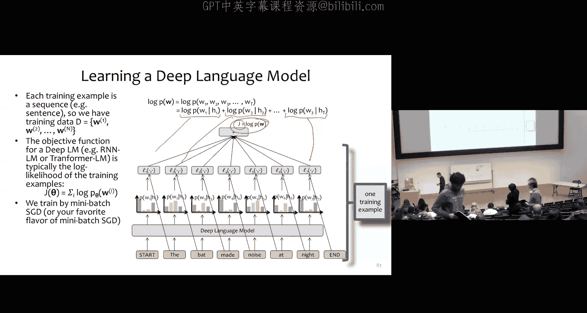

# 18：自动微分与Transformer架构





在本节课中，我们将学习如何从构建深度学习库的角度理解深度学习，核心主题是自动微分。在建立了如何模块化计算图的概念后，我们将开始研究一些更复杂的模块，Transformer架构将作为一个典型案例，展示模块嵌套的复杂结构。

## 概述

我们将首先回顾两种反向传播算法（或称反向模式自动微分）的版本，并探讨如何将其模块化。接着，我们将深入Transformer架构，了解其核心组件，如注意力机制、多头注意力、层归一化和残差连接，并理解它们如何组合成一个强大的语言模型。

## 模块化自动微分

上一节我们讨论了反向传播算法。一种思路是为计算图中的每个标量节点一次性累积所有需要的偏导数。另一种更实用的思路是，每当访问一个节点时，就将其对上游所有节点的梯度贡献累加到对应的存储中。大多数反向传播库采用后一种实现方式，因为它将前向计算相关的所有梯度信息封装在节点内部，便于管理。

反向传播之所以高效，是因为它复用了前向传播的计算结果，并在反向传播过程中复用了偏导数。这种复用源于前向计算的结构化设计。

### 过程式实现的局限性

考虑一个简单的前馈神经网络，其前向计算过程如下：
```python
a = alpha * x
z = sigma(a)
b = beta * z
y_hat = softmax(b)
J = cross_entropy_loss(y, y_hat)
```
反向传播则需要按顺序计算 `dJ/dy_hat`, `dJ/db` 等梯度。

这种过程式实现存在几个问题：
1.  **代码复用困难**：将其改造成两层隐藏层的网络需要深入理解数学并重写大量代码。
2.  **局部优化困难**：若想将某个计算（如Sigmoid梯度）从循环优化为矩阵运算，需要非常小心地插入正确位置。
3.  **调试困难**：出现错误时，难以定位，因为梯度检查是针对整个反向传播过程进行的。

### 基于模块的自动微分

基于模块的自动微分是开发深度学习库的常用技术。早期有Torch和Theano等库。Theano是静态图库，需要预先定义完整的计算图。Torch则支持动态计算图，允许在运行时根据输入（如不同句子的语法解析树）创建不同结构的计算图。TensorFlow在2.0版本后才支持动态图。如今，PyTorch和TensorFlow是最流行的神经网络库，都采用了这种动态模块化方法。

其核心思想是将神经网络计算组件化为层，每个层将多个实值节点聚合为一个对向量、矩阵或其他结构进行计算的节点，我们称之为模块。一个模块可以在计算图中被多次实例化。

每个模块能执行两种操作：前向计算和反向计算。

*   **前向计算**：接收输入向量 `a`，应用函数 `f`，返回输出向量 `b`。
*   **反向计算**：接收关于模块输出 `b` 的梯度 `gb`（即 `dJ/db`），目标是计算关于模块输入 `a` 的梯度 `ga`（即 `dJ/da`）。根据链式法则：
    `ga_i = sum_j (gb_j * (db_j / da_i))`
    其中 `db_j / da_i` 是函数 `f` 第 `j` 个输出对第 `i` 个输入的偏导数。

以下是几个模块的示例：

*   **Sigmoid模块**：
    *   输入：向量 `a`
    *   输出：`b = sigmoid(a)`
    *   反向：`ga = gb * b * (1 - b)` （`*` 表示逐元素乘）
*   **Softmax模块**：
    *   输入：向量 `a`
    *   输出：`b = softmax(a)`
    *   反向：`ga = gb^T * (diag(b) - b * b^T)` （`diag(v)` 返回以向量 `v` 为对角线的矩阵）
*   **线性模块**：
    *   输入：数据 `a`，参数 `omega`
    *   输出：`b = omega * a`
    *   反向：计算关于 `a` 和 `omega` 的梯度 `ga` 和 `g_omega`
*   **交叉熵模块**：
    *   输入：真实标签（one-hot向量）`a` 和预测分布 `a_hat`
    *   输出：损失值 `J`
    *   反向：仅返回关于预测 `a_hat` 的梯度 `ga_hat`

采用模块化方法后，前向计算是一系列特定模块的 `forward` 调用，反向计算则是一系列对应的 `backward` 调用。这样，线性模块等可以在网络中多次复用。

### 面向对象的实现与自动微分

我们可以采用更面向对象的方式，让每个模块定义一个类，由程序的控制流来动态创建计算图。这样就不再需要显式编写 `NN_backward` 函数，因为前向调用的控制流已经指明了反向计算拓扑顺序。

每个模块类都有 `forward` 和 `backward` 方法。我们可以定义一个神经网络类，它本身也是一个模块，在其初始化方法中创建所需的线性层、Sigmoid层等子模块。

前向计算 `forward(x, y, alpha, beta)` 简单地依次调用各子模块的 `forward` 方法。反向计算则调用一个特殊的 `tape.backward()` 方法，它按照“磁带”的记录反向执行计算。

“磁带”是一个全局堆栈。当调用 `module.apply_forward(inputs)` 时，它会：
1.  从输入模块中获取输入张量列表。
2.  调用自身的 `forward` 方法计算输出张量。
3.  将自身模块压入全局“磁带”堆栈。

在前向传播结束后，“磁带”上按顺序记录了所有参与计算的模块。调用 `tape.backward()` 时，它会循环地从“磁带”中弹出模块，并调用其 `apply_backward` 方法。在 `apply_backward` 中，模块利用存储的输入/输出张量和输出梯度，计算每个输入模块的梯度，并将这些梯度累加到对应输入模块的“输出梯度”存储中。这种设计使得每个模块在反向传播时，其所需的梯度信息都已被上游模块计算并累加好。

### PyTorch 实例

在作业七中，你将使用PyTorch实现类似功能。PyTorch代码非常简洁：
```python
class NeuralNetwork(nn.Module):
    def __init__(self):
        super().__init__()
        self.flatten = nn.Flatten()
        self.linear1 = nn.Linear(...)
        self.sigmoid = nn.Sigmoid()
        self.linear2 = nn.Linear(...)
    def forward(self, x):
        x = self.flatten(x)
        a = self.linear1(x)
        z = self.sigmoid(a)
        b = self.linear2(z)
        return b
```
我们不需要定义 `backward` 方法。训练时：
```python
model = NeuralNetwork()
loss_fn = nn.CrossEntropyLoss()
optimizer = torch.optim.SGD(model.parameters(), lr=learning_rate)

# 前向
pred = model(x)
loss = loss_fn(pred, y)

# 反向
optimizer.zero_grad() # 清零梯度
loss.backward() # 反向传播
optimizer.step() # 更新参数
```
这里，`model(x)` 等价于 `model.__call__(x)`，而 `__call__` 方法内部会调用 `forward`。参数存储在模块内部（如 `self.linear1.weight`），优化器通过 `model.parameters()` 获取它们。`zero_grad()` 用于将梯度缓冲区清零，这是必要的初始化步骤。

## Transformer 架构

现在，让我们在大型语言模型的背景下探讨一些复杂模块。ChatGPT等模型的基础是Transformer架构。

### 从RNN到注意力机制

在Transformer出现（2017年）之前，语音识别和机器翻译严重依赖语言模型。当时使用的是N-gram语言模型或RNN语言模型。例如，2006年的Google N-grams模型在1万亿词符上训练，相当于约30亿参数。

然而，RNN存在长期依赖问题。在RNN中，隐藏状态 `h_t` 由前一刻状态 `h_{t-1}` 和当前输入 `x_t` 计算得到。随着时间步增加，早期信息可能会因循环计算而衰减或被遗忘，尤其是当权重矩阵导致隐藏状态值缩小时。

注意力机制解决了这个问题。其核心思想是：时间步 `t` 的表示应该是所有之前时间步表示的线性组合。例如，`x‘_4` 可以是 `v1, v2, v3, v4` 的加权和，权重为 `a41, a42, a43, a44`（通过softmax归一化）。这样，无论 `v1` 距离多远，`x‘_4` 都可以直接关注到它。

### 注意力机制详解

假设输入词嵌入为 `x1, x2, x3, x4`。通过不同的权重矩阵，我们得到三组向量：
*   **值（Value）**：`v_i = W_v * x_i`
*   **键（Key）**：`k_i = W_k * x_i`
*   **查询（Query）**：`q_i = W_q * x_i`

在计算时间步4的表示 `x‘_4` 时：
1.  用当前查询 `q4` 与所有键 `k_j` 计算得分：`s4j = (q4 · k_j) / sqrt(d_k)`，`d_k` 是键向量的维度。
2.  对得分进行softmax归一化，得到注意力权重 `a4`。
3.  计算加权和：`x‘_4 = sum_j (a4j * v_j)`。

这个计算过程可以封装为一个注意力模块。

### 多头注意力

类似于卷积网络中的多输出通道，我们可以引入多头注意力。假设有 `h` 个头，每个头有自己独立的参数矩阵 `W_v^h, W_k^h, W_q^h`。我们并行运行 `h` 个注意力计算，得到 `h` 组输出向量。然后将这些输出向量拼接起来，作为最终的表示。

为了使输入和输出维度一致（这在Transformer中很常见），我们通常设定每个头的输出维度 `d_k = d_model / h`，其中 `d_model` 是模型维度。这样，拼接后的向量维度恢复为 `d_model`。

### Transformer 层

一个完整的Transformer层不仅仅是多头注意力。它包含多个子层，其结构如下（按计算顺序）：

1.  **多头注意力层**
2.  **残差连接与加法**：将多头注意力的输出与原始输入相加，即 `output = attention(x) + x`。这有助于解决深度网络中的梯度消失和性能退化问题，让网络只需学习输入的一个残差修改。
3.  **层归一化**：对相加后的结果进行归一化。计算该层输入的均值和标准差，进行标准化，然后应用可学习的缩放参数 `gamma` 和偏置参数 `beta`。即：`y = gamma * (x - mean) / std + beta`。层归一化能稳定训练，允许使用更大的学习率，加速收敛。
4.  **前馈神经网络**：一个简单的单隐藏层全连接网络。
5.  **再次的残差连接**：将前馈网络的输出与层归一化的输出相加。
6.  **再次的层归一化**

以上所有组件封装在一起，构成了一个**Transformer层**。将多个这样的层堆叠起来，就得到了Transformer模型的主体。

### 位置编码

注意力机制本身是位置无关的（置换不变性）。为了让模型感知词序，需要引入位置信息。解决方案是**位置编码**。我们为每个位置 `t` 学习或定义一个特定的向量 `p_t`。在输入时，将词嵌入 `w_t` 与位置编码 `p_t` 相加，即 `x_t = w_t + p_t`，然后将 `x_t` 送入Transformer层。这样，模型就能区分同一词语在不同位置的出现。

### GPT 模型

GPT（Generative Pre-trained Transformer）就是一个基于Transformer架构的语言模型，其特点在于参数量巨大。
*   GPT-1：12层，`d_model=768`，12个注意力头，约1.17亿参数。
*   GPT-3：96层，`d_model=12288`，96个注意力头，约1750亿参数。

训练这类模型的目标函数是序列的负对数似然：
`J = -sum_{t=1}^T log P(w_t | w_1, ..., w_{t-1})`
即最大化模型赋予真实序列的概率。

## 总结



本节课我们一起学习了自动微分的模块化实现，以及构成现代大语言模型核心的Transformer架构。我们了解了如何通过模块封装前向和反向计算来构建灵活的深度学习库，并深入探讨了注意力机制、多头注意力、层归一化、残差连接和位置编码等Transformer的关键组件。这些组件通过精心设计堆叠，形成了强大的GPT系列模型。在接下来的课程中，我们将继续探讨如何大规模预训练和微调这些模型。