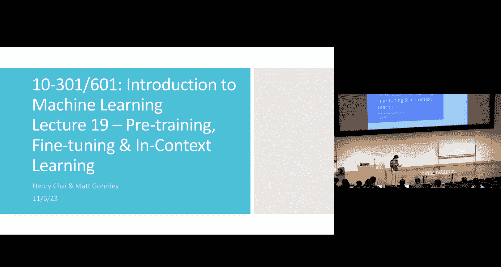
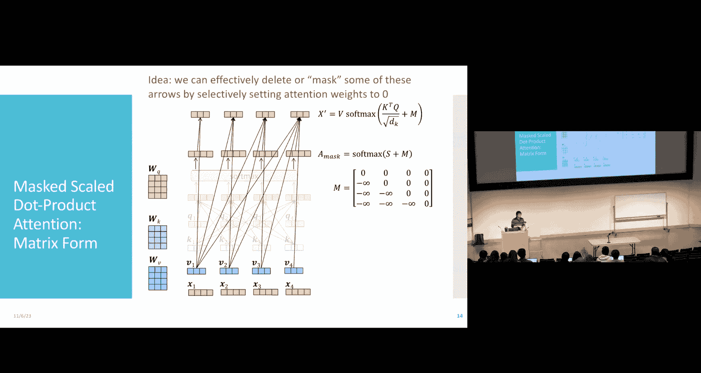
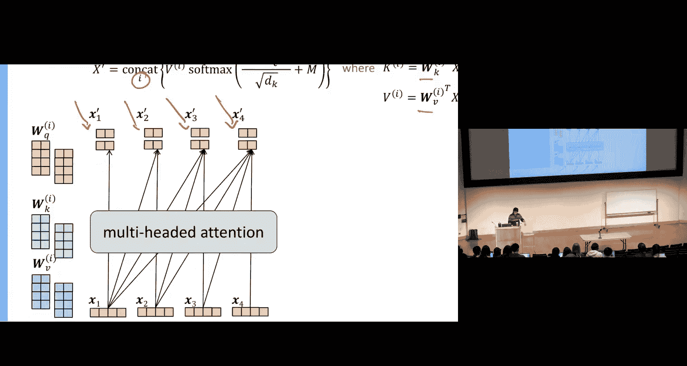
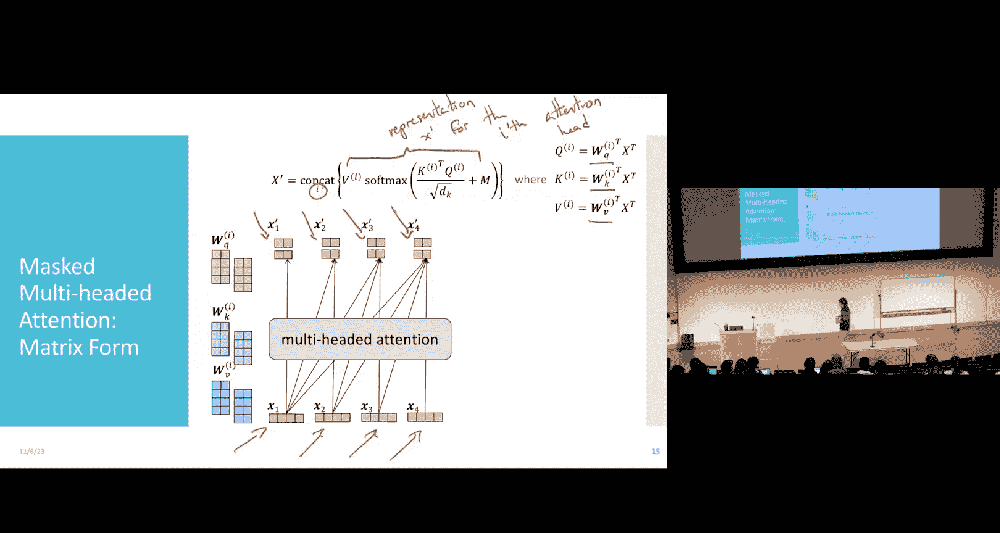
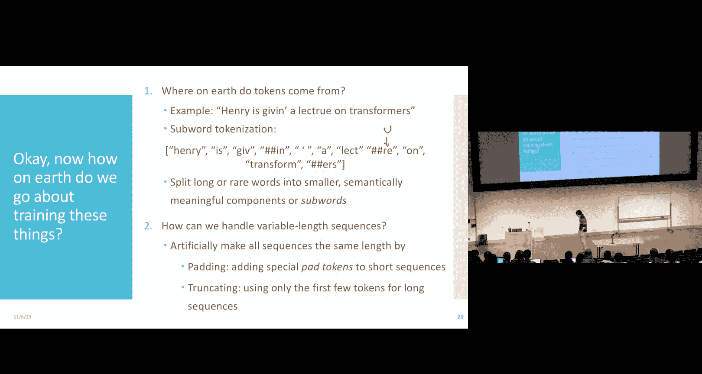
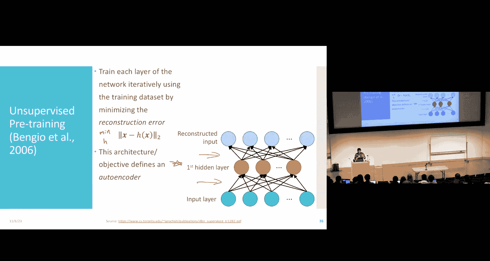
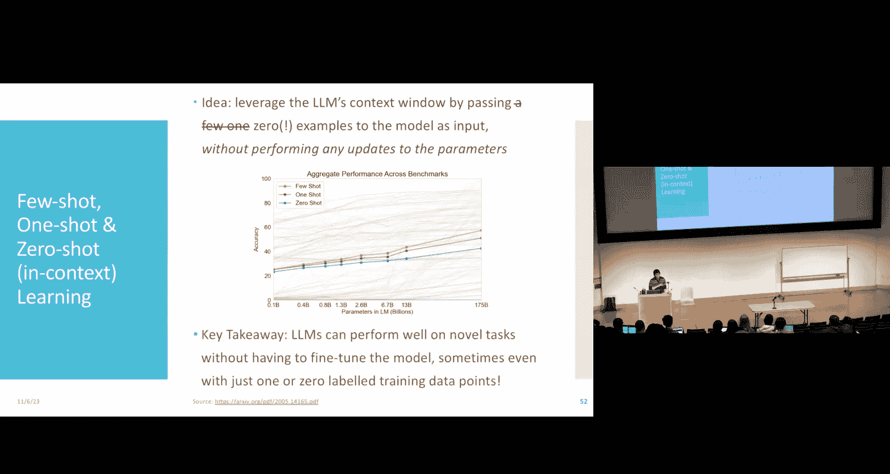
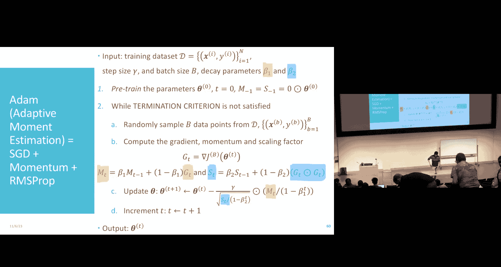
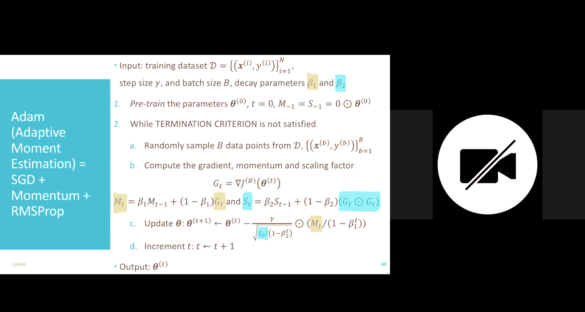

# 19：预训练、微调与上下文学习



在本节课中，我们将继续探讨Transformer和大语言模型，并重点介绍构建和训练这些模型时需要考虑的一些实际问题。我们将学习如何用矩阵形式高效地实现注意力机制，如何处理变长输入序列，以及如何通过预训练、微调和上下文学习等策略来训练大型模型。

## 注意力机制的矩阵实现 🧮

上一节我们介绍了注意力机制的基本原理。本节中，我们来看看如何用矩阵运算高效地同时计算所有输入位置的注意力表示，而不是使用低效的循环。

核心思想是将所有输入词元 \( x_1, x_2, ..., x_N \) 堆叠成一个矩阵 \( X \)。然后，我们可以通过矩阵乘法同时计算所有词元的查询（Q）、键（K）和值（V）矩阵：

\[
Q = X W^Q, \quad K = X W^K, \quad V = X W^V
\]

接下来，我们需要计算注意力权重。对于单个词元 \( x_i \)，其注意力权重是查询 \( q_i \) 与所有键 \( k_j \) 的点积。在矩阵形式下，这可以表示为 \( K^T Q \)。我们还需要进行缩放（除以 \( \sqrt{d_k} \) ）并通过softmax函数进行归一化：

\[
A = \text{softmax}\left( \frac{K^T Q}{\sqrt{d_k}} \right)
\]

最后，新的表示 \( X' \) 是值矩阵 \( V \) 与注意力权重矩阵 \( A \) 的线性组合：



\[
X' = V A
\]

通过这种方式，我们可以一次性计算出序列中所有词元经过注意力机制处理后的新表示。




## 掩码注意力与多头注意力 🎭

在解码等任务中，我们通常不希望当前词元关注其之后的词元（即未来信息），因为这会造成信息泄露。为此，我们引入了**掩码注意力**。

其做法是在计算softmax之前，将一个掩码矩阵 \( M \) 加到 \( K^T Q \) 上。\( M \) 矩阵中，我们希望屏蔽的位置（即未来位置）被设置为一个非常大的负数（如 \(-\infty\)），这样经过softmax后，对应的注意力权重就会变为0。

以下是实现因果掩码（Causal Mask）的一种方式，它确保位置 \( i \) 只能关注位置 \( j \leq i \)：

```python
# 假设 seq_len 是序列长度
mask = torch.triu(torch.ones(seq_len, seq_len) * float('-inf'), diagonal=1)
attention_scores = K^T Q / sqrt(d_k) + mask
attention_weights = softmax(attention_scores, dim=-1)
```

此外，为了增强模型的表示能力，我们使用**多头注意力**。其思想是并行运行多个独立的注意力机制（头），每个头学习输入的不同方面的表示，然后将所有头的输出拼接起来。



对于第 \( i \) 个头，其输出为：
\[
\text{head}_i = \text{Attention}(X W_i^Q, X W_i^K, X W_i^V)
\]
多头注意力的最终输出是所有头输出的拼接：
\[
\text{MultiHead}(Q, K, V) = \text{Concat}(\text{head}_1, ..., \text{head}_h) W^O
\]
其中 \( W^O \) 是一个线性投影矩阵，用于将拼接后的向量映射回原始维度。



## 词元化与序列处理 📝

在将文本输入模型之前，我们需要将其转换为词元序列。主要有三种词元化方法：

1.  **基于词的词元化**：按空格或标点分割。问题在于词汇表可能很大，且无法处理未登录词（如拼写错误）。
2.  **基于字符的词元化**：将每个字符作为一个词元。这能处理任何文本，但序列会变得很长，且丢失了词的语义信息。
3.  **子词词元化**（如Byte-Pair Encoding）：一种折中方案。它将词拆分为更小的、有意义的子单元（如前缀、后缀、词根）。例如，“transformers” 可能被拆分为 “transform” 和 “ers”。这种方法平衡了语义信息和词汇表大小，是目前大语言模型的常用选择。

由于模型通常需要固定长度的输入，而句子长度可变，我们采用以下策略：
*   **填充**：在短序列的末尾添加特殊的 `<PAD>` 词元，使其达到最大长度。
*   **截断**：将长序列截断至最大长度。

## 预训练与微调：应对数据稀缺 🏗️

直接使用随机初始化参数和SGD训练深度神经网络在小数据集上容易过拟合。**预训练**提供了一种强大的解决方案。

预训练的核心思想是分层训练网络，为后续任务学习一个良好的初始化。主要有两种方式：

1.  **监督预训练**：逐层训练网络，每一层都用于预测最终标签。训练完一层后，固定其权重，将其输出作为下一层的输入。然而，这种方法每一层仍可能对特定任务过拟合。

2.  **无监督预训练（自编码器）**：目标是学习对输入数据有用的通用表示，而不是针对特定任务。我们训练一个网络（编码器）将输入 \( x \) 压缩为隐藏表示 \( h(x) \)，同时训练另一个网络（解码器）从 \( h(x) \) 重建输入 \( x \)。损失函数是**重建误差**：
    \[
    \mathcal{L} = ||x - \text{decoder}(h(x))||^2
    \]
    我们同样逐层训练，但目标是最小化重建误差，从而学习到能保留输入关键信息的表示。预训练完成后，我们丢弃解码器部分。

**微调**是预训练后的步骤。我们将预训练好的网络（编码器）作为一个特征提取器，在其顶部添加一个新的任务特定层（例如分类层）。然后，使用带有标签的任务数据，通过反向传播同时更新所有层的权重（包括预训练的部分），使模型适应新任务。

这种“预训练+微调”范式极大地推动了深度学习的发展，使得我们能够利用海量无标签数据学习通用表示，然后只需少量标注数据即可适应各种下游任务。

## 上下文学习：无需参数更新的适应能力 🧠

对于超大型模型（如GPT-3），即使进行微调也可能计算成本极高。**上下文学习** 提供了一种巧妙的替代方案。



其核心思想是：不更新模型的任何参数，而是将任务描述和少量示例直接作为输入文本（即“上下文”）提供给模型，然后让模型根据这个上下文来补全或回答新的问题。

例如，进行英法翻译：
```
英语：sea otter => 法语：loutre de mer
英语：peppermint => 法语：menthe poivrée
英语：cheese => 法语：
```
模型会根据前面提供的示例，预测“cheese”对应的法语翻译。

上下文学习有三种模式：
*   **零样本学习**：只给出任务指令，不提供示例。
*   **单样本学习**：提供一个示例。
*   **少样本学习**：提供少量（如5-10个）示例。

研究表明，随着模型规模增大，其上下文学习能力会显著增强。这被认为是大型语言模型的一种“涌现能力”，使其能够灵活适应各种新任务，而无需进行昂贵的重新训练。

## 优化器简介 ⚙️

标准的随机梯度下降（SGD）在训练复杂模型时可能不够高效。实践中常用更高级的优化器：

*   **带动量的SGD**：不仅考虑当前梯度，还累积过去梯度的移动平均值，有助于加速收敛并逃离局部极小值。
    \[
    v_t = \gamma v_{t-1} + \eta \nabla_\theta J(\theta)
    \]
    \[
    \theta = \theta - v_t
    \]

*   **RMSProp**：为每个参数自适应地调整学习率。对历史梯度平方进行指数衰减平均，使得频繁更新的参数学习率变小，不频繁更新的参数学习率变大。
    \[
    E[g^2]_t = \beta E[g^2]_{t-1} + (1-\beta) g_t^2
    \]
    \[
    \theta_{t+1} = \theta_t - \frac{\eta}{\sqrt{E[g^2]_t + \epsilon}} g_t
    \]

*   **Adam**：结合了动量（一阶矩估计）和RMSProp（二阶矩估计）的思想，是目前训练深度学习模型（包括大语言模型）最常用的优化器。

## 总结 📚







本节课中我们一起学习了Transformer模型实现与训练中的几个关键概念。我们首先了解了如何用矩阵运算高效实现注意力机制，并引入了掩码注意力来处理解码任务。接着，我们探讨了词元化方法和处理变长序列的策略。然后，我们深入研究了**预训练**和**微调**这一强大范式，它通过无监督方式学习通用表示，再用少量标注数据适应特定任务，有效解决了数据稀缺问题。最后，我们介绍了**上下文学习**，这是一种让超大模型无需更新参数就能适应新任务的涌现能力。理解这些概念对于构建和有效利用现代大语言模型至关重要。