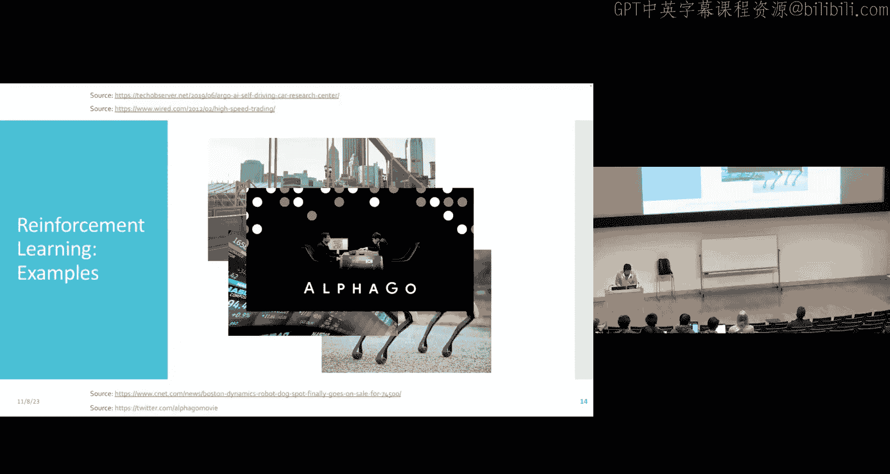
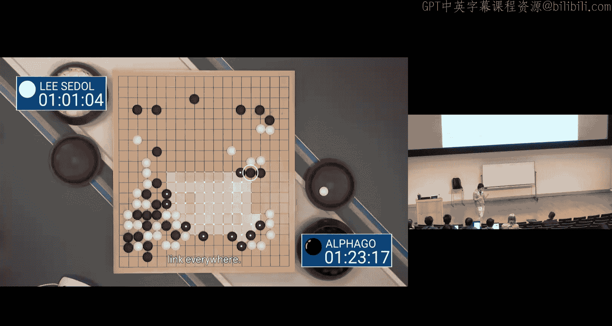
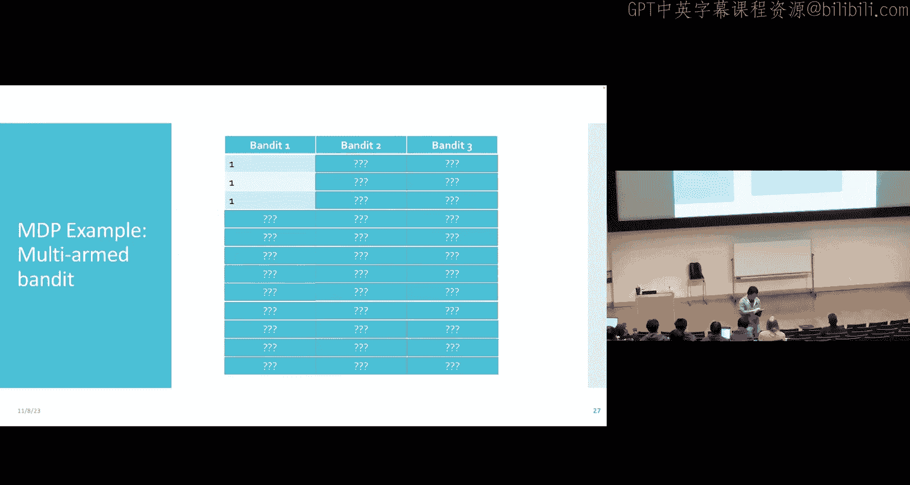
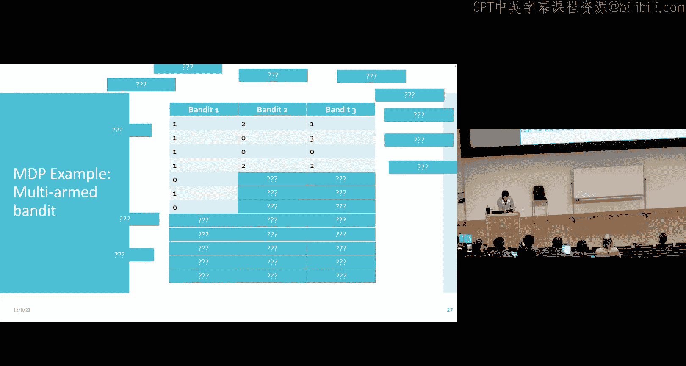
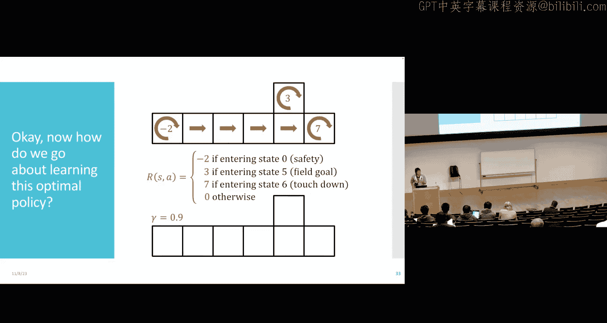

# 20：强化学习与马尔可夫决策过程

在本节课中，我们将学习一种全新的机器学习范式——强化学习。我们将从定义强化学习问题的基本组件开始，理解其与监督学习的核心区别，并介绍马尔可夫决策过程这一核心框架。

## 概述：什么是强化学习？

在监督学习中，我们学习的数据是特征 `X` 和标签 `Y` 的配对。而在强化学习中，我们学习的数据则完全不同。强化学习涉及一个智能体在与环境的交互中学习如何行动，其数据形式为 `(状态， 动作， 奖励， 下一个状态)` 这样的元组。

强化学习适用于那些没有明确“正确答案”或具有开放性的任务，例如游戏、机器人控制和自动驾驶等。

## 强化学习的基本组件

在定义强化学习问题之前，我们需要明确几个核心概念。

### 状态空间与动作空间

*   **状态空间 (State Space)**：描述了环境或世界的所有可能状态。例如，在自动驾驶中，状态可以是道路、交通标志和其他车辆的信息。
*   **动作空间 (Action Space)**：描述了智能体在所有可能状态下可以采取的所有动作。例如，在自动驾驶中，动作可以是左转、右转、加速或刹车。

### 奖励函数与转移函数

*   **奖励函数 (Reward Function)**：定义了在特定状态下采取特定动作后，智能体获得的即时“好处”或“惩罚”。奖励可以是确定性的，也可以是随机的。
*   **转移函数 (Transition Function)**：定义了在特定状态下采取特定动作后，环境将如何转移到下一个状态。转移也可以是确定性的或随机的。

智能体的目标是通过与环境交互，学习一个**策略 (Policy)**，即一个从状态到动作的映射函数 `π(s) -> a`，以最大化其长期累积奖励。

## 马尔可夫决策过程

马尔可夫决策过程是描述强化学习问题交互过程的标准框架。

### MDP 的交互循环

一个 MDP 的交互过程可以描述如下：
1.  在时间步 `t`，智能体观察当前状态 `s_t`。
2.  根据策略 `π`，智能体选择动作 `a_t = π(s_t)`。
3.  环境根据奖励函数 `R` 和转移函数 `T`，返回一个奖励 `r_t` 并转移到下一个状态 `s_{t+1}`。
4.  重复此过程。

这个循环产生的 `(s_t, a_t, r_t, s_{t+1})` 序列就是智能体的训练数据。

### 马尔可夫假设

MDP 的核心是**马尔可夫假设**：下一个状态 `s_{t+1}` 和即时奖励 `r_t` 的概率分布仅依赖于当前状态 `s_t` 和当前动作 `a_t`，而与之前的历史状态和动作无关。这个假设极大地简化了问题，使其在计算上变得可处理。

## 价值函数与目标

我们的目标是找到最优策略 `π*`。一个关键的工具是**价值函数 (Value Function)**。

### 价值函数的定义

策略 `π` 在状态 `s` 下的价值 `V^π(s)`，表示从状态 `s` 开始，始终遵循策略 `π` 所能获得的**期望累积折扣奖励**。

其公式可以表示为：
`V^π(s) = E[ r_t + γ * r_{t+1} + γ^2 * r_{t+2} + ... | s_t = s, π ]`
其中，`γ` (伽马) 是**折扣因子**，取值范围通常在 `0` 到 `1` 之间。它表示我们对未来奖励的重视程度，`γ` 越小，表示越重视即时奖励。

### 最优策略与价值函数的关系

最优策略 `π*` 就是在**每一个状态** `s` 下，都能使价值函数最大化的策略。即：
`π*(s) = argmax_a [ 即时奖励 + γ * V^π*(下一个状态) ]`
因此，求解强化学习问题通常转化为求解最优价值函数 `V*`。

## 探索与利用的权衡

在强化学习中，智能体需要自己收集数据。这带来了一个经典的两难问题：**探索与利用的权衡**。

*   **利用 (Exploitation)**：根据当前已知信息，选择看起来能带来最高奖励的动作。
*   **探索 (Exploration)**：尝试一些未知或当前看来非最优的动作，以收集更多信息，可能在未来发现更好的策略。

一个经典的例子是**多臂老虎机问题**：玩家面前有多台老虎机（臂），每台的奖励概率分布未知。玩家需要在不断尝试（探索）以了解每台机器的特性和选择当前收益最高的机器（利用）之间做出平衡。

## 总结

本节课我们一起学习了强化学习的基础知识。我们首先了解了强化学习与监督学习在数据形式上的根本区别。然后，我们定义了构成强化学习问题的四大组件：状态空间、动作空间、奖励函数和转移函数。接着，我们引入了马尔可夫决策过程作为描述智能体与环境交互的标准框架，并解释了其核心的马尔可夫假设。最后，我们探讨了智能体的学习目标——寻找最优策略，并引入了价值函数作为衡量策略好坏的关键工具，以及智能体在学习过程中面临的探索与利用的权衡问题。

在接下来的课程中，我们将深入探讨如何通过算法（如价值迭代、策略迭代和Q学习）来实际求解这些强化学习问题，并找到最优策略。