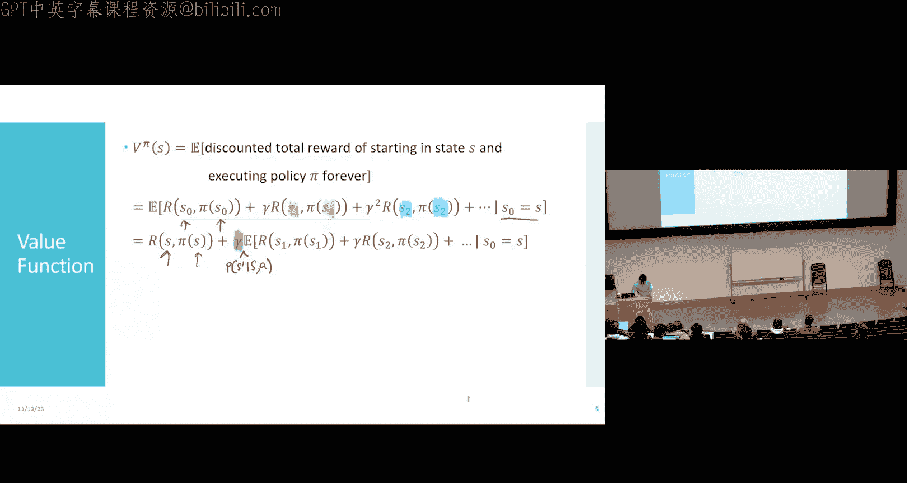
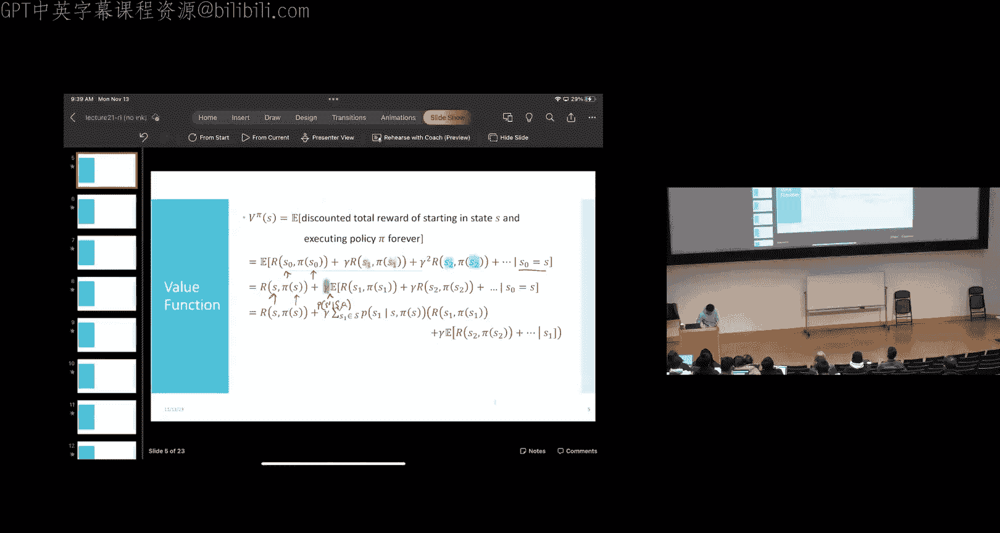
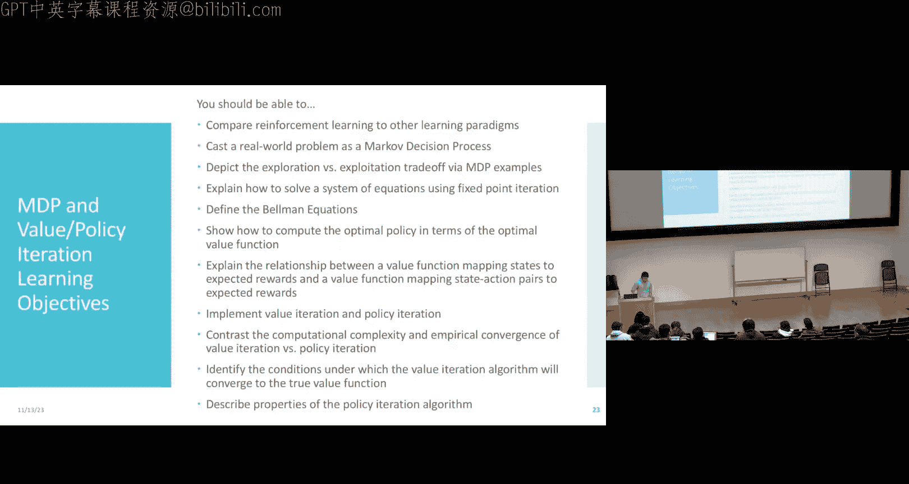

# 21：强化学习 - 价值与策略迭代 🎮

在本节课中，我们将学习如何解决强化学习问题。我们将深入探讨价值函数，并学习两种核心算法：价值迭代和策略迭代，它们能帮助我们找到最优策略。

---

## 回顾：价值函数与贝尔曼方程

上一节我们介绍了强化学习问题，并花费了大量时间思考一个称为**价值函数**的实体。今天我们将更深入地探讨它。

价值函数的一种形式化定义如下，你可以将其视为一个无限求和的期望，其中每一项是你在未来某个时间步获得的奖励，并乘以一个折扣因子 γ。这是具有随机转移和确定性奖励情况下的价值函数版本。

然而，在计算足球游戏的例子中，我们并没有直接计算这个无限和。我们使用了一个非常方便的捷径：你可以基于其他状态的价值来计算某个状态的价值，特别是基于你的策略将带你到达的那些状态的价值。

这里的直觉是，你可以利用其他状态的价值来计算当前状态的价值，并且这一切都与策略有关。接下来，我们将用数学来推导这一点。

---

## 贝尔曼方程的推导

我们从价值函数的定义开始，假设随机转移和确定性奖励：

\[
V^\pi(s) = \mathbb{E} \left[ \sum_{t=0}^{\infty} \gamma^t R(s_t, \pi(s_t)) \mid s_0 = s \right]
\]

首先，我们将初始状态 \( s_0 \) 设为我们要评估的状态 \( s \)，并将其移出期望：

\[
V^\pi(s) = R(s, \pi(s)) + \gamma \mathbb{E} \left[ \sum_{t=1}^{\infty} \gamma^{t-1} R(s_t, \pi(s_t)) \mid s_0 = s \right]
\]

接下来，我们处理期望中的第一项奖励 \( R(s_1, \pi(s_1)) \)。由于转移是随机的，我们可以将其重写为对所有可能的下一个状态 \( s_1 \) 的求和：

\[
V^\pi(s) = R(s, \pi(s)) + \gamma \sum_{s_1 \in \mathcal{S}} P(s_1 \mid s, \pi(s)) \left[ R(s_1, \pi(s_1)) + \gamma \mathbb{E} \left[ \sum_{t=2}^{\infty} \gamma^{t-2} R(s_t, \pi(s_t)) \mid s_1 \right] \right]
\]

观察括号内的部分，它正是从状态 \( s_1 \) 开始的价值函数 \( V^\pi(s_1) \) 的定义。因此，我们得到：

\[
V^\pi(s) = R(s, \pi(s)) + \gamma \sum_{s' \in \mathcal{S}} P(s' \mid s, \pi(s)) V^\pi(s')
\]

这就是**贝尔曼方程**。它表示一个状态的价值等于即时奖励加上所有可能下一个状态的折扣后期望价值。

关键点在于，对于状态空间 \(\mathcal{S}\) 中的每一个状态 \( s \)，我们都有这样一个方程。因此，我们得到了一个包含 \( |\mathcal{S}| \) 个方程和 \( |\mathcal{S}| \) 个变量的方程组。

---

## 最优价值函数与最优策略

贝尔曼方程对任何策略 \(\pi\) 都成立。但我们关心的是最优策略 \(\pi^*\) 及其对应的最优价值函数 \( V^* \)。

最优价值函数 \( V^*(s) \) 定义为在状态 \( s \) 下，通过选择最优行动所能获得的最佳可能价值：

\[
V^*(s) = \max_{a \in \mathcal{A}} \left[ R(s, a) + \gamma \sum_{s' \in \mathcal{S}} P(s' \mid s, a) V^*(s') \right]
\]

这被称为**贝尔曼最优方程**。同样，对于每个状态都有一个方程。

一旦我们求解出最优价值函数 \( V^* \)，就很容易推导出最优策略 \( \pi^* \)。在状态 \( s \) 下，最优行动就是最大化上述表达式的行动：

\[
\pi^*(s) = \arg\max_{a \in \mathcal{A}} \left[ R(s, a) + \gamma \sum_{s' \in \mathcal{S}} P(s' \mid s, a) V^*(s') \right]
\]

---

## 求解方法：不动点迭代

贝尔曼最优方程是一个非线性方程组（因为存在 max 操作符）。为了求解它，我们引入一个通用的数学技巧：**不动点迭代**。

假设我们有一个包含 n 个变量的方程组：
\[
x_1 = f_1(x_1, ..., x_n)
\]
\[
x_2 = f_2(x_1, ..., x_n)
\]
...
\[
x_n = f_n(x_1, ..., x_n)
\]

不动点迭代的算法如下：
1.  初始化所有变量的值，例如 \( x_1^0, x_2^0, ..., x_n^0 \)。
2.  对于迭代次数 t = 0, 1, 2, ...：
    *   计算新值：\( x_1^{t+1} = f_1(x_1^t, ..., x_n^t) \)
    *   计算新值：\( x_2^{t+1} = f_2(x_1^t, ..., x_n^t) \)
    *   ...
    *   计算新值：\( x_n^{t+1} = f_n(x_1^t, ..., x_n^t) \)
3.  重复步骤2，直到值的变化足够小（收敛）。

这个算法简单，但并不保证对所有方程组都收敛。然而，对于强化学习中的贝尔曼方程，由于折扣因子 γ < 1 确保了收缩性，我们可以证明不动点迭代会收敛到唯一解。

---

## 算法一：价值迭代

现在，我们将不动点迭代直接应用于贝尔曼最优方程，得到我们的第一个强化学习算法：**价值迭代**。

要实施价值迭代，你需要知道奖励函数 \( R(s, a) \) 和转移概率 \( P(s' \mid s, a) \)。

以下是**同步价值迭代**的步骤：

1.  **初始化**：对所有状态 \( s \in \mathcal{S} \)，设置价值估计 \( V_0(s) = 0 \)（或其他小随机数）。设 t = 0。
2.  **迭代更新**：当未收敛时（例如，最大价值变化 > ε）：
    *   对每个状态 \( s \in \mathcal{S} \)：
        *   对每个行动 \( a \in \mathcal{A} \)，计算“行动价值”：
          \[
          Q_t(s, a) = R(s, a) + \gamma \sum_{s' \in \mathcal{S}} P(s' \mid s, a) V_t(s')
          \]
        *   更新该状态的价值估计：
          \[
          V_{t+1}(s) = \max_{a \in \mathcal{A}} Q_t(s, a)
          \]
    *   t = t + 1
3.  **提取策略**：收敛后，最优策略为：
    \[
    \pi^*(s) = \arg\max_{a \in \mathcal{A}} \left[ R(s, a) + \gamma \sum_{s' \in \mathcal{S}} P(s' \mid s, a) V^*(s') \right]
    \]

在**异步价值迭代**中，我们只维护一个价值数组 \( V \)，并在每次更新状态 \( s \) 的价值时，直接使用数组中最新的 \( V(s') \) 值，而不是上一轮迭代的 \( V_t(s') \)。这节省了内存，但本质上是相同的算法。

**收敛性**：只要折扣因子 γ < 1，并且每个状态都被无限次访问（更新），价值迭代就能保证收敛到最优价值函数 \( V^* \)。一个实用的收敛条件是：当所有状态的价值变化最大值小于某个 ε 时，可以证明当前价值估计与最优价值的误差在 \( \frac{2 \gamma \epsilon}{1 - \gamma} \) 以内。

**计算复杂度**：价值迭代每次迭代需要计算所有状态-行动对的动作价值 Q。对于每个状态 \( s \) 和行动 \( a \)，计算 Q 需要对所有可能的下一个状态 \( s' \) 求和。因此，每次迭代的复杂度是 \( O(|\mathcal{S}|^2 |\mathcal{A}|) \。

---

## 算法二：策略迭代

价值迭代直接迭代价值函数。但既然我们最终目标是策略，能否直接对策略进行迭代？答案是肯定的，这就是**策略迭代**。

策略迭代的步骤如下：

1.  **初始化**：随机初始化一个策略 \( \pi_0 \)（例如，为每个状态随机选择一个行动）。
2.  **迭代改进**：
    a.  **策略评估**：给定当前策略 \( \pi_k \)，求解其对应的价值函数 \( V^{\pi_k} \)。这需要解以下线性方程组（没有 max 操作符）：
        \[
        V^{\pi_k}(s) = R(s, \pi_k(s)) + \gamma \sum_{s' \in \mathcal{S}} P(s' \mid s, \pi_k(s)) V^{\pi_k}(s')， \quad \forall s \in \mathcal{S}
        \]
    b.  **策略改进**：基于刚计算出的价值函数 \( V^{\pi_k} \)，在每个状态 \( s \) 选择看起来最好的行动，形成新策略 \( \pi_{k+1} \)：
        \[
        \pi_{k+1}(s) = \arg\max_{a \in \mathcal{A}} \left[ R(s, a) + \gamma \sum_{s' \in \mathcal{S}} P(s' \mid s, a) V^{\pi_k}(s') \right]
        \]
3.  **检查收敛**：如果对于所有状态 \( s \)，有 \( \pi_{k+1}(s) = \pi_k(s) \)，则算法收敛，\( \pi_k \) 即为最优策略。否则，返回步骤2。

**收敛性**：策略迭代的收敛性很容易判断——当策略不再变化时就收敛了。理论上，在最坏情况下，它可能需要遍历所有可能的策略。由于有 \( |\mathcal{S}| \) 个状态和 \( |\mathcal{A}| \) 个行动，可能的策略数最多为 \( |\mathcal{A}|^{|\mathcal{S}|} \)。但实践中，策略迭代通常比价值迭代收敛所需的迭代次数少得多。

**计算复杂度**：策略迭代每次迭代的主要开销在**策略评估**步骤，即求解一个 \( |\mathcal{S}| \) 元的线性方程组。使用标准方法（如高斯消元法）的复杂度是 \( O(|\mathcal{S}|^3) \)。虽然每次迭代比价值迭代昂贵，但所需的迭代次数通常少很多。

---

## 总结与展望

本节课我们一起学习了解决强化学习问题的两种核心动态规划算法：

*   **价值迭代**：直接对最优价值函数 \( V^* \) 进行不动点迭代。每次迭代复杂度为 \( O(|\mathcal{S}|^2 |\mathcal{A}|) \)，需要较多迭代次数，但每次迭代较快。
*   **策略迭代**：在策略空间进行迭代，交替进行策略评估和策略改进。每次迭代复杂度较高（\( O(|\mathcal{S}|^3) \)），但通常收敛所需的迭代次数少很多。

这两种算法都有一个共同的前提：**需要已知环境的完整模型**，即奖励函数 \( R(s, a) \) 和转移概率 \( P(s' \mid s, a) \)。此外，它们都要求状态和行动空间是离散且有限的，否则方程组将无法定义或求解。

在现实世界中，我们常常面临以下挑战：
1.  **模型未知**：我们不知道确切的奖励或转移动态。
2.  **状态/行动空间巨大或连续**：无法枚举所有状态或行动。

下节课，我们将探讨如何克服这些限制，引入不依赖于环境模型的算法，并介绍重要的 **Q-学习** 方法。