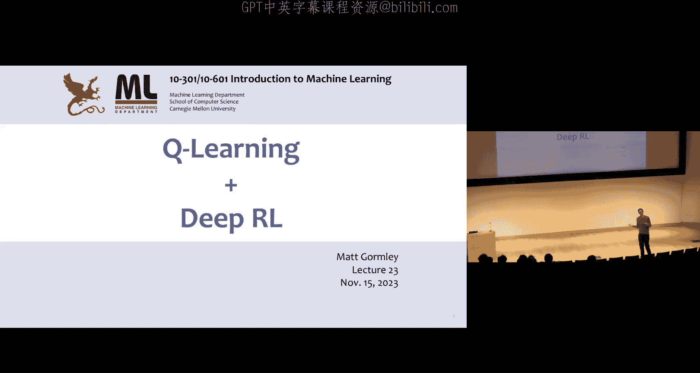
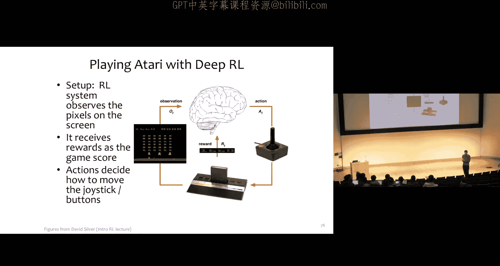
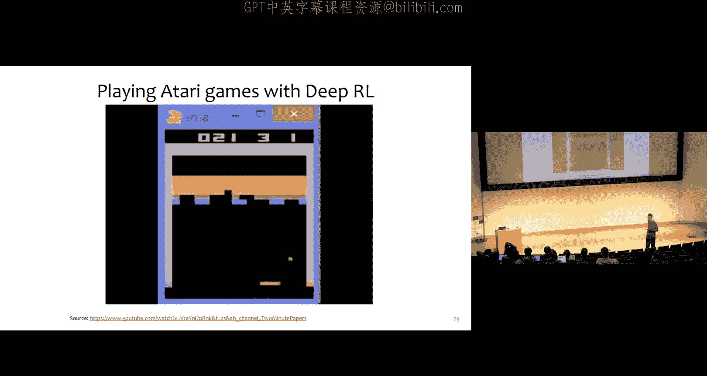
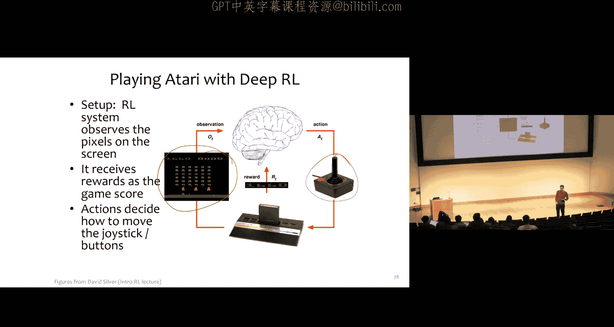

# 22：强化学习、Q学习与深度强化学习 🎮

在本节课中，我们将学习强化学习的核心算法——Q学习，并探讨如何将其与神经网络结合，形成强大的深度Q学习。我们将从动态规划算法出发，逐步引入在线学习和函数逼近的概念。

---

## 从动态规划到在线学习 🔄

上一节我们介绍了基于动态规划的强化学习算法，如值迭代和策略迭代。这些算法需要完全了解环境的奖励函数和状态转移概率。本节中，我们将探讨如何摆脱这些限制，实现一种更接近“在线学习”的算法。

### 值迭代算法回顾

值迭代算法通过不断更新一个价值表 `V(s)` 来寻找最优策略。其核心更新规则如下：

**公式：**
`V(s) = max_a [ R(s, a) + γ * Σ_{s'} P(s'|s, a) * V(s') ]`

其中：
*   `V(s)` 是状态 `s` 的价值。
*   `R(s, a)` 是采取行动 `a` 后获得的即时奖励。
*   `γ` 是折扣因子。
*   `P(s'|s, a)` 是从状态 `s` 采取行动 `a` 后转移到状态 `s'` 的概率。

该算法需要预先知道 `R` 和 `P`，这在许多现实问题中是不现实的。

---

## 引入Q函数与Q表 📊

为了摆脱对 `R` 和 `P` 的依赖，我们引入一个更强大的概念：Q函数。

### 什么是Q函数？

Q函数 `Q(s, a)` 表示在状态 `s` 下采取行动 `a`，并且之后都遵循最优策略所能获得的**预期总折扣奖励**。

**公式：**
`Q*(s, a) = R(s, a) + γ * Σ_{s'} P(s'|s, a) * max_{a'} Q*(s', a')`

与价值函数 `V(s)` 相比，Q函数的优势在于：**一旦我们知道了最优Q函数 `Q*`，就可以直接得到最优策略，而无需知道 `R` 和 `P`**。

**最优策略公式：**
`π*(s) = argmax_a Q*(s, a)`

我们不再需要维护一个价值表 `V(s)`，而是维护一个Q表 `Q(s, a)`，它记录了每个状态-动作对的价值。

---

## Q学习算法：在线更新的艺术 🧠

Q学习的核心思想是：让智能体通过与环境的实际交互（在线）来学习Q表，而不是预先计算所有动态。

### 基础Q学习算法（确定性环境）

以下是Q学习的基本步骤：

1.  **初始化**：将Q表 `Q(s, a)` 的所有值初始化为0。
2.  **循环（直到收敛）**：
    *   在当前状态 `s`，根据某种策略（如下文的ε-贪婪策略）选择一个行动 `a`。
    *   执行行动 `a`，环境返回即时奖励 `r` 和下一个状态 `s'`。
    *   **关键更新**：使用以下规则更新Q表：
        **公式：**
        `Q(s, a) ← r + γ * max_{a'} Q(s', a')`
    *   将当前状态更新为 `s'`。

这个更新规则实际上是**时序差分学习**的一种形式，它利用当前估计 `Q(s', a')` 来改进对 `Q(s, a)` 的估计。

### 处理探索与利用的平衡：ε-贪婪策略

如果智能体总是选择当前Q表认为最好的行动（贪婪策略），它可能永远无法发现更好的策略。因此，我们引入ε-贪婪策略：

**算法描述：**
*   以概率 `(1 - ε)` 选择**贪婪行动**：`a = argmax_{a} Q(s, a)`
*   以概率 `ε` 随机选择一个行动。

这保证了智能体在利用现有知识的同时，也有机会探索未知区域。只要 `ε > 0`，Q学习算法就能保证收敛。

### 处理随机环境

在随机环境中，状态转移和奖励可能是不确定的。此时，Q学习的更新规则需要稍作修改，以平滑地平均多次体验的结果：

**公式：**
`Q(s, a) ← (1 - α) * Q(s, a) + α * [ r + γ * max_{a'} Q(s', a') ]`

或者等价地：
`Q(s, a) ← Q(s, a) + α * [ r + γ * max_{a'} Q(s', a') - Q(s, a) ]`

其中 `α` 是学习率。这个更新可以看作是在当前估计值 `Q(s, a)` 上朝着目标值 `r + γ * max Q(s', a')` 迈出一小步。

---

## 从表格到函数：深度Q学习 🤖

当状态空间非常庞大（例如围棋、电子游戏像素画面）时，维护一个Q表变得不可能。深度Q学习的核心思想是：**用一个神经网络来近似Q函数**。

### 用神经网络近似Q函数

我们不再使用表格 `Q(s, a)`，而是定义一个参数化的函数 `Q(s, a; θ)`，其中 `θ` 是神经网络的权重。

**常见设计**：神经网络以状态特征 `s` 作为输入，输出一个向量，其中每个元素对应一个可能行动 `a` 的Q值。

**代码概念（线性近似）：**
对于每个行动 `k`，我们有一组参数 `θ_k`。那么 `Q(s, k; θ) = s · θ_k` （点积）。
这相当于为每个行动训练一个独立的线性回归模型。

### 深度Q学习算法

算法流程与表格Q学习类似，但更新对象从表格单元格变成了神经网络参数：

1.  初始化神经网络参数 `θ`。
2.  循环：
    *   根据当前策略（如ε-贪婪）选择行动 `a_t`，执行后获得 `(s_t, a_t, r_t, s_{t+1})`。
    *   计算**目标值** `y`：
        **公式：**
        `y = r_t + γ * max_{a'} Q(s_{t+1}, a'; θ)` （使用旧的参数 `θ` 计算）
    *   定义损失函数，衡量当前网络预测值与目标值的差距：
        **公式：**
        `L(θ) = [ y - Q(s_t, a_t; θ) ]^2`
    *   通过**随机梯度下降**更新网络参数 `θ`，以最小化这个损失。

### 经验回放：提升学习效率

直接从连续交互中学习的数据不是独立同分布的，且容易遗忘罕见经验。经验回放通过维护一个**回放缓冲区**来解决这个问题：

**算法描述：**
*   持续将智能体的体验 `(s, a, r, s')` 存入一个固定大小的缓冲区。
*   在训练时，随机从缓冲区中采样一批旧经验。
*   使用这批采样到的经验来计算损失并更新网络参数。

这种方法打破了数据间的相关性，使学习更稳定、更高效，是深度强化学习成功的关键技术之一。

---

## 总结 📝

本节课中我们一起学习了强化学习从理论到实践的关键发展：

1.  **从动态规划到在线学习**：我们回顾了值迭代，并指出了其对环境模型（`R`, `P`）的依赖问题。
2.  **Q学习**：通过引入Q函数和Q表，我们得到了一个可以在未知环境中通过在线交互进行学习的算法。ε-贪婪策略平衡了探索与利用。
3.  **深度Q学习**：面对巨大的状态空间，我们用神经网络 `Q(s, a; θ)` 取代Q表来近似Q函数。通过定义损失函数和利用随机梯度下降，我们可以训练这个网络。
4.  **关键技巧**：经验回放通过存储和随机重用过往经验，极大地提升了深度Q学习的稳定性和样本效率。

这些技术构成了现代深度强化学习的基石，并成功应用于从玩经典电子游戏到战胜人类围棋冠军等复杂任务中。