# 23：降维与主成分分析 (PCA) 🎯

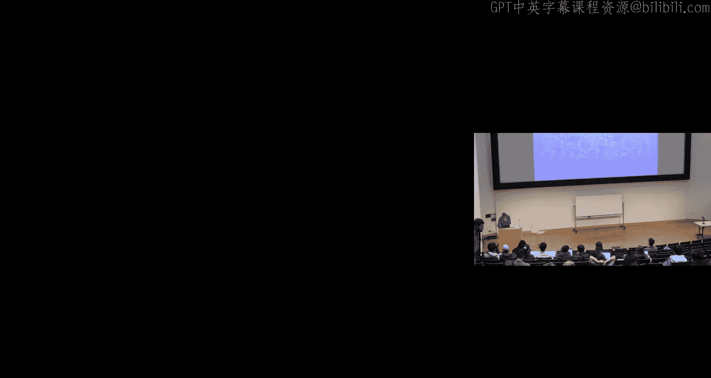

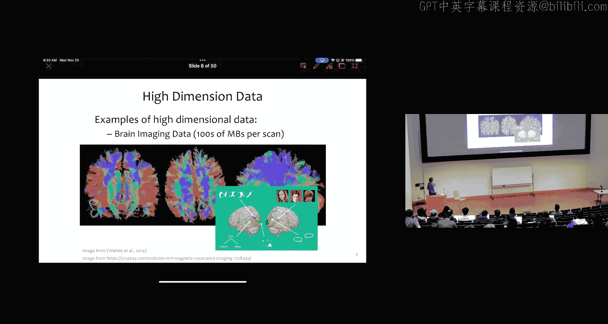

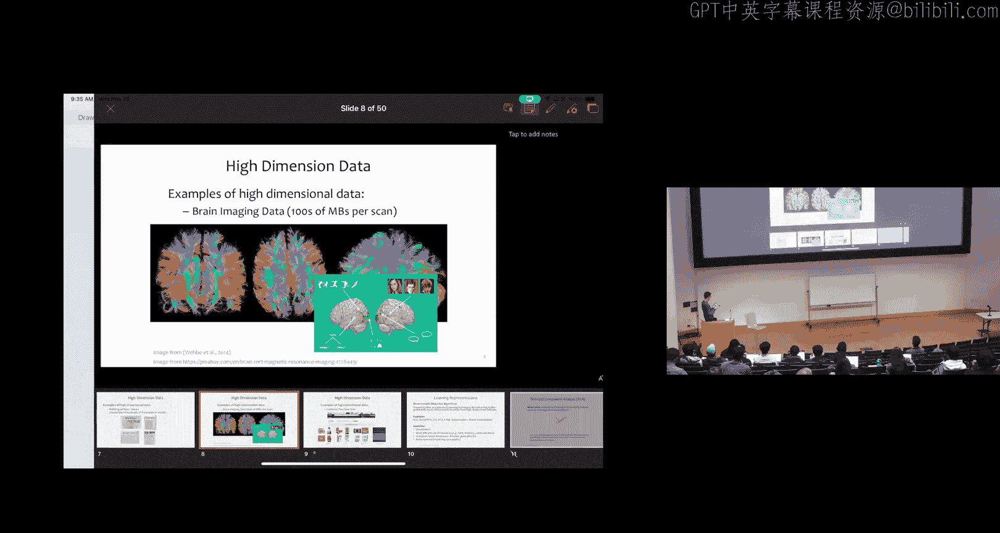

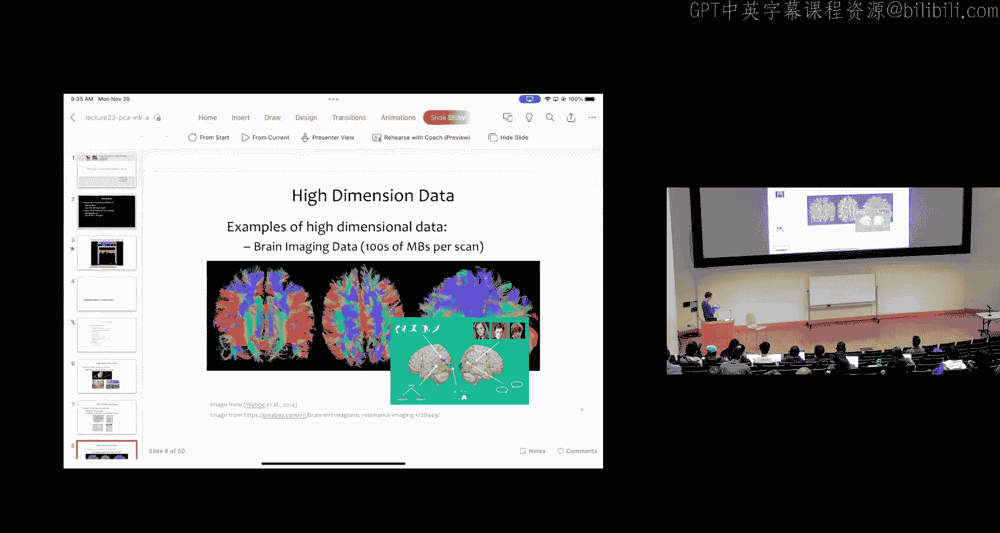

在本节课中，我们将要学习一个全新的主题——降维。我们将探讨什么是降维，为什么它很重要，并深入理解一种经典的线性降维方法：主成分分析。

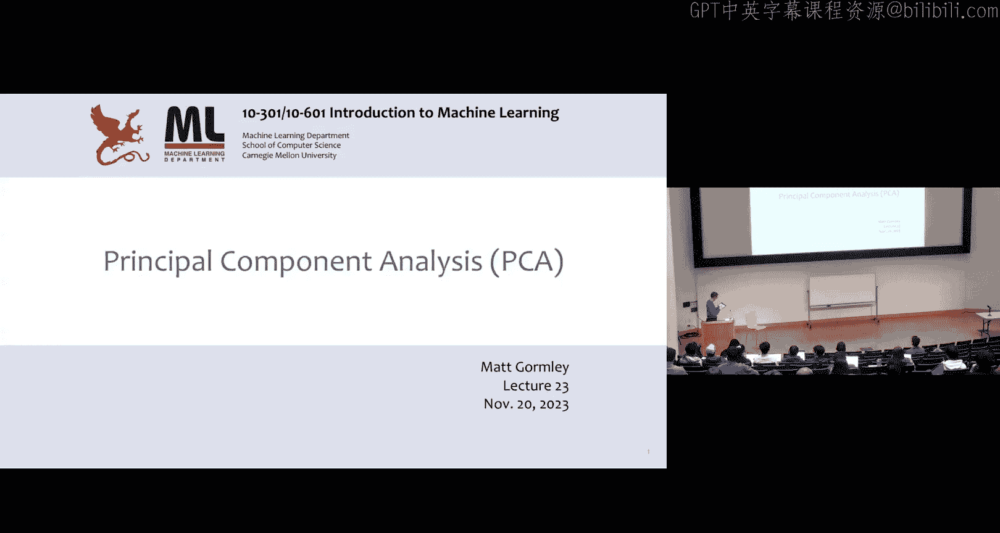

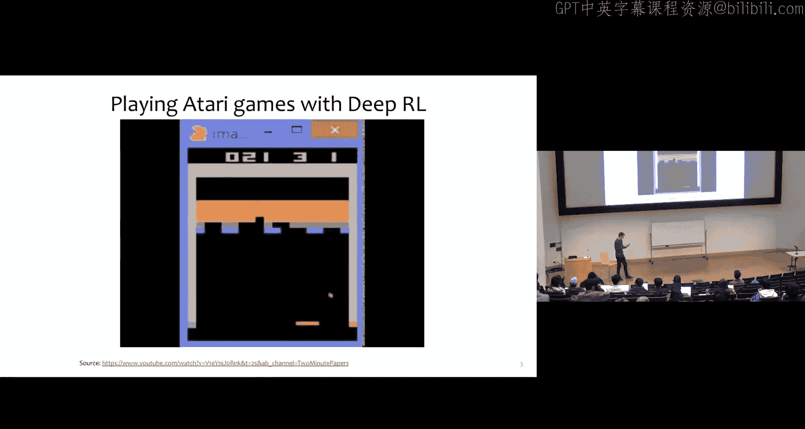

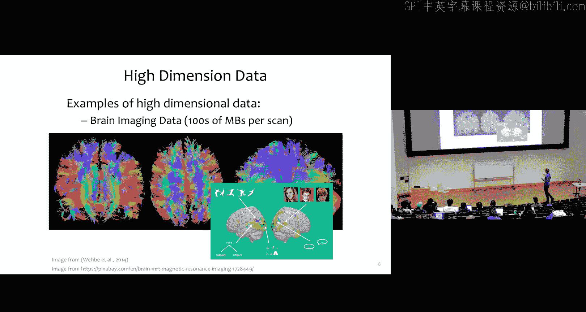

## 概述

降维的目标是将高维数据转换为低维表示，同时尽可能保留原始数据中的重要信息。这在处理具有数百万特征的数据（如图像、文本或脑成像数据）时非常有用。降维可以帮助我们可视化数据、提高计算效率、改善模型的泛化能力，甚至去除数据中的噪声。

上一节我们介绍了降维的基本概念，本节中我们来看看一种具体的降维算法。

## 从随机投影到主成分分析

我们首先思考一个简单的基线方法：随机投影。

### 随机投影：一个简单的起点

随机投影算法的思路是，我们想将数据从高维的 M 维空间降至低维的 K 维空间（M > K）。算法步骤如下：

1.  随机采样一个 K × M 的矩阵 **V**，其中每个元素独立地从标准正态分布 N(0,1) 中采样。
2.  对于每个 M 维数据点 **xᵢ**，通过 **uᵢ = Vxᵢ** 计算其低维表示 **uᵢ**（一个 K 维向量）。
3.  为了评估信息保留程度，我们可以通过 **x̃ᵢ = Vᵀuᵢ** 将数据投影回原始 M 维空间，并比较 **x̃ᵢ** 与原始 **xᵢ** 的差异。

随机投影虽然简单，但根据 Johnson-Lindenstrauss 引理，它能以很高的概率保持数据点之间的距离结构。然而，它的缺点是完全随机，没有利用数据本身的任何结构。

那么，我们能否做得比随机更好呢？答案是肯定的，这引出了主成分分析。

### 主成分分析 (PCA) 的核心思想

PCA 的核心假设是：数据近似位于一个低维的线性子空间（即一个超平面）上。我们的目标是找到这个子空间的“轴”（即主成分），然后将每个数据点投影到这个子空间上。

PCA 算法将为我们找到 K 个向量 **v₁, v₂, ..., vₖ**，它们彼此正交，并且能最小化数据投影前后的“重建误差”。

## PCA 的数学定义与目标

在深入算法细节前，我们先明确 PCA 要输出的数学对象是什么。

### 数据准备与协方差矩阵

我们假设有 N 个已中心化的 M 维数据点 **x₁, x₂, ..., x_N**（即数据的样本均值为零）。如果数据未中心化，只需先减去样本均值。

数据的样本协方差矩阵 **Σ** 是一个 M × M 的矩阵，定义为：
**Σ = (1/N) * XᵀX**
其中，**X** 是 N × M 的设计矩阵，每一行是一个数据点。

### PCA 的目标函数

PCA 寻找一个由 K 个正交单位向量 **vⱼ** 构成的投影矩阵。有两种等价的方式来定义寻找第一个主成分 **v₁** 的目标：

1.  **最小化重建误差**：我们希望投影后再重建回来的点 **x̃ᵢ** 与原始点 **xᵢ** 尽可能接近。
    `v₁ = argmin_{‖v‖=1} (1/N) Σᵢ ‖xᵢ - (vᵀxᵢ)v‖²`
2.  **最大化投影方差**：我们希望数据点在投影方向上的分布尽可能分散，即方差最大。
    `v₁ = argmax_{‖v‖=1} (1/N) Σᵢ (vᵀxᵢ)² = argmax_{‖v‖=1} vᵀΣv`

可以证明，最小化重建误差与最大化投影方差是等价的。直观上，保留信息最多（方差最大）的方向，自然也是重建时丢失信息最少（误差最小）的方向。

## PCA 的求解：特征值与特征向量

那么，如何找到这个最优的 **v** 呢？我们无法直接使用梯度下降，因为问题带有约束（‖v‖=1）。这里需要用到线性代数的工具。

### 拉格朗日乘子法与特征向量

我们将带约束的优化问题转化为拉格朗日函数：
`L(v, λ) = vᵀΣv - λ(vᵀv - 1)`
其中 λ 是拉格朗日乘子。

对 **v** 求导并令其为零，我们得到：
`Σv = λv`
这正是特征值和特征向量的定义式！因此，最优的 **v** 必须是协方差矩阵 **Σ** 的特征向量。

### 主成分即最大特征值对应的特征向量

进一步，我们将 `vᵀΣv` 代入特征方程：
`vᵀΣv = vᵀ(λv) = λ vᵀv = λ`
由于我们约束了 ‖v‖=1，所以 `vᵀv = 1`。

因此，最大化 `vᵀΣv` 等价于最大化特征值 λ。**结论是：第一个主成分 v₁ 就是协方差矩阵 Σ 最大特征值所对应的特征向量。**

同理，第二个主成分 **v₂** 是第二大特征值对应的特征向量，并且由于 **Σ** 是对称矩阵，其特征向量相互正交，这正好满足了 PCA 中主成分正交的要求。以此类推，第 K 个主成分就是第 K 大特征值对应的特征向量。

特征值 λ 的大小直接反映了数据在该主成分方向上的方差，即所保留的信息量。

## 如何计算主成分：算法实现

现在我们知道了 PCA 的目标是求协方差矩阵的前 K 大特征值对应的特征向量。以下是几种计算方法：

以下是几种计算主成分的常见方法：

1.  **幂迭代法**：一种迭代算法，每次求出一个主成分，然后从数据中减去该成分的影响，再求下一个。适合手动实现或只需前几个主成分的情况。
2.  **奇异值分解**：最常用且高效的方法。对中心化后的数据矩阵 **X** 进行奇异值分解：`X = USVᵀ`。
    *   矩阵 **V** 的列就是协方差矩阵 **Σ = (1/N)XᵀX** 的特征向量（即主成分）。
    *   对角矩阵 **S** 的奇异值 sₖ 满足 `sₖ²/N` 是对应的特征值 λₖ。
    *   由于 SVD 自动按奇异值降序排列，**V** 的前 K 列就是我们需要的前 K 个主成分。
3.  **随机化方法**：对于规模极大的数据集，可以使用随机算法来近似计算前 K 个主成分，速度更快，适用于大数据场景。

### 如何选择主成分数量 K？

没有固定的答案，但一个常用的方法是观察**累计解释方差比例**。
计算每个特征值 λᵢ 占总方差（所有特征值之和）的比例。然后从大到小累加这些比例，选择使累计比例达到预定阈值（如 90% 或 95%）的最小 K 值。

## PCA 实例：手写数字图像

让我们通过 MNIST 手写数字数据集的一个例子来直观感受 PCA 的效果。原始图像是 28×28=784 维。

*   **重建可视化**：将图像用不同数量的主成分 K 进行降维后再重建回 784 维。可以看到，即使 K 减少到 43（仅原维度的 5.5%），重建后的数字依然清晰可辨。当 K=11 时，虽然图像变得模糊，但基本形状仍得以保留。
*   **二维可视化**：将数据降至 K=2 维，然后在平面上画出。尽管 PCA 完全不知道图像的标签（数字0-9），但相同数字的点在二维空间中自然地聚集在了一起。这说明 PCA 成功捕捉到了数据中潜在的、与类别相关的结构。

## 总结

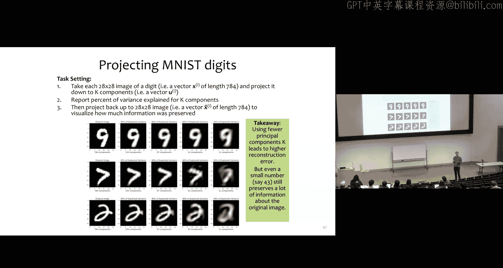

本节课中我们一起学习了降维与主成分分析。

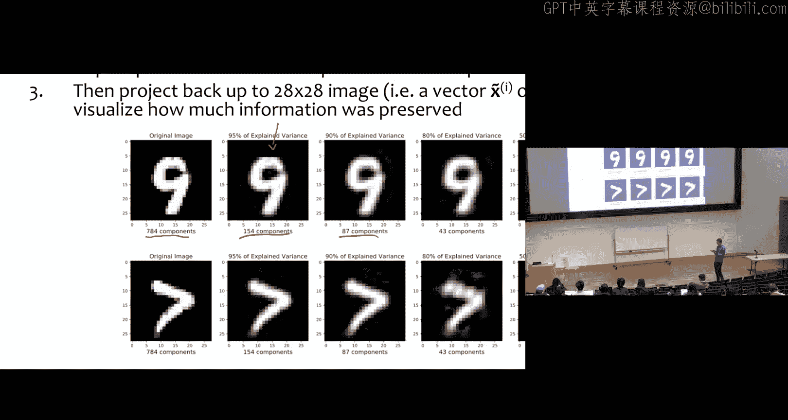

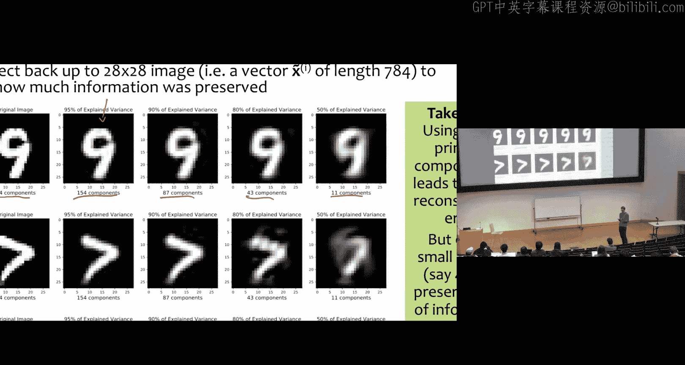

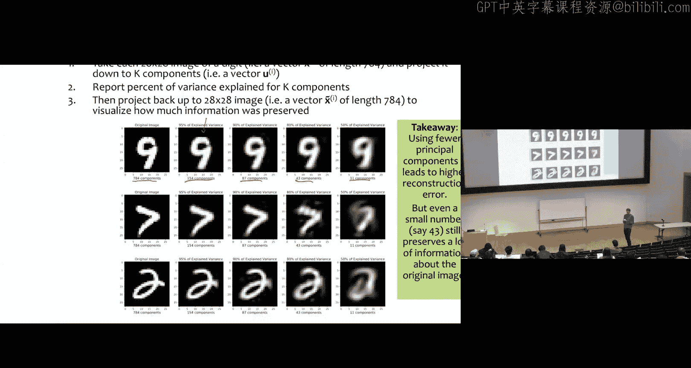

*   我们首先了解了降维的意义，并从简单的随机投影方法入手。
*   然后，我们深入探讨了 PCA 的原理，其核心是找到数据方差最大的正交方向（主成分）。
*   我们从数学上推导出，主成分就是数据协方差矩阵的特征向量，并且其重要性由对应的特征值大小决定。
*   接着，我们介绍了通过奇异值分解等算法来实际计算主成分，并讨论了如何选择主成分的数量 K。
*   最后，通过手写数字的实例，我们看到了 PCA 在压缩数据和发现数据结构方面的强大能力。

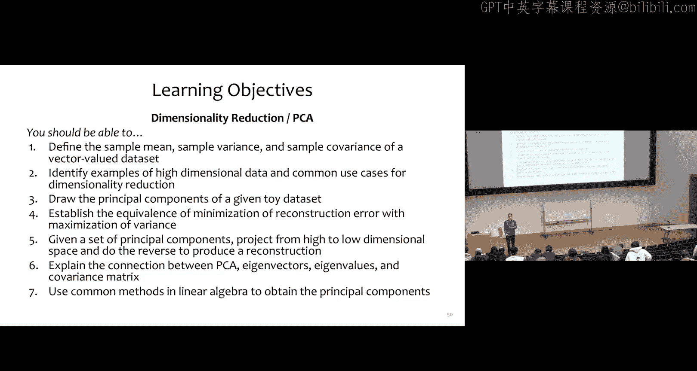

PCA 是一种强大而直观的无监督线性降维工具，是理解更复杂降维方法（如非线性方法、自编码器等）的重要基础。