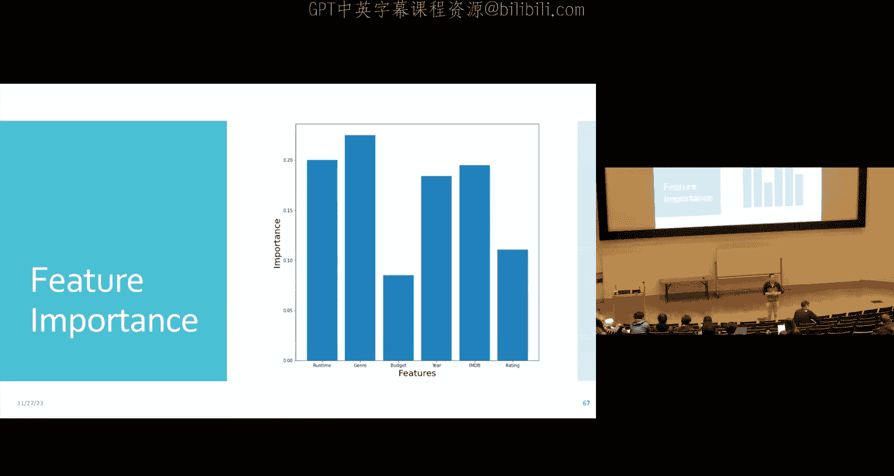

# 24：聚类与集成方法

在本节课中，我们将学习两种重要的机器学习技术。首先，我们将探讨一种无监督学习方法——聚类，特别是K-Means算法。然后，我们将转向集成方法，学习如何通过组合多个模型（如决策树）来构建更强大、更稳定的预测器，即随机森林。

---

## 聚类：K-Means算法

上一节我们介绍了无监督学习中的降维。本节中，我们来看看另一种无监督学习任务：聚类。聚类的目标是将未标记的数据点划分成若干个组或“簇”，使得同一簇内的数据点彼此相似。

### 问题定义与目标

我们采用基于划分的聚类方法。给定一个期望的簇数量K，算法需要将数据划分为K个互不相交的子集（簇）。核心问题有两个：如何定义优化目标（目标函数），以及如何求解这个优化问题。

为了定义“相似”，我们回顾K近邻分类中的思想：彼此靠近的点应该具有相似的标签。在聚类中，我们同样认为彼此靠近的点应该属于同一个簇。

以下是K-Means算法的核心目标函数。我们假设有K个簇，每个簇有一个中心点 μ_k。对于每个数据点 x_i，我们为其分配一个簇标签 z_i。目标是最小化每个数据点到其所属簇中心的距离总和。

**目标函数公式：**
`minimize Σ_i || x_i - μ_{z_i} ||`

### 块坐标下降法

直接优化上述目标函数是困难的。我们采用一种称为**块坐标下降**的优化策略。其核心思想是：将变量分组（块），每次固定一组变量，优化另一组变量，如此交替进行。

对于K-Means，变量自然分为两组：**簇中心** {μ_k} 和 **簇分配** {z_i}。我们可以交替执行以下两个简单步骤：
1.  固定簇中心，优化簇分配。
2.  固定簇分配，优化簇中心。

### K-Means算法步骤

以下是K-Means算法的具体流程：

1.  **输入**：未标记数据集 {x_1, ..., x_N}，簇数量 K。
2.  **初始化**：随机选择K个数据点作为初始簇中心 {μ_1, ..., μ_K}。
3.  **迭代直至收敛**：
    *   **分配步骤**：固定当前簇中心。将每个数据点 x_i 分配给距离它最近的簇中心。即，`z_i = argmin_k || x_i - μ_k ||`。
    *   **更新步骤**：固定当前簇分配。将每个簇的中心更新为该簇内所有数据点的平均值。即，`μ_k = (1/|C_k|) Σ_{i: z_i=k} x_i`，其中 C_k 是分配给簇k的数据点集合。
4.  **输出**：最终的簇分配 {z_i} 和簇中心 {μ_k}。

当连续两次迭代中，簇分配不再发生变化时，算法收敛。

### 算法细节与挑战

**如何选择K值？**
直接最小化目标函数来选择K会导致选择K=N（每个点一个簇），这没有意义。一个常见的方法是寻找“肘点”，即目标函数值随K增加而下降的速率出现明显拐点的位置。

**初始化的重要性**
K-Means的目标函数是非凸的，存在许多局部最优解。不同的初始化可能导致不同的结果。标准的随机初始化（Lloyd方法）可能收敛到较差的局部最优解。

**K-Means++初始化**
为了得到更好的初始中心，可以采用K-Means++方法：
1.  随机选择一个数据点作为第一个簇中心。
2.  对于每个尚未被选为中心的数据点，计算其与最近已选中心点的距离 D(x)。
3.  依据概率 `D(x)^2 / Σ D(x)^2` 随机选择一个新数据点作为下一个中心。
4.  重复步骤2-3，直到选出K个中心。
这种方法倾向于选择彼此远离的点作为初始中心，有助于改善最终聚类质量。

**随机重启**
另一种应对局部最优的策略是进行多次随机初始化，运行完整的K-Means算法，最后选择目标函数值最小的那次结果作为最终输出。

---

## 集成方法：从决策树到随机森林

上一节我们学习了K-Means聚类。本节中，我们来看看一种提升模型性能的通用技术：集成方法。其核心思想是结合多个“基础学习器”的预测，以获得比任何单一模型都更强大、更稳定的预测器。

### 集成方法的动机

以决策树为例，决策树是一种**高方差**模型。这意味着训练数据的微小变化（例如，改变一个数据点的标签）可能导致学习到的树结构发生巨大变化。这种不稳定性可能影响预测的可靠性。

集成方法通过组合多个不同的决策树（形成一个“森林”）来降低整体模型的方差。数学上，如果我们将每个树的预测视为一个随机变量，那么对B个独立同分布的预测取平均，可以将方差降低为原来的 `1/B`。

### 随机森林的构建

为了构建有效的集成，我们需要生成一组**多样化的**决策树。随机森林通过两种“装袋”技术引入随机性来实现多样性：

1.  **样本装袋**：对原始训练数据进行**有放回抽样**，生成多个不同的自助样本集。每个决策树在一个不同的自助样本集上训练。这确保了每棵树看到的数据分布略有不同。
2.  **特征装袋**：在决策树构建过程中的**每个节点**，不是从所有特征中选择最佳分裂特征，而是先随机抽取一个特征子集（例如，√d 个特征，d为总特征数），然后仅从这个子集中选择最佳分裂特征。这进一步增加了树之间的差异性。

将样本装袋和特征装袋结合，就得到了随机森林算法。

### 随机森林算法

以下是随机森林算法的概要：

1.  **输入**：训练数据集 D，树的数量 B，每节点候选特征数 ρ。
2.  **对于 b = 1 到 B**：
    *   通过有放回抽样从 D 中生成一个自助样本集 D_b。
    *   使用特征装袋（每节点从全部特征中随机选取 ρ 个）在 D_b 上训练一棵决策树 T_b。
3.  **输出**：集成模型。对于回归任务，输出为所有树预测的平均值：`T̄(x) = (1/B) Σ_{b=1}^B T_b(x)`。对于分类任务，输出为所有树预测的众数（多数投票）。

### 超参数调优与袋外误差

随机森林有两个主要超参数：树的数量 B 和每节点候选特征数 ρ。

调优这些参数通常需要验证集。然而，随机森林提供了一个内置的验证工具——**袋外误差**。由于每棵树只使用了约63%的原始数据（有放回抽样的结果）进行训练，剩下的约37%的数据点对该树而言就是“袋外”数据。我们可以用这些袋外数据来评估该树的性能。最终，将所有树的袋外预测误差汇总，就得到了整个森林的袋外误差估计，它可以作为验证误差的有效代理，用于超参数选择。

### 特征重要性

随机森林另一个有用的副产品是**特征重要性**评估。其基本思想是：如果一个特征在众多树的许多重要节点（即能带来较大信息增益/纯度提升的节点）上被用于分裂，那么它就是一个重要特征。通过统计所有树中每个特征带来的纯度提升总量（通常按到达该节点的样本数加权），我们可以对特征进行排序，从而了解哪些特征对模型的预测贡献最大。

---

本节课中我们一起学习了两种核心的机器学习技术。首先，我们深入探讨了K-Means聚类算法，理解了其通过交替优化簇中心和分配来划分数据的过程，以及初始化、K值选择等实际问题。接着，我们学习了集成方法的思想，并详细介绍了随机森林如何通过样本装袋和特征装袋来构建多样化的决策树集合，从而降低方差、提升模型性能，同时还能评估特征重要性。这些方法为处理无监督学习任务和提升模型鲁棒性提供了强大的工具。