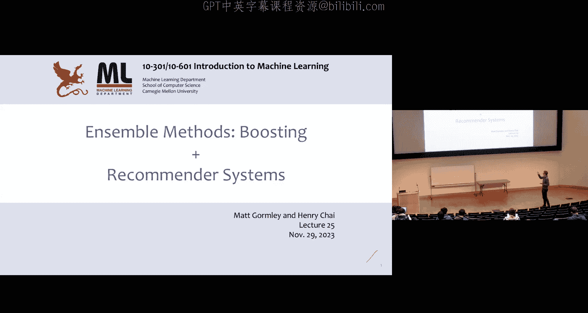
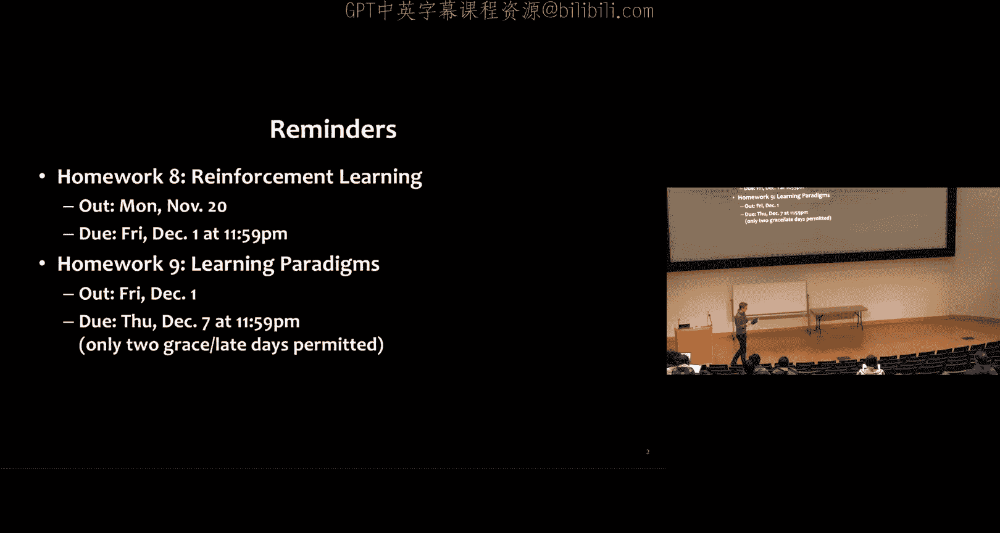
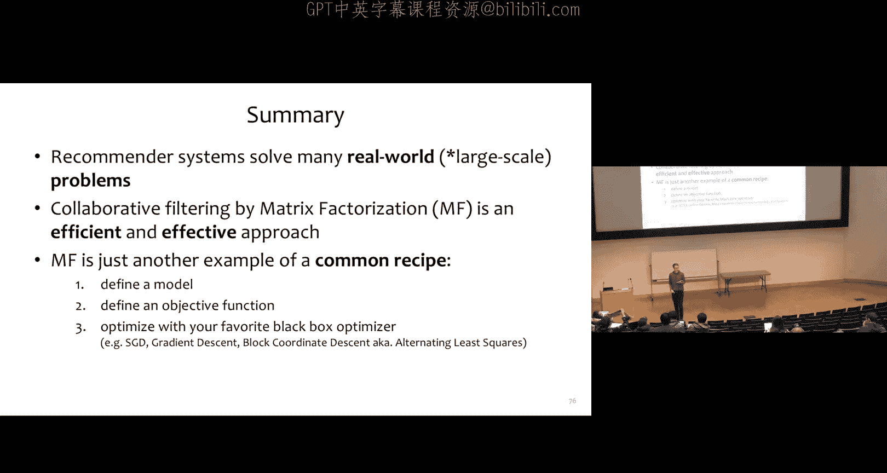

# 25：集成方法与推荐系统

在本节课中，我们将要学习两种重要的机器学习范式：集成方法中的提升法，以及推荐系统。我们将从回顾加权多数算法开始，深入探讨AdaBoost如何将弱学习器组合成强学习器。随后，我们将转向推荐系统，重点介绍协同过滤中的矩阵分解方法。

---

## 集成方法：提升法

上一节我们介绍了集成方法中的装袋法。本节中，我们来看看一种互补且形式迥异的方法——提升法。

### 加权多数算法

加权多数算法是一种简单而优雅的算法，用于在线学习环境中组合一组预训练的二元分类器。

**算法步骤如下：**
1.  初始化：为池中的每个分类器分配相等的权重。
2.  接收一个训练样本。
3.  预测：根据分类器的加权多数投票进行预测。
4.  更新权重：如果加权多数投票预测错误，则将导致错误的分类器的权重乘以一个因子 `β`（`0 < β < 1`）。

**数学描述：**
假设我们有一个分类器池 `A`，包含 `T` 个分类器 `h_1, h_2, ..., h_T`，每个分类器将 `m` 维向量映射到 `{+1, -1}`。令 `α_t` 为分类器 `h_t` 的权重。
*   初始化：`α_t = 1`。
*   对于每个训练样本 `(x, y)`：
    *   预测：`ĥ(x) = sign( Σ_{t=1}^{T} α_t * h_t(x) )`
    *   如果 `y ≠ ĥ(x)`，则对于每个分类器 `t`，如果 `h_t(x) ≠ y`，则更新 `α_t = β * α_t`。

该算法与感知机类似，也有错误界限理论保证。

### AdaBoost算法

与加权多数算法不同，AdaBoost同时学习分类器本身以及组合它们的权重。它回答了一个核心问题：能否高效地组合多个仅比随机猜测略好的弱学习器，以获得一个任意低错误的强学习器？

以下是AdaBoost的工作原理：

**算法步骤如下：**
1.  初始化：为每个训练样本 `i` 分配初始权重 `D_1(i) = 1/m`。
2.  对于每一轮 `t = 1 to T`：
    a. 使用当前权重分布 `D_t` 训练一个弱学习器，得到假设 `h_t`。
    b. 计算 `h_t` 的加权错误率：`ε_t = Σ_{i: h_t(x_i) ≠ y_i} D_t(i)`。
    c. 计算该分类器的权重：`α_t = (1/2) * ln( (1 - ε_t) / ε_t )`。
    d. 更新样本权重：对于每个样本 `i`，`D_{t+1}(i) = (D_t(i) / Z_t) * exp( -α_t * y_i * h_t(x_i) )`，其中 `Z_t` 是归一化因子。
3.  最终假设：`H(x) = sign( Σ_{t=1}^{T} α_t * h_t(x) )`。

**核心概念解释：**
*   **弱学习器**：错误率仅略优于随机猜测（例如，错误率 `ε_t < 0.5`）的分类器。
*   **权重 `α_t`**：当错误率 `ε_t` 低时，`α_t` 为正且较大，赋予该分类器更高权重；当错误率 `ε_t` 高时，`α_t` 为负，实际上会降低其影响力。
*   **样本权重更新**：算法会增加被错误分类样本的权重，迫使后续的弱学习器更关注这些难例。

AdaBoost具有理论保证：如果每个弱假设都略优于随机猜测，则训练误差会呈指数级下降。有趣的是，即使训练误差已达到零，测试误差仍可能继续下降，显示出一定的自正则化特性。

### 偏差-方差分解

为了理解装袋法和提升法分别适用于何种场景，我们需要回顾偏差-方差分解的概念。

对于回归问题，均方误差可以分解为：
`MSE = Bias² + Variance + σ²`
其中：
*   **偏差**：模型预测值的期望与真实目标函数期望之间的差异。高偏差通常意味着模型过于简单，存在欠拟合。
*   **方差**：模型对于不同训练集的敏感性。高方差意味着模型对数据中的噪声过于敏感，存在过拟合。

在分类中，可以通过将预测视为概率来应用类似的思想。

**两种集成方法的对比：**
*   **装袋法**：通过自助采样构建多个高方差、低偏差的模型（如深度决策树），然后取平均以降低方差。适用于模型本身容易过拟合的场景。
*   **提升法**：顺序训练多个高偏差、低方差（即简单）的弱学习器（如深度为1的决策树），并通过加权组合来降低偏差。适用于模型本身容易欠拟合的场景。

---

## 推荐系统

现在，让我们将注意力转向推荐系统，并以著名的Netflix竞赛作为动机示例。

### 问题定义与类型

推荐系统的目标是根据用户的历史行为（如评分），预测他们可能喜欢的新物品（如电影、商品），以提升用户参与度或商业利润。

主要有两种类型的推荐系统：

1.  **基于内容的过滤**：需要物品的**侧信息**（如电影的类型、导演、演员）。通过分析用户喜欢过的物品的特征，来推荐具有相似特征的物品。**优点**是新物品加入后可以立即被推荐。**缺点**是严重依赖高质量的特征工程。
2.  **协同过滤**：仅使用**用户-物品评分矩阵**，无需任何侧信息。其核心洞察是：用户的口味是相关的。如果用户A和B都喜欢物品X，而用户A还喜欢物品Y，那么用户B也可能喜欢Y。**缺点**是无法处理没有评分的新物品（冷启动问题）。

### 协同过滤方法

我们将重点介绍两种协同过滤方法：邻域方法和潜在因子方法。

#### 邻域方法

这种方法直观且简单。

**算法步骤如下：**
1.  为目标用户找到其评分过的所有物品。
2.  在数据库中寻找也评分过这些物品的其他用户。
3.  将这些“相似用户”评分过、但目标用户未评分过的物品收集起来。
4.  根据这些物品被“相似用户”评分的次数进行排序和推荐。

#### 潜在因子方法与矩阵分解

这是一种更现代、更强大的方法。其核心思想是假设用户和物品都存在于一个低维的“潜在空间”中，用户的偏好和物品的特性都可以用该空间中的向量表示。推荐基于用户向量和物品向量在该空间中的接近程度。

**矩阵分解**是实现潜在因子模型的主要技术。我们的目标是将稀疏的评分矩阵 `R`（`m` 个用户 × `n` 个物品）近似分解为两个低秩矩阵的乘积：
`R ≈ U * V^T`
其中：
*   `U` 是 `m × k` 的用户因子矩阵，每一行 `u_i` 是用户 `i` 在 `k` 维潜在空间中的向量。
*   `V` 是 `n × k` 的物品因子矩阵，每一行 `v_j` 是物品 `j` 在 `k` 维潜在空间中的向量。
*   `k` 是潜在因子的数量，远小于 `m` 和 `n`。

预测用户 `i` 对物品 `j` 的评分即为两个向量的点积：`r̂_{ij} = u_i · v_j`。

**优化目标：**
我们通过最小化观测评分的预测误差来学习 `U` 和 `V`。定义观测评分索引集合为 `Z`，目标函数为：
`J(U, V) = (1/2) * Σ_{(i,j)∈Z} (r_{ij} - u_i · v_j)² + (λ/2) * (||U||²_F + ||V||²_F)`
其中第二项是正则化项，用于防止过拟合，`λ` 是正则化系数。

**优化算法：**
1.  **随机梯度下降**：每次迭代随机采样一个观测评分 `(i, j)`，计算预测误差，然后更新对应的用户向量 `u_i` 和物品向量 `v_j`。这是最常用的方法。
2.  **交替最小二乘法**：固定 `V`，优化 `U` 是一个最小二乘问题，可解析求解；然后固定 `U`，优化 `V`。如此交替进行。

在实际的Netflix数据上，学习到的潜在因子通常具有可解释性，例如可能对应“喜剧程度”、“动作程度”等隐含维度。

---

## 总结

本节课中我们一起学习了：
1.  **集成方法——提升法**：我们深入探讨了AdaBoost算法，它通过顺序训练弱学习器并调整样本权重，将多个简单模型组合成一个强大的模型。我们还对比了提升法（主要降低偏差）和装袋法（主要降低方差）的不同适用场景。
2.  **推荐系统**：我们介绍了推荐系统的基本类型，重点讲解了协同过滤。在协同过滤中，我们学习了简单的邻域方法和更强大的潜在因子方法，后者通过矩阵分解将用户和物品映射到共享的潜在空间，并通过优化预测评分来学习这些表示。

这两种技术虽然在应用上不同，但都体现了机器学习中组合信息与挖掘数据潜在结构的核心思想。