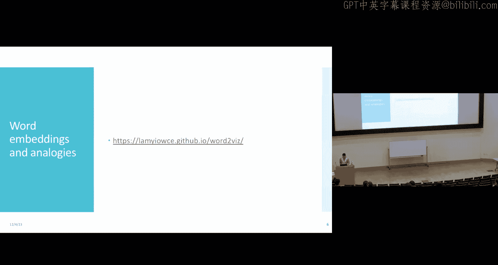
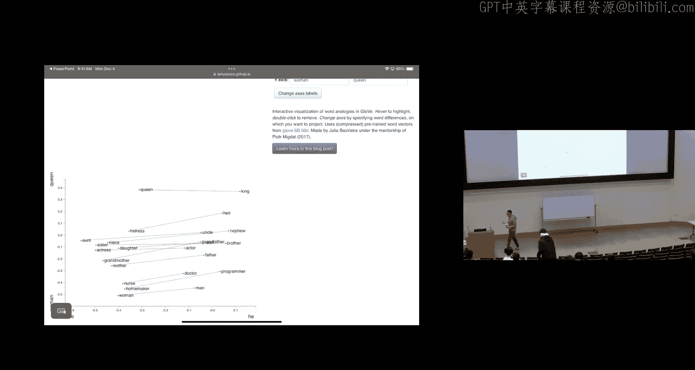
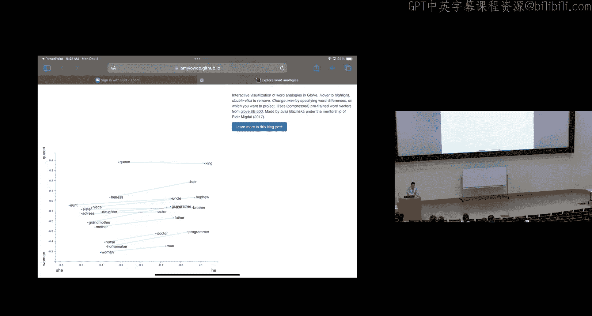
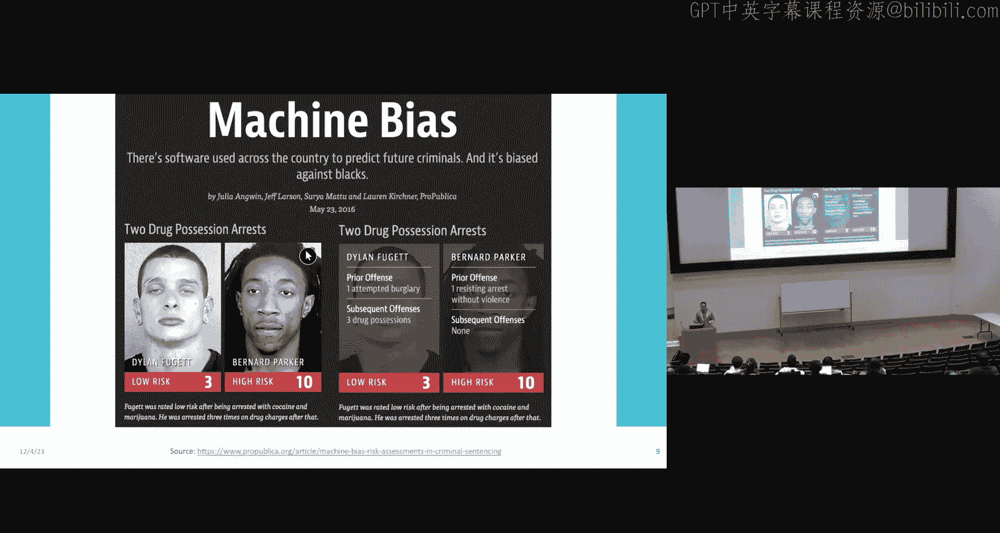
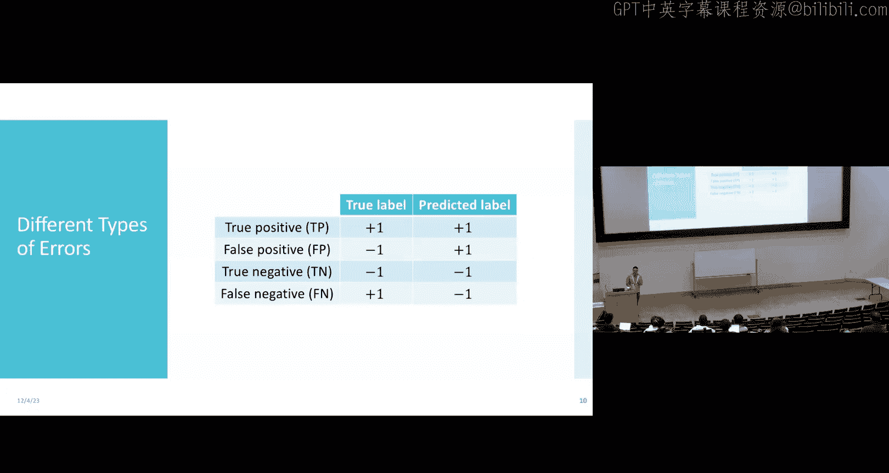
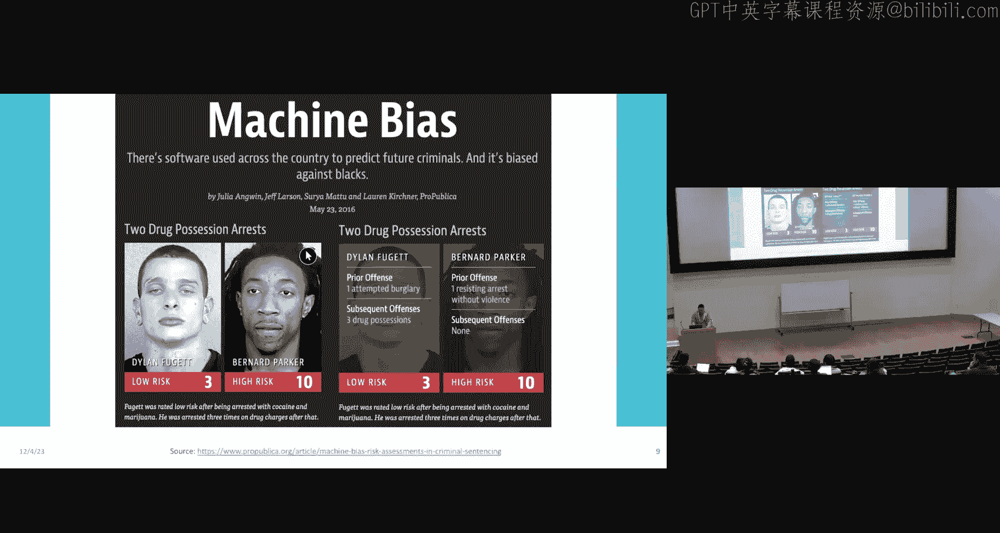
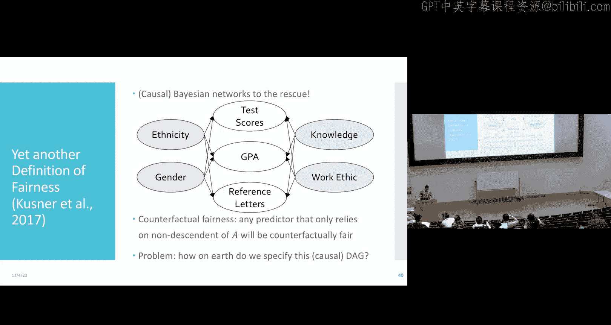

# 26：算法偏见与公平性 🧠

在本节课中，我们将探讨机器学习算法在实际应用中可能产生的偏见问题，以及如何定义和应对这些偏见。我们将从几个现实案例出发，理解偏见产生的原因，并学习几种衡量和缓解偏见的统计方法。

---

## 算法偏见的现实案例 📸

上一节我们介绍了课程安排，本节中我们来看看算法偏见的具体表现。

### 案例一：面部识别中的偏见

2010年，有报道指出某些相机的“眨眼检测”功能在识别非白种人面孔时频繁出错。当用户尝试为亚洲面孔拍照时，相机软件会错误地提示“有人眨眼了”。问题根源在于，该软件的图像识别算法主要是在白种人面孔的数据集上训练的。当应用于训练数据分布之外的面孔时，其性能会显著下降。

### 案例二：智能手机面部解锁的偏见

2017年，苹果iPhone X的面部识别系统（Face ID）被曝出存在类似问题。有报道称，两名中国女性可以互相解锁对方的手机。后续调查发现，当时的面部识别模型主要是在男性白种人面孔的数据集上训练的。这种训练数据的偏差导致了跨种族和跨性别识别时的严重错误。

### 案例三：词嵌入模型中的社会偏见

即使在文本数据上训练的大型语言模型，也无法避免偏见。例如，在GloVe等词嵌入模型中，研究者发现了令人担忧的类比关系：
*   `程序员` 之于 `男人`，如同 `家庭主妇` 之于 `女人`。
*   `医生` 之于 `男人`，如同 `护士` 之于 `女人`。

这些关联并非模型“发明”的，而是从训练数据（如维基百科、推特）中学习到的社会现有偏见的反映。模型放大了数据中存在的刻板印象。

### 案例四：大型语言模型中的代词指代偏见

研究显示，当给大型语言模型一个模糊的句子（例如：“医生给护士打了电话，因为她早班迟到了。”），模型倾向于将“她”与护士（女性化职业）关联，将“他”与医生（男性化职业）关联。这种偏见在模型被要求解释其推理时更为明显。

---

## 偏见的核心：分类错误与代价 ⚖️

上一节我们看到了偏见的具体案例，本节中我们来看看如何从技术角度量化这些错误。

在二元分类任务中，模型可能犯两种错误：
1.  **假阴性**：将实际为正例的样本预测为负例。公式表示为：`FN`。
2.  **假阳性**：将实际为负例的样本预测为正例。公式表示为：`FP`。

在诸如司法系统的应用中，这两种错误的代价截然不同。例如，在一个预测罪犯再犯风险的系统中：
*   **假阳性**：预测某人会再犯（高风险）而将其长期监禁，但实际他不会再犯。这可能导致不公正的监禁。
*   **假阴性**：预测某人不会再犯（低风险）而将其释放，但实际他再次犯罪。这给社会带来了风险。

许多场景下，准确率并非合适的评估指标，尤其是在类别不平衡或错误代价不对称时。

---

## 超越准确率：精确率、召回率与F1分数 📊

由于准确率的局限性，我们需要引入更细致的评估指标。

以下是两个核心指标的定义：

*   **精确率**：在所有被模型预测为正例的样本中，真正为正例的比例。它关注**假阳性**。
    *   公式：`Precision = TP / (TP + FP)`
*   **召回率**：在所有实际为正例的样本中，被模型正确预测出来的比例。它关注**假阴性**。
    *   公式：`Recall = TP / (TP + FN)`

为了在两者间取得平衡，我们常用**F1分数**，它是精确率和召回率的调和平均数。
*   公式：`F1 = 2 * (Precision * Recall) / (Precision + Recall)`

---

## 算法公平性的定义与困境 🎯

上一节我们学习了评估分类器性能的替代指标，本节中我们利用这些概念来形式化地定义算法公平性。

我们以一个大学录取的简化场景为例：
*   **特征**：分为**受保护特征**（如性别、种族）和**非保护特征**（如GPA、考试成绩）。
*   **目标**：模型根据特征预测是否录取学生（动作），其隐含目标是预测学生能否成功（真实结果）。

### 定义一：独立性

要求模型的预测结果与受保护特征统计独立。
*   **含义**：不同群体被录取的总体概率应该相同。
*   **数学表达**：`P(Ŷ=1 | A=a_i) = P(Ŷ=1 | A=a_j)` 对所有 `i, j` 成立。
*   **问题**：一个总是录取所有人的“懒惰”模型也满足此定义，但这毫无意义。它可能掩盖了模型在子群体内的性能差异。

### 定义二：分离性

要求模型的预测结果在给定真实结果的情况下，与受保护特征独立。
*   **含义**：在“合格”与“不合格”的申请者中，不同群体被录取的概率应该相同。这要求**假阳性率**和**假阴性率**在不同群体间相等。
*   **数学表达**：`P(Ŷ=1 | Y=y, A=a_i) = P(Ŷ=1 | Y=y, A=a_j)` 对所有 `i, j` 和 `y` 成立。
*   **问题**：它依赖于历史数据中的真实标签 `Y`。如果历史录取决策本身存在偏见（例如，某些群体更难被录取或被认为“成功”），那么基于此训练的模型会**固化甚至放大**历史偏见。

### 定义三：充分性

要求真实结果在给定模型预测的情况下，与受保护特征独立。
*   **含义**：对于获得相同预测分数（例如，被判定为有80%成功概率）的申请者，其实际成功的概率不应因群体而异。这要求模型预测是**校准**的。
*   **数学表达**：`P(Y=1 | Ŷ=s, A=a_i) = P(Y=1 | Ŷ=s, A=a_j)` 对所有 `i, j` 和分数 `s` 成立。
*   **问题**：许多标准模型（如逻辑回归）天生倾向于产生校准的概率预测，因此可能“免费”满足此定义。但这可能让人误以为现状已是公平的。

### 公平性定义的困境

一个关键且令人沮丧的结论是：**在受保护特征与非保护特征相关（这几乎是现实世界的常态）的情况下，独立性、分离性和充分性这三个定义是互不相容的**。你无法同时满足它们。这意味着追求算法公平性必然涉及艰难的权衡和基于价值观的选择。

---

## 实现公平性的技术途径 🛠️

尽管定义上有困境，研究者仍提出了在机器学习流程中干预以减少偏见的方法。

以下是三种主要途径：

1.  **预处理**：在训练前修改数据。
    *   **示例**：对训练数据的标签进行有策略的翻转或重新加权，以消除受保护特征与标签之间的关联。
    *   **类比**：在NLP中，进行数据增强，将“他是一名医生”改为“她是一名医生”，以平衡语料库中的性别表述。

2.  **处理中**：在训练过程中加入公平性约束。
    *   **示例**：将分离性或独立性作为正则化项加入损失函数，进行约束优化。

3.  **后处理**：在模型做出预测后调整结果。
    *   **示例**：对不同群体应用不同的决策阈值，以使假阳性率或假阴性率相等。

---

## 总结与展望 🌟

本节课中我们一起学习了算法偏见这一重要议题。

我们首先通过多个案例（面部识别、词嵌入、司法风险评估）看到了机器学习模型如何反映和放大社会中的现有偏见。接着，我们深入探讨了如何通过精确率、召回率等指标来量化分类错误的不均衡影响。然后，我们介绍了三种主流的算法公平性统计定义——独立性、分离性和充分性，并揭示了它们各自的内在缺陷及相互之间的根本性冲突。最后，我们简要了解了在数据预处理、模型训练和后处理阶段干预偏见的技术思路。

需要牢记的是，**算法公平性没有单一的、完美的技术解决方案**。它本质上是一个交织着技术、伦理和社会价值的复杂问题。本节课只是一个起点，旨在让大家意识到在开发和部署机器学习系统时所肩负的责任。在将模型应用于现实世界之前，我们必须持续思考其可能带来的广泛影响。