# 27：特殊主题：视觉生成模型与机器学习显著性检验

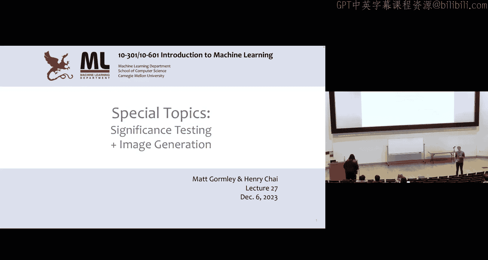

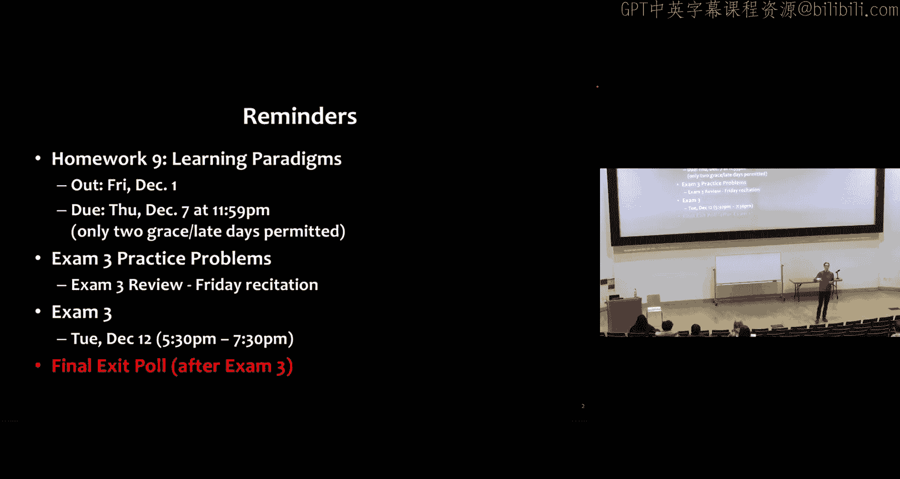

在本节课中，我们将学习两个核心主题。首先，我们将探讨如何通过显著性检验来判断机器学习算法的性能提升是否具有统计意义。随后，我们将转向计算机视觉领域，重点介绍一种流行的图像生成方法——生成对抗网络。

## 显著性检验

上一节我们概述了课程内容，本节中我们来看看如何评估模型性能的可靠性。我们经常需要比较两个分类器，例如 `H_A(x)` 和 `H_B(x)`。通常的做法是比较它们在测试集上的准确率。然而，这个比较结果可能受到两种随机性的影响：训练数据的随机性和测试数据的随机性。

### 训练数据的随机性

训练数据的随机性主要源于模型的随机初始化。例如，在训练深度神经网络时，我们通常会进行多次随机重启，每次使用不同的随机种子初始化模型参数。由于目标函数是非凸的，不同的初始化点可能导致最终学习到不同的模型参数，从而得到不同的分类器 `H_B^1(x), H_B^2(x), ..., H_B^r(x)`。

以下是评估这种随机性的方法：
*   我们可以为这些分类器绘制准确率的直方图，观察其分布。
*   我们也可以报告平均准确率及其置信区间，例如 `47% ± 8%`。

通过这种方法，我们可以了解模型性能的波动范围，而不是仅凭单次运行的结果下结论。

### 测试数据的随机性

测试数据的随机性源于我们用于评估的测试集只是从真实数据分布中随机抽取的一个样本。假设真实数据分布 `P*` 生成数据，我们随机抽取了100个样本作为测试集。对于两个固定的分类器，在不同的随机测试集上，它们的错误率可能会发生变化。在一个测试集上，`H_A` 可能犯5个错误，`H_B` 犯3个错误；而在另一个同等可能的测试集上，情况可能完全相反。

因此，仅凭一个测试集的结果，我们无法确定一个分类器是否真的优于另一个。

### 配对自助法显著性检验

为了解决上述问题，我们可以使用配对自助法显著性检验。其核心思想是：通过从现有测试集中有放回地重复采样，来模拟获取多个不同测试集的过程，从而评估观察到的性能差异是否具有统计显著性。

具体步骤如下：
1.  假设我们有一个测试数据集 `D_test`。
2.  我们进行 `B` 次自助采样，每次从 `D_test` 中随机抽取 `n` 个样本（可重复），构成一个自助样本 `D_test^b`。
3.  初始化计数器 `v = 0`。
4.  对于每个自助样本 `b`，我们计算两个分类器在该样本上的性能差异 `Δ(D_test^b)`，以及在整个原始测试集上的性能差异 `Δ(D_test)`。
5.  如果 `|Δ(D_test^b)| > 2 * |Δ(D_test)|`，则计数器 `v` 加1。
6.  计算 `p` 值：`p = v / B`。

这里的零假设是：两个分类器的性能相同。如果 `p` 值很低（例如小于 `0.05`），意味着在随机采样的不同测试集上，很少会出现比当前观察到的差异大两倍的情况，因此我们可以拒绝零假设，认为观察到的性能差异是显著的，而非偶然。

这种方法不依赖于特定的数据分布或评估指标（准确率、F1分数等均可），并且使用的是双尾检验。

## 计算机视觉任务概述

在深入图像生成之前，我们先简要回顾一些常见的判别式计算机视觉任务：

*   **图像分类**：给定一张图像，预测一个单一的类别标签（例如，识别ImageNet中的物体）。
*   **图像分类与定位**：在图像分类的基础上，同时预测目标物体的边界框位置。
*   **人体姿态估计**：预测图像中人体的关键点（如手、肘、脚）位置，可视为多输出回归问题。
*   **语义分割**：为图像中的每一个像素分配一个类别标签（如人、椅子、背景）。
*   **目标检测**：识别图像中所有感兴趣的物体，并为每个物体预测其边界框和类别标签。
*   **实例分割**：在语义分割的基础上，区分同一类别的不同个体（例如，区分图像中的多个人）。
*   **图像描述生成**：结合卷积神经网络（提取图像特征）和循环神经网络或Transformer（生成自然语言描述），为图像生成文字说明。
*   **医学图像分析**：涵盖上述多种任务，应用于特定领域，如病灶检测、器官分割等。

## 图像生成任务

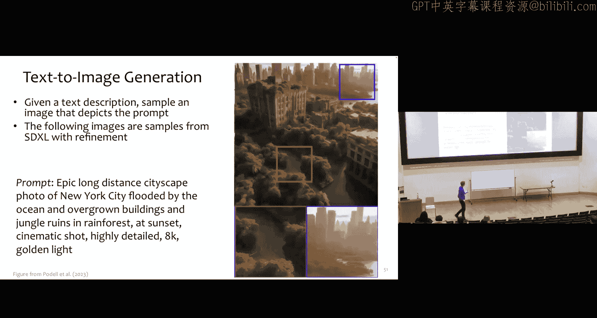

现在，我们聚焦于生成式任务——图像生成。它可以进一步细分为以下几类：

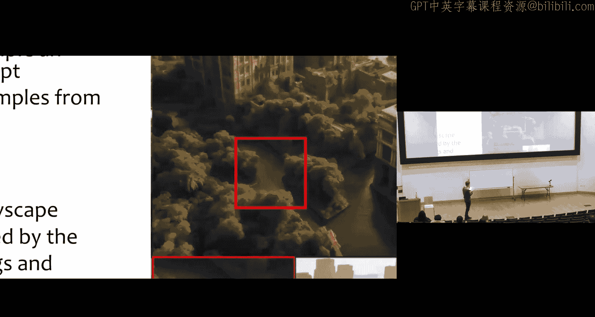

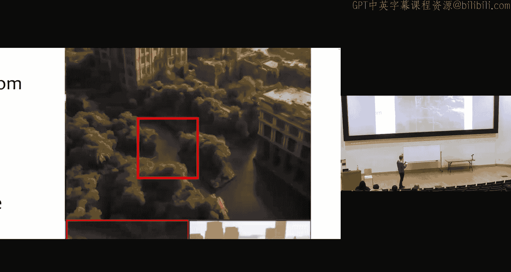

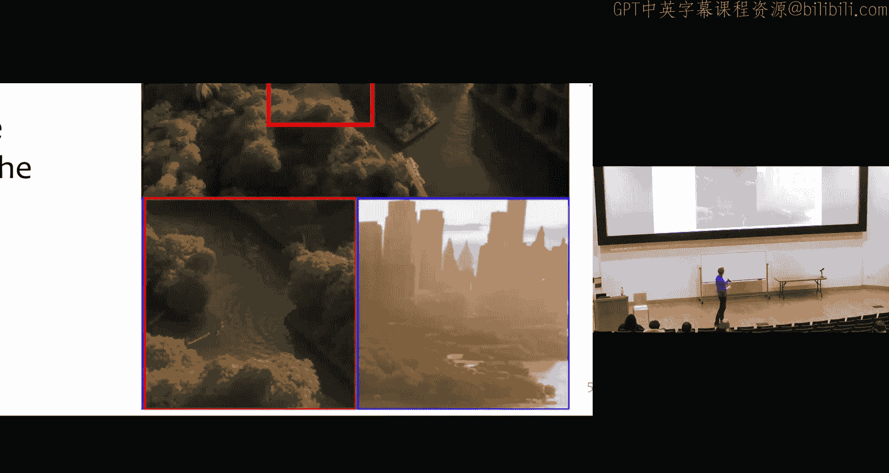

*   **类别条件生成**：给定一个类别标签（如“金丝雀”），生成属于该类别的图像。即从条件分布 `P(图像 | 标签)` 中采样。
*   **超分辨率**：输入一张低分辨率图像，输出对应的高分辨率图像，本质上是“幻觉”出缺失的像素细节。
*   **图像编辑**：包括图像修复（去除图中物体并自动填充合理背景）、着色（为黑白图像上色）、外推（扩展图像画布并填充内容）等。
*   **风格迁移**：将一幅图像（A）的内容与另一幅图像（B）的艺术风格相结合，生成新图像（C）。
*   **文本到图像生成**：根据一段文本描述（提示词），生成符合描述的图像。这是当前非常活跃的研究领域。

## 生成对抗网络

生成对抗网络是图像生成的一种重要方法。它包含两个确定性的神经网络模型：

*   **生成器**：接收一个随机噪声向量 `z` 作为输入，生成一张图像 `G_θ(z)`。
*   **判别器**：接收一张图像作为输入，输出该图像是“真实”（来自训练集）的概率 `D_φ(x)`。

### GAN的训练：极小极大博弈

GAN的训练过程可以被视为一个双人博弈。生成器的目标是生成足以“欺骗”判别器的逼真图像，而判别器的目标是准确区分真实图像和生成器产生的“假”图像。这通过一个联合的损失函数来实现，双方进行对抗性优化。

**目标函数**可以表示为：
`min_φ max_θ V(θ, φ) = E_{x~真实数据}[log D_φ(x)] + E_{z~噪声}[log(1 - D_φ(G_θ(z)))]`

**训练过程**采用交替的块坐标下降：
1.  **固定生成器 `G_θ`，更新判别器 `D_φ`**：判别器试图最小化上述损失，即最大化对真实图像的判别概率，同时最小化对生成图像的判别概率。
2.  **固定判别器 `D_φ`，更新生成器 `G_θ`**：生成器试图最大化上述损失的第二项，即最大化判别器将其生成图像误判为“真实”的概率。在实践中，通常对判别器进行多次更新后，才对生成器进行一次更新。

### 扩展与规模

GAN可以扩展为条件生成模型，通过向生成器和判别器输入额外的条件信息（如类别标签、文本编码向量）来实现特定内容的生成。

近年来，图像生成模型规模急剧扩大。例如，Parti模型采用了“自回归文本到图像”的范式：首先使用Transformer编码器处理文本提示，然后使用Transformer解码器生成一系列代表图像块的离散标记，最后使用一个GAN将这些标记解码成高分辨率图像。研究表明，当模型参数规模从数亿增长到数百亿时，生成图像的质量和对复杂提示的遵循能力有显著提升。

### 社会影响与挑战

图像生成技术的进步带来了诸多社会影响和挑战：

*   **潜在负面影响**：可能被用于制造虚假新闻、宣传材料，侵犯版权，冲击艺术创作行业，以及引发隐私问题（个人图像被用于训练模型）。
*   **潜在积极影响**：降低娱乐产业成本，激发新型创意表达。
*   **技术挑战**：
    *   **水印与假图检测**：为生成图像添加不易察觉的数字水印，或开发算法检测无水源的AI生成图像。
    *   **模型溯源**：判断一张图像是由哪个特定生成模型创建的。
    *   **内容溯源**：识别生成图像所参考或融合了哪些训练集中的源图像，这对解决版权问题至关重要，但目前仍是未解决的难题。

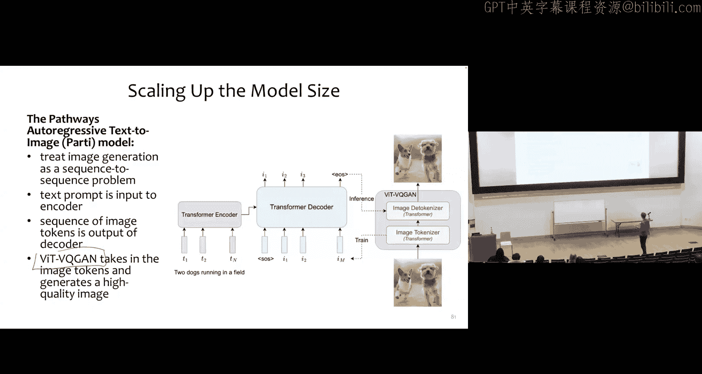

随着视频生成技术即将成熟，这些挑战和影响将变得更加复杂和深远。

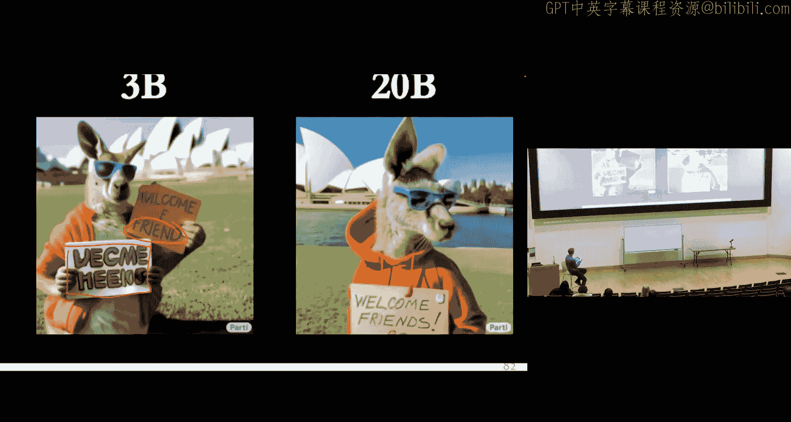

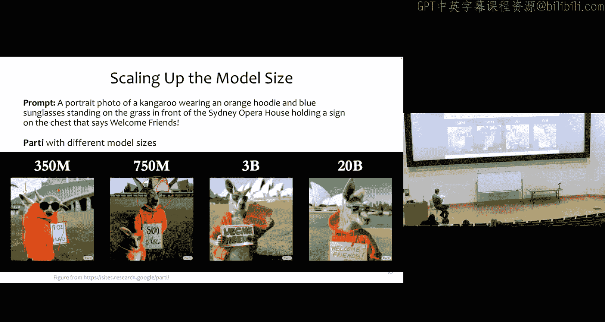

## 总结

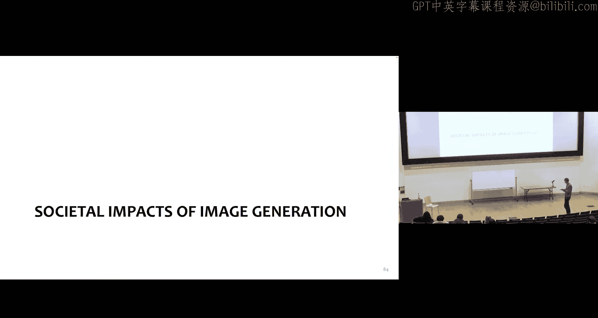

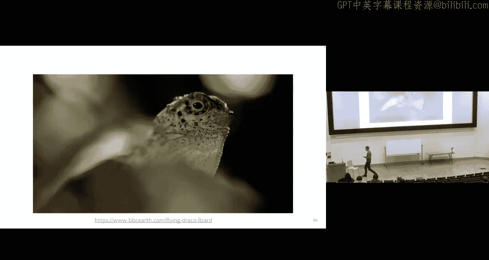

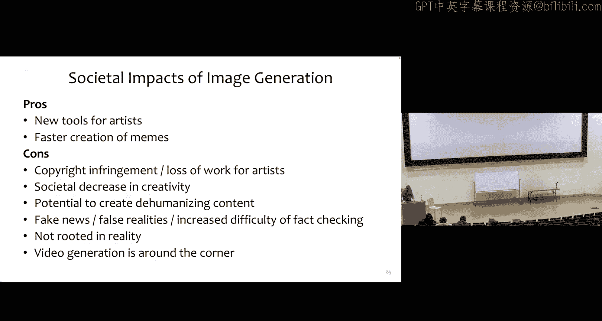

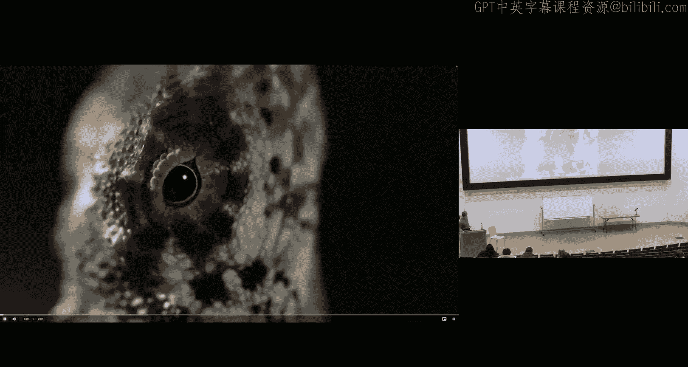

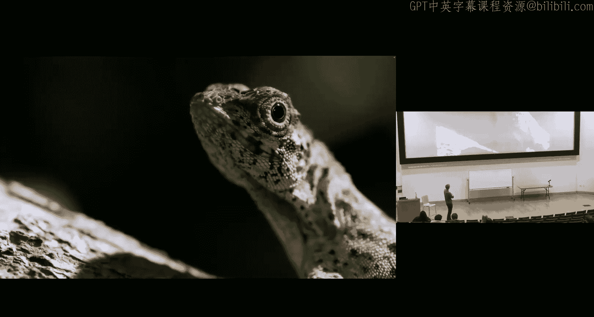

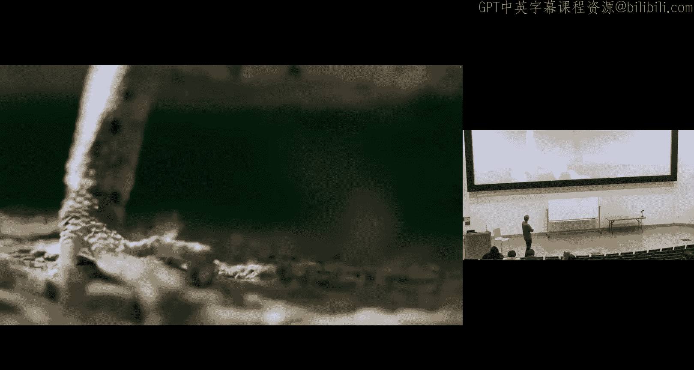

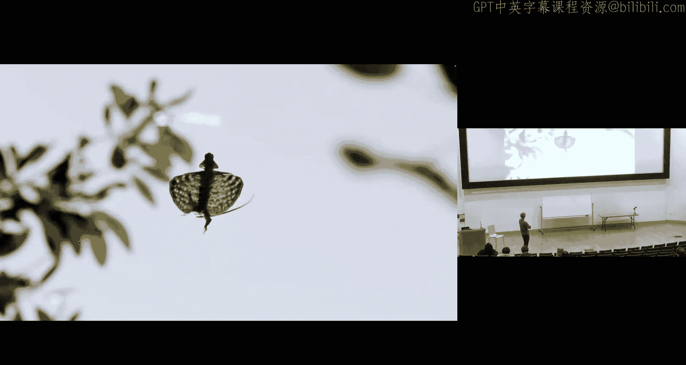

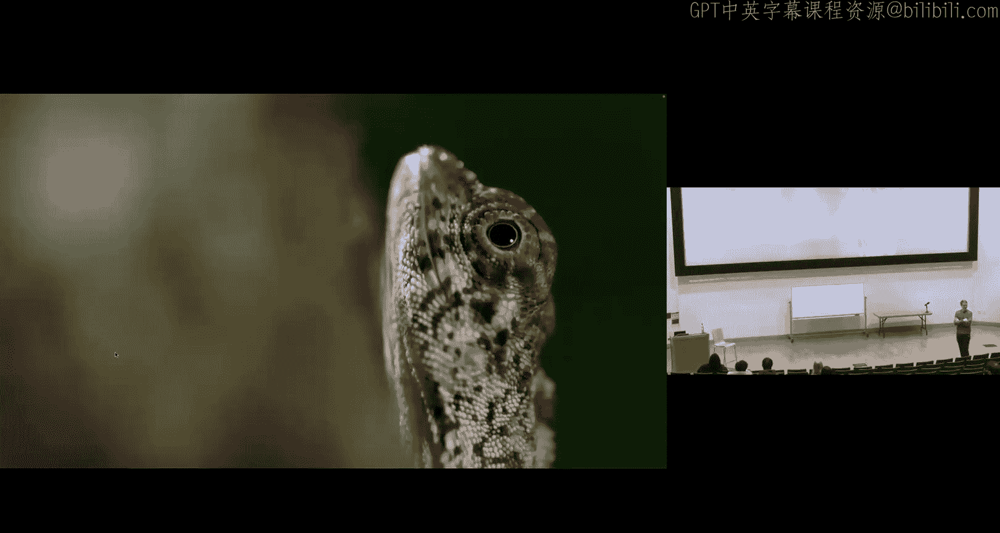

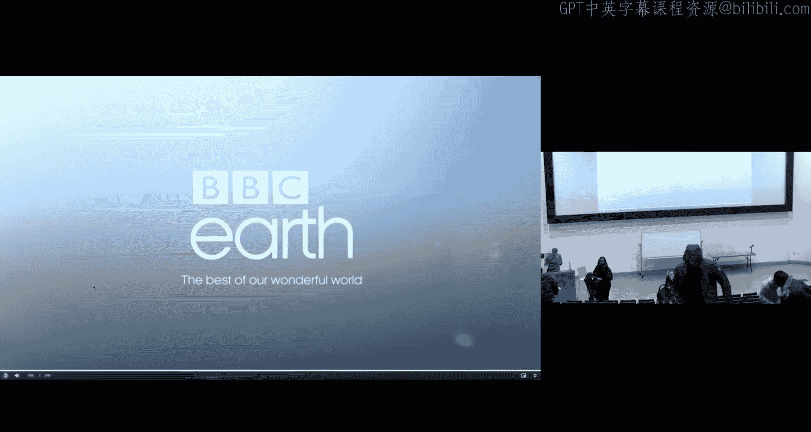

本节课我们一起学习了两个关键主题。首先，我们探讨了显著性检验，特别是配对自助法，它帮助我们判断机器学习模型性能的差异是否具有统计意义，而不仅仅是随机波动。接着，我们深入研究了图像生成，重点介绍了生成对抗网络的基本原理和训练过程。我们看到了GAN如何通过生成器和判别器的对抗博弈来学习生成逼真图像，并了解了该领域向更大规模、更可控条件生成的发展趋势，以及随之而来的重要技术与社会挑战。