# 29：精选问题解析

在本节课中，我们将一起回顾CMU《机器学习导论》课程中第二次考试复习材料中的精选问题。我们将涵盖优化、MLE/MAP、朴素贝叶斯与逻辑回归、神经网络以及学习理论等核心主题，通过具体例题来巩固对这些概念的理解。

## 优化：1：梯度下降收敛性分析

上一节我们介绍了课程概述，本节中我们来看看优化问题，特别是梯度下降的收敛性分析。

考虑凸函数 **f(z) = z²**，α 是梯度下降的学习率。假设初始值 **z⁽⁰⁾ = 1**，对于哪些 α 值，迭代解 **z⁽ᵗ⁾** 的极限会收敛到 0？

我们首先写出梯度下降的更新规则。对于函数 **f(z) = z²**，其梯度为 **∇f(z) = 2z**。因此，梯度下降的更新公式为：
```
z⁽ᵗ⁺¹⁾ = z⁽ᵗ⁾ - α * ∇f(z⁽ᵗ⁾) = z⁽ᵗ⁾ - 2α * z⁽ᵗ⁾ = (1 - 2α) * z⁽ᵗ⁾
```
给定 **z⁽⁰⁾ = 1**，我们可以得到闭式解：
```
z⁽ᵗ⁾ = (1 - 2α)ᵗ
```
我们需要分析当 **t → ∞** 时，**z⁽ᵗ⁾** 是否趋近于 0。

以下是不同 α 值下的收敛情况分析：
*   **α = 0**：**z⁽ᵗ⁾ = 1ᵗ = 1**，不收敛到 0。
*   **α = 0.5**：**z⁽ᵗ⁾ = (1 - 1)ᵗ = 0ᵗ**，当 t ≥ 1 时即为 0，极限为 0。
*   **α = 1**：**z⁽ᵗ⁾ = (-1)ᵗ**，在 1 和 -1 之间振荡，极限不存在。
*   **α = 2**：**z⁽ᵗ⁾ = (-3)ᵗ**，绝对值趋于无穷大，极限不存在。

因此，只有当 **α = 0.5** 时，解会收敛到 0。更一般地，要使 **|1 - 2α| < 1**，即 **0 < α < 1** 时，梯度下降才能收敛到最优解 0。

## MLE与MAP：2：均匀分布的最大似然估计

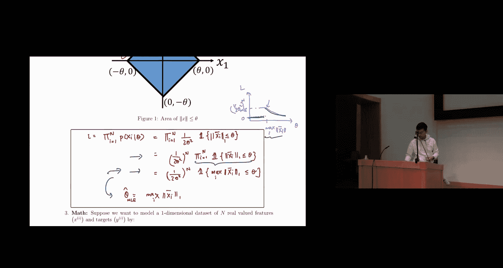

上一节我们分析了梯度下降，本节中我们来看看最大似然估计（MLE）的应用。

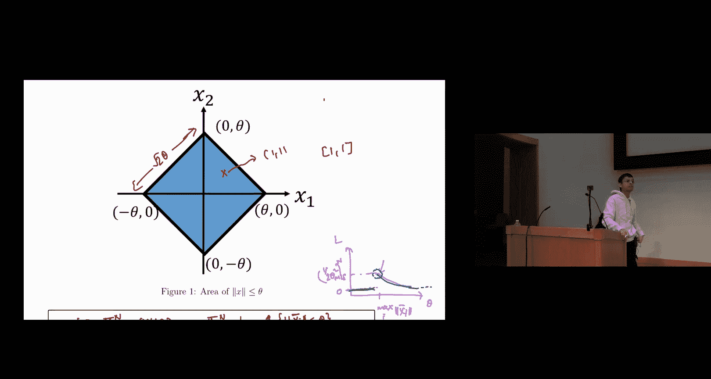


假设数据 **X₁, ..., Xₙ** 独立地从菱形区域上的均匀分布中抽取。该区域是一个边长为 **√2 θ** 的正方形，θ > 0。概率密度函数为：
```
p(x | θ) = 1 / (2θ²), 如果 ||x||₁ ≤ θ；否则为 0。
```
其中 **||x||₁** 表示 L1 范数。目标是找到 θ 的最大似然估计。

我们首先写出似然函数。由于样本独立，联合似然是每个样本概率的乘积。利用指示函数 **I(·)**，可以紧凑地写出：
```
L(θ; X) = ∏_{i=1}^n [ (1/(2θ²)) * I(||X_i||₁ ≤ θ) ]
        = (1/(2θ²))^n * ∏_{i=1}^n I(||X_i||₁ ≤ θ)
```
指示函数乘积项简化为：当所有 **||X_i||₁ ≤ θ** 时为 1，否则为 0。这等价于要求 **max_i(||X_i||₁) ≤ θ**。因此，似然函数可写为：
```
L(θ; X) = (1/(2θ²))^n * I( max_i(||X_i||₁) ≤ θ )
```
现在我们需要关于 θ 最大化此函数。

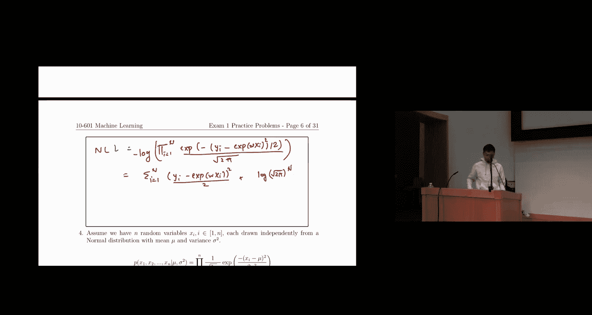

以下是最大化过程的分析：
1.  当 **θ < max_i(||X_i||₁)** 时，指示函数为 0，整个似然为 0。
2.  当 **θ ≥ max_i(||X_i||₁)** 时，指示函数为 1，似然变为 **(1/(2θ²))^n**，这是关于 θ 的递减函数。

因此，为了最大化似然，我们应选择尽可能小的 θ，同时满足条件 **θ ≥ max_i(||X_i||₁)**。所以，最大似然估计为：
```
θ_MLE = max_i(||X_i||₁)
```
直观上，最优的 θ 是能恰好覆盖所有数据点的最小菱形区域的边长参数。

## MLE与MAP：3：非线性模型的MLE与梯度下降

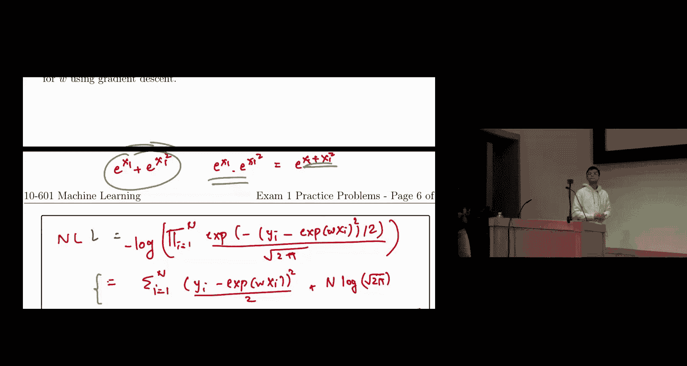

上一节我们解决了均匀分布的MLE问题，本节中我们来看一个更复杂的模型。

我们希望对一维数据集 **{(x_i, y_i)}** 建模，模型形式为 **y_i | x_i, w ~ N(exp(w x_i), 1)**，即给定 **x_i** 和参数 **w** 时，**y_i** 服从均值为 **exp(w x_i)**、方差为 1 的正态分布。目标是找到参数 **w** 的最大条件似然估计，并判断是否能解析求解。


首先，我们写出条件似然函数：
```
L(w; D) = ∏_{i=1}^n p(y_i | x_i, w) = ∏_{i=1}^n (1/√(2π)) * exp( - (y_i - exp(w x_i))² / 2 )
```
为方便处理，我们通常考虑负对数似然（NLL）：
```
NLL(w) = -log L(w; D) = ∑_{i=1}^n [ (1/2)(y_i - exp(w x_i))² ] + 常数项
```
我们的目标是找到最小化 **NLL(w)** 的 **w**。

观察 **NLL(w)**，它包含项 **exp(w x_i)**。即使求导并令导数为零，得到的方程形式为 **∑_{i} (y_i - exp(w x_i)) * x_i * exp(w x_i) = 0**。这是一个关于 **w** 的超越方程，无法通过代数变换将其写成 **w = ...** 的封闭形式。因此，**无法获得解析解**。

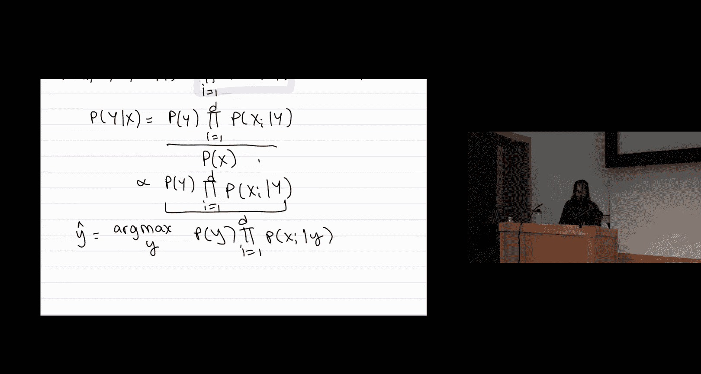

既然无法解析求解，我们需要使用迭代优化方法。以下是使用梯度下降的解决方案：
1.  计算 **NLL(w)** 关于 **w** 的梯度：
    ```
    ∇_w NLL(w) = ∑_{i=1}^n [ (exp(w x_i) - y_i) * x_i * exp(w x_i) ]
    ```
2.  应用梯度下降更新规则：
    ```
    w_{new} = w_{old} - α * ∇_w NLL(w_{old})
    ```
    其中 α 是学习率。

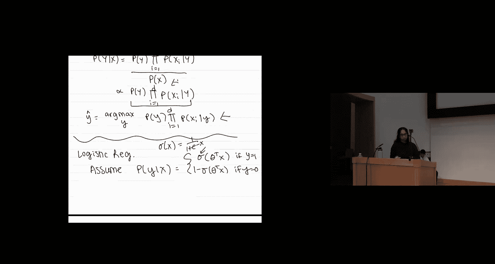


通过不断迭代更新，我们可以逼近使负对数似然最小化的 **w** 值。

## 朴素贝叶斯与逻辑回归：4：模型比较与参数数量


上一节我们讨论了MLE的数值求解，本节我们对比两种重要的分类模型：朴素贝叶斯和逻辑回归。

假设我们要学习 **P(Y | X₁, X₂, X₃)**，其中 **Y, X₁, X₂, X₃** 都是布尔变量。考虑使用朴素贝叶斯或逻辑回归。

以下是关于模型选择的一些判断题及其解析：
*   **使用高斯朴素贝叶斯分类器是一个好选择**：**错误**。高斯朴素贝叶斯假设特征服从高斯分布，适用于连续值特征。对于布尔特征，应使用伯努利朴素贝叶斯。
*   **使用朴素贝叶斯必须假设 Y 在给定 X₂ 的条件下独立于 X₁**：**错误**。朴素贝叶斯的条件独立性假设是：在给定标签 Y 的条件下，各个特征 **X_i** 之间相互独立，即 **X_i ⊥ X_j | Y**。它并不涉及 Y 与其他变量的条件独立性。
*   **逻辑回归在这种情况下肯定是更好的选择**：**错误**。模型性能取决于数据是否满足模型假设。如果朴素贝叶斯的条件独立性假设近似成立，它可能表现很好。逻辑回归没有这个假设，但模型形式固定。没有绝对更好的模型。
*   **只能使用MLE训练朴素贝叶斯，不能使用MAP**：**错误**。MLE和MAP都是有效的参数估计方法。MAP在MLE的基础上加入了参数先验，可以用于防止过拟合，同样适用于朴素贝叶斯。

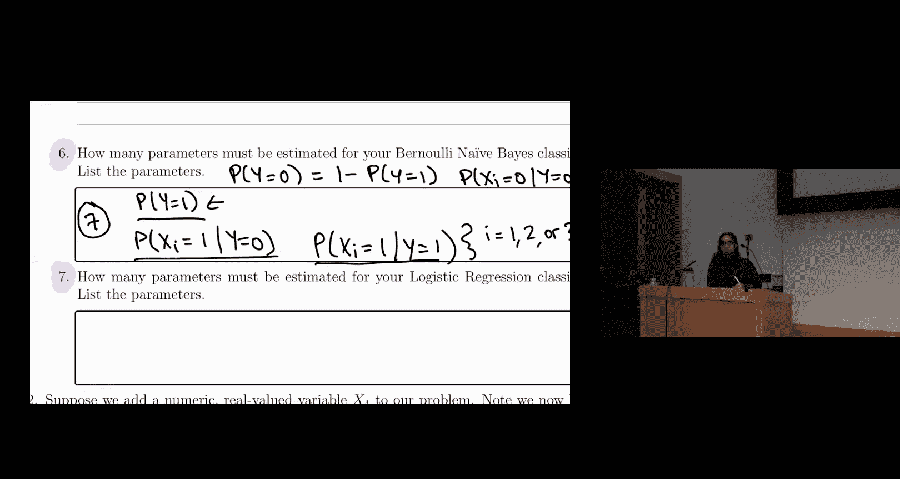

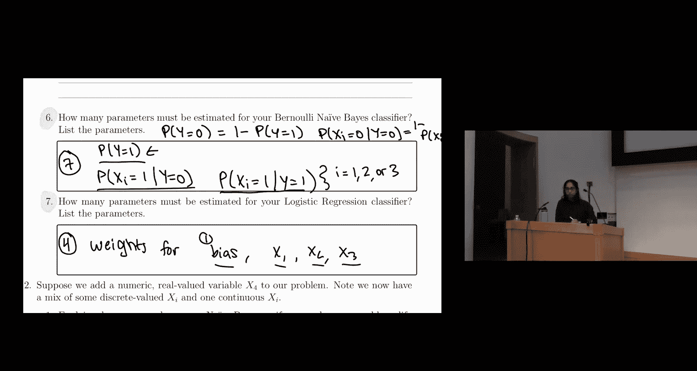


接下来，我们比较两种模型需要估计的参数数量：
*   **伯努利朴素贝叶斯分类器**：
    *   需要估计 **P(Y=1)**（1个参数，因为 P(Y=0)=1-P(Y=1)）。
    *   对于每个特征 **X_i** 和每个类别 **y ∈ {0, 1}**，需要估计 **P(X_i=1 | Y=y)**（共 3个特征 * 2个类别 = 6个参数，因为 P(X_i=0|Y=y)=1-P(X_i=1|Y=y)）。
    *   总计 **1 + 6 = 7** 个参数。
*   **逻辑回归分类器**：
    *   模型为 **P(Y=1|X) = σ(w₀ + w₁X₁ + w₂X₂ + w₃X₃)**，其中 σ 是sigmoid函数。
    *   需要估计参数：偏置项 **w₀** 和权重 **w₁, w₂, w₃**。
    *   总计 **4** 个参数。

逻辑回归的参数通常更少，因为它直接对决策边界建模，而不像朴素贝叶斯那样对数据生成过程建模。

## 逻辑回归：5：线性性证明与权重爆炸

上一节我们对比了模型，本节我们深入探讨逻辑回归的性质。

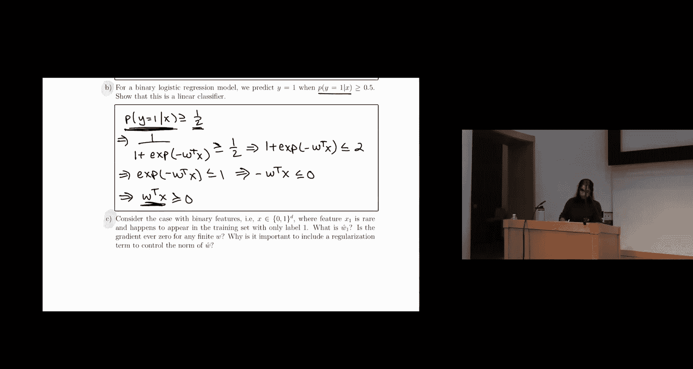

给定训练集 **D**，逻辑回归模型假设 **P(Y=1 | x, w) = σ(wᵀx)**，其中 **σ(z) = 1/(1+e^{-z})**。其条件对数似然为：
```
ℓ(w) = ∑_{i} [ y_i log σ(wᵀx_i) + (1-y_i) log(1 - σ(wᵀx_i)) ]
```
其梯度为 **∇ℓ(w) = ∑_{i} (y_i - σ(wᵀx_i)) x_i**。

*   **能否得到 w 的封闭形式解？** 不能。令梯度为零得到的方程 **∑_{i} (y_i - σ(wᵀx_i)) x_i = 0** 没有关于 **w** 的解析解，必须使用梯度下降等迭代方法求解。

*   **证明逻辑回归是线性分类器**：逻辑回归的预测规则为：如果 **P(Y=1|x) ≥ 0.5**，则预测为1，否则为0。我们来证明这等价于一个线性决策边界。
    ```
    P(Y=1|x) ≥ 0.5
    ⇔ σ(wᵀx) ≥ 0.5
    ⇔ 1/(1+e^{-wᵀx}) ≥ 1/2
    ⇔ 1+e^{-wᵀx} ≤ 2
    ⇔ e^{-wᵀx} ≤ 1
    ⇔ -wᵀx ≤ 0
    ⇔ wᵀx ≥ 0
    ```
    因此，决策规则简化为：当 **wᵀx ≥ 0** 时预测为1，否则为0。这是一个线性决策边界。

*   **罕见特征与权重爆炸**：考虑二值特征情况。假设特征 **X₁** 非常罕见，并且在训练集中仅出现在 **Y=1** 的样本中。这意味着 **P(Y=1 | X₁=1) ≈ 1**。
    *   **W₁ 的估计值会怎样？** 为了最大化似然（使 **P(Y=1|X₁=1, w)** 尽可能接近1），算法会倾向于将权重 **W₁** 推向无穷大（**W₁ → ∞**）。
    *   **梯度会对于有限的 w 变为零吗？** 不会。只要 **W₁** 有限，继续增大它总能略微提高似然，因此梯度不会为零。
    *   **为什么正则化很重要？** 这种情况会导致严重的过拟合。模型在训练集上学到了一个极端规则：“只要 **X₁=1**，就预测 **Y=1**”。如果这个规律在测试集上不成立（例如，出现了 **X₁=1** 但 **Y=0** 的样本），模型会完全错误。加入正则化项（如L2正则：**λ||w||²**）可以惩罚过大的权重，控制模型复杂度，提高泛化能力。

## 神经网络：6：前向传播与反向传播

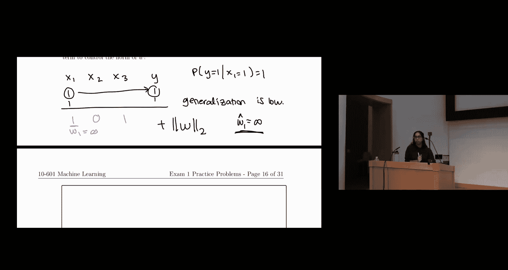

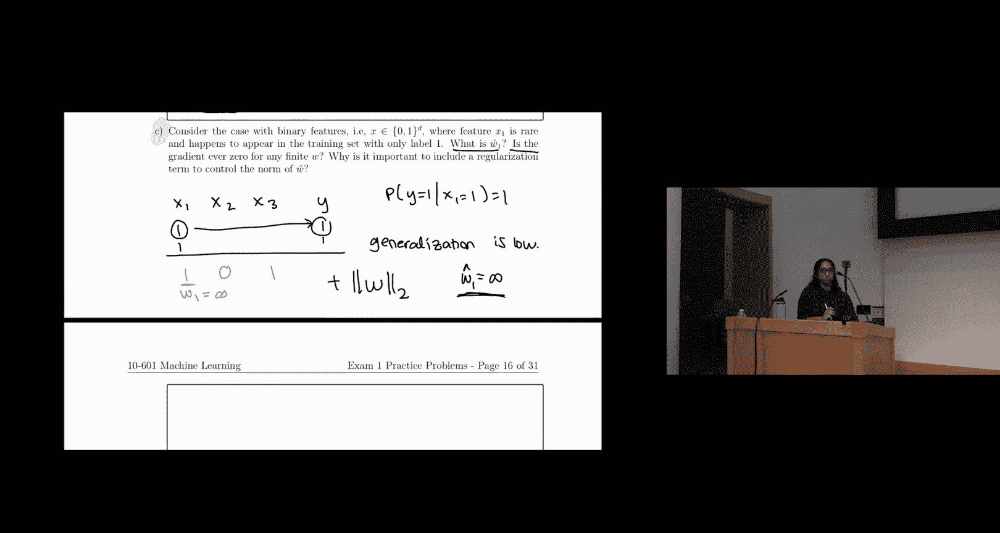

上一节我们结束了逻辑回归的讨论，本节我们进入神经网络部分。

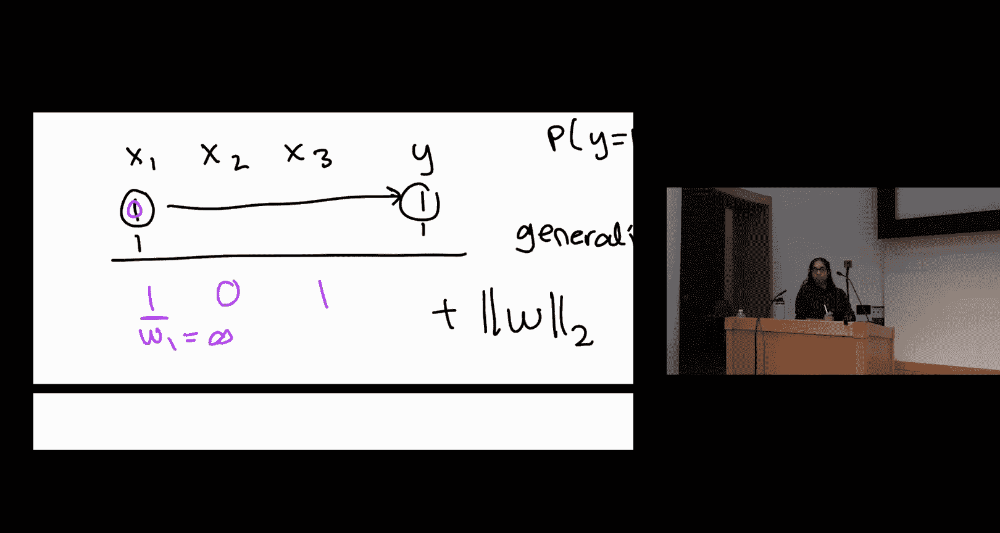

首先是一些基础概念的匹配：
*   **交叉熵**：损失函数
*   **线性**：层（如全连接层）
*   **均方误差**：损失函数
*   **ReLU**：激活函数
*   **Sigmoid**：激活函数
*   **Softmax**：激活函数（也可视为层）
*   **随机梯度下降**：优化器

现在考虑一个简单的神经网络，其架构和公式定义如下（假设输入 **x₁**，隐藏层2个神经元，输出1个神经元，使用Sigmoid激活函数 **φ**）：
```
a₁ = x₁
z₂ = W₂₁₁ * a₁ + b₂₁
a₂ = φ(z₂)
z₃ = W₃₁₂ * a₂ + b₃₁
a₃ = φ(z₃)  # 输出
```
给定 **x₁ = 0.3** 以及一系列权重和偏置的具体数值，我们可以进行前向传播计算输出 **a₃**（或记作 **z₃** 经过激活后的值）。通过计算比较 **a₃** 与 0.5 的大小关系，可以得到模型的预测结果（例如，若 **a₃ ≥ 0.5** 则预测为1）。

接下来是反向传播。我们需要计算损失函数 **L** 对特定参数（如 **b₂₁**）的偏导数 **∂L/∂b₂₁**。这需要连续应用链式法则：
```
∂L/∂b₂₁ = (∂L/∂z₃) * (∂z₃/∂a₃) * (∂a₃/∂z₃) * (∂z₃/∂a₂) * (∂a₂/∂z₂) * (∂z₂/∂b₂₁)
```
其中每一项都可以根据网络结构定义计算出来（例如，**∂a₂/∂z₂ = φ‘(z₂)**，即Sigmoid函数的导数）。类似地，可以计算 **∂L/∂W₁₁₂** 等参数的梯度。这个过程系统地展示了误差如何从输出层反向传播到网络中的任意参数。


## 学习理论：7：VC维分析


最后，我们简要探讨学习理论中的VC维概念。

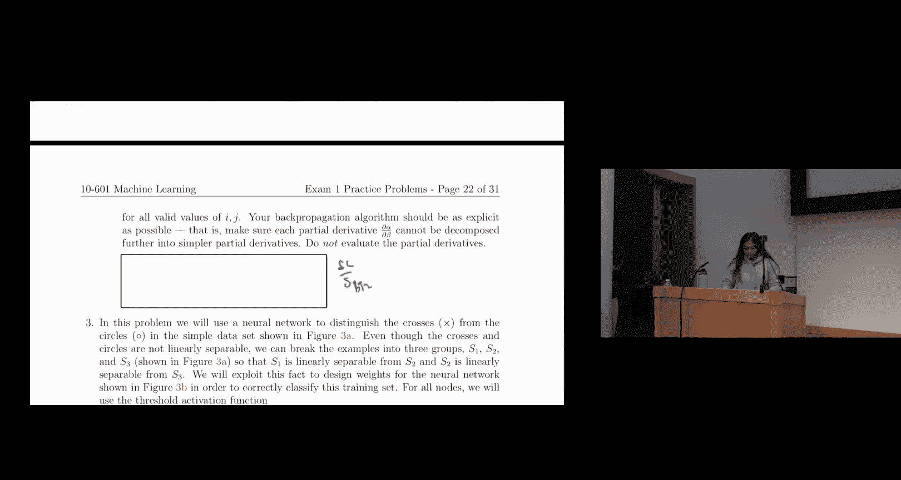

假设假设空间 **H** 由所有“正区间”分类器组成，即对于某个区间 **[a, b]**，若点落在区间内则标记为正例（+1），否则为负例（-1）。我们要分析 **H** 的VC维。


*   **VC维是否小于3？** 是的。VC维是假设集能够“打散”的最大点集的大小。打散意味着对于点集所有可能的标记方式，假设集中都存在一个假设能实现这种标记。
    *   考虑一维直线上任意三个点。总存在一种标记方式（例如，两端的点标记为+1，中间的点标记为-1）是单个正区间无法实现的。因为一个连续区间无法只包含两个不连续的点而不包含它们之间的点。
    *   因此，**H** 无法打散任意三个点，故其VC维小于3。

*   **H 的VC维是多少？** **H** 的VC维是2。可以证明：
    *   对于任意两个点，无论它们如何标记（++, +-, -+），我们总能找到一个区间来实现这种标记。
    *   但对于三个点，如上所述，存在无法实现的标记。所以最大打散点数为2，VC维为2。


更一般地，对于由 **k** 个区间并集构成的假设空间，其VC维为 **2k**。这说明了模型复杂度（表现为VC维）与所需数据量之间的关系。

---

**本节课总结**


本节课我们一起回顾了机器学习中的多个核心主题。我们从梯度下降的收敛条件分析开始，然后探讨了最大似然估计在均匀分布和复杂模型中的应用。接着，我们比较了朴素贝叶斯和逻辑回归的原理、假设及参数差异，并深入分析了逻辑回归的线性决策本质以及正则化的重要性。在神经网络部分，我们练习了前向和反向传播的计算过程。最后，我们介绍了学习理论中的VC维概念，并通过“正区间”分类器的例子理解了模型复杂度的度量。希望这些例题解析能帮助你巩固对机器学习基本概念和方法的理解。