# 30：强化学习

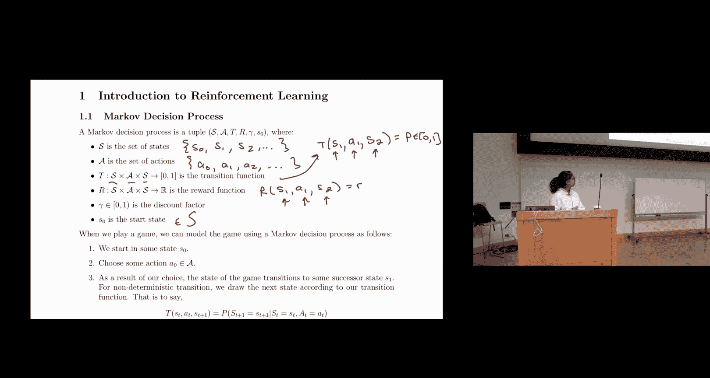

在本节课中，我们将要学习强化学习的基础概念，包括马尔可夫决策过程、价值函数、策略函数以及Q学习。我们将通过定义、公式和具体例子来逐步理解这些核心思想。

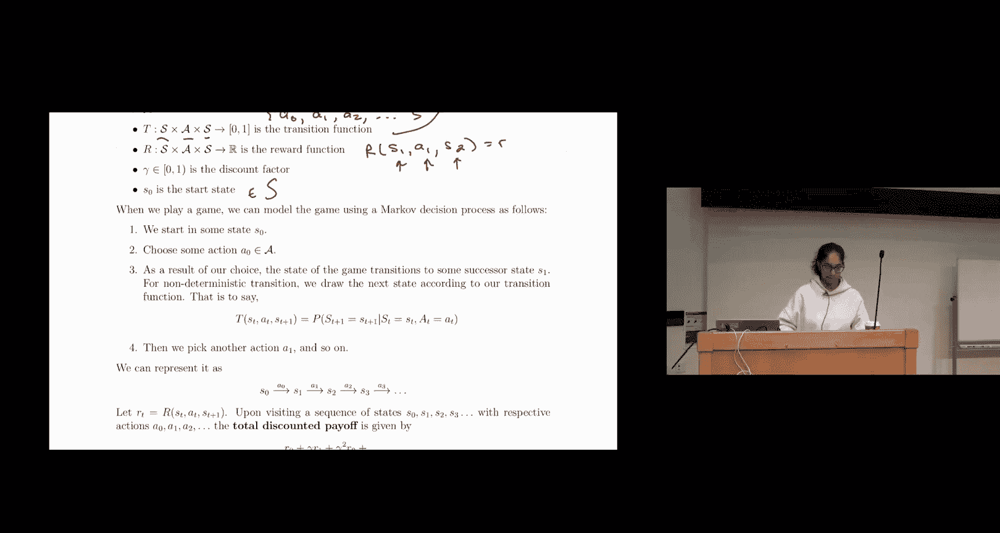

## 马尔可夫决策过程

首先，我们需要一个框架来描述智能体与环境交互的决策问题，这个框架就是马尔可夫决策过程。

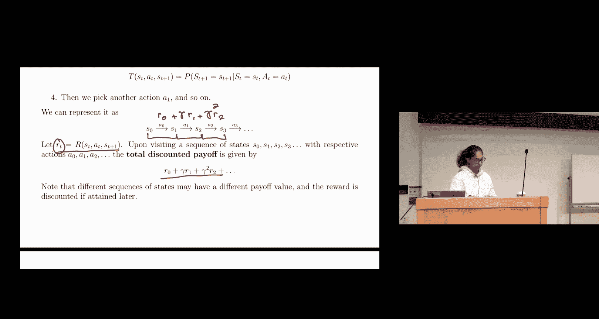

马尔可夫决策过程定义为一个六元组，写作 `(S, A, T, R, γ, s0)`。以下是每个元素的含义：
*   **S**：状态集合。例如 `{s0, s1, s2, ...}`。
*   **A**：动作集合。例如 `{a0, a1, a2, ...}`。
*   **T**：状态转移函数。`T(s1, a1, s2)` 表示在状态 `s1` 下采取动作 `a1` 后，转移到状态 `s2` 的概率。这是一个介于0和1之间的值。
*   **R**：奖励函数。`R(s1, a1, s2)` 表示在状态 `s1` 下采取动作 `a1` 并转移到状态 `s2` 后所获得的即时奖励，是一个实数。
*   **γ**：折扣因子，一个介于0和1之间的常数，用于计算未来奖励的现值。
*   **s0**：初始状态，是状态集合 `S` 中的一个元素。

## 游戏过程与总收益

理解了MDP的基本构成后，我们来看看如何在这个框架下进行决策并计算收益。

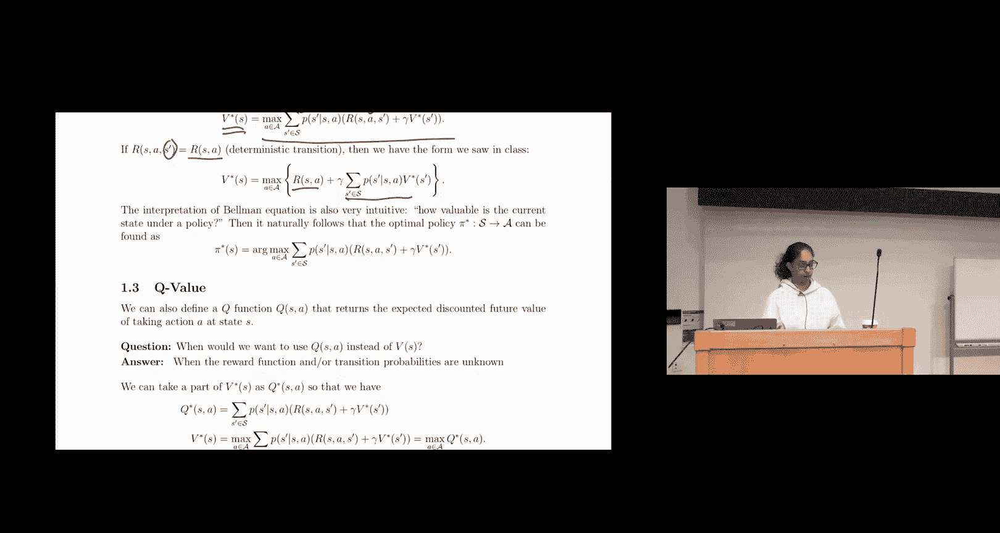

游戏从初始状态 `s0` 开始。智能体选择一个动作 `a0`。根据转移函数 `T`，环境会转移到下一个状态 `s1`。这个过程会持续进行。

转移函数可以是**确定性的**（执行动作后必然到达某个特定状态），也可以是**非确定性的**（执行动作后以一定概率到达多个可能状态之一）。

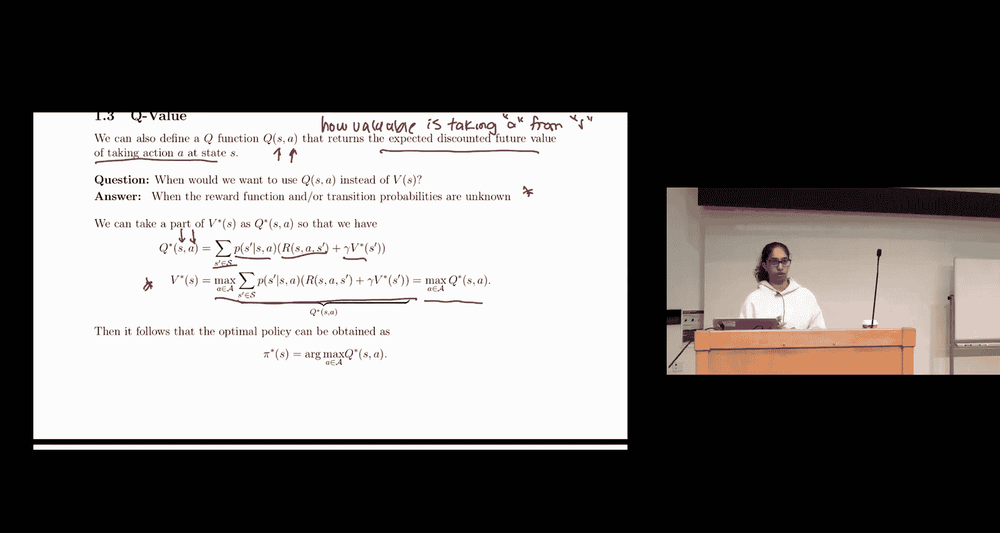

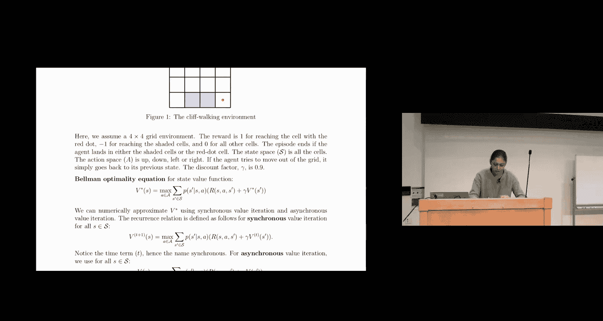

在每一步转移 `(st, at, st+1)` 中，智能体会获得一个即时奖励 `rt = R(st, at, st+1)`。智能体追求的不是单步奖励，而是整个交互过程的总收益。**总折扣收益**的计算公式如下：

`总收益 = r0 + γ * r1 + γ^2 * r2 + γ^3 * r3 + ...`

其中 `γ` 是折扣因子，它使得未来的奖励对当前的价值贡献逐渐减小。

## 策略与价值函数

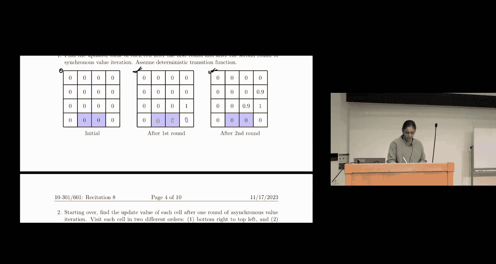

上一节我们定义了如何计算一个行动序列的总收益。本节我们引入**策略**的概念，它决定了智能体在每一个状态下应该采取什么动作。

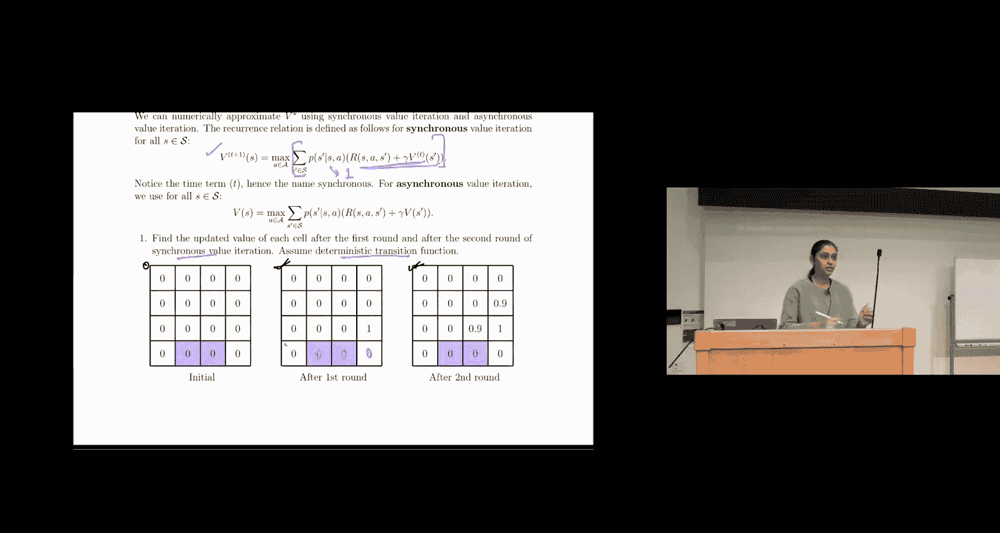

一个**策略函数 π** 接收一个状态 `s`，并输出一个动作 `a`，即 `π(s) = a`。它告诉智能体在任何状态下应该怎么做。

**最优策略 π*** 是能够带来最大可能总收益的策略。

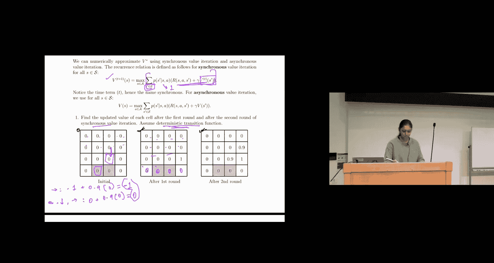

为了评估一个状态或一个策略的好坏，我们定义了**价值函数**。状态 `s` 在策略 `π` 下的价值 `V^π(s)`，表示从状态 `s` 开始，遵循策略 `π` 所能获得的期望总折扣收益。

**最优价值函数 V\*(s)** 则是在所有可能策略中，从状态 `s` 开始能获得的最大期望总折扣收益，即 `V*(s) = max_π V^π(s)`。

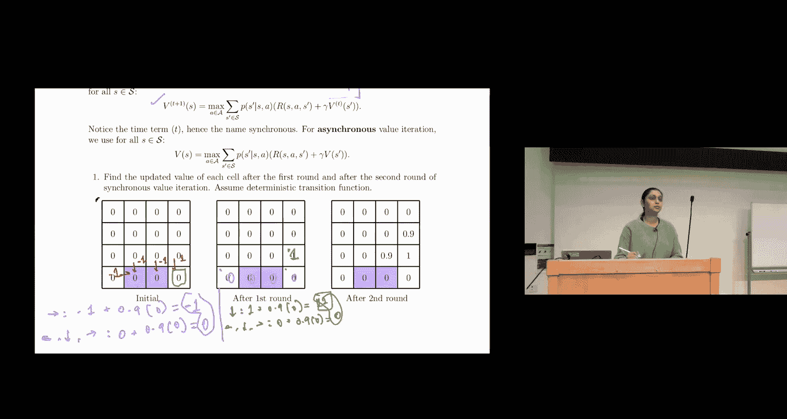

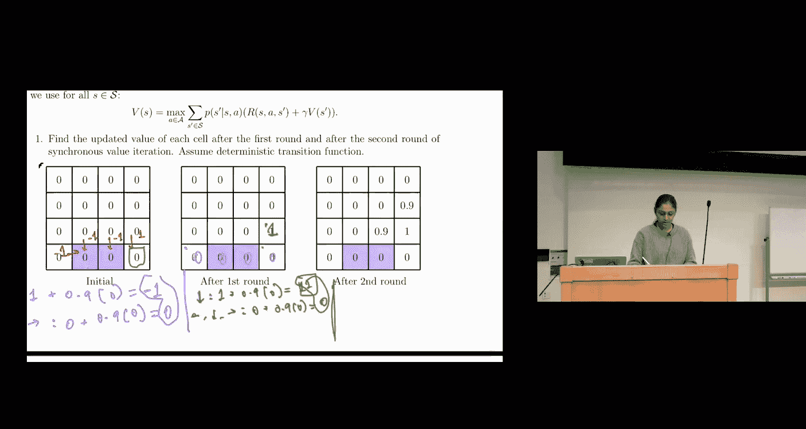

`V*(s)` 可以通过**贝尔曼最优方程**递归地计算：
`V*(s) = max_a Σ_{s'} T(s, a, s') * [ R(s, a, s') + γ * V*(s') ]`
直观理解是：一个状态的价值等于采取最佳动作后，所有可能结果的期望（概率 * （即时奖励 + 折扣后的下一状态价值））的最大值。

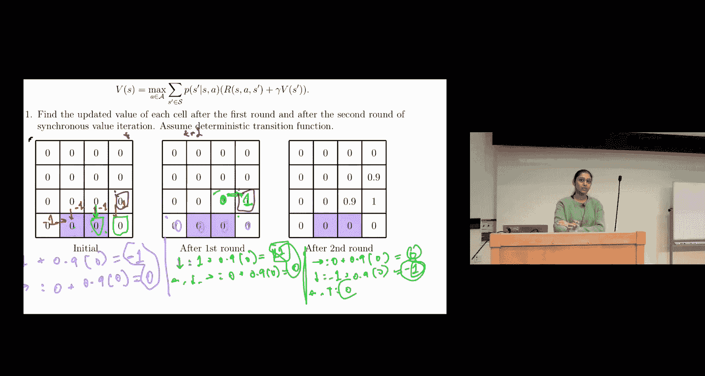

对于**确定性**转移函数，公式可以简化为：
`V*(s) = max_a [ R(s, a) + γ * V*(s') ]`，其中 `s'` 是执行动作 `a` 后确定到达的状态。

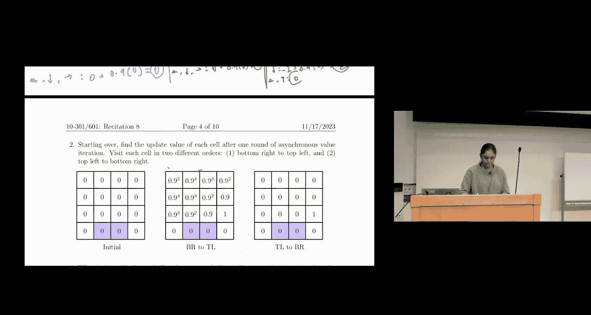

一旦我们有了 `V*`，最优策略就很容易得到：`π*(s) = argmax_a [ R(s, a) + γ * V*(s') ]`

## Q函数

价值函数 `V` 评估的是状态的好坏。有时，我们更关心在某个状态下采取某个特定动作的价值，这就需要 **Q函数**。

**最优Q函数 Q\*(s, a)** 表示在状态 `s` 下采取动作 `a` 后，所能获得的期望总折扣收益。其贝尔曼方程如下：
`Q*(s, a) = Σ_{s'} T(s, a, s') * [ R(s, a, s') + γ * max_{a'} Q*(s', a') ]`

`V*` 和 `Q*` 可以互相表示：
*   `V*(s) = max_a Q*(s, a)`
*   `π*(s) = argmax_a Q*(s, a)`

Q函数在模型未知（即不知道 `T` 和 `R`）的情况下特别有用，因为我们可以通过与环境交互来直接学习 `Q(s,a)` 的值，这就是Q学习算法的基础。

## 价值迭代算法示例

前面我们介绍了价值函数和贝尔曼方程，本节我们通过一个网格世界的例子，来看看如何通过**价值迭代**算法实际计算 `V*(s)`。

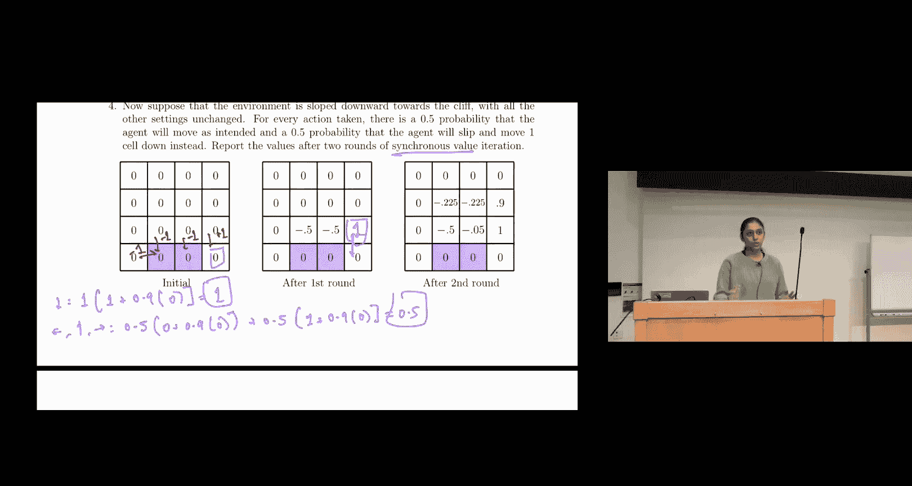

我们有一个4x4网格，其中红色格子奖励为+1，两个阴影格子奖励为-1，其他格子间的移动奖励为0。折扣因子 `γ=0.9`。动作有上下左右四种，撞墙则留在原地。

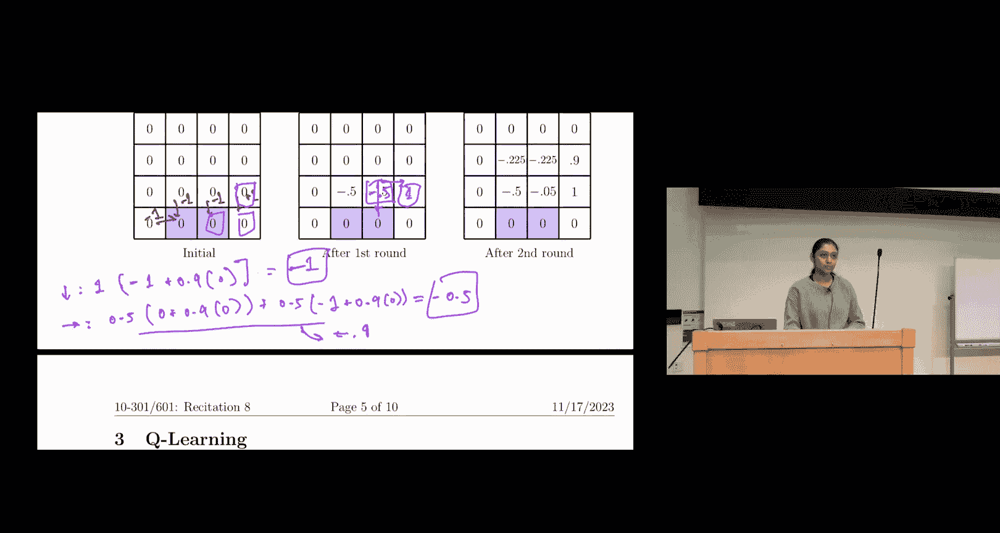

价值迭代通过不断更新每个状态的价值估计来逼近 `V*`。更新公式为：
`V_{k+1}(s) = max_a Σ_{s'} T(s, a, s') * [ R(s, a, s') + γ * V_k(s') ]`

我们演示**同步价值迭代**：在每一轮迭代中，我们使用上一轮所有状态的旧值 `V_k` 来计算本轮的新值 `V_{k+1}`。

以下是第一轮迭代（`V_0` 全为0）中几个格子的计算示例：
*   **格子(1,3)**（阴影格上方）：向右移动会进入奖励-1的格子。`Q(右) = -1 + 0.9*0 = -1`。其他方向动作的Q值均为0。因此 `V_1 = max(-1, 0, 0, 0) = 0`。
*   **格子(2,3)**（红色格上方）：向下移动进入奖励+1的格子。`Q(下) = 1 + 0.9*0 = 1`。其他方向Q值为0。因此 `V_1 = max(1, 0, 0, 0) = 1`。
*   **格子(1,2)**：向下移动进入奖励-1的格子。`Q(下) = -1 + 0.9*0 = -1`。向右移动进入 `V_0=0` 的格子。`Q(右) = 0 + 0.9*0 = 0`。因此 `V_1 = max(-1, 0, ...) = 0`。

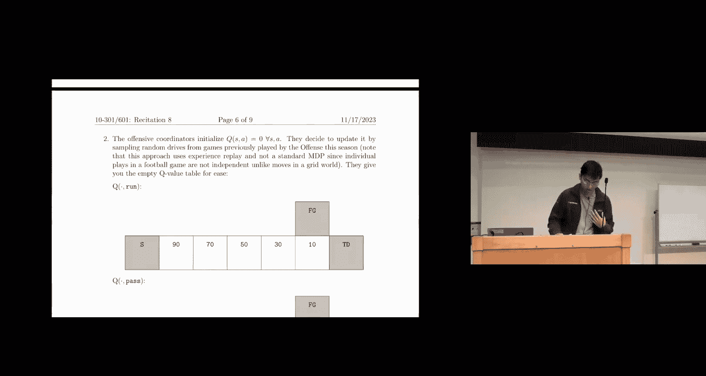

**异步价值迭代**与同步的区别在于：它不区分迭代轮次，在更新某个状态时，直接使用当前内存中**最新**的其他状态价值，无论它是否在本轮被更新过。因此，更新顺序会影响结果。

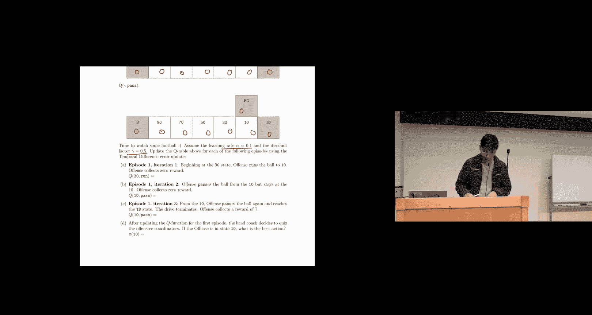

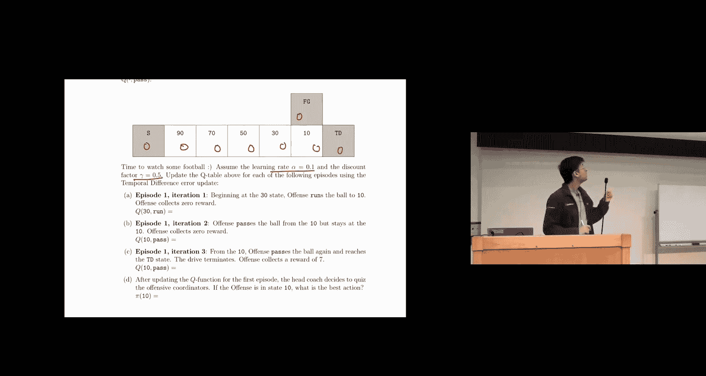

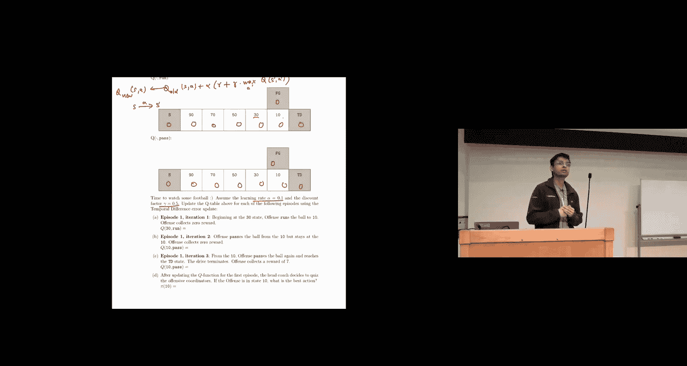

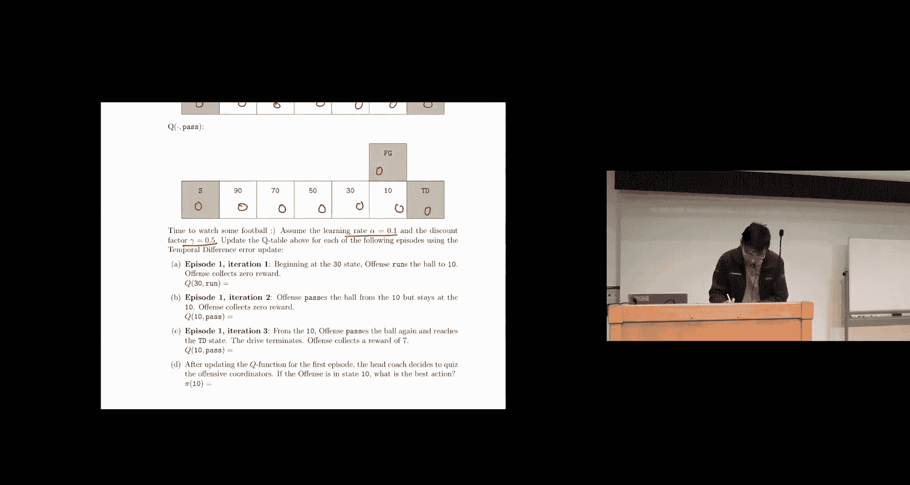

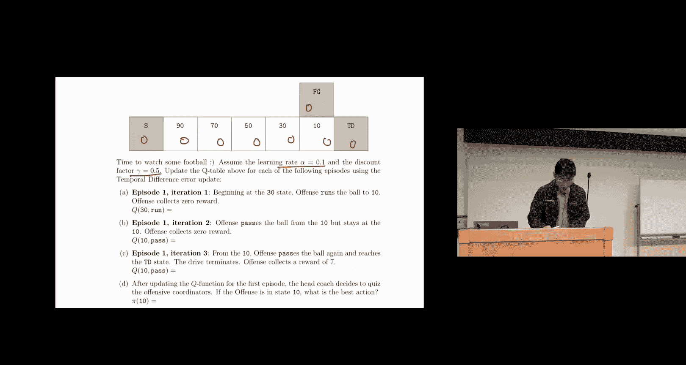

根据计算出的价值函数，我们可以导出策略：在每个状态选择能使 `Q(s,a)` 最大的动作。如果多个动作Q值相同，则按预设规则（如字母顺序）打破平局。

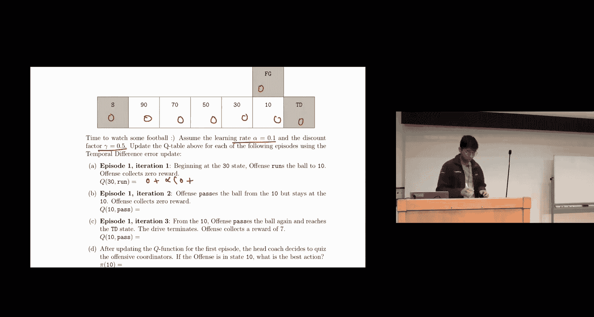

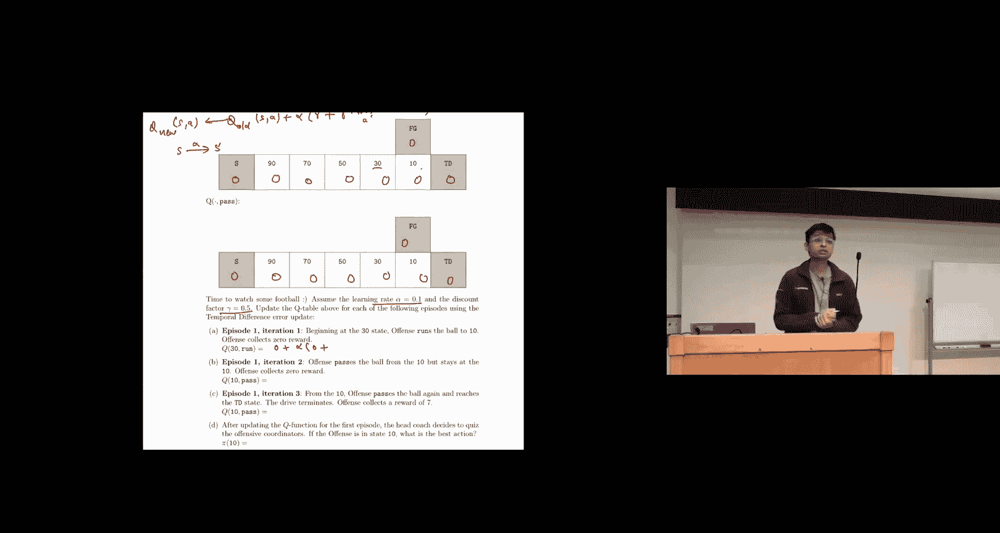

## 非确定性转移示例

之前的例子是确定性的。现在考虑**非确定性**转移：当执行一个动作时，有0.5的概率到达目标方向，0.5的概率滑向下方。

以红色格子上方的格子(2,3)为例，计算 `V_1`：
*   动作`下`：以概率1向下，进入奖励+1的格子。`Q(下) = 1 * [1 + 0.9*0] = 1`。
*   动作`右`：有0.5概率成功向右（奖励0），0.5概率滑向下（奖励+1）。
    `Q(右) = 0.5*[0+0.9*0] + 0.5*[1+0.9*0] = 0.5`
*   因此 `V_1 = max(1, 0.5, ...) = 1`。

以阴影格子(1,3)左侧的格子(1,2)为例：
*   动作`下`：以概率1向下，进入奖励-1的格子。`Q(下) = 1 * [-1 + 0.9*0] = -1`。
*   动作`右`：有0.5概率成功向右（奖励0），0.5概率滑向下（奖励-1）。
    `Q(右) = 0.5*[0+0.9*0] + 0.5*[-1+0.9*0] = -0.5`
*   因此 `V_1 = max(-1, -0.5, ...) = -0.5`。

## Q学习算法示例

当环境模型（`T` 和 `R`）未知时，我们无法直接进行价值迭代。这时可以使用 **Q学习** 算法，通过与环境的交互来直接学习最优Q函数。

考虑一个美式足球简化模型。球场被划分为8个状态（如30码线、10码线等）。有两个动作：跑动(`run`)和传球(`pass`)。只有进入达阵区(`TD`)得+7分，进入安全区(`S`)得-2分，进入射门区(`FG`)得+3分，其他转移奖励为0。学习率 `α=0.1`，折扣因子 `γ=0.5`。

Q学习通过经验更新Q表。更新规则为：
`Q(s, a) ← (1-α) * Q(s, a) + α * [ R + γ * max_{a'} Q(s', a') ]`

我们初始化Q表全为0，并通过几个回合的经验进行更新：
1.  **回合1**：从状态30开始，执行`run`到状态10（奖励0）。`Q(30, run) = 0.9*0 + 0.1*(0 + 0.5*0) = 0`。接着在状态10执行`pass`到达`TD`（奖励+7）。`Q(10, pass) = 0.9*0 + 0.1*(7 + 0.5*0) = 0.7`。
2.  **回合2**：从状态90开始，执行`run`进入`S`（奖励-2）。`Q(90, run) = 0.9*0 + 0.1*(-2 + 0.5*0) = -0.2`。
3.  **回合3**：从状态50开始，经过一系列传递到达状态10，然后执行`run`进入`FG`（奖励+3）。`Q(10, run) = 0.9*0 + 0.1*(3 + 0.5*0) = 0.3`。同时，在状态30执行`run`到达状态10时，`Q(30, run) = 0.9*0 + 0.1*(0 + 0.5*0.7) = 0.035`。

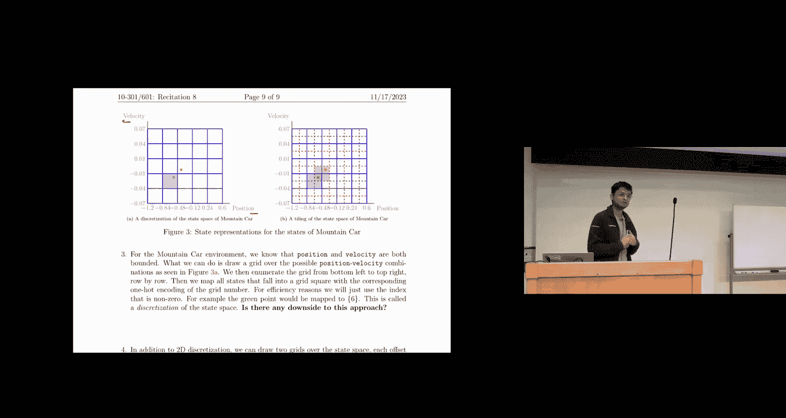

根据更新后的Q表，我们可以给出策略：在状态10，因为 `Q(10, pass)=0.7 > Q(10, run)=0.3`，所以最优动作是`pass`。

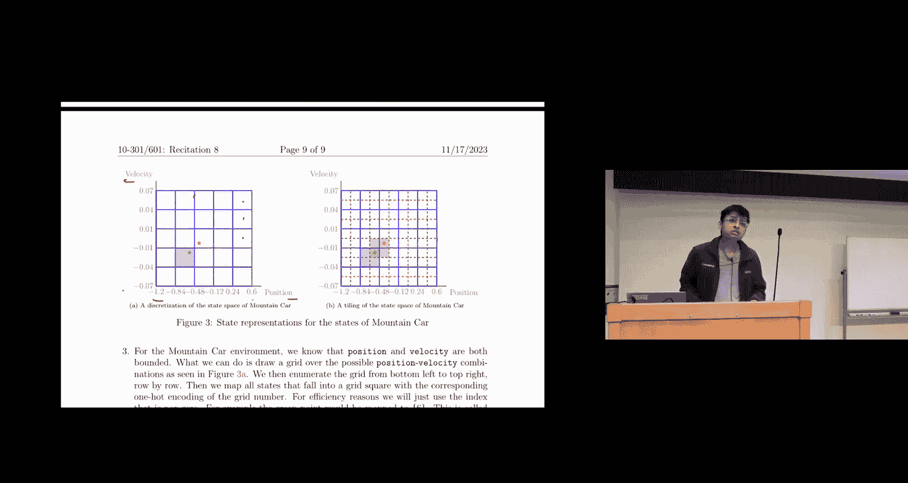

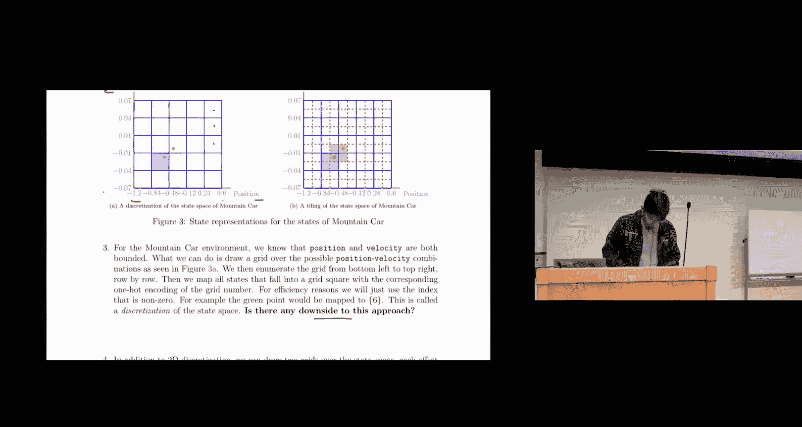

## 状态离散化与函数逼近

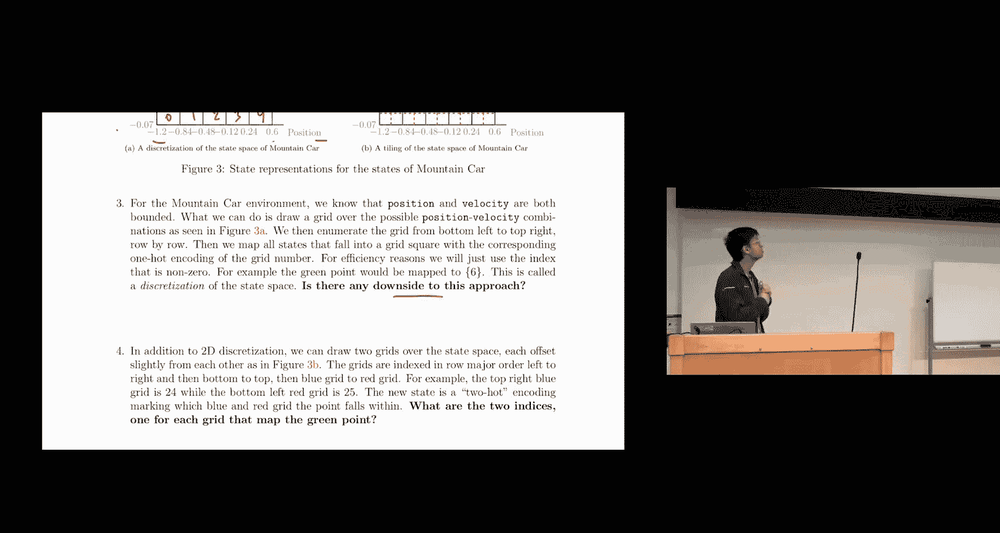

在之前的Q学习例子中，状态数量有限，我们可以用一张表来存储Q值。但当状态空间很大甚至是连续时（例如小车的位置和速度），Q表将变得无限大而无法使用。解决方法是使用**函数逼近**来参数化Q函数。

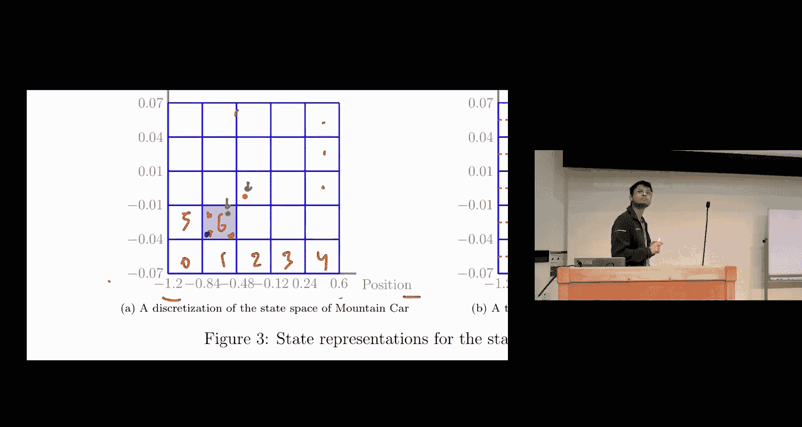

一种简单的方法是**线性逼近**：`Q(s, a; w) = w_a · φ(s)`，其中 `φ(s)` 是状态特征向量，`w_a` 是每个动作对应的权重向量。但线性模型表达能力有限，可能无法拟合复杂的Q函数。

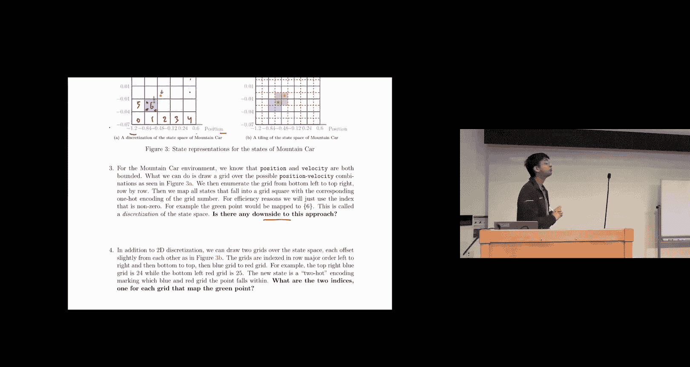

更常用的方法是**状态离散化（瓦片编码）**。将连续的状态空间（如位置、速度）划分成多个网格（瓦片）。每个瓦片对应Q表中的一个条目。一个连续状态 `s` 的Q值，由它所在的所有瓦片对应的Q值的某种组合（如求和）来决定。

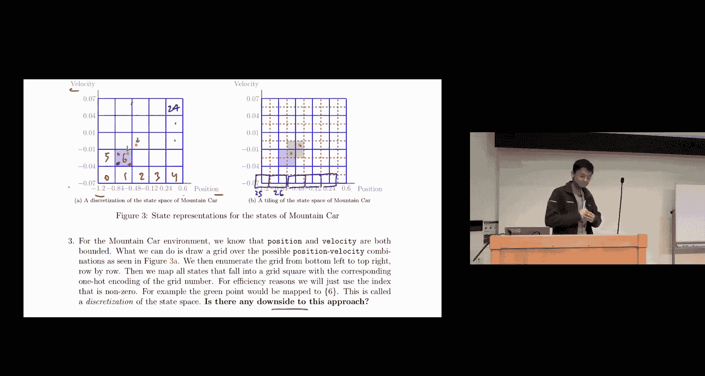

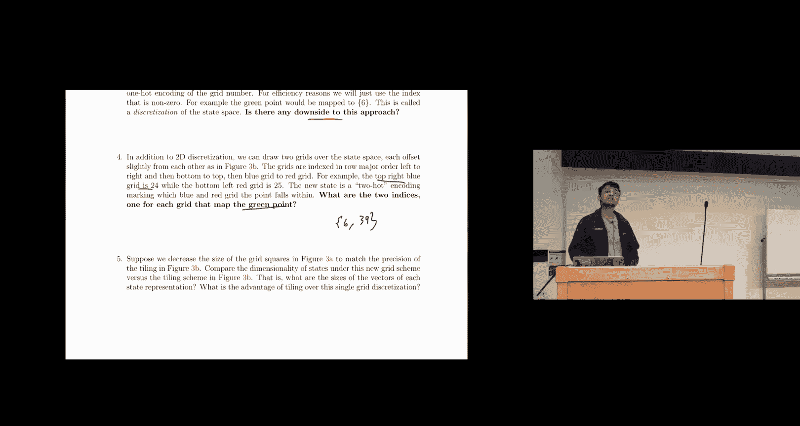

单一粗粒度网格的缺点是分辨率低。采用**多个偏移的网格**可以提高分辨率而不显著增加参数量。例如，两个5x5的偏移网格等效于一个更精细的10x10网格的效果，但参数只有 `25+25=50` 个，而不是100个。每个状态现在由它在两个网格中的索引共同表示，从而获得更精确的估值。

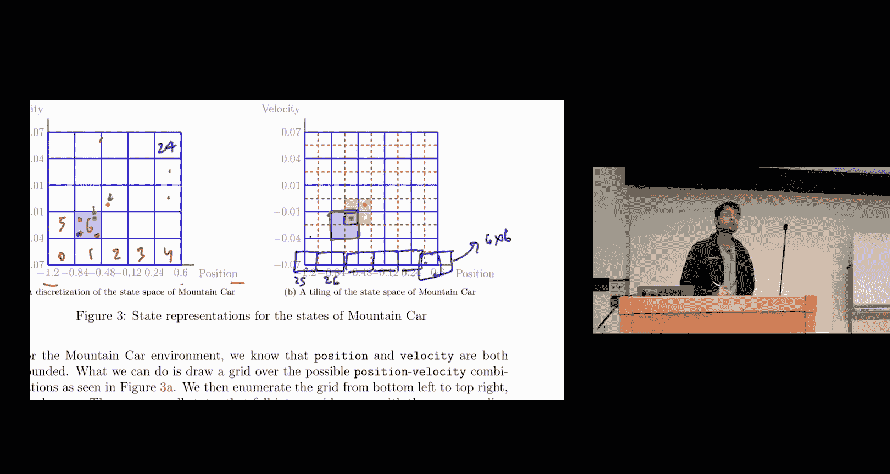

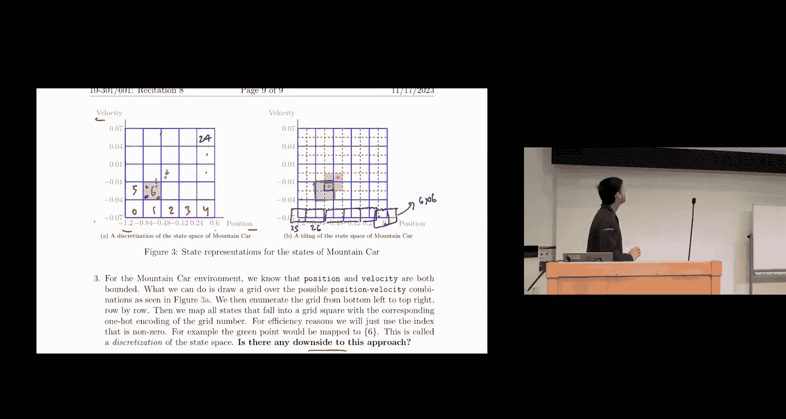

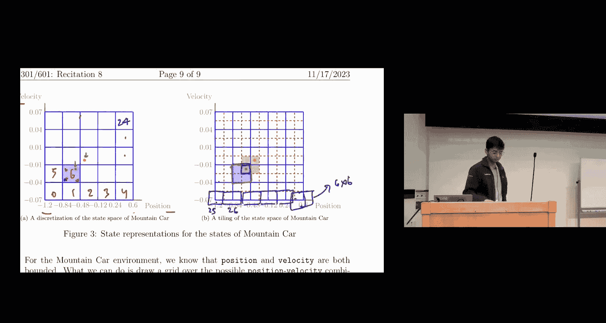

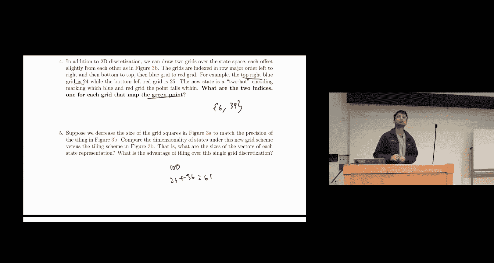

本节课中我们一起学习了强化学习的核心框架马尔可夫决策过程，理解了价值函数、策略函数和Q函数的概念与关系。我们通过网格世界的例子，实践了价值迭代算法在确定性和非确定性环境下的计算过程。最后，我们探讨了在模型未知时如何使用Q学习，以及在状态空间连续时如何通过离散化和函数逼近来应用Q学习算法。