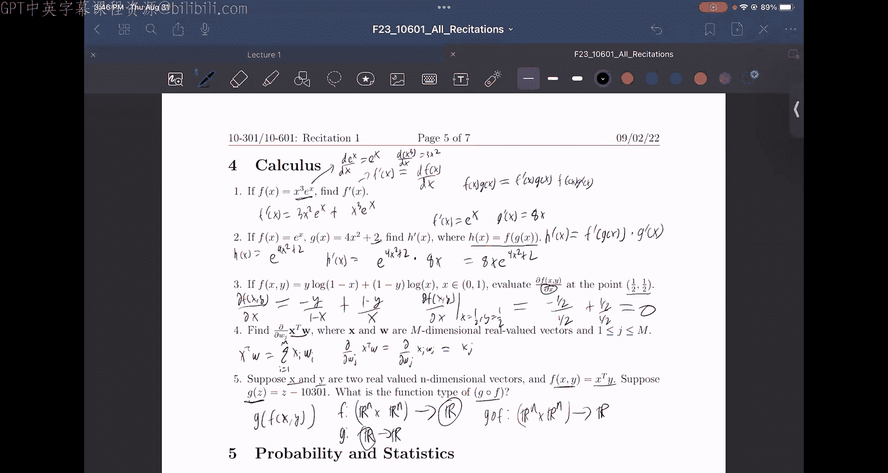

# 32：微积分复习

在本节课中，我们将要学习机器学习中常用的微积分概念，包括乘积法则、链式法则、偏导数以及对向量值表达式的求导。这些是理解后续机器学习算法（如梯度下降）的基础。

## 乘积法则

上一节我们介绍了课程概述，本节中我们来看看第一个核心概念：乘积法则。当我们需要对两个函数的乘积求导时，需要使用乘积法则。

以下是乘积法则的公式和应用步骤：

*   **公式**：若 `h(x) = f(x) * g(x)`，则 `h'(x) = f'(x) * g(x) + f(x) * g'(x)`。
*   **示例**：设 `f(x) = x^3 * e^x`，求 `f'(x)`。
    *   令 `u(x) = x^3`， `v(x) = e^x`。
    *   计算 `u'(x) = 3x^2`， `v'(x) = e^x`。
    *   应用乘积法则：`f'(x) = (3x^2) * (e^x) + (x^3) * (e^x)`。

## 链式法则

掌握了乘积法则后，我们来看看如何处理复合函数。链式法则用于求复合函数的导数。

以下是链式法则的公式和应用步骤：

*   **公式**：若 `h(x) = f(g(x))`，则 `h'(x) = f'(g(x)) * g'(x)`。
*   **示例**：设 `f(x) = e^x`， `g(x) = 4x^2 + 2`， `h(x) = f(g(x))`，求 `h'(x)`。
    *   计算 `f'(x) = e^x`， `g'(x) = 8x`。
    *   应用链式法则：`h'(x) = f'(g(x)) * g'(x) = e^(4x^2+2) * 8x`。

## 偏导数

在机器学习中，我们经常处理多变量函数。偏导数是指在求导时，将其他变量视为常数，只对目标变量进行求导。

以下是计算偏导数的步骤：

*   **方法**：对目标变量求导，其他变量视为常数。
*   **示例**：设 `L(x, y) = -y * log(1-x) + (1-y) * log(x)`，求 `∂L/∂x` 并在 `(x, y) = (1/2, 1/2)` 处求值。
    *   对 `x` 求偏导：`∂L/∂x = -y * (1/(1-x)) * (-1) + (1-y) * (1/x) = y/(1-x) + (1-y)/x`。
    *   代入 `x=1/2`, `y=1/2`：`(1/2)/(1/2) + (1/2)/(1/2) = 1 + 1 = 2`。

## 向量表达式的导数

机器学习模型通常涉及向量和矩阵运算。理解如何对向量点积等表达式求导至关重要。

以下是向量点积对特定分量求导的方法：

*   **问题**：设 `x` 和 `w` 为 m 维向量， `f = x^T w`（点积）。求 `∂f/∂w_j`（对 `w` 的第 j 个分量求偏导）。
*   **推导**：
    *   `x^T w = Σ_{i=1}^{m} x_i * w_i`。
    *   当对特定的 `w_j` 求偏导时，求和中其他项（`i ≠ j`）的导数均为 0。
    *   因此，`∂f/∂w_j = ∂(x_j * w_j)/∂w_j = x_j`。

## 函数复合与类型

最后，我们分析函数复合时的输入输出类型，这有助于理解模型中的数据流。

以下是判断复合函数类型的步骤：

*   **问题**：设 `F(x, y) = x^T y`（`x, y ∈ R^n`）， `G(z) = z - 10301`。求复合函数 `H = G ∘ F` 的类型（即输入和输出的维度）。
*   **分析**：
    *   `F` 的类型：输入两个 n 维向量，输出一个标量。记作：`R^n × R^n → R`。
    *   `G` 的类型：输入一个标量，输出一个标量。记作：`R → R`。
    *   `H(x, y) = G(F(x, y))`：`F` 的输出（`R`）是 `G` 的输入（`R`），类型匹配，可以复合。
    *   `H` 的类型：输入与 `F` 相同，输出与 `G` 相同。记作：`R^n × R^n → R`。

本节课中我们一起学习了机器学习所需的微积分核心知识：乘积法则、链式法则、偏导数的计算，以及如何对向量点积求导和分析复合函数的类型。掌握这些内容是理解后续梯度计算和优化算法的基础。