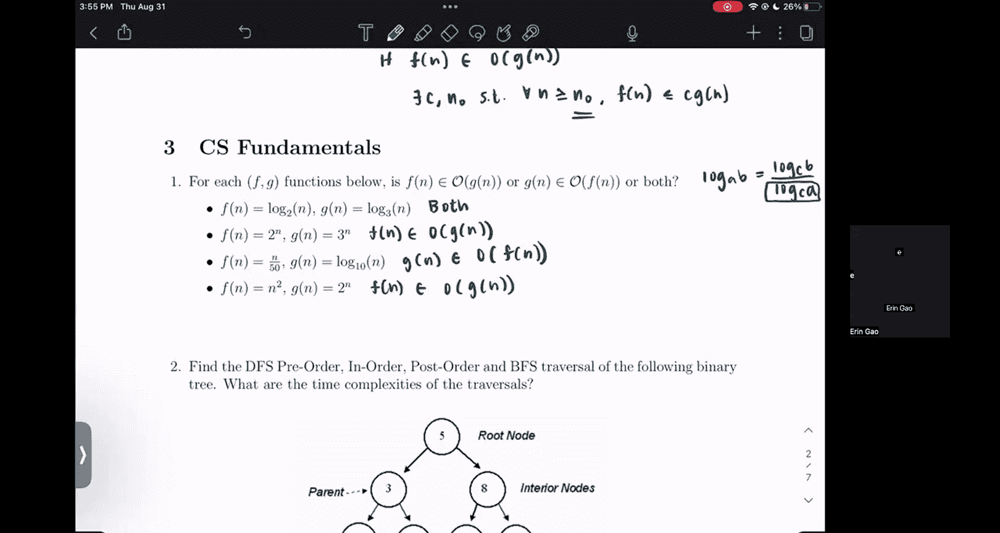

# 33：计算复杂度基础

在本节课中，我们将学习计算复杂度分析的基础知识，特别是大O符号的定义和应用。这对于理解机器学习算法的效率至关重要。

## 大O符号定义

大O符号用于描述函数增长的上界。其正式定义如下：

**定义**：对于一个函数 `f(n)`，如果存在正常数 `c` 和 `n0`，使得对于所有 `n ≥ n0`，都有 `f(n) ≤ c * g(n)` 成立，那么我们就说 `f(n)` 是 `O(g(n))`。

用公式表示为：
`f(n) = O(g(n))` 当且仅当 `∃ c > 0, ∃ n0 > 0, ∀ n ≥ n0: f(n) ≤ c * g(n)`

接下来，我们将通过几个具体例子来应用这个定义。

## 复杂度关系判断练习

以下是四个判断函数间大O关系的练习题。对于每一对函数 `f(n)` 和 `g(n)`，我们需要判断是 `f(n) = O(g(n))`，还是 `g(n) = O(f(n))`，或者两者都成立。

### 1. 对数函数比较

**问题**：`f(n) = log₂(n)`， `g(n) = log₁₀(n)`

**分析**：这两个函数都是对数函数，仅底数不同。根据对数换底公式，任何底数的对数都可以相互转换，其差异仅在于一个常数因子。

**换底公式**：
`logₐ(b) = log_c(b) / log_c(a)`

应用此公式，`log₂(n)` 可以写成 `log₁₀(n) / log₁₀(2)`。分母 `log₁₀(2)` 是一个常数。在大O表示法中，常数因子可以被吸收到常数 `c` 中。因此，这两个函数的增长率是相同的。

**结论**：两者互为对方的大O，即 `f(n) = O(g(n))` 且 `g(n) = O(f(n))`。

### 2. 指数函数比较（底数不同）

**问题**：`f(n) = 2ⁿ`， `g(n) = 3ⁿ`

**分析**：我们需要比较两个不同底数的指数函数的增长率。随着 `n` 增大，底数更大的指数函数增长更快。

从逻辑上思考，`2ⁿ` 的增长速度明显慢于 `3ⁿ`。因此，增长较慢的函数是增长较快函数的大O。

**结论**：`f(n) = O(g(n))`，但 `g(n) ≠ O(f(n))`。

### 3. 线性函数与对数函数比较

**问题**：`f(n) = n/50`， `g(n) = log₁₀(n)`

**分析**：这里比较的是线性增长和对数增长。虽然当 `n` 很小时，`n/50` 的值可能比 `log₁₀(n)` 小，但线性函数的增长率最终会超过对数函数。

我们可以找到一个足够大的 `n0`，使得对于所有 `n ≥ n0`，都有 `n/50 > log₁₀(n)`。这意味着对数函数 `g(n)` 是线性函数 `f(n)` 的大O。

**结论**：`g(n) = O(f(n))`，但 `f(n) ≠ O(g(n))`。

### 4. 指数函数与多项式函数比较

**问题**：`f(n) = 2ⁿ`， `g(n) = n²`

**分析**：这是指数增长和多项式增长的经典比较。指数函数 `2ⁿ` 的增长速度远快于任何多项式函数 `nᵏ`（k为常数）。

即使绘制函数图像，也能清晰地看到 `2ⁿ` 的曲线很快就会远超 `n²`。因此，多项式函数是指数函数的大O。

**结论**：`g(n) = O(f(n))`，但 `f(n) ≠ O(g(n))`。

## 总结

本节课中，我们一起学习了计算复杂度的核心概念——大O符号。我们首先回顾了其精确定义，然后通过四个实例练习，分析了不同函数类型（对数、线性、多项式、指数）之间的增长率关系。理解这些关系是评估和比较机器学习算法效率的基础。记住关键点：在大O分析中，我们关注的是函数的长期增长趋势，常数因子和低阶项通常可以忽略。