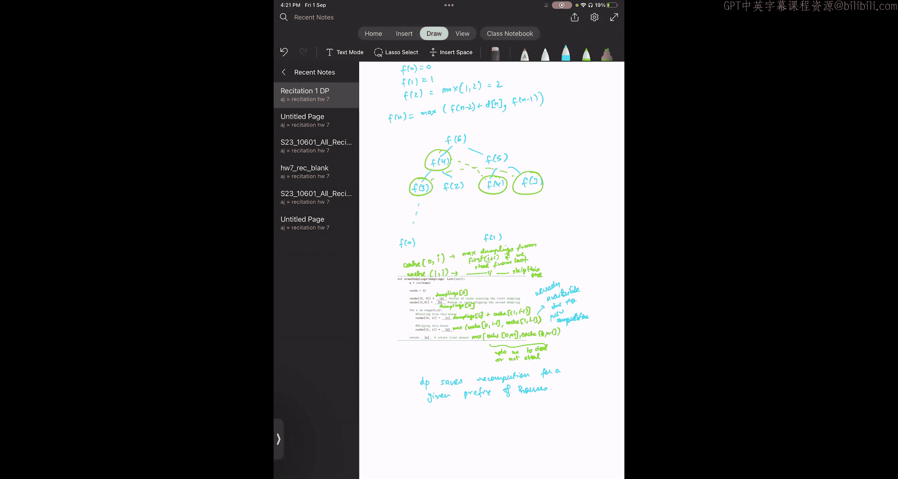

# 34：动态规划作业1解析 🐼


在本节课中，我们将学习如何运用动态规划解决一个实际问题：帮助功夫熊猫在不触发警报的情况下，偷取最多的包子。我们将从问题描述开始，逐步推导出解决方案，并最终用代码实现。

## 问题概述

功夫熊猫最喜欢的食物是蒸猪肉包子，他计划从沿直线排列的村庄房屋中偷取包子。村庄有一个特殊的安全系统：如果连续两间房屋发生盗窃，系统会向师傅发出警报。我们的目标是运用动态规划方法，帮助熊猫在不触发警报的前提下，偷取最大数量的包子。

## 核心思路推导

首先，我们定义状态。设 `F(n)` 表示从前 `n` 间房屋（索引从0开始）中能偷取的最大包子数量。

例如：
*   `F(0)` 就是从第一间房屋（索引0）能偷的包子数，即 `dumplings[0]`。
*   `F(1)` 是从前两间房屋中能偷的最大值。由于不能连续偷，所以是 `max(dumplings[0], dumplings[1])`。

接下来，我们思考如何计算一般的 `F(n)`。对于第 `n` 间房屋（索引为 `n`），我们有两种选择：

1.  **偷这间房屋**：如果我们决定偷第 `n` 间房屋的包子，那么为了不触发警报，我们就**不能偷**第 `n-1` 间房屋。因此，此时的最大收益是 `dumplings[n]` 加上从前 `n-2` 间房屋中获得的最大收益，即 `dumplings[n] + F(n-2)`。
2.  **不偷这间房屋**：如果我们决定不偷第 `n` 间房屋，那么最大收益就等于从前 `n-1` 间房屋中获得的最大收益，即 `F(n-1)`。

为了获得全局最优解，`F(n)` 应该取这两种选择中的较大值。因此，我们得到**状态转移方程**：

**`F(n) = max( dumplings[n] + F(n-2), F(n-1) )`**

这个方程是解决问题的核心。

## 从递归到动态规划

根据上面的方程，我们可以写出一个递归函数来计算 `F(n)`。例如，要计算 `F(6)`，需要先计算 `F(5)` 和 `F(4)`；而计算 `F(5)` 又需要 `F(4)` 和 `F(3)`。这会导**致大量的重复计算**，效率低下。

动态规划通过“记忆化”（缓存）来避免这种重复。我们创建一个数组（通常称为 `dp` 或 `cache`），用来存储已经计算过的 `F(i)` 的值。这样，当再次需要某个 `F(i)` 时，我们可以直接从数组中读取，而无需重新计算。

以下是实现这一思路的具体步骤。

## 算法实现步骤

我们将使用一个数组 `cache` 来存储中间结果。`cache[i]` 将存储从前 `i+1` 间房屋（即房屋0到房屋 `i`）中能偷取的最大包子数。

1.  **初始化**：处理最简单的情况。
    *   如果只有一间房屋 (`n=0`)，那么最大收益就是偷这间房屋：`cache[0] = dumplings[0]`。
    *   如果有两间房屋 (`n=1`)，由于不能连续偷，最大收益是两间房屋中包子的较大值：`cache[1] = max(dumplings[0], dumplings[1])`。

2.  **递推计算**：从第三间房屋开始 (`i = 2`)，一直计算到最后一间房屋 (`i = n-1`)，利用状态转移方程填充 `cache` 数组。
    *   对于房屋 `i`，如果选择偷，收益为 `dumplings[i] + cache[i-2]`（因为不能偷 `i-1`）。
    *   如果选择不偷，收益为 `cache[i-1]`。
    *   `cache[i]` 取这两者的最大值。

3.  **获取结果**：计算完成后，`cache` 数组的最后一个元素 `cache[n-1]` 就是我们的答案，即从所有房屋中能偷取的最大包子数量。

下面是该算法的伪代码描述：

```python
def max_dumplings(dumplings):
    n = len(dumplings)
    if n == 0:
        return 0
    if n == 1:
        return dumplings[0]

    # 初始化缓存数组
    cache = [0] * n
    cache[0] = dumplings[0]
    cache[1] = max(dumplings[0], dumplings[1])

    # 动态规划递推
    for i in range(2, n):
        steal = dumplings[i] + cache[i-2]  # 偷当前房屋
        skip = cache[i-1]                  # 不偷当前房屋
        cache[i] = max(steal, skip)        # 记录最优解

    return cache[n-1]
```

## 总结



本节课我们一起学习了如何运用动态规划解决“不能连续偷窃”的最大化收益问题。我们首先定义了状态 `F(n)`，然后推导出关键的状态转移方程 **`F(n) = max( dumplings[n] + F(n-2), F(n-1) )`**。接着，我们分析了递归方法的缺陷，并引入了通过缓存（记忆化）来避免重复计算的动态规划方法。最后，我们给出了清晰的算法步骤和伪代码实现。掌握这个“打家劫舍”问题的经典模型，是理解动态规划思想的重要一步。