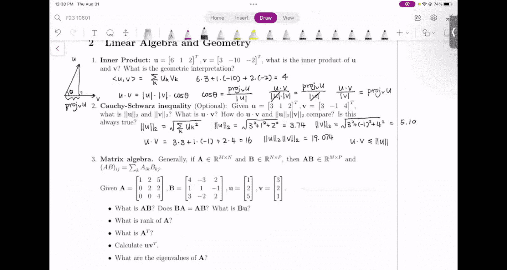
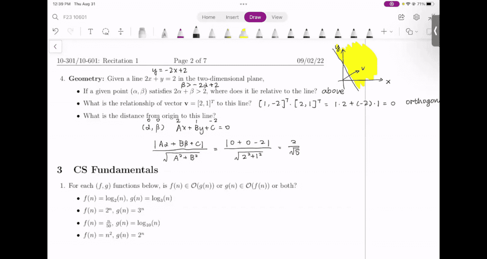

# 35：线性代数与几何

在本节课中，我们将学习线性代数与几何的基础知识，包括向量的内积、范数、矩阵运算以及几何关系的理解。这些概念是机器学习中处理数据和模型的基础。

## 内积的计算与几何意义

首先，我们介绍两个向量的内积。内积的计算公式是：两个向量对应元素乘积之和。

给定向量 **U** = [6, 1, 2] 和 **V** = [3, -10, -2]，其内积计算如下：
`<U, V> = 6*3 + 1*(-10) + 2*(-2) = 4`

从几何角度看，内积与一个向量在另一个向量上的投影长度成正比。在实数空间中，内积即为点积，其公式为：
`U · V = ||U|| * ||V|| * cosθ`
其中，θ 是两向量之间的夹角。投影长度 `proj_V(U)` 满足关系 `U · V ∝ proj_V(U)`。

## 向量的范数与柯西-施瓦茨不等式

接下来，我们计算向量的范数（长度）并验证一个重要的不等式。

给定向量 **U** = [3, 1, 2] 和 **V** = [3, -1, 4]。
- **U** 的范数：`||U|| = √(3² + 1² + 2²) ≈ 3.74`
- **V** 的范数：`||V|| = √(3² + (-1)² + 4²) ≈ 5.1`
- 点积：`U · V = 3*3 + 1*(-1) + 2*4 = 16`
- 范数乘积：`||U|| * ||V|| ≈ 19.07`




比较发现，点积（16）小于范数的乘积（19.07）。这引出了柯西-施瓦茨不等式，它指出对于任意两个向量，其点积的绝对值总是不大于它们范数的乘积：
`|U · V| ≤ ||U|| * ||V||`

## 矩阵代数运算

现在，我们进入矩阵运算部分。给定两个 3x3 矩阵 **A** 和 **B**。

**计算矩阵乘积 AB**
矩阵 **AB** 的每个元素是 **A** 的一行与 **B** 的一列的点积。计算结果如下：
```
AB = [[21, -11, 10],
      [8,  -2,  2],
      [12, -8,  8]]
```
**B** 是否等于 **AB**？答案是否定的，可以通过计算 **BA** 来验证。

**计算矩阵与向量的乘积 BU**
给定向量 **U** = [1, 2, 5]^T，计算 **BU**。这是一个 3x1 的矩阵，每个元素是 **B** 的一行与 **U** 的点积：
`BU = [8, -2, 9]^T`

**矩阵的秩**
矩阵 **A** 的秩是其线性无关列的数量。观察可知，**A** 的三个列向量是线性无关的，因此 `rank(A) = 3`。

**矩阵的转置**
矩阵 **A** 的转置 **A^T** 是通过对角线翻转得到的：
```
A^T = [[1, 0, 0],
       [2, 2, 0],
       [5, 2, 4]]
```

**计算外积 U V^T**
向量 **U** (3x1) 与 **V** 的转置 **V^T** (1x3) 相乘，得到一个 3x3 矩阵：
```
U V^T = [[1*3, 1*2, 1*1],
         [2*3, 2*2, 2*1],
         [5*3, 5*2, 5*1]]
      = [[3, 2, 1],
         [6, 4, 2],
         [15, 10, 5]]
```

**计算矩阵的特征值**
矩阵 **A** 的特征值 λ 满足方程 `A v = λ v`，其中 **v** 是非零向量。这等价于求解 `det(A - λI) = 0`。
对于矩阵 **A**，求解特征方程得到：
`(1-λ)(2-λ)(4-λ) = 0`
因此，矩阵 **A** 的特征值为 λ = 1, 2, 4。

## 二维空间中的几何关系

最后，我们探讨二维空间中的几何问题。给定直线 `2x + y = 2`。

**点的相对位置**
对于满足 `2α + β > 2` 的点 (α, β)，我们可以将不等式改写为 `β > -2α + 2`。这意味着该点始终位于直线的上方。

**向量与直线的方向关系**
直线方程 `2x + y = 2` 可以理解为：x 每增加 1 单位，y 减少 2 单位。因此，直线的方向向量是 **d** = [1, -2]。
给定向量 **V** = [2, 1]，计算其与方向向量的点积：
`d · V = 1*2 + (-2)*1 = 0`
由于点积为零，向量 **V** 与直线的方向向量 **d** 正交，因此向量 **V** 垂直于该直线。

**点到直线的距离**
计算从原点 (0, 0) 到直线 `2x + y - 2 = 0` 的距离。点到直线的距离公式为：
`distance = |Aα + Bβ + C| / √(A² + B²)`
将 A=2, B=1, C=-2, α=0, β=0 代入公式：
`distance = |0 + 0 - 2| / √(2² + 1²) = 2 / √5`
因此，原点到该直线的距离是 `2/√5`。

## 总结



本节课中，我们一起学习了线性代数与几何的核心概念。我们掌握了如何计算向量的内积与范数，理解了柯西-施瓦茨不等式。我们练习了矩阵的基本运算，包括乘法、转置、秩和外积，并学习了如何求解矩阵的特征值。最后，我们探讨了二维空间中点、直线与向量的几何关系，包括位置判断、方向正交性以及距离计算。这些知识为后续的机器学习学习奠定了坚实的数学基础。