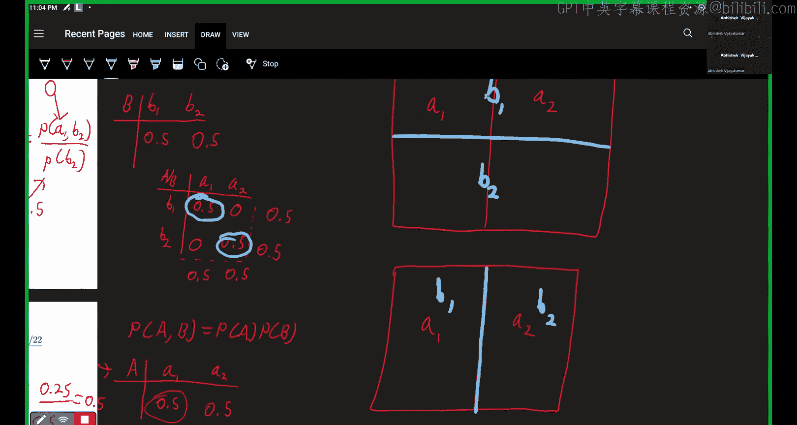

# 37：概率基础（第一部分）

在本节课程中，我们将学习概率论与统计学的基础知识。课程内容将聚焦于随机变量及其分布，并重点探讨两个核心概念：**互斥性**与**随机变量的独立性**。我们将通过具体的例子和图表来阐明这些概念。

## 概述

在本节中，我们将学习概率论的基本概念，特别是随机变量的互斥性与独立性。我们将通过构建概率表和使用图形化表示来理解这些概念，并学习如何计算联合概率与条件概率。

## 概率与随机变量

你应该已经熟悉概率的一些基本概念，例如样本空间中的事件或结果。然而，在本课程中，大部分内容将聚焦于**随机变量**及其**分布**。

我们使用的符号如下。如果你对书面形式表达的某些概念不熟悉，请查阅本课程网站上的符号指南。

假设我们有两个随机变量 **A** 和 **B**。**A** 有两种可能结果：**A1** 或 **A2**。**B** 也有两种可能结果：**B1** 或 **B2**。

已知：
*   **P(A = A1) = 0.5**
*   **P(B = B1) = 0.5**

由于 **A** 的可能结果只有 A1 和 A2，**B** 的可能结果只有 B1 和 B2（即它们都是**二元随机变量**），我们可以推断出：
*   **P(A = A2) = 0.5**
*   **P(B = B2) = 0.5**

在本课程中，我们会经常见到二元随机变量，其结果通常为 0 和 1。

## 随机变量间的关系：互斥性

现在，让我们考虑 **A** 和 **B** 之间的关系。首先，假设 **A1** 和 **B2** 是**互斥**的结果。这意味着如果 **A1** 发生，则 **B2** 不可能发生。

我们可以为 **A** 和 **B** 同时绘制一个概率表。我们将结果 A1、A2 写在这里，将结果 B1、B2 写在这里。

我们知道 A1 的总概率必须是 0.5，所以这一列的总和必须为 0.5。同样，A2 列的总和也必须为 0.5。B1 和 B2 行的总和也必须各为 0.5。

我们知道，如果 A1 发生，B2 不可能发生，因为 A1 和 B2 是互斥的。因此，这个表中 A1 与 B2 交叉的单元格概率必须为 0。

**P(A = A1, B = B2) = 0**

这是因为 A1 和 B2 被定义为互斥。

接着，我们来看 **P(A = A1, B = B1)**。我们知道 A1 列的总和必须为 0.5，并且 A1B2 单元格为 0，所以 A1B1 单元格必须是 0.5。利用这一点，我们可以填满表格的其余部分。现在我们知道第一行的总和必须是 0.5，所以 A2B1 单元格必须是 0，这又迫使 A2B2 单元格为 0.5，以满足剩余的总和条件。

因此，我们可以回答第二个问题：A1 和 B1 同时发生的概率是 0.5。

**P(A = A1, B = B1) = 0.5**

下一个问题稍微复杂一些，它涉及**条件概率**。我们要求的是 **P(A = A1 | B = B2)**。

条件概率的定义告诉我们：
**P(A1 | B2) = P(A1, B2) / P(B2)**

P(B2) 已知为 0.5。而 P(A1, B2) 在我们的概率表中为 0。因此，这个条件概率也是 0。这再次体现了互斥性的含义。

**P(A = A1 | B = B2) = 0**

需要注意的是，第一个问题和第三个问题之间存在区别。第一个问题是问“A1 和 B2 同时发生的概率是多少？”。第三个问题则是说“已知 B2 已经发生，那么 A1 发生的概率是多少？”。在这个例子中，它们恰好都是 0。

## 随机变量间的关系：独立性

现在，我们来看第二种情况：**A** 和 **B** 是**独立**的。这意味着对于 **A** 和 **B** 的某些结果，其联合概率等于各自概率的乘积：
**P(A, B) = P(A) * P(B)**

让我们看看这如何体现在概率表中。**A** 和 **B** 各自的概率分布与之前相同：P(A1)=0.5，P(A2)=0.5；P(B1)=0.5，P(B2)=0.5。但由于 **A** 和 **B** 的关系改变了，它们的联合概率表会有所不同。

和之前一样，A1 列的总和必须为 0.5，A2 列的总和也必须为 0.5。B1 行和 B2 行的总和也必须各为 0.5。

现在我们有了额外的约束：对于任意情况，**P(A, B) = P(A) * P(B)**。

让我们计算 **P(A = A1, B = B2)**。
**P(A1, B2) = P(A1) * P(B2) = 0.5 * 0.5 = 0.25**

我们可以直接从 **A** 和 **B** 各自的概率分布中读取这些信息，然后填入联合概率表。实际上，我们表格中的所有四个单元格都具有相同的概率：**0.25**。

接着看第二个问题：**P(A = A1, B = B1)**。同样地：
**P(A1, B1) = P(A1) * P(B1) = 0.5 * 0.5 = 0.25**

最后，我们来看条件概率的情况。现在计算 **P(A = A1 | B = B2)**。
**P(A1 | B2) = P(A1, B2) / P(B2)**

P(B2) 为 0.5，P(A1, B2) 为 0.25。因此答案是 0.5。

**P(A = A1 | B = B2) = 0.5**

## 图形化理解

到目前为止，我们使用概率表完成了所有练习。但我们也可以更图形化地理解**互斥性**和**独立性**的概念。

假设我们有一个图形来表示我们的样本空间或所有可能的结果。

**独立**的情况看起来像这样：我们将空间在 A1/A2 事件和 B1/B2 事件之间均匀划分。可以看到，每个单元格占据样本空间大致相等的部分。知道我们处于图形的 B1 半区，并不能给我们提供任何关于我们更可能处于 A1 还是 A2 区的额外信息，因为空间的划分使得 A 和 B 互不偏倚。这就是独立性的概念。

**互斥**结果（或称互不相容）的情况则更像这样：我们同样用 A1 和 A2 划分空间，但现在我们说结果 A1 和 B2 是互斥的。因此，在 A1 发生的情况下，B2 不可能发生；B2 只能发生在 A2 的情况下。由于 B2 和 A2 的概率都是 0.5，所以这个区域必须是样本空间中大小相等的区域。因此，A1B1 占据了空间的一半，A2B2 占据了空间的另一半。告诉我们处于 A1 区，也就确切地告诉我们一定也处于 B1 的情况。这正好对应了我们概率表中此处为 0.5、彼处为 0.5，而其他情况为 0 的情形。

## 总结

在本节课中，我们一起学习了概率论的基础，重点探讨了随机变量的**互斥性**与**独立性**。我们通过构建联合概率表，计算了联合概率 **P(A, B)** 和条件概率 **P(A|B)**，并利用图形化方式加深了对这两个核心概念的理解。互斥性意味着两个事件不能同时发生，而独立性意味着一个事件的发生不影响另一个事件发生的概率。在下一节中，我们将探讨概率的一些应用。