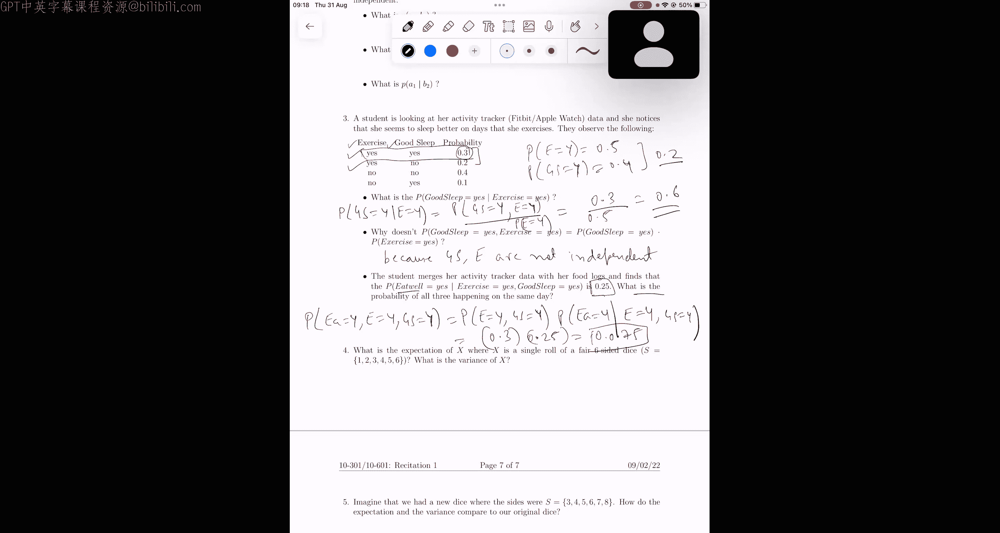
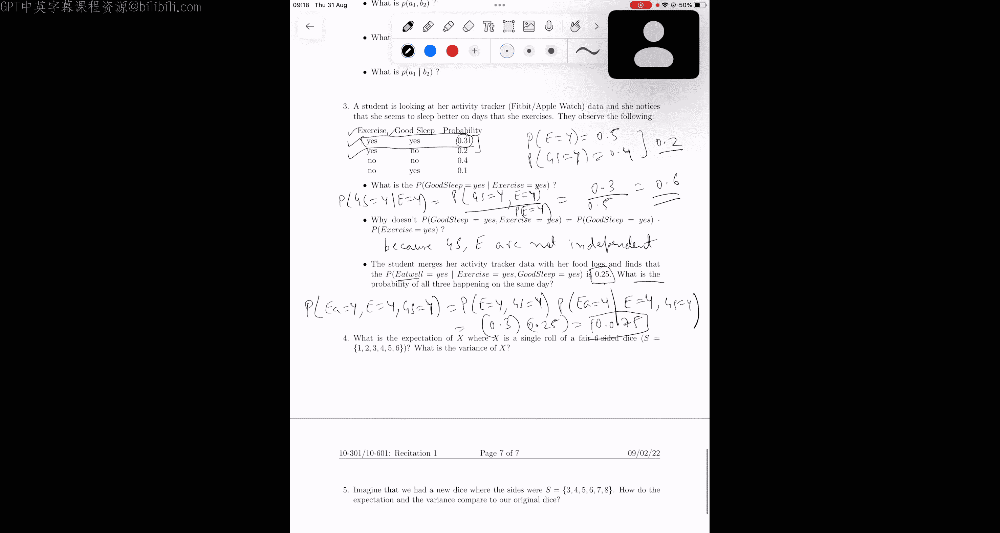
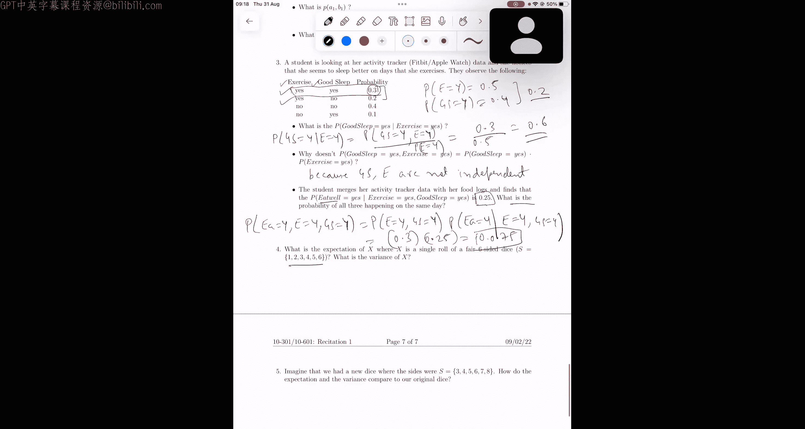
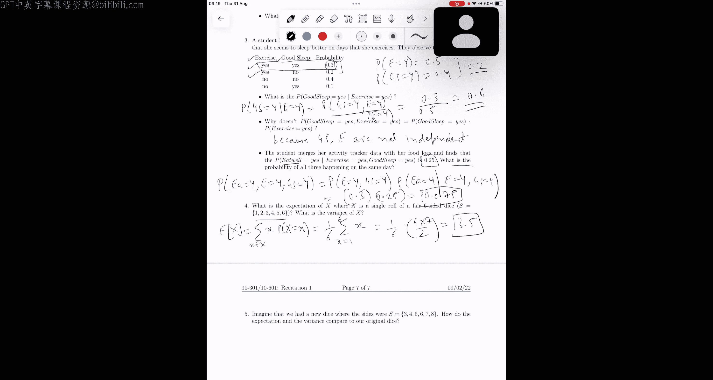
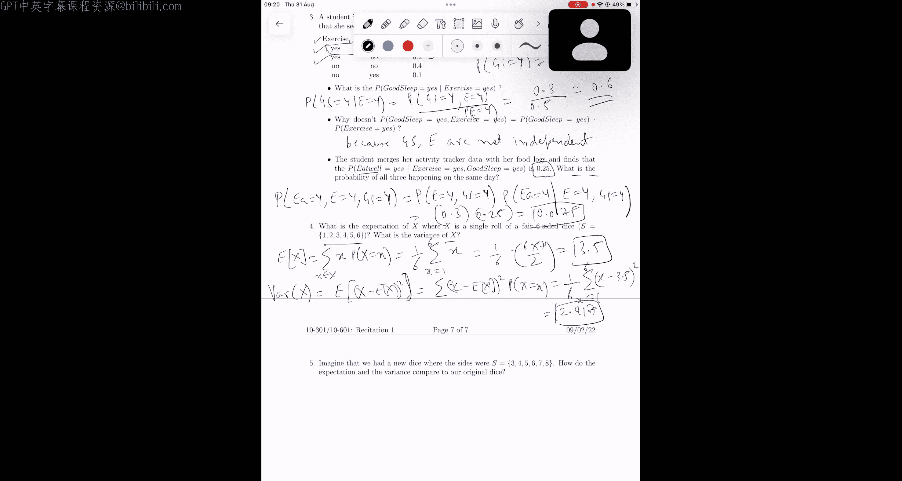
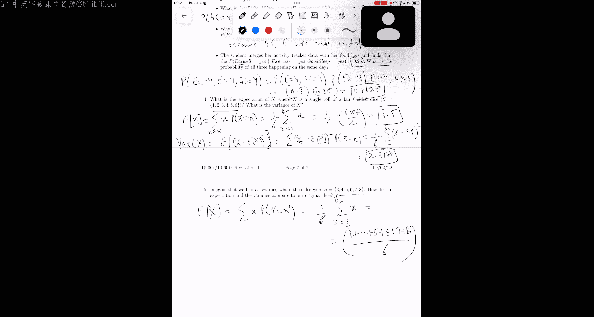
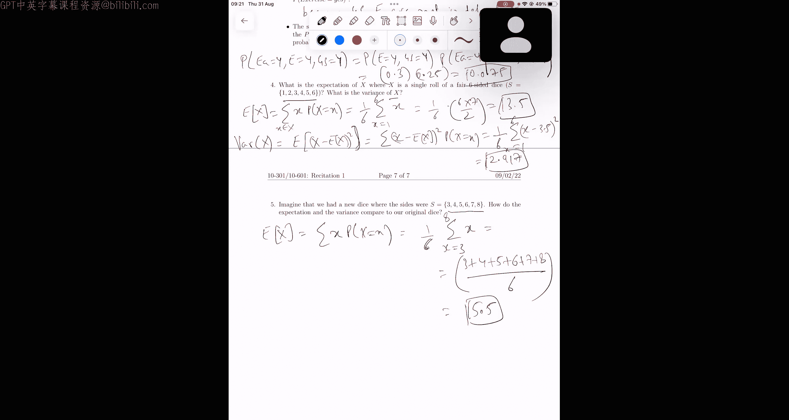
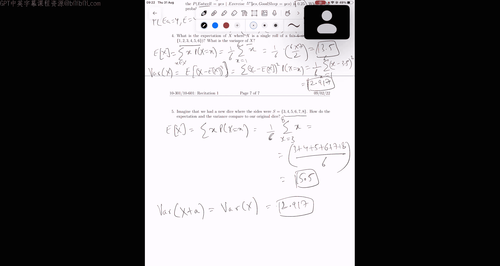

# 38：概率与统计（第二部分）📊

在本节课中，我们将继续学习概率与统计的基础知识，重点探讨联合分布、条件概率、独立性、期望值与方差等核心概念。我们将通过具体的例题来理解这些概念的应用。

---

## 联合分布与条件概率

上一节我们介绍了概率的基本概念，本节中我们来看看如何从联合分布中计算条件概率。

我们有两个随机变量：**运动**（Exercise）和**良好睡眠**（Good Sleep）。它们的联合分布如下表所示：

| 运动 (Exercise) | 良好睡眠 (Good Sleep) | 概率 (Probability) |
| :-------------- | :-------------------- | :----------------- |
| 是 (Yes)        | 是 (Yes)              | 0.3                |
| 是 (Yes)        | 否 (No)               | 0.2                |
| 否 (No)         | 是 (Yes)              | 0.1                |
| 否 (No)         | 否 (No)               | 0.4                |

### 计算条件概率

我们需要计算在已知“运动=是”的条件下，“良好睡眠=是”的概率。这表示为：
\[
P(\text{Good Sleep} = \text{Yes} \mid \text{Exercise} = \text{Yes})
\]

根据条件概率公式：
\[
P(A \mid B) = \frac{P(A \cap B)}{P(B)}
\]

以下是计算步骤：
1.  分子是联合概率 \( P(\text{Good Sleep} = \text{Yes}, \text{Exercise} = \text{Yes}) \)，从上表可知为 **0.3**。
2.  分母是边缘概率 \( P(\text{Exercise} = \text{Yes}) \)，需要将“运动=是”所在行的所有概率相加：\( 0.3 + 0.2 = 0.5 \)。

因此，条件概率为：
\[
P(\text{Good Sleep} = \text{Yes} \mid \text{Exercise} = \text{Yes}) = \frac{0.3}{0.5} = 0.6
\]

### 检验独立性

接下来，我们检验“运动”和“良好睡眠”是否独立。如果独立，则联合概率应等于各自边缘概率的乘积。

以下是计算过程：
1.  \( P(\text{Exercise} = \text{Yes}) = 0.5 \)
2.  \( P(\text{Good Sleep} = \text{Yes}) = 0.3 + 0.1 = 0.4 \)
3.  乘积为：\( 0.5 \times 0.4 = 0.2 \)

然而，联合概率 \( P(\text{Good Sleep} = \text{Yes}, \text{Exercise} = \text{Yes}) = 0.3 \)。

因为 \( 0.3 \neq 0.2 \)，所以这两个随机变量**不是独立的**。

---

## 多变量联合概率计算

现在，我们引入第三个随机变量 **健康饮食**（Eat Well）。已知条件概率：
\[
P(\text{Eat Well} = \text{Yes} \mid \text{Exercise} = \text{Yes}, \text{Good Sleep} = \text{Yes}) = 0.25
\]

我们的目标是计算三个变量同时为“是”的联合概率：
\[
P(\text{Eat Well} = \text{Yes}, \text{Exercise} = \text{Yes}, \text{Good Sleep} = \text{Yes})
\]

根据条件概率的乘法法则：
\[
P(A, B, C) = P(A, B) \times P(C \mid A, B)
\]

以下是计算步骤：
1.  \( P(\text{Exercise} = \text{Yes}, \text{Good Sleep} = \text{Yes}) = 0.3 \) （来自联合分布表）
2.  将已知条件代入公式：
    \[
    P(\text{All Yes}) = 0.3 \times 0.25 = 0.075
    \]

因此，三个事件同时发生的概率为 **0.075**。

---

## 期望值与方差

上一部分我们处理了分类变量，现在来看看数值型随机变量的两个重要特征：期望值（均值）和方差。

### 标准骰子的期望与方差

假设有一个公平的六面骰子，其样本空间为 \( \{1, 2, 3, 4, 5, 6\} \)，每个结果出现的概率相等，均为 \( \frac{1}{6} \)。随机变量 \( X \) 代表掷出的点数。

**期望值** \( E[X] \) 的计算公式为：
\[
E[X] = \sum_{x} x \cdot P(X = x)
\]

代入计算：
\[
E[X] = \frac{1}{6}(1 + 2 + 3 + 4 + 5 + 6) = \frac{1}{6} \times 21 = 3.5
\]

**方差** \( \text{Var}(X) \) 衡量数据的离散程度，计算公式为：
\[
\text{Var}(X) = E[(X - E[X])^2] = \sum_{x} (x - E[X])^2 \cdot P(X = x)
\]

代入计算（\( E[X] = 3.5 \)）：
\[
\text{Var}(X) = \frac{1}{6}[(1-3.5)^2 + (2-3.5)^2 + (3-3.5)^2 + (4-3.5)^2 + (5-3.5)^2 + (6-3.5)^2] \approx 2.917
\]

### 点数偏移骰子的期望与方差

现在考虑另一个骰子，其点数变为 \( \{3, 4, 5, 6, 7, 8\} \)，相当于在原骰子每个点数上加 2。

我们可以直接计算新随机变量 \( Y = X + 2 \) 的期望和方差。

**期望值**：
\[
E[Y] = E[X + 2] = E[X] + 2 = 3.5 + 2 = 5.5
\]
这符合直觉：所有值增加一个常数，均值也增加相同的常数。

**方差**：
\[
\text{Var}(Y) = \text{Var}(X + 2) = \text{Var}(X) \approx 2.917
\]
方差保持不变。这是因为方差衡量的是数据点相对于均值的分散程度，所有数值同时平移不会改变这种分散程度，只会改变均值的位置。

---

## 总结

本节课中我们一起学习了：
1.  **条件概率的计算**：利用联合概率与边缘概率的比值来求解。
2.  **独立性的判断**：通过检验联合概率是否等于边缘概率的乘积来判断两个随机变量是否独立。
3.  **多变量联合概率**：使用条件概率的乘法法则进行链式分解和计算。
4.  **期望值与方差**：
    *   期望值是所有可能值的加权平均。
    *   方差衡量随机变量取值与其期望值的偏离程度。
    *   给随机变量加上一个常数 \( c \) 会使其期望值增加 \( c \)，但方差保持不变。