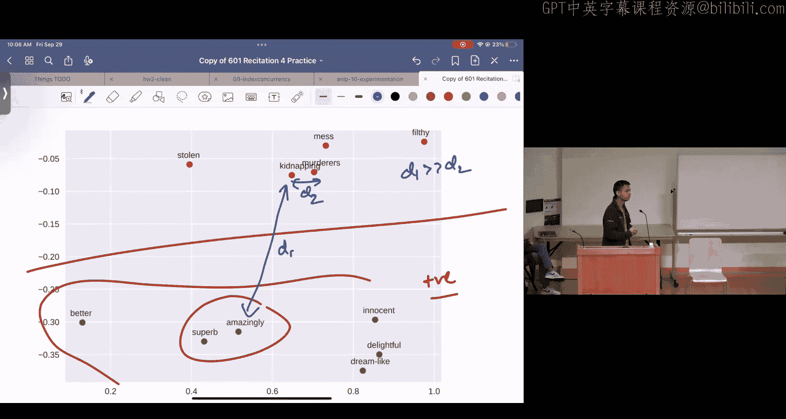
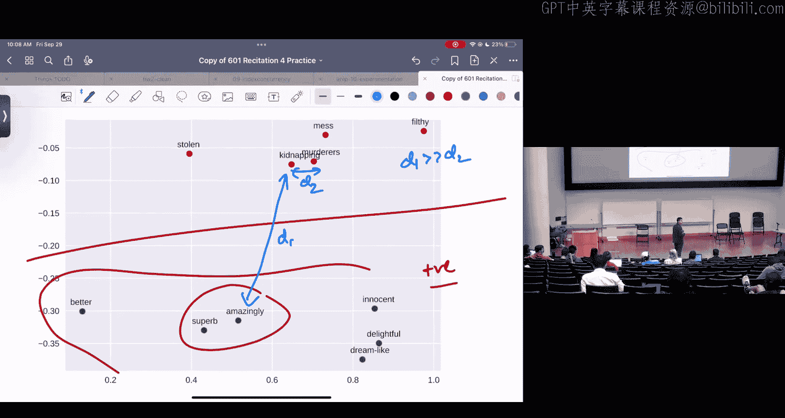

# 42：作业4讲解

在本节课中，我们将一起回顾作业4中的几个核心问题，涵盖回归的闭式解、逻辑回归的推导、情感分类的特征表示以及梯度下降的实现。我们将以简单直白的方式，逐步解析每个概念和计算过程。

---

## 回归的闭式解

上一节我们介绍了课程的基本信息，本节中我们来看看如何为回归问题找到一个闭式解。

我们有一个数据集，包含多个元组 `(X_i, y_i)`，其中 `X_i` 是特征向量，`y_i` 是对应的标签。我们的目标是找到一个权重向量 `w`，以最小化以下损失函数 `J`：

**公式：**
```
J(w) = Σ_i (y_i - Σ_j w_j * x_{ij})^2
```

为了最小化 `J(w)`，我们需要对权重向量 `w` 中的每个元素 `w_k` 求偏导数，并令其等于0，然后解出 `w_k`。

以下是求解 `w_k` 的偏导数的步骤：

1.  首先，写出损失函数 `J` 对 `w_k` 的偏导数。
2.  展开表达式，利用求和与导数的线性性质。
3.  注意到标签 `y_i` 不依赖于 `w_k`，其导数为0。
4.  对内部项 `Σ_j w_j * x_{ij}` 求导。当 `j = k` 时，导数为 `x_{ik}`；当 `j ≠ k` 时，导数为0。但需要注意，在乘积的求导中，`w_k` 会出现在每一项中。
5.  应用乘积法则，得到偏导数的表达式。
6.  简化表达式，将包含 `w_k` 的项分离出来。

最终，我们得到偏导数并令其等于0：

**公式：**
```
∂J/∂w_k = -2 * Σ_i [ (y_i - Σ_{j≠k} w_j * x_{ij} - w_k * x_{ik}) * x_{ik} ] = 0
```

通过代数变换，我们可以解出 `w_k`：

**公式：**
```
w_k = [ Σ_i (y_i - Σ_{j≠k} w_j * x_{ij}) * x_{ik} ] / [ Σ_i (x_{ik})^2 ]
```

这样，我们就找到了最小化损失函数的权重向量元素 `w_k` 的表达式。

---

## 二元逻辑回归

上一节我们探讨了回归的闭式解，本节中我们来看看二元逻辑回归的模型构建与优化。

在二元逻辑回归中，标签 `y_i` 的取值为0或1。我们预测给定特征 `X_i` 和参数 `θ` 时，标签为1的概率 `P(y_i=1 | X_i; θ)`。

我们使用Sigmoid函数来定义这个概率：

**公式：**
```
σ(z) = 1 / (1 + e^{-z})
P(y_i=1 | X_i; θ) = σ(θ^T X_i)
P(y_i=0 | X_i; θ) = 1 - σ(θ^T X_i)
```

为了便于计算，我们可以将这两个概率统一写成一个表达式：

**公式：**
```
P(y_i | X_i; θ) = (σ(θ^T X_i))^{y_i} * (1 - σ(θ^T X_i))^{1 - y_i}
```

当 `y_i=1` 时，上式简化为 `σ(θ^T X_i)`；当 `y_i=0` 时，简化为 `1 - σ(θ^T X_i)`。这与此前的分段函数定义等价。

假设数据独立同分布，整个数据集的似然函数是所有样本条件概率的乘积。我们通常最大化对数似然（或最小化负对数似然）以方便计算：

**公式：**
```
J(θ) = - (1/n) * Σ_i [ y_i * log(σ(θ^T X_i)) + (1 - y_i) * log(1 - σ(θ^T X_i)) ]
```

这就是逻辑回归的目标函数（负对数似然）。

---

### 随机梯度下降

为了优化逻辑回归的参数 `θ`，我们使用随机梯度下降。在SGD中，我们每次只使用一个样本来计算梯度并更新参数。

对于单个样本 `(X_i, y_i)`，其损失函数为：

**公式：**
```
L_i(θ) = - [ y_i * log(σ(θ^T X_i)) + (1 - y_i) * log(1 - σ(θ^T X_i)) ]
```

我们需要计算损失函数对参数 `θ_j` 的偏导数 `∂L_i/∂θ_j`。

以下是推导步骤：

1.  写出损失函数 `L_i`。
2.  分别对 `log(σ(...))` 和 `log(1-σ(...))` 两项应用链式法则求导。
3.  Sigmoid函数有一个有用的性质：`σ'(z) = σ(z) * (1 - σ(z))`。
4.  将导数 `∂σ(θ^T X_i)/∂θ_j = σ(θ^T X_i) * (1 - σ(θ^T X_i)) * x_{ij}` 代入。
5.  合并同类项并简化表达式。

最终，我们得到梯度的简洁形式：



**公式：**
```
∂L_i/∂θ_j = (σ(θ^T X_i) - y_i) * x_{ij}
```




这个结果非常直观：梯度等于模型预测概率与实际标签的差值，乘以对应的特征值。

在SGD中，参数更新规则为：


**公式：**
```
θ_j := θ_j - α * (σ(θ^T X_i) - y_i) * x_{ij}
```
其中 `α` 是学习率。

---

## 情感分类的特征表示

上一节我们讨论了逻辑回归的优化，本节中我们来看看如何为文本情感分类任务构建特征表示。

对于像电影评论这样的文本数据，我们不能直接将单词输入模型，需要将其转换为数值形式。常用的方法是使用词嵌入，例如GloVe。

词嵌入为词汇表中的每个单词分配一个固定长度的向量。这些向量捕获了单词的语义信息，语义相似的单词在向量空间中的距离也更近。

以下是构建句子特征表示的一种常见方法：

1.  拥有一个预训练的词嵌入词典（词汇表）。
2.  对于句子中的每个单词，查找其对应的词向量。
3.  如果单词不在词汇表中，则忽略它。
4.  将所有单词的词向量进行平均，得到整个句子的向量表示。

这种方法可以确保不同长度的句子都被表示为相同维度的向量，适合作为逻辑回归等模型的输入。

---

## 梯度下降与随机梯度下降

上一节我们了解了特征表示，本节中我们来看看两种核心的优化算法：梯度下降和随机梯度下降。

梯度下降和随机梯度下降都是用于最小化目标函数 `J(θ)` 的迭代优化算法，其中 `θ` 是模型参数。

**梯度下降** 在每次迭代中使用整个训练集计算梯度：
*   计算所有样本的梯度之和。
*   用该梯度更新一次参数。

**随机梯度下降** 在每次迭代中随机使用一个样本计算梯度：
*   计算单个样本的梯度。
*   立即用该梯度更新参数。
*   在一个周期内，会对参数进行 `n` 次更新（`n` 为样本数）。

SGD的更新更频繁，可能收敛更快，但梯度估计的噪声更大。

以下是两种算法的伪代码对比：

**梯度下降伪代码：**
```
初始化参数 θ
for epoch in range(num_epochs):
    grad = 0
    for i in range(n):  # 遍历所有样本
        grad += compute_gradient(θ, X[i], y[i])  # 累加梯度
    θ = θ - learning_rate * (grad / n)  # 使用平均梯度更新
```

**随机梯度下降伪代码：**
```
初始化参数 θ
for epoch in range(num_epochs):
    for i in range(n):  # 遍历所有样本
        grad = compute_gradient(θ, X[i], y[i])  # 计算单个样本梯度
        θ = θ - learning_rate * grad  # 立即更新
```

关键区别在于，SGD在内层循环中每计算一个样本的梯度就更新一次参数，而GD需要遍历完所有样本后才更新一次。

---

## NumPy 高效计算

在实现机器学习算法时，计算效率至关重要。Python原生的列表操作较慢，而NumPy库通过向量化操作可以极大地提升计算速度。

向量化允许我们对整个数组执行操作，而不是使用循环逐个处理元素，这利用了底层的优化和并行计算。

例如，计算两个向量的点积：
*   Python循环方式较慢。
*   NumPy使用 `np.dot(A, B)`，速度可以快上百倍。

NumPy还提供了许多有用的函数，例如：
*   `np.matmul`: 矩阵乘法。
*   `np.unique`: 查找唯一值。
*   `np.sum(axis=...)`: 沿指定轴求和。
*   `np.log`, `np.exp`: 对数组每个元素取对数或指数。

掌握NumPy对于高效完成机器学习编程作业至关重要。

---

## 逻辑回归实例计算

最后，我们通过一个具体的例子来巩固逻辑回归的前向计算、损失函数求值和梯度计算。

假设我们有一个小型数据集和初始参数 `θ`。

**1. 计算损失函数 `J(θ)`：**
对于每个样本，计算 `θ^T X_i`，然后代入负对数似然公式并求和平均。

**2. 计算梯度 `∂J/∂θ_j`：**
对于指定的样本 `i` 和参数 `j`，使用公式 `(σ(θ^T X_i) - y_i) * x_{ij}` 进行计算。

**3. 执行随机梯度下降更新：**
使用计算出的梯度，按照规则 `θ_j := θ_j - α * gradient` 更新参数。

**4. 使用更新后的参数进行预测：**
对于新样本，计算 `θ^T X_new`，然后通过Sigmoid函数得到概率。如果概率大于0.5，则预测为正类（1），否则为负类（0）。

通过这个完整的流程，我们可以直观地理解逻辑回归模型从训练到预测的每一步。

---


本节课中我们一起学习了回归的闭式解推导、二元逻辑回归的概率模型与随机梯度下降更新、文本情感分类中基于词嵌入的特征表示方法、梯度下降与随机梯度下降的核心区别及其伪代码实现，最后通过一个实例演练了逻辑回归的计算全过程。希望这些内容能帮助你更好地理解机器学习的基础概念并完成相关作业。