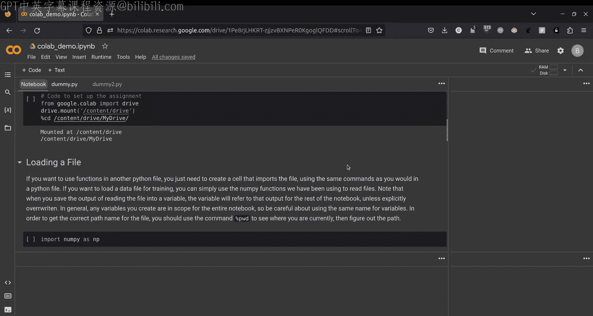

# 44：Google Colab 环境配置教程 🚀


在本教程中，我们将学习如何为课程作业7设置Google Colab环境。Google Colab是一个基于云端的交互式编程环境，允许我们在浏览器中编写和运行代码，并利用其提供的GPU资源来加速机器学习模型的训练。本教程将指导你完成环境配置、文件操作以及GPU使用的关键步骤。

---

## 什么是Google Colab？ 💻

Google Colab是一个用于开发和运行代码的交互式环境。它与在本地笔记本电脑上运行代码没有太大区别。你仍然可以在Python文件中编写代码，并使用像本教程这样的Notebook来运行和测试代码。

一个Notebook是一个以`.ipynb`结尾的文件。我们可以使用Notebook来运行Python文件中的代码，进行单元测试或任何我们想要的测试。使用这些Notebook进行此类操作非常简单。

Google Colab拥有自己的文件系统，类似于你的计算机。你的计算机使用其自身的文件系统，而Google Colab则使用Google Drive作为其文件系统。因此，每当我们在Google Colab中工作时，都需要将Google Drive连接到Google Colab。这个过程称为“挂载”。

每次我们打开Google Colab，或者休息后返回时，都需要将Google Drive挂载到Google Colab上。挂载使我们能够访问Google Drive中的所有文件，包括我们的项目和作业文件，从而可以开始编写和运行代码。

Google Colab的另一个重要特性是允许我们连接GPU（图形处理单元），这对于作业7非常重要。GPU是一种硬件，能够执行大量快速计算并并行处理许多指令，非常适合你在作业7中将要完成的任务。

---

## 连接到GPU ⚙️

为了选择带有GPU的运行环境，请点击菜单中的“运行时”按钮，然后点击“更改运行时类型”，并切换到“T4 GPU”。我们通常有“CPU”和“T4 GPU”两种选择。在运行代码时，我们需要确保使用的是T4 GPU。

以下代码块将把Google Drive挂载到Google Colab中。当你运行它时，它会首先连接到运行时环境。你可以在右侧看到现在是T4 GPU。然后，点击“连接到Google Drive”。每次连接时，它都会要求你进行身份验证或授权。请按照指示操作。这个过程有时需要一点时间，请耐心等待。

在左侧，我们可以看到文件的概览以及文件系统。挂载完成后，Drive会显示出来，我的Drive现在已可用。

在作业6中，我们需要你提交的截图之一就是运行这个Google Drive挂载命令的输出，同时显示你的“我的云端硬盘”已可用，并且你已连接到GPU。只需截取你电脑上这个屏幕的图片即可。

```python
from google.colab import drive
drive.mount('/content/drive')
```

---

## 在Google Colab中使用文件 📁

现在我们已经连接了环境，接下来看看如何在Google Colab中实际使用文件。

当你想要将文件加载到Google Colab时，具体方法取决于你的用途。如果你只是想使用另一个文件中的函数，可以像在Python文件中一样导入该文件。

例如，使用`import blank as blank`，然后你就可以开始使用该文件中的所有函数。如果你想导入用于训练的数据文件，可以使用我们在以往作业中用过的NumPy函数来读取文件。

例如，我们一直使用的`np.loadtxt()`函数可以让你加载训练数据等。这里有几个重要的注意事项。在加载文件时，确切地知道你的当前位置很重要。当你想要知道当前位置时，可以使用`pwd`命令，它会告诉你确切的路径。

因为Drive中的文件路径可能会有些混乱，所以你可能想知道自己具体在哪个目录下。

```python
import os
print(os.getcwd())  # 显示当前工作目录
```

接下来的代码行将加载数据。Google Colab的一个有趣之处在于，即使我在这里定义了`data`变量，我也可以在Notebook中的任何其他地方使用这个变量，它将指向这个命令的结果，除非我改变了`data`的值。

这与标准的Python有些不同。在Python中，变量的作用域通常局限于它所在的函数。但在Google Colab中，当你创建一个变量时，它的作用域是整个Notebook。

为了演示这一点，我将打开一个不同的代码单元格，我仍然能够打印`data`文件。因此，在Google Colab中工作时，仔细命名你的变量非常重要。

```python
# 假设数据文件位于当前目录
import numpy as np
data = np.loadtxt('data.txt')
print(data)
```

---

## 运行和修改代码 ✏️

现在，我将展示如何运行和修改代码。在我的Drive中，有几个演示文件。例如，我有一个`dummy.py`文件，它打印“Hello World”，另一个文件则进行一些数学运算。

首先，让我们尝试运行`dummy.py`。有两种方法。第一种是使用`cd`命令进入该文件所在的目录。目前我们在“我的云端硬盘”根目录。要进入子目录，我们只需`cd`进去。

运行这个命令后，我现在可以看到我实际上在`homework6_demo`目录中。然后，从这里我可以导入`dummy`模块。

```python
%cd /content/drive/MyDrive/10301/homework6_demo
from dummy import *
```

现在，如果我调用`main()`函数，它应该打印“Hello World”。

```python
main()
```

如果我想要从命令行运行，我可以直接输入`python dummy.py`。重要的是，你需要在所有命令行命令前加上感叹号`!`，这样系统才知道这不是Python代码，而是其他命令。

```python
!python dummy.py
```

现在，假设我想改变某些文件的行为。例如，`dummy2.py`的初始输出是给数组加一个数字。但假设我想改变这里的行为，改为减法。最初文件是未保存状态，但当我切换到Notebook时，它会自动保存文件。

当你编辑文件时，你可以非常方便地直接在Python文件中输入。当你切换到Notebook测试代码时，它会自动保存。当然，你也可以从这里手动保存。

```python
# 编辑文件后，重新导入模块以查看更改
from dummy2 import *
result = add_number([1, 2, 3], 5)  # 假设函数名是 add_number
print(result)
```

---

## 使用PyTorch和GPU 🧠

在作业7中，你将使用一个名为PyTorch的库。PyTorch是一个深度学习库，这也是作业7的主题。当我们创建深度学习模型时，使用GPU来加速训练过程有时非常有益。

现在，我将介绍几个命令，以确保你能够查看是否有可用的GPU。使用PyTorch的方法是导入`torch`模块，它在Google Colab中应该已经预装好了。

```python
import torch
```

我们将介绍三个命令，它们会告诉我们一些非常重要的信息。

1.  `torch.cuda.is_available()`：这个命令告诉我们是否有支持CUDA的设备。你不需要知道CUDA是什么，只需知道GPU支持CUDA。由于我们连接了T4 GPU，它将返回`True`。
2.  `torch.cuda.device_count()`：这个命令告诉我们有多少个GPU可供使用。由于我们只连接了一个GPU，所以应该返回`1`。
3.  `torch.cuda.get_device_name(0)`：这个命令用于获取GPU的名称。由于我们只有一个GPU，我们向这个函数传入`0`，它会返回我们连接的Tesla T4。

```python
print(f"CUDA available: {torch.cuda.is_available()}")
print(f"Number of GPUs: {torch.cuda.device_count()}")
print(f"GPU name: {torch.cuda.get_device_name(0)}")
```

这三个命令的输出也是作业6中需要截图的部分，以便我们知道你已成功连接到GPU。

---

## 关于GPU使用的注意事项 ⏳

最后要讨论的一点是，Google Colab提供的GPU通常需求很高。如果你没有在Notebook中进行任何操作，Google会让你超时并踢出GPU，你将在一段时间内无法访问它。这在临近截止日期、你需要使用GPU来训练模型时可能会成为问题。

因此，我们建议：如果你没有在主动测试或运行模型，而只是在运行简单的函数或单元测试（作业要求中可能不要求使用T4 GPU），那么请将你的运行时类型更改为CPU。

当你这样做时，它会断开连接并重新启动运行时环境，你需要重新挂载Drive。但这基本上不会让你超时，因为CPU资源相对充足，Google允许你连接。

当你准备好从头到尾运行模型时，我建议你将运行时改回GPU，然后运行你的模型。这样，你就可以在需要时访问GPU。这是在完成作业时需要考虑的一个非常重要的因素。

---

## 总结 📝




在本教程中，我们一起学习了如何为CMU机器学习课程作业7设置Google Colab环境。我们介绍了Google Colab的基本概念、如何挂载Google Drive、如何操作和编辑文件、以及如何连接和使用GPU资源。我们还特别强调了合理使用GPU以避免被系统中断的重要性。希望本教程能帮助你顺利配置环境，祝你在作业7中取得好成绩！