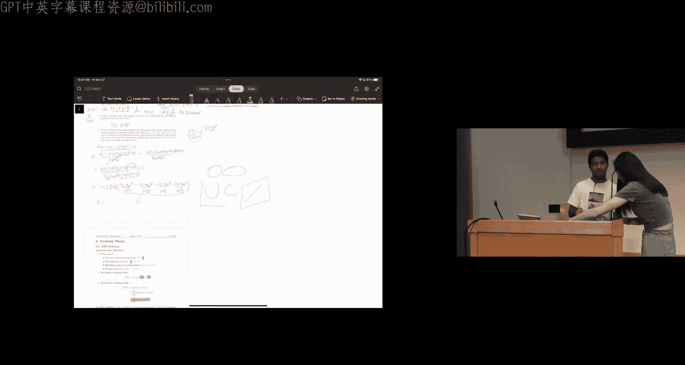
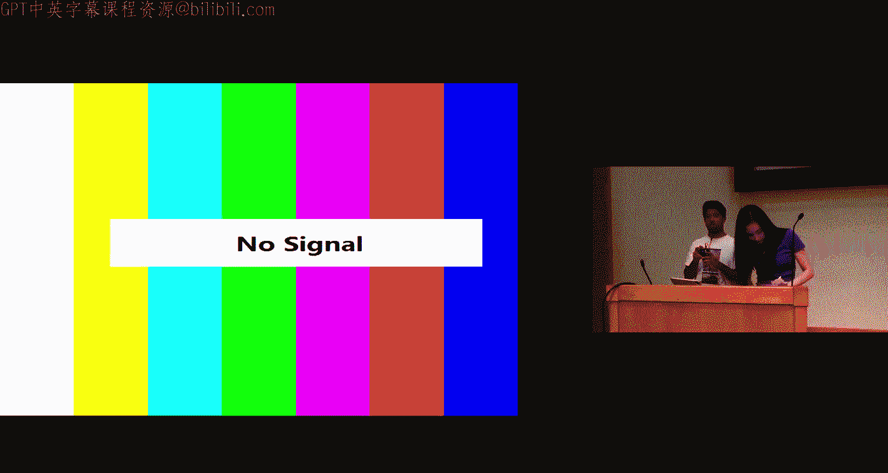
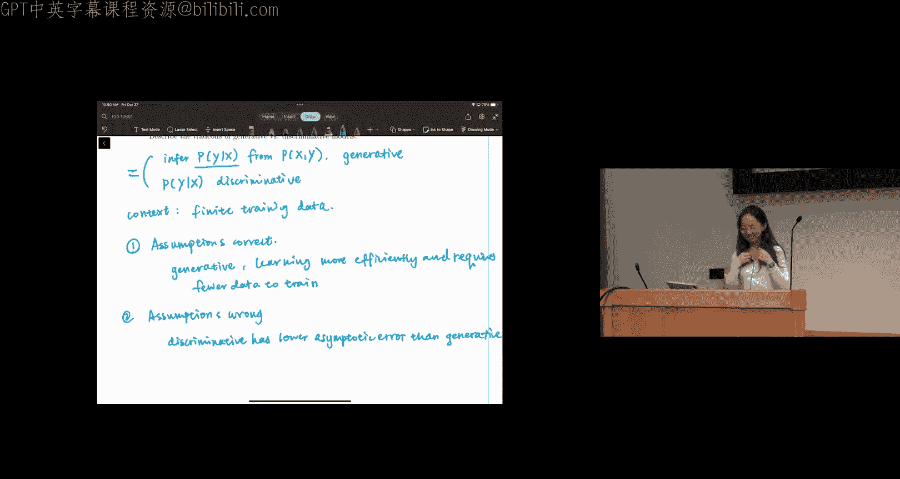

# 45：概率学习与学习理论

在本节课中，我们将学习概率学习的基本框架，包括最大似然估计和最大后验估计，并探讨朴素贝叶斯分类器。我们还将介绍学习理论中的PAC学习概念，并比较生成式模型与判别式模型的区别。

---

## 概率学习简介

上一节我们介绍了传统的函数学习，本节中我们来看看概率学习。概率学习是一种学习框架，其目标不是学习一个函数，而是学习一个概率分布。例如，我们可能试图学习一个正态分布或伯努利分布的参数。

概率学习的主要方法有两种：最大似然估计和最大后验估计。这两种方法用于学习概率分类器的参数。在传统函数学习中，参数是权重；而在概率学习中，参数是概率分布的组成部分，例如正态分布的均值或方差，伯努利分布的成功概率。

---

## 最大似然估计

最大似然估计的目标是找到使观测数据出现概率最大的参数值。其核心表达式为：

**公式：** `θ_MLE = argmax_θ P(D | θ)`

我们试图找到使数据`D`在给定参数`θ`下出现可能性最高的`θ`值。为了计算方便，我们通常使用对数似然，因为最大化`P(D|θ)`等价于最小化`-log P(D|θ)`。

---

## 最大后验估计

最大后验估计在最大似然估计的基础上，融入了我们对参数的先验知识。其目标是找到在给定数据下后验概率最大的参数值。根据贝叶斯规则：

**公式：** `θ_MAP = argmax_θ P(θ | D) = argmax_θ P(D | θ) * P(θ)`

这里，`P(θ)`代表参数的先验分布。MAP估计同时考虑了数据的似然性和我们已有的先验信念。

---

## 应用示例：广告点击率估计

假设我们向`N`个人展示广告，其中`K`个人点击了广告。我们假设每次点击是独立的，且点击概率为`θ`。

**MLE估计：**
通过推导，我们得到点击概率的MLE估计为：
**公式：** `θ_MLE = K / N`
例如，若`N=100`，`K=10`，则`θ_MLE = 0.1`。

**MAP估计：**
假设我们从经验得知点击率大约为6%，并选择贝塔分布作为先验。经过推导（过程略），MAP估计公式为：
**公式：** `θ_MAP = (K + α - 1) / (N + α + β - 2)`
若设定先验参数`α=7`，`β=95`，代入`N=100`，`K=10`计算得`θ_MAP ≈ 0.08`。

MLE和MAP都是合理的估计方法。选择哪一种取决于你是否信任数据本身，或是否希望融入先验知识。

---

## 朴素贝叶斯分类器

上一节我们学习了参数估计方法，本节中我们来看看如何用它们构建一个分类器——朴素贝叶斯。朴素贝叶斯的目标是建模条件概率`P(y | x)`。根据贝叶斯定理：

**公式：** `P(y | x) ∝ P(y) * P(x | y)`

朴素贝叶斯的核心假设是：在给定类别`y`的条件下，所有特征`x1, x2, ..., xd`相互独立。这使得联合概率可以分解为：

**公式：** `P(x | y) = Π_{d=1}^D P(x_d | y)`

特征的类型决定了`P(x_d | y)`的具体分布形式：
*   **伯努利特征**：用于二值特征。
*   **多项分布**：用于取有限个值的离散特征。
*   **高斯分布**：用于连续特征。

需要注意的是，对于类别`y`的每一个可能取值，我们都需要估计一组独立的特征分布参数。

---

### 朴素贝叶斯实例

假设我们有一个数据集，预测用户是否对一辆车感兴趣。特征包括：颜色是否为红色、价格是否可承受、是否省油。标签是是否感兴趣。

以下是参数估计过程：
1.  `P(y=1)`：从数据中统计`y=1`的比例。
2.  `P(x1=1 | y=1)`：统计在`y=1`的样本中，`x1=1`的比例。
其他参数依此类推，通过计数和比例计算得到。

进行预测时，对于一个新样本`(x1=1, x2=0, x3=1)`，我们计算：
`P(y=1 | x) ∝ P(x1=1|y=1) * P(x2=0|y=1) * P(x3=1|y=1) * P(y=1)`
`P(y=0 | x) ∝ P(x1=1|y=0) * P(x2=0|y=0) * P(x3=1|y=0) * P(y=0)`
比较两个结果的大小，选择概率较大的类别作为预测结果。

使用MLE估计的一个问题是可能遇到“零概率”问题。如果一个特征值在某个类别下从未出现，其条件概率会被估计为0，从而导致整个后验概率为0。使用MAP估计（例如加入拉普拉斯平滑）可以缓解此问题。

---

## 高斯朴素贝叶斯的决策边界

对于高斯朴素贝叶斯，我们可以推导其决策边界，即`P(y=1|x) = P(y=0|x)`的点的集合。

推导过程（略）表明，该决策边界是一个关于特征`x1`和`x2`的二次多项式。这意味着决策边界可以是椭圆、抛物线、双曲线或直线（二次项系数为零的特殊情况）。具体形式取决于两类别的均值向量和协方差矩阵是否相等。

---

## 学习理论：PAC学习

本节我们转向学习理论，介绍PAC学习框架。PAC代表“可能近似正确”。

**基本定义：**
*   `D`: 未知的真实数据分布。
*   `c*`: 未知的真实目标函数。
*   `H`: 假设空间，包含我们的假设函数`h`。
*   `S`: 包含`N`个样本的训练集。
*   **真实错误率**：`error_D(h) = P_{x~D}[h(x) ≠ c*(x)]`
*   **训练错误率**：`error_S(h) = (1/N) Σ_{i=1}^N I[h(x_i) ≠ y_i]`

**PAC准则：**
我们希望以高概率得到一个高精度的假设。形式化表示为，对于给定的`ε`和`δ`，有：
**公式：** `P[ |error_D(h) - error_S(h)| ≤ ε ] ≥ 1 - δ`
即以至少`1-δ`的置信度，保证假设的真实错误率与训练错误率之差不超过`ε`。

**样本复杂度**是满足PAC准则所需的最小训练样本数`N`。它取决于假设空间是**可实现的**（真实函数在其中）还是**不可知论的**，以及假设空间是**有限的**还是**无限的**。

**VC维**是衡量假设空间复杂度的指标。一个假设空间`H`的VC维是`d`，如果：
1.  存在一组大小为`d`的点能被`H`“打散”（即`H`能实现这`d`个点的所有可能标记）。
2.  任何一组大小为`d+1`的点都不能被`H`打散。

例如，对于二维线性分类器，其VC维为3。这意味着存在3个点能被所有可能的线性边界正确分类（打散），但不存在4个点能被所有可能的线性边界打散。

---

## 生成式模型 vs. 判别式模型

最后，我们比较两种建模范式。

**判别式模型**直接对条件概率`P(y | x)`进行建模，并最大化条件似然。**逻辑回归**是典型的判别式模型。

**生成式模型**对联合概率`P(x, y)`进行建模，并最大化联合似然。**朴素贝叶斯**是典型的生成式模型。

**如何选择？**
*   **当模型假设正确时**：生成式模型是更高效的学习器，通常需要更少的数据就能达到良好性能。
*   **当模型假设错误时**：随着训练数据量增长，判别式模型的渐近错误率通常低于生成式模型。

以朴素贝叶斯为例，其“特征条件独立”的假设在现实中很少严格成立。因此，在大数据场景下，逻辑回归等判别式模型往往表现更好。

---

## 总结

本节课中我们一起学习了：
1.  **概率学习基础**：MLE和MAP估计的原理与计算。
2.  **朴素贝叶斯分类器**：基于条件独立假设构建分类器，及其参数估计与预测过程。
3.  **学习理论**：PAC学习框架、样本复杂度和VC维的基本概念。
4.  **模型比较**：生成式模型与判别式模型的区别、优缺点及适用场景。

这些概念为理解概率视角下的机器学习以及模型的理论性质奠定了重要基础。