# 46：深度学习与PyTorch入门

在本节课中，我们将学习深度学习中的两个核心架构：卷积神经网络（CNN）和循环神经网络（RNN），并介绍PyTorch深度学习框架的基本使用方法。

## 卷积神经网络（CNN）

上一节我们介绍了深度学习的基本概念，本节中我们来看看卷积神经网络。CNN是专门为处理图像数据而设计的神经网络。

### 核心概念：滤波器与卷积

滤波器，也称为卷积核，是CNN中的特征提取器。它是一个小矩阵，用于在卷积层中扫描输入数据。

卷积操作是CNN的核心。其过程是将滤波器在输入张量上滑动，并根据滤波器大小、步长和填充等参数，计算元素乘积之和，从而形成一个新的输出张量。

卷积层输出尺寸的计算公式如下：
`输出宽度 = floor((输入宽度 - 卷积核宽度 + 2 * 填充) / 步长) + 1`
输出高度的计算方式类似。

### CNN的优势

以下是CNN相较于全连接网络的主要优势：
*   **特征提取能力强**：卷积核能够学习并提取图像中的局部特征。
*   **平移不变性**：由于滤波器会扫描整个图像，因此无论目标物体位于图像的哪个位置，CNN都能识别它。
*   **参数高效**：卷积层通过参数共享，大大减少了需要学习的参数量。

### 通道数变化规则

在CNN中，通道数的变化遵循特定规则：
*   输入图像：灰度图为1个通道，彩色图（RGB）为3个通道。
*   卷积层：每个卷积核的通道数等于输入通道数。该层的输出通道数等于卷积核的数量。
*   池化层和激活层：通常保持通道数不变。

### 示例：计算卷积输出

假设我们有一个4x4的输入图像和一个2x2的滤波器，无填充，步长为1。
根据公式，输出尺寸为3x3。
要计算输出图像右下角的值，需要将滤波器与输入图像右下角的2x2区域进行元素乘积求和。

如果添加1的填充，输入图像有效尺寸变为6x6，输出尺寸则变为5x5。通常填充区域的值为0。

### 示例：图像分类网络分析

假设一个图像分类任务，输入为128x128的RGB图像（3个通道），共10个类别。
网络结构如下：
1.  最大池化层：2x2滤波器，步长2，输出通道3。
2.  卷积层：17x17滤波器，步长1，输出通道12。
3.  最大池化层：3x3滤波器，步长3，输出通道12。
4.  展平层。
5.  全连接层：128个隐藏单元。
6.  ReLU激活。
7.  全连接层：10个隐藏单元。
8.  Softmax激活。

以下是各层张量的形状变化过程：
*   输入: `(3, 128, 128)`
*   池化1后: `(3, 64, 64)` （公式计算：(128-2+0)/2 +1 = 64）
*   卷积后: `(12, 48, 48)` （公式计算：(64-17+0)/1 +1 = 48）
*   池化2后: `(12, 16, 16)` （公式计算：(48-3+0)/3 +1 = 16）
*   展平后: `(3072,)` （12 * 16 * 16）
*   全连接1后: `(128,)`
*   ReLU后: `(128,)`
*   全连接2后: `(10,)`
*   Softmax后: `(10,)`

### 参数数量计算

了解网络中参数的数量对于理解其效率至关重要。

以下是计算各层参数数量的公式：
*   **卷积层参数** = (卷积核宽 * 卷积核高 * 输入通道数 * 输出通道数) + 输出通道数（偏置项）
*   **池化层参数** = 0 （无需要学习的参数）
*   **全连接层参数** = (输入单元数 * 输出单元数) + 输出单元数（偏置项）

对于上述示例网络：
*   卷积层参数 = (17 * 17 * 3 * 12) + 12 = 10,416
*   第一个全连接层参数 = (3072 * 128) + 128 = 393,344
*   第二个全连接层参数 = (128 * 10) + 10 = 1,290
*   总参数 = 10,416 + 393,344 + 1,290 = 405,050

分析参数占比：
*   卷积层参数占比 ≈ 2.57%
*   全连接层参数占比 ≈ 97.43%

由此可见，尽管卷积层是特征提取的核心，但网络中的大部分参数集中在全连接层。这凸显了CNN在参数效率上的优势，因为卷积层通过共享参数处理整个图像，而全连接层则需要为每个连接都配备独立的参数。

## 循环神经网络（RNN）

上一节我们介绍了用于空间数据（如图像）的CNN，本节中我们来看看处理序列数据的循环神经网络。RNN的特点是其节点间的连接形成循环，使得某个节点的输出能够影响后续的计算。

### RNN的工作原理

RNN的隐藏状态 `h_t` 在时间步 `t` 的计算依赖于当前输入 `x_t` 和前一时刻的隐藏状态 `h_{t-1}`。
这通过两个权重矩阵实现：
*   `W_{hx}`：处理当前输入 `x_t`。
*   `W_{hh}`：处理前一时刻的隐藏状态 `h_{t-1}`。

这种结构使得RNN能够捕捉序列中的时间或顺序依赖性，非常适用于自然语言处理、时间序列预测等任务。

### RNN的训练与紧凑表示

训练RNN通常使用**随时间反向传播**算法，其思想是将RNN按时间步展开，形成一个深层的网络，然后使用标准的反向传播。

RNN的紧凑表示是一个包含自循环的单元，它接收输入 `x` 并产生输出，同时将隐藏状态传递给自身用于下一个时间步的计算，这比展开的表示更加简洁。

## PyTorch入门

现在，我们将转向实践部分，介绍PyTorch深度学习框架的基础知识，这对于完成本周的编程作业至关重要。

### 什么是PyTorch？

PyTorch是一个机器学习框架，内置了大量模块、函数、损失函数和优化器，使得实现深度学习模型变得更加容易。

### 张量（Tensors）

张量是PyTorch的核心数据结构，类似于多维数组。关键区别在于，张量可以在CPU和GPU上运行，从而利用GPU进行加速计算。

以下是如何创建和操作张量：
```python
import torch
import numpy as np

# 从列表或NumPy数组创建张量
a = torch.tensor([1, 2, 3])
b = torch.from_numpy(np.array([4, 5, 6]))

# 创建特定形状的张量
ones_tensor = torch.ones((3, 3)) # 3x3的全1张量
zeros_tensor = torch.zeros((2, 4)) # 2x4的全0张量
rand_tensor = torch.rand((2, 3)) # 2x3的随机张量

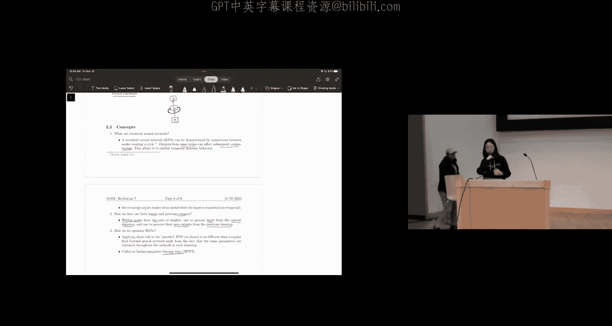

# 张量切片
tensor = torch.randn(4, 4)
tensor[:, 0] = 0 # 将第一列设为0

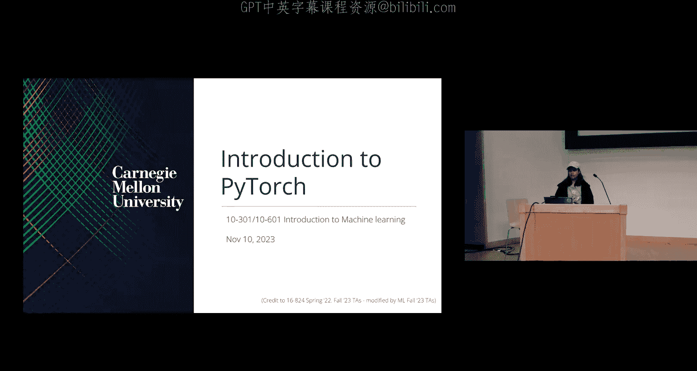

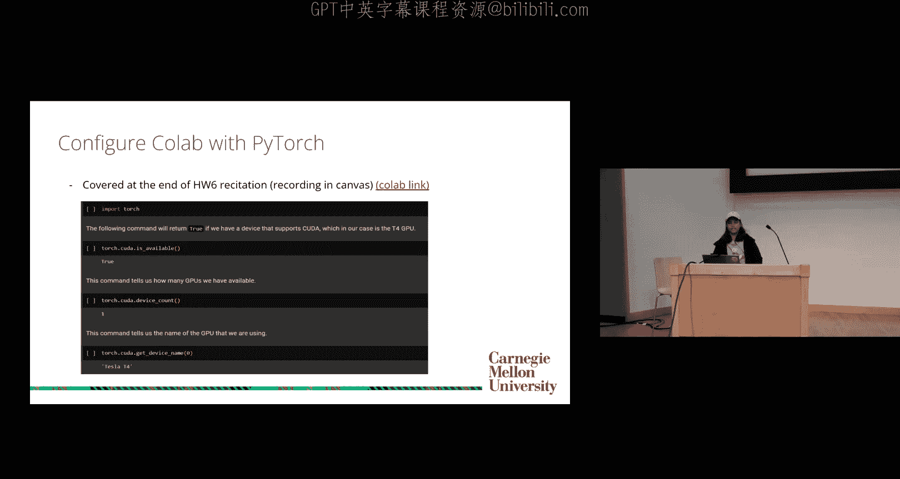

# 设备与数据类型
device = a.device # 查看张量所在设备（CPU/GPU）
dtype = a.dtype # 查看张量数据类型

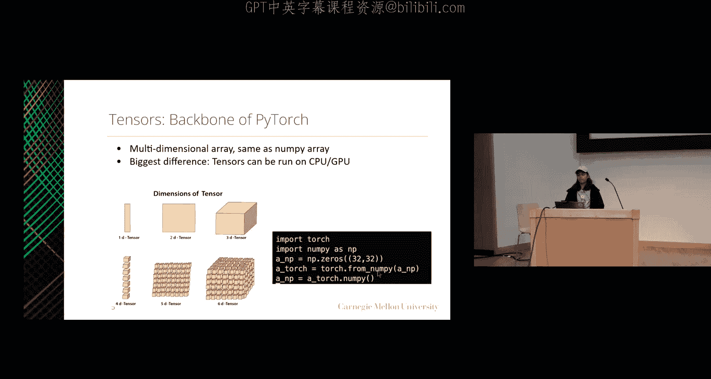

# 将张量转移到指定设备或数据类型
c = b.to(a.device) # 将b转移到a所在的设备
d = b.to(a.dtype) # 将b转换为a的数据类型
```

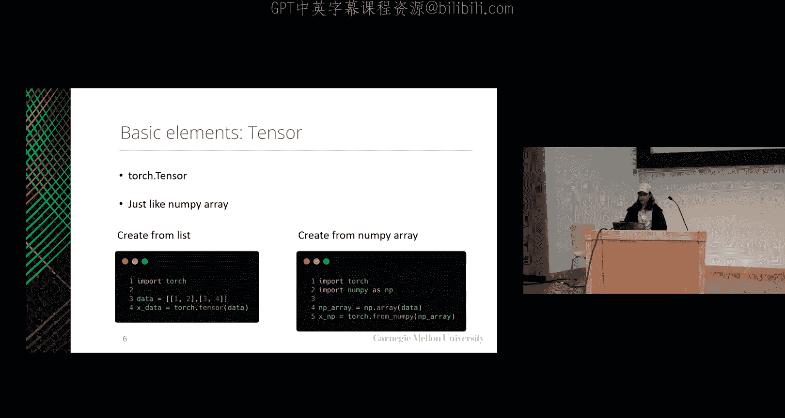

### 基本张量操作

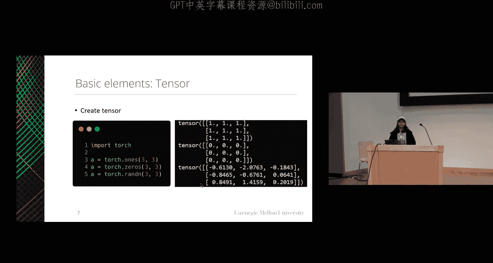

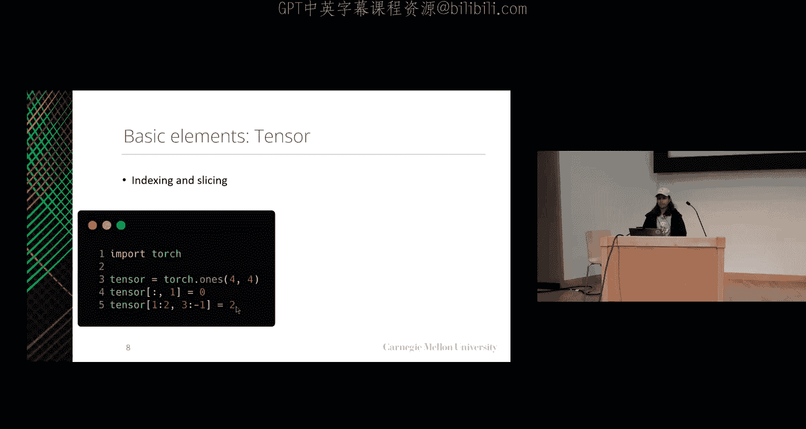

PyTorch支持丰富的张量操作，其语法与NumPy类似。
```python
a = torch.ones(2, 3, 1)
b = 2 * torch.ones(2, 3, 1)

# 基本算术
c = a + b
d = a * b

# 矩阵转置与乘法
e = a.transpose(1, 2) # 转置第1和第2维度
f = torch.matmul(e.squeeze(), b.squeeze().T) # 矩阵乘法，需调整维度

# 改变形状
g = a.expand(-1, -1, 3) # 扩展最后一维到3，-1表示保持该维度不变
h = torch.arange(1, 13).reshape(3, 4) # 重塑形状
i = h.flatten() # 展平为1维
```

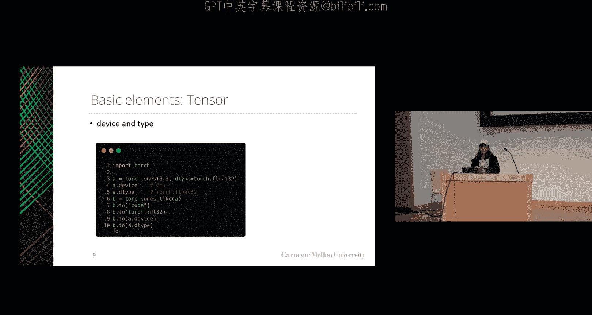

### 定义模型

在PyTorch中，我们通过继承 `torch.nn.Module` 类来定义模型。
```python
import torch.nn as nn

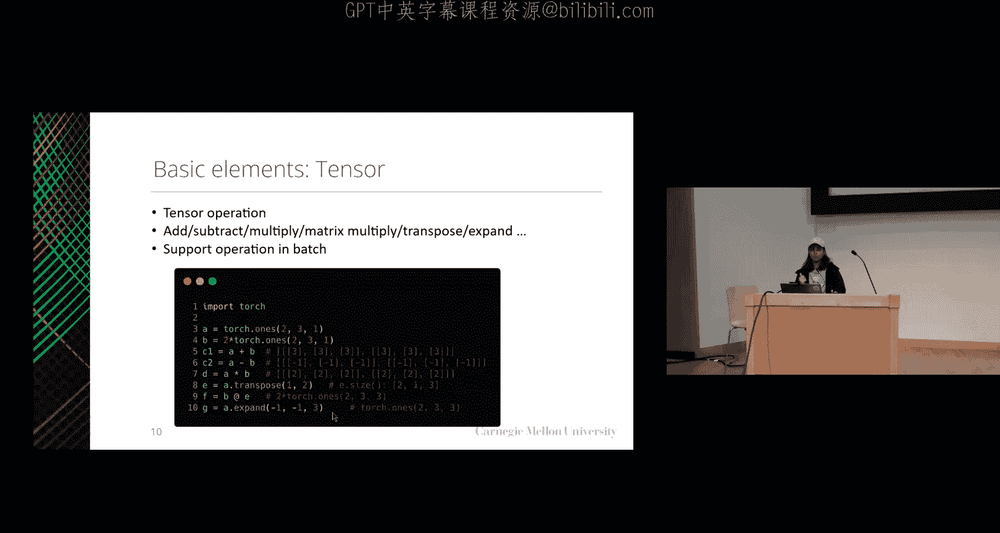

class SimpleNet(nn.Module):
    def __init__(self, input_size, hidden_size, output_size):
        super(SimpleNet, self).__init__()
        # 定义网络层
        self.layer1 = nn.Linear(input_size, hidden_size)
        self.layer2 = nn.Linear(hidden_size, output_size)
        self.relu = nn.ReLU()

    def forward(self, x):
        # 定义前向传播路径
        x = self.layer1(x)
        x = self.relu(x)
        x = self.layer2(x)
        return x
```

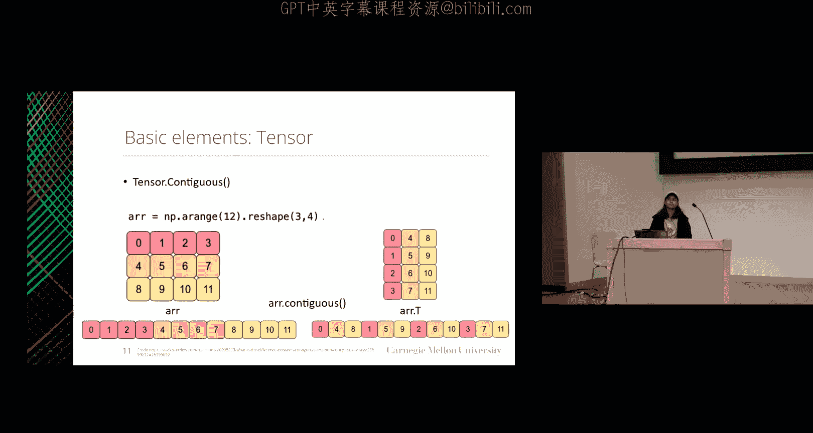

### 训练循环

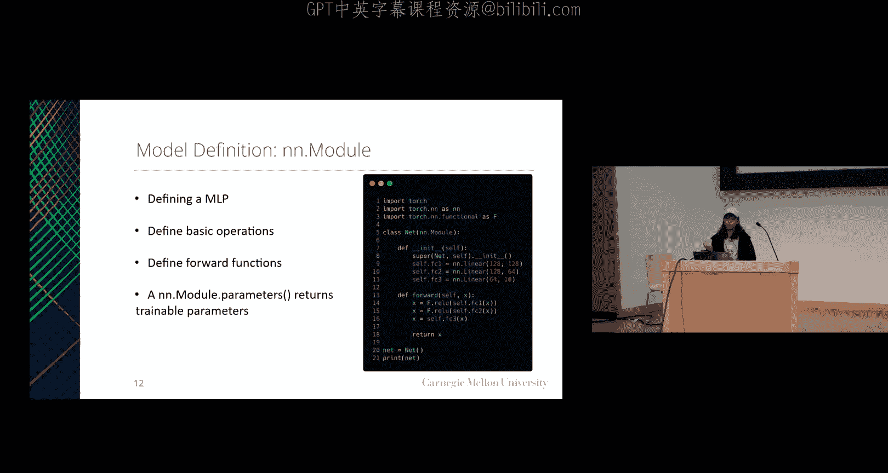

训练神经网络通常遵循一个固定的模式。
```python
model = SimpleNet(input_size=10, hidden_size=5, output_size=2)
criterion = nn.CrossEntropyLoss() # 定义损失函数
optimizer = torch.optim.SGD(model.parameters(), lr=0.01) # 定义优化器

num_epochs = 10
for epoch in range(num_epochs):
    for data, labels in train_loader: # 假设train_loader是数据加载器
        # 前向传播
        outputs = model(data)
        loss = criterion(outputs, labels)

        # 反向传播与优化
        optimizer.zero_grad() # 清空过往梯度
        loss.backward() # 反向传播，计算当前梯度
        optimizer.step() # 根据梯度更新参数

    print(f'Epoch [{epoch+1}/{num_epochs}], Loss: {loss.item():.4f}')
```

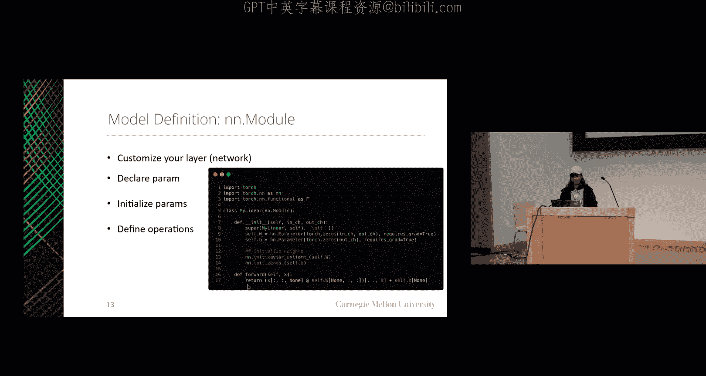

### 模型评估与关键指标

在验证或测试时，我们不需要计算梯度，应使用 `torch.no_grad()` 上下文管理器。
```python
model.eval() # 将模型设置为评估模式
with torch.no_grad():
    for data, labels in val_loader:
        outputs = model(data)
        # 计算准确率等指标
```

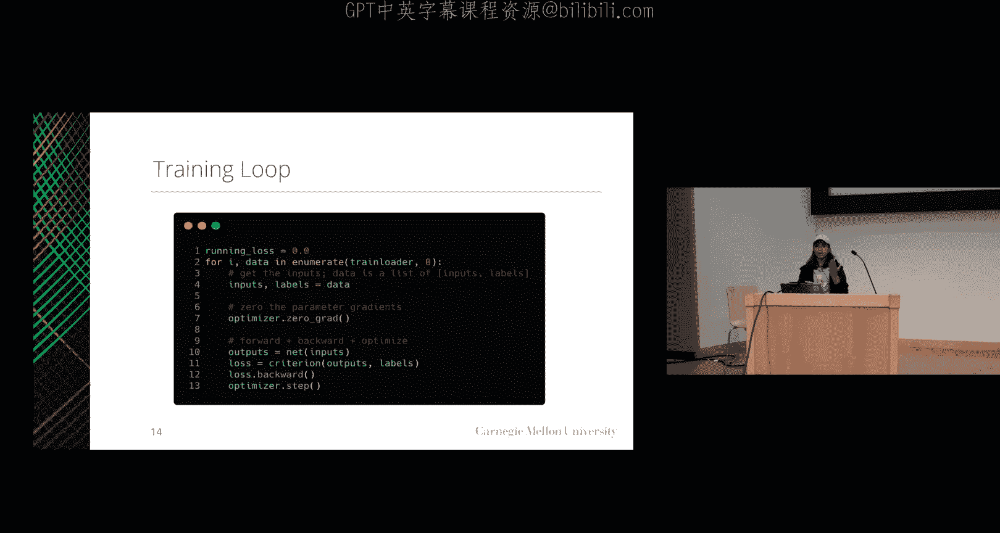

跟踪训练和验证损失、准确率等关键指标至关重要。以下是一个经验法则：
*   **训练损失低，验证损失低**：模型表现良好。
*   **训练损失低，验证损失高**：模型可能过拟合。
*   **训练损失高，验证损失高**：模型可能欠拟合。
*   **训练损失高，验证损失低**：通常不会发生，可能评估过程有误。

### 神经网络实现流程总结

实现一个神经网络通常包含以下步骤：
1.  **加载数据**：使用数据加载器进行批处理、打乱等操作。
2.  **定义模型**：实现网络层（如本次作业中的注意力层）和前向传播逻辑。
3.  **定义损失函数**：选择适合任务的损失函数（如交叉熵损失）。
4.  **执行反向传播**：PyTorch的 `autograd` 会自动计算梯度。
5.  **优化参数**：使用优化器（如SGD）更新模型参数。
6.  **跟踪关键指标**：监控训练和验证过程中的损失和准确率。

---

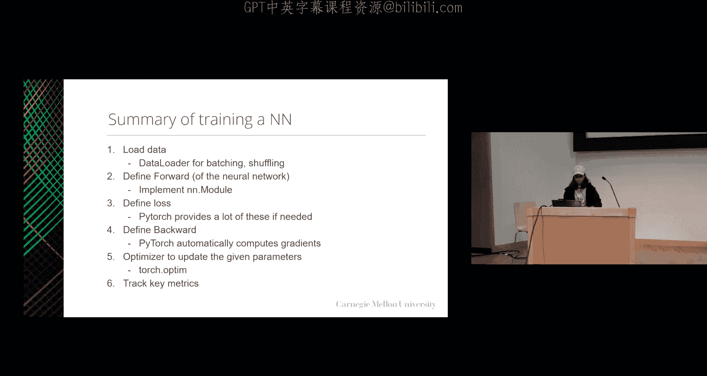

本节课中我们一起学习了卷积神经网络和循环神经网络的基本原理与计算，并掌握了使用PyTorch框架构建、训练和评估深度学习模型的基础流程。这些知识将为完成相关的编程作业打下坚实的基础。