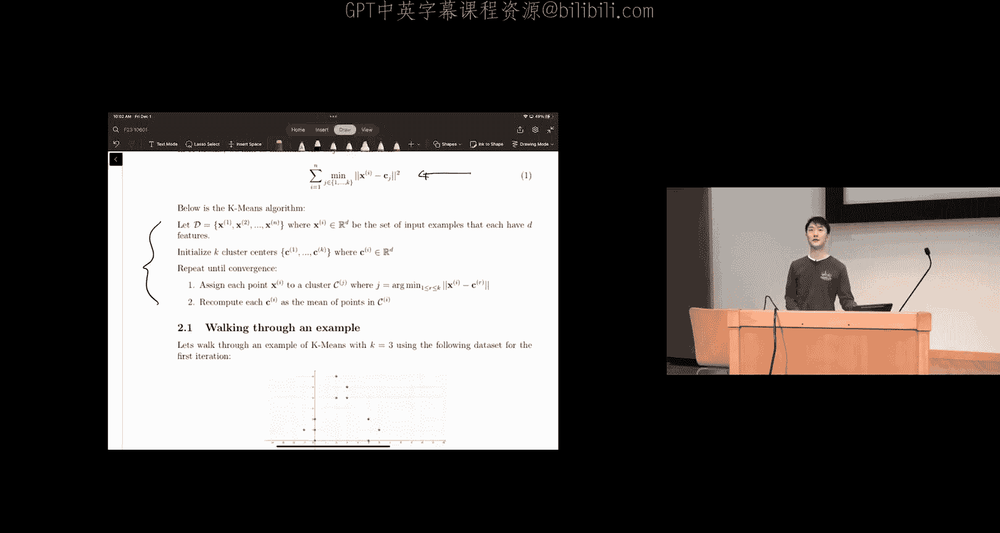
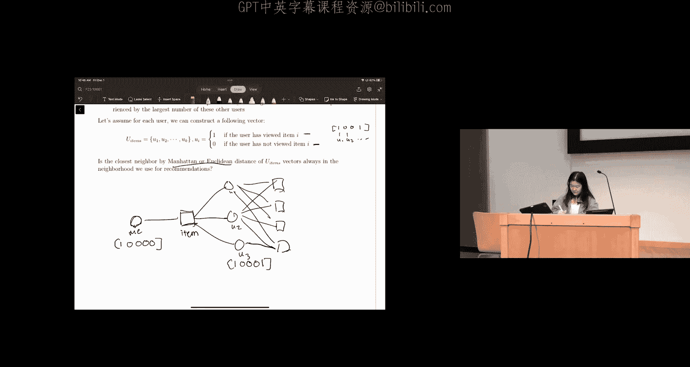
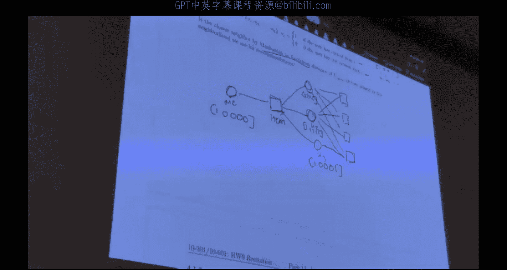

# 47：学习范式与集成方法

在本节课中，我们将回顾本周和上周讲座中涉及的一些核心概念，包括主成分分析、K均值聚类、集成方法（随机森林和AdaBoost）以及推荐系统。这些内容将帮助你更好地完成即将发布的第九次作业。

## 主成分分析

上一节我们介绍了本课程的整体结构，本节中我们来看看主成分分析。PCA的目标是将数据投影到更低维度的空间，同时尽可能多地保留原始信息。这是PCA背后的核心指导原则。

### PCA的基本原理

我们通过以下步骤实现PCA：首先找到数据的一个正交基（即新的坐标系），然后剪裁掉重要性较低的维度，使得保留的维度在重构原始数据时，其平方误差最小。

在低维情况下，例如这里展示的二维数据，我们可以通过可视化找到主成分，即观察数据方差最大的方向。然而，在高维情况下（如三维、四维或更高），由于难以可视化，我们需要通过数学方法来解决这个问题。

我们寻找正交的单位向量 **U1** 到 **UM**，使得以下重构误差最小化：
```
重构误差 = Σ_i ||x_i - x̂_i||^2
```
其中，**x̂_i** 是重构后的向量，计算公式为：
```
x̂_i = Σ_j (x_i^T u_j) u_j
```

如果我们有 **M** 个新向量和 **D** 个原始向量，且 **M = D**，那么我们可以无误差地精确重构原始数据。但是，如果 **M < D**（即投影到更低维度），通常无法在不损失信息的情况下重构原始数据。换句话说，所有重构误差都来自于我们丢失的这 **M - D** 个缺失成分。

这个误差可以用原始数据的协方差矩阵来表示，并且当主成分向量是协方差矩阵按特征值排序的前 **M** 个特征向量时，误差最小。特征值越高，对应的特征向量存储的信息越多，重构误差也就越低。

### 应用示例

假设我们对以下数据集执行PCA，并得到以下主成分及其对应的特征值：
*   主成分1 对应特征值 3.265
*   主成分2 对应特征值 0.999
*   主成分3 对应特征值 0.043
*   主成分4 对应特征值 0.014

以下是基于此示例的几个问题：

**问题一：为什么只有四个主成分？**
因为原始数据只有四个特征。根据PCA的定义，我们只能将数据投影到其包含的更低维度的子空间，因此主成分的数量不可能超过原始特征的数量。

**问题二：前两个主成分保留了数据中多少比例的方差？**
这与前两个主成分对应的特征值有关。我们可以通过以下公式计算：
```
保留方差比例 = (λ1 + λ2) / (λ1 + λ2 + λ3 + λ4)
```
代入数值：
```
(3.265 + 0.999) / (3.265 + 0.999 + 0.043 + 0.014) ≈ 4.264 / 4.321 ≈ 0.987
```
因此，前两个主成分保留了大约 **98.7%** 的方差。




**问题三：第一和第三主成分保留了数据中多少比例的方差？**
计算方法类似：
```
保留方差比例 = (λ1 + λ3) / (λ1 + λ2 + λ3 + λ4)
```
代入数值：
```
(3.265 + 0.043) / 4.321 ≈ 0.766
```
因此，第一和第三主成分保留了大约 **76.6%** 的方差。直观上，由于主成分及其特征值是按所捕获的方差量降序排列的，前两个主成分保留的方差自然会比第一和第三主成分多。

**问题四：将数据点投影到前两个主成分上进行降维，然后逆变换回四维空间。**
通用的PCA数据计算和重构算法是：将代表数据集的矩阵乘以感兴趣的主成分矩阵（本例中是前两个主成分）。这就是我们将原始数据集投影到低维空间的方法。如果我们想将其投影回原始空间，只需将投影后的数据集再次乘以主成分矩阵（或其转置，取决于维度匹配）。这由以下公式体现：
```
x̂_i = Σ_{j=1}^{M} (x_i^T u_j) u_j
```
其中，**u_j** 代表主成分。第一个求和是投影降维，第二个乘法是投影回原始空间。

在具体计算中，原始数据矩阵是6x4，主成分矩阵是4x2。投影后得到6x2的矩阵，再通过矩阵运算逆变换回6x4的矩阵。

**问题五：将数据点投影到第一和第三主成分上进行降维，然后逆变换回四维空间，并计算新数据集的重构误差。**
方法与问题四类似，只是使用的主成分矩阵由第一和第三主成分的列组成。

**问题六：计算特定数据点（第四行）的重构误差。比较使用前两个主成分与使用第一和第三主成分的误差。**
我们可以使用之前给出的重构误差公式，针对第四行数据点分别计算两种投影方式下的误差。计算发现，对于这个特定的第四行数据点，使用第一和第三主成分的误差更低。

这引出了一个关键点：PCA最小化的是**所有数据点的平均重构误差**。对于特定的某个数据点，使用前两个主成分的误差不一定比使用第一和第三主成分的误差低。但在所有数据点上平均来看，使用前两个主成分的平均误差会更低。核心区别在于“平均误差”与“特定数据点的误差”。

## K均值聚类

上一节我们探讨了无监督降维技术PCA，本节中我们来看看另一种无监督学习算法：聚类。聚类是无监督机器学习算法的一个例子，因为它旨在对未标记的数据进行分区。聚类算法有很多种，但本课程介绍最常用的是K均值算法。

### K均值算法原理

在K均值中，我们的目标是最小化以下目标函数：
```
J = Σ_i Σ_{x ∈ C_i} ||x - μ_i||^2
```
其中，**x** 代表数据点，**C_i** 代表第 **i** 个簇，**μ_i** 是簇 **C_i** 的中心。

K均值算法步骤如下：
1.  初始化K个簇中心（例如随机选择）。
2.  **分配步骤**：将每个数据点分配到距离其最近的簇中心。
3.  **更新步骤**：重新计算每个簇的中心（即该簇中所有数据点的均值）。
4.  重复步骤2和3，直到簇中心不再发生显著变化或达到最大迭代次数。

### 应用示例

让我们通过一个例子来演练K均值算法，其中K=3（簇的数量）。使用以下数据集，并初始化三个簇中心为：C1=(0,2)， C2=(1.5,2)， C3=(6,1)。

**执行一次迭代：**

1.  **簇分配**：根据欧几里得距离平方，将每个数据点分配到最近的簇中心。分配结果如下：
    *   簇1包含点：(0,-1), (0,1), (0,2), (2,6)
    *   簇2包含点：(3,4), (3,5), (5,2)
    *   簇3包含点：(5,0), (6,1), (6,-1)
2.  **重新计算簇中心**：计算每个簇中所有数据点的平均值，得到新的簇中心：
    *   新中心 C1‘ = (0.5, 2.33)
    *   新中心 C2‘ = (3.67, 3.67)
    *   新中心 C3‘ = (5.67, 0)

### 初始化的影响

K均值算法的结果很大程度上依赖于初始簇中心的选择。

*   **全局最优初始化**：如果初始点分别位于三个明显分离的簇内部，算法很可能收敛到全局最优解（即最小化总距离的聚类结果）。
*   **局部最优初始化**：如果初始点选择不当，例如两个点位于同一个密集簇中，而另一个点远离其他簇，算法可能收敛到局部最优解而非全局最优解。因为算法每次迭代基于当前分配更新中心，糟糕的初始分配可能限制中心的移动范围，导致最终结果不理想。

## 集成方法

上一节我们介绍了基础的聚类算法，本节中我们来看看如何通过结合多个简单模型来构建更强大的预测模型，即集成方法。我们将介绍两种集成方法：随机森林和AdaBoost。

### 随机森林

随机森林的核心思想是结合多个决策树的力量。首先，我们需要理解为什么使用单个决策树可能存在问题。

**决策树的缺点与偏差-方差权衡**
决策树通常通过贪婪算法学习，如果深度不受控制，很容易过拟合训练数据，导致低偏差但高方差。这意味着它在训练集上表现很好，但泛化到新数据的能力较差。

**随机森林的改进技术**
随机森林通过两种主要技术来改进单个决策树：
1.  **样本自助聚合**：从原始数据集中有放回地抽取多个自助样本集，每个样本集用于训练一棵独立的决策树。由于训练数据集彼此不同，学习到的模型也更加多样化。
2.  **分裂特征随机化**：在决策树的每个节点，不是总是选择最佳特征进行分裂，而是随机选择一个特征子集，然后从这个子集中选择最佳特征。这进一步增加了树之间的差异性。

**对偏差和方差的影响**
对于单棵树：
*   这些技术**增加了偏差**（因为每棵树只用了部分数据和部分特征），**降低了方差**。
对于整个森林（集成）：
*   偏差的增加从单棵树继承而来。
*   方差进一步**降低**，因为我们对一组不完全相关的树的预测进行了平均。降低树之间的相关性可以减少平均预测的方差。

**袋外误差**
对于随机森林，我们可以利用自助采样的特性来计算袋外误差。对于每个数据点，用那些在训练时没有使用该数据点的树来对其进行预测，然后用这些预测进行聚合（如多数投票）。袋外误差就是这些预测的错误率。由于每棵树独立训练，一个数据点永远不会同时被用于训练一棵树和被该树验证，因此OOB误差可以作为一种有效的内部验证指标，无需单独的验证集。

### AdaBoost

AdaBoost是另一种集成方法，它顺序地训练一系列“弱学习器”（如非常浅的决策树），并根据每个学习器的表现调整数据点的权重。



**两种权重方案**
1.  **弱学习器权重**：每个弱学习器 **H_t** 在最终集成中的权重 **α_t** 由其训练误差 **ε_t** 决定：
    ```
    α_t = 0.5 * ln((1 - ε_t) / ε_t)
    ```
    *   如果弱学习器比随机猜测好（ε_t < 0.5），则权重为正。
    *   如果弱学习器比随机猜测差（ε_t > 0.5），则权重为负，这等效于将其预测翻转。
    *   最坏情况是 ε_t = 0.5，此时权重为零，该学习器对集成没有贡献。
2.  **数据点权重**：初始时，所有数据点权重相同。在每一轮，根据当前弱学习器的预测调整权重：
    ```
    D_t(i) ∝ D_{t-1}(i) * exp(-α_t * y_i * H_t(x_i))
    ```
    *   预测正确的点权重降低。
    *   预测错误的点权重升高，使得下一轮的学习器更关注这些难以分类的点。




**为什么使用弱学习器？**
使用强学习器（如深度决策树、神经网络）作为AdaBoost的基学习器通常不是好主意。这是因为集成方法的泛化误差上界与基学习器假设类的VC维有关。弱学习器VC维低，意味着假设类简单，表达能力有限，这有助于控制集成模型的复杂度，避免过拟合。如果使用强学习器（高VC维），泛化误差上界会变松，可能导致实际泛化性能变差，即使训练误差更低。这体现了**偏差-方差权衡**和**过拟合**的概念。

## 推荐系统

推荐系统主要有两种方法：协同过滤和基于内容的过滤。

### 协同过滤

协同过滤根据相似用户的偏好向用户推荐物品。它依赖于其他用户对物品的评分。
*   **邻域方法**：基于用户-物品交互向量（如用户是否观看过某物品）计算用户或物品之间的相似度（如曼哈顿距离、欧氏距离），然后进行推荐。但需要注意，仅凭距离可能排除那些交互历史更丰富的用户，而这些用户可能提供有价值的推荐。
*   **潜在因子方法**：将用户和物品映射到低维潜在空间（通过矩阵分解），通过向量相似度进行推荐。常用的矩阵分解技术如奇异值分解不直接适用于评分矩阵有很多缺失值的情况。交替最小二乘法是解决此类问题的一种优化方法，它固定一个变量（用户矩阵或物品矩阵）时，目标函数变为二次型，可以直接求解，无需梯度下降。

### 基于内容的过滤

基于内容的过滤利用物品自身的特征（如电影类型、导演、演员）和用户的历史偏好（喜欢/不喜欢）来建立模型，并向用户推荐特征相似的物品。
*   **学习范式**：这通常是一个**监督学习**问题，因为我们有物品特征和用户反馈（标签）。
*   **与协同过滤对比**：
    *   **基于内容的优势**：不需要其他用户的评分数据（冷启动问题较轻）；推荐结果可解释性强。
    *   **协同过滤的优势**：无需手动定义特征，模型可以自动学习用户和物品的潜在特征；可能发现用户意想不到的喜好。

## 精确率、召回率与F1分数

在评估分类模型时，除了准确率，我们经常使用精确率、召回率和F1分数，尤其是在类别不平衡或任务目标不对称的情况下。

### 核心概念

基于预测结果和真实标签，我们可以定义四个类别：
*   **真正例**：预测为正，实际也为正。
*   **假正例**：预测为正，实际为负。
*   **真负例**：预测为负，实际也为负。
*   **假负例**：预测为负，实际为正。

**精确率**：在所有**预测为正**的样本中，实际为正的比例。
```
精确率 = TP / (TP + FP)
```
**召回率**：在所有**实际为正**的样本中，被正确预测为正的比例。
```
召回率 = TP / (TP + FN)
```
**准确率**：所有预测正确的样本比例。
```
准确率 = (TP + TN) / (TP + FP + FN + TN)
```
关键区别在于，精确率和召回率不关心真负例，而准确率关心。

### 应用场景

*   **高召回率重要**：例如癌症筛查，我们希望尽可能找出所有潜在患者（宁可错杀，不可放过）。但单纯优化召回率很简单：将所有样本预测为正即可，此时召回率为1，但精确率会很低（等于数据中正例的基础比例）。
*   **高精确率重要**：例如向有限数量的用户推送昂贵广告，我们希望确保推送的用户极有可能转化，避免资源浪费。

### F1分数

F1分数是精确率和召回率的**调和平均数**：
```
F1 = 2 * (精确率 * 召回率) / (精确率 + 召回率)
```
它提供了一个单一指标来平衡精确率和召回率，假设两者同等重要。F1分数对两者都较低的情况惩罚更大，迫使模型在两者之间寻求更好的平衡，而不是极端优化某一个。

### 基础率与阈值

*   **基础率**：数据中实际为正的样本比例。它是一个重要的参考基准。如果一个随机分类器的精确率应该接近基础率。
*   **阈值**：在得到分类器的预测分数（如概率）后，我们需要一个阈值来决定将哪些样本预测为正类。改变这个阈值会得到不同的精确率-召回率对，从而可以绘制**精确率-召回率曲线**。F1分数可以帮助我们从曲线上选择一个“最佳”操作点。

## 总结


本节课中我们一起学习了第九次作业涉及的多个核心机器学习概念。我们回顾了主成分分析的原理与计算，理解了其通过保留最大方差进行降维的本质。我们演练了K均值聚类算法的步骤，并讨论了初始化对结果的重要性。在集成方法部分，我们分析了随机森林如何通过自助聚合和特征随机化来降低方差，以及AdaBoost如何通过调整数据点权重和弱学习器权重来顺序提升模型。我们还简要比较了协同过滤和基于内容过滤这两种推荐系统方法的特点。最后，我们介绍了精确率、召回率和F1分数这些重要的分类评估指标，理解了它们在不同场景下的应用。希望本次辅导能帮助你顺利开始完成作业。