# 01：课程介绍与安排 🎓

在本节课中，我们将学习卡内基梅隆大学《深度学习系统》课程的第一讲内容。我们将了解学习深度学习系统的意义、课程的整体目标以及具体的课程安排。

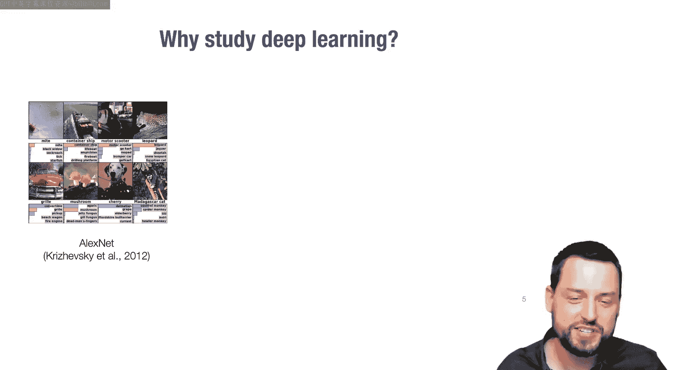

大家好，欢迎来到我们关于深度学习系统、算法与实现的在线课程的第一讲。我是Zika Colultter，我将主讲本次课程。这门课程由我和我的联合讲师Tiianchi Chen共同教授，他将在后续课程中讲授部分内容。我们都是卡内基梅隆大学的教员。我们今年秋季也在CMU开设了这门课程，但我们将所有材料作为这个在线课程的一部分公开。

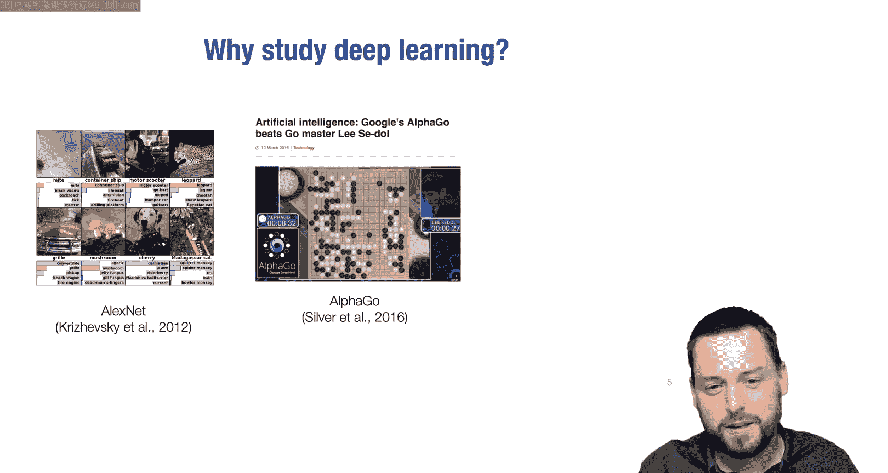

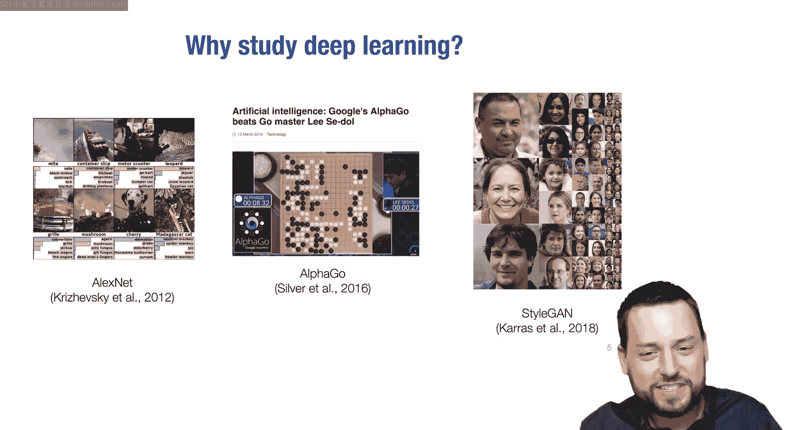

本次讲座将是对本课程主题的基本介绍，并涵盖课程的一些后勤安排。因此，它将与其他讲座有所不同，我们不会深入探讨方法、数学、代码等细节。这实际上只是一个包含幻灯片的讲座，旨在介绍为什么这门课程可能对你有意义，为什么我们认为这些是重要的主题，并涵盖一些关于课程后勤和设置的背景信息。

正如我所说，本次讲座实际上分为两部分。第一部分是关于为什么你应该学习深度学习系统，为什么你可能想学习这门课程。第二部分将更多关于课程信息和后勤安排。

## 为什么要学习深度学习系统？🤔

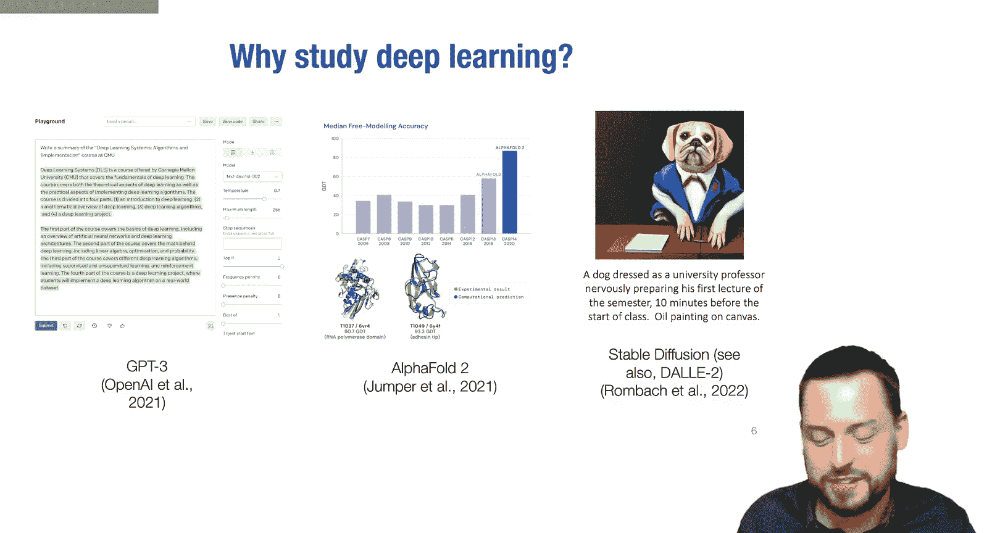

本课程的目标是向你介绍现代深度学习系统的运作方式。这意味着你将学习这些系统内部的工作原理。你将学习诸如自动微分、一些基本的神经网络架构、优化，以及在GPU等系统上进行高效操作的方法。这些是现代深度学习系统在现代硬件上高效运行的方式。

为了巩固你的理解，你将在整个课程中通过作业开发Needle库。Needle代表“深度学习的必要元素”，它是一个与PyTorch大致相似的深度学习库。你将在整个作业中逐步从头开始实现许多常见的架构和该库的许多方面。

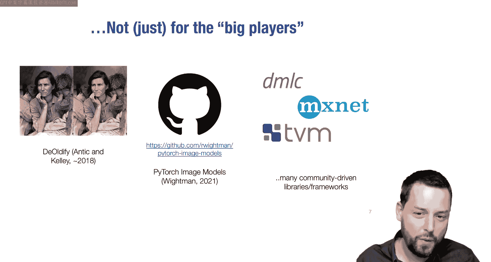

那么，你为什么要这样做？为什么你可能想学习深度学习？为什么你可能想学习深度学习系统？

首先，让我们回答一个更简单的问题：为什么你可能想学习深度学习？如果你正在学习这门课程，你可能已经喜欢深度学习，或者至少了解深度学习，并且可能对为什么想学习深度学习有很好的想法。但我还是会快速举几个例子，其中许多你可能已经见过。不过，如果我们不在第一讲开始时展示一些关于深度学习当前能做什么的酷炫图片，那它就不是真正的深度学习课程。

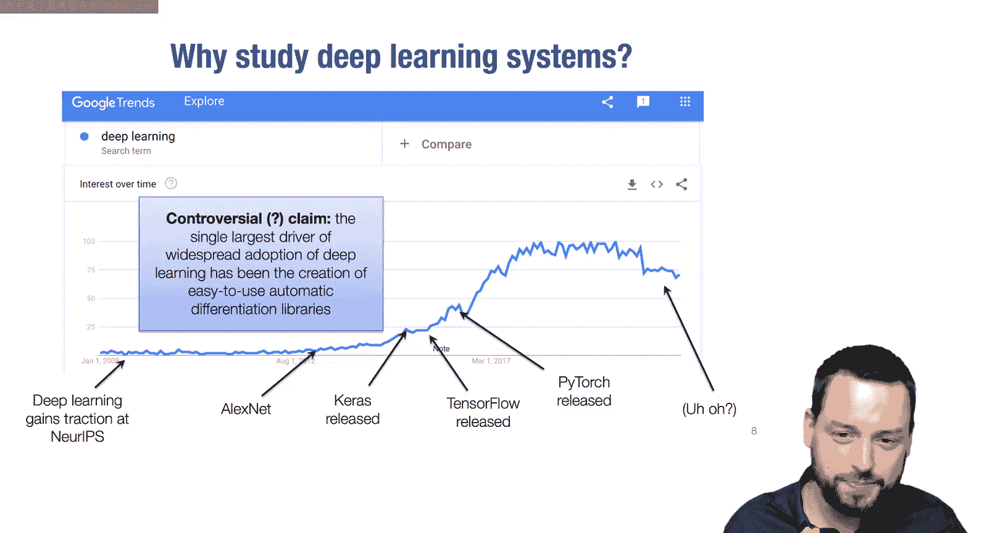

你可能听说过著名的AlexNet架构，它于2012年开发，在ImageNet图像分类挑战赛中表现非常出色。需要立即指出的是，这不是深度学习的历史，也不是将功劳归于任何深度学习的第一要素或第一架构，这是一个我不想卷入的争论。但这确实是一个非常著名的架构，至少在公众视野中作为一个领域和技术，它确实通过构建一个能够将图像分类为1000个类别之一的架构，比当时的标准计算机视觉技术好得多，从而在深度学习的可用性和能力上实现了一个转折点。

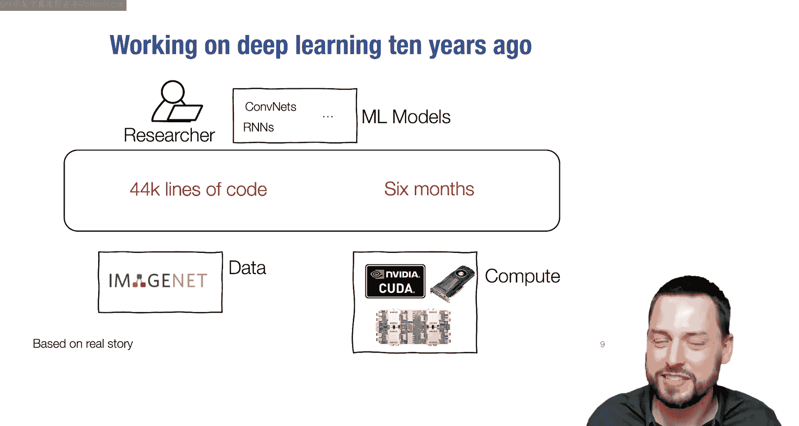

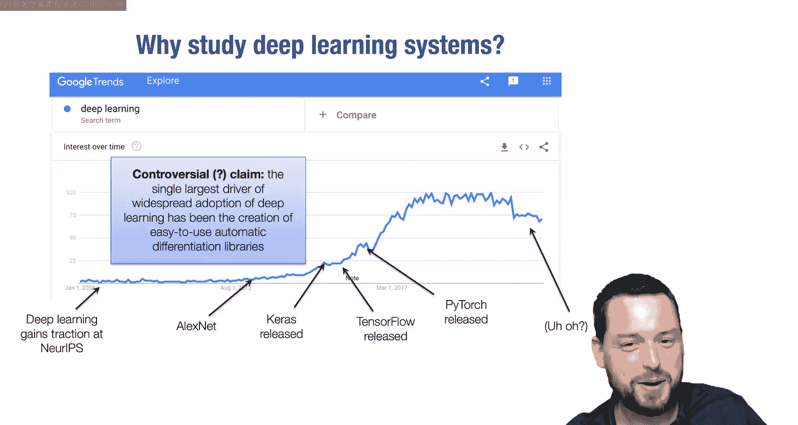

你可能也听说过AlphaGo系统，它于2016年开发，并击败了当时世界上最好的围棋选手之一。围棋长期以来被视为计算机游戏的一大挑战，因为每个位置的走法可能性非常多，像国际象棋中使用的标准技术在这里不太适用。但利用深度学习技术，DeepMind团队能够构建一个系统，击败了当时世界上最好的选手之一，不久之后击败了世界上所有最好的人类选手。这比该领域任何人预期的都要快得多。

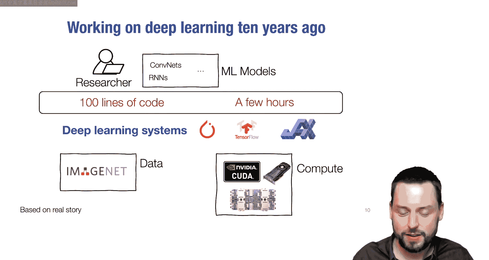

你可能也听说过或见过像这样的图片。这些是由StyleGAN系统生成的人脸图像。我知道我们现在已经习惯了看到这些东西，实际上我们已经习惯了看到不真实的人脸，现在到处都能看到。但我记得这篇论文首次在Twitter上发布时，人们以为是在开玩笑，以为这只是一组训练集的图片，人们开玩笑说它们是由对抗网络生成的。但事实并非如此，这些确实是这个网络生成的假图像。我认为我们现在几乎认为生成假人图片是多么容易是理所当然的，而这在四五年前是我们不具备的能力。

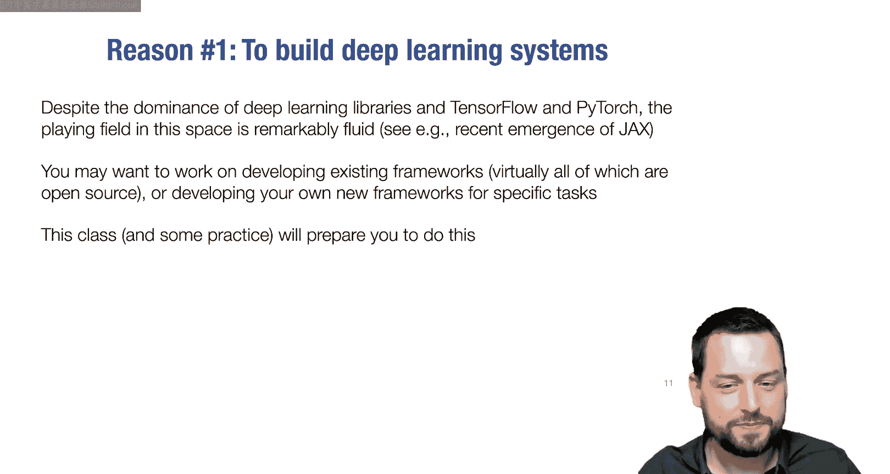

更近一些的历史，你可能听说过GPT-3系统，这是由OpenAI构建的可以生成文本的系统。它生成文本的方式本质上是每次一个词或一个标记地写文本。因此，给定句子中所有先前的标记，它预测下一个，然后将其附加到文本中并预测下一个。从这个看似简单的过程中，我们仍然能够生成令人惊叹的复杂且连贯的文本，这本质上是一个旨在预测文本中下一个可能标记分布的深度学习系统。事实上，我让GPT-3写了一个本课程的摘要，它输出了一个关于深度学习课程的非常合理的摘要。实际上，它对本课程来说是一个非常糟糕的摘要，因为它说我们将讨论理论和数学，然后我们将涵盖无监督学习和强化学习，但这对于许多大学提供的通用深度学习课程来说将是一个非常好的摘要。

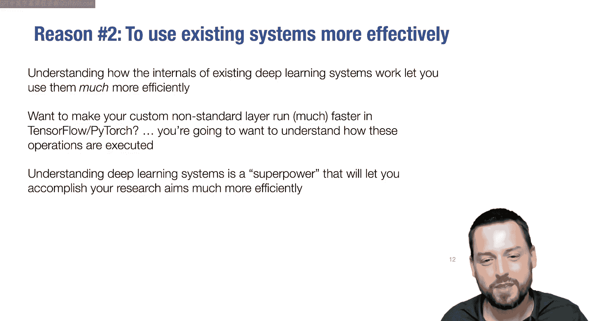

你可能也见过AlphaFold和AlphaFold 2系统，这是一个根据DNA序列预测蛋白质三维结构的系统。这在很长一段时间里一直是生物学的一大挑战，即理解DNA序列如何形成在体内实际执行任务的蛋白质的三维结构。在很长一段时间里，这张图表显示了多年来在蛋白质折叠预测任务的一个知名竞赛中这些系统的进展和准确性。在四年时间里，由DeepMind构建的AlphaFold系统确实在预测质量和准确性方面取得了惊人的科学突破，以至于可以说至少在受限情况下，这个问题实际上已经解决了。

最后，如果不包含一张由深度学习系统生成的图片，那就不像是2022年了。这是一张由Stable Diffusion系统生成的图片，实际上大约在一周半前发布。事实上，它是在我们宣布并发布视频宣布这门公开课程的当天发布的，所以他们确实抢了我们的风头。当然，这也与DALL-E 2系统以及更早的DALL-E系统和许多先前论文的工作有关。但这些系统令人惊叹，它们可以接受一个文本提示，生成可能以前没有人真正想到过的内容，并在许多情况下生成与该文本相对应的非常逼真的绘画或图像。在这里，我写的文本提示是：“一只打扮成大学教授的狗，在学期第一节课开始前10分钟紧张地准备他的第一堂课。”我不知道我为什么会想到这个，你可以自己想象。它是一幅画布上的油画，你看到系统生成的内容看起来就像一只打扮成大学教授的狗，正在准备一堂课，我想“课前10分钟”这部分也许可以从它的表情中看出来，看起来有点像一幅油画。这真是太神奇了，这些系统具备的能力。

现在，你可能注意到我给出的所有这些例子，除了第一个，基本上都是在公司完成的。实际上最后一个也不是，Stable Diffusion实际上是在一家相对较小的公司完成的，但他们背后仍有相当多的资源支持。不过，我想指出的另一点是，如果你有点担心说：“哦，你知道所有这些事情都发生在大公司，一个人或一小群人真的能做什么来影响这个领域呢？”我首先会指出第一篇论文和Stable Diffusion论文实际上是少数人通过正确的方法和聪明才智可以做什么的例证。但我也想强调几个例子，说明我认为在塑造深度学习领域方面仍然令人印象深刻的较小规模的努力。

DeOldify工作基本上由两个人完成，我认为它仍然是或将黑白旧照片彩色化的最先进技术。图像着色作为一个研究课题已经存在很长时间了，但这个系统确实是少数人的努力，最终实现了我认为这类任务在视觉上最好的版本，最初至少是由两个资源有限的人完成的。如果你现在从事计算机视觉工作，你可能听说过PyTorch Image Models或TIMM库。这本质上是一个人的工作，他想实现一大堆深度学习图像分类模型。来自许多论文，并在基准数据上测试它们，在许多情况下使用这些论文的预训练权重，或在许多情况下从头开始训练它们。这至少最初是一个人的相对较小的努力，并已成为我们学术界在构建这些视觉系统时真正使用的主要图像分类库。最后，我不会强调其他这些，因为它们实际上是社区努力。但还有许多其他库、系统、大型代码项目的例子，它们本质上是社区驱动的，无论是库还是框架，都是社区驱动的，真正推动了该领域的发展。实际上，当我简要介绍本课程的联合讲师Tiianchi时，我会再次提到其中一些。

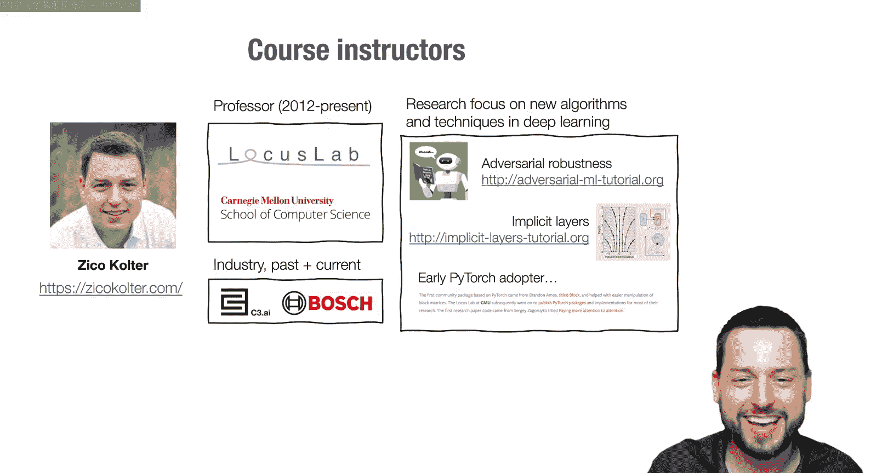

到目前为止我谈到的所有这些对你来说可能都不是新闻。如果你正在观看这个视频，你可能会说：“是的，我明白了，深度学习很棒，这就是我学习这门课程的原因，这就是我到现在还在听这个视频的原因，如果你还没有快进的话。”

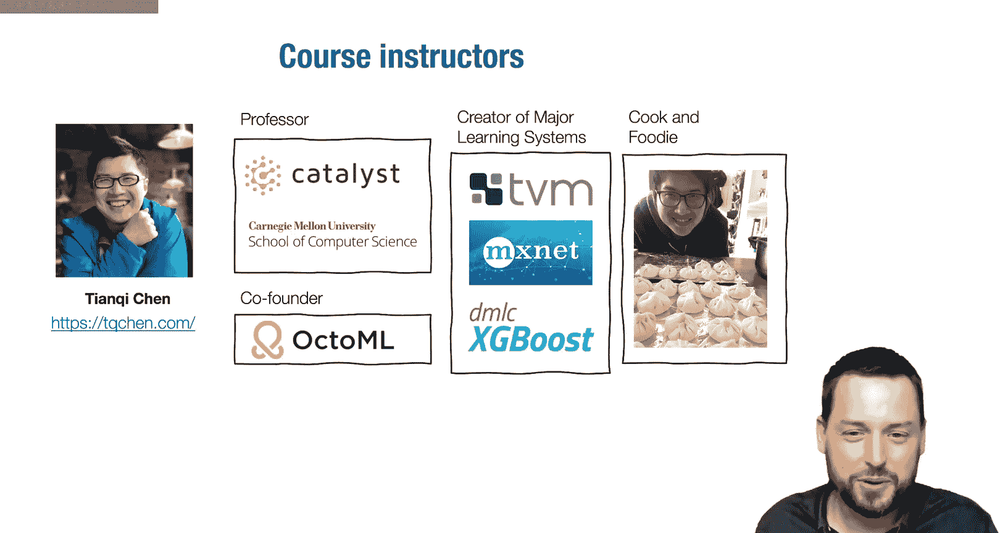

但是，为什么你应该学习深度学习系统？为什么你实际上想学习深度学习系统，而不仅仅是深度学习，而是支持这些系统的实际架构？我将通过展示一张图表来激发这个动机。

这是一张关于过去15年左右“深度学习”一词兴趣度的谷歌趋势图表。我将在图表上标注一些值得注意的事件。在2000年代末，这实际上是深度学习领域在某种意义上在学术界兴起的时候。我当时参加像NIPS这样的会议，我记得在2000年代末，深度学习成为了一个每年都有大量论文的领域。但尽管如此，我的意思是，也许学术工作总是这样。与现在相比，当时对深度学习的兴趣并不大。它只是一种学术趋势，就像许多其他你可能没听说过的趋势一样，因为它们发生在15年前，现在没人再用了。

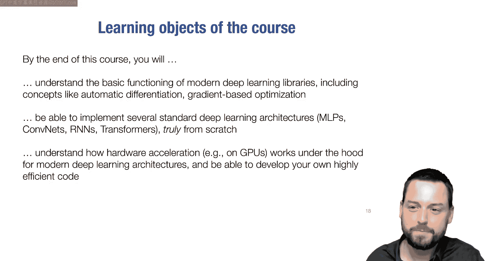

然后在2012年，正如我提到的，AlexNet网络发布了，这再次说明，这不是深度学习领域的历史，我当然也应该提到，深度学习和神经网络的数学实际上可以追溯到80年代，甚至可能更早到70年代。这只是一个近期的历史，当然，我再次只标注了一些事件，并不是要声称谁先做了什么等等，这是一个我不想玩的游戏。但AlexNet是一个非常流行的架构，然而对深度学习的兴趣只有一点点上升，你知道，图像分类达到最先进的性能，但仍然没有发生太多事情。

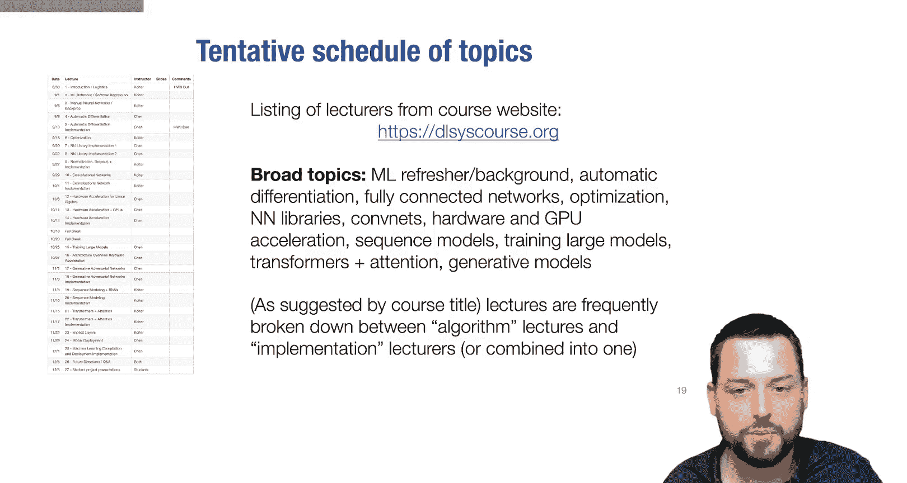

那么，什么时候开始真正起飞呢？在随后的几年里发生了一些其他事情。所以在2015年和2016年，像Keras、TensorFlow和PyTorch这样的库发布了。如果你真的看看深度学习何时变得真正流行的时间，它与这些库的发布时间更加吻合，而不是我们认为是该领域一些重大著名论文或事件的时间。因此，我想提出一个可能有争议但也许不那么有争议的说法：深度学习广泛采用的最大单一驱动力，本质上是易于使用的自动微分库的创建。当然，这有点过于简化了。我们将在本课程中讨论的实际深度学习系统，涉及的内容远不止自动微分。但这个核心技术，它同样可以追溯到70年代，不是新技术，但在此之前也有框架。在PyTorch之前有Torch，只是没有多少人使用它，因为你必须学习一门全新的语言Lua才能在那里实现你的模型。因此，基于Python的框架的可用性，让你能够快速原型化新的架构、新的模型，我认为这是深度学习兴趣爆炸式增长的最大单一驱动力。

现在，你可能从这张图表中看到的另一件事是，也许最近情况不妙，最近可能发生了什么事，我不这么认为，我认为谷歌趋势的最新数据经常有问题。但更重要的是，我认为可能正在发生的是，现在很多这些东西都归在AI的范畴下，我会尽量避免使用这个术语，我会尽可能具体地谈论深度学习，但可能正在发生的是，人们只是用AI这个词来谈论很多这些东西，而不是总是用深度学习这个词。

另一种强调完全相同观点的方式。我实际上要引用Tiianchi工作的一个故事。他，我承认，当涉及到深度学习时，我实际上相当晚才加入。尽管周围有人在使用它，其中一些是该领域的先驱，但我实际上直到2015年左右才开始从事深度学习工作。也许并不奇怪，大约是在我可以轻松原型化东西的时候。但Tiianchi，他实际上早在2012年这些技术最初被开发时就在研究深度学习了。事实上，他作为博士生的第一个项目之一就是编写在GPU上加速卷积网络开发的代码。这大约与AlexNet正在开发的时间相同，所以他当时在做类似的事情。他给出的数字是，要实现一个真正有能力的、用于像ImageNet这样的数据集进行图像分类的卷积架构，当时他花了大约44,000行代码和大约六个月的编码时间。我稍后会提到这一点，但Tiianchi是一个非常好的程序员，编写一个可工作的深度学习架构仍然花了他这么长时间。

与今天对比。今天，如果你想做同样的事情，你可能只需要写大约100行代码。你可能在几个小时内就能完成。原因就在于像PyTorch、TensorFlow和现在的JAX这样的深度学习系统。我认为我们常常没有充分认识到能够如此快速地迭代是一个多么重要的促成因素。我们认为深度学习模型训练和开发速度慢，尤其是大型模型，但这已经非常快了。我们拥有由这些深度学习系统实现的惊人的快速当前迭代时间。

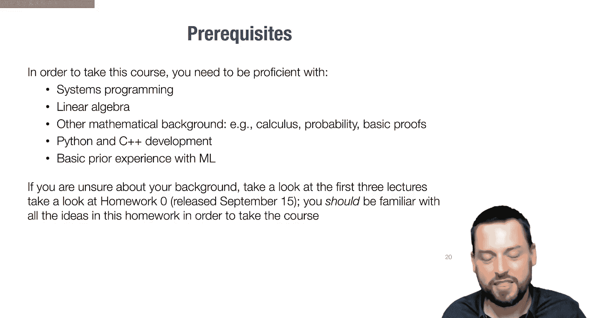

但这仍然没有回答我最初提出的问题，那就是：为什么你应该学习这门课程？也许你现在同意深度学习系统很棒。那你为什么不直接使用它们呢？你可以直接使用，我相信你已经使用了，你可能已经在使用PyTorch、TensorFlow和JAX了。为什么你应该学习一门关于这些系统实际如何工作的课程？实际上，我认为有三个理由可以说明为什么这门课程可能适合你学习，如果你对深度学习感兴趣的话。

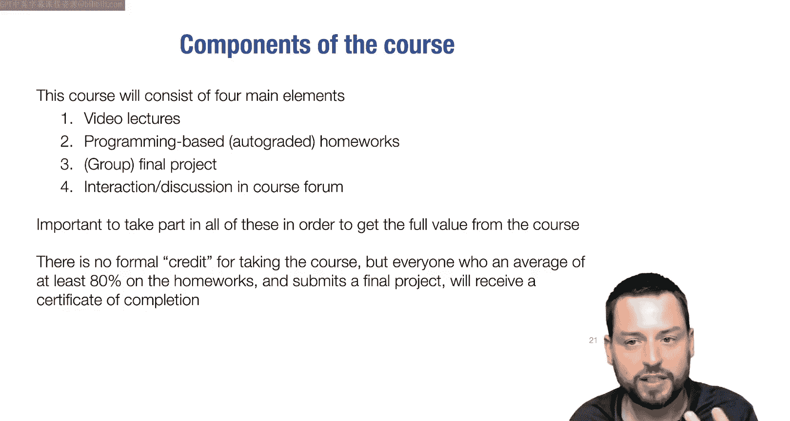

第一个原因当然是，如果你想构建深度学习系统，你最好理解它们。因此，尽管深度学习库的现状可能让你觉得像TensorFlow和PyTorch这样的库已经赢了，它们是每个人使用的标准，但实际上并非如此。我认为深度学习系统领域实际上非常活跃。JAX作为一个在很多深度学习研究中占主导地位的框架相对较新出现就证明了这一点。这是最近几年发生的事情。但我认为，在某种程度上，我们还没有完成，我认为在开发新系统方面还有很多工作要做，也许是更专业的系统，也许是专注于深度学习不同领域或不同范式的系统，但我认为我们还没有达到深度学习系统最终状态的样子。如果你想开发自己的框架或在现有框架上构建，顺便说一下，所有现有的框架本质上都是开源的，所以如果你理解它们，你绝对可以下载源代码并开始贡献。如果你想做所有这些，那么这门课程和一些实践将为你做好准备。所以，如果你想构建这些库并为它们做贡献，这可能是你想学习这门课程的最明显原因。

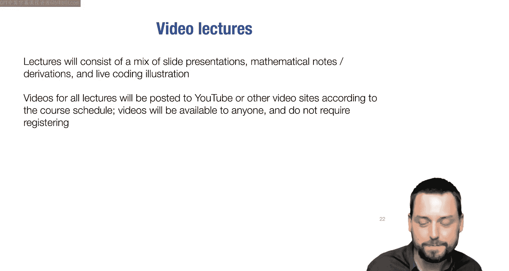

但这并不是唯一的原因。这门课程的第二个原因实际上是我会向该领域的实践者最强调的一个原因。这个原因是：理解深度学习系统的内部工作原理，可以让你更高效、更有效地使用它们。我真的是这个意思。所以，如果你想构建可扩展的模型、高效的模型、执行速度快或能充分利用GPU的模型，你真的需要理解这些系统在底层是如何工作的，真正执行的是什么，它们如何将你对网络架构的高级描述转换为真正在硬件上执行的东西。然后训练和微分该系统并调整参数等等。这是如何工作的？理解它是如何工作的，实际上将使你能够编写更高效、更有效的代码。如果你正在进行深度学习研究，尤其如此。所以，特别是如果你正在开发新型层、新架构、深度学习中的新结构，如果你理解这些系统背后的逻辑和机制，这将大大改进你的工作。我一直把理解深度学习系统称为一种超能力，可以让你实现你的研究目标，即使你的研究目标不是关于系统构建，也能让你更有效地实现它们。这可能是你们大多数人可以并且应该学习这门课程的主要原因。

但如果我不再增加一个理由，那就是我的疏忽。那就是深度学习系统真的非常酷。这些系统如此有趣的原因其实非常简单。那就是，尽管这些东西看起来复杂，PyTorch和TensorFlow现在都有数百万行代码，但尽管这些库看起来复杂，深度学习系统背后的核心底层算法，说实话，是极其简单的。真的，每一个深度学习架构背后的核心算法，你在之前屏幕上看到的那些机器学习模型的所有进步，至少在算法上，它们本质上都基于自动微分和基于梯度的优化，至少从数学角度来看是这样。这些是实际上支撑所有这一切的两个或少数几个算法。然后在实现方面，它们本质上建立在高效的线性代数之上，尤其是在GPU系统上进行高效的矩阵乘法。不像，比如说，一个操作系统，如果你想构建一个操作系统，你真的需要构建相当多的代码，你必须写很多代码。因此，带你学习操作系统的课程通常会构建一个非常基础的操作系统，即使那样，你也需要写很多代码才能做任何合理的事情。但你实际上可以编写，并且你将编写一个合理的深度学习库。如果你想代码非常紧凑，你可能可以用不到2000行代码完成。一个可以在GPU上运行、可以进行自动微分、具有卷积和卷积网络、循环网络、Transformer等操作的库。你几乎可以用很少的代码完成，因为支撑这些系统的实际思想很简单。而且，我这么说有点开玩笑，但它们也有点神奇。在我从事深度学习之前，我是在传统机器学习中成长起来的，那时我们手动推导所有梯度，当你推导一些新模型时，你经历的巨大努力就是手动写出一堆梯度。我记得我第一次构建一个自动微分库时，我意识到我可以取某个复杂表达式，求它的梯度，然后形成其梯度的更复杂表达式，并对那个东西进行微分。尽管我实际上很难手动推导它，我的意思是，我可能能做到，但手动推导会花我很长时间，但我可以写一些代码来完成它。这真的非常酷，我认为每个从事深度学习的人都应该有这种体验。

好了，说了这么多，现在让我提供一些关于这门课程及其后勤安排的更无聊的信息。

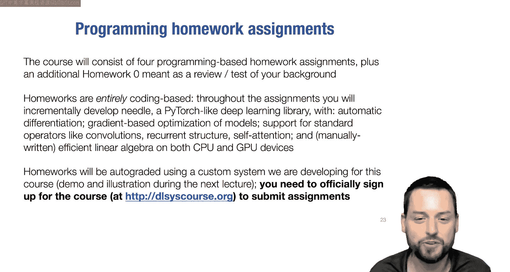

首先，介绍一下我自己和我的联合讲师Tiianchi。我是卡内基梅隆大学的一名教员，自2012年以来一直在那里。但除了在CMU工作外，我在工业界也做了相当多的工作，所以我之前在一家叫C3 AI的公司工作，现在我是博世及博世人工智能研究中心的首席科学家。我的学术研究主要集中在深度学习的新算法和新方法上。我在对抗鲁棒性方面做了很多工作，特别是在对抗攻击的可证明防御方面。我还做了很多我们称之为“隐式层”的工作。这些层不是仅仅通过堆叠传统操作形成，而是通过实际求解更复杂的算子（如优化问题或不动点方程）来形成，并且你实际上解析地对它们进行微分。事实上，根据目前的日程安排，至少如果有时间，我们将在本课程的最后有一节关于隐式层的讲座，当然是在我们自己的框架中实现。我也是PyTorch的早期采用者，我引以为豪的一点是，我不会很快地贬低Tiianchi所做的系统工作，我马上会展示。但我和我的团队是PyTorch的早期采用者，我们实际上被提及为第一个为PyTorch发布第三方库的团队。我在那里的一个成名作是，作为我们发布优化层努力的一部分，这是一个第三方库，可以在深度网络中作为一层解决优化问题，比如二次规划，如果你知道那是什么的话。为了做到这一点，我写了一个CUDA内核作为PyTorch的一部分，可以批量并行求解多个线性系统，作为我们优化求解器的一步。当然，真正的成名作是，在这样做的时候，我搞砸了，或者更准确地说，我没有以某种方式标准化PyTorch从其CUDA内核中假设的矩阵结构，我在PyTorch的线性求解器中引入了一个bug，我认为那个bug在那之后持续了大约一年，每个人都很困惑为什么这个线性求解器有时会随机崩溃。所以，我想，可悲的是，这就是我在深度学习系统方面的成名作。

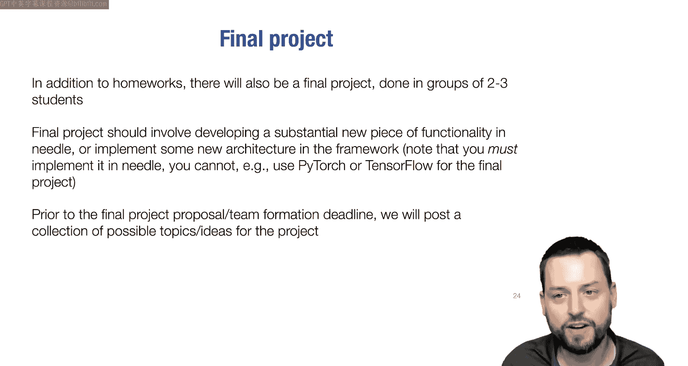

另一位讲师有点不同，所以Satianchi Chen也是CMU的教员，除此之外，他也在工业界有涉足，他是OctoML公司的联合创始人，这是一家为TVM库提供大量支持和开发的公司。但真正的成名作如下。我来讲这堂课，所以我可以适当地在介绍中让Tiianchi有点尴尬。长期以来，我给出的关于他的标准故事是，在深度学习系统或整个机器学习系统中，这个领域现在确实有三个大玩家。当然有谷歌，发布了TensorFlow、JAX和许多其他库。当然有Facebook，来自PyTorch，还有像Prophet这样的时间序列库。然后就是Tiianchi。Tiianchi是XGBoost的原始开发者，这是最常用的梯度提升库之一，仍然是处理表格数据最广泛使用的库之一。他是MXNet库的首席开发者，这是另一个像PyTorch和TensorFlow一样的深度学习框架。最近，他是Apache TVM库的创始开发者和核心开发者之一。因此，他在整个机器学习系统方面做了许多惊人的事情，实际上非常兴奋能和他一起教授这门课程。

现在，在我深入本课程和这些讲座的细节之前，我想提出一个重要的免责声明。

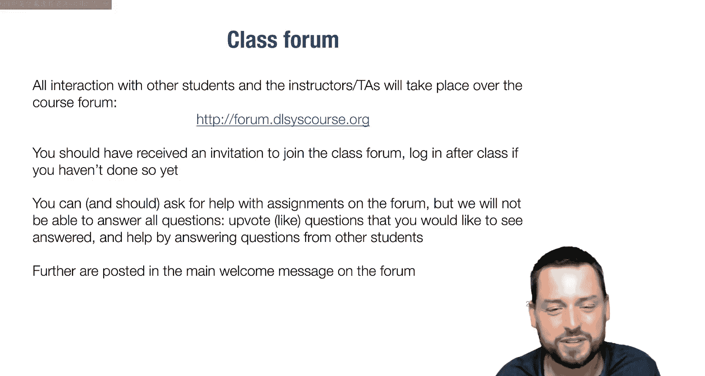

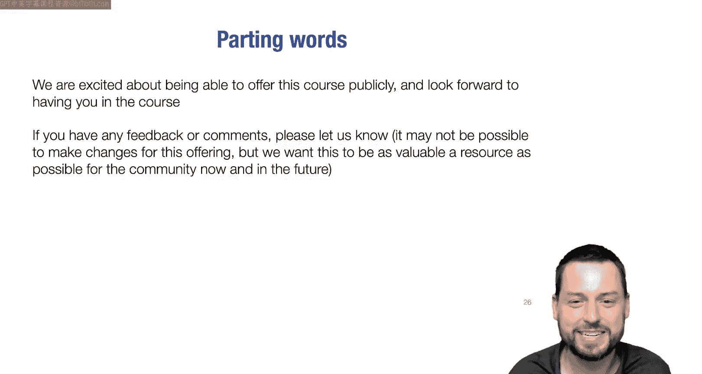

我认为这里需要说明的是，我们第一次在线提供这门课程，我们以前没有这样做过。很多材料，尤其是作业，这是本课程最复杂的部分，正在从之前的版本进行修改，实际上甚至为CMU版本也在修改，然后你知道，他们将在某种程度上进行测试，然后不久之后你们将获得作业。但是，正如这里的标准做法，课程内容和作业中会有bug，或者我们运行