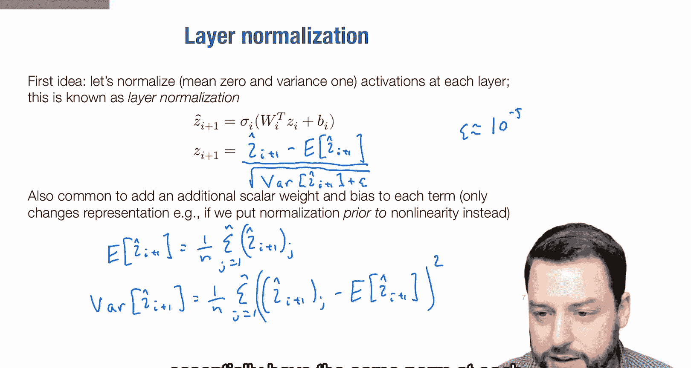
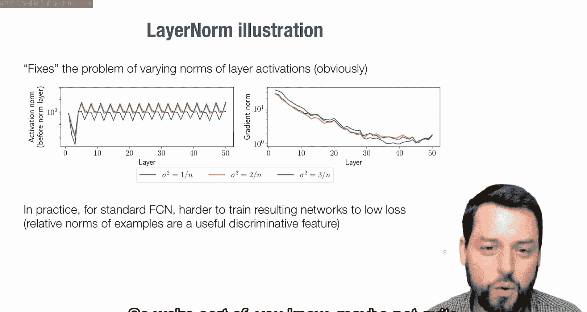
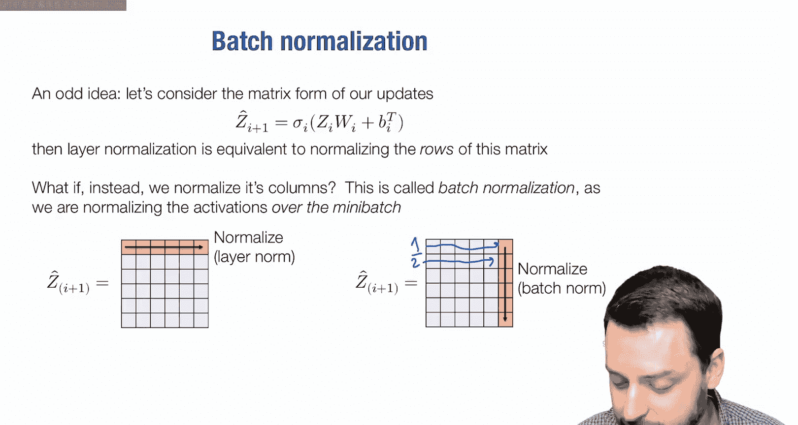
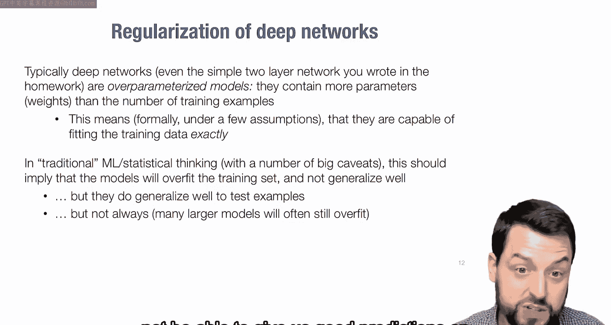
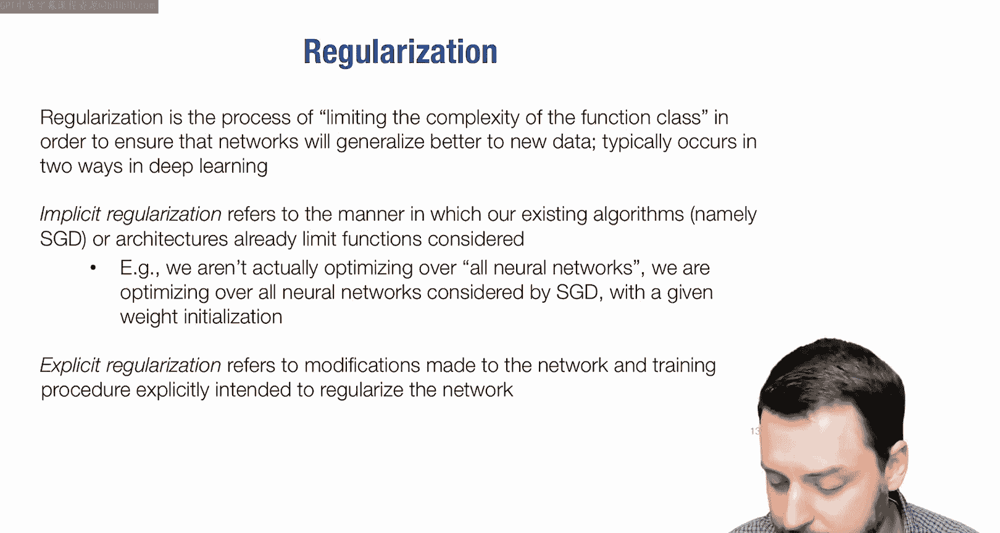
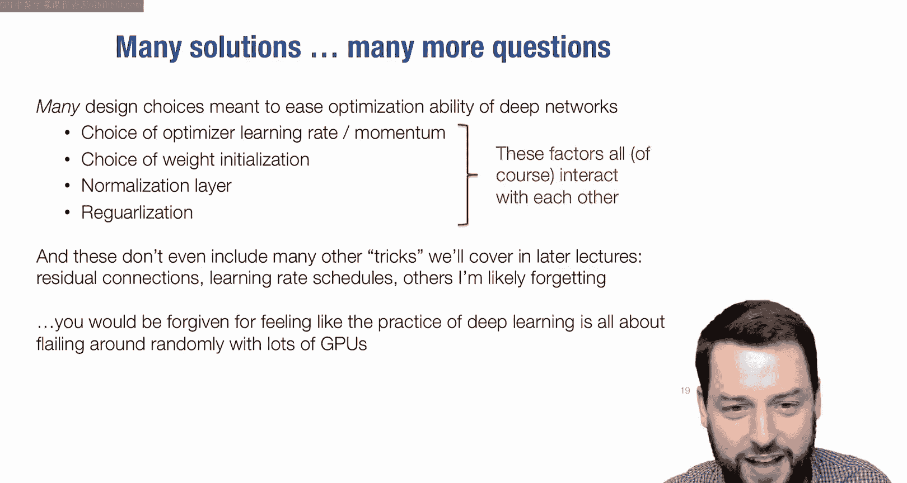
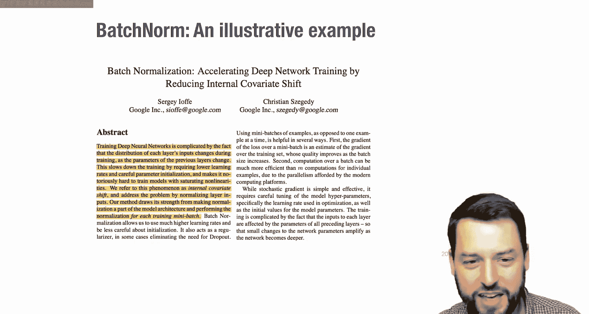
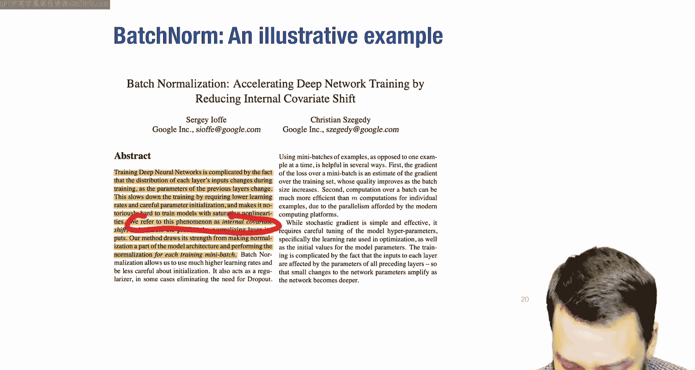
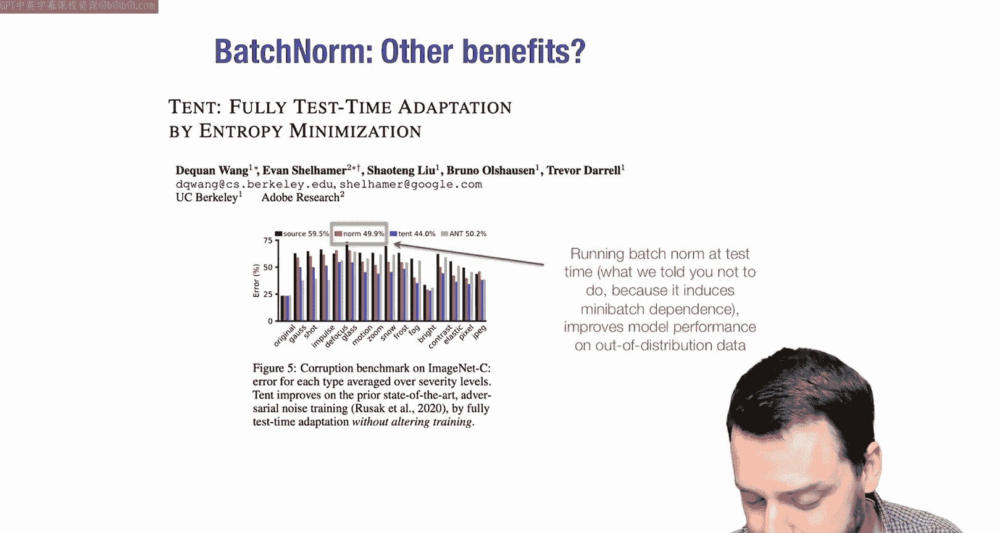

# 09：归一化与正则化 🧠

在本节课中，我们将学习两个关键主题：**归一化**和**正则化**。在之前的课程中，我们讨论了如何构建神经网络库的内部机制。现在，我们将探讨一些技巧和架构，以帮助更高效地训练网络，并构建更好、更易于训练的架构。归一化和正则化是现代深度网络中两个既相关又有所不同的方面。我们还将看到它们与初始化、优化等其他因素的相互作用。

## 归一化 📊

上一节我们讨论了网络初始化的重要性，本节中我们来看看如何通过归一化技术来缓解初始化带来的问题。

### 初始化的重要性

如果还记得之前的课程，为深度网络选择的初始权重非常重要。例如，我们通常用高斯随机变量初始化权重，其方差的选择至关重要。对于一个使用ReLU激活函数的网络，将方差设为 `2/n`（其中 `n` 是该层输入的维度）是一个合适的选择，因为它能在网络加深时保持激活值的方差稳定。

下图展示了使用不同方差（`1/n`、`2/n`、`3/n`）初始化一个50层深度网络时，各层激活值范数和梯度范数的变化：

*   **激活值范数**：当使用 `2/n` 时，激活值范数在整个网络中大致保持稳定。使用 `1/n`（权重过小）时，激活值范数随网络深度急剧减小；使用 `3/n`（权重过大）时，激活值范数则急剧增大。
*   **梯度范数**：梯度范数在不同初始化下大致保持恒定，但其绝对值大小差异巨大。`3/n` 导致梯度范数极大（约 `10^4`），`1/n` 导致梯度范数极小（约 `10^-8`）。

这带来的直接影响是：
*   使用 `3/n` 初始化时，梯度范数过大，优化过程中权重会变得不稳定，导致数值溢出（NaN），损失函数发散。
*   使用 `1/n` 初始化时，梯度范数过小，优化过程几乎停滞，无法取得进展。
*   只有使用 `2/n` 初始化时，网络才能被成功优化。

一个关键直觉是：在深度学习中，初始权重的选择至关重要，这与传统的凸优化不同。糟糕的初始化可能导致网络永远无法训练成功或直接发散。

### 层归一化

既然初始化如此重要，而网络层本质上可以是任何可微函数，一个自然的想法是：添加一个专门的层来“修复”激活值分布的问题。这就是**层归一化**的核心思想。

层归一化的做法很简单：对于每一层的激活值（在应用非线性激活函数之前），我们将其标准化为均值为0、方差为1。

设 `z_hat_{i+1}` 为第 `i+1` 层非线性激活前的值（例如，`z_hat_{i+1} = W_i * a_i + b_i`，其中 `a_i` 是上一层的激活输出）。层归一化计算如下：

1.  计算该层激活值的经验均值：
    `mu = (1/n) * sum_{j=1}^{n} z_hat_{i+1}^{(j)}`
2.  计算经验方差：
    `sigma^2 = (1/n) * sum_{j=1}^{n} (z_hat_{i+1}^{(j)} - mu)^2`
3.  进行归一化（为避免除零，添加一个小常数 `epsilon`，如 `1e-5`）：
    `z_{i+1} = (z_hat_{i+1} - mu) / sqrt(sigma^2 + epsilon)`

其中，`n` 是该层激活值的维度（即该层的神经元数量），`z_hat_{i+1}^{(j)}` 表示向量的第 `j` 个元素。

层归一化有效地解决了激活值爆炸或消失的问题。无论初始化的方差是 `1/n`、`2/n` 还是 `3/n`，应用层归一化后，各层的激活值范数都保持在大致相同的水平，梯度范数也相对稳定，不再严重依赖初始化。

层归一化被广泛使用，例如在Transformer架构中。然而，对于标准的全连接网络，添加层归一化有时反而会使训练到较低损失变得更困难。一个可能的原因是，不同样本激活值的相对大小和方差本身可能包含用于分类的有用信息，而层归一化强制抹平了这些差异。

### 批归一化

除了对单个样本的激活值进行归一化（行归一化），另一种思路是对一个批次（mini-batch）中所有样本的同一特征（即同一神经元在所有样本上的激活值）进行归一化（列归一化）。这种技术称为**批归一化**。

在批归一化中，我们计算整个批次数据在每个特征维度上的均值和方差，并用它们来归一化该特征。这类似于传统机器学习中对数据特征（列）进行标准化的做法。

批归一化同样能稳定激活值的分布。与层归一化不同，它保留了不同样本激活值范数可能存在的差异，这或许是一个有用的判别特征。

然而，批归一化引入了一个奇特的性质：网络中单个样本的预测结果，会依赖于同一批次中的其他样本。因为在计算均值和方差时，用到了批次内所有样本的数据。

为了解决测试时没有批次的问题，标准的做法是：
*   **训练时**：使用当前批次的均值和方差进行归一化。
*   **测试时**：不使用单个样本或批次的统计量，而是使用在训练过程中计算并维护的**运行均值**和**运行方差**（通常是指数移动平均）来进行归一化。

具体实现时，需要跟踪这些运行统计量。批归一化虽然强大，但在实现和使用中也容易引入一些棘手的细节和bug（例如，在评估模式错误地更新了运行统计量）。

## 正则化 ⚖️

上一节我们介绍了用于稳定训练过程的归一化技术，本节中我们来看看用于防止模型过拟合的正则化技术。

### 正则化的动机

深度网络通常是**过参数化**的，即模型的参数量远大于训练样本数。这意味着网络理论上能够完全拟合训练数据，达到近乎零的训练误差。传统机器学习观点认为，这很可能导致**过拟合**：模型在训练集上表现很好，但在未见过的测试集上泛化性能很差。

正则化，通俗地说，就是通过某种方式**限制函数类的复杂度**，以确保模型更好地泛化。

正则化主要分为两类：
1.  **隐式正则化**：并非显式设计，而是由算法或架构本身带来的正则化效果。例如，**随机梯度下降（SGD）** 及其特定的权重初始化方式，实际上限制了优化过程搜索的参数空间，可以被看作一种隐式正则化。
2.  **显式正则化**：对网络或训练过程进行显式修改，旨在控制模型复杂度。接下来我们将重点讨论两种常见的显式正则化方法。

### L2正则化（权重衰减）

最常见的权重正则化形式是**L2正则化**，在深度学习中常被称为**权重衰减**。

其思想是：较小的权重通常意味着更平滑、复杂度更低的函数。因此，我们通过在损失函数中添加一个惩罚项，来鼓励权重变小。

修改后的优化目标为：
`J_reg(W) = (1/m) * sum_{i=1}^{m} L(h_{W}(x_i), y_i) + (lambda/2) * sum_{i=1}^{L} ||W_i||_F^2`

其中：
*   第一项是原始的经验风险（损失）。
*   第二项是L2正则化项，对所有层的权重矩阵的Frobenius范数（元素平方和）求和。
*   `lambda` 是正则化系数，用于权衡两项的重要性。

对这个新目标进行梯度下降，权重的更新公式变为：
`W_i := (1 - alpha * lambda) * W_i - alpha * grad_{W_i} (原始损失项)`

可以看到，在每次梯度更新前，权重会先乘以一个小于1的因子 `(1 - alpha * lambda)`，这相当于在每一步都让权重“衰减”一点，因此得名“权重衰减”。

在实际的深度学习框架中，权重衰减通常作为优化器（如SGD、Adam）的一个参数来实现。重要的是，无论使用哪种优化器，都应该通过将正则化项的梯度加入总梯度来实现权重衰减，而不是尝试设计特殊的更新规则。

尽管L2正则化非常常用，但其在深度网络中的有效性有时存在争议。因为深度网络的函数复杂度与权重大小的关系，可能不如浅层模型那样直接和明确。在实践中，小的权重衰减值（如 `1e-4`）通常效果不错，但有时也可以完全不用。

### Dropout

另一种常见的正则化策略不是作用于权重，而是作用于网络的**激活值**，这种方法叫做**Dropout**。

Dropout的核心思想是：在训练过程中，随机将每一层的一部分激活值设置为零。

具体操作如下：
对于第 `i+1` 层的每个激活单元 `j`，其输出 `z_{i+1}^{(j)}` 为：
*   以概率 `1-p` 保留原值 `z_hat_{i+1}^{(j)}`。
*   以概率 `p` 将其设置为0。

为了在测试时不改变网络的预期输出，我们需要在训练时对保留的激活值进行缩放，乘以 `1/(1-p)`。这样，无论是否应用Dropout，该层输出的期望值保持不变。

与批归一化类似，Dropout通常只在训练时使用，测试时则使用完整的网络。

如何理解Dropout？一种较好的视角是将其看作一种**随机近似**。正如SGD通过小批量样本来近似整个数据集的梯度，Dropout可以看作是在每个层内部，通过随机采样子集（部分激活）来近似完整的线性变换。这种引入随机性的过程，类似于SGD，为训练提供了正则化效果。

## 总结与思考 💭

本节课我们一起学习了归一化和正则化这两大类技术。

*   **归一化**（层归一化、批归一化）主要用来解决深度网络训练中因初始化不当或网络过深导致的激活值分布不稳定问题，它们通过强制中间层的分布保持稳定，使得训练过程更平滑、对初始化更不敏感。
*   **正则化**（L2正则化/权重衰减、Dropout）主要用来控制模型复杂度，防止过参数化的网络对训练数据过拟合，旨在提升模型的泛化能力。

这些技术（连同之前讨论的优化器、初始化方法）构成了训练深度网络的一套“工具箱”。然而，关于这些技术为何有效，社区内常有讨论甚至争论。以批归一化为例，最初被认为通过减少“内部协变量偏移”来加速训练；后续研究又提出其作用是平滑优化景观；还有研究认为其对训练平滑度并无改善；近年来，批归一化甚至在处理分布偏移问题上展现了新的价值。这说明了即使对于广泛应用的技术，其深层机理也可能尚未被完全理解。

这可能会给人一种印象：深度学习充满了难以理解的“技巧”。但需要强调的是：
1.  对这些技术已有大量严谨的实证研究。
2.  在许多情况下，通过不同的技术组合（例如，使用不同的归一化或正则化方法），只要经过恰当的调优，最终都可能获得相近的性能。深度学习的惊人之处之一，就是多种不同的路径常常能导向相似的好结果。

因此，虽然熟悉这些技巧至关重要，但也要明白它们并非唯一的选择。从下一讲开始，我们将不再局限于这些通用技巧，转而探讨更具体的、结构化的网络架构，首先从卷积神经网络开始。