# 10：卷积网络 🧠

在本节课中，我们将要学习卷积网络。卷积网络是一种结构化的网络形式，常用于图像处理，也用于序列、音频或其他类似领域。可以说，卷积网络在某种程度上是历史上最重要的结构化深度网络，至少在深度学习迄今为止的历史中是这样。虽然如今像Transformer这样的架构越来越流行，但回顾卷积网络产生的影响，很难夸大它对深度学习领域的冲击。我们今天就来讨论它。

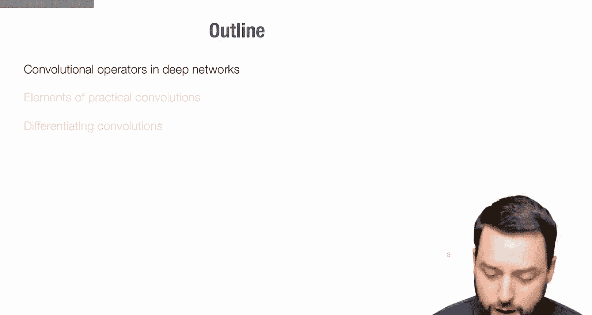

本节课在某种程度上是一次前瞻。我们课程的后半部分将重点讨论不同的网络结构，例如卷积网络、循环网络和Transformer。但今天，我们将先了解卷积网络。在这节课之后，我们将回到线性代数实现等更具体的问题。为了高效实现卷积运算，我们实际上需要那些知识。因此，在某种意义上，为了给后续高效线性代数的工作提供动机，我们将首先讨论这种称为卷积网络的结构化网络形式。

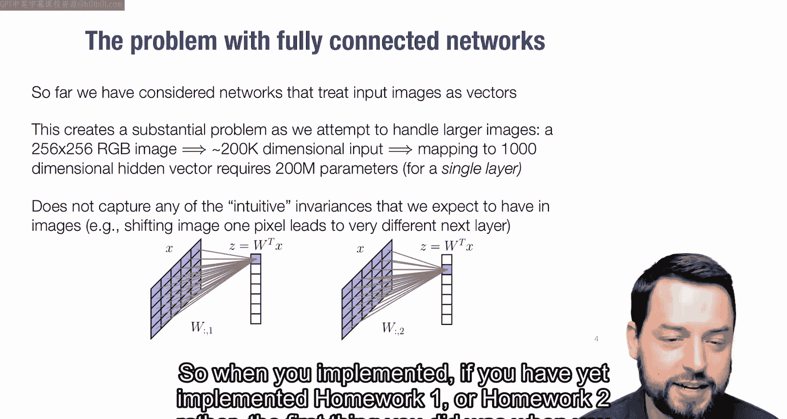

## 卷积网络：10.1：卷积算子

首先，我们来谈谈卷积算子。什么是卷积算子？如何将其整合到深度网络中？

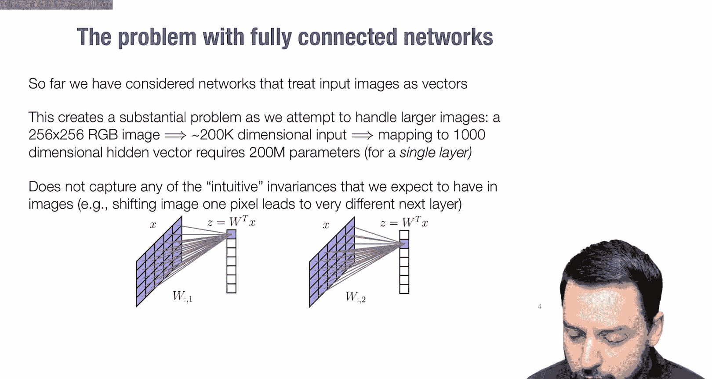

到目前为止，在本课程中，我们考虑的网络本质上将整个图像输入视为向量。例如，如果你已经完成了作业一（或作业二），在将网络应用于MNIST数据集时，你首先将图像展平。你取图像的整个二维结构（MNIST中只有一个通道），并将其展平成一个包含784个元素的长向量。

这种方法对于28x28大小的MNIST数字图像来说尚可，因为向量表示只有784个不同的分量。但对于更大的图像，这种方法就无法扩展了。例如，一个256x256的RGB图像，将产生大约20万个维度的输入（3个通道乘以256x256）。如果你想将其映射到一个1000维的隐藏层，将需要2亿个参数。虽然现在这个参数数量看起来可能不那么惊人，但对于一个全连接层来说，这仍然太多了。对于处理图像的单个隐藏层来说，参数数量实在过多。

更重要的是，这种方法无法捕捉图像中我们期望的直观不变性。我们知道，将图像平移一个像素，图像本身并没有改变。但如果我们采用这种方法，每个隐藏单元都使用一组全新的权重与整个输入向量相乘，这似乎无法捕捉图像中实际存在的结构。

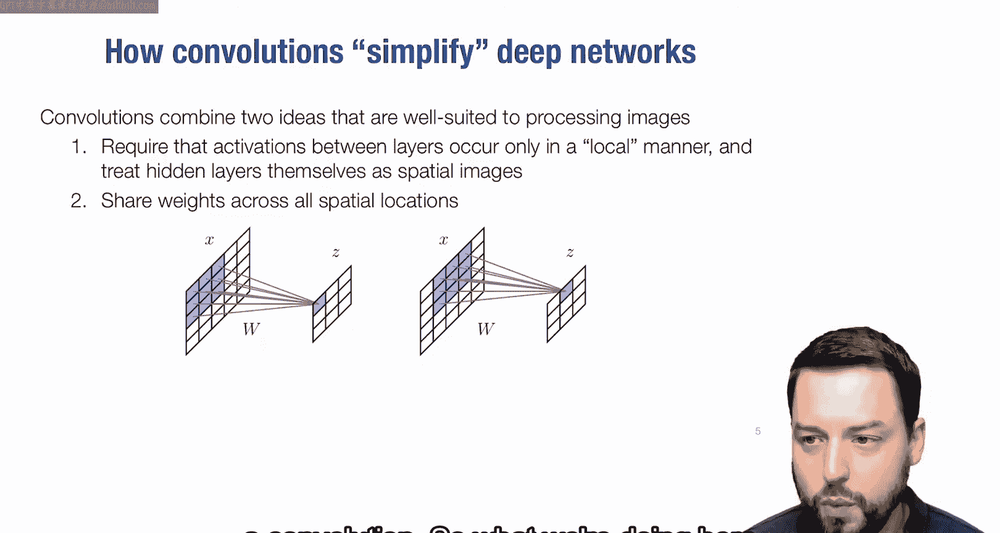

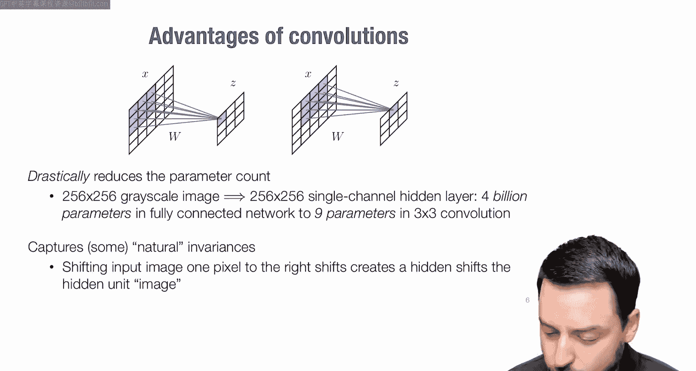

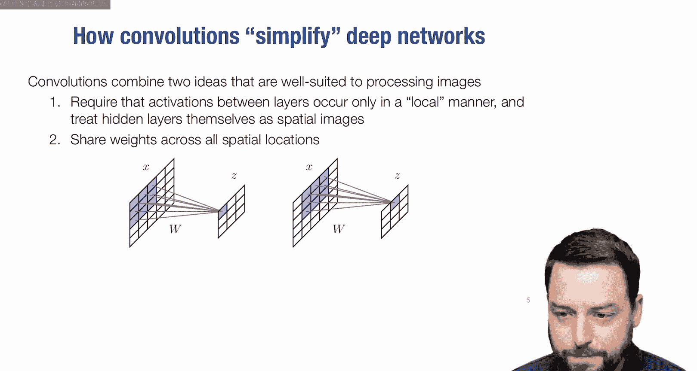

卷积网络的核心思想是将结构嵌入到深度网络的架构中，使其与输入的结构相匹配。我们希望设计一种能够保留图像中我们期望的结构的架构。

卷积网络正是基于两个基本前提对这一思想进行了简化。第一个前提是，我们不再将隐藏单元表示为像输入一样的非结构化向量，而是将其也表示为某种意义上的“图像”，即一个具有空间位置和多个通道的三维张量（这里先展示多个空间位置，稍后再添加多个通道）。

卷积具有两个特性。第一个是局部交互。每个隐藏单元主要（或可能完全）受前一层中与其空间位置相近的输入影响。我们将隐藏层视为空间图像，权重仅局部应用于输入以产生隐藏层。因此，只有这一组像素与我们的权重相乘，才会产生下一层中这个单一位置的值。这就是局部交互。

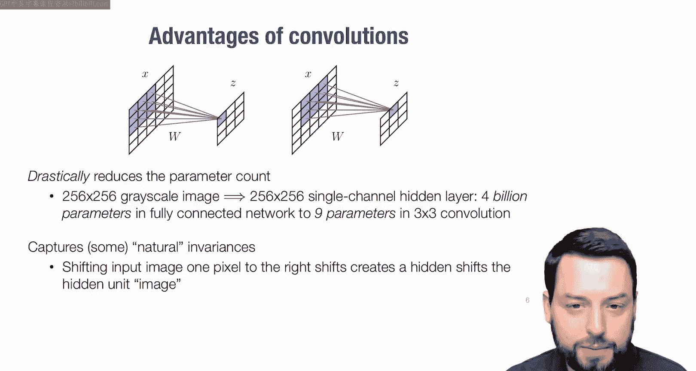

第二个前提是权重在空间位置上共享。我们不是为这个隐藏单元使用一组权重，为另一个隐藏单元使用另一组完全不同的权重，而是使用相同的权重，将其在整个图像上滑动，以产生下一层。这种结构正是所谓的卷积。

在更深入地探讨卷积的形式化定义之前，我们先来看看卷积的优势。

## 卷积网络：10.2：卷积的优势

那么，这样做有什么优势？为什么我们想要在这里构建这种结构呢？

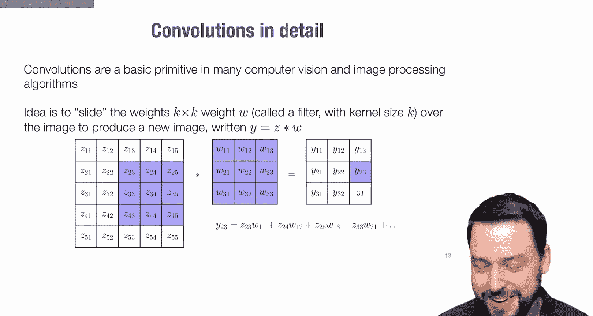

优势有很多。第一个显而易见的是参数数量。通过卷积，我们获得了极高的参数效率。相比于一个拥有2亿参数的简单全连接层，如果我们通过一个3x3的权重块将单通道输入映射到单通道输出，我们实际上只需要9个参数。如果我们想将一个365x365大小的图像映射到相同大小的隐藏单元，全连接层将需要40亿个参数，这显然太多了。而使用卷积结构，我们只需要9个参数，因为你可以使用相同的权重在整个图像上滑动。当然，这样能表示的函数类别远少于全连接网络，但由于我们捕捉了实际想要的结构，这样做非常有益。一个副作用是参数更少，可以更高效地表示网络。

另一个优势是，卷积在一定程度上捕捉了我们期望的自然不变性。例如，我之前提到，图像平移一个像素后还是同一张图像。但如果每个位置（或每个隐藏单元）都使用不同的权重集，这实际上无法捕捉这些不变性。平移图像后，现在每个位置应用了不同的权重，可能会产生一组非常不同的隐藏单元。而卷积结构则能真正捕捉我们期望的图像结构。

现在，让我们更详细地描述卷积的实际结构。

## 卷积网络：10.3：卷积的形式化定义

卷积的思想更形式化地表述如下：我们有一组权重，我们将这些权重在某种意义上“滑动”穿过我们的图像。这是一个3x3的权重集，我们将把它滑动到图像中所有可能的位置以产生输出。例如，对于第一个输出y11，我们将取这个输入块，乘以这些权重来得到这个输出。

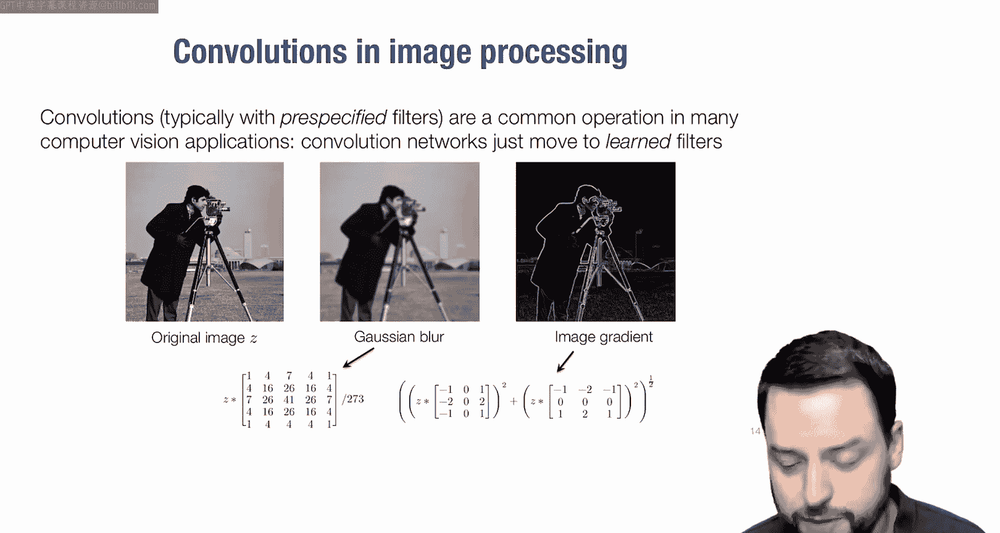

更形式化地说，如果我们想产生输出y11，它等于我们的滤波器和输入中对应项的乘积。所以，y11 = z11 * w11 + z12 * w12 + z13 * w13，等等。本质上，它就是这组输入（视为向量）与这组权重（也视为向量）的内积。然后，我们将其滑动到图像中的下一个位置，计算y12 = z12 * w11 + z13 * w12 + ...，依此类推。这就是卷积算子的形式化定义。

需要指出的是，如果你有信号处理背景，你会注意到这实际上不是你所说的卷积。信号处理中的卷积涉及将权重左右翻转和上下颠倒。我们在这里做的，在信号处理中实际上称为“相关”。但问题在于，“相关”在统计学和机器学习中已有其他含义，所以这是一个非常糟糕的术语。而“卷积”听起来很酷，所以我们打算借用这个术语，将其定义为没有翻转滤波器的卷积。我认为在这一点上，机器学习领域已经“赢”了，这可能是卷积最主要的使用方式。在卷积网络中，我们就是这样定义卷积的。因此，每当机器学习领域的人与你谈论卷积时，他们指的就是这个，而不是翻转滤波器后的版本。

卷积实际上有很长的历史，因为在机器学习使用之前，它们已在信号处理中使用了很长时间。它们被用于经典的信号处理，以及计算机视觉和图像处理。

## 卷积网络：10.4：卷积在图像处理中的应用

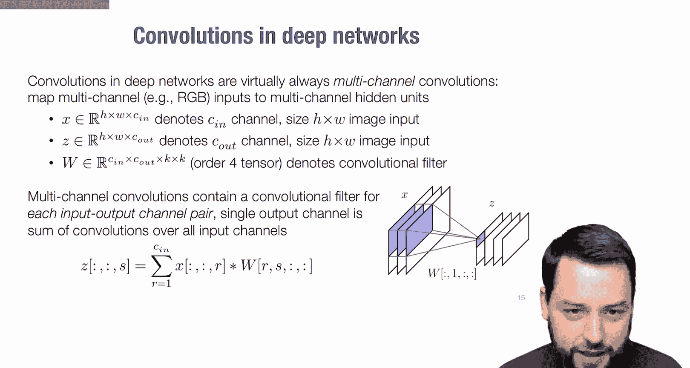

特别是在图像处理中，长期以来一直使用卷积（但不是学习滤波器，而是使用预先指定的已知滤波器）作为进行图像处理和操作的核心操作。

例如，一个常见的操作是高斯模糊。如果我们用这组权重（一个二维高斯函数的表示）对图像进行卷积，每个像素将成为其周围像素的加权平均，从而得到模糊的图像。这是通过卷积实现的。

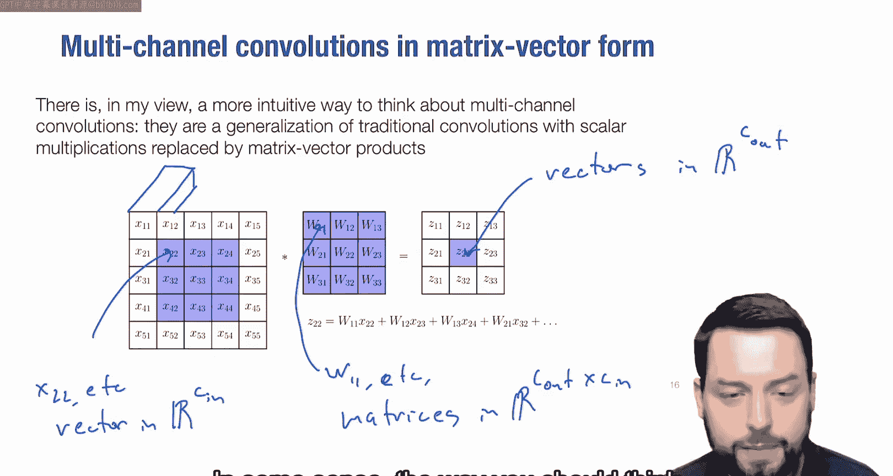

一个更复杂的例子是使用卷积以及一些非线性操作来表示边缘或检测图像中的边缘，或者查看图像梯度等。例如，如果我使用这个滤波器（在x方向上有正负值）对原始图像Z进行卷积，它会计算所谓的图像梯度，查看图像在x方向上的变化程度。类似地，另一个滤波器用于y方向。如果我们取这两个滤波器，看它们的平方和的平方根，本质上就是这两个分量的幅度，得到的结果图像会突出显示图像变化很大的部分。这通常是经典边缘检测算法的第一步。

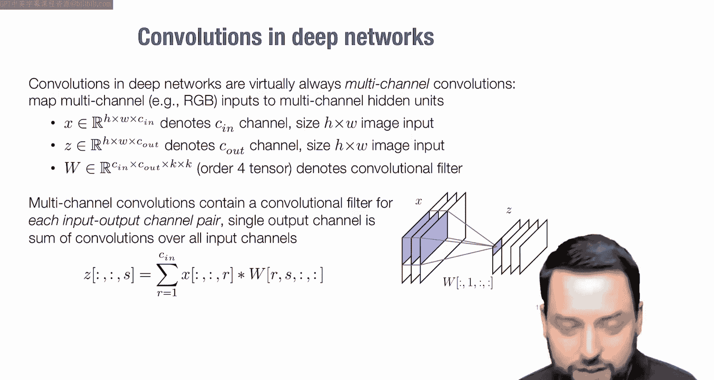

这些操作在经典统计信号处理和经典图像处理中已经使用了很长时间。但在深度网络中，我们通常做同样的事情，只是使用学习到的滤波器，而不是预先指定的滤波器来完成某些任务。我们让算法自己找出应该学习什么样的滤波器，对图像应用什么样的操作。这有时是卷积网络的基本思想。

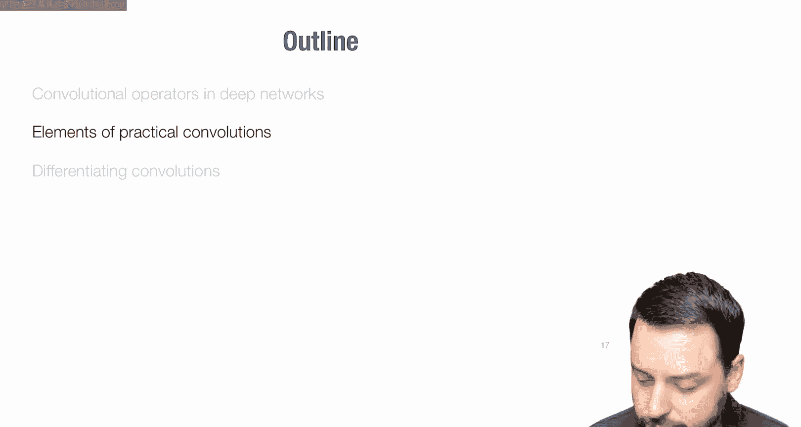

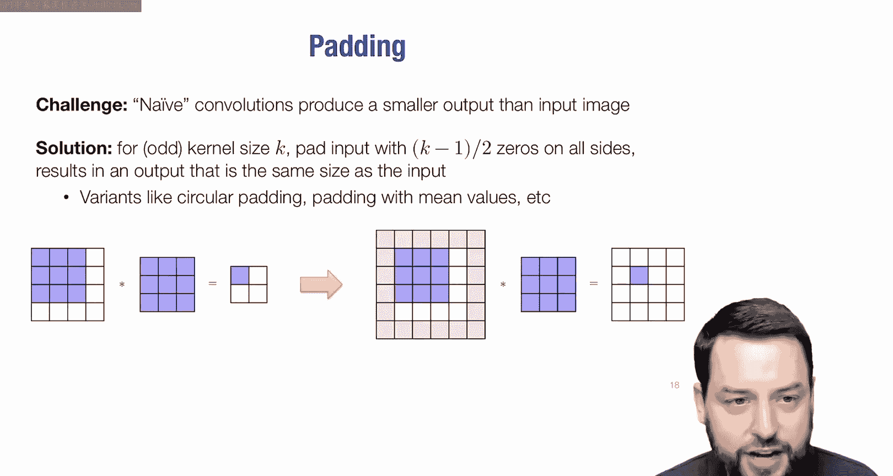

## 卷积网络：10.5：多通道卷积

现在，我需要提到卷积网络的一个特点。尽管你经常看到卷积以一维方式绘制（就像我几页幻灯片前展示的那样，一个滤波器在图像上滑动），但在实践中，深度学习中的操作很少应用于一维输入和一维输出。在深度网络中，我们通常希望隐藏层具有多个不同的维度。

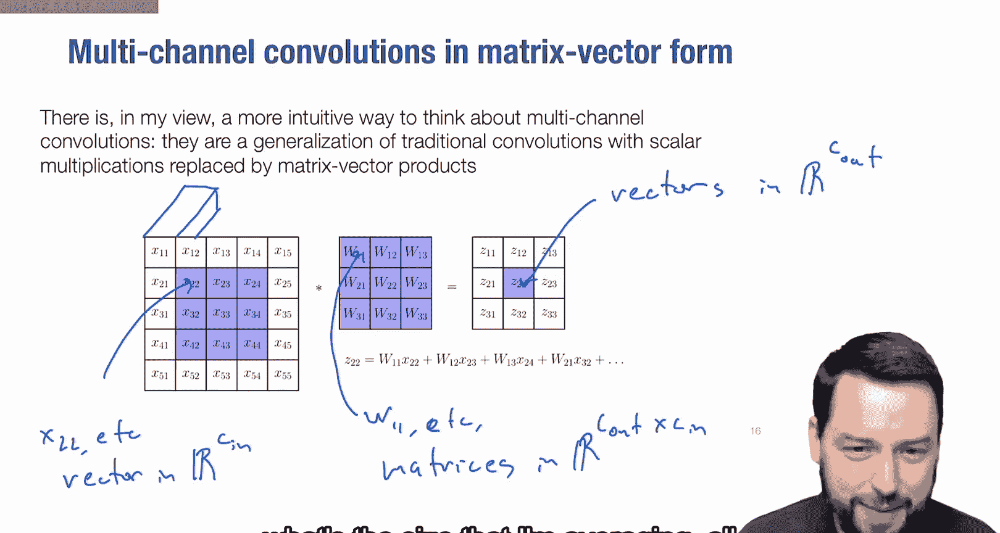

我们在深度网络中实现这一点的方式是使用所谓的“多通道”。将输入X视为具有多个通道是很自然的，例如，彩色图像具有三个通道：红色、绿色和蓝色。在深度网络中，我们实际上也将隐藏单元表示为具有多个通道。

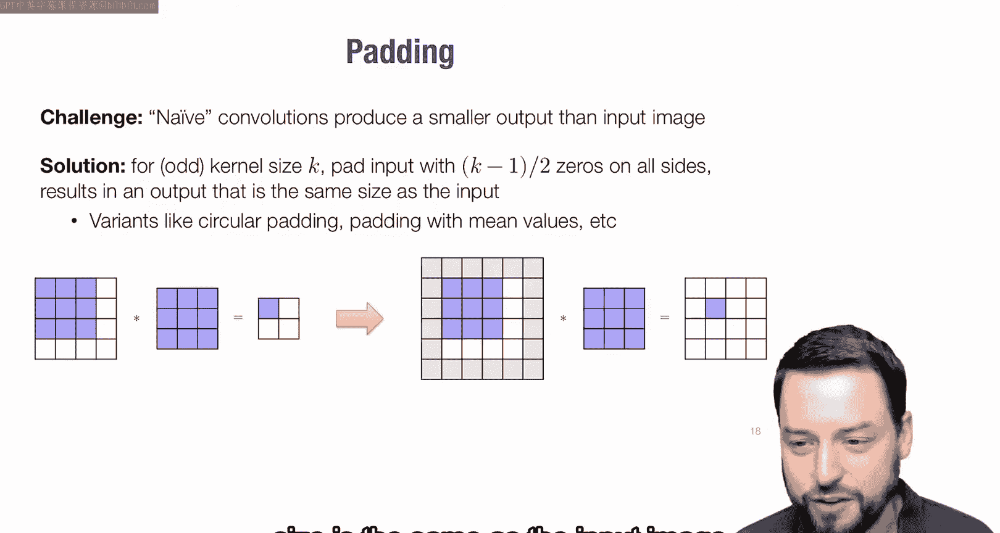

这些隐藏层中的通道并不对应于红、绿或蓝。我们通常使用64、128或1024个通道（出于某种原因，我们经常使用2的幂，尽管并非必要）来表示隐藏层中更复杂、更多的元素。每个通道仍然是这个二维空间数组，但我们将使用许多通道来表示我们的隐藏单元。

一般来说，我们将输入（可以是输入图像，也可以是网络中的中间层）视为一个具有高度、宽度和通道数的三维张量。同样，我们将输出也视为具有高度、宽度和输出通道数。

问题是如何将多通道输入的卷积映射到多通道输出？我们将为每个可能的输入-输出通道对设置一个单独的滤波器（权重集），然后将它们相加。例如，如果我们想计算第一个通道中的这个元素，它将是第一个输入通道与某个滤波器的卷积，加上第二个输入通道与某个滤波器的卷积，再加上第三个输入通道与另一个滤波器的卷积。如果我们想要下一个通道中的下一个输出，我们将对所有输入通道应用相同的操作，但使用另一组全新的权重。

然而，有一种更好的方式来思考多通道卷积，那就是将通道本身及其操作视为矩阵向量运算。思考多通道卷积的正确方式是：在我们的输入图像中，输入到卷积滤波器的每个分量，你不应该像在灰度图像中那样将其视为单独的标量值，而应该将所有这些分量都视为向量。

每个分量，例如X22，都是一个向量，属于R^C_in，其中C_in是我们的输入通道数。这很自然，因为你可以将每个分量视为具有许多通道，就像将其本身视为一个大向量。同样，输出也将是向量，属于R^C_out。

关键点在于：你卷积所用的滤波器，其每个元素实际上是一个矩阵。例如，W11等项将是矩阵，它们将输入通道向量映射到输出通道向量。然后，我们执行与之前相同的操作，只是现在Z22 = W1 * X22，这里的乘积是矩阵向量乘积。

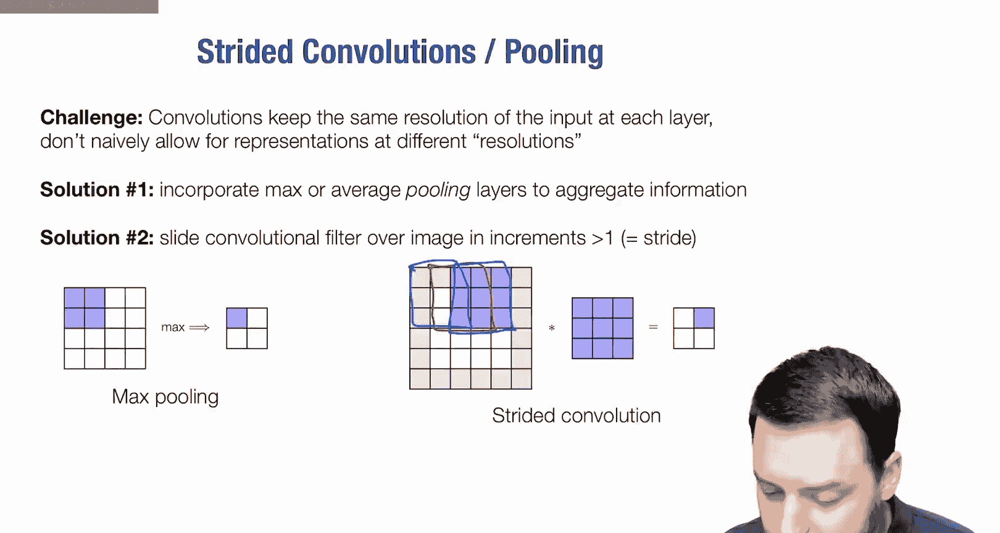

因此，思考2D卷积的方式不是将其视为一个四维张量（K x K x C_in x C_out），而是将其视为一个K x K的滤波器集合，其中每个元素本身就是一个矩阵。这样思考不仅有助于简化方程，而且对于实际实现这些操作也很有价值。我们希望将这些操作实现为矩阵运算，以这种形式进行是实现这些操作的方式。

## 卷积网络：10.6：卷积的实用要素

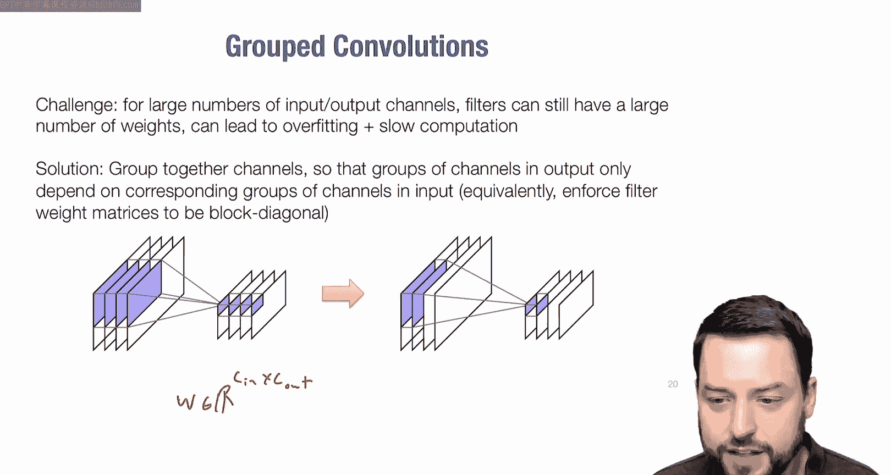

在介绍了卷积的基本概念后，现在我们来讨论卷积的一些实用要素。我之前描述的卷积存在一些问题需要解决，或者说需要添加一些东西才能使它们在深度网络中完全可用。

我们将讨论卷积的几个不同方面，如果你曾经使用过像PyTorch或TensorFlow这样的卷积库，你可能已经见过这些。

第一个方面是填充。你可能已经注意到，我之前描述的卷积中，输入的大小与输出的大小不同。例如，在一个5x5的输入图像中，只有9个位置可以放置这个3x3滤波器而不超出边缘，因此只能形成3x3的输出。

这在深度网络中有点麻烦。虽然我们确实可以这样做，而且可能效果不错，但当网络非常庞大时，跟踪图像的大小、平均操作的大小等会变得很烦人。因此，在实践中非常常见的做法（老实说，我不知道为什么这不是每个卷积库中的默认设置，因为这是你在每种架构中都会看到的做法）是用零填充输入，使得输出与原始输入大小相同。

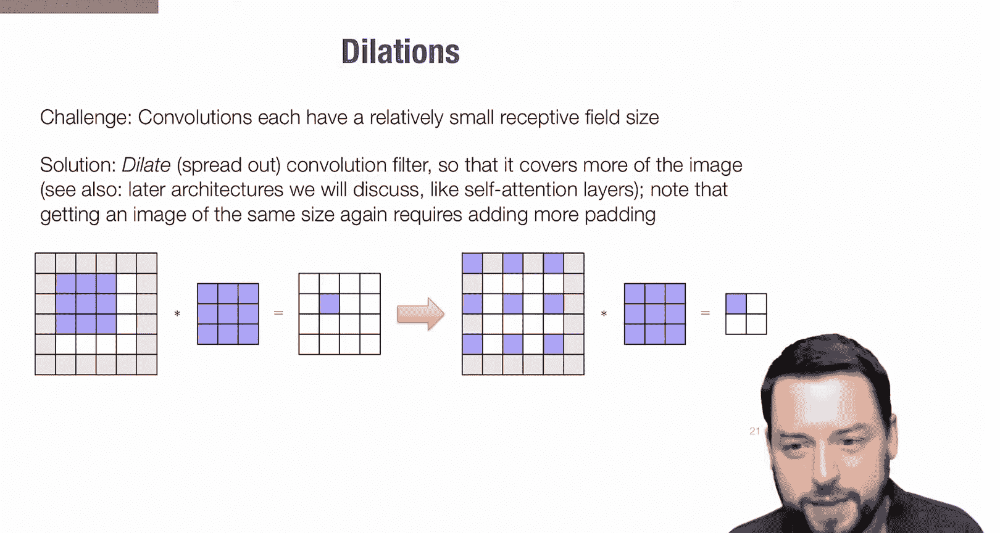

更精确的公式是：如果我的卷积滤波器是K x K，我需要在图像的所有边填充 (K - 1) / 2 个零。这实际上只适用于奇数大小的核K。我们通常不处理偶数大小的核，因为它们处理起来更麻烦，需要在一边和另一边进行不同的填充。因此，我们实际上通常处理奇数大小的核，并使用零填充，使得输出图像大小与输入图像大小相同。这是非常标准的做法。

## 卷积网络：10.7：池化与步长卷积

另一个实用要素涉及池化操作或步长卷积。这两种方法实际上是解决相同问题的两种方式。

你可能已经注意到，特别是使用零填充版本的卷积后，我们在后续层中保持与原始层相同的分辨率。这并不总是最好的做法。在许多卷积网络中，随着网络深入，我们实际上希望逐步创建越来越低的分辨率，在某种意义上表示输入更抽象的总结。这可能代表不同抽象层次的特征。

从计算角度来说，你不想在整个网络中处理256x256的图像，那会非常困难。因此，我们通常希望在网络的内部层对图像进行下采样，特别是当我们有很多通道时。因为如果你有1000个通道，对于大图像来说，表示所有通道会占用大量内存。

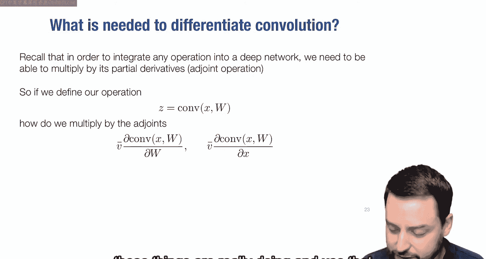

有两种常见的方法可以实现下采样。一种是某种池化操作。例如，最大池化或平均池化。你取图像中的某个块（通常是2x2块），以某种方式组合这些值，在输出中产生单个值，并进入下一个通道。最大池化操作会取这四个值中的最大值，并将其设置为输出值。平均池化则取这四个值的平均值。这两种操作在实践中都很常见。

第二种可能性是步长卷积。其思想是，通常我们取滤波器并将其应用到图像中每个可能的位置。但如果我们不是这样做，而是每次将滤波器移动超过一个位置，这也会导致输入图像的下采样。例如，步长为2的卷积将产生分辨率是输入一半的图像。

这两种操作（池化或步长卷积）都会产生输出，在这个例子中，输出在空间维度上是输入的一半大小，像素数量是四分之一。你可以使用更大的步长或更大的池化区域。这些操作在大多数网络中都非常常见，因为大多数网络出于计算和表示的原因，都希望在网络的后续层中对图像进行下采样。

## 卷积网络：10.8：分组卷积与扩张卷积

下一个你可能在卷积中看到的特性是分组。这里的挑战在于，即使有我们讨论过的卷积简化，对于大量的输入和输出通道，滤波器仍然可能有很多权重。请记住，滤波器中的每个位置都是一个矩阵，属于R^(C_in x C_out)。因此，如果输入通道数非常大，例如10,000个输入通道或1000个输出通道，即使有卷积网络的所有简化，形成一个那么大的矩阵，参数数量也可能过多。

在这种情况下，人们经常使用分组卷积。分组卷积的思想是，不是所有输入通道都导致所有输出通道，而是只有一些输入通道集合导致一些类似的输出通道集合。例如，如果你有四个输入通道和四个输出通道，也许只有前两个输入通道导致前两个输出通道。这甚至可以一直简化到逐通道卷积的情况，即每个输出通道只依赖于一个输入通道。这种极端情况（组数等于通道数）有时被称为深度可分离卷积，它们正变得越来越流行。这些方法是在正常卷积参数仍然过多时，减少卷积参数数量的常见方式。

最后一个要讨论的是扩张卷积。扩张卷积解决了卷积的最后一个问题，尽管我要说它们曾经非常流行，但现在我看到它们用得少了一些。我认为人们现在倾向于使用更多像拼接补丁这样的方法（我们讨论Transformer时会更多谈到）。

卷积的一个问题是，特别是当你有小的核大小时（例如3x3滤波器），卷积的感受野相对有限。我的意思是，这个位置只依赖于输入图像中的这三个位置。我最初将其宣传为一个优势，即卷积捕捉局部效应。但现实是，这也有缺点。你可能不希望总是这样，你可能希望你的卷积有更大的感受野，这样即使是单个层也能捕捉输入（或前一层）的更多属性，或者捕捉输入的更大空间属性。

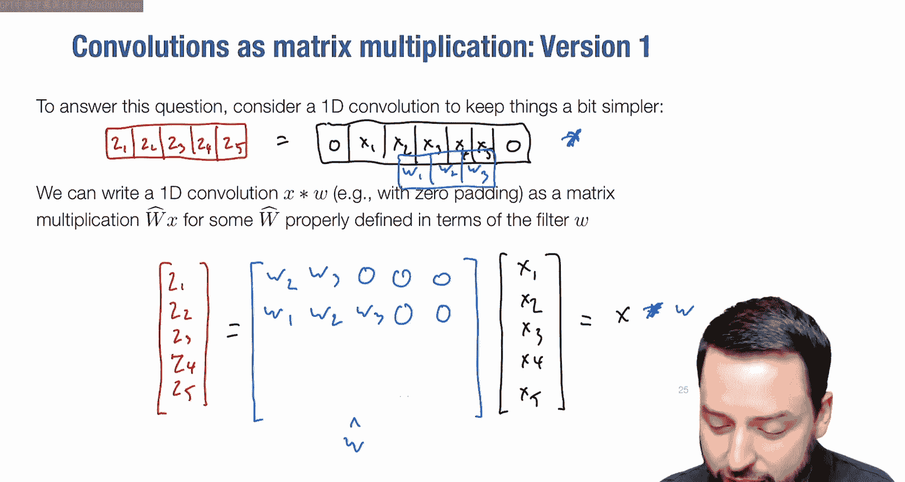

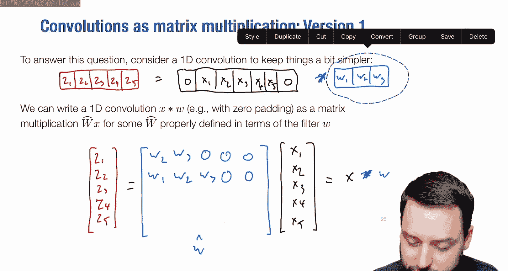

你可以通过多种方式实现这一点，但一个非常简单且效果很好的方法是添加扩张因子。基本上，你使用相同的滤波器大小，但不是将其应用于连续的组，而是将其“展开”应用。你将滤波器相乘的点以某个扩张因子展开。例如，扩张因子为2的3x3滤波器可以捕捉输入更多的空间属性。

但需要注意的是，如果你只是这样做，你会遇到与之前类似的填充问题。例如，使用相同的零填充，你只能在一个2x2的位置滑动这个卷积，总共四个位置，因此会产生一个2x2的图像。为了获得相同大小的输出，你必须添加更多的零填充。

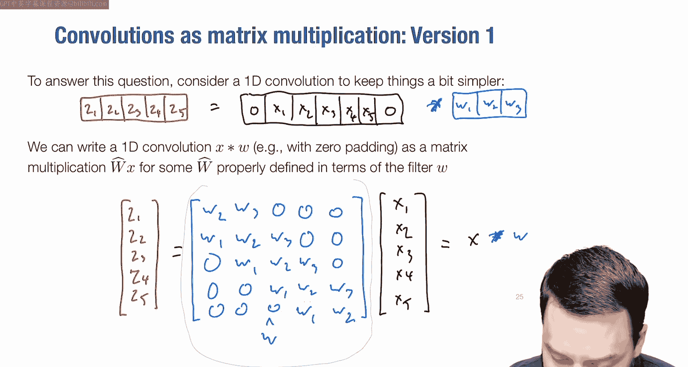

## 卷积网络：10.9：卷积的微分

最后，我们将以讨论卷积的微分来结束本讲座。我们如何将这些操作整合到自动微分工具中？

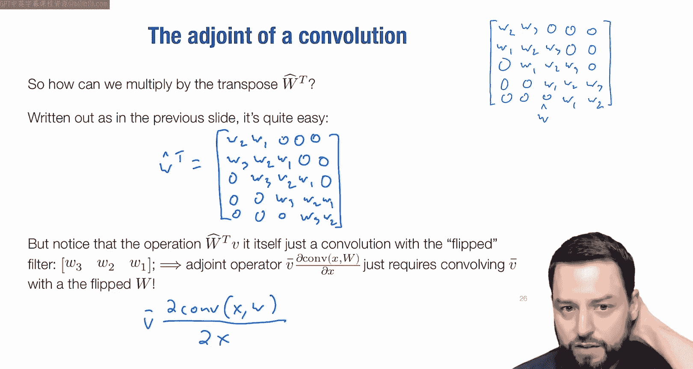

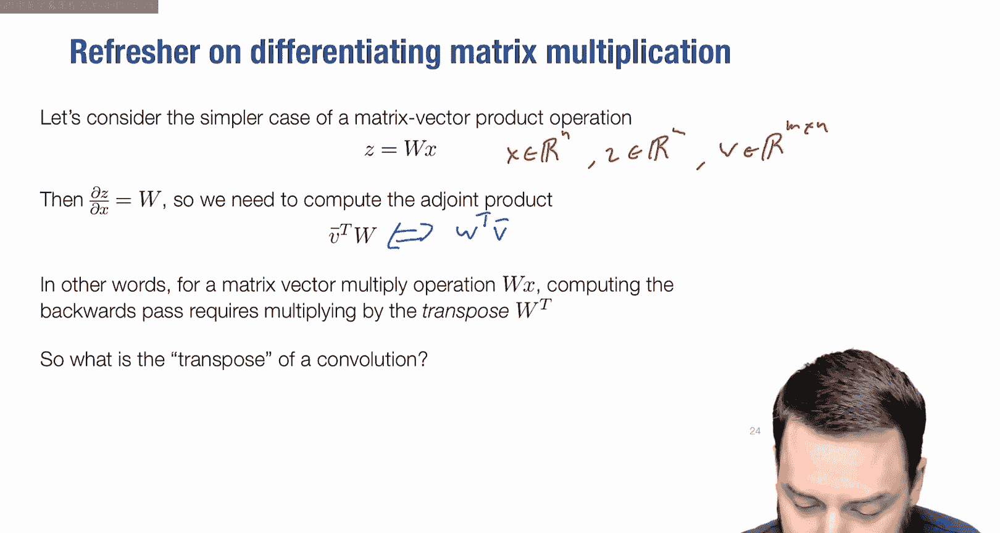

首先，我要说的是，根据你现在所知道的，你其实已经可以实现卷积了。事实上，如果你以最有效的方式实现（例如，每次用一个滤波器乘以每个输入，然后适当地移动），这并不是一个糟糕的实现卷积的方法。但有一个很大的缺点，因为自动微分工具包的原因。最终，卷积可以归结为矩阵向量乘法（当然，一切都归结为乘法和加法）。你可以通过一堆矩阵向量乘积（或矩阵矩阵乘积，在批处理设置中）来减少卷积运算。

但我们不想这样做，因为如果你这样做，你会在计算图中保留大量重复的中间乘积，然后才将它们相加，这会在计算图中消耗过多内存。因此，重要的是将卷积作为自动微分工具包中的原子操作来实现。

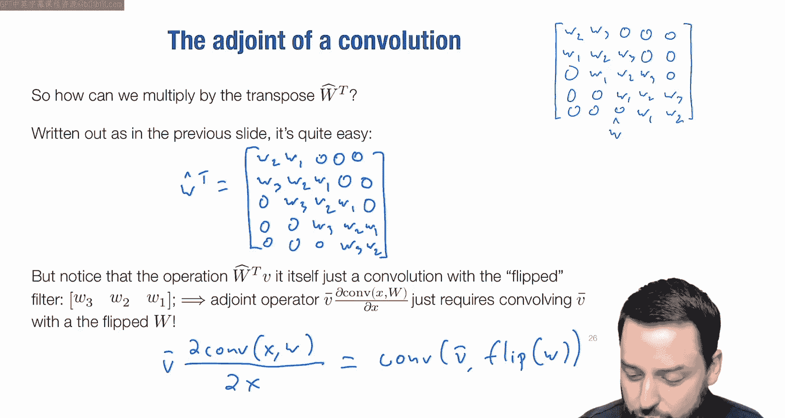

这意味着我们需要能够对它们进行微分。我们需要将它们作为Needle中的操作（op）来实现，而不是作为模块。如果我们要将卷积实现为一个操作符，我们需要知道如何计算它们（这部分已经涵盖），也需要知道如何计算它们的梯度，或者换句话说，如何计算所需的伴随矩阵。

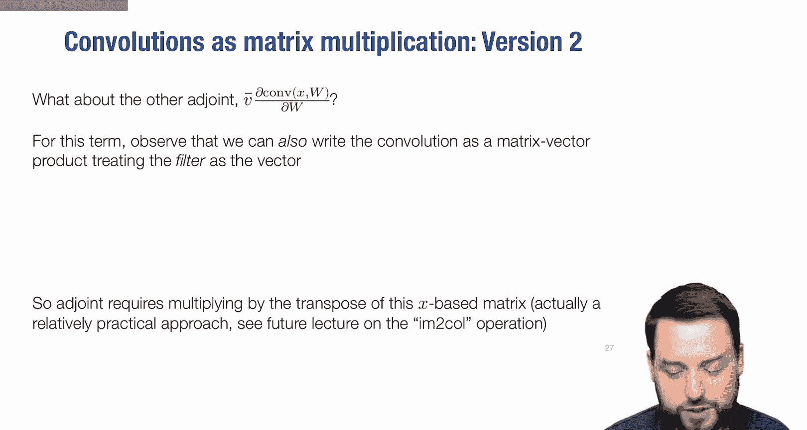

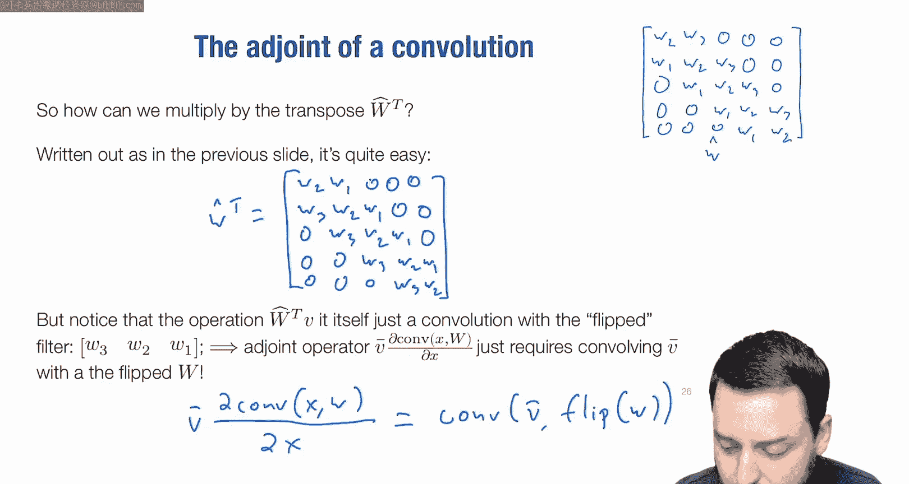

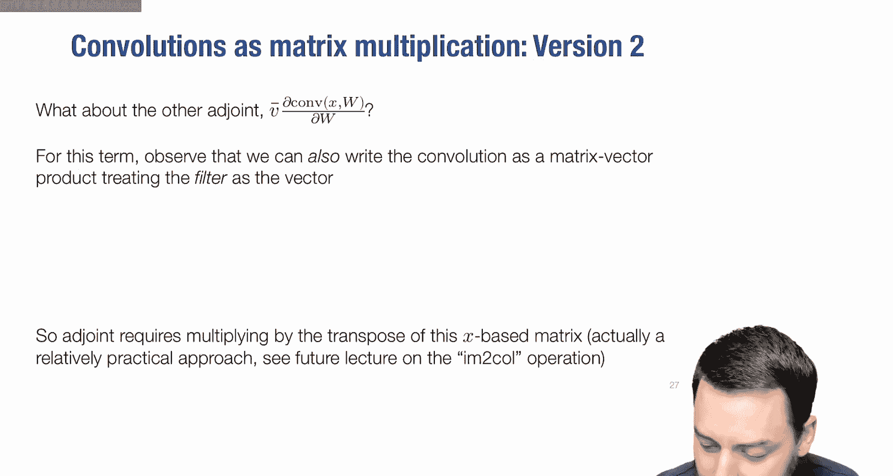

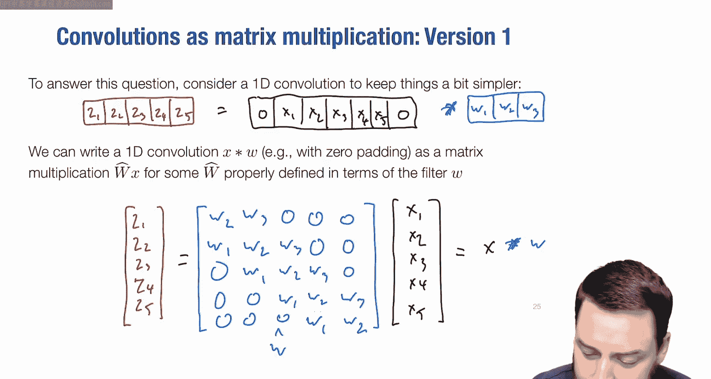

基本问题在于，如果我们定义我们的操作符为 Z = 某个卷积(X, W)，其中Z是三维张量，X也是三维张量（高度 x 宽度 x 通道），W是四维张量（所有滤波器位置 x 输入通道 x 输出通道）。当我们想要进行微分时，我们需要能够对它的两个输入（权重W或输入X）中的任何一个进行微分。

如何做到这一点？乍一看，这似乎相当复杂。我们不想逐项计算，而是想从概念上思考这些操作真正在做什么，并以此作为计算这些属性的方式。

为了说明这一点，我将考虑矩阵向量乘积的情况。记住，在矩阵向量乘积中，如果我们的前向传播乘以某个算子，我们的反向传播必须乘以该算子的转置。这就是关键点。

那么，卷积的转置等价于什么？为了回答这个问题，我们将把卷积写成矩阵运算的形式。我将考虑一个简化的情况：一维卷积，因为这样更容易展示。但很明显，这将扩展到二维情况。

考虑一个情况，我们想创建一个包含5个元素的输出向量：Z1, Z2, Z3, Z4, Z5。这等于我们的输入X（假设进行了零填充）与一个三维权重向量[W1, W2, W3]的卷积。

我将把这个运算写成矩阵等价运算。我将把X视为一个向量（只是X的实际元素），并创建一个矩阵，使得Z的向量表示等于这个矩阵乘以X的向量表示。也就是说，[Z1, Z2, Z3, Z4, Z5]^T = Ŵ * [x1, x2, x3, x4, x5]^T。

这个矩阵Ŵ是什么？我们需要填充它以使其有效。让我们思考一下：为了产生Z1，我们取滤波器并将其放在这里。我们乘以0 * W1，x1 * W2，x2 * W3。所以，第一行将是 [0, W2, W3, 0, 0]。对于Z2，我们滑动滤波器：x1 * W1, x2 * W2, x3 * W3。所以第二行是 [W1, W2, W3, 0, 0]。依此类推，我们可以填充整个矩阵。这个矩阵运算产生的输出与我们的卷积完全相同。它是表示卷积的一种矩阵方式。

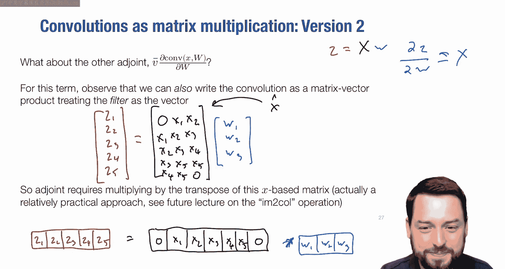

关键思想是：当我们