# 11：硬件加速

在本节课中，我们将要学习硬件加速技术。我们将探讨如何利用对硬件的理解来优化深度学习系统中的张量运算库，特别是矩阵乘法。我们将从通用加速技术开始，然后深入研究一个矩阵乘法的优化案例。

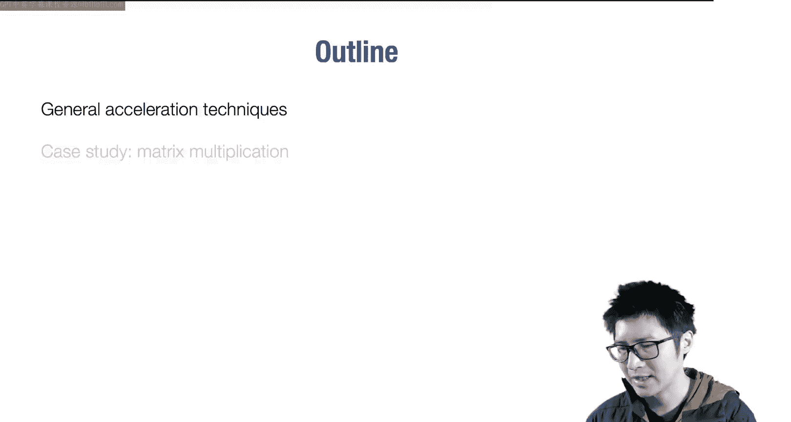

## 通用加速技术

上一节我们介绍了课程的目标。本节中，我们来看看一些通用的硬件加速技术。

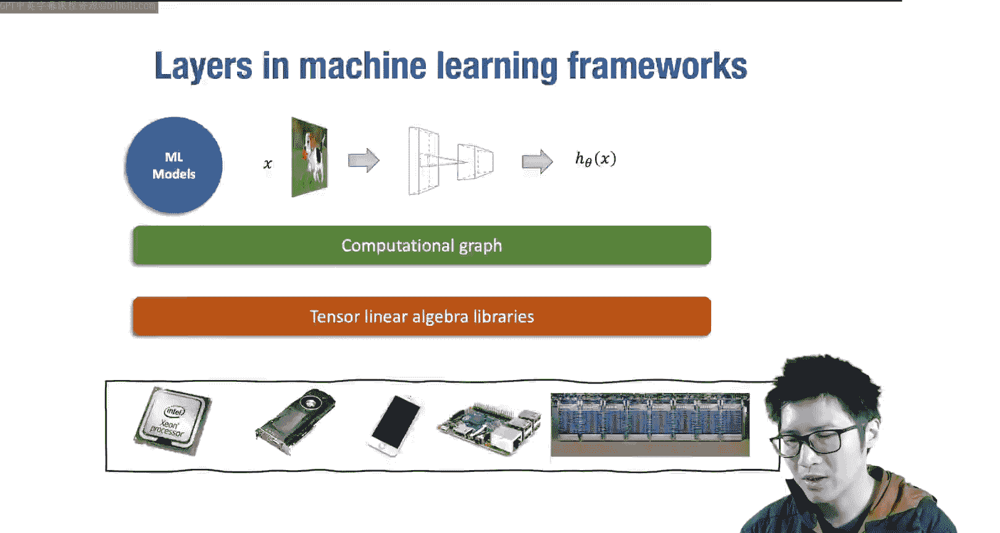

大多数深度学习框架（包括我们的Needle库）都可以分为两层。高层是计算图和线性代数抽象层，它负责构建计算历史并计算梯度。底层是张量线性代数库，它负责创建具体的多维数组并执行算术运算。为了在不同的硬件环境（如CPU、GPU）上高效运行，我们需要优化这些底层库的实现。

### 向量化

第一个要介绍的技术是向量化。当我们编写代码时，例如将两个长度为256的向量相加，最简单的方法是使用标量循环。然而，现代硬件通常有向量寄存器和指令，可以一次性加载、运算和存储连续内存中的数据块。

以下是向量化的伪代码示例：
```c
// 标量版本
for (int i = 0; i < 256; i++) {
    c[i] = a[i] + b[i];
}

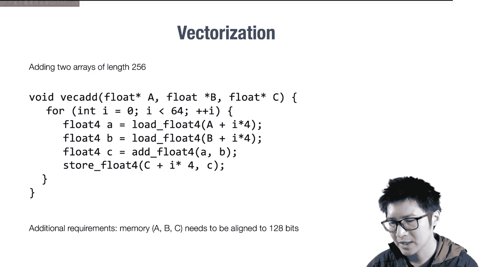

// 向量化版本（假设向量长度为4）
for (int i = 0; i < 256; i += 4) {
    // 加载4个浮点数到向量寄存器
    vec4 va = load_vec4(&a[i]);
    vec4 vb = load_vec4(&b[i]);
    // 向量加法
    vec4 vc = add_vec4(va, vb);
    // 存储结果
    store_vec4(&c[i], vc);
}
```
为了执行这种向量加载和存储，通常要求内存地址是对齐的（例如，16字节对齐）。这意味着在分配内存时，我们需要使用对齐的内存分配函数，而不是标准的`malloc`。

### 数据布局

接下来，我们讨论数据布局。当我们在内存中存储多维矩阵时，需要决定如何将多维索引映射到一维的线性地址空间。

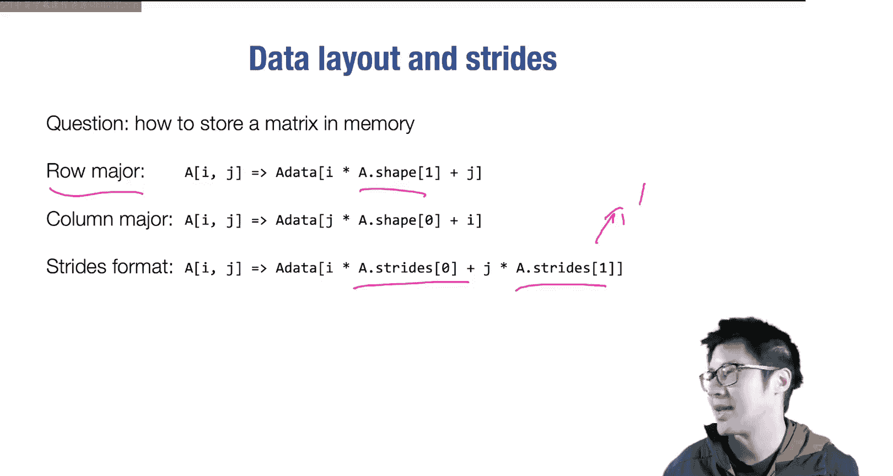

对于一个2x3的矩阵，有两种主要存储方式：
*   **行主序**：按行存储元素。索引`A[i][j]`映射到`i * 3 + j`。这是C/C++等语言的默认方式。
*   **列主序**：按列存储元素。索引`A[i][j]`映射到`j * 2 + i`。这是Fortran等语言的惯例。

更通用的方式是使用**步幅**。步幅数组指定了在每个维度上索引增加1时，内存地址需要跳过的字节数。

对于一个N维数组`A[i0][i1]...[iN-1]`，其内存地址可以计算为：
`address = base_address + sum(ik * stride[k]) for k in 0..N-1`

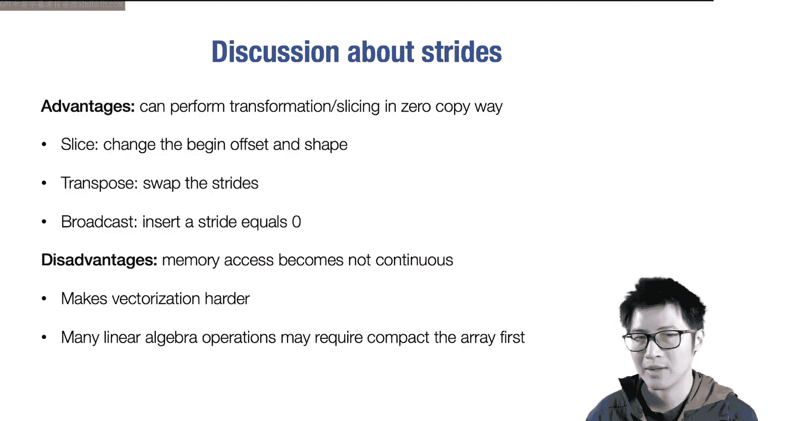

以下是步幅的优势：
*   它比固定的行/列主序更通用，可以通过设置步幅来模拟这两种格式。
*   它允许在不复制底层数据的情况下进行布局变换，例如调整大小、转置和广播。

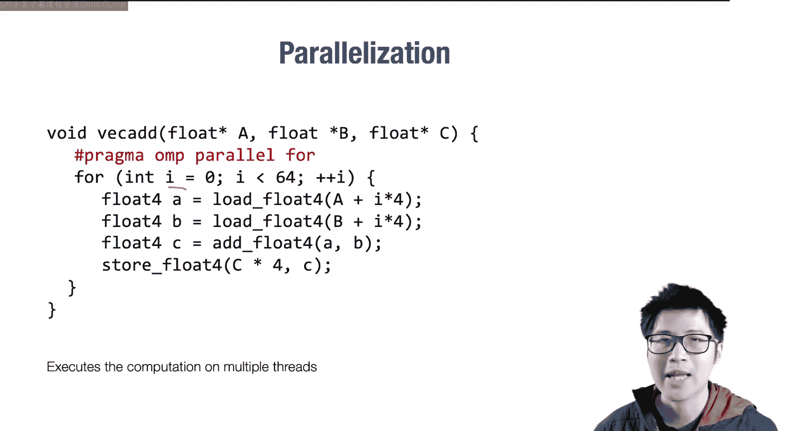

然而，引入步幅的一个问题是，如果步幅设置不当，可能导致内存访问不连续，这使得向量化变得困难。因此，许多线性代数库在执行运算前，会检查数组是否是紧凑的，如果不是，则会先将其转换为紧凑格式。

### 并行化

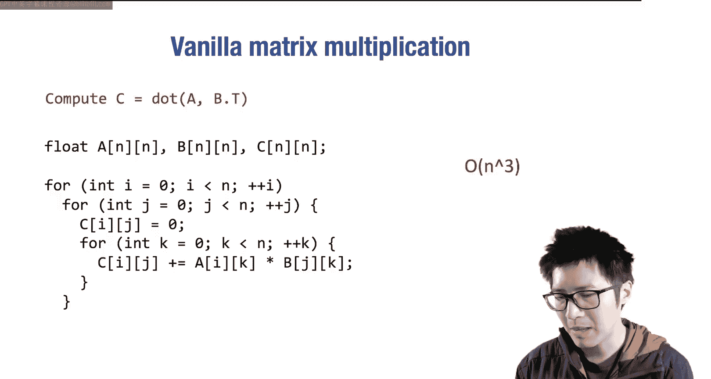

另一个重要的技术是并行化。我们可以利用多核CPU，将循环迭代分配到不同的处理器核心上同时执行。

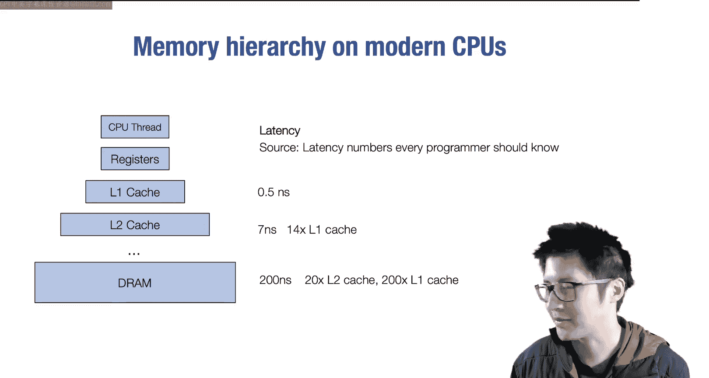

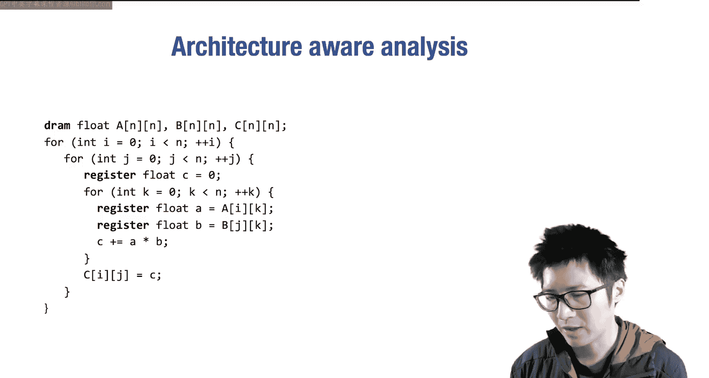

以下是使用OpenMP进行并行化的示例：
```c
#pragma omp parallel for
for (int i = 0; i < n; i++) {
    c[i] = a[i] + b[i];
}
```

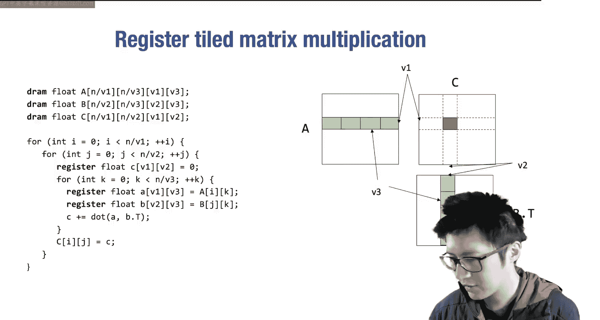

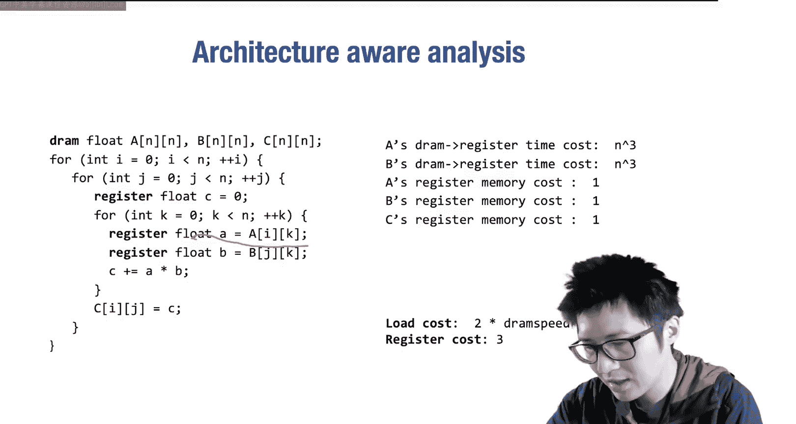

## 案例研究：加速矩阵乘法

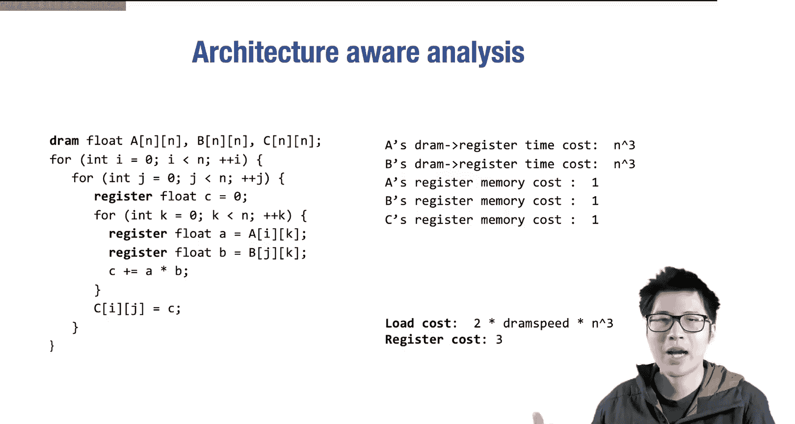

在介绍了通用技术后，我们进入一个具体的案例研究：如何加速矩阵乘法。

### 朴素实现与分析

首先，回顾一下矩阵乘法`C = A @ B.T`的朴素实现。其计算复杂度为O(N³)。

然而，仅仅分析算术操作次数是不够的。我们需要考虑**内存层次结构**。数据在不同层级内存（如DRAM、L1缓存）中移动的成本差异巨大（可达200倍）。因此，优化的关键之一是减少从慢速内存（如DRAM）加载数据的次数，并尽可能让数据停留在快速内存（如缓存、寄存器）中被重复使用。

### 寄存器分块优化

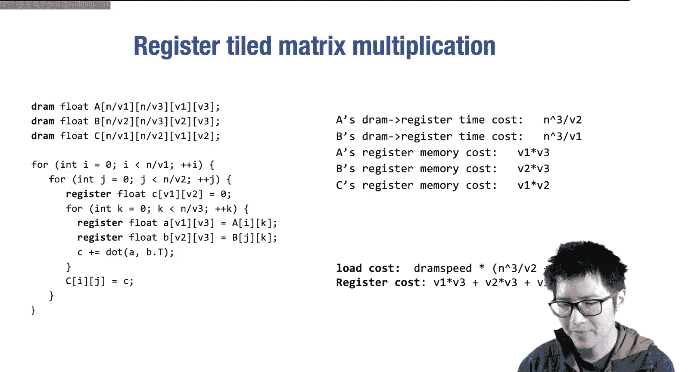

第一种优化技术是**寄存器分块**。其核心思想不是一次计算一个输出元素，而是计算一个小块（例如V1 x V2），并在寄存器中保留这个中间结果。

以下是寄存器分块优化的伪代码思路：
```c
// 假设我们计算 V1 x V2 的输出子块
for (int i = 0; i < n; i += V1) {
    for (int j = 0; j < n; j += V2) {
        // 在寄存器中初始化 V1 x V2 的子矩阵 C_sub
        register C_sub[V1][V2] = {0};
        for (int k = 0; k < n; k++) {
            // 加载 A 的一个 V1 x 1 列片段和 B 的一个 V2 x 1 列片段
            register A_frag[V1];
            register B_frag[V2];
            // ... 加载数据到寄存器 ...
            // 进行外积运算，累加到 C_sub
            for (int vi = 0; vi < V1; vi++) {
                for (int vj = 0; vj < V2; vj++) {
                    C_sub[vi][vj] += A_frag[vi] * B_frag[vj];
                }
            }
        }
        // 将 C_sub 写回全局内存 C
    }
}
```
通过分析可以发现，经过分块后，数据加载次数从大约`2N³`次减少到大约`N³/V1 + N³/V2`次。这是因为加载到寄存器的A数据被重用了V2次，B数据被重用了V1次。我们选择V1和V2时，需要在减少加载次数和不超过寄存器总数限制之间取得平衡。

### 结合缓存分块

现代CPU还有多级缓存。我们可以引入另一级分块（例如B1 x B2），先将数据从DRAM加载到L1缓存，再从L1缓存加载到寄存器进行计算。

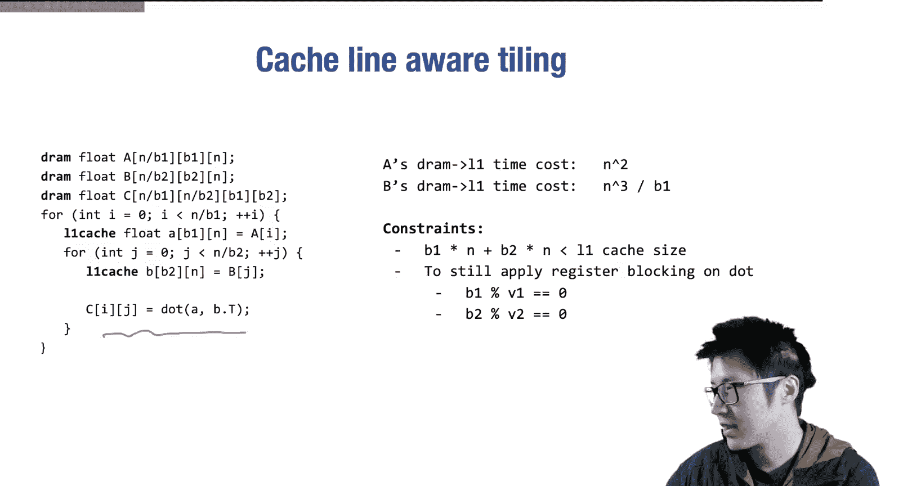

以下是结合了缓存分块和寄存器分块的多层优化思路：
```c
for (int i_o = 0; i_o < n; i_o += B1) { // 外层循环，缓存块行
    for (int j_o = 0; j_o < n; j_o += B2) { // 外层循环，缓存块列
        // 1. 将 A 的一个 B1 x n 行块加载到 L1 缓存 (A_cache)
        // 2. 将 B 的一个 B2 x n 行块加载到 L1 缓存 (B_cache)
        for (int i_i = 0; i_i < B1; i_i += V1) { // 内层循环，寄存器块行
            for (int j_i = 0; j_i < B2; j_i += V2) { // 内层循环，寄存器块列
                // 从 A_cache 和 B_cache 加载 V1 x 1 和 V2 x 1 片段到寄存器
                // 执行寄存器级别的外积计算并累加
            }
        }
        // 将最终结果写回 C
    }
}
```
这种多层分块策略进一步减少了从DRAM的加载次数。A的整个行块`(B1 x n)`只需加载一次，然后在内部循环中重复用于计算该行块与B的不同列块的结果。同样，B的列块`(B2 x n)`也只需加载一次。

### 理解数据复用模式

优化的本质在于识别和利用**数据复用机会**。观察矩阵乘法的计算表达式：`C[i][j] = sum_k A[i][k] * B[j][k]`。

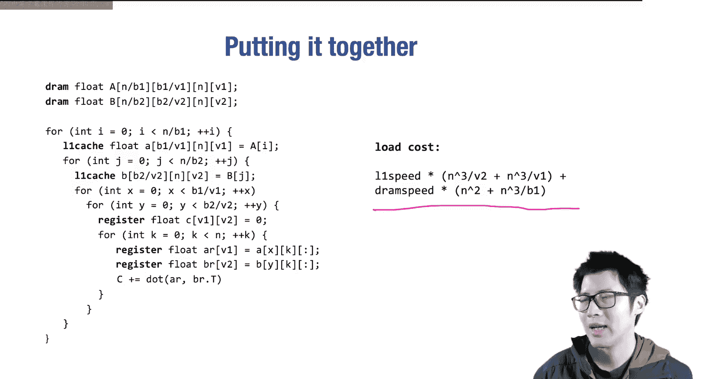

*   对于A中的元素`A[i][k]`，其索引**不依赖于**`j`。这意味着当我们沿`j`维度进行分块计算时，同一个`A[i][k]`可以被复用多次（V2次）。
*   同理，对于B中的元素`B[j][k]`，其索引**不依赖于**`i`，可以被复用V1次。

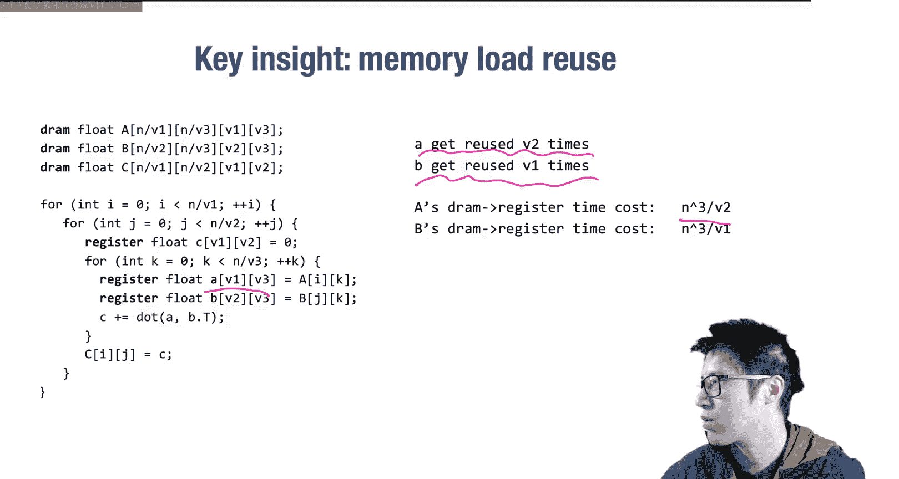

因此，优化的关键就是通过循环分块和重排，使得加载到快速存储单元（缓存、寄存器）的数据能够在其被换出之前，被尽可能多地重复使用。

## 总结

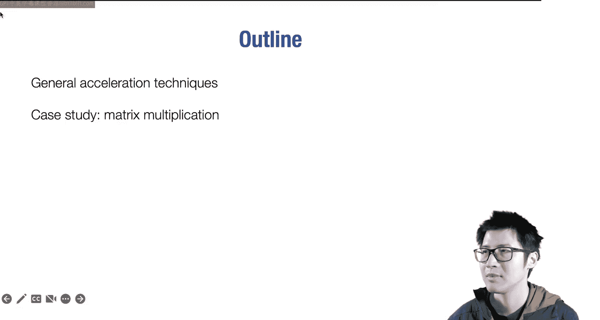

本节课中我们一起学习了硬件加速的基础知识。我们首先回顾了向量化、数据布局和并行化等通用加速技术。然后，我们深入研究了如何优化矩阵乘法这一核心运算。通过引入寄存器分块和缓存分块等多层优化策略，并利用对内存层次结构和数据复用模式的分析，我们可以显著减少慢速内存访问，从而大幅提升计算效率。理解这些底层原理，将帮助我们更好地使用和开发高性能的机器学习库。