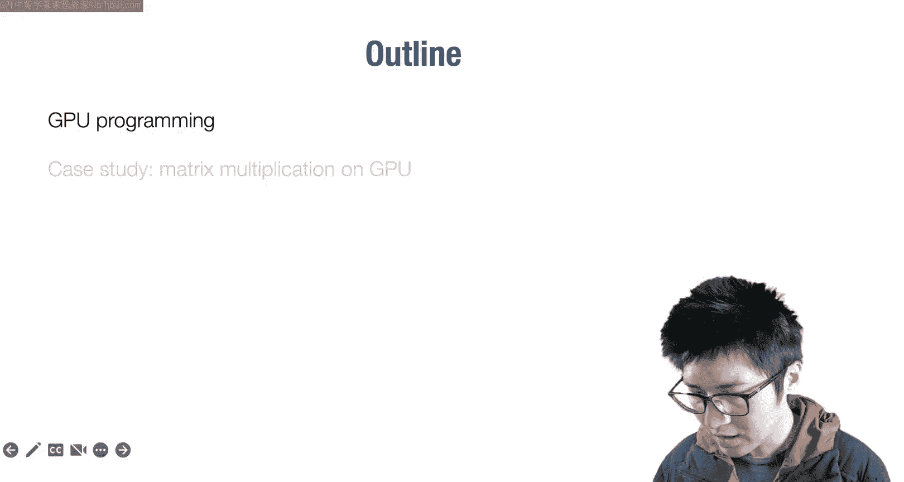
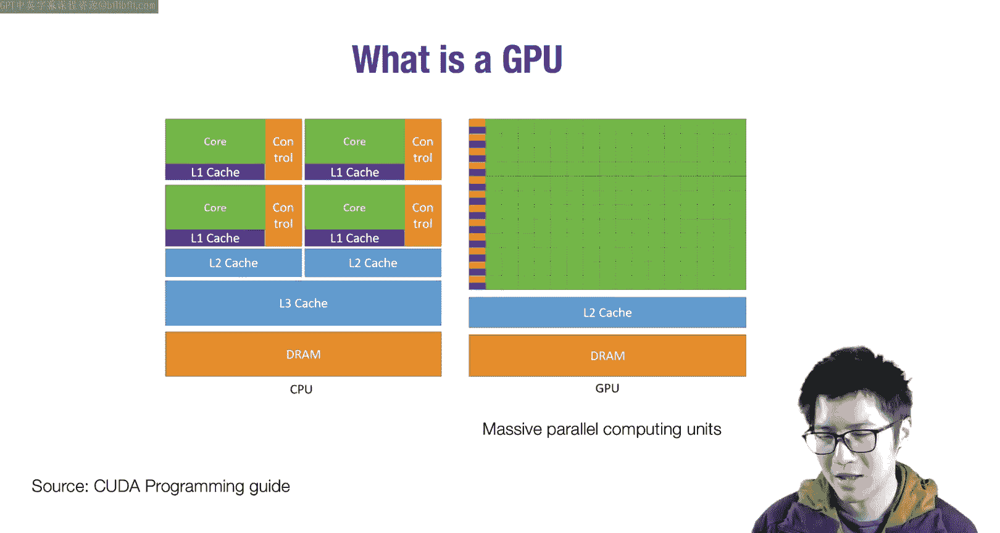
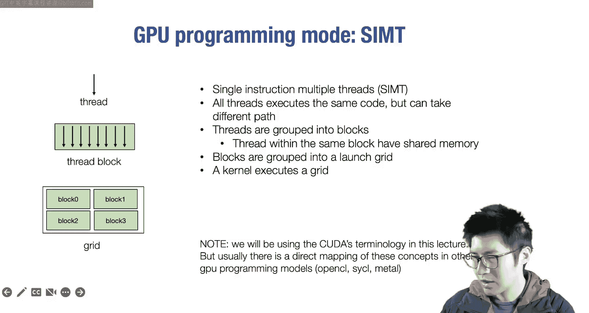
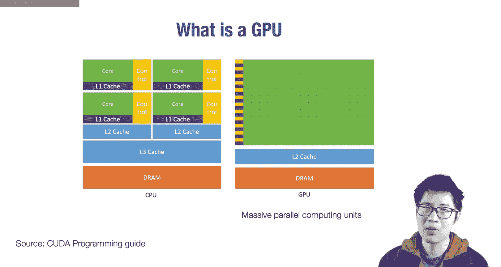
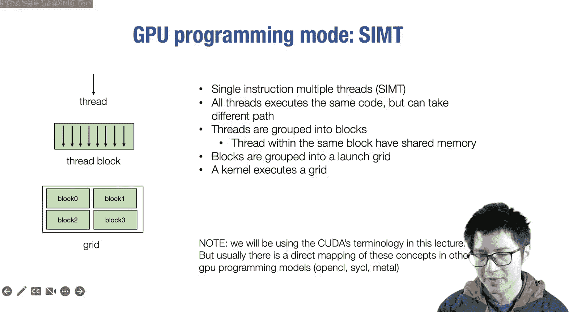
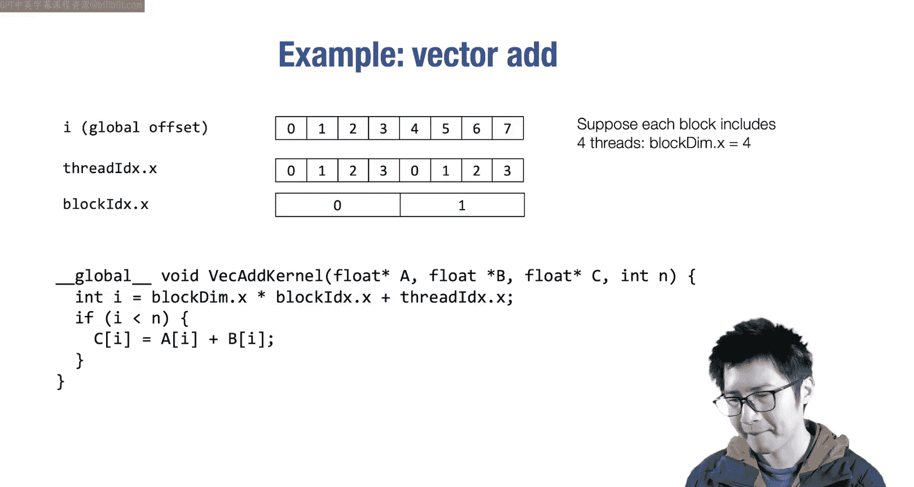
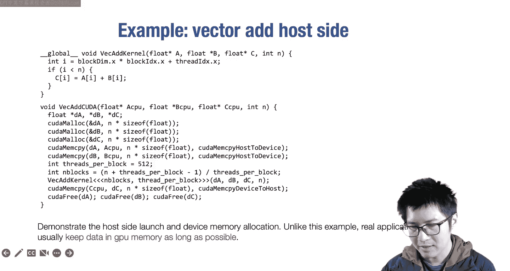
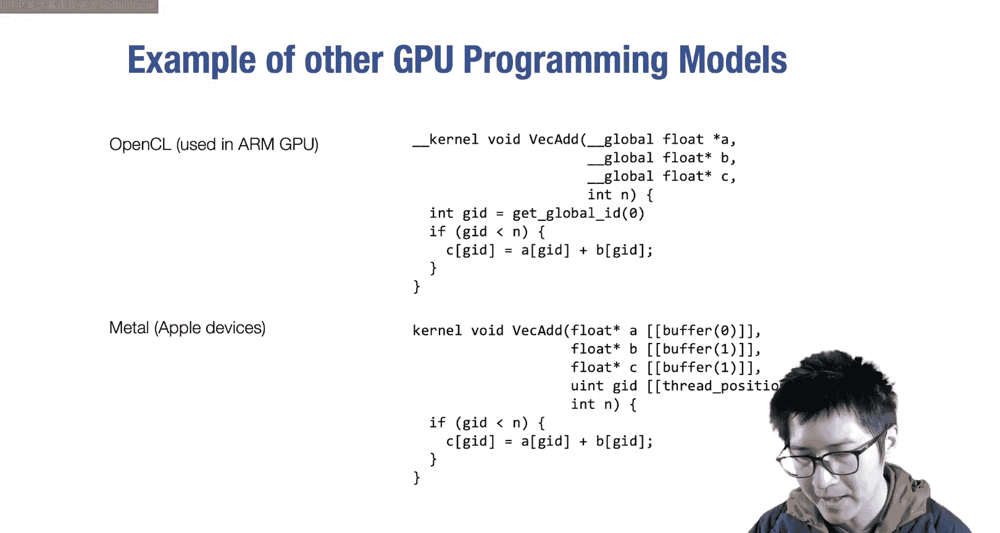
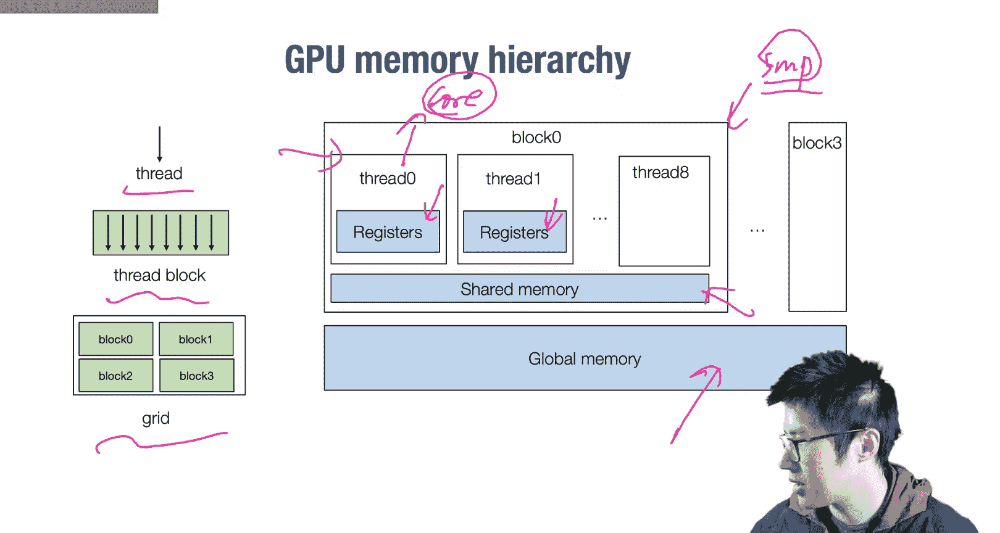
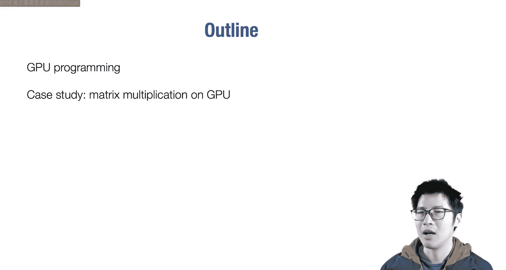

# 12：GPU加速

在本节课中，我们将学习GPU加速的基础知识。我们将首先从高层次概述GPU编程模型，然后通过一个矩阵乘法的案例研究，探讨如何利用GPU的特性来加速计算。



---

## 第一部分：GPU编程概述

上一节我们介绍了如何利用CPU上的内存层次结构来加速线性代数运算。本节中，我们来看看如何利用GPU进行加速。

### 什么是GPU？

在并行计算中，我们最熟悉的是通用处理器，例如多核CPU。通用处理器的关键特性在于其控制单元的灵活性，每个核心可以独立执行不同的任务。

然而，在图形渲染等领域，我们经常需要对大量数据执行相同的操作。这催生了不同的硬件架构，即GPU架构。GPU拥有大量用于密集算术运算的计算单元（“士兵”），但由相对较少的控制单元（“指挥官”）统一指挥。因此，GPU擅长执行大量相似的任务，即数据并行计算。

### 为什么需要GPU编程？





在深度学习早期，尝试在CPU上运行最先进的模型可能需要数周时间。切换到GPU后，这个时间缩短到了几个小时。这是因为GPU将更多资源分配给了计算单元，并要求所有单元执行相似的操作，从而通常能带来超过10倍甚至100倍的加速。如今，GPU是几乎所有深度学习工作负载的核心动力。

### GPU编程模型



我们以NVIDIA CUDA作为主要编程模型进行介绍，但其概念与其他模型（如OpenCL、SYCL、Metal）有直接对应关系。

GPU编程模型的核心是**单指令多线程**。我们指定一个线程将要执行的代码，所有线程都执行相同的代码。每个线程的区别在于其上下文，特别是其线程ID和位置。

线程被组织成**线程块**，同一块内的线程可以共享某些资源（如共享内存）。所有线程块再组成一个**启动网格**。当我们启动一个GPU内核时，实际上就是启动了这个包含多个线程块的网格。

这种模型包含两级层次结构：线程块是第一级，启动网格是第二级。



### 一个简单的CUDA示例：向量加法

假设我们要执行向量加法：`C[i] = A[i] + B[i]`。

在CPU上，我们会写一个循环：
```c
for (int i = 0; i < n; ++i) {
    C[i] = A[i] + B[i];
}
```
在GPU上，我们启动与数组元素数量相当（或更多）的线程。每个线程计算自己的全局索引，然后仅执行对应一个元素的计算。

以下是CUDA内核代码的关键部分：
```c
__global__ void vector_add(float *A, float *B, float *C, int n) {
    int i = blockIdx.x * blockDim.x + threadIdx.x; // 计算全局索引
    if (i < n) {
        C[i] = A[i] + B[i]; // 每个线程处理一个元素
    }
}
```
*   `threadIdx.x`: 线程在线程块内的索引。
*   `blockIdx.x`: 线程块在网格中的索引。
*   `blockDim.x`: 每个线程块中的线程数量。

这个计算给出了该线程所见的全局索引。每个线程只加载A和B的一个元素，执行加法，然后将结果存回C。

我们可以将其可视化：假设每个线程块包含4个线程，我们启动2个线程块，总共8个线程。通过上述公式，每个线程会得到唯一的全局索引（0到7），从而各自处理向量中的一个元素。

所有线程启动相同的代码片段（单指令），但由于它们的`threadIdx`和`blockIdx`不同，因此执行代码中的不同路径（多线程）。这样，我们将原始顺序CPU代码的工作分配到了不同的线程上。

这种转换之所以简单，是因为每个`C[i]`的计算都独立于其他`C[j]`，这是一个**数据并行**程序。如果计算中存在依赖关系（例如 `C[i] = max(C[i-1], A[i])`），并行化会更具挑战性。



### 主机端代码流程

要实际运行这个程序，我们还需要主机端（CPU）代码来启动内核。

典型的工作流程如下：
1.  **分配GPU内存**：在GPU DRAM上为数据分配空间。
2.  **拷贝数据**：将数据从主机内存复制到GPU内存。
3.  **启动内核**：计算所需的线程块和线程数量，然后启动CUDA内核。
4.  **拷贝回结果**：将计算结果从GPU内存复制回主机内存。
5.  **验证**：在CPU上验证结果的正确性。

一个常见的初学者错误是频繁在CPU和GPU之间拷贝数据。PCIe总线可能成为瓶颈。在实际应用中，我们应尽可能让数据驻留在GPU内存中，只在必要时进行传输，从而最大化GPU的计算效率。

### 其他编程模型

其他GPU编程模型（如用于Arm GPU的OpenCL和用于Apple设备的Metal）在概念上非常相似，主要区别在于关键字。例如，用于表示全局内存和全局索引的注解可能不同，但基本结构和思想是一致的。

---



## 第二部分：深入GPU内存层次与共享内存

现在我们已经初步了解了GPU编程，让我们更深入地探讨一些细节，特别是GPU的内存层次结构。



GPU包含两级线程层次结构，这对应于其硬件结构。线程块被映射到**流多处理器**上，而单个线程则被映射到SM内的计算核心上。

GPU内存层次包括：
*   **全局内存**：通过`cudaMalloc`分配的大容量、高延迟内存。
*   **共享内存**：每个流多处理器上的一块较小、低延迟内存，由同一线程块内的所有线程共享。
*   **寄存器**：每个线程私有的最快内存。

### 共享内存案例：滑动窗口求和



让我们看一个稍复杂的例子：对大小为5的滑动窗口进行求和。这可以看作是一维卷积的简化版。

最直接的方法是将每个输出元素分配给一个线程，每个线程加载5个输入元素进行计算。但这并不高效，因为相邻线程加载的输入数据有大量重叠。

更高效的方法是使用**共享内存**。思路如下：
1.  分配一块共享内存。
2.  让一个线程块内的所有线程**协作**将所需的输入数据取到共享内存中。
3.  同步所有线程，确保数据加载完成。
4.  每个线程再从共享内存中读取数据进行计算。

例如，一个包含4个线程的块要计算4个输出，需要8个输入元素。通过协作，每个线程只需加载2个元素到共享内存，然后所有线程都可以从共享内存访问全部8个元素。与每个线程独立加载5次相比，这减少了内存加载次数。

这种方法的关键优势在于利用了线程间的**内存加载重用**。我们使用共享内存存储临时数据，然后从中读取以进行后续计算，这是GPU加速中非常常见的技术。

**第一部分小结**：
1.  GPU编程模型采用两级线程层次结构：启动网格和线程块。
2.  为了利用共享内存，我们需要协作将公共数据取到共享内存中，以增加不同线程间的内存重用。

---

## 案例研究：GPU上的矩阵乘法

现在，让我们将学到的知识应用于一个具体案例：在GPU上加速矩阵乘法。我们以转置矩阵乘法为例：`C[i][j] = sum_k (A[k][i] * B[k][j])`。

### 第一级优化：寄存器分块

我们首先应用上一节课学到的**寄存器分块**技术。
1.  为子矩阵（大小为 `V x V`）分配寄存器存储 `C_sub`，以及临时寄存器 `A_reg` 和 `B_reg`。
2.  在循环中，从全局内存加载 `A` 和 `B` 的一个条带数据到寄存器。
3.  执行内积运算：通过嵌套循环计算 `C_sub[y][x] += A_reg[y] * B_reg[x]`。
4.  将结果存回全局内存。

通过将 `A` 和 `B` 在寄存器维度上分块（因子为 `V`），`A` 的每个元素被重用了 `V` 次。这增加了内存重用，减轻了内存带宽瓶颈。

### 第二级优化：共享内存分块

由于GPU具有两级内存层次，我们还可以进行**共享内存分块**，以实现线程块内线程间的重用。
1.  假设一个线程块计算一个 `L x L` 的子矩阵。每个线程仍然计算 `V x V` 的子区域。
2.  我们需要将计算这个 `L x L` 区域所需的 `A` 和 `B` 的数据块加载到共享内存中。
3.  协作加载：线程块内的所有线程共同将所需数据从全局内存取到共享内存。
4.  然后，每个线程再从共享内存加载数据到寄存器，执行寄存器分块矩阵乘法。
5.  最后，将结果写回全局内存。

这样，我们获得了两种内存重用：
*   **全局内存到共享内存的重用**：因子为 `L`，因为加载到共享内存的数据被线程块内的多个线程共享。
*   **共享内存到寄存器的重用**：因子为 `V`，源于寄存器分块。

通过仔细选择 `L` 和 `V` 的值，我们可以获得相当高效的GPU实现。

### 参数选择与权衡

选择 `L` 和 `V` 的值是一个复杂的问题，涉及多个因素的权衡：
*   **寄存器数量 vs 并行度**：每个线程使用更多寄存器可以减少内存访问，但受限于每个流多处理器的寄存器总量，这会导致能同时驻留的线程数减少，降低并行度和上下文切换能力（有助于隐藏内存延迟）。
*   **共享内存大小 vs 线程块数量**：使用更大的共享内存块可以增加重用，但会减少能同时驻留在同一个SM上的线程块数量，同样可能影响并行度。

一种常见的方法是使用**自动调优**：尝试不同的 `L` 和 `V` 组合，根据实际性能结果选择最佳配置。

### 协作加载的实现

为了实现共享内存分块，我们需要编写**协作加载**代码。线程块中的每个线程负责加载所需数据的一部分，所有线程共同完成将整个数据块取到共享内存的任务。这意味着一个线程加载的数据可能也被其他线程需要。

### 更多优化技术

除了寄存器分块和共享内存分块，还有许多其他GPU编程技术可以进一步加速代码：
*   **合并内存访问**：确保线程块内的线程从连续的全局内存地址读取数据，以获得更高的内存带宽利用率。
*   **避免共享内存体冲突**：确保线程访问共享内存的不同“体”，以允许并行访问。
*   **软件流水线**：重叠数据加载和计算操作，以隐藏内存延迟。
*   **Warp级优化**：利用Warp（通常是32个线程的一组）执行集体操作。
*   **Tensor Core**：利用现代GPU上的专用矩阵计算单元。

要深入了解这些技术，可以参考CUDA编程指南和丰富的在线资料。

---

## 总结

本节课我们一起学习了GPU加速的基础知识。
1.  我们首先了解了GPU与CPU在设计哲学上的区别：GPU通过大量计算单元执行相似任务来获得高吞吐量。
2.  我们介绍了CUDA编程模型的核心概念：单指令多线程、线程块、网格以及共享内存。
3.  通过向量加法和滑动窗口求和的例子，我们学习了如何编写基本的GPU内核以及如何利用共享内存进行优化。
4.  在案例研究中，我们探讨了如何通过寄存器分块和共享内存分块这两级优化来高效实现GPU上的矩阵乘法，并讨论了参数选择的权衡。



本节课作为入门材料，帮助你开启了GPU编程的大门。在接下来的课程中，我们将深入探讨性能加速库的实现细节。