# 15：训练大型模型 🚀

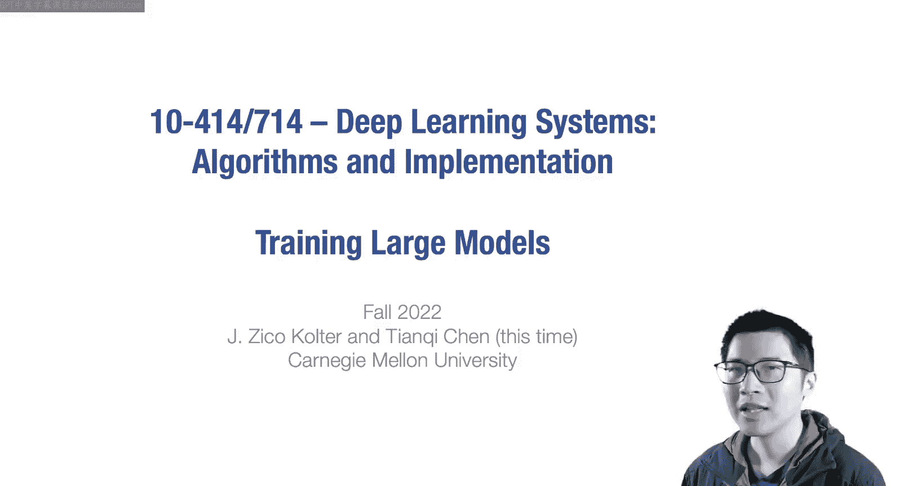

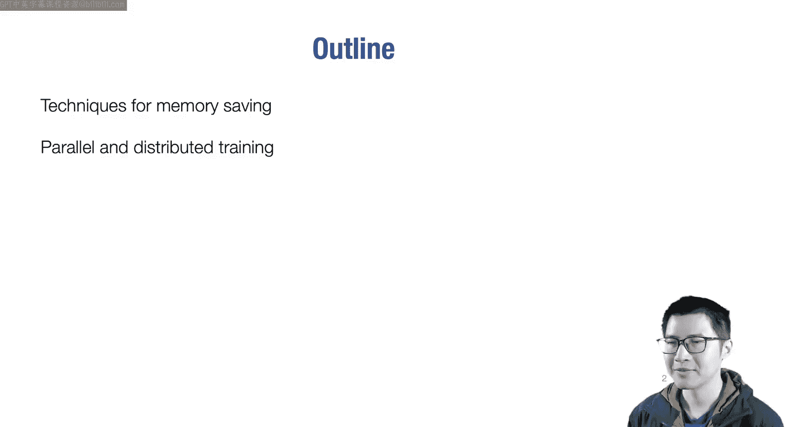

在本节课中，我们将学习如何使用不同的技术来训练大型模型。课程内容分为两部分：第一部分介绍如何在现代GPU加速器有限的内存上构建和训练更深的神经网络；第二部分探讨用于并行和分布式训练的常见范式。

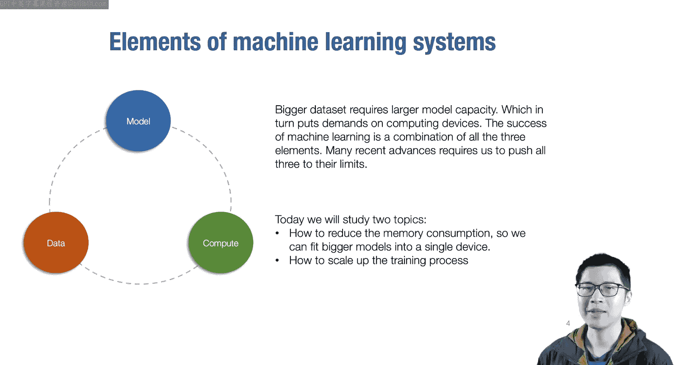

## 第一部分：在有限内存上训练大型模型

上一节我们介绍了课程概述，本节中我们来看看GPU的内存层次结构。

### GPU内存层次结构

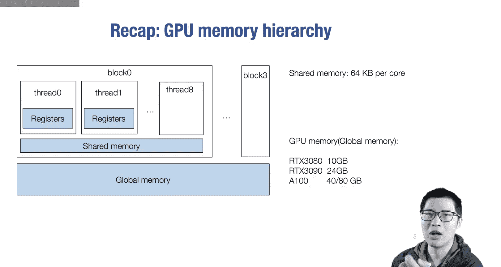

在GPU编程中，内存层次结构包括流多处理器（SM）内的有限共享内存（例如64KB）。然而，当我们谈论GPU内存时，通常指的是GPU的全局内存。不同设备的全局内存大小差异很大。例如，常见的消费级显卡可能提供约8GB或10GB的内存，而现代服务器级GPU（如A100）则提供高达40GB或80GB的内存。

在许多情况下，训练大型神经网络的瓶颈在于可用的全局内存大小。因此，了解内存消耗的来源至关重要。

### 训练过程中的内存消耗来源

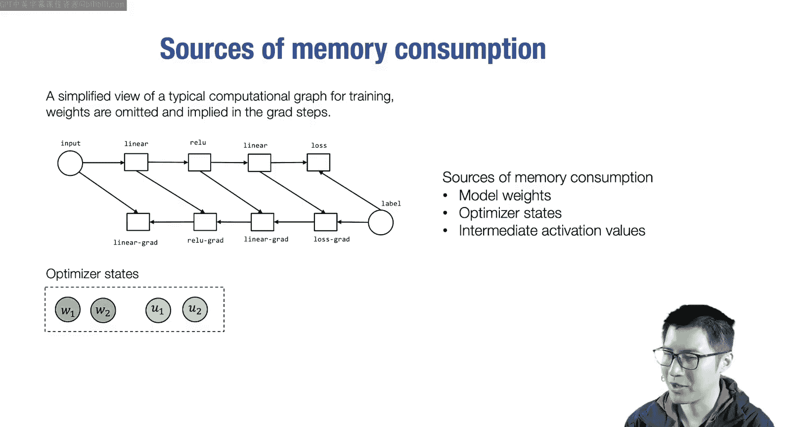

以下是训练过程中常见的内存消耗来源：

*   **模型权重**：存储神经网络各层的参数。
*   **优化器状态**：存储如动量变量等辅助优化状态。
*   **中间激活值**：在前向传播过程中，需要存储各层计算产生的中间结果，以便在反向传播时计算梯度。
*   **输入数据**：需要分配内存来存储输入数据。

我们的核心问题是：如何减少训练过程中的总体内存消耗？

### 推理与训练的内存需求差异

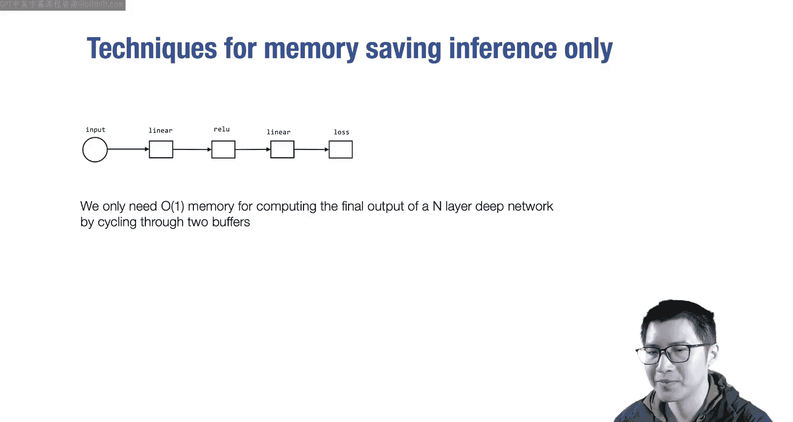

首先，考虑一个简化的推理场景。对于一个深度为 `n` 的线性神经网络，我们实际上只需要两个内存缓冲区（例如缓冲区A和B）以“乒乓”方式交替存储中间激活值，就能完成整个前向传播。这意味着无论网络多深，激活值的内存消耗是恒定的。

然而，在训练场景中，情况变得复杂。由于反向传播计算梯度时依赖于前向传播产生的中间激活值，我们无法立即释放或重用这些值。因此，如果直接使用自动微分，训练一个 `n` 层神经网络需要存储所有 `n` 层的中间激活值，导致内存消耗与网络深度成线性关系。

### 激活检查点技术

为了减少训练时的激活内存消耗，我们可以使用一种称为**激活检查点**（或梯度检查点）的技术。

其核心思想是：在前向传播过程中，我们只有选择地保存部分层的激活值（称为“检查点”），而释放其他层的激活值。在反向传播需要这些被释放的激活值时，我们通过从最近的检查点重新运行一小段前向计算来重新生成它们。

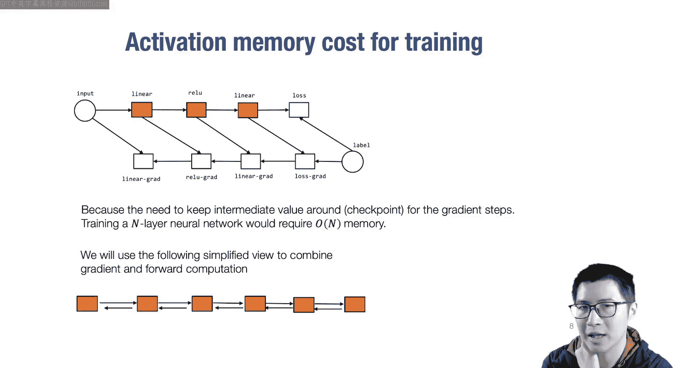

具体步骤如下：

1.  **前向传播与检查点保存**：执行完整的前向传播，但只保存特定层（如图中的彩色节点）的激活值作为检查点，同时释放其他层（白色节点）的激活值内存。
2.  **分段反向传播**：
    *   从最后一个检查点开始，为了计算最后几层的梯度，我们需要其前一层的激活值。
    *   如果该激活值已被释放（白色节点），则从最近的检查点重新运行一小段前向传播来重新计算它。
    *   利用重新计算出的激活值，运行这一小段的反向传播，计算该段的梯度。
    *   重复此过程，逐段向前推进，每次重新计算所需激活值并计算梯度。

### 内存与计算权衡

这种技术通过**用额外的计算换取了显著的内存节省**。

*   **内存节省**：假设神经网络有 `N` 层，我们每 `K` 层设置一个检查点。我们需要存储约 `N/K` 个检查点的激活值，同时重新计算每个段（长度 `K` ）时需要 `K` 层的内存。通过选择 `K = sqrt(N)`，总体内存消耗可以从 `O(N)` 降低到 `O(sqrt(N))`，实现了亚线性的内存增长。
*   **计算开销**：重新计算引入了额外的前向传播开销。通常，一次前向计算的计算量约为一次反向计算的一半。因此，使用激活检查点技术后，总体计算开销大约比原始方法增加 25% 左右。这是一个可以接受的代价，因为它换来了在有限内存上训练更深模型的能力。

在实践中，我们可以根据各层的计算成本灵活选择检查点位置（例如，避免对计算昂贵的层进行重新计算），以进一步优化性能。

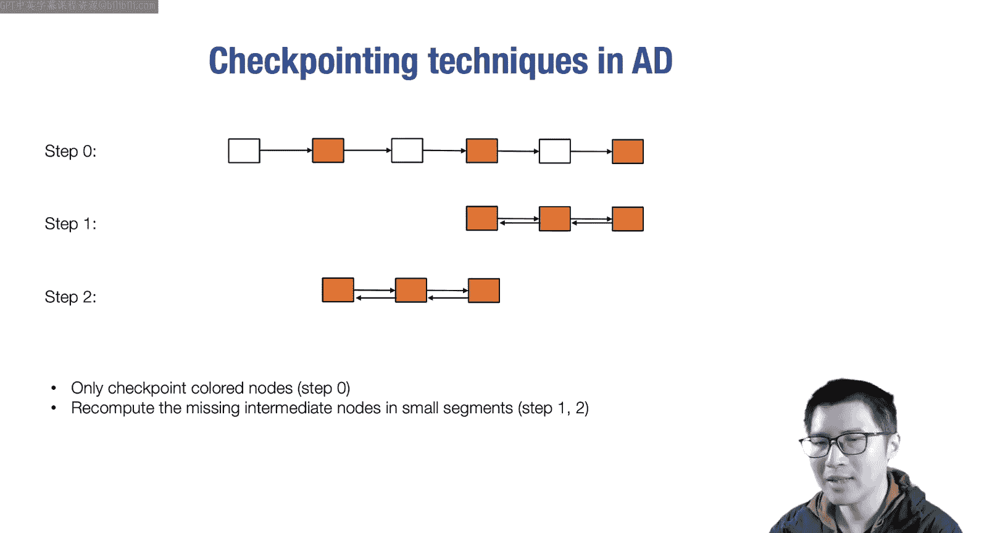

## 第二部分：并行与分布式训练范式

上一节我们介绍了如何通过内存优化技术在单设备上训练大型模型，本节中我们来看看如何利用多设备进行并行和分布式训练，以加速训练过程或训练无法放入单个GPU的巨型模型。

### 模型并行训练

模型并行训练的核心思想是：**将计算图的不同部分映射到不同的工作设备（如GPU）上**。

一个典型的例子是循环神经网络（RNN），我们可以将序列长度维度或隐藏层维度进行划分，分配到不同设备上计算。在这种计算中，只要一个设备完成其部分计算，就可以将结果发送给下一个设备，形成一种流水线式的计算模式。

通用的模型并行方法如下：

1.  **计算图划分**：将整个神经网络计算图分割成多个子图。
2.  **设备分配**：将每个子图分配给一个工作设备。
3.  **插入通信原语**：在子图之间的边界处插入“发送-接收”操作对，以便在不同设备间传递中间计算结果（前向传播的激活值和反向传播的梯度）。

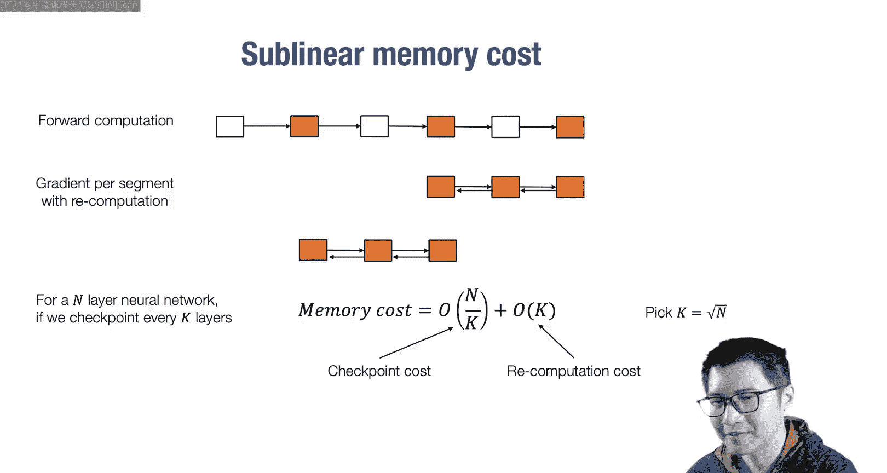

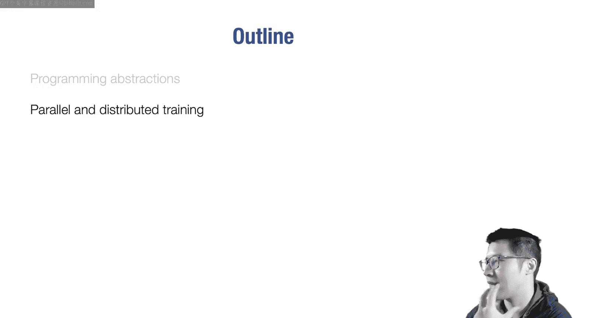

然而，简单的模型并行可能存在设备闲置问题。为了更充分地利用所有设备，引入了**流水线并行**技术。

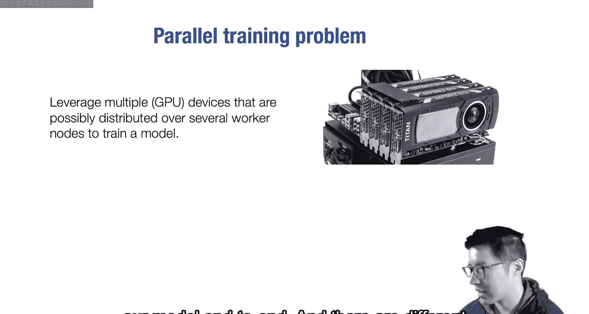

### 流水线并行

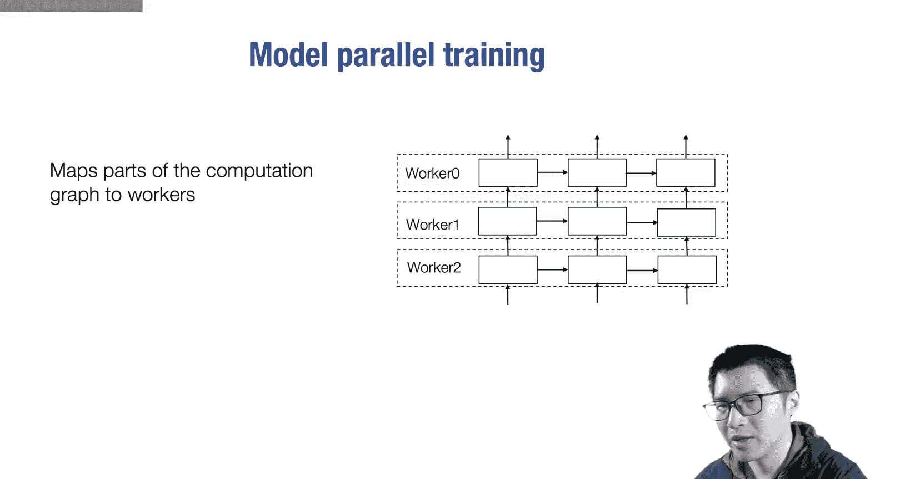

流水线并行的目标是让所有设备尽可能保持忙碌状态。其方法是引入**微批次**的概念。

以下是操作步骤：

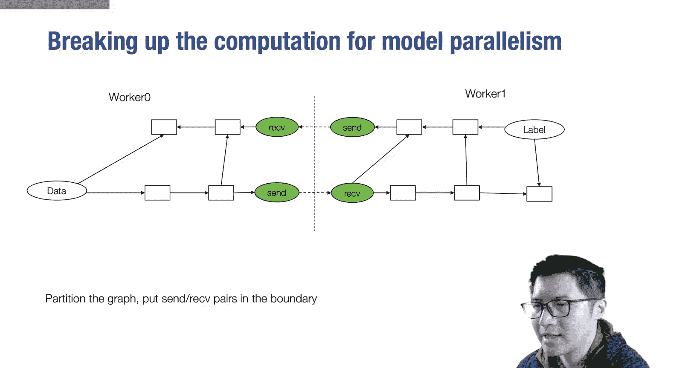

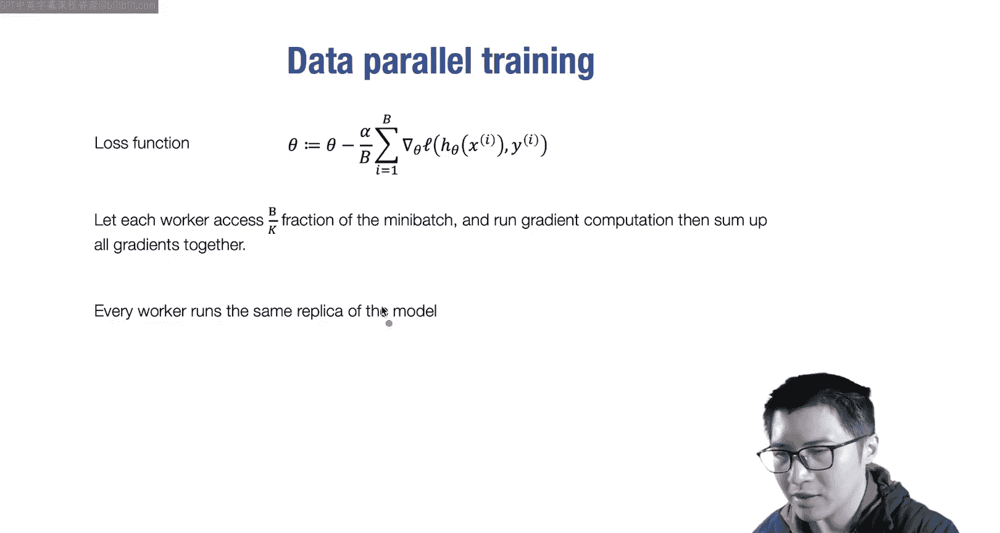

1.  将一个小批次（mini-batch）进一步划分为多个微批次（micro-batch）。
2.  第一个微批次进入流水线，在设备0上计算，然后将其结果发送到设备1，同时设备0可以立即开始处理第二个微批次。
3.  当设备1处理第一个微批次时，设备0处理第二个微批次，设备2（如果有）可能开始处理第一个微批次在设备1上的结果，依此类推。

通过这种方式，多个微批次在流水线的不同阶段同时被处理，提高了设备的利用率。现代用于训练大模型的框架通常都内置了模型并行和流水线并行的支持。

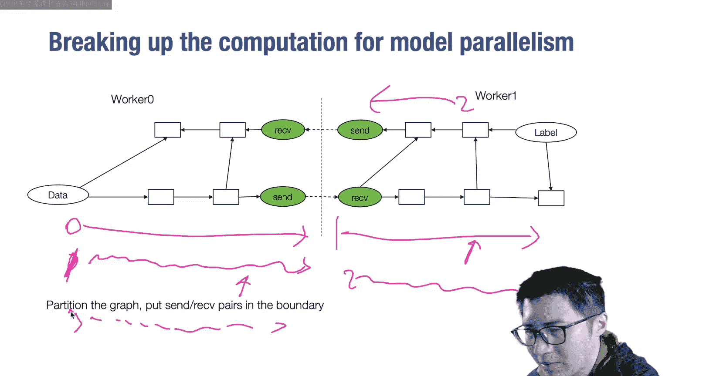

### 数据并行训练

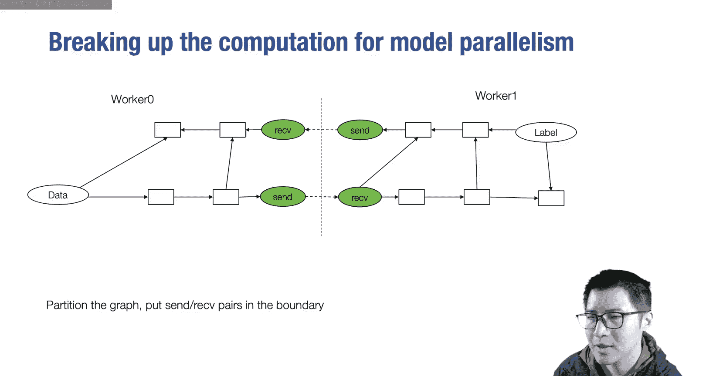

数据并行是另一种广泛使用的并行范式。其核心思想是：**在不同设备上运行相同的模型副本（复制品），但每个副本处理输入数据的一个不同子集**。

根据随机梯度下降的原理，整个批次的梯度是每个数据点梯度的和。因此，我们可以：
1.  将一个小批次数据分割到多个工作设备上。
2.  每个设备用其数据子集独立进行前向和反向传播，计算本地梯度。
3.  聚合所有设备的梯度（通常为求和或平均）。
4.  每个设备使用聚合后的梯度更新其本地模型权重（保持所有副本同步）。

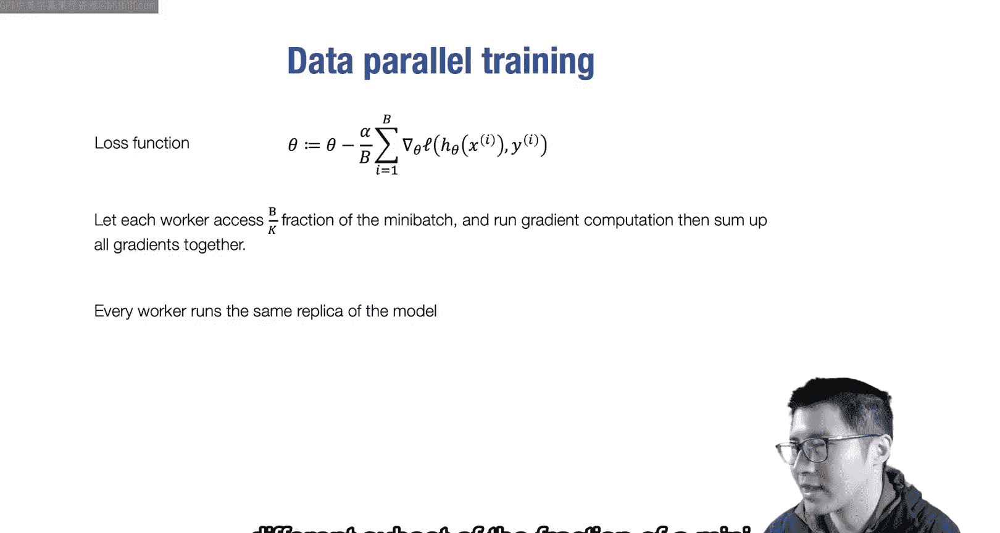

实现数据并行的关键通信原语是**全体归约**。

### 全体归约原语

全体归约（All-Reduce）是一个集合通信操作。每个工作设备持有一个本地数组，调用 All-Reduce 后，每个设备都会得到一个结果数组，其中每个元素是所有设备上对应位置元素进行某种操作（如求和）的结果。

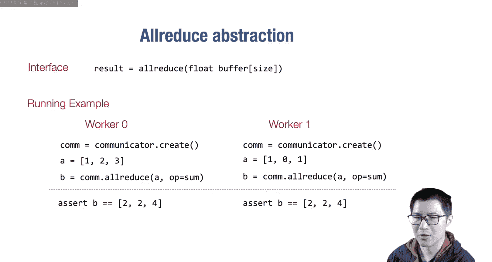

在数据并行中，每个设备计算出的梯度数组 `G_i`，通过 All-Reduce 求和得到全局梯度 `G_total = sum(G_i)`，然后每个设备用 `G_total` 更新自己的权重。NCCL（NVIDIA Collective Communications Library）等库高效地实现了 All-Reduce。

### 参数服务器范式

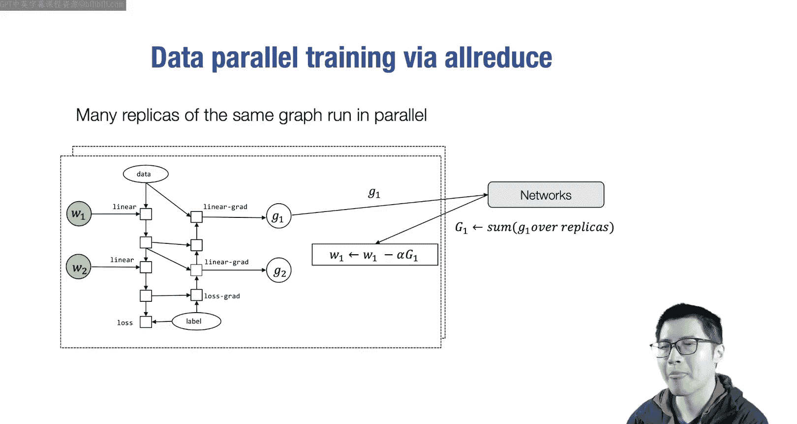

另一种实现数据并行的方式是使用**参数服务器**范式。

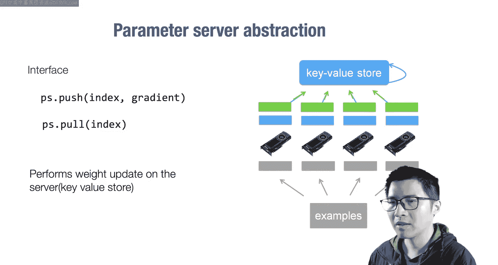

与 All-Reduce 不同，在参数服务器架构中：
1.  工作设备将计算出的梯度发送到一个或多个中心服务器（参数服务器）。
2.  参数服务器负责聚合所有梯度并执行权重更新。
3.  参数服务器将更新后的权重广播回所有工作设备。

这种方式的优势包括对慢速或故障工作节点的容错性更好，以及便于在动态环境中管理模型参数。

### 计算与通信重叠

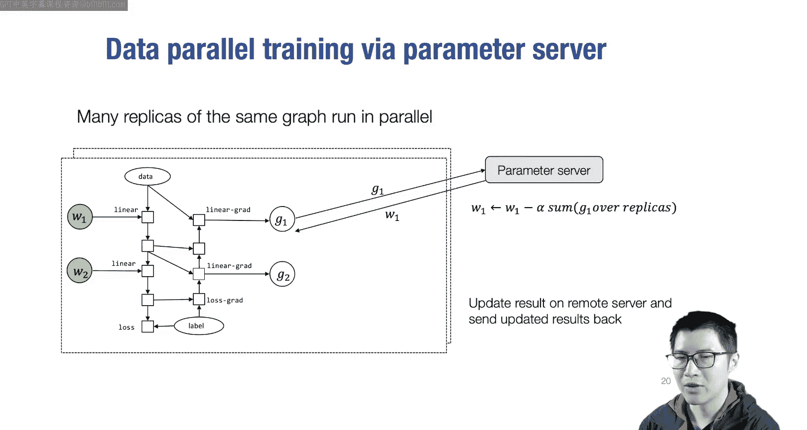

无论是使用 All-Reduce 还是参数服务器，通信（梯度同步）都可能成为瓶颈。一个重要的优化技巧是**重叠计算与通信**。

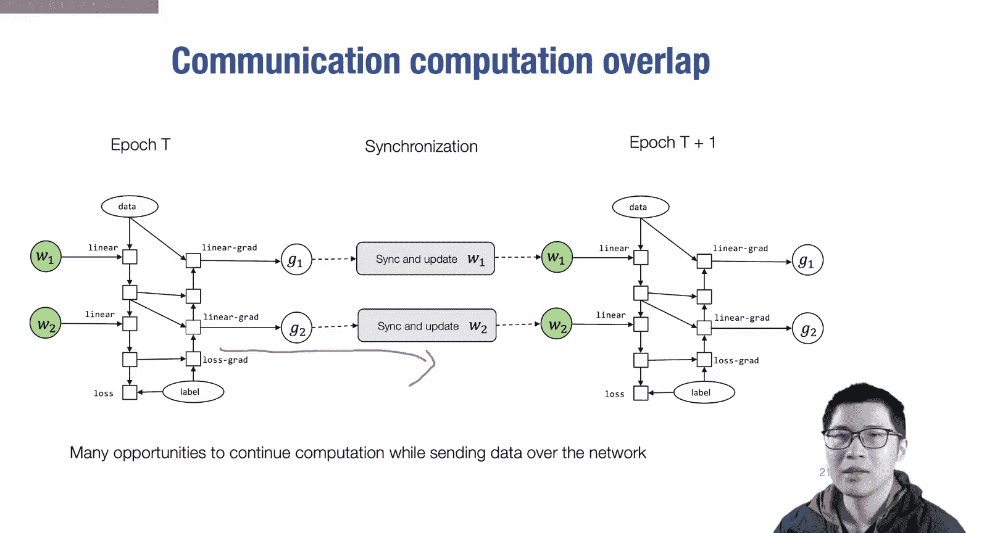

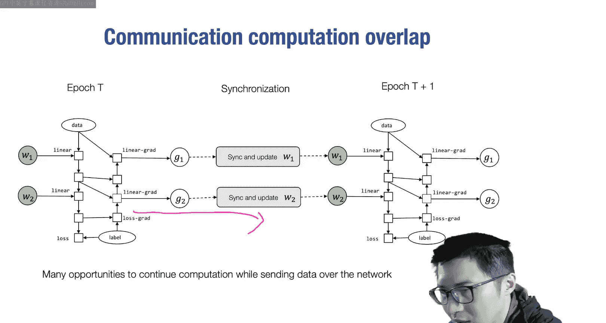

由于反向传播中，较深层的梯度会先被计算出来，我们可以在计算浅层梯度的同时，将已计算出的深层梯度异步地发送出去进行同步（All-Reduce 或发送到参数服务器），而不必等待所有层的梯度都计算完毕。这样可以有效隐藏通信延迟，提升整体训练效率。在系统实现时，通常会使用异步或部分同步的通信策略来实现这种重叠。

## 总结与进阶阅读

本节课中我们一起学习了训练大型模型的两类关键技术：

1.  **内存优化技术**：重点介绍了**激活检查点**技术，通过以约25%的额外计算开销为代价，将训练时的激活内存消耗从 `O(N)` 降低到 `O(sqrt(N))`，使得在有限内存的GPU上训练极深网络成为可能。
2.  **并行训练范式**：
    *   **模型并行**：将模型划分到不同设备，适用于单设备放不下的大模型，常结合**流水线并行**提高设备利用率。
    *   **数据并行**：在不同设备上复制模型，处理不同数据子集，通过**全体归约**或**参数服务器**同步梯度，是实现训练加速的主要手段。优化时需注意**重叠计算与通信**以降低通信开销。

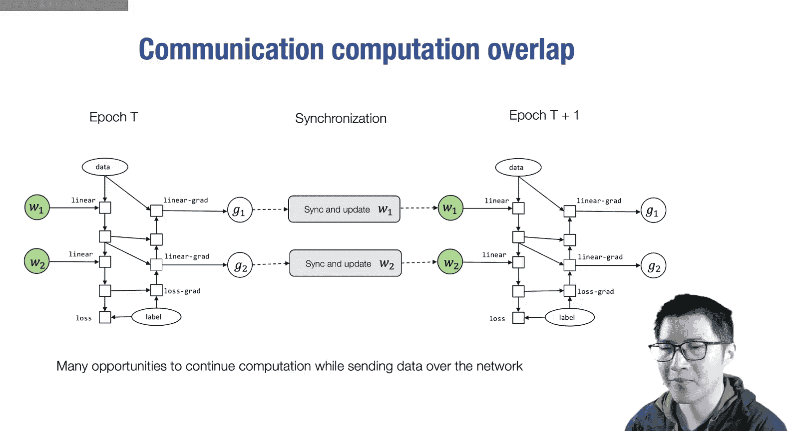

此外，还有一些更先进的并行技术，如：
*   **零冗余优化器**：将优化器状态、梯度和参数本身分区 across 设备，进一步减少单设备内存占用。
*   **自动并行**：系统自动探索模型和数据的最佳分区策略。

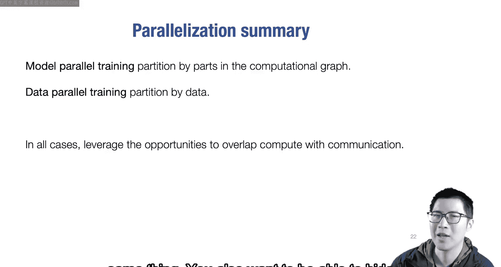

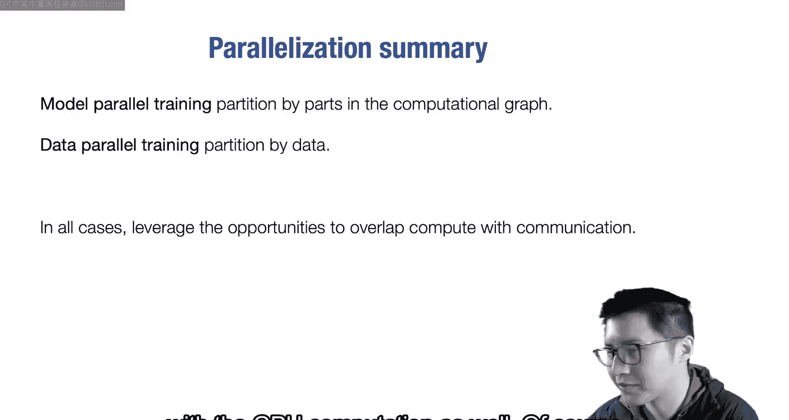

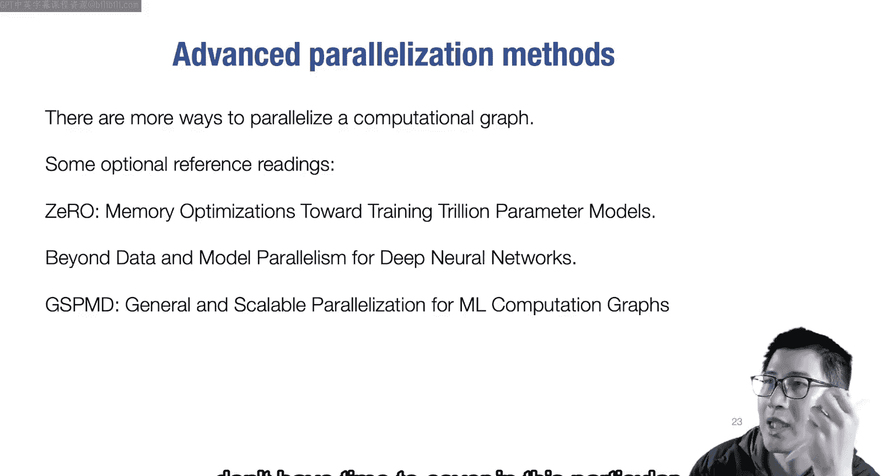

这些技术是构建和训练当今大规模深度学习模型的基础组成部分。

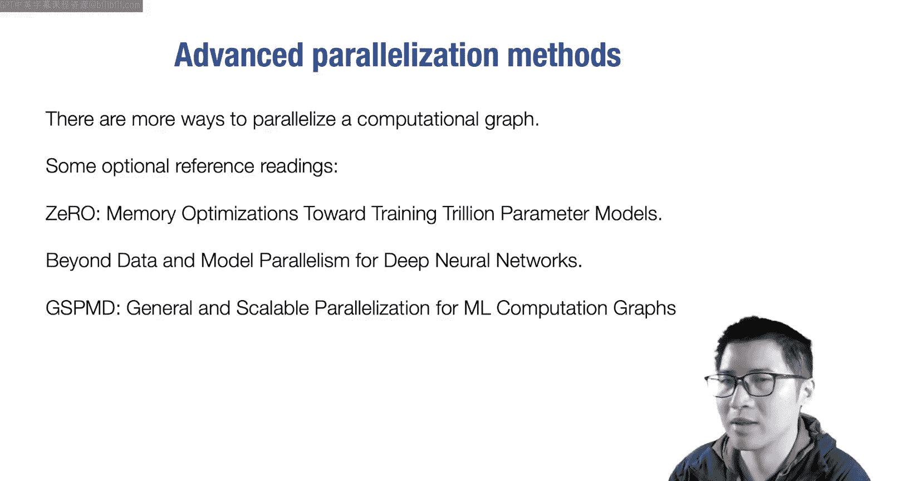

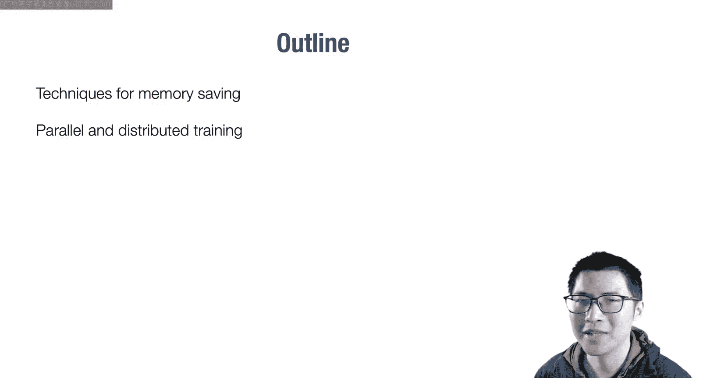

希望本节课能帮助你掌握在有限内存上构建更大模型以及扩展计算规模的方法。我们下节课再见！