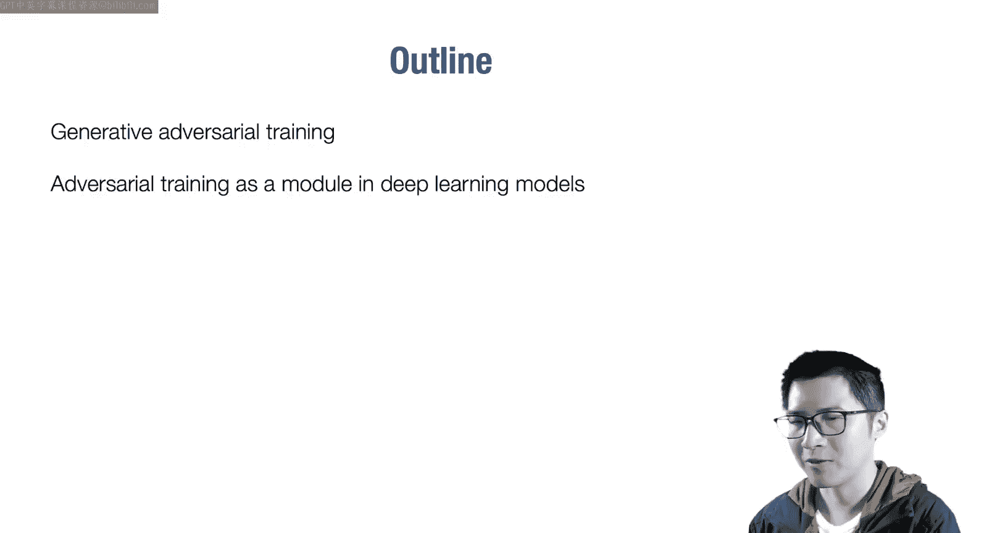
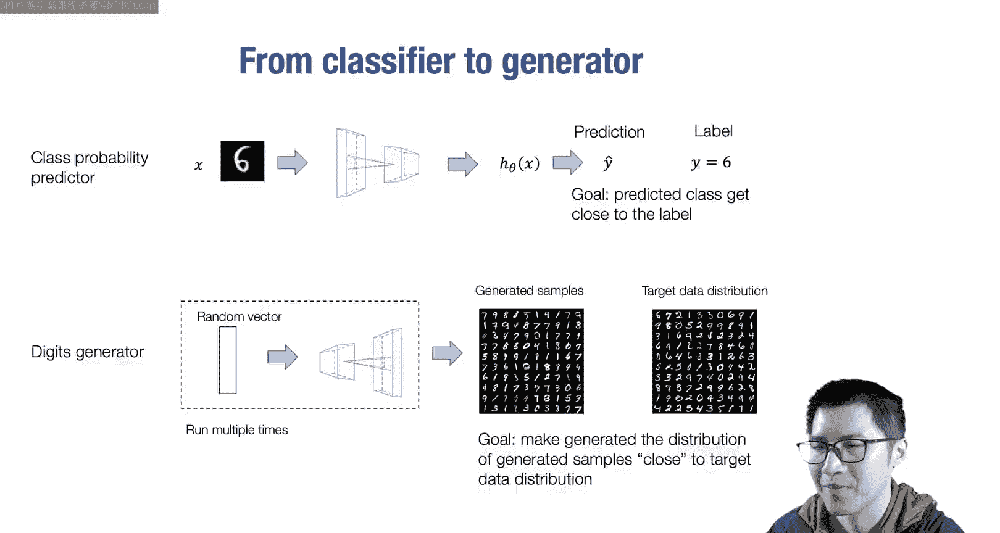
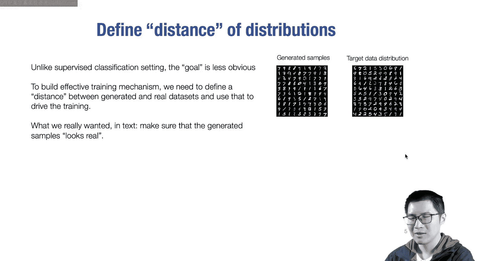
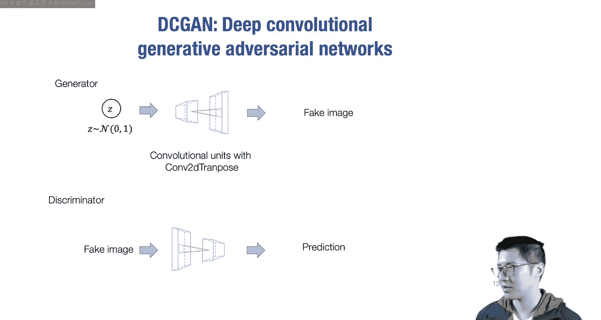
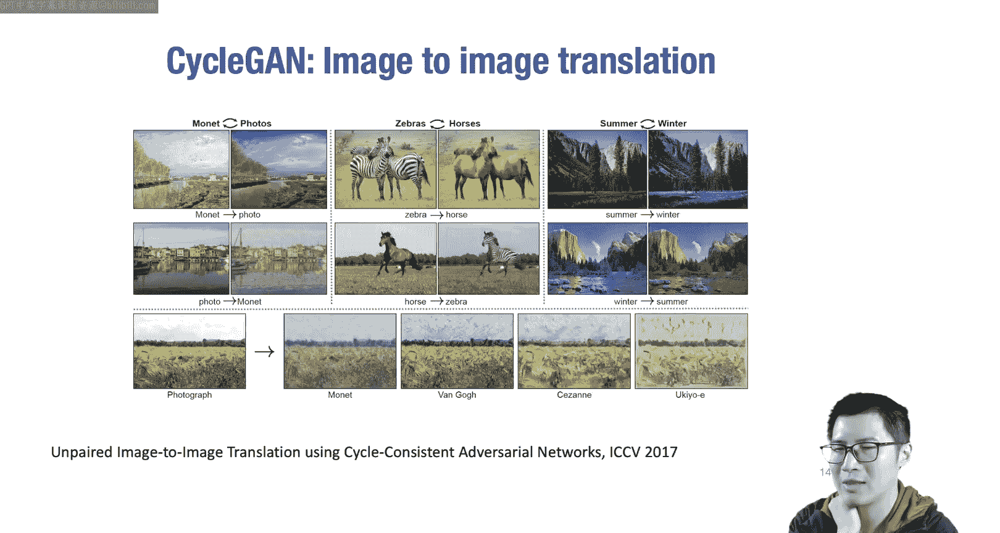
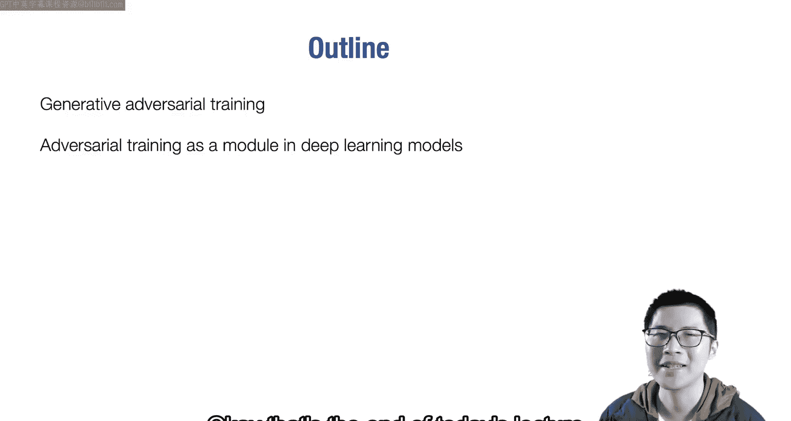

# 16：生成对抗网络 🎭

在本节课中，我们将要学习一种新的机器学习范式——生成建模，特别是其中的一种核心技术：生成对抗网络。我们将首先探讨对抗训练的基本机制，然后了解如何将对抗训练作为一个模块，整合到更广泛的深度学习建模流程中。

---

## 从监督学习到生成建模

上一节我们介绍了多感知机和残差神经网络架构。到目前为止，我们学习的大多数任务都属于监督学习或分类任务。其核心思想是：给定一个高维张量表示的输入 **X**，将其输入到一个假设类（例如卷积神经网络）中，得到一个预测值 **ŷ**。然后，我们根据预测值和真实标签 **y** 之间的差异，来训练这个端到端的神经网络分类器。

监督学习的一个特点是，我们通常可以根据单次预测的结果来衡量预测的好坏。

今天，我们将讨论另一种建模技术——无监督建模，或称生成建模。其目标不再是输入一张图像并对其进行分类，而是希望从一个随机向量 **z** 出发，通过一个神经网络将其映射到输出空间，生成类似于数字、甚至是高分辨率图像等样本。

我们的目标是，让神经网络生成的样本集合（左侧）看起来与目标数据分布（右侧）尽可能相似。核心在于使生成样本的分布接近目标分布。

当然，生成建模有多种方法。我们这里描述的是：从一个随机向量 **z** 开始（大部分随机性来源于此），通过一个变换层将其投影到高维像素空间，从而得到一系列样本，并确保它们与目标分布接近。

这里的一个关键问题是：如何衡量一组生成样本与目标分布之间的“接近程度”？这是我们在此要探讨的核心问题。

需要记住的是，我们现在处理的是分布，而不再是单个实例的分类。另一个要点是，为了学习这些生成器模型，我们不再需要提供任何标签数据。我们只需提供一组原始数据，并让模型学习生成类似的数据集合。这本质上就是无监督学习：无需提供标签，只需提供数据本身，目标是生成与目标数据分布相似的样本集合。

那么，如何学习生成器神经网络中的权重呢？

回顾机器学习的基本范式，我们知道学习权重的一种方法是定义目标函数，然后对其求梯度，通过自动微分得到各层的权重梯度，进而使用梯度下降等优化方法来优化端到端的模型权重。

但问题在于：我们如何定义这个目标函数？这是困扰许多研究者的核心问题。

---

## 定义分布间的距离

与监督学习不同，生成建模的目标不那么直观。我们希望定义生成数据集与真实数据集之间的距离，并用它来驱动训练。我们想要生成“看起来真实”的东西，但如何量化这种“真实感”呢？

我们可以思考几种可能的距离定义方式。例如，简单的度量可以包括确保两个分布的均值匹配、方差匹配。更高级的方法可能包括对像素进行聚类并确保聚类中心接近等。方法多种多样。

这里还有一个关键点：我们不仅需要定义分布间的距离，还需要这个定义方式是可微分的，以便能够将梯度传播回生成器神经网络的权重。

简而言之，这似乎比监督学习中定义损失函数并直接使用梯度传播要复杂得多。我们该如何实现呢？

---

## 构建思路：假设存在一个“先知”判别器

让我们先构建一个初步想法。假设我们有一个“先知”分类器（Oracle Classifier），它能够完美区分真实数据和生成数据。也就是说，给定任何一张图片，这个“先知”都能判断它是真实图像还是生成图像。我们进一步假设这个“先知”是参数化的，并且可以对其求导。

那么，我们可以这样做：因为我们有这个“先知”，所以我们的目标是学习一个生成器，使其生成的样本能够“愚弄”这个“先知”，让它无法区分。

具体来说，我们有一个输入 **z**，生成器 **G** 会生成 **x̂ = G(z)**。如果我们将 **x̂** 输入判别器 **D**，会得到 **D(G(z))**，这是一个概率值，表示判别器认为该样本是真实数据的概率。

我们希望最大化判别器将生成样本误判为真实样本的概率。这等价于最小化判别器正确识别出生成样本的负对数似然。其核心思想是：我们希望训练生成器来“欺骗”这个“先知”判别器，使其无法区分真实数据点和生成数据点。

假设我们有这样一个判别器 **D**，我们就可以采样随机向量 **z**，通过生成器，再通过判别器，并通过反向传播优化这个目标，从而得到生成器权重的梯度，帮助生成器更新，最终找到一个能完美欺骗“先知”判别器的生成器。

然而，现实中并不存在这样的“先知”判别器。因此，我们的想法是：尝试使用一个神经网络来学习并参数化这个判别器。

---

## 学习判别器：对抗训练的形成

我们尝试用一个神经网络来参数化判别器，并希望它尽可能“聪明”。如何让它变得聪明呢？思路是：我们可以直接使用训练数据来训练判别器区分真假。

具体做法是：我们从真实数据分布中收集一个真实数据集，同时用当前的生成器生成一批假数据。有了这些正样本（真实）和负样本（生成），我们就可以去最小化一个目标函数：即最大化判别器对真实数据判为“真”、对生成数据判为“假”的对数似然。这实际上就是在学习一个判别器。

生成对抗网络的想法非常巧妙。总结来说，其核心思想是：我们想学习一个生成器 **G**，但为了学习它，我们引入了一个试图区分真假数据的判别器 **D**。由于我们没有现成的“先知”判别器，所以我们同时学习这个判别器和生成器，形成一个迭代过程。

结合起来，生成对抗网络的总体目标函数是生成器 **G** 和判别器 **D** 之间的一个**极小极大博弈**。

对于判别器 **D**，我们希望最小化负对数似然（即正确分类真实与生成数据）。
对于生成器 **G**，我们希望最大化判别器将生成样本误判为真的概率（即最小化生成样本被判别器识破的负对数似然）。在实践中，我们通常使用另一种等价形式：生成器试图最小化判别器将生成样本判为“假”的对数似然（即最大化判为“真”的概率）。

因此，整体的对抗训练是一个判别器更新和生成器更新交替进行的过程。

---

## 对抗训练的迭代过程与直觉

对抗训练是一个迭代过程：
*   **判别器更新**：采样一个小批量的生成假数据和真实数据，更新判别器以最小化总体负对数似然。
*   **生成器更新**：采样一个小批量的生成数据，更新生成器以最大化判别器将这些数据判为“真”的概率。这可以通过在计算损失时，将生成数据的标签设为“真”（1）来实现。

因此，在判别器更新和生成器更新之间，生成数据的标签被“翻转”了。

通过这种迭代过程，我们能够训练出一个能生成逼真图像的生成器。

我们可以思考一下这种交替更新背后的直觉：为了生成看起来真实的图像，人类应该无法区分其真假。如果能够区分，说明它还不够真实。判别器的作用就是去发现那些可能人类肉眼难以察觉、但能区分真假的特征。在训练初期，生成器可能只生成大致形状正确的猫，就能欺骗初步的判别器。随后，判别器会学会关注更细微的特征（如耳朵的形状），迫使生成器去修正这些细节。从某种意义上说，判别器在不断发现生成图像的缺陷，而生成器则在不断修补。这种目标函数非常强大，也是GAN能够生成逼真图像的原因之一。

另一方面，正因为这是一个迭代的极小极大博弈过程，其**收敛性通常不稳定**，训练过程需要精心调参，也有大量研究工作致力于稳定GAN的训练。

以上就是第一部分内容，我们介绍了一种能够帮助我们生成与目标数据分布相似样本的工具——生成对抗网络。

---

## 模块化：将对抗训练作为深度学习组件

接下来，我们思考如何将生成对抗训练作为一个模块，与其他深度学习模块组合使用。

深度学习本质上是模块化的。当我们画出多层残差神经网络时，我们知道每个残差块都可以展开成更详细的形式，每个线性块也可以进一步细化。这种模块化特性是深度学习成功的重要原因之一。

例如，当我们为分类任务验证了一个卷积神经网络后，如果想将其改为目标检测任务，我们通常只需替换掉用于分类的Softmax交叉熵损失，换成SSD检测损失等边界框度量损失，而可以复用之前的所有组件。这种模块化意味着许多机器学习组件可以像乐高积木一样组合在一起，从而能够有机地构建各种应用，这正是其强大之处。

既然我们学习了生成对抗训练，一个很自然的问题是：我们能否也将它模块化？观察一下，它似乎是一个工具，可以帮助我们衡量生成数据分布与真实数据集合之间的距离。那么，如何模块化这个GAN损失函数呢？

一种看待生成对抗训练的方式是将其视为一种**损失函数**。当然，它并不完全是传统的损失函数，因为每次计算时还需要更新判别器以保持其“最新状态”。但为了在代码中构建并组合它，我们可以利用其特性，构建一个像模块一样的“GAN损失”，用于衡量一组生成数据与一组真实数据之间的分布距离。

另一个可以组合的方面是输入到输出的映射架构。对于图像生成，一种常见架构是**深度卷积生成对抗网络**。其思想是将输入的低维随机向量通过转置卷积（或称反卷积）操作，映射到越来越大的空间尺寸上，最终生成高分辨率图像。DCGAN的生成器通常包含多个这样的转置卷积层。

无论你的生成器是简单的线性网络还是复杂的卷积网络，你都可以使用相同的对抗训练机制，通过损失函数将梯度传播回生成器的权重。

你可能会问：我们讨论这种模块化有什么帮助呢？接下来，我们将通过一个具体变体，展示这种模块化如何帮助我们构思新的生成模型。

---

## 应用实例：CycleGAN——非配对图像翻译

我们将讨论一个著名的工作——**CycleGAN**。其任务是进行**图像到图像的翻译**，例如将夏天的照片转换成冬天，将马转换成斑马，或将普通照片转换成艺术风格图像等。

现在的问题是：如果你想构建这样一个图像翻译器，有哪些可能的方法？我们目前已经学过几种。

第一种简单的方法是尝试获取**成对的图像**。对于每张输入图片，都有其对应的目标输出图片。然后，我们可以利用这些成对的 **(X, Y)** 数据，通过监督学习来训练一个翻译器模块。这对于某些任务（如从草图生成完整图像）是可行的，因为我们可以从真实图像中提取草图。

然而，在大多数情况下（如将马变成斑马），很难获得这样的成对数据。但我们通常可以轻松获得**不成对的数据集**，例如一堆马的图片和一堆斑马的图片。

那么，能否利用这些不成对的数据来构建一个双向翻译器呢？这正是模块化对抗训练大显身手的地方。

我们可以这样设计：
1.  构建一个从域 **X**（如马）到域 **Y**（如斑马）的翻译器 **G**。
2.  我们希望 **G(X)** 生成的图片看起来像真实的斑马图片。虽然我们没有一一对应的真实斑马图片，但我们有一堆真实的斑马图片。因此，我们可以引入一个**GAN损失**，来缩小生成图片分布与真实斑马图片分布之间的距离。
3.  类似地，我们再构建一个从域 **Y** 回到域 **X** 的翻译器 **F**。
4.  同样，使用另一个GAN损失来确保 **F(Y)** 生成的图片看起来像真实的马图片。

但这还不够。除了这两个方向的映射，我们还需要**循环一致性**。即，从一张马图片 **X** 出发，通过 **G** 翻译成斑马图片 **Ŷ**，再通过 **F** 翻译回马图片 **X̂**。我们希望 **X̂** 与原始的 **X** 尽可能接近。这可以通过 **L1 距离**等来度量，称为**循环一致性损失**。反过来从 **Y** 到 **X** 再到 **Y** 也应如此。

将所有部分组合起来，CycleGAN的训练过程包含了多个目标（至少两个GAN损失和两个循环一致性损失）。这正是一种复杂的模块化组合。如果我们直接写模型，可能会很复杂。但正因为能够将GAN损失等模块化为类似损失函数的组件，我们才能清晰地在一个框架内描述并实现这些更新。

这正是深度学习模块化的魔力所在，也是GAN被广泛应用的原因之一。生成对抗训练的思想可以与各种卷积神经网络或其他网络很好地组合。整体而言，深度学习的模块化特性使其无比强大，允许我们将不同的想法组合在一起。CycleGAN就是一个完美的例子。

---

## 总结与展望

本节课中，我们一起学习了生成对抗网络的核心思想。我们首先探讨了如何通过引入判别器来定义和优化生成模型的目标，形成了生成器与判别器之间的对抗训练框架。接着，我们深入了解了这种训练的迭代过程及其背后的直觉。最后，我们强调了深度学习模块化的重要性，并以CycleGAN为例，展示了如何将对抗训练作为可组合的模块，来解决非配对图像翻译等复杂任务。

现在，请大家思考：还有哪些其他可能的方式，可以将GAN模块与其他深度学习组件组合起来，构建更有趣、更强大的学习系统呢？希望我们能够一起探索并构建出更多有趣的模块化应用。

本节课到此结束，感谢大家，我们下节课再见。