# 22：模型部署 🚀

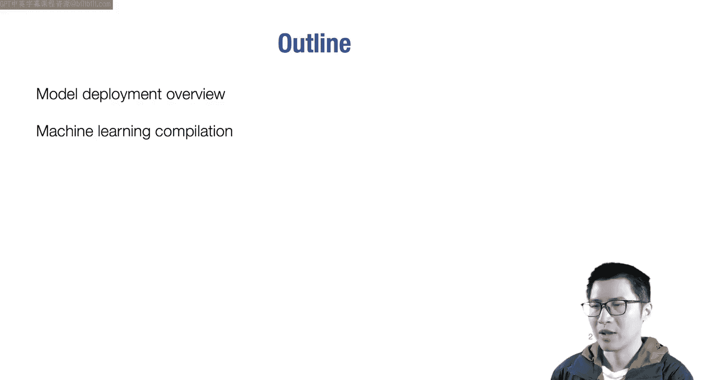

在本节课中，我们将学习如何将训练好的机器学习模型部署到不同的实际应用环境中。我们将探讨模型部署面临的挑战、现有的推理引擎解决方案，以及一个新兴的自动化技术——机器学习编译。

---

## 模型部署的挑战

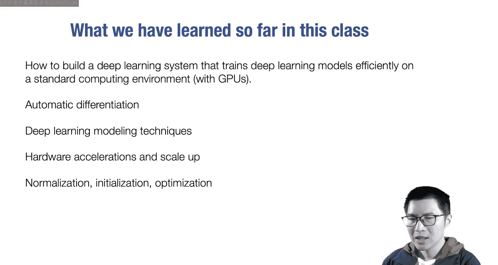

到目前为止，我们已经学习了如何从零开始构建自动微分库，并在此基础上构建了高级的 `needle` 库。该库允许我们组合不同的建模技术（模块），利用组合能力构建各种模型。我们还学习了不同的建模技术，如前馈神经网络、序列建模等，以及不同的优化、归一化和正则化技术。在多节课中，我们学习了如何在标准计算环境（如包含GPU的环境）上高效地训练深度学习模型。

另一方面，我们还需要考虑部署问题。具体来说，假设我们有一个通过 `needle` 框架或其他框架（如 PyTorch、TensorFlow）学习到的现有模型。模型部署的任务是希望将该模型带到我们可能感兴趣的、用于部署的不同计算环境中。

当然，这可能涉及将模型部署到相同的环境，如服务器环境。在这种情况下，我们可以直接使用 `needle`。有时，我们可能希望将人脸检测算法或其他算法部署到移动设备上。在其他情况下，我们可能希望将机器学习模型部署到更小的嵌入式环境中。即使是GPU，现在也有不同的GPU环境，如 NVIDIA GPU、AMD GPU、Apple GPU，以及移动环境中的其他GPU。

因此，模型部署的核心问题是如何将这些学习到的模型带到不同的应用环境中。

现在，如果我们稍作停顿，思考一下将模型带到目标环境可能存在的困难，你会发现有很多有趣的事情需要考虑。例如，如果你想将模型部署到移动设备上，就需要将机器学习模型包装到原生部署环境中。例如，如果要在 Apple 设备上运行，至少需要能够调用 Apple 环境下的系统库，以利用其 GPU。在 iPhone 上，需要使用 Apple 的 GPU 编程语言 Metal。如果想将模型部署到嵌入式环境（如树莓派），则需要能够利用 ARM 环境下的加速库。在嵌入式环境中，内存通常也是一个问题，因此我们希望在此过程中减少内存消耗。当然，如果你想将模型作为移动应用部署，还存在如何最小化库或应用大小的问题，你肯定不希望部署一个包含整个执行库、体积达 200 MB 的应用。这也是减少依赖关系的另一个考虑因素。在某些情况下，部署环境可能没有 Python，这意味着我们无法再使用某些依赖 Python 的实现。

因此，部署在某些方面看似直接，例如，如果我只是在服务器上使用 `needle` 库进行预测，那么无需更改任何内容。但另一方面，如果考虑到在不同环境部署的复杂性，除了我们已经实现的内容之外，肯定还有更多需要考虑的因素，这些因素主要源于我们即将面对的部署环境的多样性和特性。

以下是部署时需要考虑的几个关键点：

*   **应用环境限制**：例如，模型大小限制，或者许多环境没有 Python 解释器。
*   **硬件加速**：现代平台（如移动设备）通常具有本地硬件加速能力，例如移动 GPU、加速的 CPU 指令（如 ARM NEON 或 Intel AVX），或专门的硬件（如神经处理单元 NPU）。
*   **应用集成**：我们需要构建整体的部署解决方案，并将其与应用程序集成。这意味着我们需要能够进行数据预处理（例如，使用转换原语处理视频流）、特征工程以及后处理，以便将预测结果转换为应用程序能够理解的形式。

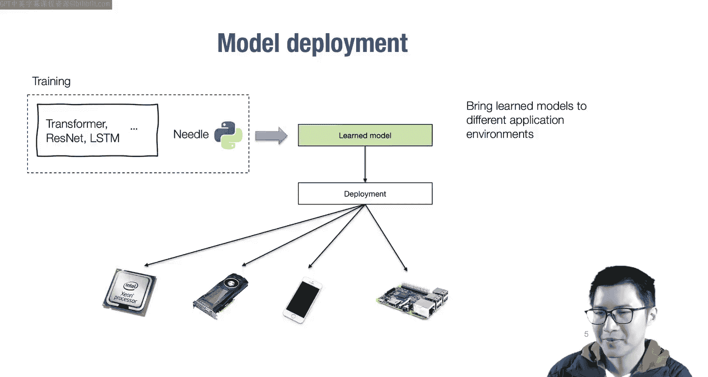

所有这些复杂性都是由部署环境的多样性带来的。

---

## 现有推理引擎

现在，让我们来看看当前典型的机器学习部署方式。

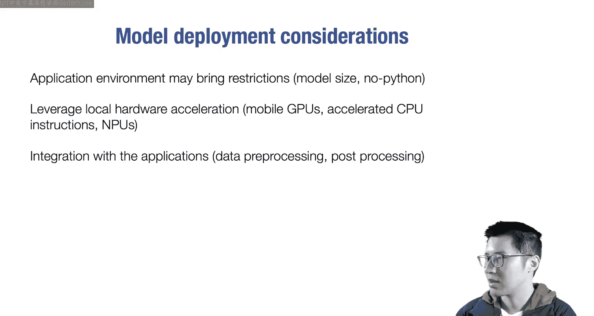

如今，市面上有许多部署引擎或推理引擎。这些推理引擎通常是专门的框架，可以接收深度学习计算图，并能够在特定设备上运行端到端的推理计算。

以下是一些例子：

*   在 NVIDIA 设备上，有 TensorRT 工具。
*   在 ARM 设备上，有 TensorFlow Lite 或 ARM Compute Library。
*   在 Apple 设备上，有 Core ML 框架。

大多数部署引擎的工作方式是，它们接收一种描述整个神经网络推理计算的**推理模型格式**。常见的格式包括：

*   **ONNX**：开放神经网络交换格式，被微软等多家公司广泛使用。
*   **Core ML**：Apple 自家的格式。
*   **TensorFlow Lite**：TensorFlow 的格式，使用 FlatBuffers 来描述计算图。

这些格式内部通常是一种描述计算图和权重的格式。例如，对于一个两层神经网络，该格式会描述运行此推理工作负载所需的一系列操作，并附加每个阶段的权重。

通常，在部署时，我们需要做的是获取学习到的模型（在很多情况下，它是由框架生成的模块格式），并找到一种方法来生成相应部署后端可能需要的计算图格式。

当然，这种方法也有局限性。例如，当我们使用 `needle` 构建神经网络时，一个优势是计算图是动态构建的。我们在每次计算迭代时动态构建计算图，这样就能将计算图构建与 Python 代码混合。例如，如果我们想使用一种称为“随机深度”的高级模型策略，它允许在训练时随机跳过某些残差连接。如果你想在部署端仍然进行随机深度，很难将这种随机性描述为一个完整的静态计算图。

还有其他情况，例如混合专家模型，我们可能希望使用一个神经网络来决定接下来查询哪个子专家。虽然可以使用条件节点在计算图中描述，但这确实对条件图格式提出了更多要求。

因此，在某种程度上，这并不是一个能完美描述一切的模型格式。这也是为什么在 PyTorch 或 `needle` 中部署模型会带来一些麻烦的原因。但另一方面，PyTorch 和 `needle` 在能够用 Python 进行大量计算的灵活性，也使我们能够更有效地构建这些模型。

我们需要认识到，我们感兴趣的大多数模型，以及在实际场景中部署的模型，通常都可以表示为这种计算图格式。因此，如果你希望在不同的环境中构建和运行这些模型，能够获取计算图的能力仍然是有用的。

PyTorch 框架使用的技术是**符号追踪**。它有效地追踪整个计算过程，生成一个内部格式的计算图（例如，通过连接值形成的 `needle` 格式）。然后，我们可以构建一个翻译器，将该格式转换为后端引擎识别的计算图格式。如果你感兴趣，这也可以作为一个项目选项：例如，获取一个 `needle` 模型，并将其部署到 ONNX Runtime、TensorRT 或其他运行时环境上。

这就是我们如何获取学习到的模型并将其转换为后端管理器识别的计算图格式的过程。

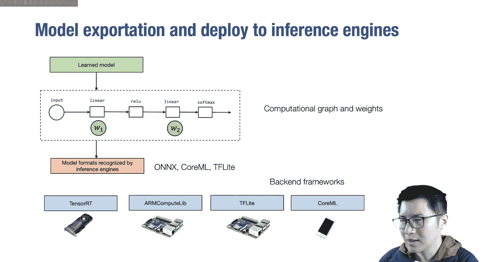

---

## 推理引擎内部原理

在推理引擎内部，如今我们看到的大多数推理引擎（如 TensorRT 或 TF Lite）都被构建为**计算图解释器**。

其思想是，它会为计算图分配中间内存，然后按照拓扑顺序遍历图。它会遍历第一层神经网络计算，获取第一层的结果，然后运行第二层，依此类推。在解释完每个步骤后，它将给出最终输出作为预测结果。

正如上一节提到的，大多数推理引擎都支持有限的运算符集和编程模型。根据其功能强弱，它们可能不支持动态计算，在某些情况下甚至可能要求其他形状在运行前已知。

不过，这些引擎非常谨慎地处理的一件事是**内存重用**。我们已经在过去的讲座中提到过，在进行推理时，有很多机会可以重用内存。大多数推理引擎不会每次都分配内存，而是能够预分配内存并使用暂存空间。例如，它可以为某个节点分配内存，然后在后续节点中重用该内存。

当然，除了这些基本的内存分配和优化之外，大多数推理引擎还会进行其他优化。其中可能包括**运算符融合**（将两个运算符合并为一个运算符），以及将中间权重和激活值转换为更低精度（如 FP16）等。这些是推理引擎实现和加速底层计算的可能方式。

---

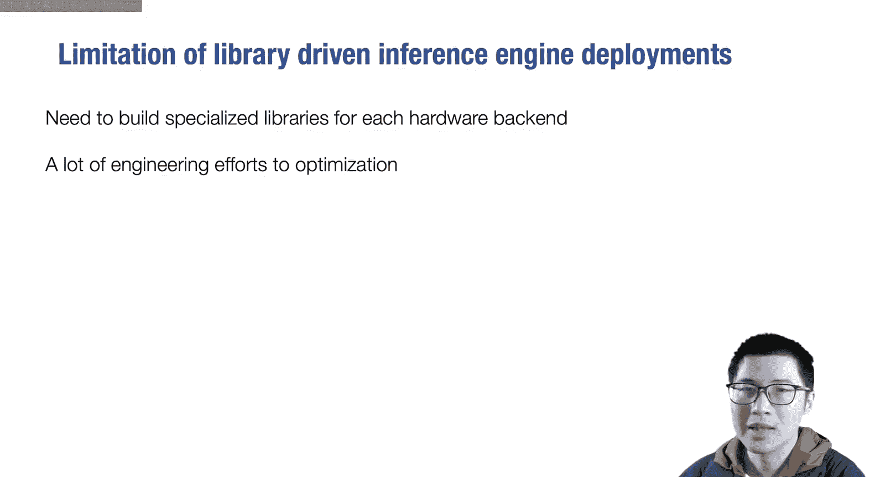

## 机器学习编译简介

到目前为止，我们看到的推理引擎大多是库。这意味着，对于每种硬件后端，为了构建针对该特定硬件后端的推理引擎，我们需要构建专门的库。这确实需要大量的工程努力来进行优化，特别是为感兴趣的特定硬件后端构建内核库。通常，如果你查看推理引擎的问题，会发现通常是由大公司的工程团队支持的。TensorRT 由 NVIDIA 支持，TensorFlow Lite 由 Google 支持，Core ML 由 Apple 支持。这通常需要服务器工程师不断优化并为特定硬件后端实现库。

因此，这可能是相当工程密集型的。

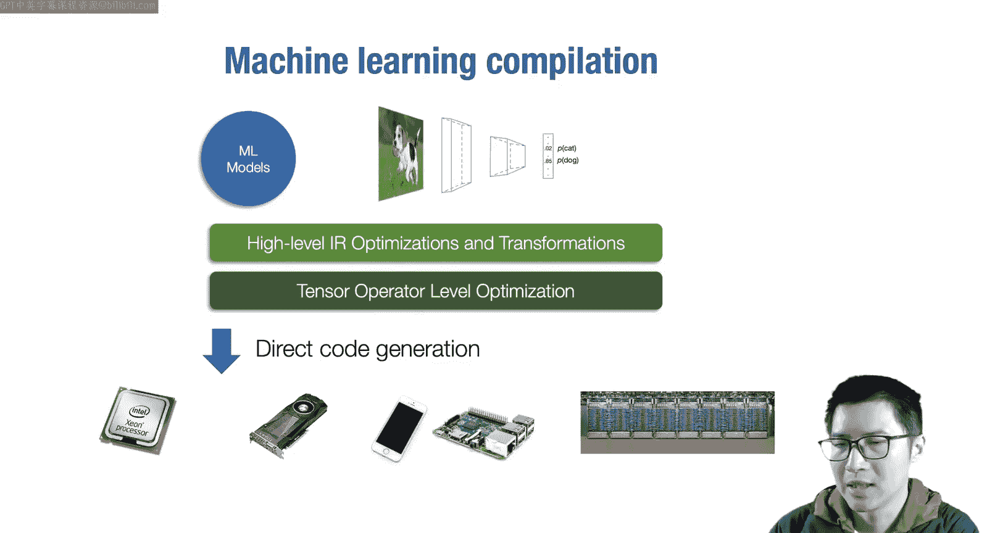

最近该领域提出的一个问题是：是否有可能引入更多自动化技术？与其为每种硬件后端构建库，我们能否尝试进行某种形式的**直接代码生成**，将高级机器学习模型直接转换为可在每种感兴趣的硬件环境（包括嵌入式环境、GPU 或加速环境）上运行的代码？这被称为**机器学习编译**，这是一个仍在兴起的领域。

总体思路是，我们可能希望进行更结构化的代码生成。当然，有时我们仍然希望提供一些库的实现，但我们的想法是，我们不仅需要库，还希望用代码生成方法来补充它。

那么，进行机器学习编译意味着什么呢？让我们从如何表示一个典型的机器学习编译器中的机器学习程序开始。

---

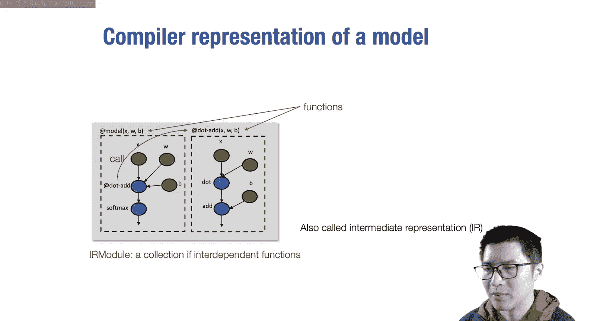

## 机器学习程序表示

通常，一个典型的机器学习程序可以表示为我们称之为**模块**的东西。机器学习程序通常包含函数以及函数之间的调用。例如，这里描述了一个包含输入 `X`、权重 `W`、偏置 `B` 和 Softmax 操作的单层神经网络。这就像一个我们描述的单层 Softmax 分类神经网络。

通常，这种格式也称为**中间表示**，这是编译器中的一个术语，用于表示编译过程中的中间代码。这个方框称为 IR 模块，包含一组相互依赖的函数。

关于大多数机器学习模型的另一个需要注意的点是，这里的每个中间数据都是高维张量或多维数组。因此，你可以将其视为与我们之前描述的计算图没有太大不同，只是它在某种程度上稍微更通用。函数可以对应于你编写的实际程序函数，而中间数据可以是我们正在处理的张量。

大多数机器学习编译器所做的一件事是，我们尝试获取表示计算的 IR 模块（通常是对应于原始模型的张量计算），并进行一系列转换，从而将高级模型转换为可直接在目标环境中运行的东西。

---

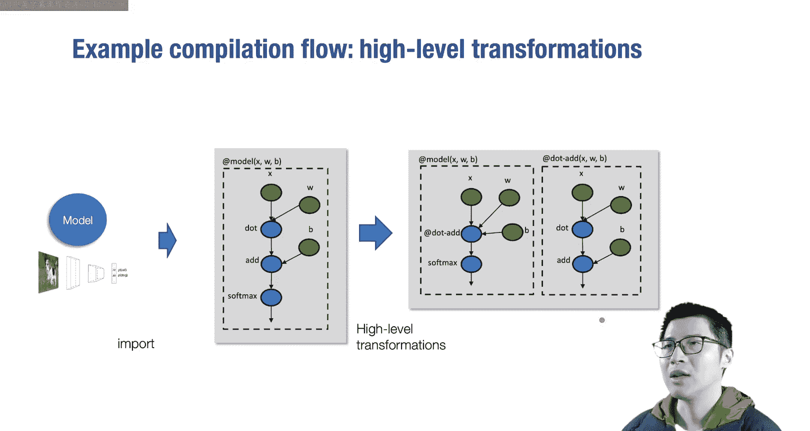

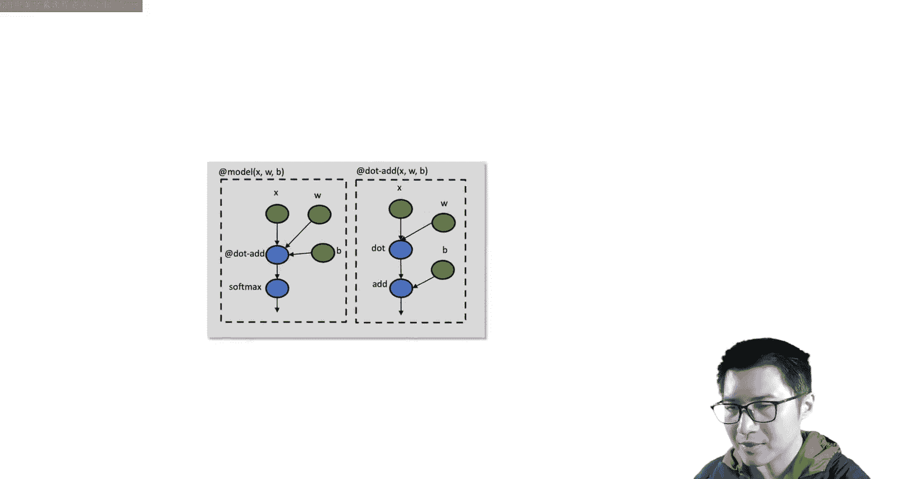

## 机器学习编译流程

对于一个给定的机器学习模型，让我们来看看一个可能的机器学习编译流程是什么样的。

首先，我们将从原生框架（如 `needle`）导入该模型，生成一个中间 IR 模块，用于表示这个特定的机器学习模型。在这个例子中，它是一个包含输入 `X`、权重 `W`、偏置 `B`、矩阵乘加操作和 Softmax 操作的单层神经网络。

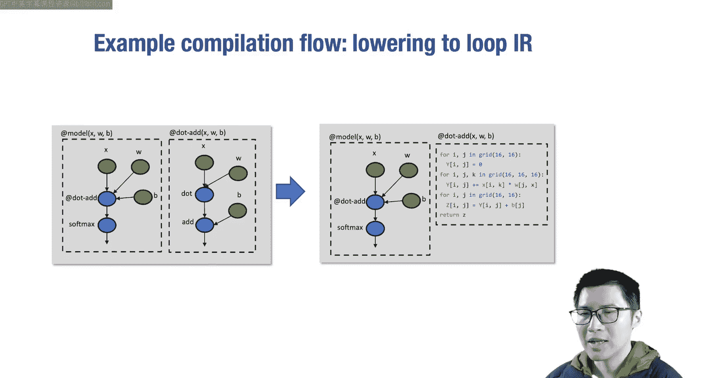

在有了这些 IR 模块之后，我们可以在这个模块上运行高级转换。例如，我们可以尝试将左侧这部分计算转换为右侧的单个 `dot_add` 函数。这种转换通常称为**运算符融合**，它允许我们将原始计算图的一部分融合到一个独立的函数中。

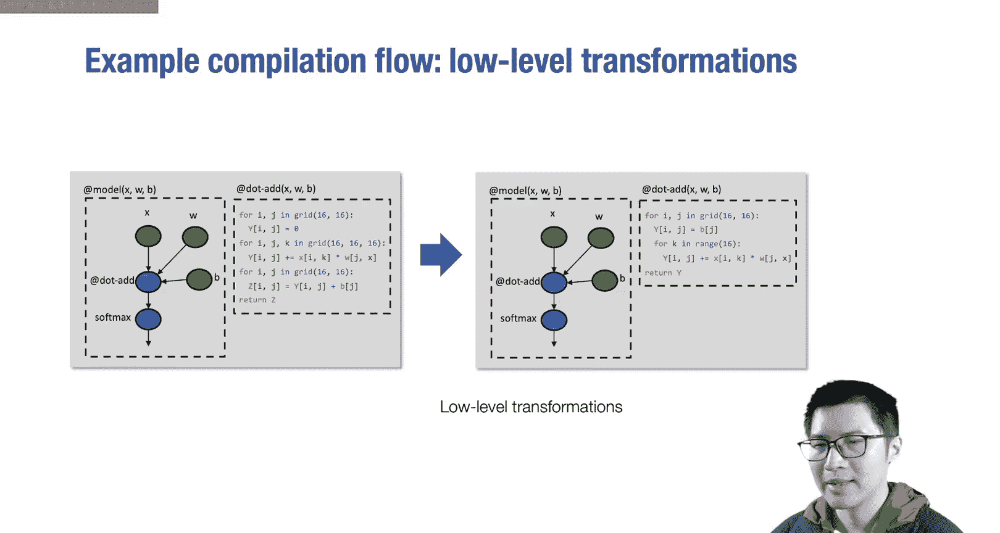

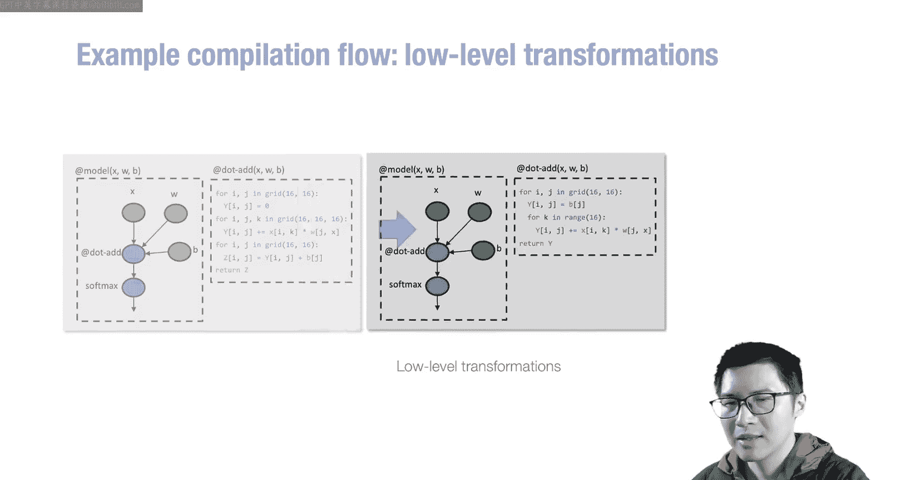

接下来，我们可以做的是，实际上获取这些融合后的函数，并生成一个执行矩阵乘加的单一 GPU 内核，从而节省整体的 GPU 计算内存。

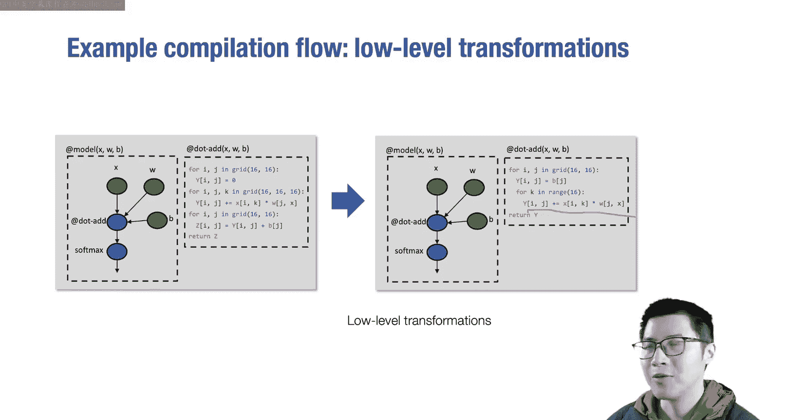

除了这种运算符融合，还可以在计算图上进行其他类型的转换。例如，在某些情况下，如果我们有归一化层（如批归一化），我们能够将其转换为原始计算上的移位和缩放加法操作。还有其他情况，我们可能能够转换数据的布局。特别是在卷积神经网络中，我们知道有不同的数据布局方式，例如将通道维度放在高位或低位。在不同的硬件平台上，这可能对执行效率产生不同的影响。因此，我们能够对这些高级计算图进行转换。

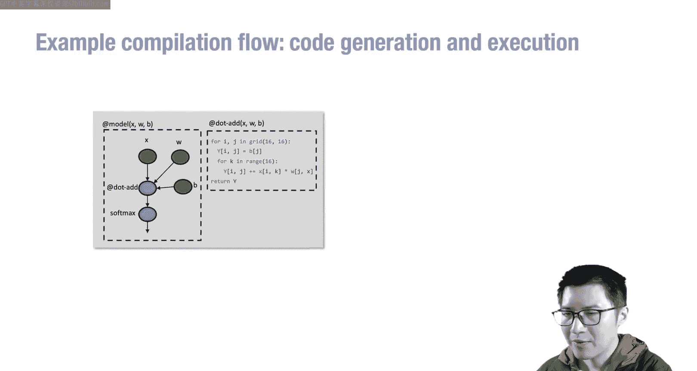

另一个可能的转换是，有时当我们有并行计算路径时，我们可以融合某些并行路径。

因此，在某种程度上，如果我们有这些高级计算图，我们将能够以不同的方式进行转换。所有这些都发生在我们称之为**高级表示**的层面。

---

## 低级代码生成

一旦我们完成了一些高级计算转换，许多机器学习编译器要做的一件事是尝试**降低**或翻译部分计算到稍微更低级的表示。

在这种情况下，我们可以做的一件事是将右侧的 `dot_add` 部分翻译成我们称之为**循环嵌套**的东西。循环嵌套表示的优势在于，它更接近底层硬件。我们将能够以循环的形式编写代码，并且在某些情况下，我们将能够运行所谓的**循环嵌套转换**，以生成和转换循环嵌套，使其适应底层硬件后端。

一旦我们有了这个循环嵌套，我们就可以想象可以直接将其翻译成 C 代码，或者在某些情况下，甚至可以将其翻译成移动设备的代码。因此，循环嵌套 IR 是我们能够为底层硬件生成加速代码的一种方式。

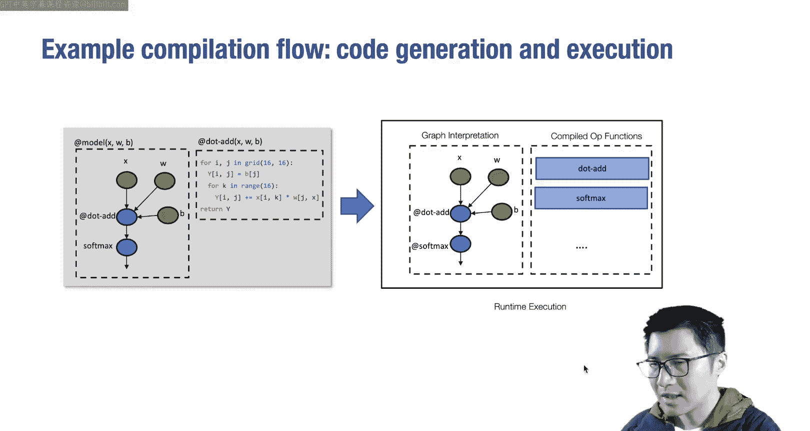

在循环嵌套和转换阶段，我们可以继续进行一些低级转换。例如，我们可以尝试通过将偏置操作融合到初始赋值中来执行运算符融合。在这种情况下，你可以发现这是一个循环嵌套加法。我们可以尝试识别这里的赋值操作，我们可以交换偏置设置，即在执行矩阵乘法之前先进行偏置赋值。这是一种我们可以执行的底层循环转换。根据你执行的转换类型，你可能会获得不同的执行效率。这就是自动化代码生成方法出现并变得有用的地方。

一旦我们转换出这个低级循环，最后人们要做的一件事就是进行**代码生成**。这个低级循环将变成我的运行时环境上的一个编译后的运算符。当然，我也可以有一个 Softmax 的编译器，或者提供一个预定义的库实现。

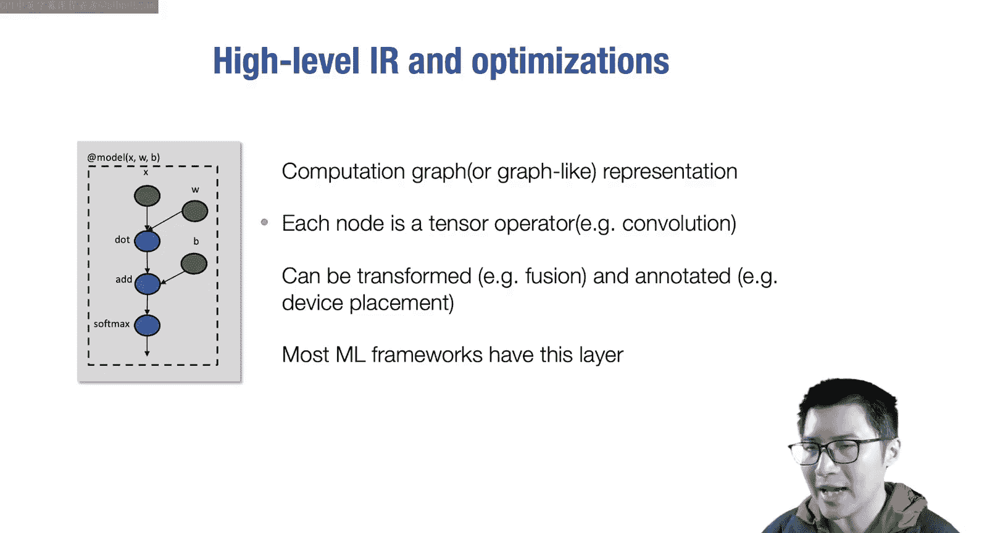

在这种情况下，除了这些编译后的运算符函数，我们还可以有一些表示来帮助我们解释计算。许多生成的结果将包含类似编译级别的东西。你会发现它描述了整个计算过程。这意味着我们将接收 `X`、`W` 和 `B`，调用这个 `dot_add` 函数，获取结果，然后调用 Softmax 函数并获取结果。最终，输出将是我们运行时执行的输出。因此，这实际上是我们的整体运行时环境，也是编译器输出的最终产物。

根据方法的不同，也可以是将此图解释直接转换为完全编译代码的方法。例如，你也可以将此函数转换为一个完全编译的 `plus` 函数，该函数调用每个特定的运算符。

到目前为止，我们已经走过了机器学习编译器可能的生命周期。我们将能够转换高级机器学习模型，对高级中间表示进行一些转换，将部分内容降低为循环程序，将循环程序转换为编译后的运算符，然后在运行时环境中，能够接收这个组合的编译运算符和整体计算图，并进行端到端的执行。

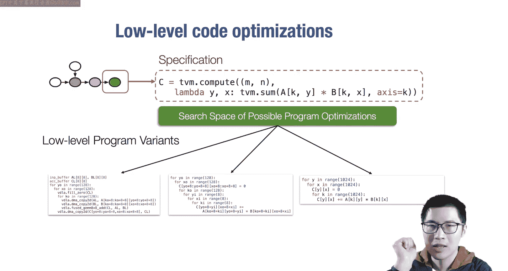

当然，人们可能会问，这与原始的推理引擎方法有何不同？在某种程度上，它们并没有那么不同。如果你看这个最终格式，你会发现这也可能是推理引擎接受的格式。但大多数推理引擎都带有这个计算图部分以及一组预定义的运算符。大多数机器学习编译器的关键特征之一是，有时这些操作中的一些将从这个中间表示自动生成。

因此，一方面，你可以将机器学习编译视为一种实现高效模型部署的方法。事实上，我们今天讨论的技术正在被整合到远程部署解决方案中，如 TensorRT 等。当然，编译技术也不仅限于推理工作负载，我们也可以想象将相同的技术应用于加速训练工作负载。

回顾一下，我们知道在机器学习编译器中，有一个称为**高级 IR** 的层，通常也称为**计算图 IR**，因为你可以将它们视为某种意义上的计算图。每个节点对应一个运算符，接收输入张量并输出某些输入张量。我们可以继续转换这些中间表示来表示诸如运算符融合之类的东西。在其他情况下，我们还可以用设备放置等决策来注释这个计算图。

大多数机器学习框架也有这一层。因此，在某种程度上，你可以发现这个高级层也内置于大多数常见的机器学习框架中，包括 `needle`。在某种程度上，你可以将我们的动态计算图生成视为表示这个高级层的一种方式。

---

## 低级代码生成与自动优化

现在，让我们更深入地探讨低级代码生成的主题。

在低级代码生成方面，目标是能够有效地获取一个高级运算符（如整个矩阵乘法），并生成不同变体的低级程序。我们在硬件加速讲座中学到的一个有趣的事情是，循环排序和计算方式的不同会对执行效率产生巨大影响。因此，对于高级规范，例如，如果我以这种方式指定我的转置矩阵乘法，它可以对应于不同变体的低级程序。我们可以进行诸如**运算符分块**、循环模式（我们在一些硬件加速讲座中做过）等操作。在某些情况下，我们可以直接写出普通的循环；在其他情况下，我们可以使用**硬件内部函数**来调用一些由底层硬件加速的操作。因此，我们可以为一个给定的高级程序生成许多低级程序变体。

我们想要回答的一个问题是：如何有效地搜索高级程序的不同变体，并为特定的硬件后端找到最优的实现？

让我们看看低级循环表示通常包含哪些常见元素。当然，它将包含表示多维计算存储或中间结果的**多维缓冲区**。它将包含我的维度循环嵌套。当然，还有数组计算。

我们希望探索优化同一程序的不同可能性。一种方法是直接编写程序的不同变体。例如，我们可以尝试使用寄存器分块、缓存行分块等不同方式来分块循环。另一种尝试优化这些程序的方法是通过所谓的**循环转换**。

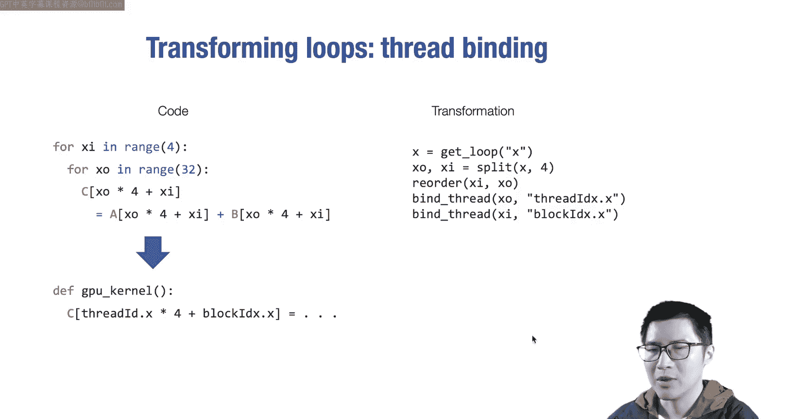

在这种情况下，我们的想法是，我们拥有代码，并且在右侧也有 API 来操作左侧的代码。例如，这是一个伪代码，通常表示转换 API。在这种情况下，如果获取循环 `X`，我将在这个操作处分割循环。效果是，它将接收原始循环体，并将其分割为外部 `O` 和内部 `I` 部分，其中内部因子 4 来自这里。因此，你会发现下面的循环嵌套与顶部的循环嵌套完全等价，只是我们使用两个迭代器来表示一个循环。当然，如果我停在这里，在某种意义上并没有太大不同，我们仍然在进行相同的前向迭代，只是使用了两个迭代器而不是一个。

但是，如果你开始在这里进行组合操作，事情就变得有趣了。例如，我们可以继续并尝试对循环进行重新排序。在这种情况下，重新排序后会发生的是，它将重新排序这两个循环。重新排序后，你会发现这实际上对应于一种不同的数据迭代方式。当然，并非所有循环嵌套转换都是可能的，这种转换实际上取决于我们正在运行数据并行计算，其中每个元素的计算都独立于另一个。因此，我们能够进行循环转换以改变顺序。

我们还可以尝试生成 GPU 程序。在这种情况下，我们可以做的是，获取重新排序后的程序，并将全局和外部索引绑定到线程和块索引。根据我们的编程模型，块和线程索引对应于流处理器内线程的索引，以及该启动组内线程块的全局索引。因此，如果我们绑定它，你会得到类似这样的伪代码，它有效地变成了一个 GPU 内核，并且 `C` 操作可以被映射到 `X_I` 被绑定到线程索引，`X_O` 被绑定到块索引的位置。因此，在这个例子中，`X_I` 和 `X_O` 分别对应。记住，`X_O` 由线程索引映射，`X_I` 由块索引映射。因此，一个有趣的事情是，通过对原始程序运行转换，我们将原始程序（通常如果你有一个循环，它只能在 CPU 上运行）转换为一个可以在 GPU 上启动的内核。这难道不神奇吗？通过程序转换，我们能够转换程序并将其变成可以在 GPU 上执行的东西。

我们可以使用类似的方法生成不同变体的转换，其中每个变体转换对应于程序的不同实现。其中一些可能比其他更高效。

---

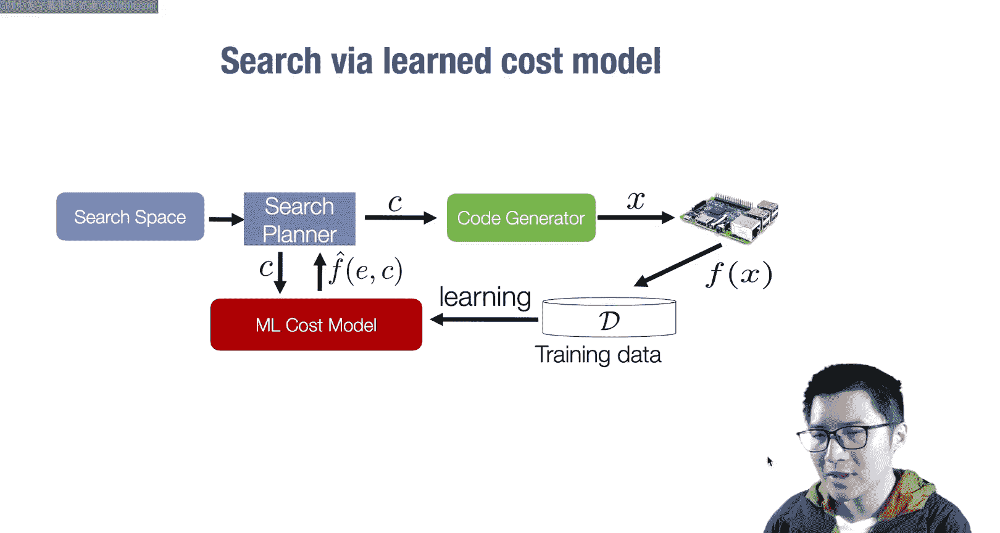

## 自动程序优化

这就引出了我们所谓的**自动程序优化**。其思想是，我们希望构建一个机器学习编译器，尝试此处不同的转换序列。例如，我可以尝试用 8 代替这里的 4，那么在这种情况下将变成 8x16，从而生成不同的程序变体，并希望能够进行自动搜索，以找到机器学习运算符的可能实现。

这是一个自动化机器学习编译器工作的高级概述。其思想是，它们将尝试生成一个搜索空间，然后搜索规划器将给出此处不同的配置。每个配置将帮助我们输出一个代码。在这种情况下，`x` 对应于一个生成的程序变体。

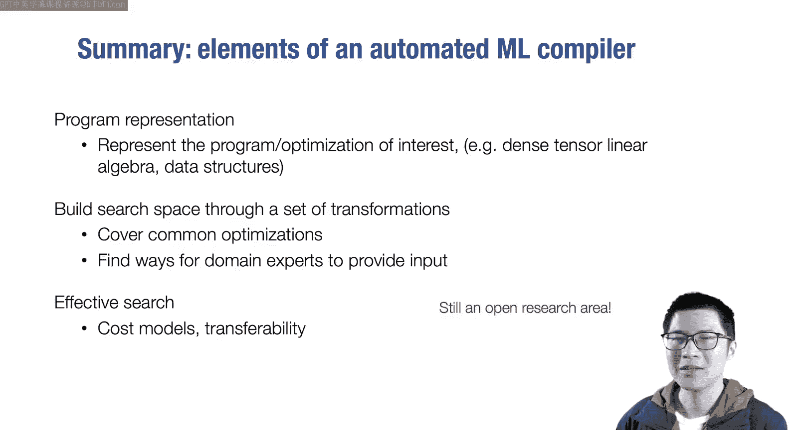

许多自动化框架所做的一件事是进行所谓的**自动调优**或**自动基准测试**。一旦我们有了这个程序，我们将把程序发送到目标设备（例如，如果我有一个移动设备），并测量该特定运行时内核在该特定设备上的执行时间。一旦我们获得测量数据，这些测量数据将被用作训练数据