# 01：课程概述 + 自动微分 + RNN语言模型 🚀

在本节课中，我们将要学习生成式人工智能（Generative AI）的宏观定义，探讨其与人工智能其他子领域的关系，并深入两个核心的技术基础：自动微分（Autodiff）和循环神经网络语言模型（RNN-LMs）。我们将从概率建模的基本思想出发，理解现代生成模型是如何构建和训练的。

## 什么是生成式AI？🤔

欢迎来到生成式AI课程。我们非常期待本学期与大家一起探索，不仅学习知识，更期待看到大家运用所学创造出有趣的项目。

首先，我们思考一个宏观问题：什么是生成式AI？在传统的人工智能课程中，我们常从感知、推理、控制、规划、沟通、创造、学习等子目标开始。这些目标似乎与生成式AI关系不大。然而，生成式AI的视角为这些传统目标提供了新的解读。

*   **沟通**：涉及语言的理解与生成，而大语言模型（LLMs）在这两方面都表现出色，尽管它们主要被训练用于生成。
*   **学习**：传统上被视为参数估计，但生成式AI展示了“上下文学习”（in-context learning）的新范式，这里的“学习”发生在推理阶段，而非参数更新。
*   **推理**：通过“思维链”（chain-of-thought）提示等技术，大语言模型能处理复杂的推理任务。
*   **规划**：已有研究将大语言模型用于具身智能体的规划任务。
*   **创造**：文生图、文生音乐等模型是显而易见的例子。
*   **感知**：多模态基础模型可以回答关于图像及其内部文字的问题；扩散模型甚至能被用作零样本分类器。
*   **控制**：例如“Daydreamer”技术，通过学习经验的生成模型来辅助强化学习。

因此，生成式AI与人工智能的众多子目标都紧密相关，并且其重要性日益增长。当然，关于智能机器的定义、目标实现以及评估方法，仍存在许多未解之谜。

## 生成式AI的实例 🎨

大家可能已经见过许多生成式AI的应用实例。

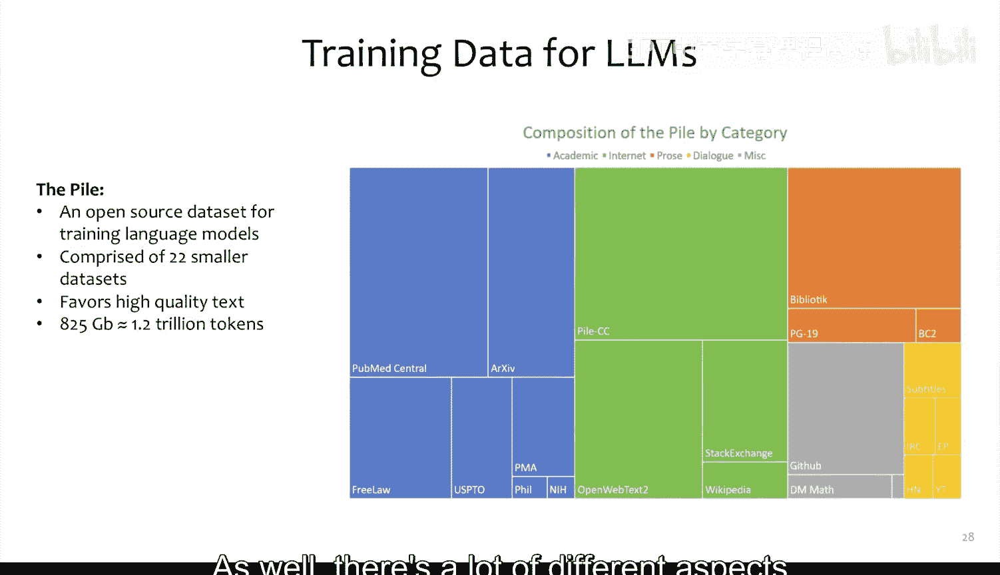

*   **文本生成**：例如，让GPT-4以莎士比亚戏剧的风格，通过两个角色对话的形式来证明“存在无限多个素数”。
*   **图像编辑**：这创造了一种全新的图像编辑方式，例如，可以抹去图像的一部分并由模型填充，或让模型为黑白图像上色。
*   **音乐生成**：虽然仍是极具挑战性的问题，但已有如MusicGen这样的模型，基于音频的离散表示，使用Transformer解码器生成多层乐器音轨。
*   **代码生成**：一个经典例子是GPT-4生成LaTeX代码来绘制独角兽。LaTeX本身调试困难，而TikZ（LaTeX的绘图包）更甚，但GPT-4能逐步生成可工作的代码。
*   **视频生成**：最近的研究将潜在扩散模型应用于生成多帧相关图像，通过时间对齐技术（如保持噪声的时间相关性，或使用跨时空的卷积与注意力层）将这些帧组合成视频。

## 构建生成式AI的挑战 ⚙️

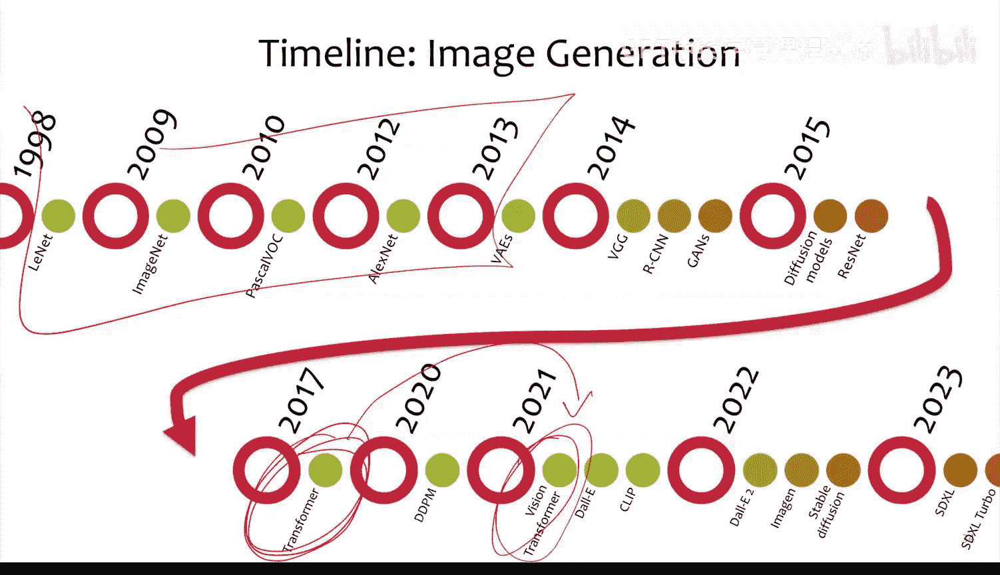

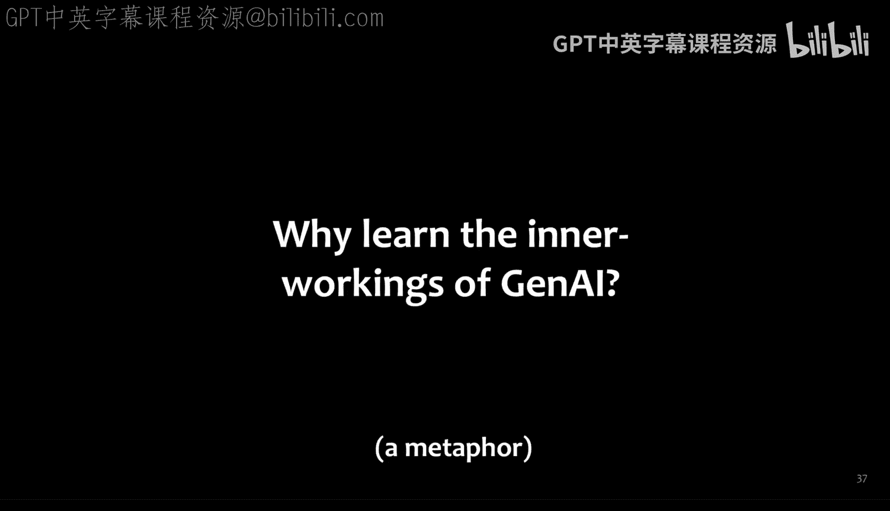

构建强大的生成式AI模型面临诸多挑战。

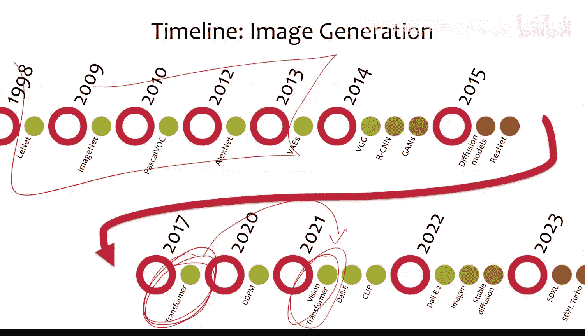

*   **数据规模与混合**：例如，开源数据集“The Pile”包含约1.2万亿个词元（token），来源多样，包括医学文献、法律文本、学术论文、网页、代码和电视字幕等。如何选择和混合数据是当前的核心挑战之一。有观点认为，某些领先模型（如GPT-4）的优势部分源于其获取了未公开的专有数据。
*   **对齐与引导**：仅靠概率训练，模型的行为可能不符合人类期望。因此，需要研究如何将奖励模型注入训练循环，以引导模型学习特定的行为方式。
*   **内存与效率**：现代模型的参数量巨大，如何将其高效地装载到有限显存（如80GB的A100 GPU）中，并理解GPU内存层次、访问速度等系统层面知识，对模型高效运行至关重要。
*   **分布式训练与成本**：模型的分布式训练及其高昂的成本也是必须面对的问题。

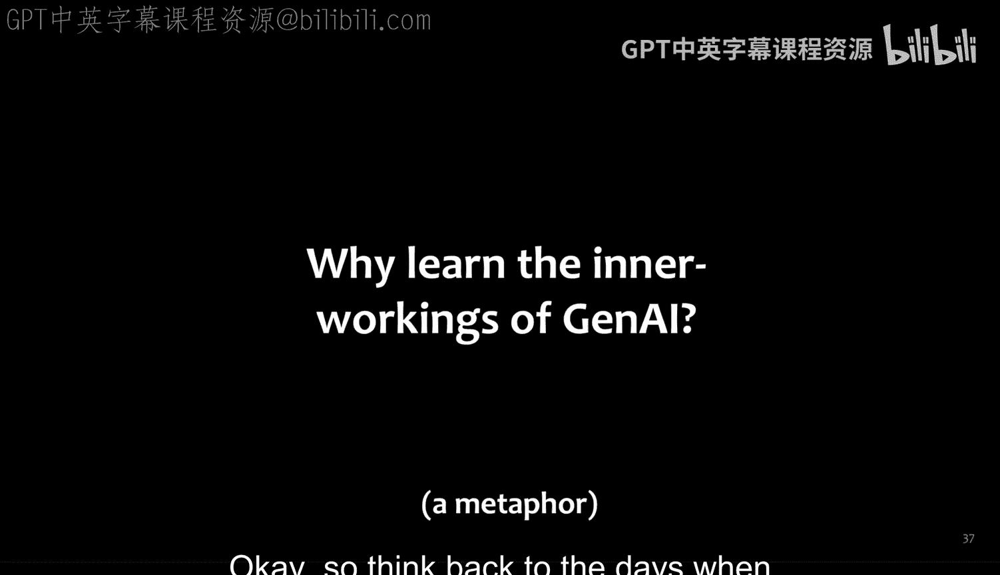

## 语言与视觉的融合 📈

生成式AI的一个有趣趋势是语言和视觉领域的融合与统一。

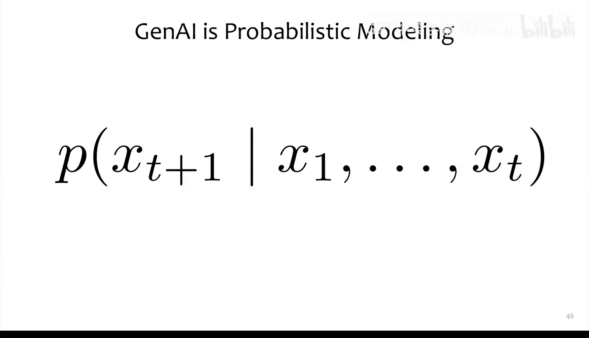

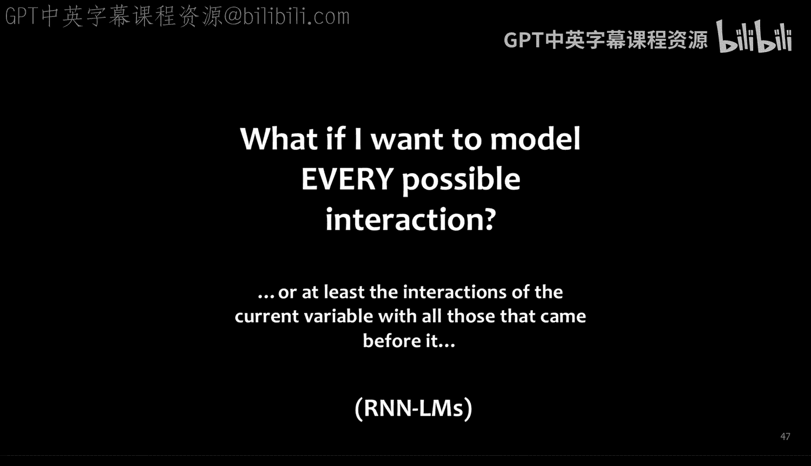

2017年Transformer架构的发明是一个关键转折点。此后，语言建模领域迅速从RNN转向Transformer。计算机视觉领域虽然转向稍慢（直到2021年Vision Transformer出现），但也已广泛采用Transformer。

这种统一使我们能够讨论跨越不同模态的通用技术。以前，语言领域多用RNN，视觉领域多用CNN，技术迁移较慢。现在，基于Transformer，我们可以更快地将一个领域的洞见应用到另一个领域，并处理多模态任务。这对本课程非常有利，因为我们可以利用这些共性，加速学习不同生成技术的步伐。

## 为什么需要学习内部原理？🔧

大家可能已经对学习生成式AI的内部原理有了自己的理由。这里提供一个比喻：回顾汽车发明之初，内燃机是新技术。亨利·福特曾设想让每个美国人都拥有一辆汽车。汽车带来了便利，但也导致了交通拥堵、空气污染和行人伤亡等问题。

有人设想，如果我们拥有一支由自动驾驶电动汽车组成的车队，或许能解决所有问题。但这需要工程师深刻理解汽车的内部工作原理，才能进行改造。

生成式AI或许不像内燃机那样具有划时代意义，但它同样蕴含着巨大的潜力，既可能带来积极影响，也可能引发问题。因此，大家需要深刻理解其工作原理，这样才能在有人提出从A点前往B点时，有能力判断方向是否正确，或许我们应该前往C点，以避免重蹈污染环境、危害安全的覆辙。

## 生成式AI的核心：概率建模 🎲

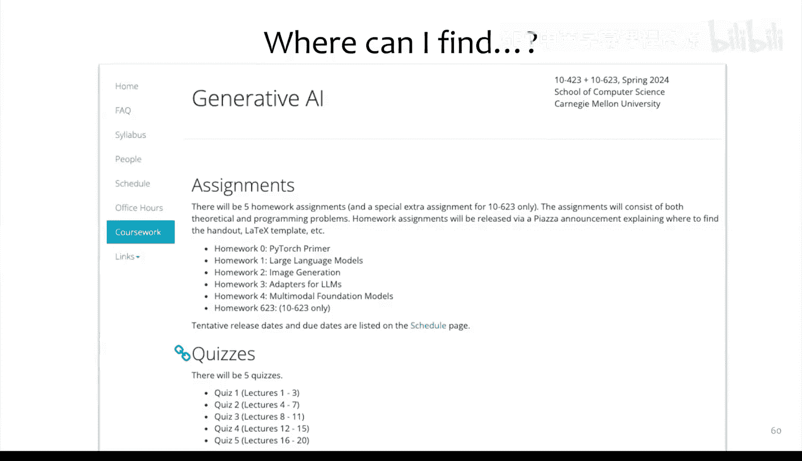

从根本上说，生成式AI就是概率建模。其核心是定义下一个观测值 `X_{t+1}` 在给定所有历史观测值 `X_{1:t}` 条件下的概率分布：

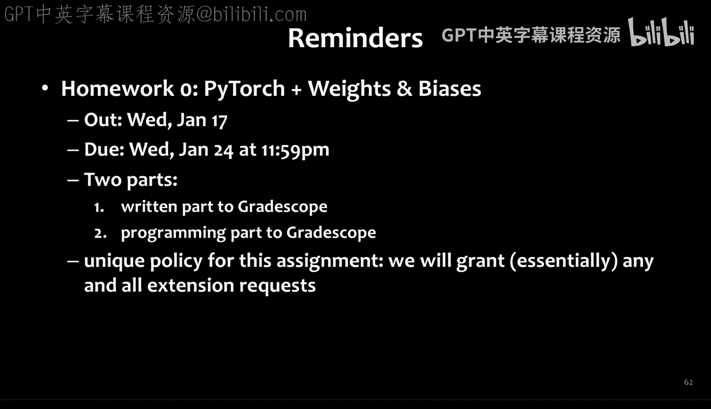

`P(X_{t+1} | X_{1:t})`

我们将花费大量时间思考如何定义这个概率分布，以及如何有效地学习它。

在深度学习时代，我们倾向于建模所有可能的变量交互，让每个变量都依赖于之前的所有变量。我们摒弃了传统的条件独立性假设，转而使用像RNN语言模型这样的架构，它直接基于所有上文进行条件建模，没有任何条件独立性假设。

## 本课程路线图 🗺️

本学期，我们将遵循以下路线图进行学习：

1.  **文本生成模型**：从基础开始。
2.  **图像生成模型**：扩展生成能力到视觉领域。
3.  **大模型适配与高效方法**：学习如何高效地微调和适配大型模型。
4.  **多模态基础模型**：探索跨越文本、图像等模态的模型。
5.  **扩展性挑战**：讨论与系统限制相关的算法问题。
6.  **模型的潜在问题**：分析生成模型可能出现的错误与偏见。
7.  **高级主题**：根据时间安排，探讨如3D建模等前沿话题。

## 自动微分（Autodiff）与PyTorch ⚡

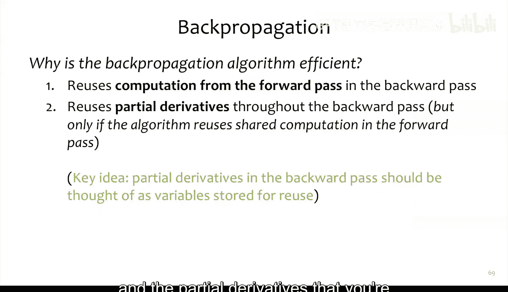

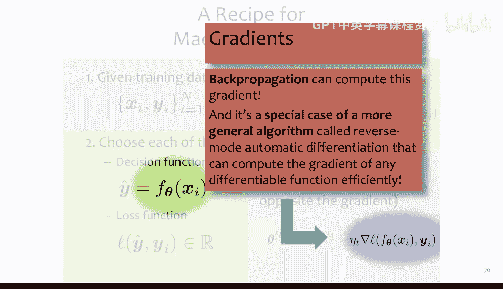

上一节我们概述了生成式AI的广阔图景，本节中我们来看看支撑现代深度学习模型训练的一项关键技术：自动微分。

反向传播（Backpropagation）是训练神经网络的核心算法。它涉及对计算图进行前向传播和反向传播两次遍历。在反向传播中，我们利用链式法则计算梯度。高效的实现方式（反向模式自动微分）不是直接展开链式法则，而是在访问每个节点时，增量式地累加梯度到上游变量。这种方式代码更简洁，可复用性高。

早期，我们需要为每个特定的神经网络手动编写前向和反向传播代码，冗长且难以复用。模块化自动微分（Module-based Autodiff）通过将计算组件化为“层”或“模块”来解决这个问题。每个模块实现 `forward` 和 `backward` 方法。`forward` 计算输出，`backward` 根据输出的梯度计算输入的梯度。

更进一步的优化是引入“磁带”（tape）机制。在前向传播时，每个被调用的模块及其输入输出被记录在“磁带”（一个栈）上。在反向传播时，只需调用 `tape.backward()`，系统便会按相反顺序弹出模块并调用其 `backward` 方法，自动完成梯度计算和传递。PyTorch正是这样实现的。

在PyTorch中，我们通过定义继承自 `nn.Module` 的类来构建模型。其 `__call__` 方法（使得对象可以像函数一样被调用）内部会调用 `forward` 并处理梯度磁带等簿记工作。参数被存储在模块内部，并由优化器（如SGD）自动管理。这使得深度学习变得非常容易，但理解其背后的原理能帮助我们更有效地使用它。

## 从N-gram到RNN语言模型 📖

掌握了自动微分工具后，我们现在可以开始构建真正的生成模型。本节我们来看看文本生成的两个经典方法：N-gram语言模型和循环神经网络（RNN）语言模型。

最简单的生成数据方法是使用N-gram语言模型。其思想是基于前 `n-1` 个词来采样第 `n` 个词。例如，一个二元语法（bigram）模型假设下一个词 `w_t` 只依赖于前一个词 `w_{t-1}`，即做出了条件独立性假设。这些概率可以通过在文本数据中简单计数来估计。虽然简单，但生成的文本（例如基于莎士比亚作品训练的模型）质量通常不高。

循环神经网络语言模型（RNN-LM）则强大得多。它利用链式法则将整个序列的概率分解为一系列条件概率的乘积：

`P(w_1, w_2, ..., w_T) = Π_{t=1}^{T} P(w_t | w_{1:t-1})`

关键创新在于，RNN充当了一个函数 `f_θ`，能够将任意长度的历史词序列 `w_{1:t-1}` 编码成一个固定长度的向量表示 `h_t`。然后，我们基于这个向量表示来定义下一个词的概率分布：

`P(w_t | w_{1:t-1}) = P(w_t | h_t)`

具体实现时，`h_t` 由RNN单元计算得出：`h_t = H(W_{xh} x_t + W_{hh} h_{t-1} + b)`，其中 `H` 是非线性激活函数。`x_t` 是当前词 `w_t` 的向量表示（如词嵌入）。得到 `h_t` 后，通过一个线性层再接一个Softmax函数，即可得到在词汇表上的概率分布。

训练时，我们最大化真实序列的似然概率。生成（采样）时，过程类似于N-gram模型：给定起始符号，RNN产生第一个词的概率分布，我们从中采样一个词；然后将采样得到的词作为下一步的输入，重复此过程，即可自回归地生成整个序列。

实践证明，即使在相同数据（如莎士比亚全集）上训练，RNN语言模型生成的文本质量也远高于N-gram模型。这引出了一个关键问题：如果我们拥有更强大的模型和更海量的数据，能实现什么？我们将在后续课程中深入探讨。

## 总结 📚

本节课中我们一起学习了生成式AI的广泛定义及其与AI各子领域的联系，并通过实例了解了其多样化的应用。我们深入探讨了构建生成模型的核心——概率建模思想，并介绍了本学期的学习路线图。

在技术层面，我们掌握了自动微分（Autodiff）的原理，特别是PyTorch如何利用“磁带”机制实现高效的反向传播，这是训练所有现代深度学习模型的基础。最后，我们对比了文本生成的两种方法：基于统计的N-gram语言模型和基于神经网络的RNN语言模型，理解了RNN如何通过将变长历史编码为固定长度向量来更有效地建模序列概率，从而生成更高质量的文本。

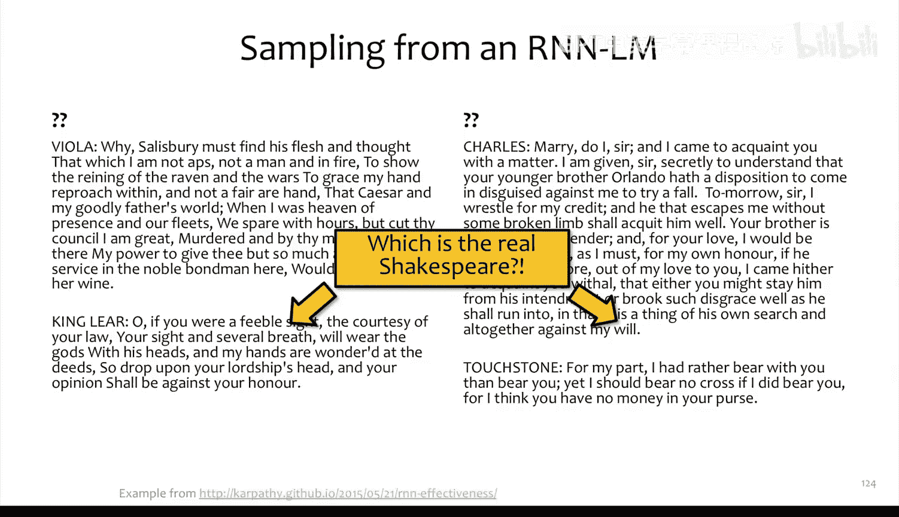

这些基础知识为我们后续深入Transformer、扩散模型等更先进的生成技术奠定了坚实的基石。